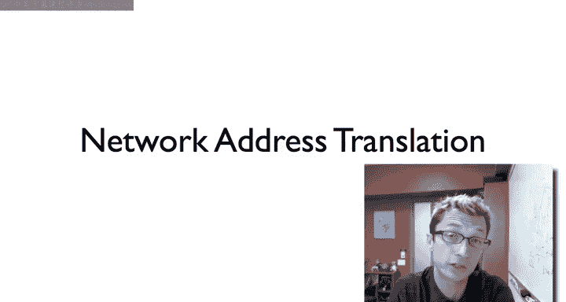
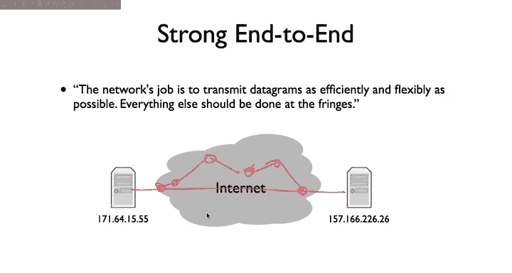
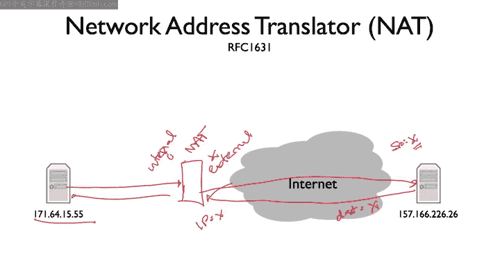
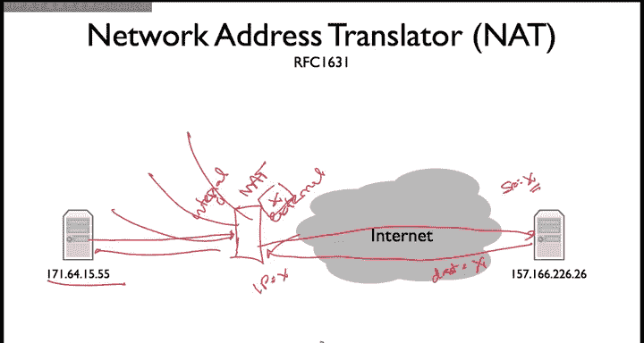
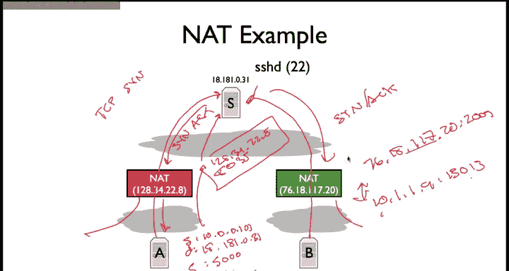
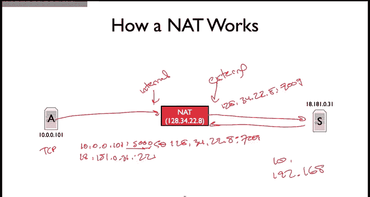
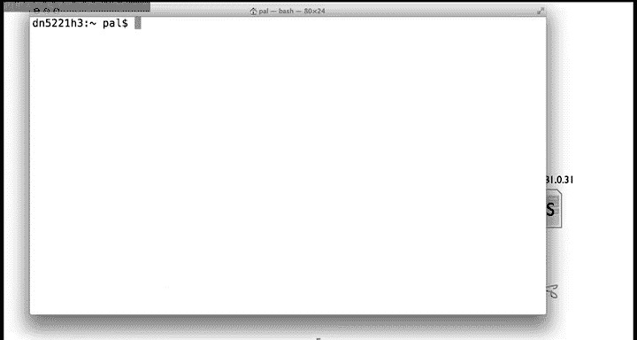
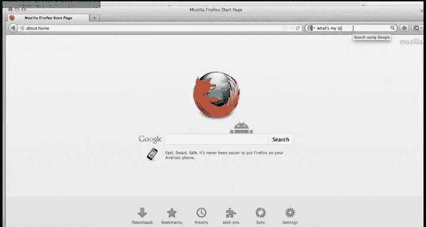
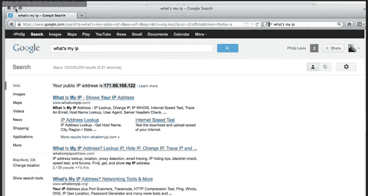

# 斯坦福大学《计算机网络｜Introduction to Computer Networking CS 144 2018》中英字幕deepseek - P68：-068-NATs   Introduction 64.zh_en - GPT中英字幕课程资源 - BV1bVqNYFEGg

So this video， we talk about the basics of network address translation and how network address translator or not works。

 So if we go back to the end to end principle， there's this idea。

 the strong end to end argument that the network's job is to transmit datagrams as efficiently and flexibly as possible。

 Everything else should be done at the fridges fringes。 So this model we'll have。

 say two hosts that have IP addresses and really all the internet should do all that the set of hosts and devices between these two nodes should do is forward and transmit their their datagrams should send it along some route。

Through the Internet， figure out the best route and deliver it。

 deliver those packets between these two hosts。 That's all the network should do。

 You want all the intelligence of the edges because that's where the action is。

 that's where you can add new things。 And when you start adding stuff in the middle。

 Then you start introducing dependencies and complexities and make the world generally a tougher place。

 So network network address translator or not。 I was first specified a good while ago。 an RFC 1631。

And so nutss are a really interesting example， a really compelling example of how。Putting something。

 putting some smarts into the network can have some really， really nice benefits for in some ways。

 have some really attractive benefits， but also introducing that complexity can cause a lot of headaches。

So essentially， what a network address translator does is it's some box that sits between you and the internet。

 like say this host on the left。 So here's our net。

And this Na has its own IP address for the public internet。 let's just call that IP address X。

And what happens is what a app does is that when a packet comes from your computer。

 what's called its internal address or its internal interface internal。

What the net does and it's that's going to somewhere out on the broader internet。

 So the net has an internal and an external。Interface is the net will rewrite your packet so that it appears like it is coming from the Nat's external interface。

 And so if the Nat， let's say it has internal interface I and external interface X。

 Well your packet might be from 1，71，64，15 to 55， then Nat will rewrite it to be coming from I P address X。

So then the packet goes to this other host， it sees a packet from X。

Maybe it's a TCP connection request or something like that， and so it'll send a packet back。2 x。

So the destination is here is the sources X， here the destination is X。

The Na on receiving this packet will know that it was actually intended for you will retranslate it。

 rewrite the packet being from to destination X to being your destination。

And then for it appropriately to its internal interface。

So this turns out to have a bunch of really nice advantages。

For example， almost all wireless routers today or basically all wireless home routers today are NAs。

The idea is that you connect your wireless router to your internet connection。

 the ISP gives you a single IP address， let's just call it X。Then internally。

 the NAT can give many machines behind it， different private IP addresses， just local IP addresses。

 and translate all of them to a single public IP address so it's a way for a whole bunch of nodes to share an IP address。

And this is what it allows you to have， say 10 machines in your house with a single IP address is a app。

The single publicly routeable I address， the Nats IP address。

 Similarly this provides some security properties is where because your I addresses are hidden behind this net。

 it actually turns to be very hard for adversaries or attackers to start opening connections to your machine。

 So it's a limited kind of firewall security protection。 So Nas are really。

 really attractive and popular。 They've got a bunch of great give you a bunch of great advantages。

 a great piece of functionality。

Now， let me walk through。A more concrete example with some my peers of exactly what's happening when you sit behind the net。

 we these two hosts A and B。And they're both behind Nats。

 and these Nats are on completely different networks。 So one of them has this IP address， 128，34，22。

8。 Southern Nat is 76，18，1，1720。 So these two people at home， different ISps。

So the first thing to note is that the Nas are giving these hosts behind them these private AP addresses starting with 10。

So if you try to send a packet to 10 on the internet at large。

 it doesn't go anywhere it's considered a private local address。

 it might go to in fact you have one to one of your private local machines。

So the Nats can share these IP address， in fact it's possible for a machine behind Nat B behind the Nad on the right and a machine behind the Na on the left to have the same IP address。

Because that IP is only valid within their small domain。

So what happens now when A wants to open a connection to let's say。

 this SSH server out of the network。So it's trying to open a connection。 Well。

 this is going to result in a TCP S packet。Now， when a sends the message。

 the source address is going to be 10。0。0。101， and the destination will be 18。 181 do0。31。

The source port is going to be some port that is designer， and let's just say 5000。For simplicity。

 the destination port is going to be 22。Now， when this packet traverses the Nat。

 the Nat is going to translate the network address。

 it's going to rewrite the network address so that rather than coming from 10。0 to 0101。

 the packet is going to be coming from 128。 34。 22。

8 The destination will remain the same the destination port will remain the same。

 but turns out the Na also has to rewrite the source port because otherwise what happens if two hosts behind the Nat both decide use port 5000 it can't share port 5000 So rewrite the source port to be something like8000 and 35。

This packet then goes out over the internet， reaches the SSH server。

 which sees a request from 12834-22。8 port 8035。It'll generate， say， a TCP， synac and response。

To this IP address and port， when the Na sees that packet come back in。

 it's going to retranslate that 12834-22。8-8035 to 10。0。0。101，5000 and for that packet today。

 and so it sets up a mapping between this internal port IP pair and an external port IP pair。

Similarly， when host B。Sends a packet to the S stage server。

 The Nat is going to translate its IP address in port to its own， so the B's IP address to its own。

 So what was once 10。1。1。9 port， let's say， 13013。Is going to become。76。18。117。20。

 let's say port 2009。So that then when the safe server sends this TCP S Act back。

It'll send it to this IP address port pair， which the NA can translate back to the internal IP address port and pair and deliver to Note B。

So how did this work， the nad is magically setting up these mappings。

 you know how is it managing these mappings？Well， it turns out there's all kinds of different ways Nats can operate。

 And we'll look at that in some future videos。 But the basic model is that the nett doesn't create a mapping generally until it gets a request from inside。

 So here we have the netts internal。Interface， and here we have its external interface。

So generally speaking， when the nu sees packets。Destined to the external to nodes on the external interface。

 that is the internet at large from nodes on its internal interface。 in response to those packets。

 it might generate a mapping。So in this case， let's say a is trying to open a packet to server S port 22。

 and so there's a packet coming in from 10。0。0。101。And let's say it's a TCP packet。And this is port。

 again， let's say 5000。And it's going to 18。 181。0。31 port 22。Well， then that's going to say， look。

 I see a packet that is trying to open up a connection。 What I aim to do is allocate。

For this particular internal IP port pair， an external IP port pair， so let's say 128。 34。22。

8 port7009。So it's going to create a mapping。From this，10 to0 0ta 101，5000。To 128。34。22。8。7009。

 and this is for TCP and TCP only。So then the packet will traverse， it'll look up this mapping。

 it will translate the packet， send the packet with the external IP address port。

Then when a packet comes back from the server， it's going to look up and say， aha。

 I've received a packet on my external interface， I'm going to see if I have any mappings which match it based on the protocol IP address port。

 and then if so translate the packet and rewrite it to the internal address and port。

So that's at a high level what's happeningping， turns out there's all kinds of variations and all kinds of details which we'll go into in future lectures。

 but that's the basic model， and that is maintaining some state so it can translate the packets。

 and generally speaking， it sets up this state in response to receiving a packet from a node on the internal interface requesting that's sending packets to a node outside。

And so when you connect over a wireless to your wireless router at home。

 this is what's happening when you say look up on your using your network control panel and you see what your IP address is。

 you'll see it's almost certainly a local private address， either something in the 10 range or 192。

168。And then when you're sending packets out to say servers on the internet。

 then that is translating them to its own public IP address and port。

And so， for example， let's look at my， my I'm not here my office。 So if I look at my。

I P address。 So it turns out the wireless I E N1 iss the wireless interface。 You can see， In fact。

 I have a private I P address，10 33 dot 6 dot35。 So this does not go out over the Internet ours。

 is a local private address within Stanford。And so that IP address can't be used say Google servers cannot send me a packet at that IP address。

So this means that I'm sitting behind a nap。

In fact， if I type， you know， what's my IP into Google server？It tells me that my P address is 171。

66， 168，122。And so what's happening here is that I have a private I P address of。10。33。6。

35 on the internal interface of the network address translation box。

And the external interface of the network address translator is 171，66，16822。

 so when I issue a connection request to Google servers， this is the IP address they see。

And they send packets this back to this IP address when the Nat receives those packets。

 it then translates them back to my own private local IP address affords those packets。

 the connections set up。So these are everywhere， and you should probably try this at home。

