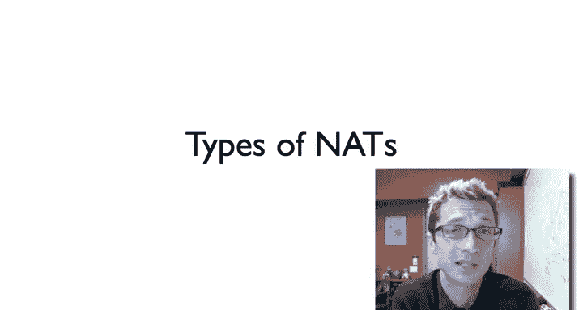
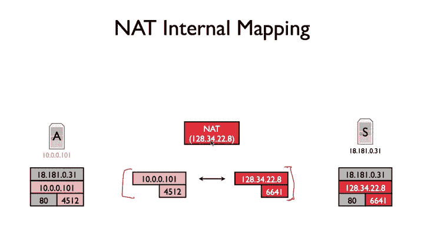
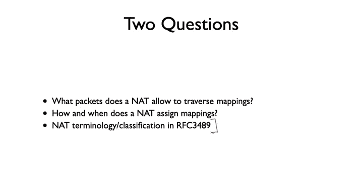
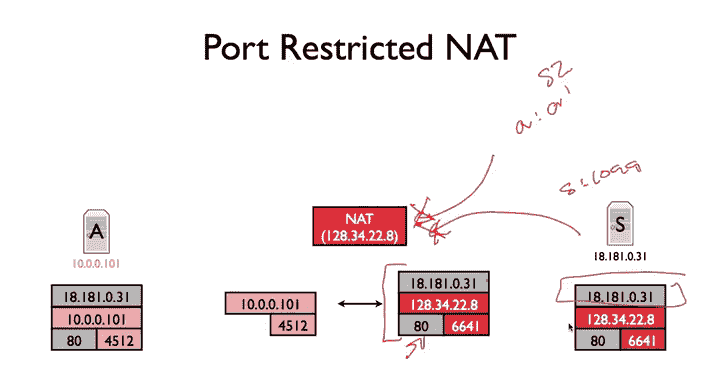
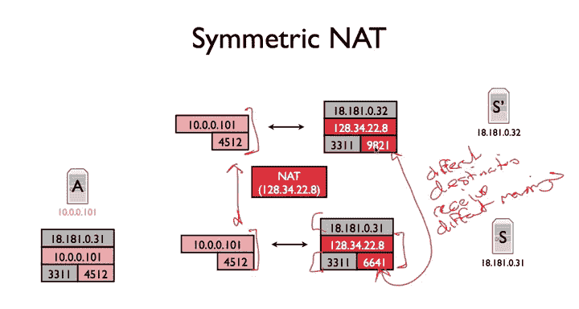
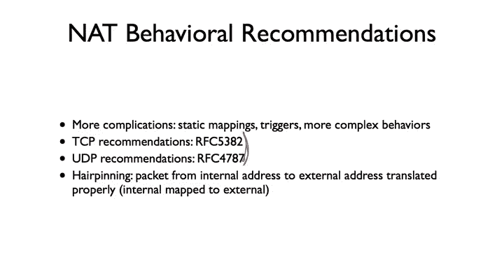
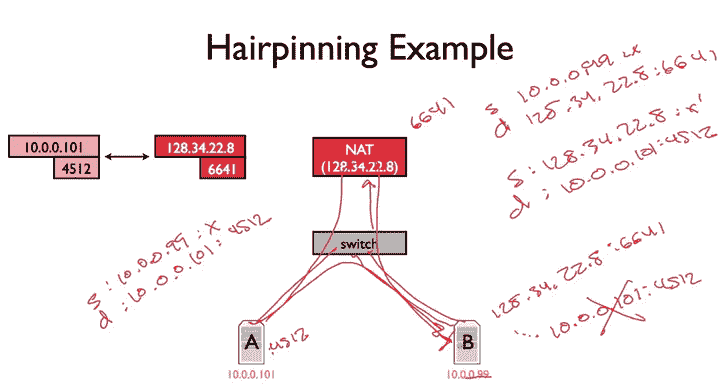

# 斯坦福大学《计算机网络｜Introduction to Computer Networking CS 144 2018》中英字幕deepseek - P69：-069-NATs   Types 64.zh_en - GPT中英字幕课程资源 - BV1bVqNYFEGg

So in this video， I'm going to go over all the different kinds of notess or not all of them。

 many of the different kinds of knots that exist。So it seems like a very simple abstraction of translating addresses from an internal to external internal to external interface。

 Well， it turns out there's all kinds of different ways you might implement that。

 And a lot of them are deployed out in the wild。 And understanding these differences gives you a sense then of。

Why Nats can be such a complicating factor when building applications。

 So it recalls the model of a nett is that or generally the way it works is that when there's some kind of communication from a node behind the net to an external node on the Internet。

 the nett sets up an internal mapping between the a mapping。

 you internally to it in in its memory between an internal。IP address。

 an associated port to an external IP address and port。

And so when this server A tries to open a connection to the web server on S at 18181031。

 so it's going to port 80 on this host and it's coming from port 4512。

 the Nat rewrites that say all of those packets， including TCPC and then all the data packets to be coming from its own IP address and port 6641。

 that's what the server sees， and then when the server sends messages back。

 the NAt translates them back to port 4512。

So that's the simple model。 And there are two basic questions that come up first is。

What packets does it not allow to traverse these mappings？

The second is how and when does an not assign these mappings， when does it create them。

 So I said when you generate packets， but turns out it can be a little more complicated than that。

 like when does it tear down those mappings， it doesn't keep the mapping forever。

So it turns out there's a nice RFC that sort of goes through some the classifications and terminology I'm going to use in the rest of this video 3489。

 so if we want to read a little bit more about some details and the precise way these are laid out。

 take a look at RFC 3489。

So the first kind of na is what's called a full cone net。

 And this in some ways is the one that plays the nicest。

And a full cont is called is called that because it is the least restrictive in terms of what packets it allows to traverse a mapping。

In that way， it's a full cone and sort of the things which are allowed in are large。

And so the basic mode of a focon nod is that any packet。

That say this is for the particulars say particle TCP， any TCP packet。

That comes into the not to this I P address， port pair。Will be translated to this IP address。

 this port pair， regardless of what the source address and source port are。

 So is the least restrictive。 So if I have some other server say S2 that has you know some IP address A。

 and it's sending a packet from port A prime。And that packet with source a sourceport a prime is sent to 123422。

8 port 6641， then that will translate it。 and my server my host here will' see something coming from a a prime arriving at port 10。

 0 to 0。101 port 4512 No it might discard that packet might send an ICMP error。

 But the point of the Na will do the translation iss the least restrictive if it's a full cone。

 So addition to full cone nodes。 There are also restricted connots。

And what restricted cont does is it filters。Based on the source IP address。

 So in a restricted connett。The net will translate packets that come from the same source address as is intended on the external mapping。

 So when the net sets up the mapping between the internal address and port pair and the external address in port pair。

 it includes the address of the other endpoint。And so in this case， if I have S2。

 which tries to send a packet from a colon， a prime address， A， a prime。

The NA will not allow that packet to traverse， it'll discard that it'll either send an ICMP error or generally will not translate that packet and host A will never see it。

However， if server S。Were to send a packet from IP address S。

 And then let's just say port let's say port near 10099。

That will be able to traverse the mapping in the sense of it's coming from 18 tot 181 to 0 to 31。

 And so host A will see a packet from 181，81，0，31， port 1099。And'll come in destined to 10。0。0。 101。

 port 4512。That's a restricted con net。It will filter based on the API P address， but not the port。

 So the last kind of an nad or of these three major classifications is a port restricted netd where it behaves like a restricted cone。

 except it also filters on port。So in this case， when a packet comes in from some external host to 12034-228-6641。

 the that is storing also what the expected IP address and port are。

 and so in this case if I again I have some server S2 that tries to send something from a a prime。

And that will not translate that that's seen as an error and ICMP， et。

 and we're out to host whatever error it thinks is correct to specify， depending on the conditions。

 but similarly， if server S tries to send a message from port 1099。

That will not traverse either because it doesn't match the port in the mapping。

 So only packets from this I P address port pair 181，81，0，31。

 port 80 will be allowed to translate to 10 0，0，1，45，12。 So only this particular pair。

Can traverse the mapping。So the last and the final kind of knotd is something called a symmetric knot。

And what makes a symmetric net different is not only is that， first of all， it's sort of。

 by definition， port restricted， but there's the fact that。

Packets coming from the same source address and port internal to the NAT。

That are going to different destination addresses and ports are given different external address port mappings。

So look at this figure'll see what I'm saying。 So here I have host a。

 and it's sending packets from 10。0 to0。101 port 4512。And first it's sending them to 18181031。 3311。

 so the Nat sets up a mapping。And the mapping between this internal address port pair and this internal address port pair。

Is 128，342286641。And so packets that A sends to port 3311 on this IP address will be translated to have this IP address in this port。

However， if a sends packets to a different external IP address and port， like。

 let's say even the same port and I address differs in  one B。

 So it's also sending packets to S prime of 18181，0，32 port 33，11。

 the Na sets up a completely different mapping。 So even though。This port address pair is the same。

For both of these streams of packets。The fact that the that the destination port address pair is different means the net sets up a separate mapping 6 port 66。

41 and port。9098，21。 so different。Destinations。Receive。Different mappings。So turns out that。

 and this is just to give you one concrete example of ways in which Nats can really disrupt applications。

 So let's pretend that。Hoste is sending UDP traffic。

 and this UDP traffic is for a massively multiplayer online game。 So this is a true story。

 a friend of mine who was working on the service for this one that happened。 is back in the late 90s。

 and he had made an angry call to Linux Na developers。

And so the issue is that this massively multiplayer game runs on many servers and there's times when somebody runs from one island to another or and they need to change which server they're on。

And so what the system would do is we would tell the client， oh， okay， hey。

 you've been talking to server 18181031， you should start talking to server S prime at 18181032 on this port。

 even the same part doesn't matter。Like here I say port 33。

11 and both of them we're want to talk port 3311。 So hey。

 please start trans talking on this other to this other host。And the issue is that the not。

 the symmetric knott would create a new mapping。 and so S was seeing the client covering from port 6641。

 but now suddenly the client is covering from port 9821。

And there is no way for the system back here to know that because the not just sets this up and it can arbitrarily decide so the connection breaks the observed behavior with that because there was a symmetric nott that whenever someone would try to migrate from one server to another。

 they would disconnect。 So here's an example of by adding this smarts into the network。 Suddenly。

 you're seeing a behavior different from the simple strong end to end argument。

 and there's this added behavior， which is really hard to manage and really hard to take into consideration because there's no way really for S prime to know the port 9821 is the port that a is going to start communicating on。

So this is just the most basic overview of some ways in which NATs can differ in their behavior。

 it turns out that there's many more complications。

 all kinds of different things NAATts could do and that RF I mentioned earlier， in fact。

 goes through all the really diverse behaviors you saw when NAts first became popular before there was really standardization of what should happen。

There's all kinds of things like static mapping as you can tell the Na hey。

 just set up this static mapping between the external host IP port pair。

 my external IP address and port then to an internal one this is say if you have a web server behind your net。

 you can tell it hey anything that comes to port 804 to this server on port 80 you have things like triggers if you see packets going out in one direction then also set up this additional mapping this is really useful some of the early days of First personson shooters online games where again they had been built in that's in mind there's really diverse Na behavior there's all kinds of more complex things that happen。

But so it turns out because of all of the headaches and messes that NAs are creating applications。

 the IETF went and came up with a bunch of recommendations as to how nat should behave。

 So the general behavioral recommendations specified in RF 55，53，82 for TCP and 47，87 for UDP。

So just to give you one example of kind of some of the weird edge cases that a knot can consider and some of the things that are specified here。

 I'm going to talk about hair pinning， which is this process of what happens when you have a node that's behind your knot。

And it sends a packet to one of the external interface port pairs that the nett has。

 one of its mappings。So basically I have a node that's behind the Na and is trying to traverse one of the Nas mappings。

 So here's the example， I have this Na 1283422。8， and I have host A and B that are behind the knot and they're both connected to a switch。

All so A has port has address 1000101， B has 1000 and 99。

 and let's say we're doing some kind of IP telephony， which is coming from port。

 this is UDP traffic so it's port 4512 on Hos A。So it's using port 4512。

 and this is translated to port 66，41 on the Na。So the question is。

 what happens when B tries to send traffic to 128？34，22 do 8 port6，6，4，1。Basic question is。

 so the knot is going to arrive with a knot and the not is going to translate it。

 It's going to translate this， assuming that it is a full cone nu。

 It's going to translate this to 10。0。 101， port 4512。

One question you can ask is that well it's going to translate the destination IP address in port。

 What should it do to the source IP address and port， should translate that as well。

 that is should this packet arrive at a seemingly coming from 123422。

8 or should this packet arrive at a coming from 10。0。0。99。Well。

 so let's walk through what happens if the Nat doesn't translate the source address in port。

 So this packet will go through the switch。 Itll go to the Nat。

 The Nat will rewrite it to be going to 10 to 0。 101 to 4512。

 And so what a will see is a packet with source。10 do0。0。99。

 let's just say port X doesn't really matter destination 10。0。0。101， port 4512。

And let's say it likes this packet it wants to respond and it sends a response。

That packet is never going to reach the knot。It's going to possibly go directly through the switch。

And because it doesn't go than that， it's not going to be translated。

 So B is going to send a packet to 128，34，22。8 port 66，41。

 and we'll see in response a packet from 10 dot 0 0 101。4512。 So this break。

 this is not what you want to do。Instead， when this packet goes up to the knot。

 the knot needs to translate it。 So it comes in as a packet from。 So source。10 dot 0 dot 0 dot99。

 port x， destination 1，2，8，34，22 dot 8，6，6，4，1 needs to be rewritten to be source 1。

28 dot 34 dot 22 dot 8 with some port letes call it x prime。Destination。10。0。0。101 port 4512。

And by so doing then because now the source is coming from the nett when a sends a response。

 it'll go back up the net where the nut can retranslate it and forward it back to B。

 So it's called hair pinning through the model because you have to actually go back through this device sort of like a hair pin。

 It comes back from telephony networks as the terminology。

 And so here's this example of a very specific behavior the Nat has to have。 and if it doesn't。

 then in this little edge case where B ends up sendinging a packet to A based on an external mapping。

 if you don't do this， it will break。 So this is just one of the many tricky edge cases that Nat introduce Nats introduce in which are specified in these RFCs。

