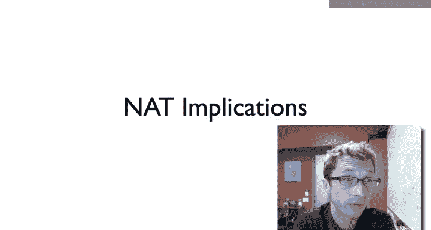
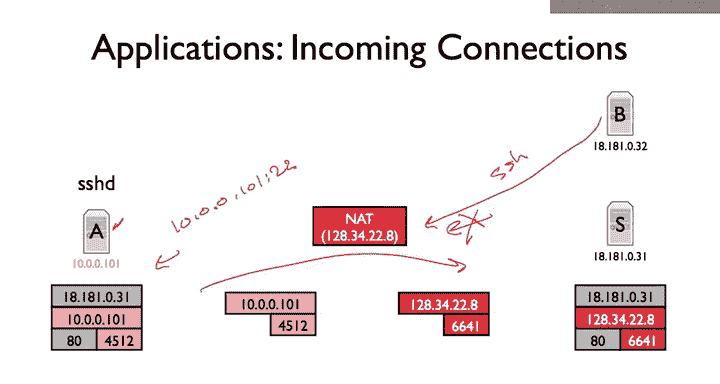
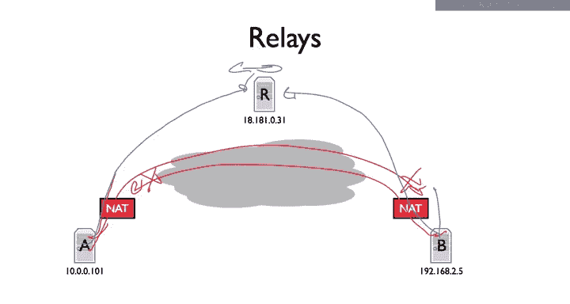
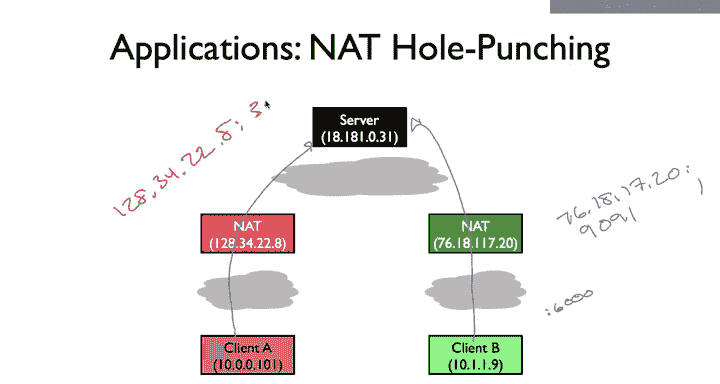
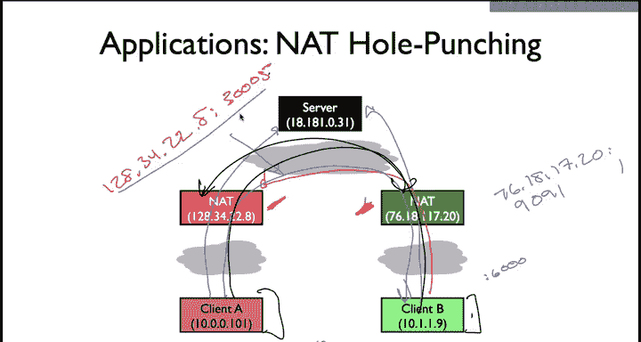
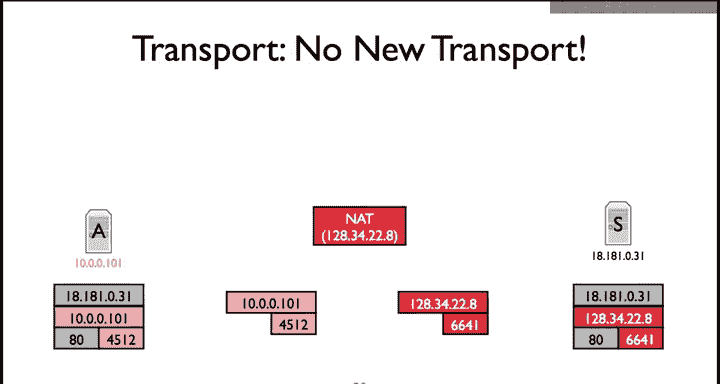
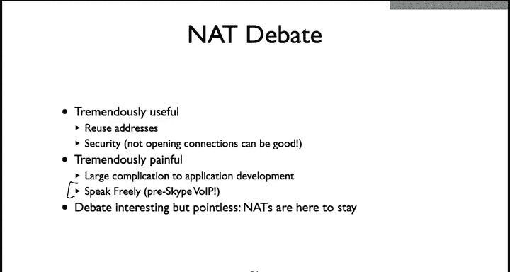
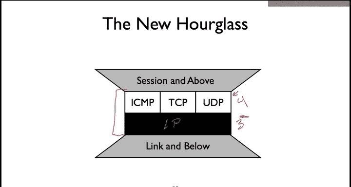

# 斯坦福大学《计算机网络｜Introduction to Computer Networking CS 144 2018》中英字幕deepseek - P70：-070-NATs   Implications 64.zh_en - GPT中英字幕课程资源 - BV1bVqNYFEGg

So nets provide a really useful service， they allow you to share an IP address among many hosts。

 which is feel useful today， given that IP addresses are becoming more scarce。

 they also can provide some other useful services such as a limited degree of security and firewalling。

 so there are a lot of implications to what happens on your behind and net so this video is going to go into what some of those implications are and how some modern applications today try to deal with them when they're obstructions。

So the first im of applications of a network address translator is that generally speaking incoming connections。

 you can't have an incoming connection， So we saw this back when we talked about Skype。

 What happens is when you want to open a call is somebody who's behind a net。

 you can't directly open a TCP connection to them because there's no mapping so let's walk through how that works。

So here we have an SSH server， or we have a server sitting behind a knot， here's server A。Um。

 and it has， it happens to be running an SSH server on import 22。And it has you know。

 opened a connection to this server S， it's browsing the web， you know， it does a web connection。

 This is great。So now what happens when host B。Wants to。Open an SSH connection to hoststA。Well。

 the problem is it's going to be sending a packet to this net。And。Whatever happens。

 somehow this packet needs to be translated to be going to 10 dot 0 dot 0 dot 10，1 or 22。

But there's no mapping for that。 S S H is a server。 It doesn't issue connection requests out。

 It receives connection requests。 And so the Nat has no mapping。

 And so because theres no mapping to 10 0 to0101 port22。

 be effectively can't open an SS S H connection， The Nat allows connections out。

 It does not allow connections in。And so this poses all kinds of complications for applications where what happens if say I'm running Skype。

 and I would like to make a phone call if the other nodes behind a not。

 I can't open that connection to that node， and so it really restricts the kinds of services that you can deploy and you have to jump through a bunch of hoops in order to make applications work when they're sitting behind knots。

But so this is the number one implication of sitting behind a net to an application， which is that。

Essentially， if you're behind a app， generally speaking other nodes unless you coordinate very carefully and I'll show some ways you can do it。

 you can't open， nobody can open a connection to you。

 So the first approach and talked about this briefly in the Skype lecture before is something called connection reversal。

 So imagine that a is sitting behind a app。

And B wants to open a connection to A。Well B cant because the Na has no mapping。

 these packs will bounce off， you get ICMPs。And so what you can do is have some kind of reversal service or some kind of rendezvous service。

We're both A and B。Are connected to the rendezvous surface。

And when B wants to open a connection to a， what it actually sends is it sends a request。 Hey， a。

I want a connection。The Rndezvous service can forward this request on。Then， a。

Can open a connection to B。 So it is called connection reversal。

 because B wants to open a connection to A， but because it can't because the not。

 So instead you reverse the connection have A open a connection to B。And to do this。

 you need some kind of rendezvous service that two can communicate。

 by they both open outgoing connections。 Rndezvous service and then requests are forward in that way。

 So this is， for example， one of the things that Skype does。

 So another approach and this also is also what Skype does is if both hosts are behind a at。 Well。

 this means that neither of them can directly open a connection to the other。In both cases。

 the connection request will fail。 There's no mapping on the net， generally speaking。

 and so it fails。So instead， to do is you have both of them。Connect to some relay R。

And then the reallylay R fors traffic between those two connections。

 So data that streams in from A's connection。R receives then forwards to the connection to B data that comes in from B's connection。

 R receives and forwards to A。But here's this example of suddenly this is no longer end to end。

 we now have introduced this additional host in the center and who knows what could go wrong。

 So certainly if you're doing this， it's good to encrypt your traffic and unless you trust the relay。

But there's a way where if both host behind a that。

 they can still open connections to one another admittedly through a third host that is does have a publicly route applied B address and which is not sitting behind in that。

So that's sort of some basic things that you can do say at the TCP level and et cetera。

 It turns out that if you really need to open up direct connections。

 there are more sort of aggressive and tricky things you can do。

 one of which is called Nat hole punching。And so the basic idea here is that we have these two clients that are sitting behind that It' client A and client B。

 and they want to open up direct connections to one another。

Or a direct connection between each other。 They don't want to go through some external rendezvous service or relay。

And so what they do is they first talk with some external server to figure out what you some to this server here to figure out what their external address and ports are。

 So client B says ahaf， I send you packets， say from UDP port  6000。

The server will then report back of the message saying， aha， well， these packets you're sending。

 I see them coming from 76，18，1，1，7，20 port 1991。So the client B knows that 10。1。1。

9 port 6000 appears externally to the world as 76， 18，1720， 1991。And a does the same thing。

So it'll find out that know， its packets look like 3422。8 port 3005， say。

So now in these cases， both clients A and B have sent packets over the Nat from this internal address port pair to an external IP address on port。

 and the Nats have created mappings， so they have mappings internally。For this internal address port。

Un let's just say that they're full cone nuts。Just for a simplicity's sake。

This means that these mappings are now active on the knots。

And so it's possible now if communicating with the server， clientient B can ask the server， hey。

 what's client A's public IP address in port？Based on that， the server could say， oh， well， it's 128。

34，22，8， you know， port 30005。Then client B。Could send traffic。To that。

Public IP address in Port pair and it could traer the app mapping。Similarly， a could ask the server。

 Hey， what's B's I public I P address in port pair， Then send traffic to 76，181720， port 1991。

 and have it traverse。The mapping。And go to client B。

This is assuming that those mappings are full con， These are full cone nets。

 let's say that they're not full cone nets。Well， it turns out you can still do some tricks where the server can tell client A and client B again what the public IP address port pairs are of the other clients。

And then the clients can try sending traffic to each other simultaneously。

And so client B will start sending traffic to 12834-228， port 3005 from its port 6000。

 simultaneouslyult client A will start sending traffic to 76 181720。

 port 1991 from its IP addressers and port。AndWhat's going to happen is that if we say had a restricted cone knot or even a port restricted knot。

When those packets， those outgoing packets traverse the nat， the Nats going to set up a mapping。

 it's going to say， aha， I see that you， client A are sending traffic。

To this external IP address and port， I'll create a mapping for you so things are translated properly。

 Similarlyly， this not on the right。 it's going to do when client B sends the traffic。

And so by knowing what the external address and ports are of the other side。

 they can force the naceical mapping。So one question is。

 is there a kind of nat or what kinds of nats would this not work for， this model where client A。

And clientient B simultaneously send traffic to the external IP address and port that map to an internal IP address and port IC's clients。

 which were determined earlier by communicating with the server。

So given with these different kinds of notess， is there a kind of nots for which this would not work？

So it turns out this will work for full code Nas， because the mappings will work fine even if the source IP address import Port are different。

 work for restricted codenots because again， we've set up these mappings which will include the external IP address of the other Na。

It'll work for port restricted knots because again these the package should be coming from the right UDP ports。

 the one class of not it won't work for is a symmetric not because when these clients talk to the server to figure out their IP address and port their external ones。

That mapping won't hold when they start talking to another not。

 So just because the server saw port 30005， when client A then tries to send traffic to the on the right。

 the Na is not going to reuse port 30005。 It's going to allocate a new external port and so won't work。

 So this is one the reason why symmetric knots are really frowned upon in the Internet today。

So we' talked about implications of NATs to applications and how they have to do things to set up mappings or either use relays or rendezvous services。

 so there's another perhaps even deeper implication of NAS， which is to transport。

So if you think for a second， for a Na to set up a mapping， it needs to know what the transport。

Protocol is。 It needs to know the transport protocols headers。 So for example。

 when it sets up a UDP or TP mapping， the Nat needs to know that this is a TCP segment。

 This is a UDP segment。 This is where the port number is in that segment。

 This is what I need to rewrite。 This is how check sums are calculated。嗯。And without that。

 it can't do it。 So if you deploy， if you say write a new transport protocol that uses a transport protocol identifier in an IP packet。

And you try to get a traverse anette and that will discard it。 doesn't know the target format。And so。

 in this way。You can't really deploy a new transport protocol on the internet today。

 so there's a chicken and egg problem where the people developing not software and maintaining the not software will not add support for a new transport protocol until it's very。

 very popular。But it won't become very popular until it works across Nas。

And so there's this sort of this debate in philosophical discussion right in sort of the early mid 2000s about how NAS mean that we're basically a stuck with TCP。

 UDP， and ICMP， to have an application work for real on the internet at large。

 it has to use one of those three transport protocols。And so really， when that's today。

 we're not going to see any new transport protocols on the internet。

And so this leads to this really big philosophical debate that's especially occurring as NA deployed in the early 200s about on one hand。

 NAs are stunningly useful。 you can reuse addresses。 there security。

 know if I'm sitting behind and at and I happen to have some vulnerable open port say my Linux machine or my Windows machine since there's no mapping attackers from outside on the broader internet can't compromise me it sort of gives this very simple very sledge hammerry but very effective just for end users security not opening connections can be good。

But。There's they're also tremendously painful， especially before NAs start to have standard behavior。

 developing applications is really hard。 Imagine if somebody calls you and says， hey。

 your application doesn't work， you know sometimes the connection drops and it could be something like it happens to be that's when their client is transitioning from one server to another and the nat is using a symmetric is a symmetric nat。

 such that the ports are being reallocated and the connection breaks really hard to debug And so one example there's this really famous example of something called speakak freely。

 which is this prekype voice over IP and basically the guy said。

 hey I'm going to stop developing speak freely because you know it just doesn't work undernas and there's no way to make them work with NAs's before people figured out all the whole punching and before the behavior is standard enough to do so。

And so there's this huge philosophical debate and now it's good and it's bad。

 they break the end to end argument， but really it's really it's very interesting。

 but turns to be pointless。 I mean， Nas are here to stay。 They're deployed。

 they will always be deployed。 Their advantages generally are considered to outweigh the disadvantages。

 People are deploy them and they want them to work and you have to work around them。

But so what this means is that we sort of historically talk about the internet as having a narrow waistted IP。

 there's a single unifying protocol which then allows you to have many transport protocols above。

 many linked protocols below。But NAts have changed that。 And so really， in a practical sense。

 the new hourglass includes not only layer 3， but also layer 4。Because for practical concerns。

 we're not going to see new transport protocols implemented or deployed。

 you can build protocols on top of UDP and that's generally what's done today since UDP just provides a nice datagram service rather than using a transport identifier at3 at layer 3 you use a port at layer 4。

 but this is the world as it is that now the new hourglass of the internet because of network address translation is IP than with ICMP。

 TCP and UDP， so you can see how this technology actually has caused an architectural shift within the internet within the past decade。

