# 斯坦福大学《计算机网络｜Introduction to Computer Networking CS 144 2018》中英字幕deepseek - P71：-071-Nats   Operation 64.zh_en - GPT中英字幕课程资源 - BV1bVqNYFEGg

So in this video， I'm going to talk about the details of how anat operates and that is the rules and recommendations that are given in terms of na behavior for handling both incoming and outgoing connections。

 possible packets that traverse as well as how an app responds when it's not acting as a app through recall that inAT network address translation box will set up mappings from internal IP address。

 port pairs for transport protocol to external IP address port pairs。

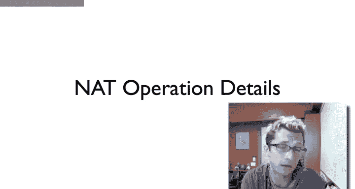

So here we have anat whose external IP address is 128，34，22。8。 and so it has an internal interface。

And an external interface。To the external world this now appears as 1283422。

8 to the internal world has another IP address， say 10。0。0。1。

Now host A can by issuing by sending a TCP connection open a S message to server S on port 80。

 then that will observe that will translate host A's internal address in port， 10。

0 to 01014512 to the external address in port 12834-22。8。

 and it's going to assign an external port in this case 6641 for this mapping。

 and'll set up this mapping。So one question you can ask is that if some arbitrary packet comes into the knot。

How should the Na respond？So now if the NA starts receiving TCP packet it's from 12834， 22。8。Sorry。

 packets 2， 1283422 day， port 6641， it should translate them。

 That's what the mapping says now it might have restrictions on that based on whether it's full cone。

 port restricted， etc。But generally speaking， packets which match this will traverse。

 but what happens if it receives a packet destined to its external address， so 128。34。22。

8 and port some random port of 55127？What should I do？Well， in the end。

 the net is itself an IP device and the fact that some of its ports。

Happened to result in translation is independent of the fact that how it would respond。

 So imagine that there are no port mapping set up that there are no internal nodes to the Na that nobody had opened any connections。

 How would the Na respond if you tried to open a connection to it。In this case。

 it'd respond as it always would， so for this particular case。

 it might do a connection refuse like a reset packet or depending on what message what packet comes in。

 it could send an ICMP error。And so generally speaking。

 the Na behaves like a normal IP device or an IP router。

 with the exception of when packets come to the external interface that have a mapping。

 or when packets traverse from the internal interface and generate a mapping。So beside that。

 if you imagine if you had no such A or B or any node behind it。

 then that behaves just like a normal IP device。So for example， many mats such as your home router。

 in fact， run a web server on port 80。So if you have a home wireless router。

 it runs web serverver and port A， which is what lets you configure it， or sometimes it's not port E。

 but some other port， but the idea is that the Na itself can respond to connections。

 whether they be for a web management interface or for other services that are perfectly reasonable and allowed behavior。

So one question that comes up when you have that is what causes you to set up these mappings so you can imagine in the case of UDP。

This is generally when a packet comes from the internal interface。Going to something external。

Then that sets up a mapping， mapping that IP address port to an external IP address port。Of course。

 the NA needs to be careful about these allocations so that it's not reusing them。ATCP。 Well。

 if you see a TCP sin。Then you notice setup up a mapping or， you know。

 you could even be a little more。A little more little more liberal and say， look。

 if we see any TCP packets coming from inside than we assume there should be a mapping and just set up the mapping。

 there's， of course， a question then is how you create mappings when do you tear them down will UDP since there is no control sequence generally these are on a timeout。

Yep。Mics are torn down on a timeout， you do need to reclaim them。

 otherwise you could run out of external ports to use。

TCP well if you see a proper thin a exchange to tear down the connection。

 then you know that you can garbage collect the connection state。

 the internet of the mapping a little more quickly。

 Of course there are some edge cases here you need to be sure it actually was discarded。

 you want to make sure that you don't enter some state where it's possible to lose data。

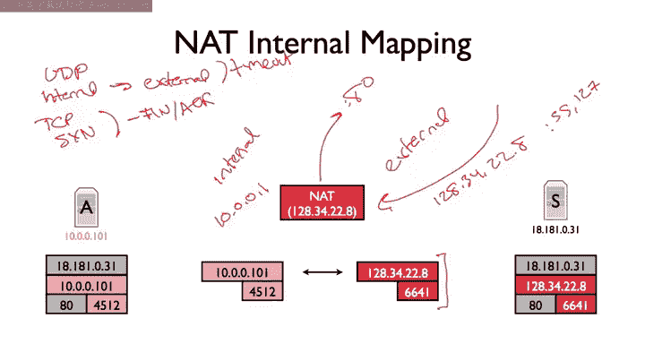

So it turns out that there are RFcs that go into detail exactly how Nat should behave and these behavioral recommendations came out after know almost a decade of experience with these devices and how they can possibly disrupt applications through strange behavior。

 So there were some early documents that tried to that tried to state based on know somebody went out actually。

 Colin Jennings went out basically to fries electronics and bought know 25 different na boxes and just。

Measured them and saw what they did and they did all kinds of crazy things。

 So based on that and based on application behavior， the ITF came up with a pair of recommendations。

 one for UDP， one for T speed is also for other behavioral recommendations on how naturally behave So UDP is specified in RFC 4787。

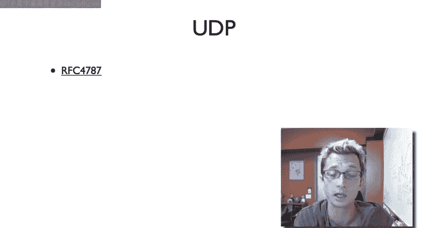

So here's RFC 4787， as you can see it's a best common practices， number 127， best current practice。嗯。

And so。

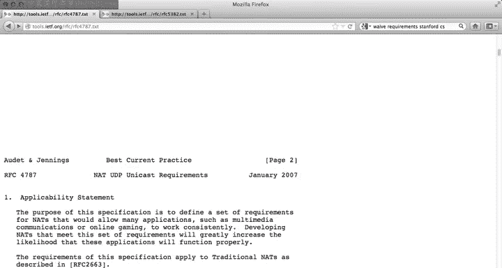

Generally speaking， these documents have serious list of but terminology。

They have a set of behavioral recommendations。

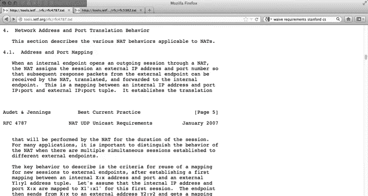

So。Here， for example， is recommendation  one requirement one and that must have an end point independent mapping behavior。

So what this means is that if we return to the terminologies to describe knots。

 what this essentially is saying in terms of that classification terminology。

 you to read through the details of the document is thatnats cannot be symmetric。

In that the mapping aact creates between for UDP between an internal IP address port and an external IP address port must be independent of what the endpoint is。

 it can't be a symmetric network where it sets up a new mapping for every external IP address in port because of all the ways in that that tends to break applications。

So here's a second recommendation。 Here's a recommendation that NAtTs have an IP address pooling behavior of paired。

嗯。So this is fornas that happen to actually have multiple external addresses。 And the idea is that。

 hey， if we can， then。UDP packets coming from the same internal IP address should appear to have the same external IP address？

So here's here's the third recommendation that requirement。

 which has to do with how ports are assigned。 So it turns out historically ports 0 to 1023 were considered system services so these were ports which only administrators or super users could bind to basically root on Uni systems so that's why you see things like HtP SMTP。

 they're all running on these low port numbers as opposed to lots of applications stuff like bittorrrent or Skype which were on high port numbers that's this historical artifact。

 but there are some sort of assumptions that applications have made historically based on this and so what one of this requirement says its just to kind of we don't break things that if the internal port is between 0 and 1023。

 then the external port be between0 and 1023 and the opposite is also true that if it's not if it's in 102465 65535。

 then the external show between 65535。So I'm not going to go through all of these requirements。

 but what's nice actually is if you read through these documents is it really gives you a sense of all of the different kinds of application expectations that there are it's nice that there are these justifications even explain like hey。

 there are applications that make these assumptions or protocols that make these assumptions and therefore the NA needs to do this so it doesn't break those applications gives you just this nice sort of a couple of points of interesting protocol approaches that happen on the internet。

Now， the TCP requirements are specified in RSC 5382。

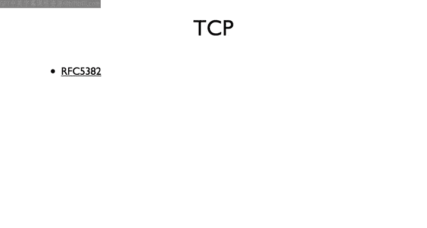

So we can see the first requirement for TCP NA behavior is very similar UDP。

 this endpoint independent mapping， symmetric knots are really bad， they break all kinds of things。

 so never build a symmetric knot， so that's requirement number one。But unlike UDP。

 TCP has connections and so and connections set up。

 and so there are a couple of requirements that come out for TCP that aren't present in UDP。

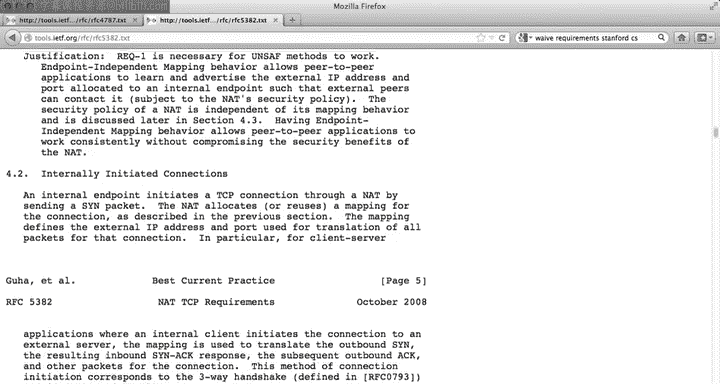

For example， and this one's kind of interesting is requirement2。

AATt must support all valid sequences of TCV packets for connections initiated both internally as well as externally when the connection is permitted by the Nat。

And the basic point here is this this sub point A that a not must handle T C B simultaneous open。

 So this gets back to the case。 you talked about Nat hole punching。

 where it can be that two nodes behind Nas say A and B。They want to open connections to one another。

 They want to open a connection through the not。 So what they do is they talk to some external server and their servers that provide the abstraction。

 things like ice。Let allow them basically do some  query responses to figure out what kind of na they're behind handle to figure out what the external IP address and port is associated with their local IP address and port。

 So based on this， both A and B can figure out given their internal address in port。

 what's the external address in port。They somehow exchange this information through a rendezvous service。

 and then both A and B simultaneously try to open TCP connections to one another。Now。

 it could be that， you know， these connections， these connections are there or the state is there。

 But the basic point is that。It can very well be that B sends a sin。Which sets up the state。

And that sin reaches A before a has set up its translation state。

 and so the sin is not going to traverse。However， the state now exists on B。

 so B now has a translation。Entry now A then opens up connection back。

 and its sin does traverse this translation， and now a can open a connection on B。

 But the thing is that this is a simultaneous open。

 B has sent a sin and the sin is outstanding in terms of the TCP state diagram。

 It it's already sent a sin。 This is the simultaneous open。

 when A And B sends sins to each other at the same time。

 So for peerto preap where A and B won to open a connection directly one another。

 It's important that a that allow this kind of TCP open。 that it's not just that ahab。

 we don't support simultaneous open。 And so therefore we're not going to allow this sin to traverse because that's an incoming sin。

 that if you have a mapping， the incoming sin must be able to traverse。

 So that's what here requirement to is say。But even more generally， it's saying that， look。

 TCP has a state diagram and that you're supposed to be able to traverse the state diagram to open a connection in any way that you want and a matchch should not restrict that。

That is that Na should not be somehow limiting the a limit the TCP implementation options。

 So here requirement 3。

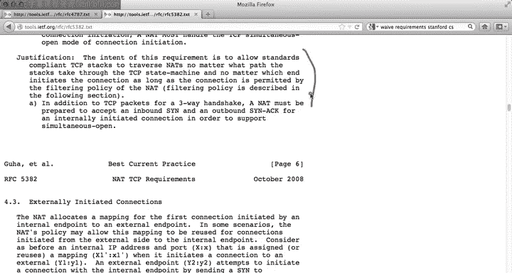

States that it should have an endpoint independent filtering behavior。

 So this is basically this is back to the terminology talked about termclassification of Nas。

 This means a full cone not that it's recommended that nats in terms of TCP be full cone。And again。

 like the UDP recommendations， each of these behavioral recommendations。

 each of these has a justification， and so it can be really sort of very。

 very sort of insightful illuminating to read through what are the kinds of applications。

 what are sort the edge cases that can make the NAts can break and you can see a lot of them relate to peer to peer in particular voiceover IP。

 all those kinds of applications where NAts work fine when simply of have a client behind the not opening connection to a server。

 but anything peer to peer where things behind NAts want to open connections to one another。

 you have to have an intelligent behavior and the not， otherwise you can break those applications。

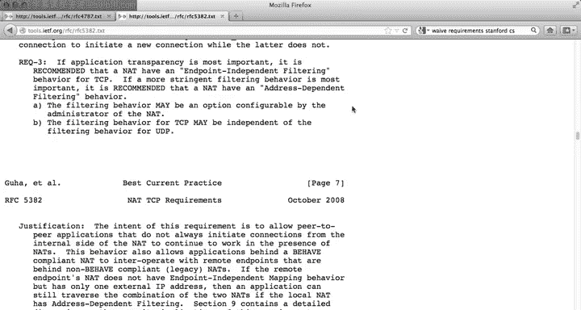

So this one requirement four is kind of an interesting edge case。

Which is that so an that must not respond to an unsolicited inbound sin for at least6 seconds。

 So here's the， here's the case why this is important。 Again， let's go to this example。

 We have A and B。That are both behind knots， and they're trying to do a simultaneous open。Now。

 it turns out that a。Ends up sending its simultaneous open well before B does， such that its sin。

Arrives before B has tried to open its connection to A。So if Bs not responds with。

Response to this unsolicited inbound sin by saying， you know， sorry， a connection refused or by。

 saying ICM ICM or whatever it wants to do， depending on the circumstances。

 The problem then is that this might come back to the na。It caused them not to tear down the state。

 And then when B tries to do its own simultaneous open。 so here would be the error。

If B tries to do its own simultaneous open， that state is now torn down and that's going to fail。

And so the idea here is that if B has to wait at least six seconds， the assumption is that B and A。

 if they're doing a simultaneous open are going to try to do so within six seconds of each other。

 that's what sort of means simultaneously， and so the NA will wait before issuing that response such that B has a chance to do its own open which could then set up the state for a。

Note in the second sentence， if during the interval and that receives and translates an outbound sin。

 it must silently drop the original the original unsolicited inbound sin。 So in this case， you know。

 inbound sin came in， it was unsolicited， but then suddenly something。

Show that maybe it was solicited。 You should just drop it。 You shouldn't issue an error。

 You can ask the question as to whether or not you should have it traverse than that。

 There would be another approach。 I actually went back and looked through some of the archives。

 And this just seemed to work pretty well。 The mailing list archives about this discussion。

 This seemed to work pretty well。 It means the math isn't enough to buffer these sins。

It solves the problem and serves the least complicated answer。

So that's just a brief overview kind of some of the internals andnas and their policies and the algorithms that they use and some of the rules that there are for their behavior to allow applications to work if this is something's interesting I totally recommend reading these RFVCs in a bit more detail。

 especially because they give these really nice descriptions as to why these behaviors exist。

 particularly for peerto peer applications。

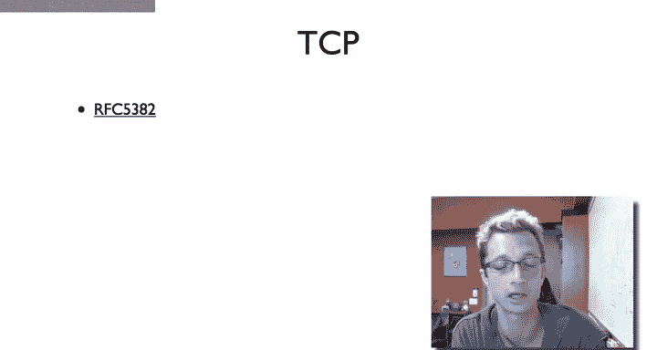

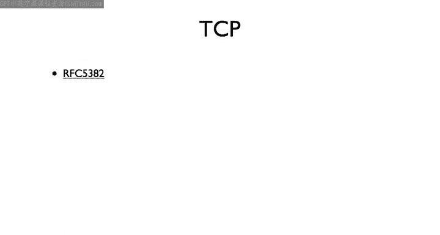