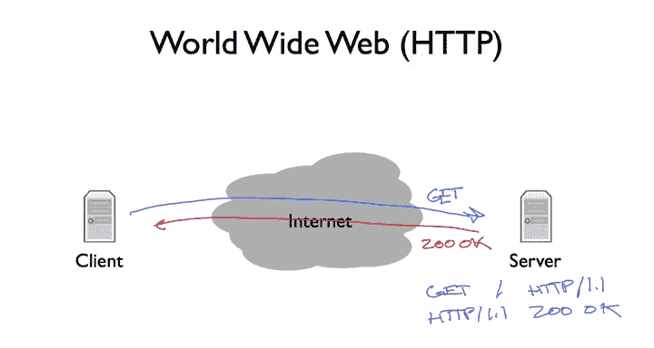
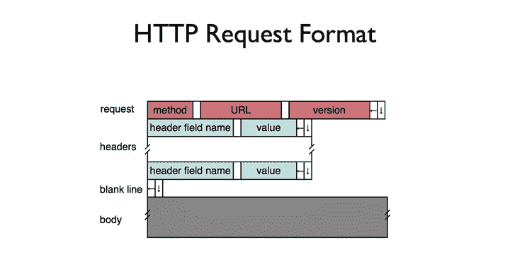
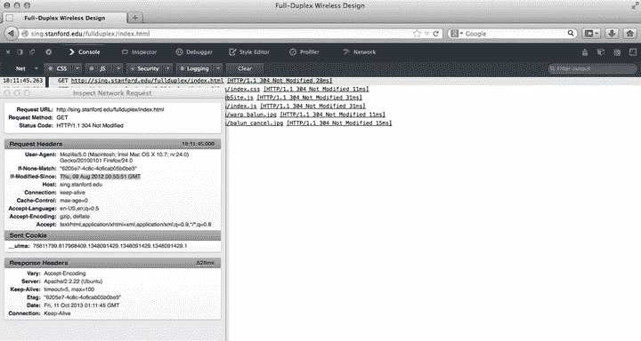
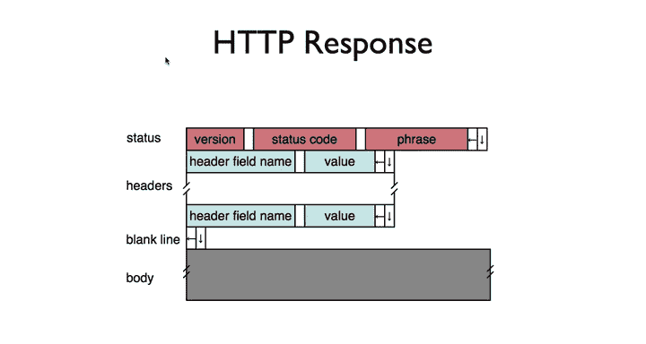
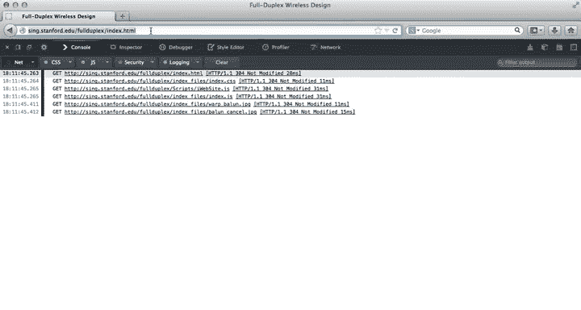
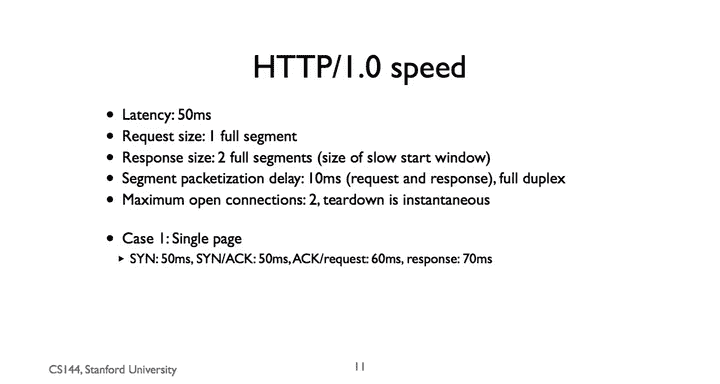
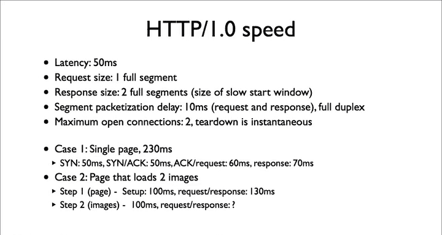

# 斯坦福大学《计算机网络｜Introduction to Computer Networking CS 144 2018》中英字幕deepseek - P72：-072-HTTP 64.zh_en - GPT中英字幕课程资源 - BV1bVqNYFEGg

The Hypertex Trans protocolcol， or ACTP is a cornerstone of the modern internet。

Originally intended transfer documents， it's now used for so much more such as streaming media from companies like Netflix and applications through scripts that your browser downloads and runs。

In this segment， I'll explain the basic conceptual model behind eachGTP and present some analytical tools for understanding how it performs。

HtTP stands for hypertext Trans protocolcol， so what's hypertext？

Hypertext is a document format that lets you include formatting and content information inside a document。

Whenever you download a web page， you're downloading a hypertext document。

Unlike many other document formats， such as Microsoft Word or PDF， Hyperteectt is all ASII text。

If you look at a document， that generally speaking aren't any characters your regular text editor can't display。

So let's take as an example， this excerpt from the Wikipedia page on ATTP's history。

It has the word history in a larger font， some links shown in blue， an embedded image。

And a few other nice bits of formatting such as the line under history that make it easier to read。

Under the covers， the document looks like this。This is the hypertext my browser downloaded to display this section。

All of the formatting information is inside angle brackets， this less than H2 greater than。

 for example， means that this is a heading so should be displayed bigger。

You can see the word history outside any such formatting information。

 the word history on this snippet is displayed as a header， as you can see。So at a basic level。

 a hypertext document is just a text document which your browser displays based on the special formatting commands and controls called tags。

IProtext link， for example， is just a formatting tag that says this stuff inside the tag。

 if clicked should load this URL。The tag that does this is the A tag。

See here for an example of the A tagag on line 227 for a link to the HTB version 0。9。

When you click on that link， it takes you to this URL， HtPwww。w3。org， po， etc。

But there's one way in which a hypertext document is more than just formatting。With hypertext。

 you can embed documents or files inside other files。

The simplest example of this on the Wikipedia page is the image。

The bits of this image aren't stored in the hypertext document that wouldn't be human readableski text。

Instead， there's a way to in a hypertext document， say load this other document and put it there。

Take a look at line 220， you'll see an image or IMG tag。

The IMG tag says load the image from this URL and display it here。

When your browser loads the hypertext for the Wikipedia page。

 it sees tags like this one and automatically request the files they reference。

So when you load the page， your browser automatically requests the image and display it。

There are all kinds of resources besides images that a web page can reference， other pages。

 style sheets， fonts， scripts， and more。Let's look at an example。

 I'm going to request the web page for the New York Times and use my browser's  developer tools to see all of the request this results in。

As you can see， it requests something on the order of 20 documents ranging from hypertext to images to ads。

In ATTP， a client opens a TCP connection。To a server and sends commands to it。

The most common command is get， which requests a page。

ATTP is designed to be a document centric way for programs to communicate For example。

 if I type htpwww。tanford@u in my browser， the browser opens a connection to the server www。

tanfordu and sends a get request for the root page of that site。The server receives the request。

 checks if it's valid if the user can access that page and sends a response。

The response has a numeric code associated with it， for example。

 if the server sends a 200 OK response to a get， this means that the request was accepted。

And the rest of the responses in the document data。In the example of www。tanfordadduu webp page。

 a 200 OKK response would include the hypertext that describes the main Stanford page。

There are other kinds of requests such as put deleteleting info。

 as well as other responses such as 400 badd requests。Like hypertext itself， ACTP is all an ASI text。

 it's human reable， for example， the beginning of a get request for the New York Times looks like this get。

Slash HTP 1。1。The beginning of a response to a successful request looks like this， HTTP 1。1。200 okay。

But the basic model is simple， client sends a request by writing to the connection。

 the server reads the request， processes it and writes a response to the connection。

 which the client then reads。The data the client reads might then cause it to issue more get requests。

This is what an HTTP request looks like， the first line ASITex says the method such as get。

 the URL for the method， and then the version of the HTTP being used。

The white boxes represent spaces， so there's a space between method and URL。

 as well as between URL and version。The left arrow means carriage or turn。

 a way to say go to the beginning of the line， and the down arrow means new line。

 a way to say go to a new line。So for example， in my prior example requesting this URL。

 the method will be get， the URL will be， say full duplex index do HTML。

 and the version will most likely be ATTP 1。1。After this first line， the request itself。

 there's0 or more headers。 There's one header per line。

 Each header line starts with a header field name， followed by the value。After the headers。

 there's an empty line。Followed by the body of the message。Wait， why might a request have a body。

 what's the body of a request？In the case of the get method to request a page， the body is empty。

 but ATTP supports other requests， other methods such as post which sends data， for example。

 when you fill out a form and submit it， post requests often have a body。

So let's see what this looks like， I'm going to request ACtpwww。ing。edu/fulduplex/index。

htm There's a web page to my now graduated PhD students wrote to describe some neat research they did in wireless networks。

I am going to open up the  developer tools in Firefox， which lets me see requests and responses。

You can see there are request for full duplex slash index DM L H P 1 by1。

 followed by a bunch of headers。 One header that's important for this request is if modified since。

 This is a way for the client to tell the server to only give the document if it's been modified since that time。

If the document has been modified since that timestamp， the server responds with a 200 OKK。

 the new copy of the document， otherwise it responds with a 304 not modified。

This header is useful when your client cachees pages， which most web browsers do。

 rather than transfer the same document again and again。

 the client can tell the server to transfer conditionally。If the server responds with a 304。

 the client just can use its cached copy。

An HTP response looks similar。 The first line has the HtP version。

 the status code and the phrase associated with that status code， such as 2000 or 404 not found。

 Then theres0 more headers a blank line in the body of the response。

Let's see what the response to my get request looks like。 It's a 304。

 This web page has not been modified。Since my browser first put it in its cache。

Now if I clear my browser cache and request the page again。

 the request doesn't have a modified S header， and so the response is a 200 OK。

The developer tools developer tools on Firefox lets you see the request response pair。

 but not their actual formats For that， I'm going to do something much simpler I'm going to use the Tnet program to connect to a web server Tnet opens at tCP connection it writes what you type to the socket and prints out what it reads So' tellnet to sing Stanfordedu 80 and type G full duplex/ indexded htmltp1。

0。A lot of HTML comes back。If I scroll to the top， I can see the HB response 200 okay with a bunch of headers。

 a new line than the body， the H of the page。 The content length header tells me how long the body is。

 H TP is a cornerstone protocol of the modern Internet when while it was originally document centric designed to fetch pages and documents today it's used for much more。

 A document， for example， can be a script that your browser executes as part of an application。

The basic model， however， of requesting URLs and receiving responses still holds。

One nice thing about HtP is that it's tune readable text。

 you can type in HP request and read the response as you saw me doing by townle to port 80。

 I encourage you to play around a bit to use the developer tools near Bowser to see what's requested and learn more about the details of the protocol。

So that's the basics of the protocol request， response， ACP 1。0 is very simple。

 a client wanting to request the document opens a connection， it sends a get request。

 the server responds to the status code such as 200 OK， the document。

 and closes the connection once the response is complete。

If the client wants to request a second document， it must open a second connection。

When the web was mostly text， with maybe be an imagem or two， this approach worked just fine。

 people hand with their web pages， putting in all of the formatting。

So let's walk through how long this takes， let's make some simplifying assumptions。

The web server can respond immediately so there's no processing in delay。

The latency between the client and server is 50 milliseconds， an H TTP request is a full TCP segment。

Response is two full segments to the size of a small initial slow start congestion window that way we're not going to have to worry about window sizes or congestion control。

The packetization delay a full segment is 10 milliseconds。

 so the total packetization delay of a request is 10 milliseconds and a reply is 20 milliseconds。

Can assume that the links are full duplex such that a node can simultaneously receive and transmit on the same link。

This means the packetization delay of a request does not affect the packetization delay of a response。

Let's finally assume that TCB segments with no data。

 such as a three way handshake and act packets have a packetization delay of zero。Finally。

 we can have up to two open connections。So let's consider a first case。

You want to load a single page， how long will this take？First。

 there is the latency of sending a sin so 50 milliseconds。There's the latency of the synac。

 so another 50 milliseconds。On receiving the sin Act。

 the client can send the act of the through a handshake followed by the request。

The request has a packetization delay of 10 milliseconds。 So this takes 60 milliseconds。

 The server then needs to send the response back。 The packetization delay of the response is 20 milliseconds。

 So this step takes 70 milliseconds。So the total delay is 50 milliseconds plus 50 milliseconds plus 60 milliseconds。

 plus 70 milliseconds or 230 milliseconds。

Let's look at a more complex example， there's a page that loads two images。

We can break this into two steps in the first step， the client requests the page。

 in the second step it uses two connections to request the images。

The first step will take the same length as our single page example。

There's 100 milliseconds for the setup， then 130 milliseconds for the request and response。

The second step is a bit trickier remember while we have separate TCP connections they are sharing the same link。

 this means that the packetization delay of one request affects the other setting up the two connections will take 100 milliseconds。

But how long will it take for the two request responses to complete？

