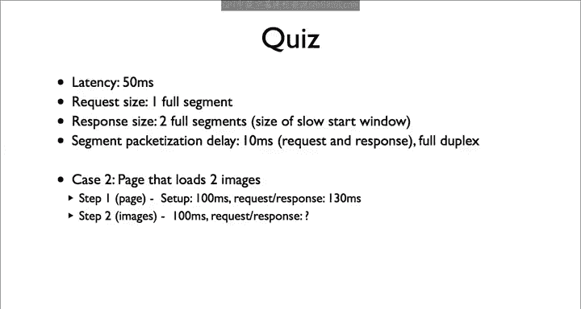

# 斯坦福大学《计算机网络｜Introduction to Computer Networking CS 144 2018》中英字幕deepseek - P73：-073-HTTP Quiz 1 Intro 64.zh_en - GPT中英字幕课程资源 - BV1bVqNYFEGg

Here's the quiz。Given that we have two parallel requests sharing the same link and the parameters above。

 how long will the Re response exchanges take？

