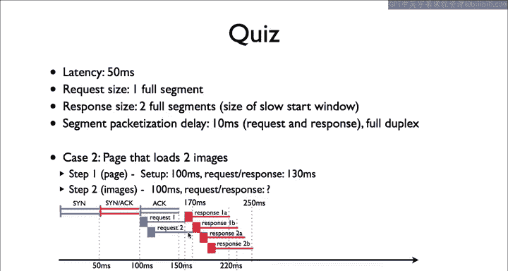
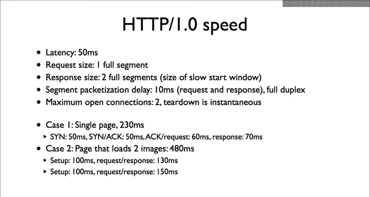

# 斯坦福大学《计算机网络｜Introduction to Computer Networking CS 144 2018》中英字幕deepseek - P74：-074-HTTP Quiz 1 Explanation.zh_en - GPT中英字幕课程资源 - BV1bVqNYFEGg

The answer is that it will take 150 milliseconds， so 250 milliseconds in total。In this figure。

 blue lines are segments from the client to server， and red are from the server to client。

The Sinac exchange takes 100 milliseconds。The first request takes 60 milliseconds to arrive。

At which point 160 milliseconds， the server can begin sending a response。It ins two segments to send。

As the first response segment goes out over the link。

 the server receives the second request and ins two more response segments。

This means that the responses will take a total of 90 milliseconds to arrive。

After the first request arrives。The additional packetization delay of the second request is masked by the queuing of responses。

So this means that it'll take a total of 480 milliseconds。

 230 milliseconds for the initial request response of the ECP page。

 then an additional 250 milliseconds to fetch the two images。

