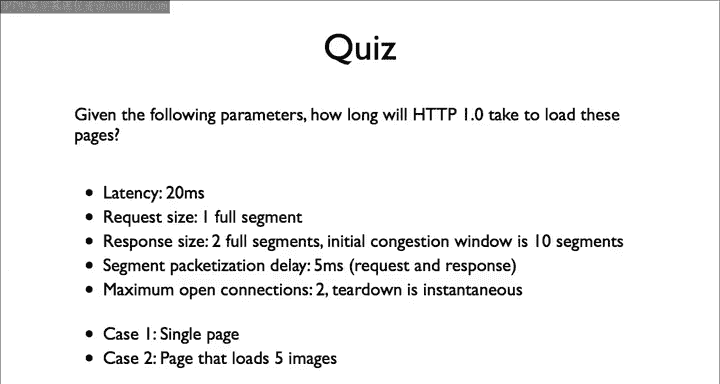
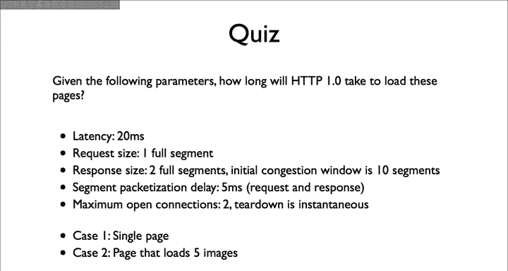

# 斯坦福大学《计算机网络｜Introduction to Computer Networking CS 144 2018》中英字幕deepseek - P75：-075-HTTP Quiz 2 Intro 64.zh_en - GPT中英字幕课程资源 - BV1bVqNYFEGg

Here's a quiz。Given the following parameters， how long will it take HTDP to load these pages？

For case two， think very carefully about how requests and responses might overlap。

