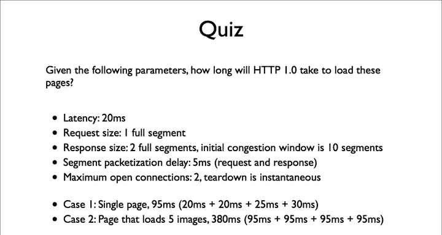
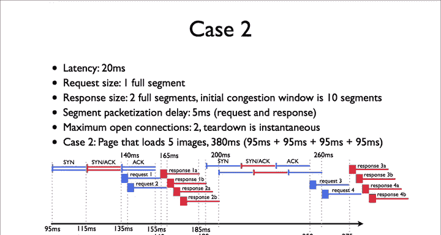

# 斯坦福大学《计算机网络｜Introduction to Computer Networking CS 144 2018》中英字幕deepseek - P76：-076-HTTP Quiz 2 Explanation.zh_en - GPT中英字幕课程资源 - BV1bVqNYFEGg

The answer to case1 is 95 milliseconds， the setup is 20 milliseconds。

 the act request is 25 milliseconds， and the response is 30 milliseconds， so 95 milliseconds total。

The answer to case2 is 380 milliseconds。It takes 95 milliseconds to load the initial page。

 it then takes 95 millisecond to load image1。When image1 finishes， image three starts。Meanwhile。

 image2 is already in flight， so that's 95 milliseconds。When image 3 completes。

 that's another 95 milliseconds since image 2 has already completed， image 4 is in flight。

It takes a final 95 milliseconds for image5 for a total of 380 milliseconds。

Let's look at this pictorially to see what's happening。

This picture starts after the first initial page request。

 it showing what happens as the client requests images， so we start at 95 milliseconds。

There's a pair of synax。S synynaxax as the two connections start at three way handshake。

 so 40 milliseconds later at 135 milliseconds， the client sends request1 at 135 milliseconds and then request two at 140 milliseconds。

Request one arrives at the server at 165 milliseconds， 20 milliseconds of latency。

 and 5 milliseconds of packetization delay。The server starts sending the response。

It sent one segment of their response 1A， when the second request arrives。

The response segments for the second request are in queued and sent after Res 1B。

Response 1 B arrives at the client at 190 milliseconds。At this point。

 the client opens a new connection through a three way handshake。But note how long this took。

The client is requesting the third image at 190 milliseconds。

 95 milliseconds after the first request started。Because the second request is going in parallel。

The client doesn't have to wait for it to complete before starting the third request。

It will start the fifth request immediately。After the third one completes。

So these three rounds take on 95 milliseconds each。If we'd requested six images。

 then the final round would take 105 milliseconds。Look at this figure carefully until you understand what's going on。

As requests are delayed going out from queuing， they delay the responses。

As responses are delayed from going out due to queuing， they delay further requests Over time。

 this causes the requests and responses to naturally space themselves out， reducing queuing delay。

And because we have multiple operations in parallel， they can mask each other's latencies。

If you look at these numbers and think about them a bit。

 you should see that requesting multiple resources in parallel doesn't take much longer than requesting a single resource。

There's additional packetization delay， but in most networks today。

 packetization delay is a tiny fraction of the overall time。

 A single request can't fill the network capacity， but many requests might be able to。

ACTTP only allows a single request for connection though。

