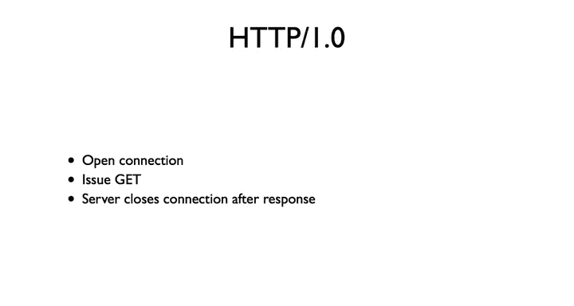
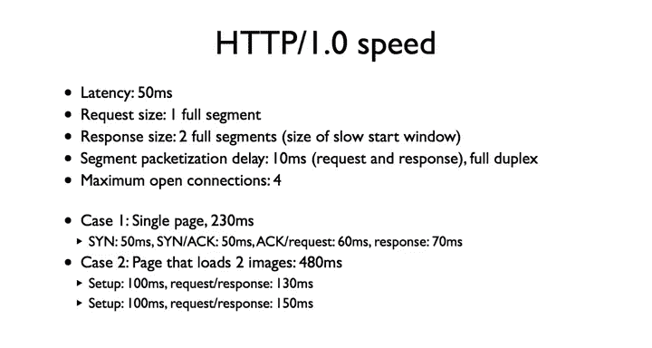
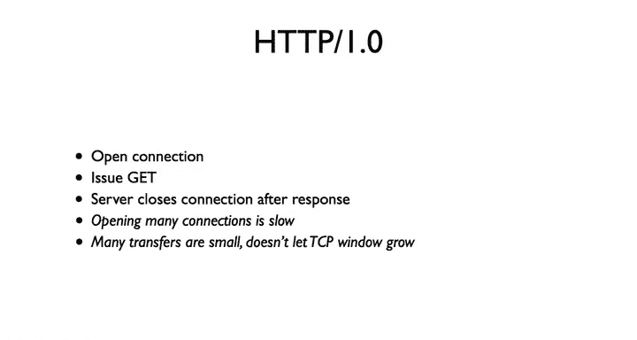
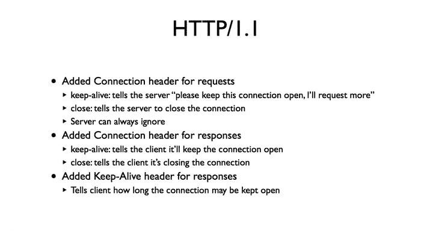
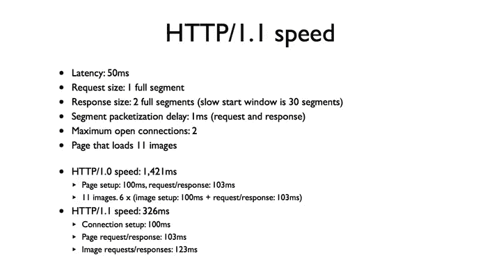
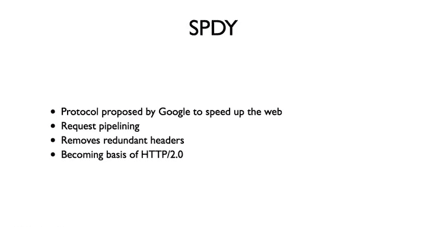

# 斯坦福大学《计算机网络｜Introduction to Computer Networking CS 144 2018》中英字幕deepseek - P77：-077-HTTP 1 1 Keep alive 64.zh_en - GPT中英字幕课程资源 - BV1bVqNYFEGg

In this segment， I'm going to cover one very important optimization that occurred in HTP 1。1。

 something called the KeepAive header。

HTP is a basic request response protocol HP 1。0 is very simple。

 a client wanting to request a document opens a connection。It sends a get request。

 the server responds to the status code such as 200 OK， the document。

 encloses the connection once the response is complete。

If the client wants to request a second document， it must open a second connection。

When the web was mostly text with maybe an imagemature two， this approach worked just fine。

 people hand wrote their web pages， putting in all of the formatting。

Recall our results from analyzing HV 1。0， Loing a single page with these parameters takes 230 milliseconds。

 loading a page of two images takes over twice as long。 Law this time is spent opening connections。

 and if we could request more documents at once， it could be much faster。

So the approach HCP 1。0 uses can be really wasteful clients spend a lot of time opening connections。

 Furthermore， the TCP congestion window doesn't get a chance to grow since each connection has a new window。

HTTP 1。1 solved this problem by adding a few headers to requests and responses。

A request can include a connection header， which tells the server whether it would like the connection to be kept open after the response or closed。

The server can do whatever it wants， but the client can give it a hint。 For example。

 if you're requesting a basic text file， there's no reason to keep the connection open as the text file won't reference other things to load。

A response includes a connection header， which tells the client what the server decided to do。

If we decided to keep alive the connection， then the Keep A header tells the client for how long。Now。

 the client can send further requests on the same connection。

 it can also open more connections if it wants， but it doesn't have to。

So it turns out this is a big deal。Let's consider a more realistic case than before。

 where the packetization delay is only one millisecond and the page loads 11 images。

Now browsers they usually have more than two open connections。

 but they also load more than  11 resources on a typical page。

 so we'll just keep these numbers small for simplicity。

We're going to use the sal analysis we use when looking at HttP 1。0 in the HttP 1。0 video。

The slow start window is big enough that will never hit congestion control。For ATDb1。0。

 this will take 1，421 milliseconds。There's seven rounds in the first round， we request a page。

 This takes 203 milliseconds。In the next six rounds， we request two images each。

 except for the last round where we request only one image。Each round takes 203 milliseconds。

So the total time is 203 milliseconds， plus 1，218 milliseconds for 1。421 secondsd。Now for HTTP 1。1。

 this will take only 326 milliseconds。We set up the connection that takes 100 milliseconds。

 requesting the page takes another 103 milliseconds。Requestesting the 11 images， though。

 takes only 123 milliseconds。That's 51 milliseconds for the first request and 72 milliseconds for the 11 responses。

50 milliseconds of latency plus 22 milliseconds of packetization delay。So ACDP 1。

1 is over four times faster。Because we can send these requests back to back in a single connection and don't have to open new connections。

HTP 1。1 has been around for a while since 1997 or so。Very recently。

 Google has developed a new protocol called Speey that improves on ACTP。

It does things like allow request pipelining， so one issue HTB sometimes run into is that the order in which a client requests resources is the same that the server responds。

So this can be a problem if some resources require a lot of processing。

Say you have a dynamically generated web page through something like Rubiion Rails orjango。

Your database is overloaded。And so it's going to take a while to generate the page。

But most of the resources are just images that can be sent quickly。

If the client requests the slow page first， it won't receive any of the images until it receives a page。

It would be nice if the server could respond in a different order and say start sending the images while the page is being generated。

Speedy also removes redundant headers， open up wirere shark and look some HP requests and responses。

Very often there's a lot of redone information each response and request。

 if you could just set some parameters such as the browser type for the duration of a session。

 rather than send it each time， that would speed things up a lot。

So speedy has been in use for a little while and it's becoming the basis of HTB 2。

0 in a few years I suspect most sites will be using HTB2。0 because of the speed benefits it'll bring。

 especially for mobile devices。

