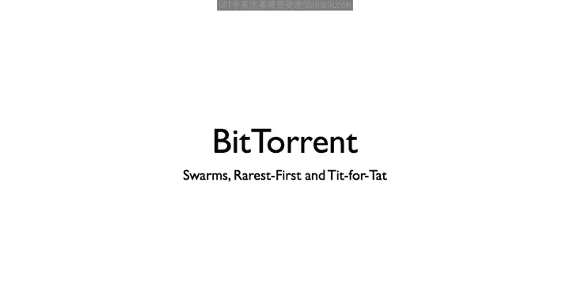
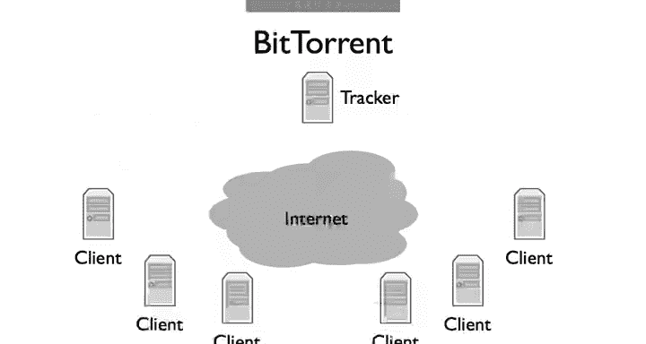
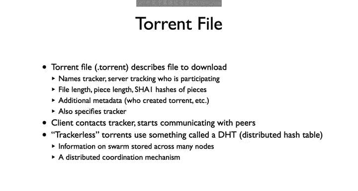
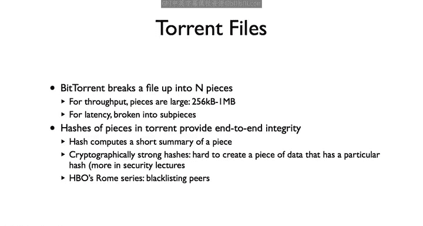
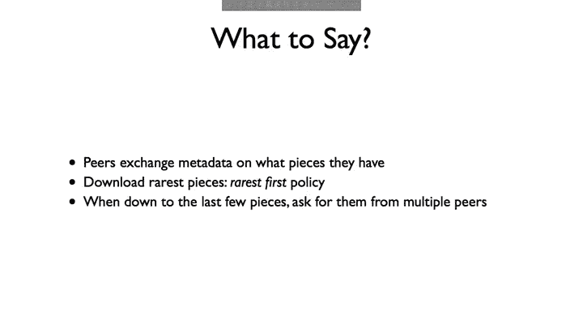
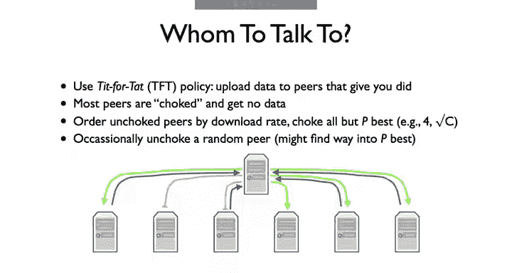
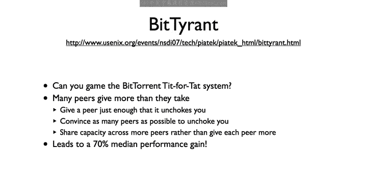
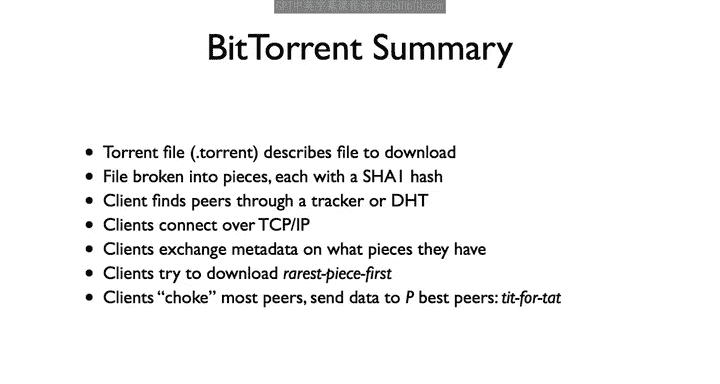

# 斯坦福大学《计算机网络｜Introduction to Computer Networking CS 144 2018》中英字幕deepseek - P78：-078-BitTorrent 64.zh_en - GPT中英字幕课程资源 - BV1bVqNYFEGg

So let's talk about BiTn， it's a fascinating internet application with a lot of interesting algorithms and approaches。

 there are reasons why it works so well。

Bittorn allows people to share and exchange large files If bittorn client requests documents from other clients so a single client can requests from many others in parallel。

 Bitorn breaks up files into chunks of data called pieces When a client downloads a piece from another client。

 then it tells what their clients that had that piece so they can download it to These collections of collaborating clients are called Swarms So we can talk about a client joining or leaving the swarm。

A client joins us forum by downloading a torrent file that tells it information about the file such as how big it is。

 the size of its pieces， and how to start contacting other clients。

It used to be the deter torent would name a tracker。

 a computer that keeps track of what clients are part of the swarm when a client joins the Swarm。

 it requests a list of other clients from the tracker。

 then starts contactacting these clients over TCP。A Bitcoinn client can have on the order of 100 open TCP connections at once。

After Traer started receiving a lot of unwanted attention in late 2000s。

 most clients transitioned to using tracker list Corins。

These torrents contact a host that tells them how to join something called the Dis hash table or DHT。

DHT is a way to map the hash value to a node where a set of nodes supporting that DHT can change a lot you can still find the node。

So rather than use a centralized table for this lookup。

 the mapping is actually distributed across all of the participating nodes。

It's basically a way for some node to collaboratively store some data， in this case。

 storing lists of which clients are part of a swarm。

BitTrn breaks a file up into end pieces。Each piece is 256 kilobytes or larger。

This size is intended to ensure a TCB stream transferring the file is long lived enough that its congestion window can grow to a reasonable size and so support good throughput。

But Bitorn also breaks up pieces into subpieces， so it can request parts of pieces from multiple peerers and so reduce latency。

A piece is also the unit that Bitorn uses to check integrity with。

A torrent contains the Shaw one hashes of each piece。

Shaaw1 is something called a cryptographic hash function。

 it's the primitive used in message authentication codes。

A strong cryptographic hash function has the properties that， given a hash。

 it's really hard to create a piece of data that has that hash value。

That means that if the torrent says that the hash of P5 is H。

 it's hard to come up with a piece that isn't P5， which also has hash H。

 so you can't start replacing the pieces of the torrent and screw it up without a client noticing that the hash isn't right and retrying。

So this actually brings up an interesting story in 2006 HBO had a new series called Rome。

There were several different torrents for it， each of which had very large swarms。

But many people found their clients couldn't download the series。Looking into it。

 it turns out there are a bunch of very， very fast peers that many clients were connecting to and downloading from。

But these peers provided pieces that didn't have the right hash。So a client would download the piece。

 find the hashes wrong， throw away the piece， and retry。Back then。

 the clients assumed that this was just an error and so kept on requesting from the same peer。

So many clients would just enter an unending loop of trying to download the same bad piece。

The hypothesis was that this is an effort by HPO to prevent downloads。Nowadays。

 clients can blacklist peers that serve up many bad pieces。

Bittorn and clients， when connected， periodically exchange information on what pieces they have。

A client tries to download the rarest piece among its peers first。

If a single piece becomes unavailable， nobody can download the file。Also。

 if only of a few clients have a piece， they'll become a bottleneck for downloading。

This is called the rarest first policy。The one exception to the rares first policy is when a client reaches the end of the torrent and only needs a few more pieces。

At this point， it requests for pieces from multiple peers。

It does this to counter the edge case of asking for the last piece from a very slow pi and having to wait。

So this final step means that the client might download multiple copies of subpieces and waste swarm bandwidth。

 but since there are often1 thousand or so pieces in the swarm， this cost is small and so worth it。

So Bitor and clients exchange metated with each other to learn what pieces they have。

A client starts requesting pieces from its peers。But if you send data to every peer。

 you'd have lots of very slow pieces。Instead of having 100 slow TCP flows。

Bittorn tries to have a smaller number of fast flows。

The idea is you send data to peers who send you data。That way。

 peers who contribute can download faster。 This creates an incentive to send pieces to peers。

The way this works is through choking。Most peers are choked and so you send no data to them。

Bittorn measures the rate at which it is downloading from each of its peers and picks the P best of them。

 P is usually a small number， like 4 or the square root of the number of peers。

 It then chokekes these P P peers and sends data to them。This algorithm is called tip for tat。

 you send data to nodes that send you data。One problem with this algorithm is that it doesn't explore much。

 there could be a really good peer out there who could send you data very fast if only you started sending some data first。

So every 30 seconds or so a bit torn unchokes a random pier。

 this pier might then find its way into the P best。

The bit torrent tit for TD algorithm seems pretty robust。

 you send data preferentially to other peers who send you data。But it's not perfect。

 There was a nice paper in 2007 that proposed somethingly called bit Trant。

 which selfishly tried to game the system， and it did。

 using bittyrant unit could increase your bit torn throughput by 70%。

The basic observation of bittyrant is that in that standard bit torrent。

 a peer tries to share its upb capacity evenly across its unchoked piers。

So if a client has P unchookgged peers， then each one receives one over P of its upland capacity。

But once you're in this top P， you get all of this。

So the trick is that you want to give up here just enough to make your way into its top P and no more。

You should then spend the extra capacity trying to get into another Piers top P。

So this way you give everyone just enough that they on Chocu and maximize how many peers on Chocu。

It's a nice result， they also found that if everyone used bit Trant performance can improve slightly。

 but you get the most benefit if you're the only tyrant。

The URL here links to the paper。So that's a basic overview of Bitorent。

 Your client downloads a torrent file， for example， over HttP。

 This describes the file to download and how to find peers to download it from。

 Bitorrn breaks the file into pieces and peers exchange these pieces。

 They connect over TCPIP and exchange metadata so they know what the distribution of pieces is over their part of the swarm。

Cllinton tries to download the rarest piece first in order to balance availability。

Clients upload data only to their top P downloaders。

 so most of the peers are choked and receive no data and the client gives data to those who give you data using a tit for Tt algorithm to discover potentially good new peers the client also randomly unchos appear periodically。

