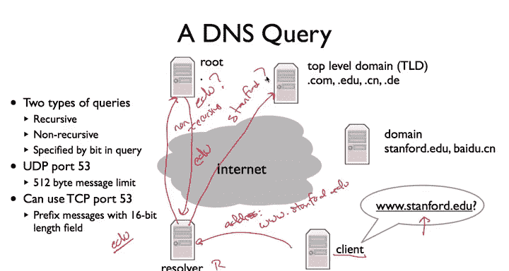

# 斯坦福大学《计算机网络｜Introduction to Computer Networking CS 144 2018》中英字幕deepseek - P79：-079-DNS 1 64.zh_en - GPT中英字幕课程资源 - BV1bVqNYFEGg

This is the first of three videos about the domain name system or DNS。

So if let's look at the URL for a second， if we look at a basic URL like you would put in your web browser。

 it has three basic parts。It has first the front the application protocol and port。

 So this is saying that we're going to be requesting a file over HDP and default by default。

 that means port 80， a TCB port 80。 you could also tell this URL after the host to be some other things。

 say port 1001 or something， but by default， this means port 80。

The middle part of the name is specifying a host， so in this case， cs144。scs。stanford。

ed is a human readable name delimited by periods into four parts。

 and it's specifying the actual node that we want to contact。

The last is then the file says the application level for HTTP。

The application level specification of what file we want to request。And so the question is。

 so far we've been talking about the internet in terms of IP addresses， usually IPV4 addresses。

 but when you type a URL， we have this human readable name describing the computer that we were the host that we want to contact。

And the question is， how do we translate this human readable name to an IP address？Well。

 it turns out you can of course enter a URL without using a host name instead just by entering an IP address。

 you could rather than typing c144。ss。sford you could actually write the IP address that's associated with that name if you'd like。

But these human readable names are very， very useful。

People realize that human readable name was useful just from the beginnings of the internet。

 and so way back when when the internet was tiny， there was this file called host stock textex。

And turns out that every single host on the internet was in this file， host ducktext。

 and it was maintained by the network Information center， so it is was maintained at SRri。

 so the SririN。arRPpa at this particular IP address。

 if you go and read RSC 952 talks a bit about this。And essentially。

 if you are a node on the internet， what you do is periodically contact this node at SRI and use a file transfer protocol to download a new version of it。

 and this new version would have all the new hosts and then you'd be able to map those host names to IP addresses。

Of course， if you don't have too many hosts， this isn't bad。Generally speaking。

 the network capacity required by this scales of the n squared in that periodically end nodes are going to request a file that's order n in length。

 so this was not seen as a scalable， good long- termm solution。

 it was fine whether there's just a couple of hosts， but as the internet grew。

 it clearly it quickly became a problem。And this is what led to the birth of what's called the domain name system or DNS The basic problem DNS is trying to solve。

 the basic tasks trying to complete is to map names， humanriable names to addresses。

 or more generally these days to values originallyinally was to map IP addresses。

 it turns out nowadays you can do it use it for much more。

And there are a couple of design considerations for the domain name system。

 The first is we like to be able to handle a huge number of records right in theory。

 there are two to the 32 IP addresses we should be able to map names in that kind of order。嗯。

Furthermore， we'd like to have distributed control。

 One of the problems of host text is there's the single centralized repository should be that we can say this set of names。

 you can manage them， this other set of names， you can manage them。 So Stanford。

 you can manage names under Stanford， but Amazon， you can manage names under Amazon。Furthermore。

 we'd like this system to be robust individual node failures。

 it shouldn't be that if one node goes down the entire domain name system comes down because if that's the case。

 then suddenly we can no longer map names to addresses and lots of things are going to halt so we want to be robust。

So this might seem like an amazingly challenging problem。

 we want to handle billions of records distributed hierarchically across the entire internet which are robust to failures。

 but there are two things which turn out to make this problem tractable and make the design feasible。

The first is that this database that maps names to values is read only or read mostly and that there are updates to it。

 but you generally expect that it is going to be read much more than it's written sense of it's not like there are nodes coming in and out all the time。

 but nothing compared to the rate at which we're looking nodes up。Furthermore。

 we don't need perfect consistency， you can have something called lose consistency。

 so if a node connects to the internet or if say a node a mapping between a name and an address changes。

It's okay if there's some delay before everyone sees that。

 it might be some people see it little earlier than others， but it's okay if there's some delay。

And so it turns out that these two properties together that it's a read mostly database and that it's okay if things are slightly out of date。

 allows DNS to have extensive caching。The idea is that once you have a result。

 you can hold on to it for a long time。And then maybe when it expires， request a result。

 but rather than have one place say that has to be asked for everything。

 you can ask someplace once and then cache that result and answer it for other people。

So you can look up a name and then keep the result for a long time and then use it to answer other queries。

So recall that one of the requirements is that names be hierarchically administered that as you can distribute the administration of names and to accomplish that。

 DNS uses a hierarchy of names and we're all familiar with this。

So at the top there's implicitly what's called dot or what's called the root of the DNS namespaces nothing it's a nothing right it's an empty name So these are called the rootot servers just dot beneath them are what I called the top level domains。

 TLDs such as Eju， Com， org， US， France， China。Then underneath each of those top level domains。

 there are what we often think of as domain names， say Stanford。edju or cisco。com or Baidu。cn。

And of course， within those domains， the owner of those domains can hand out additional names。

 additional domains， so for example at Stanford， generally there's just one level of names below Stanford。

 so there's cs。tanford。edju www。tanford。edju。Berkeley has another layer， so there's CSs。

 bekeley there's the CSs domain and then there are names underneath the CSs domain like www。cs。

berkeley。ed Similarlyly Googlegle has maps。google。com。

So now the way DNS servers work is that there is hierarchical zones， there's the root zone。

 then the TLDs， then the domains， and then there can be subdins， so Stanford for example。

 as you may have seen so far， does have a subdomain SCS managed by David Maser。

And the key thing is that each of these zones can be separately administered。

So Stanford can grant David Maser the domain SCS so it'll answer questions about SCS。

 but then David can completely control all of the host names underneath SCS， Similarlyly。

 EU can grant Stanford the name Stanford， but then it's completely up to Stanford to manage all of the names beneath Stanford。

Furthermore， each zone can be served from several replicated servers。

 And so rather than there being one server that serves Stanford's name， there are， in fact。

 many servers replicated。 and there's some rules as to how they're replicated。

 The idea is that if one server goes down， there are others that can still answer questions about Stanford。

So it turns out the root zone。 So the zone you'd ask for hey， who to ask about Edju。

 there are 13 servers labeled A to M and they're highly replicated。

 And so there's sort of this bootstping process of your computer comes up for the first time and wants to ask a name and it knows nothing。

Well it needs to talk to a root server in order to contact say a top level domain server。

 but how does it find out the root servers it turns out these are generally just IP IPs that are stored in a name in a file in the name server。

 the name server comes up and it has some IP addresses for rootot servers and then the first query that comes in let's say it's for Stanford。

edU it knows that it needs to talk to the Edju servers and so it can ask the root servers。

 hey who has EdU then when it gets the response who has Ed it can contact the Edju servers。

 hey who has Stanford。In addition to having 13 different servers。

 they're highly replicated through something called anycast IP anycast。

 So it turns out that there are many machines that have the same I address。

 which basically causes you to contact the one that's closest to you。

 So this makes the root servers highly， highly robust。 often when you hear about。

Large scale distributed denial of service or Ddos attacks against the root servers。

This is exactly what they're talking about， that people are trying to attack the DNS root servers to prevent to basically cause the DNS system to grind to a halt。

As of yet， nobody has yet succeeded， there' are so many of these servers。

 they're so robust and it turns out their job is so simple， people haven't been able to do it。

 but they keep on trying。So here's a map of the DNS rootot server， so ABC， D， EFG， HIJK L。

JKLM I mean so colored， so here are all these different A servers or a server AB， D， E GHL。

 and then for the anycast instances for CFI JKM you can see that they're spread all over the world so this means that's say if you're somebody in know in say Saudi Arabia and you want to issue in your DNS server and you want to issue a DNS query。

 you don't have to go very far there's some that are very close by。Okay。

 so that's the basic naming architecture and sort of a sense as to what DNS servers and how they're structured these hierarchies。

 so what does a query actually look like？So there are two kinds of DNS queries。

 recursive and nonrecursive a recursive query asks the server you contact to resolve the entire the entire query So you're asking it a question and if there's many steps to the question。

 then it should ask each of those steps as opposed to a nonrecursive query where you're going to contact a server just going to answer one step of the query。

 and I'll show you why this difference occurs in a second and you specify just a bit in the query to say whether it's a recursive or non incurive recursive query。

So DNS usually uses UDP port of 53 and there's a 512 byte message limit。

 you can use TCP port 53 and then all the DNS messages have a 16 bit length field sorry you know how long they are since they're not datagrams they a stream。

So let's say that I'm a client， so here's me， and I want to ask a question of， hey。

 what is the IP address associated with www。tanford。edu。So using DHCP。

 I have an address for a DNS server， and so let's just call this here Rer and so it has some address R。

And so I send a DNS request or DNS query saying， I need the IP address for www。tanford。

edU and I send this message to the resolver， so I'm asking for address。Of WWW。Tod Stanford。但一定。

And I asked this as a recursive query， so the resolver is going to resolve this entire query recursively for me。

Well let's say my resolver has nothing cache， it doesn't know anything about the world。

 it just has the IP address of some root servers。Well。

 the first thing it's going to do is it needs to figure out whom to ask a question about Edju。

 so who does where the servers for Edju？So it sends a query to one of the root servers saying， hey。

 whom do I ask？About Eddu。This is a non recursive query。

I can't ask the root query to the root servers to answer the whole query for me and start contacting other people。

 They're just going to answer one step。 That'll answer， hey， who should I talk to about Edju。

And the route will ascend a response saying， here's some information for who you should talk about Eju。

Now the resolver knows， okay， now I have， I can cache the entry for EdU。Great。

 I can put it in my cache， this is the IP address I should contact if I have a question about EdU and let me contact that IP address。

And it's going to ask Eju， hey， who should I ask about Stanford？Again， this is a non recursive query。

The edge of server， I'm going to say， okay， you here's some information about whom。

He should ask about Stanford。I can then cache that result。And ask that server is the domain server。

 It now I'm going to say Stanford。What's the address for WWW？And Stanford can respond and say， aha。

 heres the address。For www。tanford。大理地。And then the resolver can catch this result。Www。tanford。

u Now the resolver can cache these values of if I want to ask a question aboutedju。

 what DNS serverver should I talk to， if I want to ask a question about Stanford。

edju what dNS server should I talk to and what's the address for www。tanford。u。

And then it can return this result to the client， here's the IP address forWww Stanford。

And that's the basic operation of a DNS query， it starts with the client asking a re cursive query of the resolver。

The resolver may then ask non recursive queries to servers in the network in order to generate the response which should then sent the client。

It could also be that the resolver had answered this question before and so rather than go and ask all the servers just answered from its cache So if a couple minutes later。

 another client asks the same question， hey， what's the address of www。

tanfordedu There's resolver rather than contact anyone can just return the cash result's if you ever hear in the noise about here the news。

 not the noise about DNSc poisoning。There's this aspect of DNS which these attacks try to tackle witches or try to take advantage of。

 which is that if you can get a bad record into the resolver。

 that's somehow convinced it that that wwww。tanford Eu actually points at www，tev。com or something。

s that if you try to go to Stanford instead you go to some evil hackers server。

 so you can get that cache entry the resolver and poison the cache。

 and anybody who asks that question is going to get that answer。

And so later in the course when we talk about security。

 we'll see some of the ways in which that can happen and some ways in which DNS can solve it。

