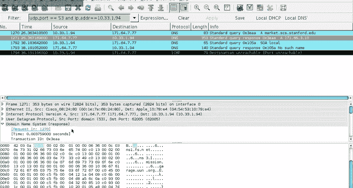

# 斯坦福大学《计算机网络｜Introduction to Computer Networking CS 144 2018》中英字幕deepseek - P80：-080-DNS 2   Names and address.zh_en - GPT中英字幕课程资源 - BV1bVqNYFEGg

This video goes into the details of what DNS queries actually look like and their format and their structure。

 so queries and the resource records that compose them。So recall， a DNS query starts from a client。

Say it asks a resolver， what's wwtanford。edu and is a recursive query？

And then Resolr might either answer from its cache or use cache entries and if it doesn't have a cache entry for any stage of the query。

It can ask questions from external。Servers。Whom would I ask about Eju。

 who would I ask about Stanford？Dot edgeju。嗯。Hey， what's WWW？Do Stanford。大点去。

Each of these are non recursive queries and the resolver then caches those results。So addju Stanford。

edju and www。stanford。edju。So that's a query at a high level。

 but in the details the way DNS works is that all DNS information when every DNS message is represented in terms of things called resource records。

 RRs， and the form of resource record is generally pretty simple。

 it has a name so a kind of resource record sort of name of the the name associated with this record there can be a time to live and a class then there's the type of record and then the record data。

So for example， a resource record would be named， say www。stanford。edduu。

 so this is a record for www。stanford。edu。TTL， how long is this record good class so this the address class。

 so typically it's almost always I am one or it's class one。

 so this for an internet for the internet。There's the type of the record and then the data。

And so here I'm going to walk through two critical RR types， resource record types。Type A。

 which is an IPV4 address an NSS， which is a name server。

 so an A record tells you an address associated with the name， so it'll say type A。

 the R data is an address， it's the address associated with the name。

 whereas a name server record an NSS record。Well tell you the address of a name server associated with the name。

So a great way to explore DNS and what records look like and what kinds of records you get is to use this tool called Dig。

 which I'll use several times。A DNS message that an actual DNS message。

 its structure looks like this is specified in RFC 1035。

So in beginning there's a header which describes overall sort of what's in the message there's the question that this message is for if it's a query。

 then it's the question of the query， if it's a response。

 then it's the question it's a response to and then there are other sections which are empty inquiries。

 the answer authority and additional sections so it's possible to for example。

 listen send a DNS query with multiple questions in it if you want each of these can have multiple entries so there's a header then the question answer authority and additional sections are all made up of resource records。

So let's look at an example of this， so if I digwww。stanford。Now this simple use of di， I'm asking。

 I'm basically saying I'd like to send a DNS query for the address of www。ter。evu。

And this is what we see come back。Here， here's the dig output and you get the version of dig。

Here's the header， some header information we'll talk a little bit more of that later。

 so here's the question I was asking for an address record of www。stanford。

edu so you see here's a record resource record even in the question section。

And the answer has two records in it。 The first is what's called a Cname record。

 which I'll talk a little bit more later， but basically it says that www。tanford。

edu is actually the canonical name for that's what C name stand for seaname stands for is wwwv6 Stanford。

ed so there are six different maybe there are six different Willow web servers for Stanford then the address of wwwv6 here here's the internet inN so it's in1 that's like a class Ttls 1800 this is an a record and it's for this address。

In addition to that， the authority section is telling me who are the authoritative names。

 these are the NSs， the name serverver records for Stanford at Edu。

 so here are all of these different servers I could ask about addresses in Stanford。

 an additional section then gives me a whole bunch of just additional stuff like here's the address record for Argus。

 here's the address record for Areretheia， here's the address record for Atlanta， here's the Atlanta。

 here's the address record for Avalone。It's when you think of what DNS is often doing and the reason why you see this message is so big is that。

Given that it's going to send a response， it tries to send you a whole bunch of extra data。

 a whole bunch of extra information just to maybe prevent you from asking。And so these are A records。

 these are IPV4 addresses， so Quad A records AAAAA， these are IPV6 addresses。

 and so it turns that Stanford's DNS server is giving me not only the address records of the Stanford name servers。

 but also theyre not only the A records but also the IPV6 in case I want to query them over IPV6。

So this is what a response to a DNS query looks like， so you can see that there's the header。

 there's the question section， the answer section， the authority section。

 and then the additional section。So if you look inside the header is specified R C 1035。

 the header is。10 bytes long， sorry， 12 bytes long。

 so it's pretty short the first two bytes are an ID this you can pair queries and responses。

And then the second so the first two byte is an ID。 the second two bytes are a bunch of flags。

 So there's the first that bit I mentioned whether this is a query or response， there is an op code。

 so standard queries。And there's a return code if there's an error code。

 then there's a bunch of flags， so is this an authoritative answer， it's truncated。

 all of these sorts of things so you can see here and the bottom recursion desired recursion available。

 there are ways where you can in fact ask your resolve or frame non recursive query if you want。

Then after these first four bytes， there are four2 byte values which say how many resource records are there in each section。

 so how many queries are there， how many answers are there how many。

Authorities are there and how many additional records are there？

Now then within each of these of the four sections that have resource records。

 resource records is pretty simple， it has a name that could be a variable number of bytes long。

 depending how long it is， then there's a type class and the TTL。

 within an RD length field specifying the R data， and so here here's the basic DNS name。

 then the type， then the class TTL RD length R data。

And so this is what the sort of the on the wire what the byte format of a resource record looks like。

Now notice that the beginning of a resource record is a name， but doesn't say how long the name is。

 that's because the length of the name is self describing。

It turns out that DNS does a lot of name compression because it's trying to pack everything into 512 bytes。

 then names that are repeated through the packet are just rather than repeated are just referenced。

And so imagine if I'm asking a query about， say， ww。stanford。edu。

 I don't necessarily want to have that repeated many times in the packet。

 I can just put it once and then refer to it。So the first thing that DNS does is it breaks a name into separate labels related to the steps of the hierarchy。

 so www。tanford Eu is three separate labels， wwW， Stanford and EVU。

Then each label is encoded as a length and then text value， so the length is in binary。

 so it's basically some number， it's just one byte。And then the text is in ASII so for example。

 if I were to encode 3WwwW， so W is 0 x77， the way that to be encoded in the bits in the packet is 03。

7，7，7，7，77 so this tells me these are three bytes and here they are。Now one trick then that。

The name compression uses in order to take advantage of the fact the names can be long and repeated several times in a packet is if the length field here。

In the label is greater than 192。That is some of the higher bits are set then the next 14 bits specify an offset in the packet and so the way to think of this is that if I see here that the first two bits of the length。

 so 12 April 64 is 192 are 11。Then。This length is actually 2 bys long。 this length field。

 and the later 14 Bs specify in offset of the packet。 So， for example， if I see 0 x， E 0，0 C。

This means that the name that that this label refers to is at this value minus take out those first two bits is at offset 12 within the packet。

 So if I were just to go to offset 12， that's the label that this refers to。

 So if I something like Stanford， which is8 characters long rather than repeat Stanford many times it would actually be a9 because they need the length right I'd be 0 be0 x08 then。

The bytes of Stanford， I can just say0 x C0 and then the offset of Stanford。

 you'll be only two bytes long。So is a little bit detailed。

 but it's important for when I'm going to open up Wi I can show you what some DNSque responses look like。

 otherwise it can be really hard to figure out wait。

 what are these resource records and what are these weird values that aren't actually specifying names。

So just to give you an idea of what aNS what a DNSA or address record looks like。

 so this is say for market。ss。tanford。edu so the first the name region would say market。ss。

tanfordedu this might be compressed so might be much shorter then the next two bytes would say one。

 this is an address record， the next two bytes would say one， this is for the internet。

The next four bytes， say 3600， so the TTL of this record of the time to live is an hour。

Then the length of the R data， the length of the internet address is four bytes。

 and then here are the four bytes。 And so if you see it print out， say if you're using dig。

 you'd see this， but the overall record actually looks like。

An NSs record say the name server record for scs。stanforded looks similar where here we have scs。

tanfordedu in the name section， again it might be compressed。

 then we have two saying that thiss an NSs record against internet time to live 3600 and then the length is say 10。

 because it turns out that SCs。stanfordedu is compressed because well it's been mentioned elsewhere so really have mission 1。

2，3， 456。嗯。7even。And then we have the one， the one， the length for mission， and then the two。

 which is the compressed indication of scs。tanford E use。

 the first two bytes in the R data are going to point to scs。tanford toedduu。

Then we have a byte saying the length of mission is7 and the seven mission bytes for a total of 10 bytes。

So let's dig for market。scs。stanfordedu， so just use the tool， see what happens。

So we're asking what is the address of market。ss。sfordedu we're asking for an address record we get the answer its address is 17166。

3。10 and here's the time to live of 2050 30 section here are the name servers that answered that can answer this question here's a bunch of them fs。

 missionss。tananfordedu and here's some additional information address records for these name servers so that's what this looks like when you ask dig we can also ask dig what is the NSs record for market。

For SCs。tananford@edu。And so here's querying for the NS record SCS。N foredu。

 we see there's a whole bunch of name servers that serve scs。end foru， NS3， NSS1， Gar， market。

 mission， and then here's the additional section which is giving you their IP addresses。

 some of them are just IPV4 addresses， some of them are IPV4 and IPV6 addresses。

And so here we can see there's so many name servers and what that means is that if any one of these goes down。

I still I can still go to another one， so even if say three of these name servers went down。

 let's say the NS3 garage and market， I could still contact NSs1 mission to ask questions about names anss。

tanford。ed。So now let's see what those queries look like in wire shark。

 So here Ive opened up wire shark， and I've set up a filter。

 UDP port 53 that the DNS port and I adder。 My I address。

 is is going to look at DNS requests and responses from。For my machine。And so if we were to ask。

 this question， digmarket。scs。tanfordedu。we see， we get a query and a response。

And so here's a standard DNS query， right， again， internet protocol version 4 source。

 there's my DNS server。呃。And so here's the query。There's a standard query， there's one question。

 no other records。And so the question is market。ss。 stand for a Utuu type A。

 so I'm asking for an address record class IN。Name market。ss。inforiteu， type A， host address。

 class internet。And so here， in fact， we're looking inside the bites of the packet。

Here's all this information about the size， right we can see here down in these bytes 00000 here is this is the header。

Of。The DNS transaction ID right there，0 x3， EAA。Flas， questions， etca， 00。

 then here's the query itself， So this is the query section。This is market。ss。stanford。

edu if you look down at the bitetes。This bitete is first bitete for market is 0，6。

 That's because market is 6 characters long。 So we have 06， then M， A， R， K， E， T。Then SC S。

 which is3， So three long，3， SC C S。Then Stanford which is eight longs， here's8 S T A and FORD。

 then three long EDU。And then that's and then type A， so 01， class IN01。Now。

 if we look at the response， it's a lot more complicated because remember how many entries there are in a response。

 So let's look inside this。 So it's telling us it's for the transaction ID 03 EAA Senate Cru response No error。

 there was one question， one answer， five authorities，7 additional。

Now let's look at the query section。SoThe query here you can see again market。scs。tananford。

vu type A class IN。And so here's the answer。Mar@ss。tan foreddu， bla blahlah， here's the address。

But now if you look at this。The name section。Of this resource record， is's only two byte long。

 It's using name compression。 So here's that C 0，0， C。 What it's saying is that。C。

 the first two bits or 1。 This is a compressed name。

And the start of the name is it offset  zero C or 12 within the packet。

And if you were to count the bytes within the DNS packet， you'd see that market starts at byte 12。

 instead's is saying this name is right there。And so then here's type A。I am 30， et cetera。

 et cetera。So that you can see so we're going to take a market。ss。

sanfordu and it compress the name entirely， but it turns that you can do some other types of compression。

 So here is the authoritative here's an answer for scs。sfordu。And so we see again。

 this name for SCS doant EDU is compressed， so C0 it's compressed 13。So this is an address。

 the Ft the one represents 16， so this is an address 19 within the packet or offset 19。So y 19？Well。

 if you think the original market。ss name， which is at offsetet 12。

Then there's the length byte from market and then the six market bytes， so a total of seven bytes。

And so offset 19 within the packet is SCstanford A use。

 so you can address not only into the beginning of the series of labels but any label within there。

And so you'll see this happen many times， and so if you start doing some digging some requests and open open War shot。

 you'll see this kind of name compression。And what this means in practice， right is that this packet。

 which had all of this information in it。

Right look at all this stuff that's in this packet， all of these different records， address records。

 name server records， Quad address records， fits in 311 bytes， it's a 311 byte DNS response。

