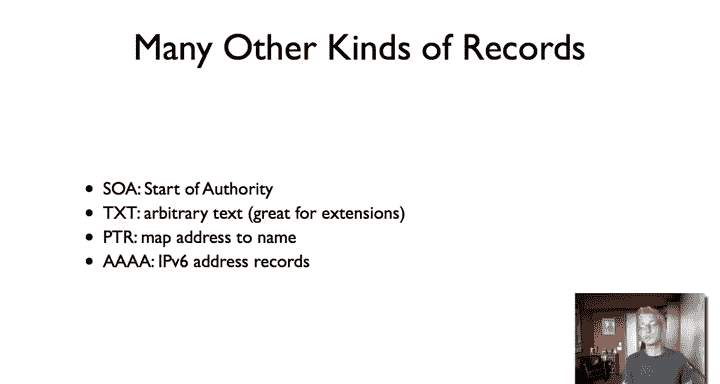

# 斯坦福大学《计算机网络｜Introduction to Computer Networking CS 144 2018》中英字幕deepseek - P81：-081-DNS 3 64.zh_en - GPT中英字幕课程资源 - BV1bVqNYFEGg

This video digs into the details of actually what a DNF query response series looks like。

 So soon as that you know what resource records are and what their structure is in the high level view。

 this idea of a client issuing a recursive query， which is then nonrecursively issued to other servers in。

And by details， I mean that at this high level， there's this idea that I issue a recursive query。

And then this results in resolver issuing a series of non recursive queries to give me my final answer of what the address record of Stanford。

edu is。But what are the actual contents of these queries and what are the actual contents of the responses and what is the information that each of these servers has to know？

So this matter this is really important when you're actually setting up a name system。

 you're actually setting up a domain and you need to configure name servers and networks that you'll be able to actually ask questions and people are able to access your machines and your names。

So challenge， one of the big challenges comes from this concept of traversing zones。

So at some point my name server has a root cache file this just gives some IP addresses of root servers and this is the bootstrapping process if I just have those IP addresses then from there I can get TLD name server addresses from there I can get domain name server addresses and subdomains etc。

At a high level sort it makes sense， oh， I ask about EG。 I ask about Stanford， but。

There turned out to be a couple of tricks， so。Think about。An an S record。

 So if we recall a name server record， if I ask for what the name server is of a domain。

 a name server record contains a host name。 So， for example。

 if I ask what is the name server of Stanford do EDu， the answer is a host name。

So here let's dig for the name server。Oh Stanford。edduu。And the answer is we get four answers。

 these host names， avalone。tanford。eddu aust。tanford。u atalentte。stanford。u anderthea。stanford。edu。

But the problem is these are all names in Stanford。

How can we get the address of these name servers unless we know the I address。Of these name servers。

 these are the servers we would ask for what those names are。

 So there's this chicken and egg problem。 How do we get started。

 given that we're being given host names。嗯。And so the solution to this in the name system of the domain name system is something called a glue record and what this says is that when say Stanford goes to the Eju servers and says。

 hey， these are the name servers for Stanford， it gives them not only NSs records specifying the names of the servers。

 but also associated A records and is called glue records because it means that the EU servers are going to serve up address records。

 a records for Stanford。edU。Only for the name servers of Stanford@edju。

 but nonetheless they' are serving A records for Stanford。edju。And so you go back to this example。

You can see that on one hand， I'm asking what are the name servers of Stanford。 EdU。

 but the additional section then also gives me address records for them。

 and these address records are stored within the EU name servers。

So let me just walk through an example of this I'm going to do is I'm going to look up ww。ss。

stanford。edo assuming there's no cache， I'm going to explicitly walk through this series of queries that would be issued。

 and the way I'm going to do that is with this no rack option which means do not ask a recursive query。

And so as the first step。Let's dig。So this is I'm going to contact one of the root servers or the A rootot servers and say。

 hey， who do I talk to for EdU because this is non recursive。

And I get a response which says here are some of the servers to use。

 so let's say here's the A edge server， so these are the name servers that you can use。Okay。

 so I'm going to use the a Edju server， I'm going to say， hey， whom should I ask about Stanford。edju？

And it's going to tell me to ask， Argus， does Stanford age you？

As you can see it's also giving me the A records。The A record for Ar。

 I actually have an IP address to ask。Then I'm going to ask Argus， hey， whom would I ask at ww。ss。

tanford？And Argu is going to answer， oh， you should ask ns1。fs。net。And or you can also ask mission。

scs。tanford。edju oh and here's the address record for mission。scs。stanford。edju。

And so in its response， I now know the IP address to contact and I can put that record into my cache。

And so if I then do mission do。ss。tanford。edju。I'm going to get the A record。And in fact。

 that's what admission。stanford。edjuss。sfordedju gives me is the a record for ww。ss。stanford。

edju time to live 3600  IP address at 17166。3。9。So one record that we saw briefly。

 besides an A record， an NS record， is something called a C name record。

 a canonical name what a canonical name record tells you in DNS is that a name is an alias。

So as we saw before， if you dig www。stanford。edju， you'll see that that's actually an alias for another name。

 say wwwv6。tanford。edju。And so if there's a Cname record for a name there can't be any other records for name it's telling you oh this is just a pointer And so often what will happen is that if you ask a query about a canonical name。

 it'll tell you oh for a sorry an alias name it'll tell you oh。

 this is an alias for this canonical name and then here are the records you want for the canonical name So for example。

 if you dig wW at Stanford I E it'll tell you the canonical name is this other name oh and here's the a record for that other name。

Another kind of DNS record and this one is really valuable is， oh they're all really valuable。

 is what's called an MX record， it's a mail exchange record。

 and it tells you what's the mail server for a domain。So for example， there's no host scs。tanford。

edgy， you can't ping it， try， but you can send email to SCs。stanford。edgy。

 people have email addresses at that domain。And so what this is is that there's an MX record for scS。

tanford atedju that says， oh， if you want to send mail to this domain。

 this is a server you should talk to。 and furthermore， an MX record causes a record processing。

 so if I say， hey， what's the MX record， then it'll say， oh。

 this is the name of the server for mail and here's the a record for that server？So for example。

 let's dig。M X dot SS dot Stanford doted you。And we'll see， okay answer section。

 the MX record for scs。tanford。edju， the ttl 3600， its internet is market4。ss。tanford。edju。

Furthermore， the address record for market4。ss。tanford。edju is 171。66。3。

10 and this 10 is a preference value to tell you if there's maybe different servers that you want which one is best。

So there we can request the MX record。 So this starts to get a little funny。

 So what happens if the mail server name doesn't have an a record， So let's try digging this bad MX。

So let's do dig Mx。Dad Mx。ss1ford。edu。And it's going to say， well。

 Ba MX is CS144 SCS does stand for that edgeU， but now we don't have an a record for that。

But this is weird， why don't we have an a record for CSs144。ss。stanford。edU。

 that's a valid host name。But for some reason， the name server is not able to give us an a record。

 so if we look up。Let's just dig CS144。That SCS。tford add you。If we look up here。

It turns out that CS144。 Stanford@edju is a C name for www。cs。tanford@edju。

 so it's actually an alias for this。AndThis is where given these interesting edge cases and protocols。

 these things where the way it's designed turns out there are some implications which maybe you didn't foresee。

 which actually I mean kind of maybe a good idea。 The point is that your MX record isn't something which people are looking at。

 It's something which just machines use， so you shouldn't have be pointing it at aliases。

 If you're pointing it at aliases， then you're forcing another level of indirect the DNS hierarchy which isn't helpful given that it's just machines。

 it's not people。To recall， when you look up an NX record。

 you will also get processing for the associated A records。But。CS144 does not have an A record。

 it has a Cname record and the fact that it has a Cname record means it cannot have any other record。

And so there's this approach where if you point your MX record at an alias。

 it forces people to do how lookup and it's sort of its way to create a negative incentive for you to do that。

And so here's this interaction between these different kinds of records the way that they're processed。

 which is a way to kind of construct this system to be more efficient。So in addition to A records。

 Quad A records， NS records， MX records and CNA records there are all kinds of other records。

 there are startup of authority records which give you information about the actual caching of DNS information there's something called a text record which is a way to put arbitrary text so you can associate arbitrary text with a name there's a great way for extensions people have explored all kinds of new services using text records allows you to play with something in in the working internet and then maybe transition to a new kind of specific record。

There are also things called pointer records which do the reverse mapping。

 you look up a pointer record for an address and it'll give you a name if one exists or if it knows of it。

 and then as we've seen before， there were called Qd a records or IPV6 address records。

 they fall 128 bit IPV6 addresses in them。And so those are are the nitty gritty details of DNS。

 the informations that's cached， how you use glue records to stitch together zones。

 and some of the different kinds of records that you have besides this simple NSs。

Records。

