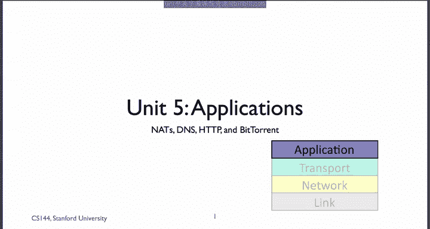
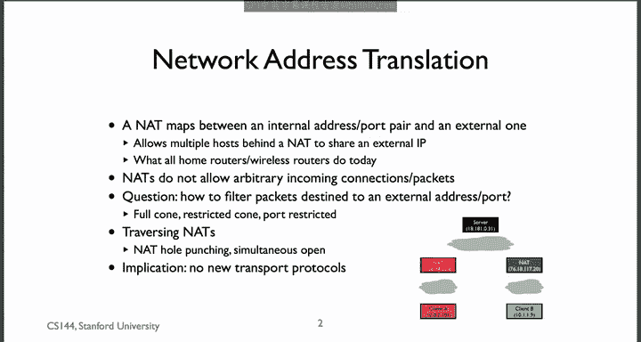
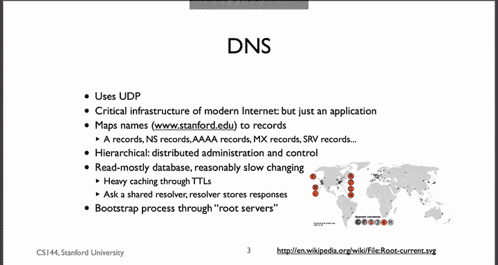
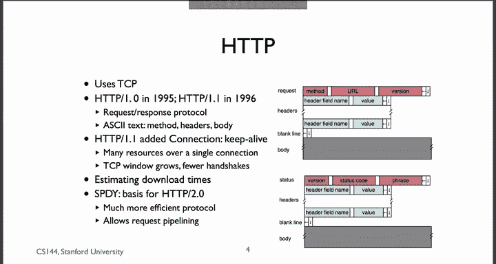
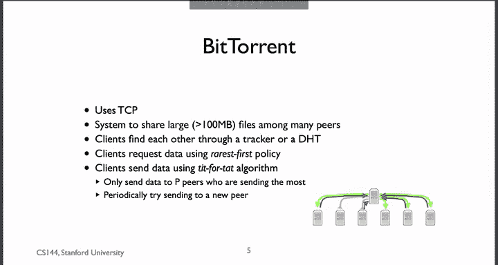
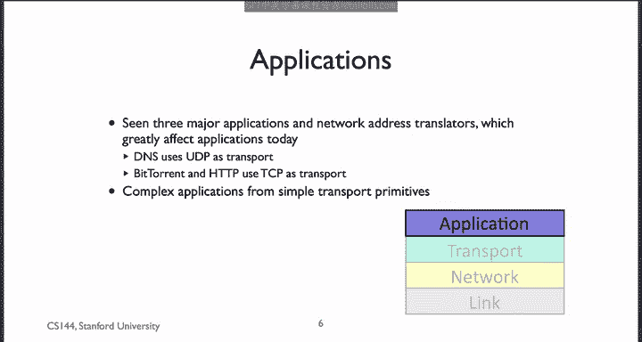

# 斯坦福大学《计算机网络｜Introduction to Computer Networking CS 144 2018》中英字幕deepseek - P83：-083-Applications and NATs re.zh_en - GPT中英字幕课程资源 - BV1bVqNYFEGg

In this unit， you learn about some of the major applications in the Internet today and how Nas or network address translators can complicate them。

 Nowadays， a new net you buy tends to be reasonably well behaved。

 but there are still many old nats out there that have some troublesome or difficult behavior。

Let's start with Nets。In this unit， you learn what a network address translator is and how it works。

 It's a router that allows many devices to share one IP address。

 It does this by rewriting packets as they pass through it。

 and that device has an external address to communicate with the outside world。

 which is a publicly routeable IP address。It manages a set or a subnet of private internal addresses。

 for example， all the IP addresses starting with 10 or all the IP addresses starting with 192。168。

The net device assigns one of the private addresses to itself， for example， 192。168。0。

1 and then assigns the remaining addresses to the devices in the internal network if you have a home Wifi router。

 it probably acts as a net device as well using the 192。168 subnet of IPV4 addresses。

You learn that when a Na routes a packet from the internal network to the external internet。

 it modifies the packet header so that it looks like the packet is coming from the Nat's single external IP。

It's essentially multiing all the packets from different internal addresses onto one external IP address for this to work。

 it needs a way to distinguish the reply packets flowing in the other direction so that it can correctly forward them to the correct internal device。

Net devices do this by modifying the transport port numbers to encode which internal device the transport flow comes from。

This means a nat is aware of the transport layer headers and modifies them， too。

 When a packet arrives from the external internet， it checks if the transport port number matches a mapping to an internal device。

 if it does， it modifies it and forwards it to the internal network。

Because an app device typically only creates a map from internal AP addresses to external port numbers when packets are flowing towards the outside world。

 it doesn't know what to do with packets showing up from the outside world that are trying to reach an internal device。

To some， this is a security benefit by default， you can only create outgoing connections。

 protecting your internal devices from attack from the outside world， but to others。

 this is a nuisance because you can't initiate a nu TCP connection from the outside world to the inside。

Then that will drop the TCP S packet。There are lots of different NA designs and many ways to map the IP addresses to outgoing port numbers。

 and we saw some of them in this unit each with its own complications。

The general consensus is that simple， less restrictive mappings are better because they give the appearance of end to end connectivity。

You also learned about some of the techniques people use to work around thats like net hole punching and simultaneous Open。

 but the main takeaway from this unit is nets make it hard to deploy applications in the internet that require a TCP connection to be set up from the outside world to devices behind nets。

 and it's hard to deploy new transport protocols because the net devices don't know how to process them。

In general， when people have created new transport protocols。

 they either masquerade as TCP or run on top of UDP。

You learned about the domain name system， an application that uses UDP。On one hand。

 it's critical infrastructure without which the internet would be much less useful。 On the other。

 it's just an application。You learned that the basic idea of the domain name system is that you can add hierarchical names such as www。

tanford。edu to different kinds of information called records。For example。

 you can ask what the IPv4 address of www。stanford。edu is。

 you can ask what the name server for Stanford。edu is， you can ask what the mail server for cs。

tanford。edu is。You learn that the domain name system works through a hierarchy of servers。

 for example， to find the address for www。stanford。edu。

 you first ask a root server where you can find out about the doedu， then ask。

edu where you can find out about Stanford， then finally ask Stanford for the address of www。stanford。

edu。Each of these records， the address records and the name server records on each step can be cached often for a long while to reduce load。

To make this caching work even better， often many clients share a resolver。

 a computer who queries the domain name service for you。That way。

 it can cache all of those results and share them among clients。That way。

 all of Stanford only needs to do a single lookup for Google as long as the record lasts。

 rather than having every laptop contacting Google's DNS servers。

HtTP is the Hytex transfer protocol it runs on TCP。

 We've been using the same version of HTTP that's version 1。1 for almost 20 years now。

 basically it's unchanged。You learn that HTTP is a request response protocol。

 both a request and response are in ASI textext， which is useful because it's very easy to read。

You learned one of the big improvements in HTTP 1。1 with something called Keep alive。In HTTP 1。0。

 each request was made on a separate TCP connection， so to download a page with 40 resources on it。

 your client had to open 40 TCP connections。H T T P 1。

1 allows a client to request many resources all on the same connection。

 This means less time is spent in the three way handshake。

 and the TC P connection has more time to grow its congestion window。

You learned ways to roughly calculate the download times for downloading a complete page and all of its resources。

Using this， you saw how connection setup time can be a significant overhead for TCP connections that transfer only a little bit of data。

 Finally， you heard a little bit about Spy， SDY， the protocol that's become the basis of H TTP 2。0。

The third application you learned about was bit torrent。Like ACTP， ItTrrt uses TCP。But unlike ACTP。

 which is a client server application。ViitTorrent is a large collection of collaborating clients called a Swarm。

Use bittorn to share large， say 100 megabyte files。

It to breaks these files up into smaller chunks called pieces。

You learn that each Bitcoin client opens connections to score。

 sometimes as many as 100 other clients。A client requests data from other clients using a rarest first policy。

 so it tries to avoid a piece disappearing from the swarm and also to remove bottlenecks。

You also learn that while Bitorrent is happy to request data from lots of peers。

 it's very careful about whom it sends data to。If Torent tries to set up an incentive system where you want to contribute data and let others transfer from you。

So the way it works is a node will send data to the P peers who are sending it the most data。

That way， the best way to get data from a peer is to send it data。

To better figure out who those best peers are， Bitorn occasionally starts sending into a new random peer in order to discover new potential partners in exchange。

 This algorithm is called the Tit for Tat algorithm。

So you've seen three major applications on the internet today。

 you've seen how the simple abstractions that UDP and PCCP provide can be used in complex ways for very interesting applications。

You also learned how network address translators can complicate applications by making it hard to discover peers or open connections as well as a few techniques for working around them。

You now should have a good understanding of some of the techniques you can use and challenges you might run into when you go out and develop the next generation of internet applications。

