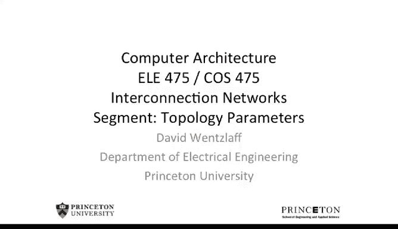
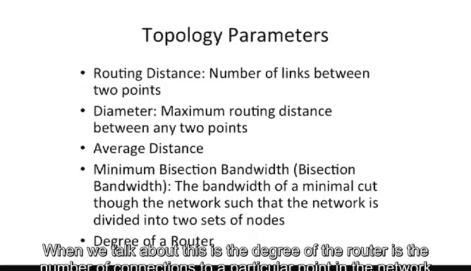
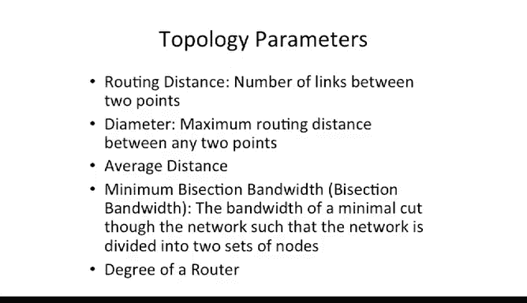
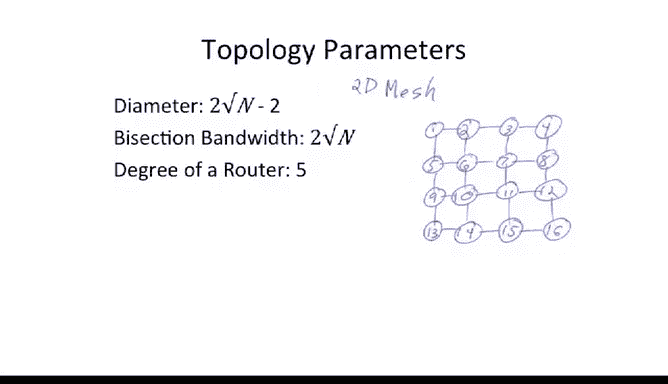
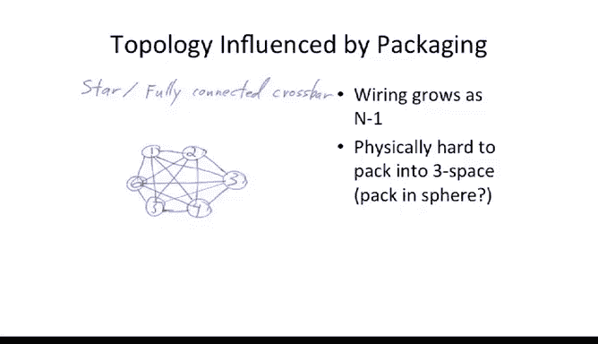
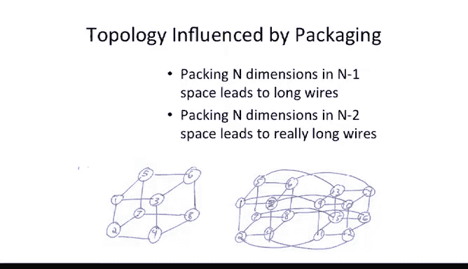
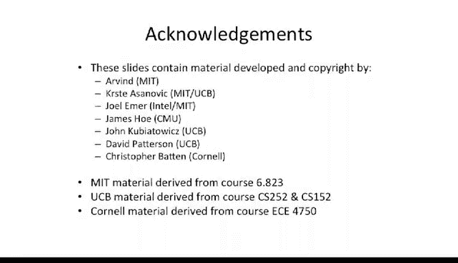

# 普林斯顿大学《计算机系统结构｜Computer Architecture》中英字幕 - P100：100_20_04_拓扑参数.zh_en - GPT中英字幕课程资源 - BV1ni421f7L6

Okay， so now we can start talking about different parameters。

Of these different topologies and start to compare different networks。

First thing we're going to talk about is routing distance， so I've already been using this term。

 but this is effectively the number of hops or the number of links that you need to traverse to go from one point in the network to another point in the network。

It's not the worst case one， it's not the best case one， it's just for any given two points。

 it is the distance。The diameter of the network I've already alluded to。

 but now we' put a name to it is the maximum routing distance。Between any two points in the network。

 and this is a important concern because you want to build your networks。

 you can build some of these long， narrow networks where maybe sort of things in the middle can communicate very well。

 but the things in the extents are very far away and very high latency to get to each other。

Orkeybuitzer。A network that looks something like this。We four very well connected nodes。

And you have this sort of long， long string coming out here， and you go from here。

To there is the worst case。Length， maximum ro distance， and that is。Our diameter。

So this takes that into account these sort of irregular networks。

These nodes might be very well connected， but this node is quite far away from the rest of them。

 And you could think about putting extra links in there to make everything closer。

The average distance is the。You compute all distances between all two pairwise points in your grid or in your topology。

 and then you divide it by the number of nodes in the system that's going to give your average or the number of pairs and that's going to be your average。

By section bandwidth。Or what sometimes people call minimum by sectionction bandwidth is an interesting concept。

It is the。

By definition， it's minimum。 So usually people drop this word， but I wanted to put it up here to。

Tell you guys that。You can't take any cut through a network。

 You have to take the minimal cut through the network。 So what I mean by that is， let's take a。嗯。

Let's go over this board。So this one bigger。We'll take a four area2 cube。Cizing our。

Anancy Nomenclature here？The minimum bisection bandwidth is a important。

Description of our network here because that's。How much bandwidth there is between half the nodes and the other half the nodes。

 So if you don't know your communication。Tology or you don't know how the rest of the traffic patternss are going to happen。

 You can just say， well， I want to maximize。The minimum of one half communicating with another half。

 That's a pretty good approximation of what you want to do now。Let's look at cuts。

Let's count the number of links we cut for bisection bandwidth。

 let's say we start here and we take a cut that looks like this。Actually。

 let's do for different color chalk。There we go。Cut， cut， cut， cut， so we want one， two， three links。

So it's one， two， three， four， five， six， seven， okay we want。Effectively。

We want to segment our network into two halves， so we want to make sure we actually can get half of our network at a time here。

2，3， that's probably not what we want to do。 We probably want a different cut to do that。

 Let's say we do something that looks like。1，2，3，4，5，6，7，1，2，3，1，2，3，4，5，6，7，8。那。Okay。

 so does that cut us into two halves，1， two， three，4， five， six， seven， eight， and eight nodes？

How many links do we cut， one， two， three， four， five， six links？Is our bisection bandwidth 6？Well。

 that is a valid bisection of the network。Cutter。Or partition our network into two different halves that are equal in number of nodes。

But it's not minimal。Let's look at a。Maybe a minimal one here。So Min one might look something。

Like this。Right down the middle。So the still partitions are networking the two halves。

Eight nodes here， eight nodes there。Except we've now cut one， two， three， four lakes。

So all I'm trying to get across here is if you want bisection bandwidth。

 you have to go the middle of bisection bandwidth and you to be careful about where you cut。

 and sometimes it's not readily apparent in more complex networks of where the minimum cut is。

So I've used this term so far， and I wanted to define it。 The degree of a router。 This is。

 this comes from graph theory。 When we talk about this is the degree of the router is the number of。

Connections to a particular point in the network or a particular node in the network。

So we'll talk about that as the degree。Something like a。Care or ACA。Four area2 cube here。

We're going to see that our we're going to have。One， two， three， four， and maybe one from the node。

Itself， so our degree here is  four or  five， depending on how you count。Strictly。

 if you look at just the whole router， the degree of the node is going to be four。

 if you look at including coming from sort of like the processor connection into that point。

 then we add an extra the degree of the switch is going to be five but the degree of the node is going to be four。

Okay， so let's take a look at some of these topology parameters here for a 2D mesh。

So here we have a simple 2D mesh。Our diameter。For this mesh is going to be one hop， two hops。

 three hops， four hops， five， hops， six hops。And if we generalize this。We see that it's actually。

Two square root of n。Minus2。Well， we subtracted two here because。

It doesn't take a hop to get to yourself look if you do the analysis here。If you look at this。

 you'd say well。From a big O notation。This should be。Square root of n。

But we don't have to make sort of the last top and the first hop， if you will。

 to get in and out of the node， so we subtract off two。

If you want to look at a 3 cube or a 3D mesh here， it's going to be something like。And。

K root of n minus n。Where n is the number of nodes in our。In our system。Bysection bandwidth。嗯。

If we look at this， we have a 16 node system。You take the square root of that， that's four。

Our bisection bandwidth is actually two times that because there's links going from left to right and right to left。

 we have a bidirectional network here， so we get two square root of n。Ass our bisection bandwidth？

And our degree of our router。If we assume that there is a entity that is sitting at these nodes as to communicate into the router is going to be five。

 and if you look at the just the network itself， it's going to be one less than that or four。

So we talked about this a little bit already， but I wanted to just talk a little bit more about it。

When you're going to build a big computer with lots and lots of nodes。

 whether this be wide area network or whether this be a particular sort of massively parallel machine or on chip network。

The packaging and the physical layout and the physical space you just fit in really influences your design。

So as we said， a star or a totally connected network or a fully connected crossbar is really great。

But it's really hard to pack into three space。You might be able to pack it。

 as we said in the outside of a sphere。

Unfortunately， at some point， the wiring density may just get too hard in the middle。

 you won't even be able to do that。People have talked about sort of doing things where you pack。

 let's say 10 nodes on the outside of a sphere， maybe with something like free space optics。

 you have lasers sort of shooting between all the different points。

It's possible people have sort of talked about this。

 I don't think On's actually implemented one of those for networks yet， but。

It's an interesting concept。Okay， so now we can start looking at packing。

Our hypercus into lower dimensional spaces here。It's probably possible to lay out a。N dimensional。

Cubbe in n minus1 spaces。So if we look at here， we have a three dimensional cube， I drew it。

On a two dimensional surface。It's not too bad if we wanted to actually sort of regularize this。

 we'd probably try to sort of fold these up and maybe have some of the links be twice as long as some of the other links。

So it's buildable。Now what gets really hard， though is if we start to take these higher dimensional systems and try to fold it into two space。

Now， why is two space interesting， Well， chips are effectively 2D space。

 you to put the transistors in a 2D plane unless we have some sort of 3D process technology。

If you're trying to build in three space。For instance。

 if you're trying to build in a supercomputer or something like that。

 where it actually is in a physically larger space， you might be able to play some tricks。

 so this would actually map very well。 our 3D hypercube here would fit very well。4D。

 you might able to fit in three space。But you probably would' have a hard time putting a five dimensional cube in three space。

 So sort of the rule thumb is you might be able to go up one extra dimension by increasing your wire length。

 but the wiring complexity gets pretty hard as you start to go even higher than that。

 Having said that people have built full hypercus in three space and had very long wires。

So a good example， this is the。Thinking machines or。Connection Mach one。

The CM1 was actually a hypercute with， I believe， 65，000 nodes。So big machine。嗯。

They actually sort of it was a little bit more complex design， if I would recall correctly。

 not all nodes were connected in the hypercue， they roughly had each chip which had a couple of nodes on it。

That had a 2D mesh on it， and then those chips were connected via a real hypercbe。

 but if you to go look at one of those， if you sort of looked in the back there's this huge wiring mess。

And。That could make sense。Back when they were making that machine。

The reason was wires were very fast relative to the transistor speeds。

So if the wires are really fast。You can have long wires in your system。

Relative to the transistor speeds。So if you're going multiple chips。

 it might make sense to actually have a higher dimensional network because then your router decision the routers。

Which are slow， relatively slow relatives to the wires。

 You can basically have a higher dimensional lookup or a higher dimensional switch point there and then have。

Fewer hops。 you have to go through fewer of those routers。 So that might be a good trade off。 Now。

 on the flip side， if we start to go look at something like on chip networks。

 we we're trying to build a multi core mini core chip with lots and lots of cores on one chip。

Nowadays， if you start to look at the wires are relatively slow and the transistors are quite fast。

So it starts to make a lot less sense to build these higher dimensional networks。

 It still might make some sense to go， let's say， in an n dimensional space or n minus1 space make an n dimensional network but you probably don't want to go a whole lot higher than that。

