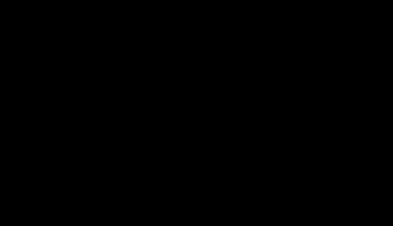

# 普林斯顿大学《计算机系统结构｜Computer Architecture》中英字幕 - P101：101_20_05_网络性能.zh_en - GPT中英字幕课程资源 - BV1ni421f7L6

Okay， so now we start talking about performance。Of our networks。And there's two。

Main thoughts I want to get across here are two really good ways to measure our networks。

 when we were talking about performance here， we were talking about。

Prameterters rather of the topology now we're going to look at。The overall network performance。

First thing is bandwidth。So bandwidth is the rate of data that can be transmitted。

Over a given network link。Divided by amount of time。Okay， that sounds pretty reasonable。

Layency is how long it takes to communicate。And send a completed message between a sender and a receiver。

In。Seconds， so the unit on this is seconds。 The unit on this is something like bits per second or bytes per second。

 so amount of data per second。These two things are linked。So if we take a look at something like。

Bandth， it can actually affect our latency。And the reason for this is。If you increase the bandwidth。

You are going to have to send。Fewer pieces of data for a long message。

Because you can send it in wider chunks or faster chunks or something like that。

So it can actually help with Latency。It can also help infiliency because it can help reduce your congestion on your network。

 Now we haven't talked about congestion yet。 we'll talk about in a few more slides。

But by having more bandwidth， it'll， you can effectively reduce the load of your network。

 and that will decrease your。It'll decrease the load of the network and it decrease the probability that you're actually going to have two different messages contending for a same link in the network。

Latency can actually affect our bandwidth， which is interesting。

 or rather it can affect our delivered bandwidth。It's not going to make our if we change the lasency。

 it's not going to make our links wider or our clock speed of our length faster。

 but it can make the delivered bandwidth higher。Now。

 how this can happen is let's say you have something like a round trip communication。

You're trying to communicate from point A to point B back to point A。😡，And this is pretty common。

 You want to send a message from one node to another node。

 It's going to do some math on it or do some work on， and it's going to send back the reply。

And if you can't cover that laneneency。If the lane here would get longer。

 the sender will sit there and just stall more and it effectively will decrease the bandwidth of the amount of data that can be sent。

Now， if you are good behind this latency by doing other work， that may not happen。

You may not be limited by the Lane Sea。But another good example of this is if you are worried about end to end flow control。

So a good example of this is in TCP IP networks， something like our ethernet networks。

 there's actually a round trip flow control between the two endpoints。

 which rates limits the bandwidth， and it's actually tied。To the La Sea。Because you need to have。

More traffic in flight to cover the round trip latency。

 and this starts to be called what's called a bandwidth delay product where you multiply your bandwidth multipied by the delay or the latency of your network。

 and if you increase the latency，The bandwidth will effectively go down if you do not allow for more traffic in flight wait before you can hear a flow control response。

So you'll see this if you have， let's say two points on the internet and you put them farther apart and you have the same amount of inflight data or what's called the window is the same。

The bandwidth。Is going to go down as you increase the latency。

But if you were to increase the window to actually stay high because your balanced delayed product。

 and the reason for that is you'd be waiting for as to come back from the receive side。Okay。

 so let's take a look at。An example here to understand these different parameters。We have a。

F node Oomega network here with。Two inputs， two output。Routers。

Each of these circles here represents input nodes， and these are the output nodes and they basically wrap around。

 and they're the same。Sort of thing。We have little slashes here。

 which we represent as serializers and decsializers。

So what this means is you're transmitting some long piece of data， and it gets。Sent as smaller。Fits。

 if you will， so we're setting on say a 32 bit。Word。

 and it gets serialized into four8 bit chunks across our network。

 across the links because the links of the network are only for or excuse me8 bits wide， we'll say。

🤧嗯。And in this network， we're going to have our latencies be。No non unit。

So let's say our link traversal here。Each link。Here takes two cycles， takes L0 and L1。

And our routers take three cycles， R0， R1 and R2。And to go from any point to any other point in this network。

 you have to go through two routers。And one link。So we can draw a pipeline diagram for this。

So for a given packet。We can see let's say it gets split into four fits here of the head fit。

 two body fits， and a tail fit。We start in the source and we send。

It takes three cycles to make a rowing decision through here。Two cycles across the link。Three cycles。

Across one of these routers here， and then we get to the destination。And if we look at this in time。

 it's pipeline。 We can have multiple of these things going on at the same time。

 So we have the next flips one cycle off or one cycle delayed。

And the reason we want to draw this is we want to look at what our latency is。For。

This sending this one packet because it's a little bit hard to reason about because we effectively have a pipeline here and we're overlapping different things。

And we'll see that one of the things you would think would be up there doesn't show up down here。

 So first， let's take a look at this。We have four cycles here at the beginning。

 which is just our serialization latency or the length of the packet divided by the bandwidth of the packet。

If you were to increase the bandwidth here， the serialization latency would go down。うん。Then we have。

Time in the router。Which is our router pipeline laency。

 so it's three cycles here and another three cycles in the second router。And we have more hops。

 this will go up。And then two cycles here for the channel latency， which we'll all call TC。

So you can see that it's the summation of all of these different latencies is our latency。

 but what's interesting to see is that there is no decialalization latency here。

So that's the one that's missing。 And it's because we've overlapped that because as pipeline。

 we're counting that。In the serialization La andency。Questions about that so far？Okay。

 so now let's take a look at。Our message La and C and go into a little more detail here。

If you look at our overall latency， which will'll denote as T。It's the latency for the head。

To get to the receiver。So that's all of this stuff here。Plus。The serialization latency。Now。Tea head。

Has RTC and RTR and the number of hops， but it also has something here。There is a contention。

Which we haven't shown。 So in this network here， there was no contention。

 this was the unloaded network。There was not multiple nodes or multiple messages trying to use one outbound link or use any one given link in this design。

 but that can happen。Let's say these two nodes here are sent at the same time。

 and they both need to use this link， you're going to get contention。

And that will increase our latency。But if we rule out the contention。For a little bit of time。

 we'll start to see the unloaded latency here。And we just decompose this into sort of sub components here that we have the。

Routing time。Times the number of router hops that we need to go。Plus。

Channel La and C times the number of channel links we need to hop across。Plus。

 the serization latency。And the reason we decompose this is this lets us reason about how to make networks faster。

😡，So we can see that there's a couple different ways to make our networks faster。

First thing we can do is we can make shorter routes that'll decrease both these uppercase h's here。

The reason I have two different uppercase Hs is it as you can see here。In this example。

 we basically went to two router hops and one link hop， usually they're connected though。

 if you have to go farther， you need more links and you need more router hops。

You could make the routers faster。So if you either increase the clock frequency of the routers。

 you can make them wider if they take multiple cycles。Now。

 if they're already sort of as fast as you can go， it may be hard。

 you might be able to increase the clock frequency somehow。

 but it could start to get hard at some point if there are already wide channels and wide muxes and have a fast clock rate。

Faster channels， so if you're going between multiple chips。

Usually you're limited sort of by the signal integrity of the communication links between the different chips。

 and this sometimes even happens on chip。So you have to think about that that going to a higher clock frequency could be problematic。

But if you make a faster channel， your latency is going to go down。And then finally。

This is our serialization sort of cost here， and we bake into it here either wider channels or shorter messages。

Maybe you have a lot of overhead on each message。 you have a really big header for the message。

 if you try to shrink that， that'll make your network go faster and reduce your latency just by sending less work or sending less data。

 but they may not always be possible， But a good example of this if you look at something like。

TCP on top of IP networks。In sort of our internet class networks。

People have proposed a whole bunch of revisions to that where they try to sort of squeeze out some bytes or use some sort of encoding standards to reduce the amount of data in the headers because TCP header is pretty long。

 for instance。And you already see a good example that they actually have an optional field in TCP headers。

 which is typically not sent。Thereby reducing that in the common case。Okay， so now let's。

Talk about the effects of congestion。So what I drew here is。A plot of our latency。Versus。

The amount of bandwidth that is achieved。Or offered bandwidth。And this is for a given network。

So it's pretty common that as you。Increase the bandwidth that you're using at any given network。

The latency of the network goes up because you start to see more congestion in the network。

So the probability。That any two points are contended for。

Will go up as you get closer to the maximum achiable bandwidth in the network。

Now there are some networks that people build where is the graph does not really look like this。

Or does that look？Like that。 So for instance， if you have a start topology。

You don't have any congestion， so you're going to get something that looks much more like an ideal plot here where you sort of have a straight line and another straight line。

😡，Because as you increase your load on the network， everyone can send to everyone else。

 so there's not to be in congestion in the network。And I have a few lines here that sort of。Show。

Interesting。Things that sort of hack down at this。 So in a perfect world。

 you'd have your zero load latency。 So this is the latency of the unloaded network。

 And as you increase the bandwidth。It wouldn't change。On our unloaded network。And with so。

And if you had no congestion in the network。But we but that's not usually what you see on real world networks。

A coupleup of other things sort of。Also。Decrease or increase the latency and decrease the bandwidth of a network。

Usually you have some。Roouting delay。They gets introduced into the network and that's going to basically push us away from higher bandwidth and lower latency。

 so you want to be farther down on this plot because that's lower latency。And also。

 if you have flow control。In the network， so local flow control that also looks like some form of congestion will actually slow down your network in certain cases。

But I just wanted to give you guys the idea here that。For any real world network。

 it usually looks something like this as you get closer and closer to using the whole network。

Using all the bits available by the network， the latency starts to shoot asymptically through the roof。

