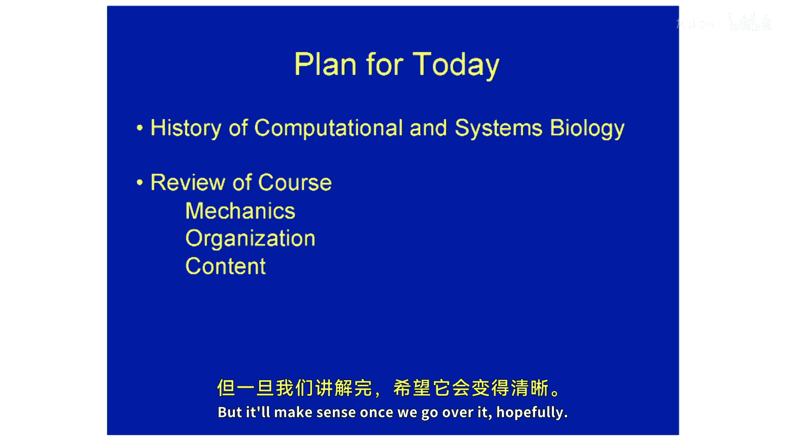

# 【计算与系统生物学基础 7.91J 2014】麻省理工—中英字幕 p01 p0 1. Introduction to Computational and Systems Biology -BV1HdzaYAE2a_p1-

The following content is provided under a creative Commons license。

 Your support will help M I T Open Coware continue to offer high quality educational resources for free。

To make a donation or view additional materials from hundreds of MI T courses。

 visit M T OpenCourseware at OCw。 MT。 Eduu。

Welcome to Foundations of Computational and Systems Biology。This course has many numbers。

 just will' explain all the differences and similarities。

 but briefly there are three undergrad course numbers， which are all similar in content， 736。

 2396802， and then there are four graduate versions。嗯。The 7，91，24，90 and HST versions are all。

Very similar， basically identical， but the 6874 has some additional AI content that we'll discuss in a moment。

Make sure that you are registered for the appropriate version of this course。

And please interrupt with questions at any time， the main goal today is to kind of give an overview of the course。

Both the content as well as sort of the mechanics of how the course will be taught and we want to make sure that everything is clear so this course is taught by myself and Chris Bge from Bi。

 Professor Frankel from BE and Professor Gifford from from EECS， we have three Ts， Peter Freees。

And Coette Picard from computational and systems biology and Taahhein from EECS。

 all the TAs have expertise in computational biology as well as other quantitative areas like math。

 statistics， computer science， so in addition to the lectures by the regular instructors。

 we'll also have guest lectures by George Church from Harvard toward the end of the semester。

 Doug Looffenberger will give a lecture in the regulatory network section of the course and we'll have a guest lecture from Ron Weis on synthetic biology。

And so just to note that today's lecture and all the lectures this semester are being recorded by Amps。

 byMT's OpenCourseWare， so the videos after a little bit of editing will eventually end up on OpenCourseWare。

What are these courses？These course numbers are the graduate level versions which are survey courses in computational biology。

 our target audience is graduate students who have a solid background。

And comfort solid background of biology， and also comfort with quantitative approaches。

We don't assume that you've programmed before， but there will be some programming。

 content on the homeworks， and you will therefore need to learn some Python programming。

 and the TAs will help with that component of the course。

 we also have some online tutorials on Python programming that are available。

The undergrad course numbers， this is an upper level undergraduate survey course and computational biology and our target audience are upperle undergraduates with solid biology background and comfort with quantitative approaches so there's one key difference between the graduate and undergraduate versions which I'll come to in a moment so the goal of this course is to develop understanding of foundational methods in computational biology that will enable you to contextualize and understand a good portion of research literature in the growing field so if you pick up science or nature or plus computational biology and you want to read those papers and understand them after this course you will have a better chance we're not guaranteeing you'll be able to understand all them but you'll be able to recognize perhaps the category of paper of the class and perhaps some of the algorithm roomss that are involved。

And for the graduate version， we also another goal is that to help you gain exposure to research in this field。

 So it's actually possible to do。😊，A smaller scale computational biology research project on your own。

 on your laptop on perhaps on Athena with you， relatively。

Limited computational resources and potentially even you discover something something new。

 And so we want to give you that experience。 And that's through the project component that we'll say more about in a moment。

 So just to make sure that everyone's in the right class。 So this is not a systems biology class。

There are some more focused systems biology classes offered on campus。

 but we will cover some topics that are important for analyzing complex systems。

 This is also certainly not a synthetic biology course。

 some of the systems methods are also used in synthetic biology and there will be this guest lecture mentioned Ron Weis which will cover cover synthetic biology It's also not an algorithms class we don't assume that you have experience in designing or analyzing algorithms will discuss various bioinformatics algorithms and you'll have the opportunity to implement at least one bioinformatics algorithm on on your homework。

But it's not you know algorithms are not really the center of the course and and there's one exception to this which is those of you who are taking 6874 will go to a special recitation that will cover。

 more advanced algorithm content and there will be special homework problems for you as well。

 so that course really does have more algorithm content。

Okay， so the plan for today is that I will just do a brief sort of anecdotal history of computational systems biology just to sort of set the stage and the context for the class and then we'll spend a significant amount of time reviewing the course。

 mechanics， organization and content because as you'll see it's a little bit complicated but it all makes sense once once we go over it。

 hopefully。

This is my sort of just my take on computational systems biology again it's not a scholarly overview。

 it doesn't hit everything important that happened。

 it's just sort of gives you a flavor of what was happening in computational biology sort of decade by decade。

So。First of all， where does this field fall in the academic scheme of things？

I consider computational biology to be actually part of biology。

 so in the way that the genetics or biochemistry are disciplines that have strategies for understanding biological questions。

 so does computational biology， you can use it to understand a variety of computational questions in gene regulation。

 many of areas。嗯。There is also some people make a distinction that bioinformatics is more about building tools whereas computational biology is more about using tools for example。

 although many people don it's very blurry and don't try to people use them in various in various ways and then you could think of bioinformatics as being embedded in the larger field of informatics where you include tools for management and analysis of data in general。

 it certainly true that many of the core concepts and algorithms in bioinformatics come from the field come from computer science come from other branches of engineering from statistics。

 mathematics and so forth。 So it's really acrossdisciplinary field。

 and then synthetic biology sort sort of cuts across in the sense that it's really an engineering discipline because you're designing and engineering。

 synthetic molecular cellular systems， but you can also use synthetic biology to help understand natural。

Biological systems， of course。All right， so what was happening decade by decade。 So in the 70s。

There were not genome sequences available or large sequence databases of any sort。

 except there were starting to be some protein sequences and early computational biologists focused on comparing proteins understanding their function。

 structure and evolution and so in order to compare proteins you need a protein。

 amino acid substitution matrix， a matrix that describes how often one amino acid is substituted for another。

 and Margaret Dehoff was a pioneer in developing these sorts of matrices and some of the matrices she developed。

 the Pam series are still used today and we'll discuss those matrices early next week。

So in terms of asking evolutionary questions， two big thinkers were Russ Doolittle and Carl Wos analyzing。

Both ribosomal RNA sequences to study evolution and Carlarl Wos realized looking at these R RNA alignments that actually the prokaryotes。

 which had been， there this big split between proaryotes and eukaryotes was sort of a false split that actually there was a subgroup of single-ceed anuclear organisms that were closer to the eukaryotes and named them the archaas。

 so a whole sort of kingdom of life was recognized really by sequence analysis and Ru doolittle also did a lot of analysis of protein sequences and sort of came up with this sort of molecular clock idea。

Or anyway contributed to that idea to actually build instead of systematics being based on。

Phenenotypic characteristics do it on a molecular level。So in the 80s。

 the database started to expand， sequence alignment and search became more important。

 and various people developed。Fast algorithms to compare protein and DNA sequences and align them。

 so the fast A program was widely used BL， several authors of BA are shown here， Dave Lipman。

 Pearson， We Miller or Stephen Alil， the statistics for knowing when a blast search result is significant or developed by Kin and All。

 and there was also progress in gap alignment， particularly Smith Waterman。

 shown above also progress in RNA secondary structure prediction from Nussonov and Zuker we'll talk about all of these algorithms during the course。

And there was also a development of literature databases， I always liked this picture。

 probably many of you probably used PubM。Al Gore was well coached here these experts and how to use it。

Then in the 90s， computational biology really started to expand。

 it was driven partly by the development of microwaves， the first genome sequences。

 and questions like how to identify domains in a protein， how to identify genes in the genome。

Where it was recognized that this family of models from electrical engineering。

 the hidden Markov model were quite useful for these sort of sequence labeling problems that was really pioneered by Andrews Crorog here and David Hesler and a variety of algorithms were developed that performed sort of these useful tasks。

It was also important progress in some of the earliest comparative genomic approaches since you have the first genomes were sequenced in the mid 90s of free living organisms and so you could then start to compare these genomes and learn a lot。

 we'll talk a little bit about comparative genomics and it was important。

Progress on predicting protein structure from primary sequence。

 particularly David Baker made notable progress on this on this Rosetta algorithm。

 So it's sort of a biophysics field， but， it's very much part of computational biology as well。

Okay so in the 2000s， definitely genome sequencing became very fashionable as can as you can see here and the genomes now larger organisms。

 including human became possible to sequence them and then this introduced a huge host of computational challenges in assembling the genomes annotating the genomes and so forth and we'll hear from Professor Gifford about some genome assembly topics and annotation will come up throughout。

😊，嗯。Actually， let just mentioned。 this is this is Jim Kent， who sort of。

Gru did the first human genome assembly that was widely used and also involved in UCSC。

 and here E and Bernie sort of started ensemble and continues to run it。

you know who these other people are from。 Okay， Allright， so in。

Sort of another phase of the last decade。I would say that。

Much of biological research became sort of more high throughput than it was before。

 So molecular biology had traditionally in the 80s and 90s， mostly focused on analysis of。

 of individual gene and protein products。But now it became possible and sort of in widespread use that you could measure the expression of all the genes in theory using microrays。

 for example， and you could start to profile all of the transcripts in the cell。

 all of the proteins in the cell and so forth and then a variety of groups started to use some of these high throughput data to study various challenges in gene expression to understand how transcription works。

 how splicing works， how microRNAs work， translation。

 epigenetics and so forth and you'll hear updates on some of that work， in this course。嗯。

Bio imageage informatics， particularly for developmental biology， became became popular。

 continues to be sort of a new， emerging area。Systems biology was also really sort of born around。

 you know， around 2000， roughly sort of very prominent example would be。The development of the first。

Gene regulatory network models that describe C urchin development here by Eric Davidson。

 as well as a whole variety of models of。Other gene networks in the cell that control things like cell proliferation。

 apoptosis， et cetera。At the same time， a new field of synthetic biology was born with the development of some of the first completely artificial gene networks that would then program cells to perform desired behavior。

 so an example would be this so-called repressciator where you have a network of three transcription factors。

 each represses the other and then one of them represses GFP and you put these into bacteria and it causes oscillations in GFP expression that are described by these differential equations。

Here and some of the modeling approaches used in synthetic biology will be covered by Professor Frankel and Lofftenberg later。

Alright， so late 200s， early 2010s， it's still。Still too early to say for sure what the most important。

Developments will be， but certainly。In the late 200s， next gen sequencing。

 which now probably should be called second generation sequencing。

 since there may be future generations。reallyally started to transform a whole wide variety of applications in biology from making genome sequencing instead of having to be done in a genome center。

 now an individual lab can easily do microbial genome sequencing and when needed it's possible also to do genome sequencing of larger organisms。

 transcriptscriptome sequencing is now routine。We'll hear about that。

 there are applications for mapping protein DNA interactions genome wide。

 including both sequence specificific transcription factors。

 as well as more general factors like histons， protein RNA interactions。

 method called clipse methods for mapping all the translated messages。

 the methyld sites in the genome openchroatin and so forth so many people contributed to this obviously just mentioning Barbara Woolve was a pioneer in both RNAse as well as as well as Chipsseq and some of the sequencing technologies that that came out here are shown here and we will discuss those at the beginning of lecture on Thursday。

 so I encourage you to read this review here by Metzker。

 which covers many of the newer sequencing technologies。And they're pretty interesting。

 as you'll see， there's an interesting。Tricks， interesting chemistry and。And image analysis tricks。

All right， so that was not very scholarly， but if you want a sort of a proper history。

 then this guy Helenm Stevens， who is a history of science PhD student at Harvard and recently graduated wrote this history of bioinformatics。

So let's let's look at the syllabus。 So also posted a seller site is syllabus looks like this。

 This is quite an information rich document。 It has all all the lecture titles。

 all the due dates of all the problem sets and so forth。 so please you know。

 print yourself a copy and familiarize yourself with it。 So we'll just sort of。😊。

Try to look at a high level first and then sort of zoom in to the details。 So at a high level。

 if you look in this column here。We've sort of broken the course into six different topics， okay。

 so there's genomic analysis， one that I'll be teaching。

Which is sort of more classical computational biology， you could say， local alignment。

Global alignment and so forth， then genomic analysis too， which Professor Gifford will be teaching。

 covers some newer methods that are required when you're doing a lot of second generation sequencing。

 the algorithms， the standard algorithms are not fast enough， you need better algorithms。

And so forth， and then I will come back and give a few lectures on modeling biological function。

 this will have to do with sequence motifs， hidden Markov models and RNA secondary structure。

 Professor Frankel will then do a unit on proteomics and protein structure。

 and then there will be an extended unit on regulatory networks。

 different types of regulatory networks will be covered with most of the lectures by Ernest and some one by David and one by Doug。

And then we'll finish up with， with computational genetics by， by David。 And there will also be。Some。

 some guest lectures， one of them interspersed similar networks。

 and then two at the end from Ron Weson and George Church。 So I just wanted to point out that。That。

In all of these topics we will include some discussion of motivating questions so what are the biological questions that we're seeking to address with these approaches and there will also be some discussion of the experimental methods so for example。

 in the first unit it's having on on sequence analysis so that we'll talk about how sequencing is done and then quite a bit about sort of the interaction between the experimental technology and the computational analysis。

 which is often involves statistical methods for estimating the error rate of the experimental method and things like and things like that so the emphasis is on the computational part that we'll have some some discussion about。

About experiments。Everyone with me said far any， any questions？All right。

 so what are some of these motivating questions that we'll be talking about？

What are the instructions encoded in our genomes， I can think of the genome as sort of a book。

 but it's in this very strange language and we need to understand the rules。

 the code that sort of underlies a lot of research in gene expression。How are chromosomes organized。

 what genes are present， so tools for annotating genomes？What regulatory circuitry is encoded。

 you'd like to be able to eventually look at a genome。

 understand all the regulatory elements and be able to predict that there's some feedback circuit there that responds to particular stimulation that responds to light or nutrient deprivation or whatever it might be。

Can the transcriptto be predicted from the genome， This is sort of a long standing question。

Translaome， if you will， well， let's say， let's say the proteome can be predicted from the。

Transcriptome in the sense that we have a genetic code and we can look up those triplets。

 so there's sort of a dream that we would be able to model other steps。

And gene expression with the precision with which the genetic code predicts translation that we'd be able to predict。

Where the polymerase would start transcribing， where we'll finish transcribing。

 how a transcript will be spliced。E cetera， all the other steps in gene expression。

And that motivates a lot of work in the field。Can protein function be predicted from sequence。

 So this is a very very classical problem。 But there are a number of new and interesting developments as you know。

 the sort of result from a lot of this， this high throughput data generation， both in。😊。

Nuccleic acid sequencing as well as in proomics， can evolutionary history be reconstructed from sequence again？

This has been a longstanding goal of the field and a lot of progress has been made here and now most evolutionary classifications are actually based on molecular sequence at some level and new species are often defined based on sequence。

Okay， other motivating questions。What would you need to measure if you wanted to discover the causes of a disease。

 the mechanisms of existing drugs， metabolic pathways and microorganisms。

 This is sort of a systems biology question。 You've got a new bug。 It causes some。Disease。

 what should you measure， should you sequence its genome， Should you sequence its transcriptome。

 Should you do proteomics， what type of proteomics。Should you perturb？

know the system in some way and do a time series， what are the sort of most efficient ways。

 what information should be gathered and in what quantities and how should that information be integrated in order to come up with an understanding of the physiology of that organism so that you can know where to intervene what would be suitable drug targets。

嗯。Yeah， what kind of modeling would help you to use the data to design new therapies or even in a sort of a synthetic biology context to reengineer organisms for new purposes？

Microbes to generate to produce fuel， for example， or other useful。Useful products。

What can we currently measure， what does each type of data mean individually。

 what are sort of the strengths and weaknesses of each of the types of high throughput approaches that we have and how do we sort of integrate all the data we have on a system to understand the functioning of that system。

 so these are sort of the。Some of the questions that motivate the latter topics on regulatory networks。

So let's now zoom in and look more closely at the core syllus。

 so I've just broken it into two halves just so you can see the。So it's more more readable。

 so today we're going over obviously course mechanics， mostly。嗯。

Next I'm sorry on Thursday we'll cover both some some DNA sequencing technologies and we'll talk about local alignment blast more on that in a bit。

There's。呃。One of the 68047 recitation 6874 recitation will be on Friday。

The other recitations we start next week and then as you can see。

 we'll move through the other topics so each of the instructors is going to briefly review their topics so I won't go through all the titles here but please note on on the left side here that their assignment due dates are marked and they're all due at noon on the indicated day and so some of these are problem sets so for example problem set1 will be due on Thursday。

 February 20th at noon and some of the other assignments relate to the project component of the course。

 which we're going to talk more about in a moment， in particular。

 we're going to ask you to submit brief statement of your background and your research interests related to forming teams so the projects are going to be done in teams of one to five。

And in order to facilitate。Eially cross disciplinary teams。 you know， we'd love if you you know。

 interact with， maybe students in a different grad program or whatever。 you， you'll post your。

 your background。 You know， I'm a first year B， E student， and I have a。

Background in pearl programming， but never done Python or whatever something like that。

 and then interested in modeling， you know in doing systems biology。

 modeling in microbial systems or something like that。

 And then you can match up your interest with others and form teams and then you'll come up with your own project ideas so that the team and initial idea will be due here February 2025th。

 then you'll need to do some aims and so forth。 So the project components here。

 these are only for those taking the grad version of the course we'll make that clear later so after the first three topics here by taught by myself and David there will be an exam。

More on that later， and then there will be three more topics mostly taught by Ernest。And。

Notice there are additional assignments here related to the project。

 such's the research strategy and the final written report， additional problem sets。

We'll have a guest lecture here。 This will be Ron Weis， then there will be the second exam。

Exampams are non cumulative， so the second exam will just cover these three topics here。And yeah。

 predominantly。There will be another guest lecture。

 this would be George Church here and then notice here presentations， so those who are doing。

The project component， those teams will be given assigned a time to present to the class the results of their research。

You will get you'll be graded， I mean， the presentation will be sort of part of the overall project grade assigned by the instructors。

 but you also will also ask all the students in the class to send comments on the presentations so you may find you get helpful suggestions about interpreting your data from other people and so forth。

 So that'll be a required component of the course for all students to attend the presentations and comment on them and we hope that will be a lot of fun。

Okay， so is this the right course for me？So I just wanted to sort of let you know， you know。

 I you're fortunate to have a rich selection of courses in computational systems。

 synthetic biology here at MI T。 I've listed many of them， probably probably not all， but。

 but the ones that I'm aware of that are available on the on campus。😊。

757 is really only for biology grad students， but the other courses listed here are generally open。

 some are more geared for graduate students， some more undergrads， some are more specialized。

 so for example， Jeff Gore's systems biology course it's more focused on systems biology whereas our course covers both computational and systems。

Keep that in mind， make sure you're in the right place that this is what you want。Okay。

 a few notes on the textbook。 so there is a textbook， it's not required。

 It's called Understanding bioioinformatics， Biasveable and B。It's quite good on certain topics。

 but it really only covers about maybe a third of of what what we cover in in the course。

 So there is good content on local alignment， global alignment， scoring matrices。

 the topics of the next next couple lectures。 and I'll sort of point you to those， those chapters。

 but。it's very important to emphasize that the content of the course is really what happens in lecture and on the homeworks and to some extent。

 what happens in recitation and the textbook is just there as as a backup， if you will。

 or for those who would like to get more background on the topic or want to sort of read a different description of of that topic sos you know you decide whether you want to purchase the textbook or not。

 it's available at the coop or through Amazon， you know shop around， you can find it。 it's paperback。

Pretty good， pretty good general reference on a variety of topics。

 but doesn't really have much on systems biology。All right。

 another important reference that was developed specifically for this course a few years ago is the probability in statistics primer。

 so you'll notice that some of the homeworks particularly。

And the earlier parts of the course will have significant probability and statistics。

 and we sort of assume that you have some background in this area。 Many of you do， if you don't。

 you'll need to pick that up。 and this primer was written to provide those topics in probability。

 especially that our sort of foundational and most relevant to computational biology。 So。

 for example。There's some。Commonly， theres some concepts like P value， probability density function。

Probably mass function。Cumulative distribution function， and then common distributions。

 exponential distribution， Poisson distribution。Extreme value distribution if so maybe hope you know if those are mostly sounding familiar to you。

 thats that's good if they're familiar， but you couldn't， you know， you really don't， you know。

 you get binomial and plusson confused or something then you know definitely you want to consult the consult this primer okay。

 so I think you know looking at the the lectures。And the homeworks。

 it should probably be pretty clear which aspects are going to be relevant。

 and I'll try to point those out when possible and you can also consult your Ts if you're having trouble with the probability and statistics content。

 So we are going to focus here on really the computational biology。

 bioinformatics content and not you know we might briefly review a concept from probability like maybe conditional probability when you talk about Markov chains。

 but we're not going to spend a lot of time so if that's the first time you've seen conditional probability。

 you might be a little bit lost。 so be better off reading about it in advance。Okay。Questions。

No questions， Maybe's the video is intimidating people。All right。

The TAs know a lot about probability statistics， willll be able to help you。Okay， so homework。

 so I apologize the font is a a little bit small here， So try I'll try to state it clearly。

 So there are going to be five problem sense。That are roughly one per topic。

 except you'll see PSAT two covers topics two and three， so it might be a little bit longer。

They will have。The way we handle。Sort of students who have to travel。

 so many of you might be seniors， you might be interviewing for graduate schools or you might have other you know other conflicts with a course。

 so rather than doing that on a case by case basis， which we found it gets very complicated。

And is not necessarily fair。 The， the way we've set it up is that the total number of points available on the five homeworks is 1 hundred20。

 Okay， but the， the maximum score that you can get is 100。 Okay， so if you。For example。

 were to get 90%。On all five of the homeworks， that would be 90% of 120。To be 108 points。

 you would get the full0， you know you get 100% on your homework。

 That would be a perfect score on the homework。 Okay but because of that。

 because there's more points available than sort of you need we don't allow you to drop homeworks and or to do like an alternate assignment or something like that。

 the way the way it works is you could basically miss as long as you do well on， say。

 four of the homeworks， you could actually miss one without much of a penalty for example。

 if each of the homeworks were worth 24 points and you got perfect score on four of them that would be that would be 96 points。

 you would have like an almost perfect score on your homework and you could miss that fifth homework。

 Now， of course，' we don't encourage you to to skip that homework we think the homeworks are are useful and are a good way to solidify the information you've gotten from from lecture and reading and so forth。

 So。It's good to do them。 And doing the homeworks will。

 will help you and perhaps preparing you for exams。 But。

 but that's sort of the way we handle the homework policy。

 And I should also mention that not all the homeworks will be the same number of points。 will。

 a portion of the points in proportion to the difficulty and length of the homework assignment。 So。

 for example， the first homework assignment is a little bit easier than the others。

 So it's going to have somewhat。Fewer points so late assignments。

 So all the homeworks will do at noon on the indicated day。 and if it's within 24 hours after that。

 then you'll be eligible for 50% credit。 And beyond that。

 you don't get any points in part because the Ts will be posting the answers to the homeworks。

And we want to be able to post them promptly so that you get the answers while those problems are fresh in your mind。

Questions about homeworkmarks。Okay， so collaboration on problem sets。We want you to。

Do the problem sets。 You can do them independently。

 You can work with a friend on them or even in a group， discuss them together。

 But write up your solutions independently。 you don't learn anything， know。

 by copying someone else's solution。 And if。对。T A， C。

 duplicate or near identical solutions that both of those homeworks will get will get a zero。

 okay and this occasionally happens and we don't want this to happen to you。 So。

 so just avoid that okay so discuss together but write up your solutions separately。

 similarly with programming， if you have a friend who's a more experienced programmer than you are。

 you know， by all means， you know。Ask them for advice， general things。

 How should I structure my program， Do you know a function that you know。

 generates a loop or whatever， whatever it is that you need， But you know， don't。

Share code with anyone else。 Okay， that would be， that would be a no note。

 So write up your code independently。And again， the grade will be looking for identical code and that will be thrown out and so we don't want to have any misconduct of that type occurring。

All right， so recitations， there are three recitation sections offered each week。

Wednesday at4 by Peter， Thursday at4 by Colette Friday at 4 by Tahein。

 and that is a special recitation that's required for the 6，8，7，4 students。 David yes。

 and has additional AI content。 So anyone is welcome to go to that recitation。

 but those who are taking 6，8，7，4 must go the other for students registered for the other versions of the course。

 going to recitation is optional but strongly recommended because the Ts will go over material from the lectures material that's helpful for the homeworks orre studying for the exams in the first weeks Python probability as well。

 So you know go to the recitations， particularly if if you're having trouble in the course。

 So Tahein's recitation starts this week and Peter and Coettes will start。We'll start next week。

 question， yes。Peter and Colette will cover similar material。

 and Tahin will cover different material。Okay， Python instruction， so the first problem set。

 which will be posted this evening is doesn't have any programming on it。But。

If you don't have programming， you need to start learning it very soon。

 okay and so there will be a significant programming problem on PSet2。

 and we'll be posting that problem soon this week sometime。

 And you want to look at that engage like how much Python do I need to learn to at least do that problem So what is this project component that we've been hearing about。

 So here's a more concrete description。 So again， this is only for the graduate versions of the course。

 So。Students will basically we've sort of structured it so there's， you know。

 you kind of work incrementally toward the final the final research project and so that we can offer feedback and help along the way if if needed。

 So the first assignment will be。Next week， I think it's on Tuesday where。

We'll then have more instructions on Thursday's lecture。

 but all the students registered for the grad version will submit their background and interests for posting on the course website。

 and then you can sort of look at those and try to find other students who have ideally similar interests。

 but perhaps somewhat different backgrounds is particularly helpful to have a strong biologist on the team and perhaps a strong programmer would help as well。

mSo。Then you will choose your teams and submit a project title and one paragraph summary that will the basic idea of your project。

We are not providing a menu of research projects。 It's your choice， whatever you want to do。

 as long as it's related to computational and systems biology。 So it could be。

Alysis of some publicly available data could be analysis of some data that you got during your rotation or for those of you who are already in labs that you're actually working on。

 it's totally fine and encouraged that the project be something that's related to your main PhD work if you've started on that。

It could also be more sort of in the modeling， some modeling with MATLb or something if you're familiar with that。

 but variety of variety of possibilities， we'll have more information on this later。

 but we want you to form teams， the teams can can work independently or with up to four friends in teams of five and if people want to have a giant team to do some really challenging project than you can come and discuss with us and we'll see if that would work。

So then there's the sort of initial title and one paragraph summary。

 we'll give you a little feedback on that and then you'll submit an actual specific aims document so with actual like NIH style specific aims。

 the goal is to understand whether this organism has operaons or not or whatever some actual scientific question。

And a bit about how you will undertake that and then you'll submit a longer two page research strategy。

 which will include like specifically we will use these data。

 we'll use this software these statistical approaches。

 that sort of thing and then toward the end of the semester。

 a final written report will be due that'll be five pages， you'll work on it together。

 but it'll need to be clear who did what， you'll need like an author contribution statement so and so did this analysis。

 so and so wrote this section。That sort of thing。And then as I mentioned before。

 there will be oral presentations by each team on the last two course sessions。

Questions about projects。There's more information on the course info document online。Okay， good。Yes。

For those taking 6874， in addition to the project， there will also be additional AI problems on both the PSEets and the exam。

 David， yes。And they're optional for others。All right。Okay， so how are we going to do the exam。

 So there's as I mentioned， there's two 80 minute exams。 they're non- cumulative。

 so the first exam covers basically the first three topics， the second exam on the last three topics。

 there are 80 minutes there during normal normal class time。There's no final exam。The grading。

 so for those taking the undergrad version， the homeworks will count 36% out of the maximum 100 points。

And the exams will count 62% and then this peer review where there's two days where you go and you listen to presentations and you submit comments online count counts 2% for the graduate bioBE。

 HSD versions， it's 30% homeworks。48% exams， 20% project， 2% peer review。For the EECS version， 6874。

25% homework，48% exams，20% project， and then 5% for these extra AI related problems and 2% peer review。

 and those should add up to 100。 And then in addition。

 we will award 1% extra credit for you outstanding class participation。 So questions。

 comments you know during during class。All right。So few announcements about topic one and then we' each of us will sort of review the topics that are coming up。

 so PSAT1 will be posted tonight it's due February 20th at noon。

 it involves basic molecularbiology probability and statistics give you some experience with BLS and some of the statistics associated PSet 2 will be posted later this week。

 so you don't need to obviously start on PSAT2 yet it's not do for several weeks but definitely look at the programming problem to give you an idea of what's involved and what to focus on when you're reviewing your Python。

Mention the probability stats primer sequencing technology。 So for Thursday's lecture。

 it would be very helpful if you read the review by Metzker on Next gen sequencing technologies。

 it's pretty well written， covers Iumina 4，5，4 pack bio and a few other interesting sequence technologies。

嗯。Other background readings， so we'll be talking about local alignment， global alignment statistics。

 and similarity matrices for the next two lectures and chapters four and five of the textbook provide a pretty good background on these topics。

 I encourage you to take a look。So I'm just going to briefly review my lectures and then we'll have David and Ernest do the same。

 so sequencequenc technologiesologies will be beginning of lecture2。

 and then we'll talk about local sequence local unGap sequence alignment， particular blast。

 so blast is something like the Google search engine of bioinformatics， if you will。

 it's one of the most widely used tools and it's important to understand about how it works and in particular how to evaluate the significance of blast hits。

 which are described by this extreme value distribution。Here。All right， and then lecture 3。

 we'll talk about global alignment and introducing gaps into sequence alignments。

 We'll talk about this。Dynamic programming algorithms， Needleman Woch， Smith Waterman。

 and in lecture4， we'll talk about comparative genomic analysis of gene regulation。

 so using sequence similarity across genomes to infer location of regulatory elements such as microRNA target sites。

 other things like that。so I think this is now， oh， sorry。

 a few more lectures then in the next unit modeling biological function。

I'll talk about the problem of motif finding， so searching。

A set of sequences for a common sub sequenceequence or similar subs sequenceequences。That。

Possess a particular biological function， like binding to a protein。

It's often a complex search space， we'll talk about the giveb sampling algorithm and some alternatives and then in lecture 10。

 we'll talk about Markov and hiddend Markov models which have been called the LeGOs of bioinformatics which can be used to model a variety of sort of linear sequence labeling problems。

And then on the note。Last lecture of that unit， talk a little bit about protein。

 I'm sorry about RNA secondary structure。 So the base pairing。Of RNAs。

 predicting it from thermodynamic tools as well as。Comparative genomic approaches。

 And you'll learn about this en tool and how you can use a diagram like that to infer that this RNA may have different possible structures that I can fold into。

 like those。Alright， so I'm gonna pass it off。这位。Thanks very much， Chris。Right， so I'm David Gifford。

 and I'm delighted to be here。 It's really a wonderfully exciting time in computational biology。

 And one of the reasons it's so exciting is shown on this slide。

 which is the production of DNA based sequence per instrument over time。 And as you can see。

 it just amazingly。😊，More efficient as time goes forward。

 And if you think about the reciprocal of this curve。

 the cost per base is basically becoming extraordinarily low。

And this kind of instrument allows us to produce hundreds of millions of sequence reads for a single experiment。

And thus do we not only need new computational methods to handle this kind of a big data problem。

 but we need computational methods to represent the results in computational models。

 and so we have multiple challenges computationally because modern biology really can't be done outside of a computational framework。

And。To summarize the way people have adapted these high throughput DNA sequencing instruments。

 I built this small figure for you， and you can see that Professor Burge would talk about DNA sequencing next time。

 and obviously you can use DNA sequencing to sequence your own genomes or the genomes of your favorite pet or whatever you like。

 and so we'll talk about in lecture6， how to actually do genome sequencing。

And one of the challenges in doing genome sequencing is how to actually find what you have sequenced。

 and we'll be talking about how to map sequence reads as well。

Another way to use DNA sequencing is to take the RNA species present in a single cell or in a population of cells and convert them into DNA using reverse transcriptase。

Then we can sequence the DNA and understand the RNA complement of the cell， which of course。

 either can be used as messenger RNA to code for protein or for structural RNAs or for noncoding RNAs that have other kinds of functions associated with chromatin。

In lecture 7， we'll be talking about protein DNA interactions。

 which Professor Burge already mentioned， the idea that we can actually locate all the regulatory factors associated with the genome using a single high throughput experiment。

We do this by isolating the proteins， and their're associated DNA fragments and sequencing the DNA fragments using this DNA sequencing technology。

So， briefly。The first thing that we'll look at in lecture 5 is given a reference genome sequence and a basket of DNA sequence reads。

 how do we build an efficient index so that we can either map or align those reads back to the reference genome。

 that's a very important and fundamental problem。 because if I give you a basket of 200 million reads。

 we need to be able to this alignment very， very rapidly and quickly and accurately。

 especially in the context of。Repeitive elements， because a genome obviously has many repeats in it。

 and we need to consider how our indexing and searching algorithms are going to handle those sorts of elements。

In the next lecture， we'll talk about how to actually sequence a genome and assemble it。

So the fundamental way that we approach genome sequencing， given today's sequencing instruments。

 is that we take intact chromosomes at the top， which of course。

 are hundreds of millions of bases along， and we shatter them into pieces。

And then we sequenced size selected pieces。In a sequencing instrument。

And then we need to put the jigsaw puzzle back together with a computational assemblymbler。

 so we're talking about assembly algorithms， how they work， and furthermore。

 how to resolve ambiguities as we put that puzzle together。

 which often arise in the context of repetitive sequence。And in the next lecture of lecture 7。

 we'll be looking at how to actually take those little DNA molecules that are associated with proteins and analyze them to figure out。

Where particular proteins are bound to the genome and how they might regulate target genes。

 here we see two different occurrences of OC4 binding the events binding approximately to the SoOX2 gene。

 which they are regulating。So that's the beginning of our。Analysis of D。sequencing。

And then we'll look at RNA sequencing， once again when going through a DNA intermediate and ask the question。

 how can we look at the expression of particular genes by mapping RNA sequence reads back onto the genome？

And there are two fundamental questions we can address here， which is。

 what is the level of expression of a given gene。And secondarily， what isoforms are being expressed。

The second sets of reads you see up on the screen are split reads that cross splice junctions。

 and so by looking at how reads align to the genome。

 we can figure out which particular exons are included or excluded from a particular transcript。

So that's the beginning of sort of the high throughput biology genomic analysis module。

And I'll be returning to talk later in the term about computational genetics。

Which really is a way to summarize everything we're learning in the course into an applicable way to ask fundamental questions about genome function。

Which Professor Burs talked about earlier。Now， we all have about 3 billion bases in our genomes。

 and as you know， you differ from the individual sitting next to you about in one in every thousand0 base pairs on average。

And so one question is， how do we actually interpret these。Diffences between genomes。

 and how can we build accurate computational models that allow us to infer function from genome sequence。

And that's a pretty big challenge。So， we'll start。By asking questions about what parts of the genome are active and how can we annotate them？

So we can use， once again， different kinds of sequencing based assays to identify the regions of the genome that are active in any given cellular state。

And furthermore， if we look at different cells， we can tell which parts of the genome are differentially active。

Here you can see the active chromatin during the differentiation of an ESL into a terminal type over a 50 kilob window。

 and the regions of the genome that are shaded in yellow represent regions that are differentially active。

And so using this kind of DNA seekq data and other data。

 we can automatically annotate the genome with where the regulatory elements are and begin to understand what the regulatory code of the genome is。

So once we understand what parts of the genome were active。

 we can ask questions about how do they contribute to some overall phenotype。And our next lecture。

 our lecture 19， will be looking at how we can build a model of a quantitative trait based upon multiple loci and the particular alleles that are present at that loci。

 So here you see an example of a bunch of different quantitative trait loci that are contributing to the growth rate of yeast in a given condition。

So part of our exploration in。During this term will be to develop computational methods to automatically identify regions of the genome to control such traits and to incite them significance。

And finally， wed like to put all this together and ask a very fundamental question。

 which is that how do we assign variations in the human genome to differential risk for human disease。

And associated questions are， how can we assign those variants to what best therapy would be applied to the disease。

 what therapeutics might be used， for example？And here we have a bunch of results from genome wide association studies。

 studied the type of bipolar disorder， and at the bottom is type 2 diabetes。

And looking along the chromosomes， we're asking which locations along the genome have variants that are highly associated with these particular diseases。

In these so called Manhattan plots because of things that stick up look like buildings。

And so these sorts of studies are yielding very interesting insights into。

Vants that are associated with human disease， and the next step， of course。

 is to figure out how to actually prove that these variants are causal and also to look at mechanisms where we might be able to address what kinds of therapeutics might be applied to deal with these diseases。

So those are my two units， once again， high throughput genomic analysis。And secondarily。

 computational genetics。And finally， if you have any questions about 687，4。

 I'll be here after a lecture， feel free to ask me。P。I care about Steve。All right。

 so in the preceding lectures you'll have heard a lot about the amazing things we can learn from nucleic acid sequencing and what we're going to do in the latter part of the course is look at other modalities in the cell。

 obviously there's a lot that goes on inside of cells that's not taking place at level of DNA RNA。

 so we're going to start to look at protein， protein interactions and ultimately protein interaction networks。

So we'll start with the small scale looking at intermolecular interactions of the biophysics。

 the fundamental biophysics protein structure， then we'll start to look at protein protein interactions。

 And I said， the final level will be networks。There's been an amazing advance in our ability to predict protein structure。

 So it's always been the dream of computational biology to be able to go from the sequence of a gene to the structure of the corresponding protein。

 And ever since Anen， we know that at least that should be theoretically possible for a lot of proteins。

 but it's been computationally virtually intractable until quite recently。

 and a number of different approaches have allowed us to predict protein structure。

 So this slide shows， for example， I don't know which ones which， but in blue。

 perhaps prediction in red， the true structure way around。

 but you can see it doesn't matter very much， we're getting extremely accurate。

 predictions of small protein structure。😊，There are a variety of approaches here that live on a spectrum。

 On the one hand， theres the computational approach that tries to make special purpose hardware to carry out the calculations for protein structure。

 And that's been wildly successful。 on the other end of the extreme。

 Theres been the crowdsourcing approach to have gamers try to predict protein structure。

 And that turns out to be successful。 And there's a lot of interesting computational approaches in the middle as well。

 And so we explore some of these different strategies。😊。

Then the ability to go from just saying a single protein structured how these protein interacts。

 So now there are pretty good algorithms predicting protein protein interactions as well。

 and that allows us them to figure out not how these proteins function individually。

 but how they begin to function as a network。 Now， one of the things that we've already going to be touched on early parts of the course are protein DNA interactions through sequencing approaches。

 We want to now look at them at a regulatory level。

 and could you reconstruct the regulation of a genome by predicting the protein DNA interactions。

 And there's been a lot of work here。 we talked earlier about Eric Davidson's pioneering approaches。

 a lot of interesting computational approaches as well。

 that go from the relatively simple models we saw on those earlier slide to these very complicated networks that you see here。

 We'll look at what these networks actually tell us how much information is really encoded in them they are certainly pretty。

 whatever they are。 We'll look at other kinds of interaction networks。

 We look at genetic interaction networks as well。And perhaps some other kinds。 And finally。

 we'll look at computable models。 And what do we mean by that。

 We mean models that make some kind of very specific prediction， whether it's a Boolean prediction。

 This gene will be on or all for perhaps an even more quantitative prediction。

 So we'll look at logic based modeling and probably Bayesian networks as well。😊。

So that's been a very whirlwind tour of the course just to go back to mechanics。

 make sure you're signed up for the right course， the undergraduate versions of the course do not have a project and they certainly do not have the artificial intelligence problems then there are the graduate versions that have the project that do not have the eye and finally the 6874 which has both so please be sure you're in the right class so you get credit for the right assignments。

And finally， if you've got any questions about the course mechanics。

 we have a few minutes we can talk about it here in front of everybody。

 and then well all be available after class a little bit to answer questions。So please any questions？

Yes。Can undergrad through project Well they can sign up for the graduate version， absolutely。

Other questions， yes。呃，ながある。I'll send an email to the staff list and we'll see what we can do。

Other questions。Yes。Sa，7。Oh， the thing we list as alternative classes。 Sorry， fix that。哎。Yeah明。

We delete it from our slides， yes。😊，We were powerful， but not that powerful。Other questions。

 comments， critiques， yes， in the back。Are each of the exams equally weighted， yes， they are。Yes。😊。

Before。additional AI problems AI problems。That mean that we have more questions on the exam。

 but just as much time。The question was， if you're in 6，8，7。

4 and you have the additional AI questions on the exam， does that mean you have more questions。

 but the same amount of time。 And I believe the answer to that is yes。

We will revisit that question at a later date。But， of course。

 six students are just so much smarter than everyone else， right？Yes。PVers a classifier that。Sorry。

 can you say that again。 of class the a Can you switch between different versions of class by the a drop deadline in principle。

 yes， but if you haven't done the work for that， then you will be in trouble。

And there may not be a smooth mechanism for making up missed work that late because the add drop deadline is rather late。

 So Id encourage you， if you're considering doing the more intensive version or not。

 sign up for the more intensive version， you can always drop back once we form groups though。

 for the projects， then obviously there is an aspect of letting down your teammates。

 So think carefully now about which one you want to join， it'll be hard to switch between them。

 but we'll do whatever the registrar requires us to do in terms of allowing it。😊，Other questions。

Yes see star sites remain separate， can we on the Reds access the AI problems just。Yes， you will be。

 if course sites remain separate， will undergrads be able to access the AI problem， the answer is。

 yes。Yes。Should students in 6，8，7，4，1 both recitations not necessary。

 You're welcome to both if you want， but the course 6 recitation should be sufficient。

Other questions。Yes。What's covered。What's covered in the Ro stations。

 it'll be reinforcing material that's in the lectures。

 so the goal is not to introduce any new material in the course 20， Course 7 recitations。

Just Cla had not to introduce any material。Other questions。Okay， great。

 and we'll hang around a little bit to answer any remaining questions that may come up。

