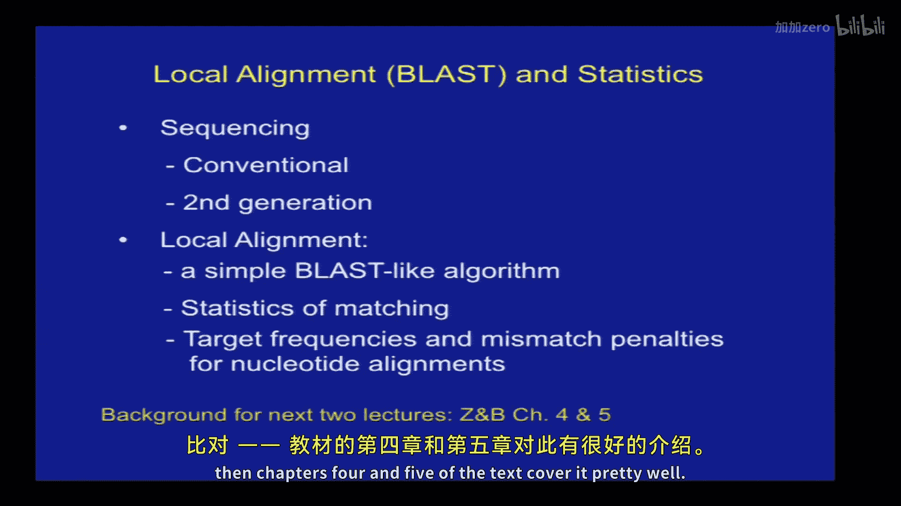
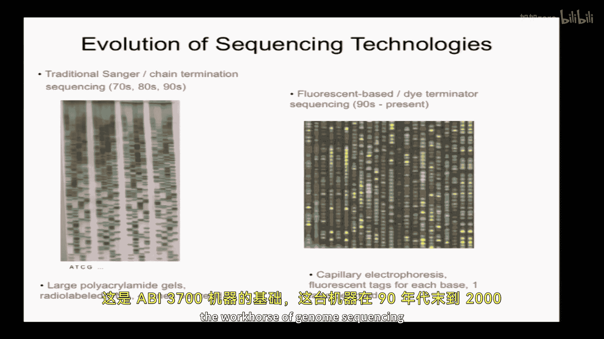
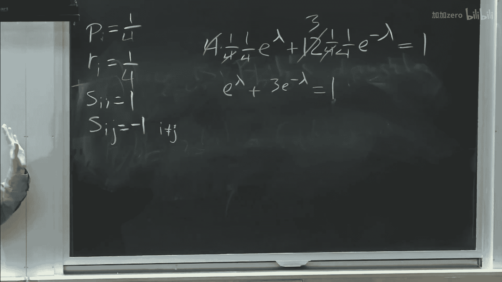
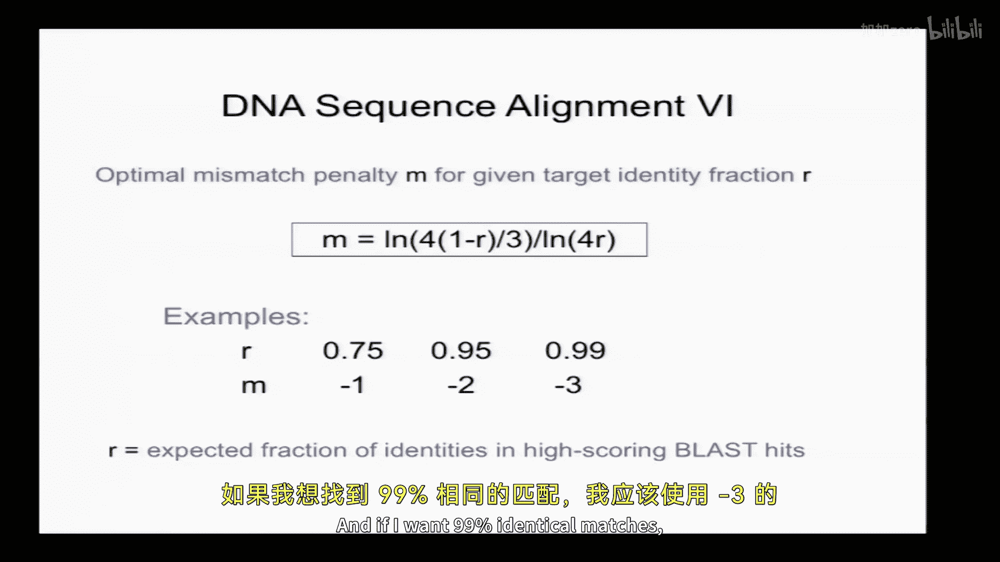
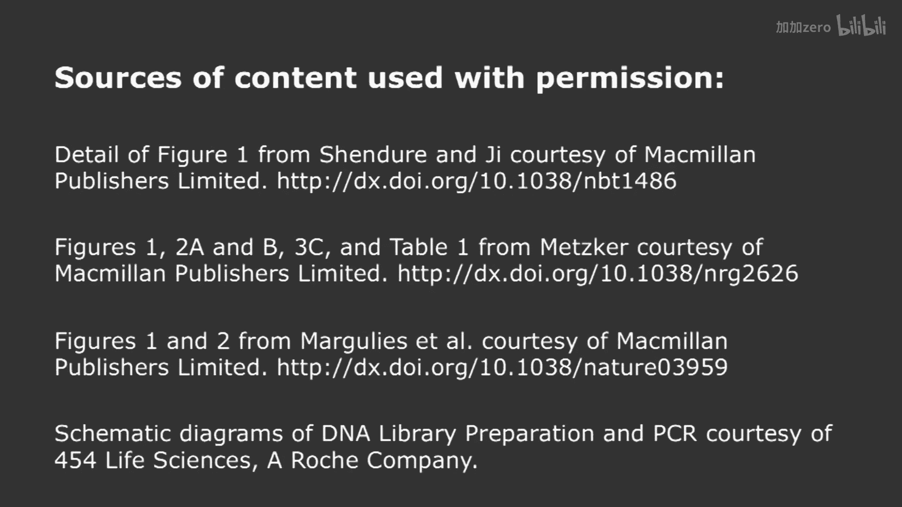

# 【计算与系统生物学基础 7.91J 2014】麻省理工—中英字幕 p02 p1 2. Local Alignment (BLAST) and Statistics -BV1HdzaYAE2a_p2-

The following content is provided under a creative Commons license。

 Your support will help M I T Open Coseware continue to offer high quality educational resources for free。

To make a donation or view additional materials from hundreds of MIT courses。

 visit M T OpenCourseware at OCw。 MT。 Eduu。

All right， so today we're going to briefly review classical sequencing and next gen or second gen sequencing。

Which sort of provides a lot of the data that。The analytical methods we'll be talking about work on。

And we'll then introduce local alignment， sort of Allla blast。

 and some of the statistics associated with that。So just a few brief items on topic one。 All right。

 so today we're going to talk about sequencing first， conventional or sang sequencing。

 then next gen or second gen sequencing briefly and then talk about local。Local alignment。

 so background for this lecture， well for the sequencing part the Metzker review covers everything you'll need and for the alignment。

 we'll talk about local alignment today， Global alignment Tuesday。

 then chapters 4 and five of the text cover it pretty well。 So here's here's the text。

 if you if you haven't decided whether to get it or not， you can have it up here。

 you can come flip through it after class。

Okay。Sequencing is mostly done at the level of DNA， whether the original material was RNA。

Or not usually convert to DNA and sequence of the DNA level。

 So we'll often think about DNA as sort of a string。

But it's important to remember that it actually has a three dimensional structure as shown here。

 and often it's helpful to think of it in sort of a two dimensional representation where you think about the。

The bases and their hydrogen bonding and so forth as shown。As shown in the middle。

My mouse is not working today for some reason。Hopefully hopefullypefully won't need it。

 so the chemistry of sequencing is very closely related to the chemistry of the individual bases and there are really three main types that are going to be relevant here。

So ribonuccleotides， deoxy， ribbonuccleotides， and then for s sequencing， dye dioxy。

 ribonuccleotides。Who can tell me which of these structures corresponds to which of those？

Names and also please let me know your name and I'll attempt to remember some of your names toward the end of the semester。

 probably。Which arehich are which？Yes， what's it？そ下でか。

Okay so that is correct one way to keep these things in mind is the numbering of the bases so the carbons in the ribbos sugar are numbered one so carbon1 is the one where the base is attached two here which has an OH in RNA and just an H and DNA and then three is very important4 and then5 so five connects to the phosphates which then will connect the base to the sugar phosphate backbone and three is where you extend。

That's where you're going to add the next space in a growing chain。

What will happen if you give DNA polymerase a template and some diodeoxynucleotides？

It won't be able to extend because there's no three prim weight。 Okay。

 and all the chemistry requires requires h。 And so that's the basis of classical or s sequencing。

 which。friend Hangger got the Nobel Prize for in 1980。 So I think it was developed in the 70s。

 And it's really the basis of。Most of the sequencing are pretty much all the DNA sequencing up until the early 2000s before some newer technologies。

Came about， and it takes advantage of this special property of。

Dtyoxynucleotides that they terminate the growing chain。Okay，So imagine we have a template DNA。

 And so this is the molecule whose sequence we want to determine shown there in black。

 We then have a primer。 Okay， notice the primer is written in5 prime to three prime direction。

 The ends would be。Sequences。knowPer sequences and then primer complementary sequences in the template。

 so you typically will have your template cloned this is in conventional sequencing cloned into some vector。

 like a phage vector。For sequencing， So you know the flanking sequences。

 And then you do four sequencing reactions in conventional sang or sequencing。

 And I know some of you have probably had this before。 So let's take the first chemical reaction。

 The one here with the D D GTP， okay， so。What would you put in that reaction。

 What are all the components of that reaction if you wanted to do conventional sequencing on， say。

 an arylamide gel。Anyone。What do you what do you need？And what does it accomplished？ Yeah， I。yeah。

 oh Okay， go ahead。For。第二组。嗯哼。大案。O。Template， yeah， primer template， yeah。Great， great， that's good。

 It sounds。Tim could actually do this experiment。Yeah， so if you put in。Okay。

 so you put it and what ratio would you put in， So you said you're going to put in all four conventional dioxyuccleotides and then one diodeoxyuccleotide。

 So let's say diodeoxy G just for simplicity here。 Okay so and what ratio would would you put the di dioxyuccleotide compared to the conventional nucleotides。

Lower， like how much lower。Like maybe 1%。Something like that。 Yeah， you want to put it a lot lower。

 Okay， and why do you want， why is that so important。没る。the right。ど问。Right， right。

 so if you put Emolar deoxy G and di dioxyG， then it's going to be a 50% chance of terminating every time you hit a C in the template right and so you're going to have half as much of material at the second G and a quarter as much as the third and you're going to have vanishingly small amounts。

 so you're only going to be able to sequence the first few C's in the template exactly so it's a very good point。

Okay， so， so in that mix， yeah， so now let's imagine you do these。

 you do these four separate reactions。 You typically would have like radiolabeled primer。 Okay。

 so you can see your DNA and then you would run it on some sort of gel。

 This is obviously not a real gel， but a idealized version。 and then。

In the lane where you put diodeoxy G you would see the smallest product so you read these guys from the bottom up and in this lane there was a very small product that's just one base longer than the primer here and that's because there was a C there and it terminated there and then the next C appears several bases later so you have a sort of a gap here and so you can see that the first base in the template would be a complement of G or C and the second base would be it would be nice ahead yeah my mouse disappeared。

Anyway， the second base would be you can see the next smallest product in this Didox T lane。

 therefore a and you just sort of you know snake your way up through the gel and read out the sequence and this works well so what does it actually look like in practice here are some actual sequencing gels so you run you run four lanes and。

On big used to be big polyacrylamide gels like this。Torbin， you ever run one of these？Yes。

They big pain to cast， run for several hours， I think， and you get these banning patterns。

And what happens， you know what limits the sequence read length。

 So we normally call the sort of the sequence generated from one run of a sequencer as as a read。

 So you know one attempt to sequence the template is called a read and you can see it's relatively easy to read the sequence know toward the bottom。

 and then it gets harder as you go up。And。So that's really what fundamentally limits the read length is that the bands get closer and closer together。

 right。They'll run proportion of the size with or inversely proportional the size with the small ones running running faster。

 But then， you know， the difference between a 20 based product and a 21 might be significant。

 But the difference between a 500 base product and a 501 based product is going to be very small。

 And so you basically can't。 you can't order the。TheThe lanes anymore。 And therefore。

 that's sort of what fundamentally limits it。 All right。

 So what's so here we had to do run four lanes of a gel。

 Can anyone think of a more efficient way of doing sang or sequencing。

So there any way to do it in one way？Yeah， what's your name？s four different types of。

be maybe like4 her college。4 different colors。 Okay， so you put。

 instead of using radio labeling on the primary， use floor4 on your g dioxy Nps， for example and。

Then you can run them each one， depending where that strand terminated， it'll be a different color。

 and you can run them all in one lane Okay， so that。Looks like that。

 Okay And so this was an important development called dye terminator sequencing in the 90s to the present。

 And that was the basis of the A B 3700 machine， which was really like the workhorse of genome sequencing in the late 90s and early 2000s。

 really what enabled the human genome to be sequenced。

 And so one of the other innovations in this technology was that instead of having a big gel。

 they shrunk the gel。 And then they just had a reader at the bottom。 So the gel was shrunk to。

As thin as these little capillaries。 I't know if you can see these guys。

 but but basically it's like a little，s like a little thread here。 And so each one of these is。Oh no。

 no worries。 This is not valuable。 ancient ancient technology。

That I got for free from somebody at abroad， I think。the DNA would be loaded at the top。

 it would be a little gel in each of these。 It's called capillary sequencing。

 and then it would run out the bottom and there would be a detector which would detect the four different floors and read out the sequence。

 so this basically condensed the volume needed for sequencing。

All right， any questions about conventional sequencing？Yes。Yeah， that's a good question。

 I don't actually I don't remember I think there are different options available and sometimes with some of these reactions。

 you need to use modified polymerases that will tolerate these modified nucleotides。

 yeah I don't remember that' a good question。I can look that up。

 So how long can a conventional sequencer go， What's the read lengthth？Anyone know。It's about。

 say 600 or so。And so that's reasonably long， right， How long is a typical mammalian mRNA？Maybe 2。

3 K B。 So you have a typical exxon， maybe 150 bases or so。 So you have a chunk。

You don't generally get full length CDA， but you get a chunk of a CDA that's say three。

 four exons in length， and that is actually sufficient to it's generally sufficient to uniquely identify the gene locus that that read came from and so that was the basis of EST sequencing so calledled Express seque tag sequencing and millions of these 600 base chunks of CDA were generated and theyre quite useful have been quite useful over the years。

All right， so what is next gen sequencing， So in next gen sequencing。You。

 you only read one base at a time。 So it's actually a little bit， perhaps， well。

 yeah often a little bit slower， but it's really massively parallel。 And that's the big。

 the big advantage。 and it's orders of magnitude cheaper per base than conventional sequencing。

 Like when it first came out， it was maybe two orders of magnitude cheaper。 And now it's probably。

 you know， I don't know， another four orders of magnitude。

 So so it really blows away conventional sequencing。 if。

Your the output that you care about is mostly proportional to number of bases sequenced。

 if the output is proportional to the quality of the assembly or something。

 then you there are applications where conventional sequencing still has you know is a very useful effect。

Because the next gen sequencing tends to be shorter。 But in terms of just volume， it''， it's much。

 much。Generates much， much more base in one in one reaction。

 And so the basic ideas are that you have your template DNA molecules now typically。

Tens of thousands for technologies like packbi or hundreds of millions for technologies like Iumina。

That are immobilized on some sort of surface， typically a flow cell。

There are either single molecule methods where you have a single molecule of your template or there are methods that locally amplify your template and produce say。

 hundreds of copy identical copies in the little clusters。

 And then you use modified nucleotides often with fluhors attached to。Inrogate。

The next base at each of your template molecules， for hundreds of millions of them。

And so there are several different technologies。 we won't talk about all of them。

 we'll just talk about two or three that are interesting and widely used。

 and they differ depending on the DNA template， what types of modified nucleotides we used。

 and to some extent in the imaging and image analysis， which differs for single molecule methods。

 for example， compared to the ones that have their sequence of cluster。All right。

 so there's a table in the Metzcar review。 And so I've just told you that that like Nextchan sequencing is so cheap。

 But then you see like how much these machines cost right。

 And you could buy lots of other interesting things with that。 You know。

 that kind of that kind of money。 And I also want to emphasize that that's not even the full cost。

 So if you were to buy。And Iumina GA2， this would be like a couple of years ago when the GA2 was the state of the art for half a million dollars。

The reagents to run that thing， if you're going to run it continuously throughout the year。

 the reagents to run it would would be over a million。 Okay。

 so it's actually this actually underestimates the cost。 However， the cost per base is super。

 super low because they generate so much so much data at once。So we'll talk about a couple of these。

 So the first next gen sequencing technology to be published and still used today was from 4，5，4。

 now roche， and it was based on what's called emulsion PCR。 So they have these little beads。

 The little beads have adapter DNA molecules covalently attached。 you incubate the beads。

With DNA and you actually make an emulsion。 So the emulsion， it's an oil water emulsion。

 So each bead， which is hydrophilic， is in a little bubble of water inside oil。

 And the reason for that is so that you do it at a template concentration that's low enough that only a single molecule of template is associated with each bead so the oil then provides a barrier so that the DNA can't get transferred from from one bead to another so that each bead will have a unique template molecule。

 you do sort of a local PCR like reaction to amplifying that DNA molecule on the bead。

 And then you do sequencing one base at a time using。Aluciory space method。

 I'll show on the next slide。 Okay， so aumina technology differs in that instead of an emotionul。

 you're doing it on the surface of a flow cell。 Okay， again。

 you start with a single molecule of template， you have your flow cell has these two types of adapters covalantly attached the。

Template annes to one of these adapters。 you extend the adapter molecule with DNTP and polymerase。

 Now you have the complement of your template， U D nature。

 now you have the inverse complement of your template molecule covarivalently attached to the cell surface and then at the other end there's the other adapter。

 And so what you could do is what's called bridge amplification where that。Now。

 complement of the template molecule will bridge over hybridize to the other adapter。

 and then you can extend that adapter， and now you've regenerated your original template。

 So now you have the complementary strand and the original strand U D nature。

 and then each of those molecules can undergo subsequent rounds of bridgeging amplification to make clusters of typically several hundred thousand molecules。

 that is that a question， Yeah what's your name。

一佢系。How do you get the adapters onto the template molecules。 so that's typically by DNAligation。

 So we may we may cover that in later later steps。 it depends There's a few different protocols。 So。

 for example， if you're sequencing microRNAs， you typically would use isolate the small RNAs and use RNAligation to get the adapters on。

 and then you do an and R step to get DNA with most other applications like RNA seek or genome sequencing。

 So with RNA seek。 you're starting from mRNA， you typically will isolate total RNA。

 do polyase selection， you fragment your RNA to reduce the effects of secondary structure。

 you random prime with like random hexzemeromers， Rt enzyme。

 So that'll make little bits of C 200 bases long， you do second strand synthesis。

 now you have double stranded CD fragments and then can you do like blunt in blunt inligation to add the adapters。

 and then you d。 So you have single strand that。辩护题。That the two ends are different。Yeah， yeah， okay。

 that's a good question。 So there are。Well， I'll post some stuff about library。 Yeah I don't。

 it's a good question。 I don't want to like sweep it on the rug， but I， I kind of want to move on。

 And and I'll post a little bit about that。All right， so we did four， five，4。

Iumina helicose is sort of like illumina sequencing， except a single molecule。 So， you have your。

 your template covalently attached to your your substrate。

 you just a neo primer and just start start sequencing it okay。嗯。And there's， there's。

Major pros and cons of single molecule sequencing。Wwhich we can talk about and then the PA biotechnology is fundamentally different in that the template is not actually covalently attached to the surface。

 the DNA polymerase is covalently attached to the surface and the template is sort of threaded into the polymerase and this is a phage polymerase that's highly processive and strand isplacing and the template is often a circular molecule and so you can actually read around the template multiple times。

 which turns out to be really useful in p bio because the error rate is quite high for the sequencing。

In。In the top in the 4，54， you're measuring luciase activity light in illumina。

 you're measuring fluorescence， four different fluorescent tags。

 sort of like the four different tags we saw in s sequencing。 helicosese。

 Its single tag one base at a time。 and impact bio you actually have a fluorescently labeled DNTp that has the label on it's actually hexifhosphate。

 It's got the label on the sixth phosphate。 So the DNTP is labeled it enters the active site of the DNA polymerase。

 and the resonance time is much longer if the base is actually going to get incorporated into that growing chain。

 and so you measure how much time do you have a fluorescent signal。 And if it's long。

 that means that that base must have incorporated into into the DNA。

 But then the extension reaction itself will cleave off the last five phosphates and。

And the flu4 tag。 And so you'll regenerate native DNA。 So that's another difference。

 whereas in illina sequencing， as we'll see， there's this reversible terminator chemistry。

 So the DNA is not native that you're synthesizing。Allright， so this is a little bit more on 4，5，4。

 just some pretty pictures。 I think I described that before the key chemistry here is that you。

You add one dNTP at a time， so only a subset of the wells。

 perhaps a quarter of them that have that next base， the complementary base free。

 is the next one after the primer， will undergo synthesis and when they undergo synthesis。

 you release pyrohosphate and they have these enzymes attached to these little microbeads。

 the orange beads， sulfururase and luciferase that use pyrohosphate to basically generate light。

 and so then you look you have one of these beads in each well。

 you look which wells lit up when we added。D C TP， and they must have had G as the next base and so forth。

 And there's no termination here。 The only termination is because you're only adding one base at a time。

 So if you have a single G in the template， you'll add one base。

 But if you have  two G in the template， you'll add two C's。 And in principle。

 you'll get twice as much light。 But then you have to sort of do some analysis after the fact to say。

 okay， how much light do we have。 And was that 1 G，2 G and so forth。

 Ands the amount of light is supposed to be linear up to about 5 or 6 Gs。 But that's still。

A more error prone step。 And the most common type of error in 4 or5，4 is。

Is actually insertions and deletions， whereas in illumina sequencing， it' substitutions。

David actually encouraged me to talk more about sequencing errors and quality scores。

 and I need to do a little bit more background， but may add that a little bit later in the semester。

Okay， so in illous sequencing， you add all four DNTPs at the same time， but they're non-native。

 they have two major modifications， so one is that they three prime blocked that means that the OH is not free。

 I'll show the chemical structure in a moment so you can't extend more than one base you incorporate that one base and the polymerase can't do anything more and they're also tagged with four different floors so you add all four DNTPs at once。

 you let the polymerase incorporate them and then you image the whole flow cell。

OkayUsing two lasers and two filters。 So basically to image the four floors。

 So you sort of take four different pictures of each portion of the flow cell。

 and then the camera moves and you scan the whole the whole cell。

 And so then those clusters where you， that incorporated a C。

 let's say they will show up in the green channel as a response and those incorporated a and so forth。

 So you basically you have these clusters。 each of them represents a distinct template。

 And you read one base at a time。 So first， you read the first base after the primer。

 So it's sequencing like downwards into the template。 and you read the first base。

 So you know what the first base of all your clusters is。 and then you。Reverse the termination。 Okay。

 you cleave off that chemical group that was blocking the three prim H。 So now it can extend again。

 and then you add the4 d and TP again， do another round of extension and then image again and so forth。

 And so it takes a little while。 So each round of imaging takes about an hour。

 So if you want to do you know，100 base single and illlumina sequencing。

 it'll be running on the machine for about four days or so。Plus。

 the time you have to build the clusters， which might be several hours like the day before。All right。

 so what is this so actually the whole idea of blocking termination。

 basically Sananger's idea is carried over here in illumous sequencing with a little twist and that's that you can reverse the termination。

 So if you look down here at the bottom these are two different three prime termmininators remember your base counting base。

1，2，3。 So this is the three prime was the three prim H。

 Now it's got this methyl ageage or whatever that is not much of the chemist。

 So you can look that one up。 And thens here's another version。

 And there's chemistry that can you can cleave this off when you're done。

 And then this whole thing here hanging off the base is is the floor。Okay。

And you cleave that off as well。 Okay， so you add this big， complicated thing， you image it。

 and then you cleave off the floor and cleave off the three prime blocker。

These are some actual sequencing images you would image in the the four channels。

 they're actually black and white。 These are like pseudocolored。

 and then you you can merge those and you can see then all the clusters on the flow cells。

 So this is from a G2 with the recommended cluster density back in the day like a few years ago。

 And nowadays the image analysis software has gotten a lot better。

 So you can actually load the clusters， more densely and therefore get more sequence out of one out of the same as the same area。

 But imagine just millions and millions of these little clusters like this。 notice。😊。

The clusters are not all the same size， right so some DNA molecule basically are' doing PCR and CU and so some molecules are easier to amplify by PCR than others。

 and that probably accounts for these variations in size。All right。

 so how what is the current throughput So these are data accurate as of about maybe last year。

 So a highse 2000 instrument is sort of the most you know high performance widely used instrument now there's a 2500。

 but I think it's roughly similar。 you have one flow cell。

 So a flow cell looks sort of like a glass slide except that it has these sort of tunnels carved in it like8 little little tubes inside the glass slide and on the surfaces。

Is where of those tubes is where the adapters are covalently attached。

 and so you have eight lanes so you can sequence eight different things in those eight lanes you could do you know。

East genome in one and fly RNA seek and another and so forth。And。And these days。

 a single lane will produce something like 200 million reads。 And this is typically， I mean。

 this is like it's routine to get $200 million reads from a lane。 sometimes you can get more。

 you can do up to 100 bases。 you can do 150 these days on a Myse， which is a miniature version。

 you can do maybe 300 or more。 And so that's， that's a whole lot of sequence。 Okay。

 so that's 160 billion basis of sequence from， from a single lane。 Okay， and that will cost you。

 That single lane， maybe， you know，2 to $3000， depending know where you're doing it。

 and the cost is mostly that doesn't include a capital cost。

 That's just the reagent cost for running that。 So 160 billion。 That's now。You know。

 the human genome is is 3 billion， right So you've now sequenced the human genome over many。

 many times there。 And that's not， you know， you can， you can do more。

 So you can do paradigm sequencing where you sequence both ends of your template and that'll basically double the amount of sequence you get。

 And you can also this machine can use two flow cells at once。

 So you can actually double beyond that。 And so for many applications。

160 billion bases is more is overkill is more than you need。

 Imagine you're doing bacterialial genome sequencing。 bacterialial genome might be5 megabas or so。

 right， This is complete overkill。 So you can， you can do bar coding where you add a little six base tag。

Different six based tags to different libraries， and then mix them together。

 introduce them to the machine， sequence the tags first or second。

 and then sequence the the templates。 And then you effectively sort of sort them out later and。

And then do many samples in one lane， and that's what people commonly most commonly do。Okay。

 so questions about extra sequencing。There's a lot more to learn。 I'm happy to talk about it more。

 It's very relevant to this class， but I'm sure it'll come up later in David's section。

 so I don't want to。Take too much。Time on it。Okay， so now once you generate。

Reads from an illumina instrument or some other instrument。

 you want to align them to the genome to determine， for example， if you're doing RNA SQ。

Mapping reads that come from mRNA， you want to know what genes they came from so you need to map those reads back to the genome。

 what are some other reasons you might want to align sequences。Just in general。

 why is aligning sequences meaning？Matching them up and finding。Bas is that。

Individual bases or amino acid residues that match， why is that useful， Diego？くなさい。

You can assemble them。 Yeah， so if you're doing genome sequencing， if you align into each other。

 you find a whole stack that sort of align， you know， this way。

 you can then assemble and make a make a longer infer the existence of a longer sequence。

 That's a good point。 Yes， in your name。Yeah，Looking at homolos， right so if you， for example。

 have are doing disease gene mapping， you've identified a human gene of unknown function。

That's associated with a disease， then you might want to search it against， say。

 the mouse database and find a homologue in mouse， and then that might be。

What you would want to you know to study further， you might want to then knock it out and mouse or mutate it or something like that。

 Okay so that's those are some good reasons。' there's others。

 So we're going to first talk about local alignment which is a type of alignment where you want to find shorter stretches of high similarity and you don't require alignment of the entire sequence。

So there are certain situations where you might want to do that， so here's an example。

Youre studying a recently discovered human noncoding RNA。 As you can see it's 45 base。

 You want to see if there's a mouse holo， you run it through NCvi blast， which as we said。

 is sort of the Google search engine of bioinformatics and and you're gonna get a chance to do it on chromat1。

 and you get a hit that looks like this。 So notice this is sort of blast notation。

 it says Q at the top Q is for query。 that's the sequence you put in S is subject that's the database you were searching against you have coordinates。

 So 1 to 45。 And then in the subject it happened to be basease 403 to 447 in some mouse chromosome or something。

 and you can see that。It's got some matching， but it also has some mismatches。 So in all。

 there are 40 matches and and  five mismatches in the alignment。

So is that significant？Would you remember， the mouse genome is 2。7 billion bases long， right。

 It's big。 So would you get， you know， match this good by chance。So the question is， really。

 would you， should you trust this， I this， I this something that you can confidently say， yes。

 mouse has a homologue， and that's it or。Should just be like， well。

 that's not better than I get my chance， so I have no evidence of anything or is it sort of somewhere in between？

And how would you？How would you tell。Yeah， what's your name？you want to figure out。Okay。O。

 so Chris says， you want to define a scoring system and then use the scoring system to define statistical significance。

 Okay， can you， do you want to suggest a scoring system。What's the simplest one you can think of？啊。

Is there match？O。Yeah， so let's do that scoring system。And the simplelist would be。

 so the notation that's often used is SII。So that would be a match between nucleotide I and then another copy of nucleotide I。

 We'll call that one plus one for match。 Okay， and S I J。Where I and J are different。

 we'll give that a negative score -1。 Okay， so this is I not equal to J。

So this is actually that's a scoring matrix， right。

 It's a4 by four matrix with one on the diagonal and minus-1 everywhere else。

And this is commonly used for DNA， and then there's a few other variations on this that are also used。

So good， so a scoring system， so then how are we going to do the statistics， any ideas？

How do we know what's significant？杨。But the scale is yeah， it's not so obvious。 Yeah， a question。嗯哼。

Yeah， so that's a good idea。 So you could actually， I mean， blast， it turns out it's pretty fast。

 So you could you could shuffle your RNA molecule randomly permute the nucleotides many times。

 maybe even like a thousand times， search each one against the mouse genome and get a distribution of what's the best score the top score that you get against the genome。

 Look at that distribution and say whether the score of the actual one is significantly higher than that distribution or just falls in the middle of that。

 that's reasonable。 So it turns out， I mean， you can certainly do that。

 And it's not a bad thing to do。 But it turns out there is an analytical theory here that you that you can use so that you can sort of determine significance more quickly without doing so much so much computation。

 and that's what we'll talk about。But another issue before we get to the statistics is how do you actually find that alignment。

 how do you find the top scoring match in the mouse genome？Okay， so let's suppose。This。

 this guy is your RNA。 Okay， of course， I mean， we're using T's， but。

 that's just because you usually sequence it。

At the DNA level， but imagine this is your RNA。 it's very short。 This is like。10 or so， I think。

 And this is your。Your database， okay， but it goes on， you know。You know， a few billion more than。

 you know， several more blackboards And I want to know。

 I want to come up with an algorithm that will find the highest scoring segment of this query sequence against this。

Database。Any any idea。 So this will be like our first algorithm and it's not terribly hard。

 so that's why it's a good one to start with， not totally obvious either。Who can。

 who can think of an algorithm or something， some operation that we can do on this sequence compared to this sequence in some way that will help us find the highest scoring match。

I'm sorry， yeah。Yeah， okay， so we're going to keep it simple that that's true in general。

 but we're gonna keep it simple and just say。No insertions and deletions。 Okay。

 so we're going to look for an ungapped local alignment， okay。So that's the algorithm I want first。

 no gaps， and then we'll do gaps on Tuesday。啊， Timim。Yes。Yeah， okay， pretty much that。More， I mean。

 that's pretty much right。 although it's not quite as much of a description as you would need。

 if you wanted to actually code that。 like， how would you actually do that。

 So I want a description that would is sort of more at the level of like pseudocode。

 Like here's how you would actually organize your code。 So let me just start by doing。

 let's say you you， you sort of entertaining the hypothesis that the alignment。 the alignment。

 it can be in different like registers， right， It can be the alignment can correspond to base one。

Of the query and base one， of the subject， right， or it could be， it could be shifted。

 It could be an alignment where base。One of the query matches base 2 and so forth。 right。

 So there's sort of different different registers。 So let's just consider one register first。 Okay。

 the one where。Base  one matches。 Okay， so let's just look at the。

 the matches between corresponding bases。 Okay， I'm just going make these little。Anle。

Bracket guys here。Hopefully。Won't make any。Mistakes。Okay， I'm going to take this。

 This is sort of implementing Tim's idea here。 And then I'm going to look for each of these。

 So consider it like going down here。 Now we're sort of。Looking at an alignment here。

 is this a match or a mismatch？Thats a mismatch。That's a match， That's a mismatch。That's a mismatch。

 That's a match。Match。Match。Missmatch， mismatch。Mismatch。Okay， so where is the top scoring。

Mach between the query and the subject。10。Anyone。S，7，8， good。5，6，7，5，6，7， right right here。 right。

 You can see there's three in a row。 Okay， how do we know， well， what about this。

 Why can't we add this to the match。What's the reason why it's not 23。567？你 both。

Because the score for that is lower right， we defined top scoring segment。

 You sum up the scores across the match。 So you can， you can't have mismatches in there。

 but the you know。In order to go， this will have a score of three and order if you wanted to add these three bases。

 you would be adding negative2 and plus1， so it would reduce your score， so that'd be worse。

Any ideas on how to sort of do this in a。Automatic algorithmic way。Yeah， what mean。对对。ま。Okay。

 so you keep shifting it over and you generate one of these lines and now but imagine my query was like you know。

 100 or something and my database is like a billion。What I this， I， how do I look along here。

 And here， it was obvious what the top square matches is。 But， you know， I mean， if I had。

 if I had two matches here。Right， then it would have been。 We would have actually had longer。

 longer match here。 right， So how do I。In general。How do I find that top match for each of those registers。

 if you will， you' have， you'll have 1000 long。A diagonal here with。Ones and minus ones on it。

 What do I， How do I process those scores to get to find a top scoring segment。

Whats an algorithm to do that？It may seem I mean it's kind of like intuitively obvious。

 but I want you to something with like a variable， you define a variable and you update it and you add to it。

 and I mean， something like that that like a computer could actually handle。Yeah。

 what was your name to the end。Okay， you keep track of what the highest total score was。

The highest segment， like segment score。 Okay， so let's define， okay， I'm going to put this up here。

And。 we'll define max S。That's the highest segment score we've achieved to date。

 and we'll initialize that to0， let's。Because if you had all mismatches。

 it would be 0 would be the correct answer。 right， if you're query with A's and you're subjecttic with T's and okay。

 and then what do you do。Yeah。Keep back of work。Yeah。

But the score of the maximum segment at that point after base2。It's not zero， it's actually one。

Because you could have a segment of one base。Alignment， right？The cumulative score is 0。

The cumulative score may also， I mean， I think you're onto to something here。

 that may be also something useful to keep track of。Because let's do the cumulative score。

 And then then you tell me more。 Okay， so we'll define cumulative score variable。

 We'll initialize that to 0。 and then we we'll have some four loops。That， as some of you have said。

You want to loop through the subject， all the possible registers of the subject。

So that would be maybe J equals1 to subject length。Minus query minus something like that。

't don't worry， you know， too much about this。 And again， this is this is not real code。 obviously。

 it's pseudo code。 So then this will be say one to query length。

 And so this will be now going along our diagonal。 Okay， and we're gonna plot the cumulative score。

 Okay let's just， you know， So here you would， you would have an update where cumulative score。

Plus equals。嗯。The score。Of。Query position。I matched against。Data subject position。这。And update that。

 So that's just comm score。 So what will it look like。 So in this case， I'll just use this down here。

 actually。Maybe I'll do it yeah。So。We have 0， one。2。-1， minus-2。Okay。

 so you'll start at zero at position0 in the sequence。And here at position1， you're down here at -1。

Right， because it was a mismatch。 then in position 2， as you said。We're back up to0， right。

 And then what happens。Go down to -1， down to -2。 Then we go up。

Three times in a row until we're up here to。嗯。To one， and then we go down after that。Right。

So where is your highest scoring match in this cumulative score plot？

We said people said it was from five to 7。 Oh yeah， question would it be from？の会。一样。Exactly。

 so what do you want to keep track of？嗯。Andな。The rain。My。Yeah， yeah。

 so this is now sort of more what I was looking for in terms of， so this was the local minimum。

 and that's the local maximum。This is the score。That's your max S there， right。

 And you also want to keep track of where where that happened in both the query。And the subject。

 Does that make sense。 So would you keep track of this running cumulative score variable。

 You keep track of the last minimum。 the minimum that you've achieved so far。

And so that would then be down here to -2。 And then when your cumulative score got up to plus 1。

 you always take that cumulative score minus the last minimum。

Cumulative score that gives you a potential a candidate for a high scoring segment。

 and if that is bigger than your current max high scoring segment。

 then you update it and you would update this and then you would also have variables that would store where you are and also where did that last minimum occur。

I'm not spelling it all out， I'm not going to be all the variables， but this is。

An algorithm that would find the maximum score yeah question。

Of the global maximum local minimum Minma so that you can access the most recent local minimas。

Following the global maximum。Yeah， I'm not sure I got all that。

 but youre you're keeping track of the cumulative score。 Okay。

 the last the minimum that cumulative score ever ever got to okay and the maximum like difference。

 the maximum that you ever。In the past have gone up， you know。

 where you've had a net increment upwards。Okay。So like here， so this variable here， this max S。

 it would be initialized to zero when you got to here。Your minimum。

 your last minimum score would be -1。 your cumulative score would be 0。

 You would take the difference of those and you'd be like， oh， I've got。

 I've got a high scoring segment of score1。 So I'm gonna update that。

 So now that variable is now one at this point。 Then you're going down。

 So you're not you're not getting anything。 you're just lowering this minimum cumulative score down to -2 here。

 And then when you get to here， now you check the cumulative score minus the last minimum。 It's one。

 that's a time， we won't keep tracket tie。 now at here， that difference is 2。

 So now we've got a new a new record right， So now we update this maximum score to 2 and the locations。

 And then we get here， now it's 3 and we update that Does that make sense， So。

I that going down to negative one， it went down to negative three negative three Yeah first that first I mean right here。

 so we started like back a little bit， so back here like this no。Canada bega3。

But how do we get to negative3 because our scoring is？This one， you want this dip to minus or which？

this one to minus3 imagine we were minus3 here Yeah imagine it dips in minus3 and then the next one dips to higher than that to minus two and then it went up to1 the difference you look at the negative two to1 or negative3 to1。

Like that okay， so minus3， let's say。-2。One， something like that。What do people think？Anyone wantna。

in-3 to 1。 it's the minimum you ever got to This this is a， this might be a stronger match。

 but this is a higher scoring match。 And we said higher， we want higher scoring。 That's our。

 So you would count。That。Global max。You keep track of the global minimum and the current cumulative score。

 and you take the difference。过不买。It's not necessarily global maximum because we could be well below zero here right。

 we could do like this。From here to here。 So this is not the global maximum。Right， this is just。

Happens to be。We went up a lot since our last minimum。That's your high scoring set。

 Does that make sense？So this is， I mean， I haven't completely spelled it out， but I think。

Given you guys have given enough ideas here that there's sort of the core of an algorithm。

 and I encourage you to。Think this through。Afterwards and let me know if there are questions okay and we might we could add like an optional homework where ask you to do this that we've sometimes had in the past。

 it is a useful thing to look at。 this is not exactly how the blast algorithm works。

 it uses some tricks for faster speed， but this is sort of morally equivalent to blast in the sense that it has the same order order of magnitude running time。

Okay， so this algorithm。What is the what is the running time in big O notation。

 so just for those who are non- CS people， when you use this big O notation。

 then you're asking how does the running time increase in the size of the input and so what is the input。

 so we have two inputs， we have a query of length。And let's say， subject。Of length。 And so clearly。

 if those are bigger， it'll take longer to run。 But but when you compare different algorithms。

 you want to know how the runtime depends on those lengths。 Yes， what's your name，ally， Yeahally。

Okay， so this is what you call an order MN algorithm， and why is that， how can you see that？O。Right。

 you're going to go through the query in that。In the second for loop here。

 you're going through the query and you're doing that nested inside of a for loop that's basically the length of the subject。

 and you eventually you' gonna have to compare every base in the query to every base in the subject。

 there's no way around that。 and that takes some unit of time。

 And so the actual time will be proportional to that。

 So the bigger M gets and N gets it's just proportional to the product。Does that makes sense。

 or another way to think about it is like you're clearly you're gonna to have to do something on this diagonal and then you're gonna have to do something on this diagonal and this one and this one。

 And actually you have to also check these ones here。 And in the end that the total you know。

 number of computations there is going to be this times that you're basically doing sort of a rectangle's worth of computations。

Does that does that make sense。 So that's not bad， right， It's， I mean。

 it could be it could be worse。 It could be like。Mn squared or something like that。

that's basically why blast is fast。So what do these things look like in general and what is the condition on our score for this algorithm to work？

Like， what if I gave a score？Of plus one for a match and0 for a mismatch。 Could we do this。Joe。

 you're shaking your head。 It would just keep going Yeah， the problem is， you know， it would be flat。

 It might be flat for a while， but eventually it would go up and it would just go up and up and up。

 And so your， your highest scoring segment would most of the time be something that started very near the beginning and ended very near the end。

 And know so that doesn't work。 So you have to have a net negative drift And the way that's formalized is the expected score has to be negative。

 Okay， so why is the expected score negative in this scoring system that has plus one for a match and -1 for a mismatch。

😊，Why does that work？首備は？Yeah， youll have a mismatch， three quarters at a time。 So on average。

 you tend to drift down， okay。And then you have these little excursions upwards。

 and those are your high scoring segments。All right any questions about that？Yeah。这样。

We've got some computer scientists here， David。AndBetter than M times N。

 I don't think so because you have to do all those comparisons sort of their way around that。 So。

 I don't think so。All right。But the constant， you can do better on the constant than the algorithm。

 I think。With multiple queries。 Yeah， then you can maybe do some。Hashing or find some， yeah。

 speed it up。All right， so okay， so what about the statistics of this。

 So it turns out that Carlin and Uil。Developed some theory for just exactly this problem for searching a query。

Sequence， it can be nucleotide or protein as long as you have integer scores and the average or the expected score is negative。

 then this theory tells you how often you'll see how often the highest score of all across the entire query database comparison exceeds a cutoff X okay using a local alignment algorithm such as such as glass。

 And it turns out that the。These scores follow what's called an extreme value or a gumble distribution。

 Okay， and it has this kind of double exponential form here where so。So x is some cutoff。

 So usually x would be the score that you actually observed when you， you know。

 when you searched your query against the database， that's the one you care about。

 And then you want to know。What's the probability we would have seen something higher than that。

 or you might do X is one less than the score you observed so score what's the chance we observe something the same。

 as good as this or better。That makes sense。 And so this is going to be your P value then。

 so probably the S。The score of the highest segment。

Under a model where you have random query against random database of the same length is1 minus e to the minus kmn e to the minus lambda x where M and N are the lengths of the query and the database x is the score and then K and lambda are two positive parameters that depend actually on the details of your score matrix and the composition of your sequences and it turns out that lambda is really the one that matters。

Okay， and you can see that because lambda is up there in that exponent multiplying x。

 so if you double lambda， that'll have a big effect on the answer and K turns out you can mostly ignore it for most purposes。

So that as a formula， what does this thing look like it looks like that？Kind of a funny shape。

 it sort of looks like an normal a little bit， but then has a different shape on the right than the left。

And how do you calculate this Lambda？ So I said that lambmbda is sort of the， the key to all this。

Because of its。You know， sort of unique， uniquely important place you know in in that formula。

 multiplying the score。 So it turns out that lambda is the unique positive solution to this equation here。

 Okay， so now it actually depends on the scoring matrix。 So you see those's S J。

 It depends on the composition of your query。 That's the PIs， the composition of your subject。

 That's the RJs。 okay。You sum over the， you know， I and J equal to each of the four nucleotides。

 Okay， and that sum has to be one。 So there's a unique positive solution to this equation。Okay。

 so how would we solve an equation like this？ So， first of all， what kind of equation is this。

 given that。Like the P， we're going to set the S I J。

 and we're going just measure the the P and the RJ， right， So mean， those are all known constants。

 and Lambda is what we're trying to solve for here。So what kind of an equation is this in Lada？

Linear， quadratic。Hyperbolic。Anybody know what this is？Okay。

 so this is called a transcendential equation。Because you have different like land up heres and like you have different different powers。

All right， so those， you know， that sounds like kind of unpleasant， right， You don't hear。

 you don't take a class in transcendental regions， Probably。 So， so yeah， in general， they， theyre。

Not possible to solve analytically when know get when they get complicated， but in simple cases。

 you can solve them analytically。 and in fact。Let's just do， let's just do one。 Okay。

 so let's take the simplest case， which would be that all the Ps。Or a quarter。All the Rs。A recorder。

 and we'll use the scoring system that way we came up with before， where SII is1 and SIJ。

Is minus-1 if I not equal J。And so。When we plug those in to that sum there。What do we get？

We'll get four terms。

That our one quarter。Times one quarter。Times E to the lambda。 right， These are the match。

 There' there's four possible types of matches， right。

 They have probability one quarter times a quarter。 That's P I and R J。

 And the E to the lambda is S I I is just E to the lambda， right because as S I is one。

 And then there's 12 terms that are one quarter。One quarter E to the minus lambda。 Okay。

 because there's the 1 score。 and that has to equal one。Okay， so。And we'll cancel this。

 We'll like multiply through by4。 Maybe so now we get e to the lambda。嗯。Plus 3 e to the minus lambda。

Equals 1。 Okay， it's still a transcendental equation， but it looks looking a little simpler。

 Any ideas how to solve this for Lambda。

Sally。喂。Oh， I'm sorry，4， thank you。Yeah， what's your name。Okay。

 so the claim is this is basically a quadratic equation。

 So you multiply both sides by E to the lambda。 So then you get E to the two lambda。Plus3。

 and then it's going to move this over and do minus4 e to the lambda equals 0， right？Second。

So it'sd how is it quadratic， What do you actually do to solve this？Yeah。

Change a variable x equals e to the lambda。And then it's quadratic in x。 solve for x。

 We all know how to solve quadratic equations and then substitute back for lambda。 Okay。

 everyone got that。 Yeah， so。This equation in general， if you use arbitrarily complex。

 if you use 16 different scores to represent all the different types of matches and mismatches。

 this will be very unpleasant。 And it's not unsolvable。

 It just you have to use computational methods， numerical methods to solve it。

 But in simple cases where you just have a couple different types of scores。

 it will often be a quadratic equation okay。All right。

 so let's suppose that we have a particular scoring system， particular PIs， RJs。

 and we have a value of lambda that satisfies those so we solve this quadratic equation for lambda。

 I think we get lambda equals natural log 3， something like that。

 remember it's the unique positive solution， quadratic equation of two solutions but there's going to be just one positive one and then have so we have that value it satisfies this equation so then what if we double the scores。

Instead of plus1 minus1， we use plus2 minus2。What would then happen okay？

You can see that the original version of Lada wouldn't necessarily still satisfy this equation。

But if you think about it a little bit， you can figure out what。

New version new value of lambda would satisfy this equation。I'm going to double the score。

 but we solve for the lambda that solves。With these scores， okay？

Now we're going have this was with now we're going to have new scores， S I I。Prime equals 2 SIj。

Prime equals -2。嗯。What is lambda prime， the lambda that goes with these scores？Yeah， let's see。

 go ahead。I'm sorry， half of the original， right。 So you're saying that lambda prime equals lambda over 2。

 And why is that。 Can you explain。Yeah， if you think about these terms in the sum。The scores。

 the S part is all doubling。 So if you cut the lambda part in half。

 it will the product will equal what it did before， right， and we haven't changed the Ps and R Js。

 So all those terms will be the same。 So therefore， it will still satisfy that equation。

That that's not a way of thinking about it。Yes， I mean， you're correct。 So if you double the scores。

Lambda will be reduced by a factor of 2，So what does that tell us about lambmbda。What is it？

What is this meaning？Yeah， you go。Yeah。Yeah， it basically scales the scores， so we have one。

 we can have the same equation here， you know used with arbitrary scoring as。 it just scales it。

 and you can see the way it appears as a multiplicative factor in front of the scores。

 So if you double all the scores， will that change what the highest scoring segment is。No。

 it won't change it， right， because you， you'll have this cumulative thing。 It'll。

 it just changes what， know how you label the Y axis， right， it'll like make it bigger。

 but it won't change what that。What that is， right and if you look at this equation。

 it won't change the statistical significance。 Okay， the x will will double in value。

 right because all the matches are now worth twice as much as what they were before。

 but lambda will be half as big。 And so the product will be the same。

 And therefore the final probability will be the same。

 Okay so it's it's just a scaling factor for using different scoring systems。And at that。Okay。

All right， so what scoring matrix should we use for DNA？How about this one， Okay。

 so this is now a slight generalization。 So we're gonna keep one for the matches。 There's no point。

 you know， you don't lose any generality by choosing one here for matches because you know。

 if we use two， then it's just going just gonna change lambda is just going be reduced to compensate So one for matches。

 and then we're going use M for mismatches and M must be negative in order to satisfy this condition for this theory to work。

 that the average score has to be negative， Clearly you have to have some negative some negative scores。

 And the question then is should we use -1 like we used before or should we use like -2 or -5 or something else。

Any thoughts on this。Or does it matter， Maybe it doesnt matter。 Yeah， what's your name。Yeah， okay。

 so you want to use a more complicated scoring system where and what particular mismatches would you want to penalize more and less。

Yeah， you're correct in your intuition， maybe one of the biologists want to offer a suggestion here。

Okay， okay， so now weve got purine and periming。 So everyone remember。The purines are。A and G。

The pymidines are C and T。 And the idea is that。This should be penalized or this。

Should be penalized less than changing a appearing to a periymity And why does that make sense。

Structurally， they're purines are more similar to each other than the art ofries。More importantly。

In evolution。I'm sorry， can you speak up。Yes， so C to C mutations happen。 Yeah， spontaneously right。

 So basically it's easier because because they look more similar structurally。

 the DNA polymerase is more likely to make a mistake and substitute know， another puring and yeah。

 so so these do the ratio of the rate of puring， puring substitutions to primmine to I'm sorry。

 puring purine or perming primming to transversions which switch the type is about like 3 to1 or2 to1 in different systems。

 So yeah， that's a good idea。 But but for simplicity， just to keep them as simple。

 we're just going to go with one mismatch penalty。 but this is a good point in practice you might want to might want to do that。

So now I'm saying I'm going to limit you to one mismatch penalty。

 but I'm going to let you choose any value you want。 So what value should you choose or。

Does't matter。Or maybe different applications。Tim。食べて。对呀。検党？招费ゃ。you。那你可以。Right。Right。

 right it's a good point。 You can't make it too weak。

 right It may depend on what your expected fraction of matches is， which actually depends on P and R。

 right So if you have very biased sequences。Like very A rich。

 rate your expected fraction to matches is actually higher when you're searching an AT rich sequencing against another AT rich sequence。

 it's actually higher than a quarter。RightSo you might need to。

 like even -1 might not be sufficient there。 You might need to go down more negative。

 So you may need to use a higher negative value to just to make sure that their expected value is。

Negative， that's true。 And yeah， you may want to adjust it based on the composition。All。

 so let's just do a little bit more。 So it turns out that the Carlin andult theory。

 in addition to telling you what。The P value is of your match， the statistical significance。

 It also tells you what。The matches will look like in terms of what fraction of identity they will have。

OkayAnd this is the so-called target frequency equation。

 Okay so the theory says that if I search a query with one particular composition P subject another composition R here。

 I've just assumed they're the same like both P just for simplicity with a scoring matrix S I J。

 which has a corresponding value of lambmbda， then when I take those very high scoring matches。

 the ones that exceed you know that are statistically significant。

 And I look at those alignments of those matches I will get。Values Q I J given by this formula。

 So look at the formula。 So it's Q I J。 So P I Pj E to the lambda S I J。

 So it's basically the expected chance that you would have Pi matching to or base I base I matching base J just by chance。

 that's P I PJ。 But then weighted by E to the lambda S IJ。 So we notice for a match。

 lambda will be S will be positive。 So E to the lambda will be positive。

 So that will be bigger than one and you'll have more matches and you have correspondingly less mismatches because the mismatch as a negative。

 Okay， so get this target value score。 And that also tells you that the so-called natural scores。😊。

Are actually determined by the fraction of matches that you want in your high scoring segments you just。

 if we want 90% matches， we just set QII to be 0。9 and use this equation here for solve solveulfur SIJ so theres okay so if you for example。

 if you want to find regions with R percent identities little r is just the。R as a proportion。

 Q I I is going be R over 4。 This assumes you know， unbiased base composition， right。

 A quarter of the matches are a C GT。QIJ then is。1 minus R over 12。

1 minus R is a fraction of non matching positions。 There are 12 different types。 Okay。

 set S I I to equal to1。 That's what we said we normally do。

And then you do a little bit of algebra here。 M is SIJ。

 and you sort of plug in this equation twice here， and you get this equation， so it says that。

M equals log of know，4，1 minus R over 3 over log 4 R。And for this to be true。

 have this assumes that both the query and the database have uniform composition of a quarter and that R is between a quarter and one。

 right？The proportion of matches in your high scoring segment。

 you want it to be bigger than a quarter。 a quarter is what you would see by chance。

 So you's something wrong with your scoring system if you're considering those to be significant。

 So it's something above 25%。 and so just plugging in。 So this is it's just simple algebra。

 You can you check my work at home。to solve for M here。

 and then this equation then tells you that if I want to find。

75% identical matches in a nucleotide search， I should use a mismatch penalty of -1。

 and if I want 99% identical matches， I should use a penalty of minus-3。

Okay， not minus-5， but minus-3。And we will， I want you to think about like， does that make sense。

 does that not make sense， and because I'm going to ask you at the beginning of class on Tuesday to explain and comment on this particular this particular phenomenon of how when you want higher percent identities。

 you want a more negative。Mismatch。Score。Okay。All right， any。Any last questions。Comments。

