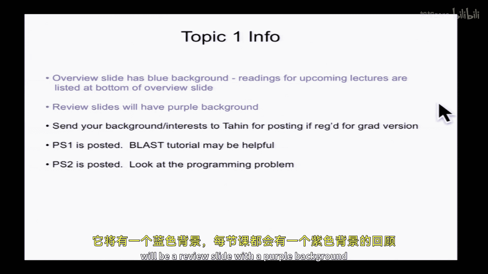
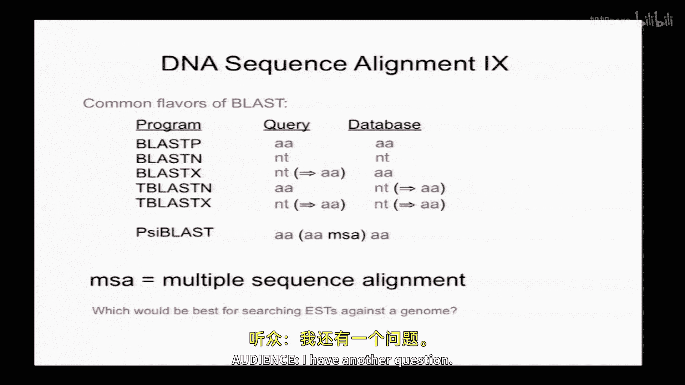
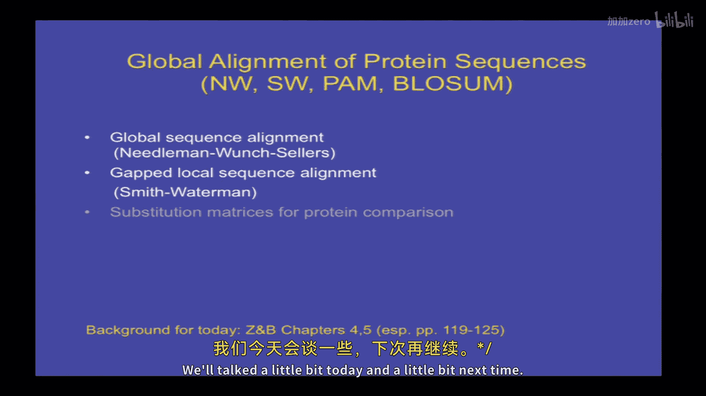
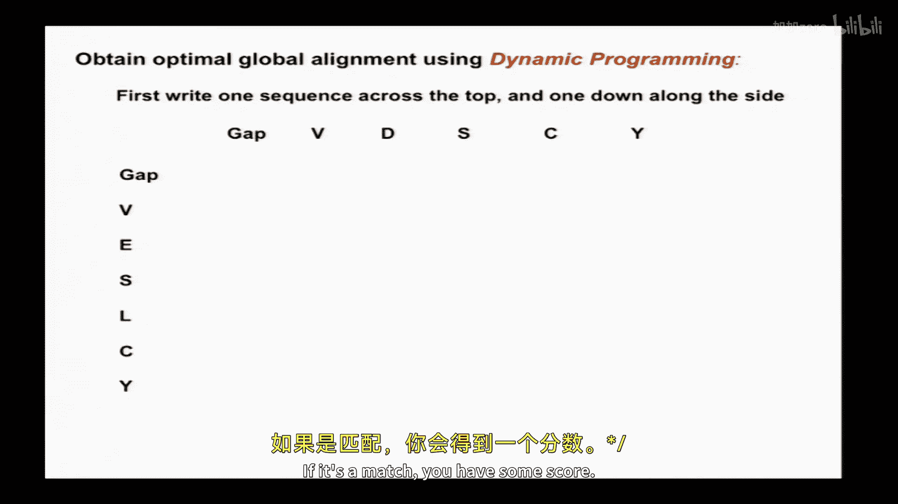
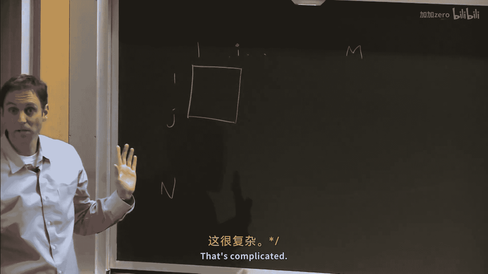
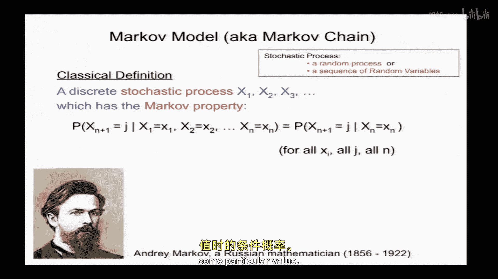
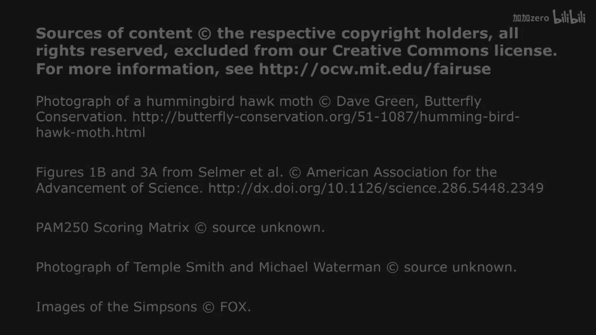

# 【计算与系统生物学基础 7.91J 2014】麻省理工—中英字幕 p03 p2 3. Global Alignment of Protein Sequences (NW, SW, PAM, BLOSUM) -BV1HdzaYAE2a_p3-

The following content is provided under a creative Commons license。

 Your support will help M I T Open Coseware continue to offer high quality educational resources for free。

To make a donation or view additional materials from hundreds of MI T courses。

 visit M T OpenCourseware at OCw。 MT。 Eduu。

All right， so let's get started。So today we're going to。Review。

 local alignment we talked about last time and introduce。Global alignment， also talking about。

Isues related to protein sequences， which include sort of some more interesting。Scoring matrices。

So just some info on topic one which we are still in， so I will have an overview slide。

 there will have a blue background and there'll be a review slide with a purple background in every lecture all right so last time we talked about local alignment and some of some of the statistics associated with that and also a little bit about。

Sequencing technologies， both conventional sanger， DNA sequencing。

 as well as second generation sequencing。And at the beginning of the local alignment section。

 we introduced a simple blast like algorithm。 and then we talk about statistics， target frequencies。

 mismatch penalties， that sort of thing。

Alright， so there were a couple of questions at the end， which I just wanted to， to briefly answer。

I believe it was Joe asked about how the dye is attached to the DNTP in dye Terinator sequencing。

 and it appears that it's attached to the base， sort of the backside of the base。

 not the Watson cr face， obviously。That seems to be the common way that it's done。

 And then there was another question from somebody in the back。

 I don't remember who asked about how when you're making libraries。

 how do you make sure that each of your insert sequences has the two different adapters， you know。

 one adapter on one side and the other adapter on the other side。

And there are at least three ways to do this。Simplest is in RNAliggation。

 When you take advantage of the differing chemistry at the five prime and three pre of the small RNA that you're trying to clone。

 So you just use the phosphate and N O H like to ligate two different adapters。

 Another more complicated way。Occurs in ribosome footprint profiling。

 which is a method for mapping the precise locations of ribosomes along mRNAs。

 And it involves poly tailing and then introducing。And the adapters together。

 the two adapters with a polyt primer that primes off the poly tail。

 and then you circularize and then you PCR off the circles and it's a little bit complicated。

 but you can look it up in the reference that's up here on the slide it's working now and then finally the way that's actually most commonly used for protocols like RNA and genomic DNA sequencing is。

That after you make your double strand DNA， there's an enzyme that adds a single A to the three prime end of each strand。

 So now you have a symmetrical molecule。 But then you add these funny。

 y shaped adapters that have a T。On an overhanging T on say the red guy here。

 and so what will happen is that each of these ys can beligated here。

 but each of the inserts independent of which stranded is will have a red adapter at the five prime end and a blue adapter the three prim end。

Any questions about？About this or about sequencing technologies before we go to。Local alignments。

was a good question。 and that's the answer。Okay， so。

We motivated our discussion of local alignments last time by talking about this example where， you。

 you have an encoding RNA that you found in human， you blast it against mouse。

 You get this alignment。 Is this significant。 So is this really likely to be a homologous sequence。

 And how do you， how do you find the alignments。And so we said that， well。

 there's this theory for that。Exact， at least exact in the asymptotic sense for large query and database sizes。

That tells us the statistical significance of un the highest scoring un GAAPap local alignment。

 and it's given by by this formula here， which is the extreme value or gumble distribution and then we talked about the constraints。

 so the expected score has to be negative， but positive scores have to be possible for this theory of work and we also talked about it an algorithm。

 and if you remember the algorithm was very simple， it involved。Keeping track of the， this is0。

 keeping track of a cumulative score。 So we have a mismatch and a match， mismatch， mismatch。

 mismatch， match， match， match。 that is a high scoring segment， etctera。

 So you keep track of the lowest point you've ever been to， as well as the current score。

 And when the current score exceeds that lowest point you've ever been to， by more。

thanhan we've ever seen before more than this， then that's your highest scoring segment。

 Okay now it turns out there's actually， if this is not intuitive to you。

s there's another algorithm which I find personally more intuitive。

 So I just want to tell you about that one as well。

 and it's basically the same thing except whenever you go negative， you reset to zero。Okay。

 so here we were going to go negative。 Okay， so we just reset to 0， okay。

That was on the first mis mismatch here。 Then we have a match。 Now we're plus one。 That's fine。

 Now we have a mismatch。😊，Now we're down to 0。 We don't need to do anything。

 Now we have another mismatch here。 We're still at 0。 Remember， we just， we just stay at 0。 Okay， we。

 we're gonna go negative， but we stay at 0。 Another mismatch。 We still stay at 0。 And now we go。

 we have these three matches in a row。My my line is not staying very flat。 but the point is that。

This should have been here flat at 0。 The point is that。Now the high scoring segment。

 the highest scoring segment is the highest point you ever reach， so it's very simple。😊。

So this is actually， slightly easier to implement。 And that's of a little trick。

 So for local alignments， you can often reset。2 to0。Any questions about it。Right right。

 so let's talk a little bit more about we talked about computational efficiency。

 this big O notation where you consider the number of individual computations that are required to run an algorithm as a function of this size of the input。

 basically the number of units in the problem， base pairs， amino acids， residues， whatever。

 And you look So computer science look at the asymptotic worst case running time that's either because they're pessimistic or perhaps because they want to guarantee things。

 They want to say it's not gonna be worse than this。 maybe a little faster and then they' be happy。

 but what I can guarantee you， it's not gonna be worse than this。 And so in this case。

 you know the the algorithm we talked about was order M times n where that's the。

The length of the two sequences。So。Toward the end last time we talked about this lambmbda parameter and said that lambmbda is the unique positive solution to this equation here where SIJ or the scores and Pi and Rj or the nucleotide frequencies。

 and then there's this target frequency formula that comes up that says that if you use a scoring system SIj to apply to sequences。

 and then you pull out just the high scoring segments， the ones that are unusually high scoring。

 they will have a frequency of matching nucleotides。

 QIj that's given by the product of the frequencies in the two sequences basically weighted by either to the lambda SIj。

Wed matchesches will occur， more strongly because that has a positive score and mismatches less strongly。

 and that that then gives rise to this notion that there's an optimal mismatch penalty。

 If you just consider scoring systems that have plus one for a match and M for a mismatch。

 some negative number that's given by by this equation here。

 and here I've worked out a couple of values。 so。The theory says that to find。

Mas that are 99% identical， you should use a mismatch score of minus3， but for 75% identical。

 you should use minus1。And I asked you to think about like。Does that make sense or how is that true？

Okay， so。Why is。Minus3 better than。Then plus， then， then-1 for finding nearly identical matches。

 Anyone have an idea， a thought on this。 and there's some thoughts on the slide。

 But can anyone sort of intuitively explain why this is true。Okay， so yeah， what's your name。Yeah个。

With a mismatched penalty of minus three， you actually need more steps climbing back up。

To get back to some global maximum。And therefore， we do require。

A longer set of stretches and matches in order。S。That's my guess。So。minus three， the penalty。

 gap penalty would beY。Why would be better at finding the higher？系で。Nches。Okay， because。

AThe -3 makes you go down faster， so it takes longer to recover。

 So it you can only find really nearly identical things with that kind of scoring system。 Yeah。

 that is that your point。 Okay， okay， that's a good point。So， yeah。

 when would you want to use a mismatched penalty of -1。When you're trying to look for。

Things there just the remaining。いな？南受 those六。When you're looking for a things saved。

 you're looking for homolog。拜系。And so let's say I'm using a mismatch penalty of  -2。Can I find？

Regions that are。66% identical。好。Probably okay。Anyone else have a comment on that？Matches plus1。

 this matches -2。Regions of 66% identity。Yeah， but。Yeah。ThatThat's correct。

 So Levi's comment is that your score will be0。 Basically you'll have match。Well， let me。

 I'll just do。Sa嗯。Plus， for match， plus， plus minus， plus， plus minus。 I mean， it'll be， you know。

 it'll be interspersed。 could doesn't have to be like this for every every triple。 but on average。

 you'll have two matches for every match。 That's what 66% identity means。

 And so these will score a total of plus2。 And this will score-2。

 And so you basically will never rise much above much above 0。

 And so you you know you can't really that。Mismatch penalty defined， you know， there's a limit。

66% is sort of at a point where you can't no longer see。

 You could potentially see things that are 75% identical if they were incredibly long right with that kind of mismatch penalty。

 but you just can't see anything below two thirds。Percent identity right with -2。

 So you really to find those low things， you have to use the lower。

 you'd have to go down to -1 if you want to find the really long， the really weak。Matches。

 but they will have to be correspondingly very long in order to achieve。Statistical significance。

 Okay， so correspondingly， the reason why it's better to use sort of a harsher mismatch penalty of -3 to find the nearly identical regions is that。

In this equation， when you go from。Having a， say， a plus 1-1 scoring system  to plus 1-3。

 lambmbda will change。 Okay， this， this equation will no longer be satisfied so that a new。

 a new value of lambda will。嗯。Will be relevant， and that value will be larger。 Okay。

 that's not totally obvious from this equation because you have， you know， you sort of have one term。

 which is， you know， E a minus lambda and one term， it's either a plus lambda。

 But it turns out that that making the mismatch penalty more negative will will lead to a solution。

 That's a bigger value of lambda。 Okay， so that means that the same score。X will lead to a larger。

A larger negative exponent here， right？And how will that affect the P value？

Canone take us through this it's a little bit convoluted with all these negative exponentials and stuff。

 but can someone explain to us how that affects the P value？Same x。

 we're going to increase lambda what happens to the P value。This gets bigger， more negative。

 That means this e to the minus thing gets closer to 0， right？

 That means that this is inside and exponential。 as that thing gets closer to 0。

 This whole term here gets closer to 1， Therefore， you're subtracting it from1。 Therefore。

 the P value gets smaller， closer to0， more significant。 Okay， Does that make sense。

 So it's good to sort of just work through how this how this equation works。 Okay All right。

 so that's all I wanted to say about mismatch penalties for for DNA。 any questions。

So how do you actually use this in practice， So if you， if you just Googlelaststand。

 you'll get to this website。It's been set up at NCBI for about 20 years or so。 and of course。

 it's gone through various iterations and improvements over the years。 And down。

 if you look sort of down at the bottom， there is a place where you can click and set the algorithm parameters and there are a number of parameters that you can set the。

Some of them affect the speed。 but we're focused here mostly on the， you know。

 parameters that will affect the the quality of the， know。

 the nature of the alignments that you find。 And so here you can set， you know。

 there's not arbitrary penalties， but you can， you can set sort of within a range of you know， sort。

Standard mismatch penalties， you can do 1 minus1， 1 minus2， etc。2。Okay， so what about。

Sequences that code for protein。 So exons， for example。

You can search them with a nucleotide search like blast but it can often be the case that you'll do better if you first translate your exon into the corresponding amino acid sequence using the genetic code and then search that peptide Now you may or may not know the reading frame of your exon a priori or even know that it is an exon。

 And so blast automatically will do this translation for you。 So for example， with this DNA sequence。

 it'll translate in all three of the reading frames leading to essentially this bag of peptides here where you know sometimes you'll hit a stop code on like like right here。

 And then so it just treats it as okay there's a little PR dipe there。

 And then there's a longer peptide here， DV HFY and so forth。

 So it just searches makes these bags of peptides for each reading frame and searches all of those peptides against some target。

 which can be a protein database or a DNA database again。

d in all the reading frames so the folks at NCBI have made all these different flavors of blast available。

 So blast P is for proteins and is for nucleotides。

 and then the translating ones are called things like blast X for a nucleotide query against a protein database。

 T B N for a protein query against a nucleotide database which gets translated in all frames or T blast X where you translate both the nucleotide sequences in all frames。

😊，And then there's a number of other versions of blast that we probably will discuss。

 but that are well described in the textbook and other accessible online。Sources。

So let me ask you this。 So let's remember E S Ts， So ES Ts。

Are segments of C DNAs that typically correspond to one。ABI 3700 sanger sequence off of that CDNA。

 so one read like 600 bases or so。So let's say you have some。E， S， Ts from Chimp， O。

 and you don't have a chimp genome。Yet， so you're going to search them against human。What would you。

2。What。What do you use？A translating search。 Or would you use a。Blast answers。Or does it matter。

Timp is a。98% of uncle heemia are very high。And it is。Yeah。

 you could use a translating search because。If you just do a CD， you know that the CD is。Car for。

If you just useuccleotide search， then you are going to。Lo。

Then you're not going to have kind of functional。Significance in terms of the alignmentment。

But if it's running for a protein。E you won't know whether it is the protein coding part of the CD or not。

 is that your so I just mean that if you're looking between chimp and humans then you're expecting some sort ofness。

But that it's possible that it could be a functionist。And you know that the CDNA is maybe coding for。

Therefore， if the mismatch is like between two similar。Picked off by a translating first。

 but it wouldn't be。They would be huge against them。Okay， fair enough。

 But if you assume that the two genomes are， let's say 97% identical， know。

 even even in the noncoding region， which they're very high。 I don't remember the exact percent。

 but but very high， then if you're searching 600 nucleotides against the genome。You know， if it's。

 you know， even if it's 95% identical， youll easily find that under， under either。

 So either either answer is correct blast N or or。Or blast X。 And the UTRs could only be found by。

if it happened that this was a sequence from a 3 prime UTR。

 you could only find that by blast and typically。All right， what if it's a human。

EST against the mouse genome。So mouse exons are about 80% identical to human exons at the nucleotide level。

 typically。Any ideas。What kind of search would you do， last N， class X or something else？T bus X。

Yeah， yeah， go ahead。what exactly is the？

question we're trying to answer by doing this last year。Oh。

 well I was assuming you're just trying to find the closest homologous。CDA or exons in the genome。

Excellence， I guess we got。The exons of the homologous gene。Yeah， that's a great question。

Exxons as homogaine。 We've got a human ET。Going against the mouse genome。What do we do。皮。

BecauseWell can you ask me that's protein？This is a nucleotide sequence against nucleotide。

 so we can do blast N or T blast X， let's say。提出来。K translate your EST， translate the genome。

 search those peptides。T branchts。Why。啊。The nucleotide sequences。Maybe only about 80%。啊。

Similarity but。The protein sequences functionally。Due to the。

Funal constraints you might actually get higher similarities exactly right。The they are about。

 on average， about 80% identical。 it varies by gene， but third。

 a lot of those variations that occur are at the third site of the codon that don't affect the amino acid。

 because there's a lot of constraint on protein sequence。

 And so you'll do better in general with a translating search than with a nucleotide search。

 although they both they both may work， but you may find a better you know。

 a more complete match with with a translating search。Good everyone got that Sally。

I mean I just gave the example of searching against a genome。

 but you could search against the mouse proteome as well。You know，You might or might not。

 It depends how well annotated that genome is。 Mouse is pretty well annotated。

 Almost all the proteins are probably known。 So you'd probably get it。

 But if you were searching against。You know， some more obscure organism。

 the chameleon genome or something that it wasn't well well annotated than you might you might do better with searching against a genome because you could find a new。

 you know， find a new X on there。Okay， good question。 Yeah， go ahead。When you do these translations。

 these necle amino acid things， you look at offerings。algorithm all frame。 Yeah， it all six frames。

 So three frames on the plus strand and three frames on the reverse strand。All right， great。Okay。

 so now we're going to， that's the end of local alignment for the moment。

 And we're going to now move on to， to global alignment using。Two algorithms。Well。

 for global alignment， Neman win sellers， and then for gapped local alignment Smith Waterman。

 and toward the end， we're going to sort of introduce the concept of amino acid substitution matrices。

So the background for today， the textbook does a pretty good job on these topics。

 especially the pages indicated are good for discussing introducing the Pam series of matrices。

 which we'll talk about a little bit today and a little bit next time。

Okay， so why would we align？Protein sequences。 so that the most sort of obvious reason。

Is to find homolos。That we might then want to investigate or we might， for example。

 if you have a human protein。And you find homologous mouse protein。

 and that mouse protein has no in function from a knockout or from some biochemical。Studies。

 for example， then you can， you can guess that the human protein will have。

 will have similar functions。 So we often use this type of inference that。Sequence similarity。

Implies similarity in function and or structure。So how true is this。 So it turns out from， you know。

 a large sort of a wide body of literature that this inference， that sequence similarity implies。

Functional and structural similarity is almost always true when when the sequence similarity is more than about 30% identity over。

 you know， over the whole length of a protein over you know，3，400 amino acids。 That's thats a good。

 that's a good inference。Below that， sort of in the 20% to 30% sequence similarity。

 that's often referred to as the twilight zone， where sometimes it's a good inference。

 and sometimes sometimes it's not。 So you need to be。A little little bit careful。嗯。And， you know。

 below that， it's deeper into the twilight zone where most of the time you。

 you probably shouldn't trust it。 But occasionally， you know。

 you can see these very remote homoologies that you might want to have additional information to support that that kind of inference。

 And I want to just point out that the converse is just not true in biology。

 So structural similarity does not imply sequence similarity or even。

Derrivation from a common ancestor。So this， you know。You may think， well， that's a very， you know。

 every protein has a really complex。You know， elaborate three dimensional structure。

 And there's no way that could ever evolve twice。 And it's true that probably that exact structure could ever evolve twice。

 But a very similar structure， a similar fold， even in terms of the， the topology of。

Alpha helics and beta strands， which Professor Frankco will talk about later in the course。 very。

 the identical fold can evolve more than once。 It's not that hard to evolve a pattern of alpha helics in beta strands。

 so。This point about structural similarity， not implying sequence similarity。 I mean。

 the way I think about it is。Is like， you know， like this。 Like here are two organisms。 Okay。

 this is a hummingbird。 you've all seen。 And some of you may have seen this。 This is ahawk moth。

 which is an insect that is roughly 2 inches long， beats its wings very fast。

 has a long tongue that sips next from flower。 So it basically occupies the same ecological niche as a hummingbird and looks very。

 very similar to hummingrd sort at a distance from a 10 or more feet。 you can't。

 you often can't tell。 But the last common ancestor。 This is an insect and that's a bird。

 The last common ancestor was some you know， something that probably you know。

 lived 500 million years ago and didn't even have certainly didn't have wings and you know。

 may not have had， you know， legs or eyes。 know， and yet they've independently evolved eyes and wings and all these things。

 So these things when there's selective pressure to evolve something either a。

A morphology or a protein structure。 for example， you can evolution is flexible enough that it can evolve it many。

 many times。 Okay so here's an example from the protein structure world。

This is homoophils iron binding protein。 Okay， this is just the iron coordination center。

 And this is now a eukaryonic protein called lacifferin。 Turn out these guys are homologous。

 but eukarys and bacteria divrged you know，2 billion years ago or so。

 So they haven't had an ancestor haven't their ancestry is very， very ancient。

 And yet you can see that in this iron coordination center。 you know， you have a tyrosine， know。

 pointing into the iron here and you have a histine up here， and so forth。

 So you know there's a conserved。 the geometry has been has been highly conserved。

 It's not perfectly conserved。 like here you have like a coboxyate know and here you have a phosphate。

 So there's been a little bit of change。 But overall the。This way of coordinating。Iron。You know。

 is has basically evolved independently。 So although these are homologous。

 the last common ancestor bound。Anions， okay， that's known from Ts after reconstruction。

 So they independently evolved the ability to bind cations like like iron。

And here's actually my favorite example， so here's a protein。Called ribosome recycling factor。 Okay。

 And that's its shape。 So it's a very unusual shaped protein that's kind of shaped like an L。

was this to remind anyone of anything this particular shape， have you seen this？

In another biomolecule at some point。Something electron transport chain， okay？

Could be any other guesses？HowAbout this。That's a TRNA。 okay。

 so the 3D structure of TRNA is almost identical， both in terms of the overall shape and in terms of the os and in terms of the the geometry。

 I'm sorry having issues of my animations here。 the geometry of these。

 theyre both about 70 angstroms long。O，So so why is that。

 why would this protein evolve to have the same three dimensional shape as a TRNA？Any it is。Oh。

 that's regular translation regular translation， Right exactly。 it fits into the ribosome。

 and it's involved in。You know， when when the ribosome is stalled you in basically releasing releasing the ribosome。

 So it's mimicking a TRNA in in terms of structure。

 And so the point about this is that these clearly have similar， you know。

 if you were to take a bunch of biomolecules and match them up using a structure comparison algorithm。

 to find similar ones。 These two are clearly are clearly similar， and yet。

They probably never had a common ancestor， right because one's an RNA and one's a protein。O看。Okay。

 so now we're gonna talk about a few different types of alignments。

 So we talk about local alignments where you don't try to align the entire sequence of your query or your or your database。

 You just find smaller regions of of high similarity。

 global alignment where you try to align the two proteins from end to end。

 You assume that these two proteins are are homologous。 And actually that they haven't had major。

Like insertions or or rearrangements of their of their sequence。 Okay， and then semiglo。

 which is sort of a little twist on， on global。 And we'll talk about a few different scoring systems。

 So， so ungapped， which we've been talking about until now。 and then we'll introduce gaps。

Of two types that are called linear and affne and the nomenclature is not it's a little bit confusing。

 but as you'll see， they're both linear in a sense。So a common way to represent sequence alignments。

 especially in the protein alignment world。 you can do it for protein or DNA is。

 is what's called a dot matrix。 Okay， so you take now we've got two proteins。 They might be。

 you know。500 amino acids along each。 let's say you write sequence1 along the x axis。

 sequence 2 along the y axis。 and then you make a dot in this matrix whenever they have identical residues。

 although probably there would be a lot more dots in this。

 So let's say whenever you have three residues in a row that are identical。

 Okay that's gonna to occur fairly rarely since there's 20 different amino acid and you make that dot and for these two proteins。

 you get these you know you don't get any sort of off diagonal dots。

 you just get these three diagonal lines here。So。What does that tell you about the history of these two proteins？

What's that right there？I'm sorry。An insertion or a deletion， an insertion in which protein？

Or a deletion in。ok。Everyone got that？There's extra sequence in。Sequence 2 here。

 that's not in sequence 1。 You don't know whether it's an insertion or deletion。

 It could be either one based on this information。 Sometimes you can。

 you know figure that out from other information。 So sometimes you call that an ind， right。

 insertion or or deletion。 Okay， and then what is， what is what is this down here。Someone else。

InI've heard insertion in sequence1 or deletion in sequence 2。Good。Alright。

 so what type of alignment would be most appropriate for this pair of sequences。A local or a global。

讲啊对。Very similar。Yeah， they're quite similar across their entire lengths。

 just with these two major Indels， so the global alignment would be you know that's sort of a classical case where you want to do the global alignment。

All right， so what about these two， these two proteins， what can you say based on the stop matrix。

 what can you say about the relation between these two and what type of alignment？

Would you want to use when comparing these two proteins？啊又精。大份。

It lookss like they've got similar domains maybe。所他回购买。 and why wouldn't you do a global alignment？

Because the local line may actually find those domains and tell you what they are。Okay。

 so a local alignment should at least find these two guys here。

 And why are these two parallel diagonal lines， what does that tell you？

Two different proteins have similar sequences， just some different person。

Different area as well as into a search。Right， yeah， good God。

Doesn't itDoes we mean that there's a section in part in sequence 2 that's in sequence 1 twice Yeah Yeah exactly。

 so this segment of sequence 2 here。Sorry， trouble。 Okay， there we go。

 that part is present twice in sequence1。 It's present once sort of from about here over to here。

 and then it's present once from from here over to here。 Sos it's repeated。 Yeah。

 So repeats and things like that will， will'll confuse your global alignment。 right。

 The global alignment needs to align。😊，Each residue in， you know。

 one or trying to align each residue in protein1 to each residue in protein2。 And here it's gonna be。

 it's ambiguous。 It's not clear which know which part of sequence1 to align to sequence that part of sequence 2。

 So itll get，ll get confused。 It'll choose one or the other。 but that maybe， that may be wrong。

 And that really doesn't capture what actually happens。 So yeah。

 So here a global local alignment would be be more suitable。Alright， so let's talk now about gaps。

 again， which can be called Indels。And protein sequence alignments or DNA。

 which many of you have probably seen。You often use a like just a dash to represent a gap。 Okay， so。

 so in this alignment here， you can see that's kind of a reasonable alignment， right。

 You've got pretty good matching on on both sides。 But the you know。

 there's nothing in that first sequence there's nothing in the second sequence that matches the R G in the first sequence。

 Okay， so that you know would be a reasonable alignment of those two。

 And so what's often used is a what's called a linear gap penalty。 So。😊，If you have N gaps。

 like in this case，2， you assign a gap penalty。A， let's say， and a is a negative number。Okay。

And then you can just run sort of the same kinds of algorithms where you add up matches。

 penalize mismatches， but then you have an additional penalty that you apply whenre using when you introduce a gap。

 and typically the gap penalty is more severe than your average mismatch。

But there's really no theory that says exactly how the gap penalty should be chosen。 But empirically。

 you can， you know， in case it's where you sort of know the answer， where you have， for example。

 a structural alignment， you can often find that， that， you know。

 a gap penalty that's bigger than your average mismatch penalty is usually you know。

 the the right thing， the right thing to do。 So why would that be， Why would a。Gap penalty。

 Why would you want to set it larger than a typical mismatch。Any ideas yet。

 What's your name I'm Chris because having mutations that。Kind of shift the frame。Or that one insert。

What have been social Security regulationss is far more。And then just having like。

Changing insertions and deletions， mutations that create insertions and deletions are less common than those that introduce substitutions of residues。

 Everyone got that。That's true， and do you know by what factor？I couldn't give you a number。So。

 I mean， this varies， know， by organism， and it varies by what type of insertion you're looking at。

 but sort of even at the single nucleotide level。Having insertions is about an order of magnitude less less common than than having a substitution in those lineages。

 And here， in order to get an amino acid insertion， you actually have to have a triplet insertion。

 right，3 or 6 or you know multiple three into the into the exxon。 And that's and that's somewhat。

 that's quite a bit less common。 Okay， so they occur less commonly， mutation occurs less commonly。

 And therefore， the mutation is actually accepted by evolution， even even less commonly。All right。

 and then an alternative is a so called。Aon gap penalty， which is defined as G plus N lambda。 Okay。

 so N is the number of gaps。 And then G is what's called a gap opening penalty。 Okay。

 so the idea here is that。Basically， the gaps tend to cluster，So。The once you know。

 having an insertion is a rare thing， you penalize that with with G。

 But then if you're gonna to have an insertion， actually， you know。

 sometimes you'll have a big insertion of two or three or four codons so you don't penalize。

 you know， So a four codon insertion should not be penalized twice as much as a two codon insertion。

Because only one gap actually occurred。 And when you have this insertion event， it can be， you know。

 a variety of sizes， a variety of sizes。 you still penalize more for a bigger gap than for a smaller gap。

 but it's not， it's no longer linear。I mean， it's still a linear function， right。

 but just with this constant thing added。 Okay， so these are the two common types of gap penalties that you'll see in the literature。

 The aine works a little bit better， but it is a little bit more complicated to implement。

 So sometimes you'll see the other。 You'll see， you'll see both of them used in practice。

And then of course， by changing your definition of gamma。

 you could have a G plus n minus1 so that you would only score， you would score that first。

 that first gap would be G， and then all the subsequent gaps would would be gamma So you're not going have to double。

 double score something。All right， Okay， so how do you actually。嗯。Go got two proteins。

 how do you actually find the optimal global alignment？Any ideas on how to do this？

So we can write one sequence down one axis， one down， the other axis。 we can make this dot plot。

 The dot plot can give us some ideas about what's going on。

 but how do we actually find the optimal one where we want to score we want to start from the beginning in the end we're going to write the two sequences one above the other and if the first residue。

 the first sequences M maybe we'll align it to here then we have to write we have to write the entire sequence here all the way down to the end。

 and below it has to be either a residue in sequence2 or or a gap and again we can have gaps up here So have to you have to do something and you have to make it all the way from the beginning to the end and we're just going to sum the scores of all the matching residue well the mismatching residues n of all the gaps。

How do we find that？That alignment。Chris。Well， since we're using dynamic paradigm dynamic yeah。

I'm guess that you're going to have to fill out。Matrix of some sort。Okay。Okay。

 and so what is your when you see the term dynamic programming， what does that mean to you。

You're going to find solutions today。Sub problems until you find like a smaller solution than you backtrack。

solve that's a good way of describing it， so what smaller problems are you going to break this large problem into？

All sub sequenceences。Okay。Which smaller subs taking exist？Anyway else。

 you're definitely on the right track here， go ahead。嗯，对。I mean， it says the top there。

 one sequence to time on one down side， you could start with just the gap versus the sequence。

And say like your cap will increase。大丈夫。Basically， each cell there could be filled out with information from。

Some of its neighbors。fillill out all the cells in some order。Yeah， we can。

Prety to the next one with what we heard。Okay，So if you were， if you had to precisely define。

A sub problem where you could see what the answer is。

 and then a slightly larger sub problemm whose solution would build on the solution of that first one。

 what would be this sort of where would you start， what would be your smallest subprom。The top row。

 because you could just the gap risk gap。者。ok。And then what's the smallest。

 like actual meaningful problem， meaningful， know， a problem where you actually have。

Parts of the protein aligned。One rowow and column。Basically， it's a match， you have some score。

えです。There that some。上面的。Yes。You want the best possible one。Yeah， okay no。Yeah， that's good。 So。

 so sort of in just to。Generalize this， places blank。You know， in general， you could think about。

 you we've got。Let's say one to M here and sequence1 to1 to n here。

 You could think about like a position I here and a position J here。 And we could say。You know。

Finding the optimal global alignment。 that's a big problem。 That's complicated。

 But finding an alignment of just， you know， just the sequence from one to I in the first protein against the sequence from1 to J in the second protein。

 that could be pretty easy。 Like if if I is 2 and J is 2。 That's just， you know。

 you got a die peptide against the dip peptide right。

 you could actually try all combinations and get the optimal alignment there。 right。

 And so the idea then is if you can record those optimal scores here in this matrix。

 then you could build out。😊。

For example， like this and find。The optimal alignments of increasingly bigger。

Sub problemsblem where you add another residue in each direction， for example。

Does that make sense to you that you， the idea of a dynamic programming algorithm is it's basically it's a form of recursive optimization。

 So you， you first optimize something small and then you。

 you optimize something bigger using the solution you got from that from that from that smaller piece。

 And the way that that's done for protein sequences in human one is to。As as we're saying。

 first consider that there might be a gap in one aligning to a residue in the other。

 So we need to put。These gaps down across the the top and down and down the side。

 And then we need to。This is yeah， this is a linear gap penalty， for example。

 And so here would be how you start。 Okay， and this is a gap penalty， obviously of -8 right。

 So if youre the optimal solution。That begins with a。With a this。

 this V in the top sequence aligned to this gap in in the vertical sequence。s there's one gap there。

 So it's minus8。 Okay， And then if you have want to start with two gaps， right against this V and D。

 then that's-16。 Okay， so that's how you would that's how you start it。

 So you start with these problems where there is， there's no options， right。

 if you got two gaps against two residues， that's-16 by our scoring system， there's。

 there's no other， you it's an aambiiguous So you just can fill those in okay。

And then you can start thinking about， you know， what do we put。嗯。Right here。Okay。

What score should we put right there？This should be， remember where'。

Defining the entries in this matrix as the optimal score of the sub sequenceequence。Of。

The top protein， up to position。I against the vertical protein up to positioning J。

 so that would be the top protein1 position one up to the vertical protein position1。

 what score would that be？What's the optimal alignment there？It end of vision one those。

It depends on the scoring system， but for a reasonable scoring system。That's a match， right。

 That's going to get some positive score。 That's going to be better than anything involving like a gap in one against a gap in the other or something know。

 crazy like that。 So that's going to get whatever your VV match score is， okay。

this is your SIJ from your scoring matrix for your different amino acids。All right， and then。

basicallysically the way that this is done。Is to。Consider that。When you're matching。

That that position one against position1， you might have come from a gap before in one sequence or a gap in the other sequence or from a sort of a match position in the other sequence。

 And that leads to these that leads to these three arrows。

 I think it gets clear if I read out the whole。The whole algorithm here， OK so SIJ。

Is the score of the optimal alignment and position I and sequence 1 and position J and sequence 2 requires that we know what's above。

To the left and diagonally above。 And you solve it sort of from the。

Top and left down to the bottom and right， which is often called dynamic programming。

And let's just look at what the recursion is。So needleman and lunch， basically。

observed that you could find this optimal global alignment score by filling in the matrix by at each point taking the maximum of these three scores here。

 So you take the maximum of the score that you had。Above and to the left。

 so diagonally above plus sigma of X I Y J okay that's the actual sigma in this case is the scoring matrix you're using that's 20 by 20 that scores each amino acid against each other amino acid residue。

 you add that score if you're going to come move diagonally to whatever the optimal score was there。

 or if you're moving to the right or down you're adding a gap in one sequence or the other。

 so you have to add a， which is this gap penalty， which is a negative number to whatever the optimal alignment was。

Before。I think it's maybe easier if do an example here。So。Here is the Pam 250 scoring matrix。

 So this was actually developed by Dehf back in the 70s， this might be an updated version。

 but it's more or less the same the as the original。s notice it' it's a triangular matrix。

 Why is that。It's symmetric， right。 So it has a diagonal， but then everything below the diagonal。

 It would be mirrored know above the diagonal because it's it' symmetric because you don't know when you see。

 you know， a valing match to aucucine， you don't know， you know。

 it's the same as aucucine match to a viling because there's sort of it's symmetrical definition of scoring。

 And here are two relevant scores。 Okay， so notice that。V V has a score of plus four in this matrix。

 And over here， V D。Has a score of minus2， so I'll just write those down。And。

Anyone notice anything else interesting about this matrix？

We haven't said exactly where it comes from， but we're going to。 Yeah， what's your name。 Michael。

 ahead， Not all theagon are the same Not all theagons are the same。 In fact， there's a big。

 there's a pretty big range， right from 2 up to 17。Right。So a big range and anything else。Okay。

 sorry， go ahead。 What's your name， there are positive values for Yeah。

 so all the diagonals terms are positive。 Okay， so， you know。

 a match of any particular residue type to its identical residue is is always scored positively。

 but with varying scores。 And there are also some positive scores in the off diagonal。

 And where are those positive scores occurring。 notice they tend to be to nearby residues and notice this is not the order residues is not alphabetical。

 right。😊，So what can you， those someone who knows a lot about amino acids。

 what can you see about these scores？Yeah， go ahead。I think these andla are a good based on。最か？

Is there a chemistry sectioning？Yeah， so the comment was that the residues have been grouped by similar chemistry of their side chains。

 Okay， and and that's exactly right。 So the。Basic residues， hisidine。

 Arrginine or lysine are all together， the acidic residues。

 spapartate and glutamate are here along with asparene and glutamine。

 and notice that D to E has a positive score here。3 is almost as good as D to D or E T E。

 which are which are plus  four， right， So recognizing that， you know。

 you can often substitute an evolution and a spark tape for a glutamine。 So yeah， so it。

 it basically。To some extent， it scoring for。Similar chemistry。 But why。

That doesn't explain why on the diagonal， you have such a large range of values。You know。

 why is a tryptophan more like a tryptophan than a serine is like a serine， right， That doesn't Tim。

 Yeah， youre coming。Because church depends very very rarely and altered。Some of the prodium。

 so if you've got two judgments you save spot its a lot more。

That's a lot rarer occurrence and implies some more functional correlation。

So Tim's point was that trytophans occur rarely， so when you see true Tptophans aligned。

 that's you know you should take note of it， it can anchor your alignment。

 you can be more confident in that Sally。Are also incredibly bulky and also have the ability to make。

like electric interactions， electrotatic interactions and not well， a little bit， but they do have。

To interact with other side。And sines contribute。Like very， very。To the three dimension。

Stuc of the protein and so weighting。系第傻的噶。Yeah， so maybe you don' you don't put your tryptophans and your cystes into into your protein by chance。

 right you only put them when you want them when there's enough space for a tryptophan。

 and maybe when you substitute something smaller， it leaves a gap。

 And know it leaves a 3D spatial gap。 And so you don' want that。

 good packing when you put when you have cystes， they form dissified bonds。

 if you change it to something that's non-sistine， it can't form that anymore that could be disruptive to the overall fold。

 So those ones tend to be more conserved in protein sequence alignment。Absolly， whereas， for example。

 if you look at the hydrophobics， the M。ILV group down here。

 They all have positive scores relative to each other。

 Okay and that says that basically most of the time when those are used。

 I mean there are sometimes when when it really matters。 but a lot of the time。

 if you're just want to transmemne segment， you can。

 you can often substitute know any one of those at several positions and it'll work equally well as a transmem segment。

 Okay， so there's yeah， so these are not random at all， there's some patterns here。 Okay。

 so let's go back to this to this algorithm。 So now if we're gonna to implement this this recursion。

 So we fill in the top row and the left column。 and then we need to fill in this first。

 I would argue the first interesting place in the matrix is right here。 Okay， and we consider adding。

嗯。A gap here。 When you move vertically or horizontally。

 there you're not adding a match or adding a match。

 So from this position or just sort of this is sort of the beginning point It doesn't actually correspond to a particular position in the protein。

 We're gonna add now the score for V V。 And we said that V V。

 you look it up in that pam matrix and it's plus4。 So we're gonna add four there to0。

 And so that's clearly bigger than-16， which is what you get from coming above or coming from the left。

 So you put in the4。 Okay and then you also， in addition to filling that putting that four there。

 you also keep the arrow。 Okay see there's that red arrow。

 We remember where we came from in this algorithm。 because someone said something about backtracking。

 I think Chris So we're gonna that's gonna be relevant later。

 So we basically get rid of those two dotted arrows and just keep that red arrow as well as the score。

 and then we fill in the next position here okay。And so to fill in this。

 now we can have we we're considering going to the second position in sequence1。

 not but we're still only at the first position in sequence2。So if we match v to V。

 then we'd have to add basically a gap in sequence in one of the sequences， right。

 we'd have to basically be a gap in sequence 2， and that's going to be minus8 so you take4。

And then plus -8。 So it's negative 4， or you could do-8。

 and then plus negative2 if you want to start from a gap and then add a DV mismatch there， right。

 because -2 was the score or a DV mismatch。 or you can， again。

 you can start from a gap and then add another gap。 Okay， okay， so it makes sense。

 So what is the maximum going to be。Negative four。And the arrow is going to be horizontal， right。

 because it's coming from that。 We got some bonus points for that V V match。 And now we're。

 it's carrying over。 We're negative， but that's okay。 We're gonna just keep the maximum。

 whatever it is。Allright， so it's -4 and the horizontal arrow。

 And then here is the entire matrix filled out。 and you will have a chance to do this for yourself on problem set 1。

 And I've also filled in the arrows， I haven't filled in all the arrows because it gets kind of cluttered but all the relevant arrows here are filled in as well as some some irrelevant arrows。

 Okay， and so then once I've filled this in。😊，How do I， you know， what do I do with this information。

 How do I get an actual alignment？Out of out of this matrix。Any ideas， yeah， what's your name？

If you look at the bottom right corner。That right。あ定したに。Finding the pass connection to the health。

Yeah， so let me says start at the bottom right corner and go backwards following the red arrows in reverse so why the bottom right corner。

 what's special about that？新。証面保告者。Yeah， it's the optimal alignment。

 it's the score of the optimal alignment of the entire sequence one against the entire sequence 2 so that's the answer。

 that's what we define is the optimal global alignment and then you want to know how you got there。

Okay， and so how did we get there， So the fact that there's this red。Arrow here。

What does that red arrow correspond to？Specifically。RightIn this particular case。

 for this particular red arrow， remember the diagonals are matches。 so what match is there？yeah。

 that's a Y to y match。 right。 Okay everyone see that。 We added y to y。

 which was plus 10 to whatever this 13 was and got and got 23。 And then okay。

 so now we go back to here。 And then how do we get here。

 We came from up here by adding this by going this diagonal arrow。 That's what is that。

What match was that？That's a 1650 match and then how do we get to this one？ we came vertically。

 and so what does that mean？We insert a gap in which sequence。The first one。Second one。

What do people think？Moving down。Yeah， the top， the top one。 Okay， All right。

 And so we that got us to here。 Here's a match plus 2 for having a Syrianrian Syrian match。

 Here's a plus 3 for having a D to E mismatch。 But remember， that's those are， you know。

 chemically similar， right， So they get positive score。 And then this is the V to V。😊，Okay。

 so can you see， I think I have the optical alignment written。Some are here。Hopefully there。

It's called the traceback and then。嗯。That is the alignment。 Okay， we align the y to the Y。

 the C to the C。 Then we have a。Basically， a gap in this top sequence。

 That's that purple dash there that's corresponding to that L。

 Okay and you can see why we wanted to put that gap in there because we want these ss to match and we want the C's to match。

 And the only way to connect those is is to have a gap in the purple。

 and the purple was shorter than the green sequence anyway。

 So we kind of knew that there was going to be a gap somewhere。And good。 And then thats the。

 that's the optimal alignment。It's just some philosophy on。Nland win alignments。Okay。Alright。

 so what is semi global alignment。 So this， you don't see that that commonly。

 It's not that big a deal。 I don't want to spend too much time on it， but it is actually reasonable。

A lot of times that let's say you have a protein that has a particular enzymatic activity。

And you may find that the core of the protein is very， is very not not the core。

 but that the whole sort of the。The bulk of the protein is well conserved across species。

 But then at the N and C termini， there's a little bit of flutter。 You know。

 you can add a few residues or delete a few residues and not much matters at the N and C termini。

 or it may matter not for the structure， but for， you know， you're adding a signal peptides。

 So it'll be secreted or you're adding some localization signal or something you're adding some little thing that doesn't isn't necessarily conserved。

 And so a semiglobal alignment where。You。Use the same algorithm。

 except that you initialize the edges of the dynamic dynamic programming matrix to 0。Okay。

 instead of the-8-16， you know whole gap， go to0。 So we're not gonna to penalize for gaps of the edges。

 And then instead of requiring the trace back to begin at the bottom right， SMN。

 you allow it to begin at the highest score in the bottom row or the rightmost column and basically these two changes and you use the traceback as before。

 these two changes basically find the optimal global alignment。

 but excluding you know allowing arbitrary numbers of gaps at the end and just finding sort of the core the core match。

 it has to go basically to the end of one or the other sequences。

 but then you can have other residues hanging off the end the other on the other sequence if you want with no penalty。

And this sometimes willll give a better answer， so it's worth knowing about。

 and it's quite easy to implement。Now， what about G's local alignments？

So what if you have two proteins， Do you remember those two proteins where we had the two like diagonal。

 I guess they were。Dagonal lines。 how are they something like that。 Anyway， diagonal lines like that。

 right， So where in this protein on vertical。There is a sequence here that matches two segments of the horizontal protein。

 right， so for those two， you don't want to do this global alignment。 It'll get confused。

 It doesn't know whether to match this guy to this or or this other one to the sequence。

 So you want to use a local alignment。 So how do we modify this needle and winch algorithm to do local alignment。

Any ideas。Turns out it's not super hard。😔，Yeah， go ahead to Jeff。

Score is going to go negative instead of putting a negative score。

 you just put zero and you start from where you get the。Highest。Like total score。Rather than。

The last column or last row。Okay， start your trace back from the highest school。

So whenever you're going negative， you reset to zero。 Now， what does that remind you of？

we did that's the same trick that we did right previously with ungapped local alignment。 Okay。

 so you reset to 0。 and that says a no penalty because we don't we don't care if you're going negative。

 it's better just to like throw that stuff away and start start over we can we can do that because we're doing local alignment。

 We don't have to align the whole thing。 So we can that's that's allowed。

 And then rather than going to the bottom right corner， you can start。

 you can be anywhere in the matrix。 You look for that highest score and then do the trace exactly yeah。

 that's exactly right。 So it's not。That that different。 Okay there are a few constraints though。

 now on the scoring system。 So if you think about the needle and wonch algorithm。

 we could actually use a matrix that had all positive scores。 Like you could take the the Pam 2。

50 matrix。 And let's say the the most negative score there is， I dont know， like-10 or something。

 And you could just add 10 or even add 20 to all those scores。 So they're all positive now。

 and you could still run that algorithm。 And it would still produce。😊，More or less sensible results。

 I mean actually wouldn't be as good as the real Pam 250。

 but you would still get like a coherent alignment out of the other end。

 But that is no longer true when you talk about the Smith waterman algorithm。

 Okay for the same reason that in ungapped local alignment。

 we had to require that the expected score be negative because you have to have this negative drift to find small regions that go in the positive。

 Okay so if you have this rule， that's kind of permissive。 that says whenever we go negative。

 we can just reset to 0， then you have to have you sort of have to have this negative drift in order for positive scoring stuff to be unusual。

嗯。All right， so that's another sort of a constraint there。

 You have to have negative values for mismatches and not not all mismatches， but your average。

 if you took to random residues and align them， the average score has to be negative。

It probably rephrase that but more or less。 and here's an example of Smith Letman。

 so you write zeros down the left side and across the top and that's because remember if you go negative。

 you can reset to zero。 so we're doing that and then you take the maximum of four things。

 So coming from the diagonal and adding the score of the match， that's the same as before。

 coming from the left and adding a gap in one sequence coming from above and adding a gap in the other sequence。

😊，Or zero。 okay， this or zero business allows us to reset to  zero if we ever go negative。

And when you have a  zero， you still keep track of these arrows。 But when you have a 0。

 there's no arrow。 you're starting it， you're starting the alignment right there。All right， so okay。

 so that's that's Smith Waterman。It's helpful。 I think on Palmet1， you'll have some experience。

 you know， thinking about both Ntoman Wench and Smith Waterman。 know。

 they sort of behave a little bit differently， but they're highly related。

 So it's important to understand how they're similar， how they're different。

And what I want to focus on。For sort of the remainder of this lecture is just introducing the concept of。

Imin acid similarity matrices。 like we saw that panm matrix。

 but like where does it come from and it know what does it mean and does it work well or not。

 and are there are there alternatives Okay so we could we could use this identity matrix。

But as we've heard， there are a number of reasons why that may not be optimal， for example。

 the cysteines， we should surely score them more because they're often involved in disulide bonds and those are probably those have major structural effects on the protein and are likely to be conserved more than your average luucine or alanine or whatever。

Clearly， the scoring systems should favor matching identical or related amino acids。

 penalize poor matches and for gaps and。There's also an argument that can be made that。

It should have to do with how often one residue is substituted for another during evolution so that commonly substituted things should have either positive scores or less negative scores than than rarely substituted rarely substituted things and perhaps not not totally obvious。

 but it is if you think about it for a while， is that any alignment system that you I'm sorry。

Any scoring system that you dream up， okay carries with it an implicit model of molecular evolution Okay for how often things are going to be substituted for each other。

 So it's going to turn out that the score is roughly proportional to like a log odd score for the occurrence of a pair that pair of residues。

Divided by， you know how often it would occur by chance， something like that。

 And so that if you assign positive scores to things to certain pairs of residues。

 you're basically implying that those things will commonly interchange during during evolution。

 And so if you。Want to have sort of， a realistic model。 It helps to think about what the。

If you want to have realistic， useful scores， it helps to think about what the implicit evolutionary model is and whether that is sort of a realistic model for how proteins。

啊Evolve。So let me come to Dehf。And so she actually， unlike later matrices。

 she had an explicit evolutionary model for like an actual mathematical model for how proteins evolved。

 And the idea was that there were going to be alignments of some proteins。 And keep in mind。

 this was in 1978。 So the protein database was probably had like 100 proteins in or something。

 or was it very， very small。 And but there were some alignments that were obvious。😊，Okay。

 if you see two proteins segments of 50 residues long that are 85% identical。 Okay， you know。

 for sure， there's no way that occurred by chance， right any， you。

 you don't even need to do statistics on that。 So you're short。

 So she took these very high confidence protein sequence alignments。

 And she calculated the actual residue residue substitution frequencies。

 How often we have a viling in one sequence is a substitute for aucine。

 And that's it's actually assumed it'ssymmetrical。 again。

 you don't know don't know the direction and calculated these。These substitution frequencies。

 basically。😊，Estimated what she called a Pam1 matrix。

Which is a matrix that implies 1% divergence between proteins。 So there's on average。

 only a 1% chance that any given residue will change。

 And the real alignments had greater divergence than that。 it hits something like 15% divergence。

 but you can sort of look at those frequencies and and reduce them by a factor of 15。

 and you'll get not exactly 15 but something like 15。

 and you'll get something where there's a 1% chance of substitution。And then。

Once you have that model for what 1% sequence substitution looks like， turns out you can just。

Represent that as a matrix and multiply it up to get a matrix that describes what 5%。

Sequ substitution looks like or 10% or 50% or。250%。 Okay， so that Pam 2。

50 matrix that we talked about before。 That's a model for what 250% amino acid substitution。

Looks like。Okay。How does that even make sense， how can you have more than 100%？Does anyone。

With me on this。啊，看。They can go back。This is more like8 some pieces that you refer。で。Right， so so。

 so a Pam10 matrix means。On average，10% of the residues have changed。

 but a few of those residues might have actually so maybe about 90% won't have changed at all。

 some will have changed once， but some might have even changed twice， even 10%， right。

 And when you get to 250%， on average， every residue has changed 2 and a half times， okay But again。

 a few residues might have remained the same。 And some residues that change， for example。

 if you had an isoucucine that。That mutated to availing。

 It might have actually changed back already in that time。 So it basically accounts for you know。

 all those sort of sorts of things。 And if you have commonly substituted residues。

 get you get that type of evolution happening。Alright。

 so she took these protein sequence alignments and looked something like this and calculated these statistics。

 Again， this is， I don't want to go through this sort of in detail during lecture because it's it's very well described in the text。

But what I do want to do is introduce this concept of a Markov chain because that's sort of what is underlying these dayhoff matrices。

 Okay， so let's think about it。 We'll do more on this next time。

But imagine that you were able to sequence。The genomes of cartoon characters， okay。

 with some newly developed technology。 And you chose to analyze the complicated genetics of the。

 of the Simpson lineage。 I'm assuming you you all know these people。 Okay。

 thiss grandpa and Homer eating the donut and his son and his son Bart。 So imagine this is。

 this is grandpa's genome at the apo lipopprotein A locus。 Okay。

 and that a mutation occurred that he then here。That he then passed on to homework。

 so this mutation occurred in the germline。Passed on to， to Homer。

 And then when Homer passed on his genes to Bart， another mutation occurred here。

 changing this a A T pair to a G C pair in Bart。 Okay， so this， I would argue。

 is a type of Markov chain。So what is a Markov chain？It's a stochastic process。

 So stochastic process is a random process is sort of the general meaning， but。

Here we're going to be dealing with discrete stochastic processes。

 which is just a sequence of random variables。Okay， so X here is a random variable that represents。

 for example。The genome of an individual， or it could represent the genotype in this case at a particular position。

 maybe whether it's an A C， G or T at one particular position in the genome。 And now the index here。

1，2，3 and so forth is going to represent time okay so X1 might be the genotype in grandpa Simpson。

 at a particular position。 And X2 might be the genotype of Homer Simpson and X3 would be the genotype in the next generation。

 which would be Bart Simpson。And what a Markov chain is。

 is it's a particular type of storcchastic process that arises commonly， in natural sciences， really。

 and， and other places sort of all over the place。 So it's a good one to know that has what's called the Markov property。

 And that says that。The probability that the random variable。

 that the next random variable or the genotype at the next generation， if you will。 So X N plus 1。

Equals some value J， know， which could be any of the possible values。

 say any of the four bases conditional on the values of x1 through X N。

 That is the entire history of the process up to that time。

 is equal to the conditional probability of X N that X n plus1 equals J。

 given only that X N equals little X n equals some particular value。 Okay， so basically。

 what it says is that。

If I tell you what Homer's genotype was at this locus and I tell you what grandpa's Simpson's genotype was at that locus。

 you can just ignore grandpas Simpsons。 that's irrelevant。

 It only matters what Homer's genotype was for the purpose of predicting Bart's genotype。Okay。

 does that make sense。 So it really doesn't matter whether that base in Homer's genome was the same as it was in grandpa Simpson's genome or whether you know it was a mutation that's specific to Homer because Homer is the one who passes on DNA to Bart right does that make sense。

 So so you you only look back one generation knowing whole history。

 it's sort of it's a type of memoryless process that you only remember the last the last generation。

 That's the only thing that's that's relevant。 Okay， And so to understand Markov chains。

 It's very important that you all review your conditional probability。 Okay。

 so we're gonna do a little bit more on Markov chains next time P given B。What does that mean？

If you don't remember look it up in the probability and statistics because that's sort of the central to Markov chains so next time we're going to talk about comparative genomics which will involve some applications of some of the alignment methods that we've been talking about and I may post some examples of interesting comparative genomic research papers which are going to be optional reading know you may get a little more out of the lecture you read but it's not essential。

