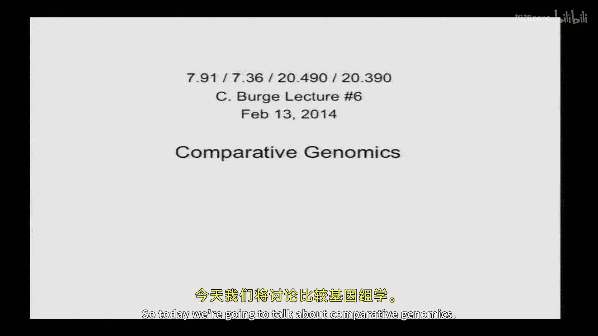
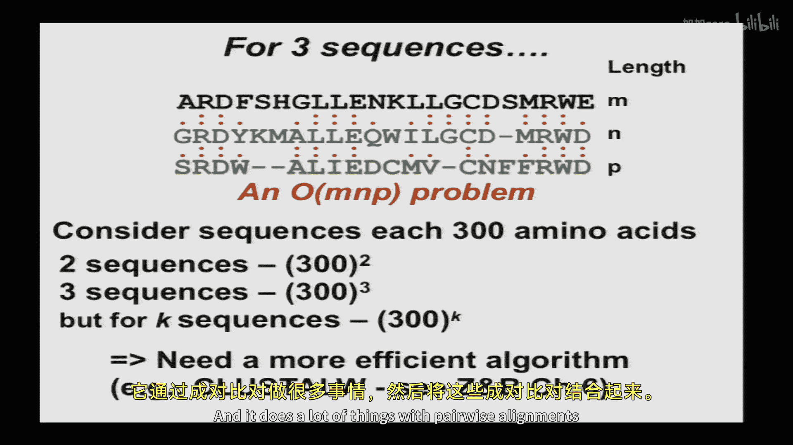
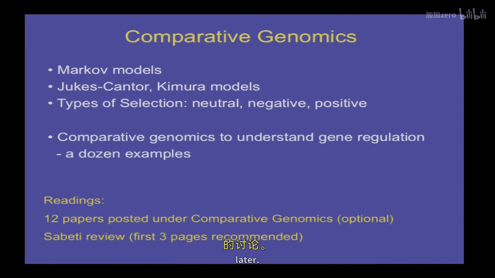
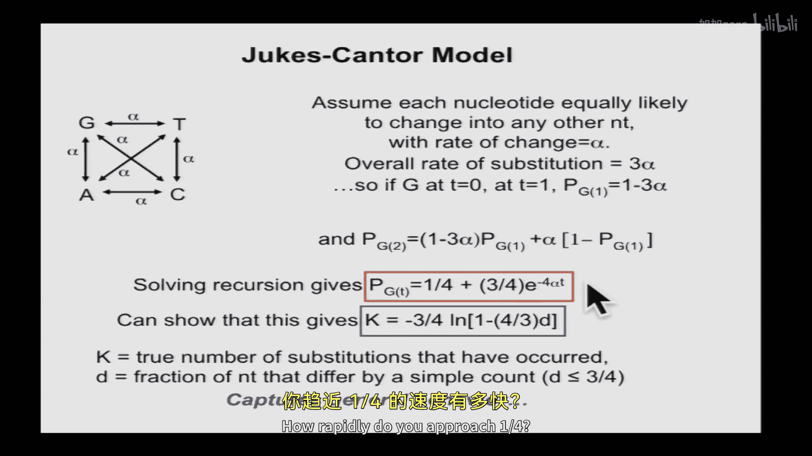
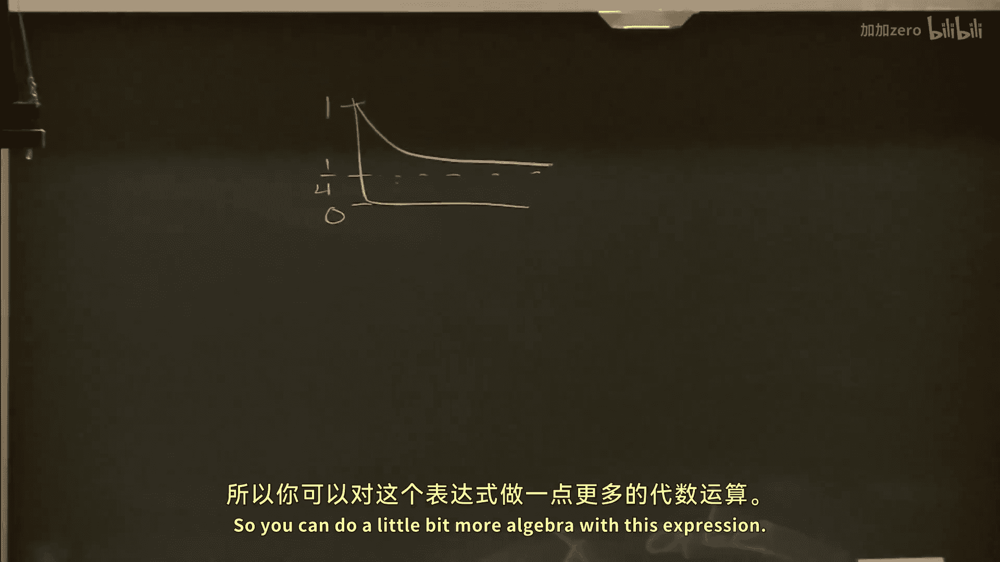
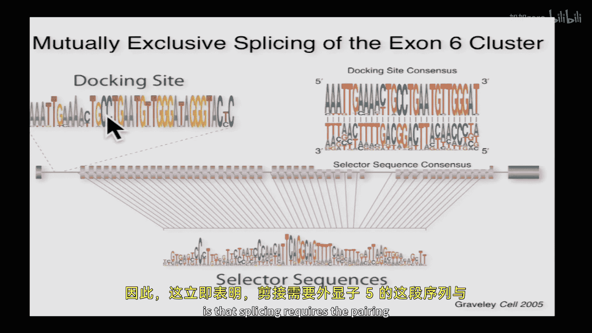

# 【计算与系统生物学基础 7.91J 2014】麻省理工—中英字幕 p04 p3 4. Comparative Genomic Analysis of Gene Regulation -BV1HdzaYAE2a_p4-

The following content is provided under a creative Commons license。

 Your support will help M I T Open Coware continue to offer high quality educational resources for free。

To make a donation or view additional materials from hundreds of MI T courses。

 visit M T OpenCourseware at OCw。 MT。 Eduu。

Why don't we get started？Today today we're going to talk about comparative genomics and first a brief review of what。

We did last time。 so last time we talked about。Global alignment of protein sequences。

 including the Neman Luch and Smith Waterman algorithms。

Talked about gap penalties a little bit and started to introduce the Pam series of matrices。

Wwhichch are well described in the text。 So what I wanted to do is just briefly go over what I started to talk about at the end about Marovub models of evolution because they're relevant not only for the Pam series。

 but also for some other topics。

In the course， sort of a。Short unit on molecular evolution。 we're gonna to do today。 And。

 and then they also introduce hidden Markov models that will come up later， later in the course。

 So the example that we gave of a Markov model was。DNA sequence evolution in successive generations。

 where the observation here is that。The base at a particular position。

At generation n minus our n plus one here。Depends on the base at that generation and the base at generation N。

Conditional on knowing the base of generation N， you don't learn anything from knowing what that base was at generation n -1。

 That's the， that's the essence of the， of the Markov properties。 So here's the formal definition。

As we saw。Before。Any questions。On this。 And I ask you to review your conditional probability if it was。

 if it was rusty， because that's that's very。That's very relevant。Okay。Good， okay。

 so in this example， you might， if you。Had a random variable。嗯。

X that represented the genotype at a particular locus， let's say， the apo lipopprotein locus。

And it had alleles， big A and little A， then you might write something like。

The probability that Bart's genotype is。Little A homozygous。

 given his grandfather's genotype and his dad's genotype is equal to just the conditional probability。

 given his fathers his father's gentype。 So those are the sorts of things you can do with。

 with Markup chains， okay， so。When you're working with Markov chains， matrices are extremely useful。

 Okay， so another thing thatll be helpful。In this part of the course， and then again。

 in Professor Frankel's part where he's talking he'll use also some ideas from linear algebra is to sort of review your basics of matrices and vector multiplication。

If you now make a model of molecular evolution where SN is S is this variable that represents a particular base in the genome and is the generation。

 and then to describe the evolution of this base over time。

 we're going to imagine that its evolution is described by Markov chain and。

Markov chain can be described by in this case， a4 by four matrix。

 since there are four possible nucleotides at generation I， for example。

 at four possible at generation I plus one。 and you simply need to。

Specify what the conditional probability that the base will be。

 you know of any possible base at the next generation， given what it is at at the current generation。

 Okay， so here's here's the matrix up here。 and it describes， for example。

 the probability of going from a C to an A。So then in general， if you you know。

 you might know that that base is is a G at the first generation， but in general。

 you won't necessarily know what what base it is if you're modeling you know。

 events that may happen in the future。 So the most general way of describing what's happening at that base is a vector okay of probabilities of the four possible bases。

 So Q A， Q C， Q G， Q T with those probabilities summing up summing up to one。

 And so then it turns out that with this notation that the。

The content of that vector at Gene N plus one is equal to simply the vector at Gene N multiplied on the right by。

 by the matrix， just using the standard。And。Vectctor。Matrix。Our multiplication， okay。So for example。

 if we have vectors with four things in them and we have a4 by four matrix。

 then to get this term here in this vector， you multiply。

 you basically take the dot product of this vector times this first column right the vector times the the first column give you that entry and this times this column will give you。

嗯。We'll give you that entry in the vector and so forth。

 And you can see that the way this makes sense， the way the matrix is defined。

That first column tells you。The probability of that you'll have an A at the next generation conditional on each of the four bases at the previous generation。

 So you just multiply by the probabilities of those four bases times the appropriate conditional probability here。

 And those are all the ways that you can be an A at generation and plus one。Okay。And so。

It's also true that if you want to go further in time。 So from generation N to generation N plus K。

 K some integer， then you this just corresponds to sequential multiplication by the matrix K。

I'm sorry by the matrix P。 So， you know， you。Q。Q n plus1。Equals Q times p， and then Q n plus 2。

Well equal。Q，m sorry。It was like guy cubit。QN plus 1 times P。Which will equal Q times p squared。

 where p squared means matrix multiplication。 Okay， again。

 using the standard rules of matrix multiplication that you can look up。

So one of the things you might think about here is what happens after a long time。

If you start from some。Some vector Q， for example， Q has is 0，0，1，0。 That is its。

10 percent chance of of G。 What would happen if you run this matrix on that over long。

 over a long period of time。 Okay， we'll come back to that question a little later。Okay。

 so thinking about the dayhf matrices。 and again， I'm not going go into detail here because it's well described in the text。

 Dehf looked at these。Highly identical alignments， these sort of 85% identical alignments。

 and calculated。The mutability of each residue and these mutation probabilities for how often each residue changes into each other one and then scaled them so that on average the chance of mutating is 1% and then took these probabilities。

 these frequencies mutation MAB divided by the frequency of the of the residue B took the log and then just multiplied by two just sort for scaling purposes and came up with and then rounded to the nearest integer again for sort of practical purposes and that's how she came up with her Pam1 one matrix and then you can use matrix multiplication to derive all the successive Pam series multily Pam1 matrix times。

To get the Pam2 and recalculate the scores。All right。If you actually use Pam matrices in practice。

 there are， there are some issues。 and these are also well described in the text。

 And the fundamental problem seems to be。That。An。W the proteins evolve over short periods of time and the way they evolve over long periods of time is is somewhat different。

 And that the basically this model， this Markov model of evolution is is not quite right。

 that things do't you know。The， you know what you see in short periods of time。

 it does not match long periods of time。 And and why is that a number number of possible reasons。

 But but keep in mind that in addition to proteins simply changing their amino acid， know。

 their amino acid sequence。 Other things can happen in evolution。 right。

 You can have insertions and deletions that are not captured by this Markov model。

 And you can also have birth and death of proteins， right。

 you can have a protein can evolve according to this model for millions of years。

 and then it can become you know， unneeded and just get be be lost for example， So。You know。

 the real proteining evolution is more complicated。 And so。About 20 years ago or so。

 Hannikoff and Hannikoff。Decided to develop a new， a new type of matrix。

 And the way they did it was to identify these things called blocks， which are。

Regions of reasonably high similarity， but not， not as high as dayhof required。 Okay。

 so there were many more dayhof was working in the 70s。 They were working in the 90s。

 So there were many more proteins available， And they could identify with confidence much know。

 basically a much larger data set， including more distantly related。

 but still confidently alignable protein sequences， and they derived new parameters。 And in the end。

 this matrix they came up with called blossom 62 is seems to work well in a variety of context when comparing。

Moderately distantly related proteins or， or quite， quite distantly related proteins。

 If you're comparing very similar proteins， it almost doesn't matter what you know。

 any reasonable matrix will probably give you the right answer。

 But when you're comparing the more distant ones， that's when that's sort of where it becomes challenging。

And so this is the blossom 62 matrix here。 And you can see it's， it's similar to。嗯。

To the Pam Pam matrices in that I think we showed Pam 250 last time in that you have a diagonal with all positive numbers。

 and it's also similar in that， for example， tryptophan down here has a very high has a higher positive score than others。

 It's plus 9， and Sistine is also one of the higher ones， but it's less， you know。

 those are sort of less extreme。And basically， maybe over short periods of evolutionary time。

 you know， you don't change your cystes。 But over longer periods。

 there is some rewiring of disul by bonding。 And so ss can change something。 something like that may。

 may be going on。So we've just talked about pairwise sequence alignments but in practice you often have。

 especially these days， you often have many proteins。

 those you want to align three or five or1 different proteins together to find out which residues are most conserved。

 for example。Okay，And so basically， the principles are similar to pairwise alignment。

 But now you try， you want to find alignments that bring the greatest number of single characters into register。

 So you really， if youre you aligning three proteins。

 you really want to have columns where all three are the same residue or very similar residues。

 And you need to then， you know， define scoring systems to find gap penalties and so forth。

 This is also reasonably well described in the text。

 I just wanted to make one comment about the sort of computational complexity of multiple sequence alignment。

 Okay， so if you think about。Pairwise sequence alignment， say with Needleman Wench or Smith Waterman。

An。With a sequence of length， let's say you're aligning one protein of sequence length N to another of of length N。

 What is the computational complexity of that。Calculation in using this big O notation that we've talked about。

With just say standard gap penalties。Linear gap penalties。Anyway。Or does it matter， ahead。

And is n squared。 O， so even though this has gaps。 So with local with ungapped。

 it was also n squared， or n times M So why is it that gaps don't， don't make it worse。

What do you think？Any any thoughts on that。喜我。So should playing the essentialotic complex still be。

You put a constant number of gaps。I mean， yeah， I'm going to go let's just hear a few different comments。

 and then we'll try to summarize go ahead。 So we're still only filling out it。And matrix。

You're still filling out an n by N matrix， right， there happened to be。Like a few more things。

 The recursion is slightly more complicated。 There's a few more things you have to calculate to fill in each。

 but it's like three things or four things。 It's not， you know， yeah， sorry。

 it doesn't grow with the size with the size， right， So it's it's just still n squared。

 but with a larger constant。And then if you did aine gap penalty。

 remember where you have a gap opening penalty in the gap extension。What， what then。

 does that make it worse or is it still。And square。这个 the。外善。Mereetings that outline。Yeah， I mean。

 basically with AI， you have to keep track of。Two things in each。You know， at each place。 So yeah。

 it is， you're right。 It's still， it's still n squared。

 It's just you got to keep track of two numbers in each place there。 Okay， good。

 And so what about when we go to。3 proteins。So how would you generalize， let's say。

 the needle and winch algorithm to align three proteins。Any ideas。What structure would you use？

But what you。Analogous to a matrix Yeah， in the back。 the way to do this is so we have a 3D matrix。

 Okay， a 3D matrix， Okay， so like a cube。Right， and。Can everyone visualize that？RightSo yeah。

 basically， you could have sort of a version of Neleman Wech that that was on a cube。

 and it started you know in the 0，0，0 corner and went down to you know。

 the N and N corner filling in in 3D， Okay so how what kind of computational complexity do you think that algorithm would have。

N cubed， okay， yeah， makes sense， right， There will be similar number， you know。

 a few operations to fill in each element in the cube。 and there's n cubed。

 So the way that the problem grows with n is as n cubed。 Okay， and what about in general。

 if you have K sequences。And to the K。 So is this practical？

With with three proteins and modern computers， you could do it。

 you could implement minimum onech on the cube， but what about with 20 proteins？在开车。

So it's really it's really not。 So if proteins are 500 residues long。

 And know 500 to the 20th it starts to explode。 So that approach really only works in two dimensions and a little bit in three dimensions it becomes impractical。

 So you need to use a variety of shortcuts。 And so this is again。

 described pretty well in chapter 6 of the text and a commonly used if you're sort of looking for a default multiple sequence alignmentr cluster W is a common one。

 There there's a web interface。 If you just need to do one or two alignments that works fine。

 you can also download a version called cluster X and run it locally。

 And it does it does a lot of things with pairwise alignments and then combining the pairwise alignments。

 aligns the two closest things first and then brings in the next closest and so forth and does a lot of tricks that are。

😊。

They're basically heuristics。 They are things that。Usually work。 Give you a reasonable answer。

 but don't necessarily guarantee that you will find the optimal you know。

 alignment if you were to do it on a 20 dimensional cube， for example， right So。

 so they work reasonably well on practice。 And then there's other。

 a variety of other other algorithms。 Okay， good。So that's sort of a review of what we've mostly been talking about。

 And now I want to introduce a couple of。New topics， so。

We're going to briefly talk a little bit more about Markov models of sequence evolution。

 and these are closely related to some sort of classic evolutionary theory from Dukeke's Cantor and kura。

 so we'll just like briefly mention that and we'll talk a little bit about different types of selection that sequences can undergo。

 so neutral， negative and positive and how you might distinguish among those for protein coding sequences。

And this will basically serve as sort of an intro into the main topic today。

 which is comparative genomics。 And， and comparative genomics is， you know。

 it's not really a field exactly。 It's more of a， it's more of an approach， but。

s I wanted to give you some actual concrete examples of computational biology research， you know。

 successful research that has LED to various types of insights into gene regulation in this case。

 just mostly to emphasize that computational biology is not just sort of a bag of tools。

 We've mostly been talking about tools。 we introduce tools for local alignment and and multiple alignment and statistics and so forth。

 But but really， you know， it's a living breathing field with you know， active research。

 And even using， I mean， comparative genomics is one of my favorite areas within this field becauses it's very powerful And you can often use very simple ideas and simple algorithms can sometimes give you really interesting biological results。

 if you if you have the right sequences and ask the question the right way， so。😊。

I have posted a dozen of my favorite comparative genomics papers in a special section on the website。

 Obviously， I'm not asking you to， to read all of these， but I'm gonna give you sort of a few。😊。

Insights and approaches that were used in each of these papers here。

 just to give you sort of a flavor of some of the things that you can do with comparative genomics in the hopes that this might like inspire some of your projects。

 So hopefully you're gonna to start thinking about finding teammates and thinking about projects。

 and this will hopefully help in in that direction。 of course。

 they don't have to be comparative genomics projects。

 You can do anything in computational biology or systems biology in this class。

 But that's just one area to start thinking about。😊，Okay。Yeah， I also， I'm sorry。

 I think I haven't posted this yet， but I will also post this a review by Soettti that that has a good discussion of。

Positive selection， a little bit later。

Again， not， not required。 Okay， Allright， so let's go back to。This question。That I posed earlier。

 we have a Markov model of DNA sequence evolution。And。We S N is the basic generation N。

 And then what happens after a long time。Okay。If you take any any vector Q to start with might be a known base。

 for example， and apply that matrix many times What happens as as n goes to infinity。

 And so it turns out that theres there's fairly classical theory here that gives us an answer。

 I mean， this is not all the theory that exists。 but this is sort of describes the typical case。

 So so the theory says that if all of the elements in the matrix are greater than zero。And then。

 of course。All of the。The the P I Js， when you sum over J， they have to equal 1。 Okay。

 that's just sort of。It' for it to be a well defined Markov chain because you're。Going from I to J。

 And so you have to go， from any base。 you have to go you know。

Probably of going to one of those four bases has has the sum to one。 And so if those conditions hold。

 then there is a unique vector R。It such that R equals R times P， okay。

And the limit of Q times p to the n。Eals R independent of what Q was。 Okay， so basically。

 wherever you were starting from， you could have been starting from 100% G or 50%， A，50% G or 100 C。

 you apply this matrix。You know， many， many times you will eventually approach this， this vector R。

And。It's this theory doesn't say what R is exactly。 but it says that R equals r times P。

 And that turns out to。Basically， implicitly define what R is。

 that is you can solve for R using that using that equation。 Okay， and R， for this reason。

 because because the matrix doesn't， doesn't move R。 R is called the stationary distribution。

 And it's often also called the limiting distribution for， for obvious reasons。

 And if you want to read more， it's where like where this theory come comes from。 It's's here's。

 here's a reasonable。Reference， so any questions about this。Not this theory。

All the elements of the matrix have to be strictly greater than 1。 I'm sorry。

 strictly greater than 0， O， otherwise。Really no conditions。All right， question， yeah。

Probability distribution never change based on the secrets， or are we assuming that it doesn't。

The theory says it only depends on P。 It doesn't depend on Q。So it depends on the model of how。

 how the changes happen。Right， conditional probability of。

What the base will be at the next generation， given what it is a current generation。

 it doesn't depend where you start。 A Q is like what the your starting point is， right。

 what what base you're initially at。Does that， that make sense。And and this。

 this is obviously a very simplified case where we're just modeling evolution of one base。

 And we're not thinking about you know whether the rates vary at different positions or know this is sort of the simplest case。

 But it's important to understand the simplest case before you you know。

 start start to start to generalize that。 Okay， so let's do some examples here。

 So here are some matrices。 So it turns out the the math is a lot easier if you limit yourself to a two letter alphabet instead of instead of four。

 So that's what I've done here。 So。Let's look at these matrices and think about what they mean。 Okay。

 so we have a two letter alphabet。 R is puring Y is pymidity。

These matrices describe the conditional probability that at the next generation， you'll be。

For example， loops。That。For example， if you start at purine that you'll be remain puring at the next generation。

 that will be1 minus p， and the probability'll change to perimidine is P。

 and the probability of periidine will will remain as a perimidine is 1 minus P。

So what is the stationary distribution of this matrix？So a P is small。

 this describes sort of a typical。Tyical model where， you know， most of the time you you remain。

 you know， DNA replication and repair is faithful。 you。Maintain the same base。

 but occasionally a mutation happens。With probability P。

Any anyone want to guess what the stationary distribution is or， or describe a strategy。

For finding again。Like， what do we know about this？Distribution。Or imagine you start with a pureine。

 and then you apply this matrix many times to that vector that's one comma 0。 What will happen。Yeah。

 back， it's probably 50，50 because anyway with any other way that you wouldke it。

 it would be pushed towards the center because there's more one that you take to the other。Okay。

 would everyone get that。 so Levi's comment was that it's probably 5050 because mutation probabilities are are symmetrical。

 right， Purine periiding and periiding puring are the same。

 So if you were to start with say lots of purine， then there'll be more mutation toward periiding in a given generation。

 So if you think about you know this is your population of R。

 and that's your population of why then if this is bigger than that you will you know you'll tend to push it more that way and it be less mutation coming this way until until they're equal right and then you'll have equal flux going going both directions。

 Okay so that's a good way to think about it that's correct。

 can you think of how you would like how would you show that let's say。

A way of solving for the stationary distribution。So remember，'s go go back one the。

The theory says that R equals R P。 Okay， that's， that's the key。R equals RPp。So what is R。

 Well we don't know R。 So we let that be a general。vector， so notice there's only one free parameter。

 right， because the two components have to sum to 1。 It's a frequency vector， right。

 So x and 1 minus x。Okay， and we just multiply this times the matrix。 Okay， so you take。

X comma1 minus x。And you multiply by this matrix。The matrix is。1 minus P P。Using too much space here。

 make it a little smaller P1 minus P。 Okay， and that's gonna to equal R， okay and。

So we'll get x times 1 minus P。Plus， remember， it's dot product of this times this column， right。

 So x times 1 minus P plus 1 minus x times p。That's the first component。Okay。

 and the second component will be。X， P plus。1 minus x。Times 1 minus p。Okay， everyone got that。So now。

 now what do we do？啊。Would that make that equal to the initial R。 Yeah。

 make that equal to the initial R。 So it's basically， it's， it's two equations in。

Well you really only need one equation here because we。

 because we've already simplified it in general， there will be two equations。

 There will be one equation that says that the components of the vector， you know， sum to 1。

 and there'll be another equation coming from here。 But we can just use either one either term。

 So we know that the first component of the vector， if if this vector is equal to that vector。

 then the first components have to be equal right， So x equals x。Times。Times what times。1 minus p。

Just combining these these two。 Okay， and then。Plus， what are all the。I'm sorry， that's a 1 minus P。

1 minus P here。 And then there's another term here， minus another P， right。

And then there's a term that's just P。Right。And so then what do you do？You just solve for x。

And I think when you work this out， you'll get。2 P。X equals P。So， x。Equals1 half。All right。

 everyone got that。Okay， so。Yeah， so if x is one half， then the vector is one half comma 1 half。

 which is the know， unbiased。 All， what about this next matrix。Right below。1 minus P，1 minus Q。

A P and Q are two。And。None or two positive numbers that are different。

 So now there's actually a different probability of mutating purine to periymidide and perimiding to purine。

So Levi， can we apply your approach to see what the answer is？看一下。Okay， yeah， it's not as obvious。

 I it's not symmetrical anymore， right， but can anyone guess what the answer might be。Yeah。

 ahead it'll go either all the way side。就在那个。All the way to one side or all the way to the other。

So meaning it'll be all puring or all primting again。Depending on which is bigger。Okay。

 anyone else have an alternative？theory yeah go ahead okay。

It'll reach some intermediate to equilibriumlib one。第。Once they got the balance each other other and。

That would be exactly。I'm not sure some some ratio of Q to B。O。How many people think that？

What happen。Okay， something don' Okay， Daniel has maybe slightly more supporters。 So's let's see So。

 how are were going to solve this。How do we figure out what the stationary distribution is？

You just use that same approach， right， so you can do。You have X。1 minus x。Times that matrix。

Which is got the。1 minus P， P Q， minus Q。 Okay， And so now you'll get x 1 minus P。Anyway。

 go through the same， go through the same operations， solve for X and。You will get。

 I think I put the answer on slide here。 You will get Q over P plus Q。 Okay， so as Danny predicted。

 some ratio involving Qs and P's。 And does this make sense。 Like， look seeing what the answer is。

Does can you rationalize why that， why that's true。It's like a chemical you have。

One motive force play pushing one way and another different one in this case pushing the other。Yeah。

 that's， that's basically the same the same idea。 And so they have to be in balance。 So the one。

That is has less， you know where the mutation rate is lower will end up being bigger because so that the amount that flows out will be the same as the amount that flows in right。

 there's sort of it's really you can apply Levi's idea of like thinking about how much flux is going in each way。

 So there's gonna be some flux P in one direction Q in the other direction and you solve for you want you know。

 X times p to equal1 minus x times  Q right ands this is the value that that works。Okay， okay， good。

What about。What about this guy down here。 So this is a very special matrix called the identity matrix。

 And what kind of model of evolution is this。😊，There's no illusion is this is like a。

A perfect replication repair system， The base never changes。 So what's the stationary distribution。そ。

What that。It'll say where it is， that's right， so if any vector is stationary for this matrix。Okay。

 remember the， the theory said there's a unique stationary distribution。 So why this seems to be。

Inconsistent。Why is it non inconsistent， Sally。We defined all of the variables to be greater than zero。

 so we have anything。Record， so a condition of the theorem is that all the entries be strictly greater than 0。

 And this is why。 Okay， if you have zeros in there， then crazy things can happen。 like this， yeah。

 wherever you start， that's where you end up with with this matrix。 Okay。

 so every vector is stationary。 And what about， what about this crazy matrix over here， matrix  Q。😊。

What does it do。2。It swaps back and forth。A hypermutable organism that has such a high mutation rate。

 It always， it always mutates every base。 Okay， to the other to the other car。

 It's never happy with its genome。 It always wants to switch it gets any better。

 And so what can you say about the stationary distribution for this matrix。😊，Yeah。

 there is a good view。There isn't going to be one， anyone else， I guess like one one。5。

5 would be stationary， right， because you're going to。But you won't converge。

But you won't convertge it。 That's right。 it's stationary， but not limiting。Okay， and again。

 the theory doesn't apply because there's some zeros in this matrix， right。

 but you can still think about it。 Okay， everyone got that。 All right， good。Okay。

 so let's talk now about Dukeke's cantor。 Soke's cantor is sort of very much a naov model of DNA sequence evolution。

 and it simply has， now weve got four bases。 it's got probability alpha of mutating from each base to any other base。

 And so the overall mutation rate。Or probability of substitution at one generation is3 alpha。

 because from the base G， there's an alpha probability muate to A， an alpha probability to C。

 and alpha to T。 So there are three alpha and。You can， you can basically write。

A recursion that describes what's going on here， Okay so。The probability。

 if you start with a G at time 0， the probability you have a G at time 1 is 1 -3 alpha。 right。

 It's the probability that you didn't mutate。 But then at generation 2。

 you have to consider two cases， really， right， First of all， if you didn't mutate。 That's P G1。

 then you have a1 minus alpha probability of not mutating again， right， So remaining G。

 but you might have mutated。 okay。啊。With probability 1 minus P G1， you mutate it。

 and then you have an alpha probability， Whatever you were might be a C。

 You have an alpha probability of mutating back to G。DoesDoes that make sense？

Everyone clear why there's a three in one place and only a one alpha in the other。All right。

 so this you can actually solve this recursion。😊，And you get this expression here。

 P G of T equals one quarter plus  three quarters， E to the -4 alpha T。Okay。

 so what does that tell you about。You know， we， we know， right， we know from our previous discussion。

What the stationary distribution of this Markov chain is going to be， right， What will it be。

What's the stationary institution？Itll go towards one quarter each。

 one quarter H and y know that because the probability of moving to any base is the same。

Right it's totally symmetrical。 So it kind of has to be。 that has to be the answer by symmetry。

 And you could solve it。 You could use the same approach with， you know， defining a value know。

 the E theory applies if alpha is greater than 0 and less than one。

 And less than I think it has to be less than a quarter， actually or something like that and。

The you can apply the theory and there， so there will be a stationary distribution。

 You can set up a vector。 Now， you have to have， you know， four terms in it， right。

 and a multiplication。 And then you'll get a system of basically four equations in， in four unknowns。

Right， and you can solve that system using linear algebra and get the and get the answer。 And the。

 the answer will be a quarter， a quarter as you， as you as you guessed。 And so what the。

 what this Dukes canter expression tells you。Is how quickly does it get to that equilibrium， right。

 We're thinking about G。You can start at 100% G， and it will then approach one quarter。 right。

 You can see one quarter is clearly what's going to happen in the limit， right。

 Because as T gets big， that second term is going going to 0， right？ And so what。

 what does the distribution look like， How， how rapidly do you approach。

One quarter。Okay， you approach it。Exponentially， so if you start at one here。And this is 0。

 and this is a quarter。You'll start here， and you go。Like you know， like that。

You go rapidly at the beginning， and then you get sort of just very gradually approach a ch。Um。So。

You can do a little bit more。Allegebra with this expression。

 here's where the really useful part comes in。And you can show that。K。

 which is the will define as the true number of substitutions that have occurred。

At this particular base that we're considering。Is related to D。

 where D is the fraction of positions that differ when you just take the， say。

 the parental sequence and the， you know， the daughter sequence。

 the eventual sequence that you get to。 You just match those two。 and you count up the differences。

 Okay， that's D。 And then K is the actual number of substitutions that that have occurred。 Okay。

 and those are related by this equation， K equals minus-3ers natural log1-4 thirds D。Okay。

 so let's try to think about， first of all， what is the shape of that。Curve。What is that？Look like。

Here's 0。I'll put like one over here。 So we all know that that like log。

 if it was just simply log of something between 0 and 1。It would look like。What。Look like。That right。

Starts from like negative infinity right and comes up to to 0 at at one。 right。

 But it's actually not log of D。 It's log of like 1 minus D or 1 minus a constant times D， right。

 So that will。Flip it。Right， so the minus infinity will be。Like there it'll come in like that， right？

And then we also have minus three quarters。Right。There's a minus in front of this whole thing。 right？

 So all these logs are of numbers that are， that are less than one。 So they're all negative。

 but then it'll get， it'll get flipped。 Okay， so it'll actually look like that。Okay。

And it will go to infinity。Where。Where does this go to infinity， So if this is now。K is on this axis。

 And yeah， sorry if that wasn't clear。 D is here。 So this is， this is just， again， this is。

 if we did log of D， it would look like this。 If we do log of like 1 minus something times D。

 that'll like flip it。 Okay， And then if we do minus that， it'll flip it again that way。 Okay。

 so now。K， as a function of D is going to look like this okay。And。Sometimes people like to。Put on。

P anyway， but let's just， yeah， let's just think about this。

 So it's going go to up to infinity somewhere。 And where is that。Three quarters。

So does that make sense？Can someone tell us what's going on and what is the use of this whole thing？

Yeah， in the back question， yeah， so I love zero。Don'll give me that。And so we just saw her。Okay。

 so yeah， so when D is big quarters， you get 1-1， you get 0。 Thatll be negativefinity。

 And then there's a minus in front。 So it will be constant finite right。 So that's true。

 And why does does that intuitively make sense to you。We have， we have a sequence。

 It's evolving randomly， according to this model。 Okay， and then we， we have that ancestral sequence。

 and then we have a modern descendant of that sequence。

 millionsions of generator or maybe thousands of generations or some some large number of generations away。

 We line up those two sequences， we count how many matches and how many mismatches。

 What's the fraction of mismatches of differences we have。 And if it's。Basically， if， if that let's。

 let's look at a different case。 What if。D is very small。What if it's like 1%？Then what happens？Okay。

 if D is， if D is small。Turns out K is pretty much like D。 It grows linearly with D in the beginning。

 Okay， so does that make sense。That makes sense because K is the true number of substitutions that happen When you go like one generation。

 the true number of substitutions and the measured number of substitutions is the same because there's there's no back mutations。

 right， But when you go further， there's there's an increasing chance of a back。

 there's an increasing chance of a mutation， therefore。

 increasing chance that you also have a back mutation。

 And so this is sort of what happens at long time。 So basically， if this。

 this is linear here and then kind of goes up like that。 And so what this allows you to do。

 is D is something that you can measure Okay， and then K is something that you want to you want to know。

 the point is if I measure。The difference between human。And chimp sequence。

 it might be only 1% different。 And I can， you know。

 if I have an idea of mutation rate per generation。

 I can figure out like how many generations apart or how， you know。

 how much time is passed since humans split from chimp。 Okay， But if I go to mouse where you know。

 the average base might be， you know， there might be。Only 50% matching。 Okay， if that's true， there。

 there have been a lot of changes there。 There will be a lot of change bases that have changed once。

 as well as a lot that may have changed twice and may have actually changed back。 And so that。

 let's say human amount mouse or 50% identical。 that 50% identical。

 I can't I can't just compare it to the， let's say the 1% with chimp and say， you know。

 it's 50 times longer。 Okay， that 50% will be an underestimate of the true。Difference， right。

 because there's been some， some back mutations as well， right。

 And so you have to use this formula to to figure out what the true。

Evolutionary time is the true number of changes added。啊 yeah go ahead。Does it refer to？

The simple count is what you actually observe。嗯。You have a stretch of sequence。

Let's say the beta gllobin gene， genomic locus and human。

 you line it up to the betaglobin G locus in chi。 You count what fraction of positions differ。

 What fractions are different。 That's D。And then K is， actually， I mean。

 it's slightly complicated here because if this is human and that's chimp， then， you know。

 K is more like you know， because you don't actually observe the ancestor， right， you observe chimp。

 So you have to kind of go back to the ancestor and then forward。 So it that's how many。

 that's the relevant number of generations， right， And so K will tell you how many changes must have occurred to give you that observed fraction of differences。

 Okay， And for short distances， it's linear。 And then for long， it's logarithmic， basically。Yeah。

 question。I'm guessing all of this still assumes that selection is not。Right， right。

 is ignoring' a good time。So think about this and let me know if other questions come up。Alright。

 so this actually came up the other day when we were talking about DNA substitution models。

 So kmoura and others have observed that transitions occur much more often than than transversions。

 maybe two to three times as often。 and so proposed a matrix like this And now you can use what you know about stationary distributions to solve for the limiting or stationary distribution of this matrix。

 And actually you will find it's still symmetrical。 I mean， it's a little bit more complicated now。

 but you'll still get that a quarter a quarter。 But then more recently。

 others have observed that really diucleotides matter in terms of mutation rates。

 particularly invertebrates。 So what's special about vertebrates is that they have methylation machinery that metthylates CPG diucleotides on the C。

 And that makes those Cs hypermutable。 They mutated about 10 times the rate of any other base。😊。

And so。You can give a higher mutation rate to C， but that doesn't really capture it。

 It's really a higher mutation rate of C's that are next to G's， right。

And so you can define a model that's 16 by 16， Okay， which has dynamicynide mutation rates。

 And that's actually a better model of DNA sequence evolution。 And it's just the， you know。

 the math gets a little。😊，Hrier， if you want to calculate stationary distribution， But it， again。

 it can be， it can be done。 And it's actually。Pretty easy to simulate， right You can just。

You can just run， you know， knowing that it will converge to the stationary。 You can just run the。

 the thing many times and you'll get， you'll get to the。You'll get to the answer。

And there's even been strand specific models proposed。

 where there are some differences between how the repair machinery treats。

 the two DNA strands that are related to transcription coupled repair。

 So you actually get some asymmetries there。 and there I want， this is， you know。

 a reasonably rich area。 And you can look at some of these references。Alright， so one more topic。

 sort of while we're on evolution， this is， this is very classical。

 but I just want to make sure that everyone has seen it。

 If you're looking specifically at protein coding sequences， exons。 and you know the reading frame。

 You can just align them， and then you can look at two different types of of substitutions。

 You can look at the。What are called the non synonymous substitutions。

 So changes to the codons that change the underlying amino acid， the encoded amino acid。

 and you define often a term that's either called K A or DN。

 depending who you read that is the fraction of non synonymous substitutions divided by non synonymous sites okay。

And in this case， but let's do synonymous first。 you can also look at the other changes。

 So these are now synonymous changes， which are base changes to triplets that do not change the encoded amino acid。

 So in this case， there are there are three of those。

 and a lot of evolutionary approaches are are risk based on calculating these two numbers。

 You count synonymous changes， you divide by synonymous sites。

 count non synonymous substitutions divide by non synonymous sites and so what do we mean synonymous site。

 well。If you have only amino acids that are。Fourfold that have fourfold degenerate codons， Okay。

 which is all of them are like that。 in this case， then， for example。G G。

 or let's see what's up here。 Yeah， C， C， anything。Cdes for prone。 have many of those。Actually。

 these are not all fourfold genre。 I apologize， but， but glycine， for example。 So G G。

 anything is glycine。 Okay， so in this triplet。This triplet here。 there are。

 there's one synonymous site。 The third site is a synonymous site。

 You can change that without changing the， the amino acid。

 But the other two are non synonymous sites。 Okay， so to first approximation。

You take non synonymous substitutions and divide by the number of codons。 I'm sorry。

 the number of codons times 2。 since there two non synonymous positions in each codon。

 and you take synonymous substitutions divide by the number of codons。 Okay。

 so it makes sense like 1，1 per codon。 Okay， and so what do you then， what do you then do with this。

You can then correct this value using basically this is the Dukeke's cantor correction that that we just calculated this three fourth log 1 minus4 thirds that applies to codon evolution as well as individual base evolution。

What people often do with this is they calculate K A and KS for a whole gene。

 let's say you have alignments of all human genes to their orthologs in mouse。

 that is the corresponding homologous gene of mouse and you calculate K A KS。

 and then you can look at those genes where this ratio is significantly less than one or around one or greater than one。

 And that actually tells you something about how that sort of the type of selection that that gene is experiencing。

Okay， so what would you expect to see， or if I told you， we've got two genes and the K， A K。

 S ratio is much less than one。 It's like。Pot2。What would that tell you？

What could you infer about the selection that's happening to that gene？K A K。

 S is much less than one。Any ideas。啊这人。The proteining sequence。The protein acid sequence。 Yeah。

 exactly the amino acid sequence is important， Okay because you assume that those synonymous sites and non synonmous sites are they're going to mutate at the same rate。

 right， The mutation processes are don't know about protein coding， right， so。

What you're seeing is an absence， you know， a loss of the non synonymous changes， right。

80% of those non synonymous changes have been kicked out by evolution， right。

 You're only seeing 20% and you're sort of using you're using like assuming the non synonymous are neutral。

 right， And then I'm sorry。I have， seem to have trouble with these words。

 you assume that the synonymous ones are neutral。 And then that sort of calibrates everything。

 And then you see that the non synonmous are much lower。 Therefore， you must have lost。 You know。

 these ones must have been kicked out by evolution。 So the amino acid sequence is important and it's。

 it's optimal in some sense， right， the protein works。

 The organism does not want to change it or changes to that。Protein sequence make the protein worse。

 right， And so you don't， you don't see them。 Okay。

 And that's what you see from most protein coding genes in the genome。

 A K A to A K S ratio that's well below  one。 Okay， it says。We care what the protein is。

 and it's pretty good already。 And we don't want to change it。Alright。

 what about a gene that has a K， A， K， S ratio of around one。Any， anyone have an idea。

 What would that tell you about that gene。There are some Daniel。

The sequence to that doesn't particularly matter。 Maybe it's。记得我。Any non coat。

 non regulatory patch of DNA is assume there must be some。Yeah， so it could be。

 it could be that it's not really proteining coding after all。 It's noncoding。

 Then this whole triplet thing we were doing to it is is kind of arbitrary， right， So you， you know。

 you don't expect any any particular distribution that that's true。 Any other possibilities。 Yeah。

 Tim， could that there are opposite forces the growth brain， for example。

 like we're taking the unit of the gene。 But maybe in one half of the gene。

There's a strong selective pressure for non synonys。

 and then the other half is strong selective pressure with this synonys。Alternatively。

 it could be in the same part of the gene， but it's involved in two different processes， it's atroic。

 so in one process we're selecting that。Yeah， for one period of time。

 if you're looking at 10 million years of evolution。

 it could have been for this first five million years。

 it was under negative selection and then it was under positive and it averages out， Yeah， I mean。

 yes， all those things are possible， but kind of unusual。But yeah， I mean。

 and so maybe if you saw that the， you know if you plot a K AK S along the gene and you saw that it was high in one area and low in another。

 then that would tell you that you probably shouldn't be taking the average across the gene。

 And that would be a good thing to look for。 But what if again， So we said if K AK S is near one。

 it could be that it's not really a protein coding gene at all。 That's certainly possible。

 it could also be， though， that it's a pseudogene。Right。

 or it's a gene that is no longer needed by the organism。 It still codes for protein。

 but the organism just could care less about about its function。

 It's something that maybe evolved in some other time。 You know， it helps you adapt to， you know。

 when when the temperature gets below -20。 but it never gets below -20 anymore。 And so there's no。

 you know， theres no selection on it something like that。Okay， so， so neutral indicates sort of。

 you know， this is called neutral evolution。 And then what about a gene which has a K A K S ratio significantly greater than one。

Any thoughts on what that might mean and what kind of genes might happen to yes。

 what' name Simon it might be a gene that's sort of selected against so something that's detrimental to the cell or the organ。

It's detriment so that the existing protein is bad for you。 So you want to， to change it， right。

 So it's better to to change it to something else， right， That's true。

 Can you think of an example where that might be the case。A gene that produces a toxin。

 a gene that produces toxin。啊。You might just lose the G completely if it produce a toxin any other。

 any other examples you can think of for other people。Yeah， Jeff maybe a pigment that。

Makes the organism more susceptible to being。系现代佢。O。Yeah， it was a polar organism。

 and it happened to have this gene that made it， the fur dark and it showed up against a snow or know。

 something like that。 You can imagine that。 Or a very common case is。For example。

 a receptor that's used by a virus to enter the cell。It you know， it probably had some。

 it had some other purpose， but if the virus is very virulent。

 you really just want to change that change that receptor so the virus you can't attack it anymore。

 So you see this this kind of thing is much rarer。 It's only like you。

 less than 1% of genes probably are under positive selection。

 depending on how you measure it in what time period you look at， But it tends to be really recent。

 really strong selection for changing the protein sequence。

 And the most common probably the most common is is is these sort of immune arms races between a host in a pathogen。

 But there are other cases， too， you can have very strong selection where I basically where protein is maladaaped。

 like the organism moves from a very cold environment to a very or environment。

 And you just need to change a lot of stuff to make those proteins better。

 better adapted occasionally， you can get positive selection there。Yeah。

So the situation where k or KS is 1 could it be possible that the mRNA is under selection？Yeah。

 so they basically we've always been implicitly assuming that the synonymous substitution rate was neutral。

 but it could actually be thats it's not neutral， right， That's under negative selection 2。

 And it happens that they balance， right， that's also possible。 So for that to assess that。

 you might want to compare。The synonymous substitution rate of that gene to like neighboring genes。

 And if you find it's much lower， that could indicate that right there the coding sequences。

 the third base of codons is under selection。Could be for splicing。

 Maybe it could be for RNA secondary structure， translation， you know， different other。 that's。

 that's a good point。 Yeah， so this， this so yeah， you guys have already sort of。Poked holes in this。

 right。 This is， this is a method。 It gives you something。 You'll see it used。 It。

 it gives you some inferences， But there are cases where it doesn't fully， fully fully work。Good。

Okayright， so in the remaining time， I wanted to do some examples of。Comparative genomics。

 so as I mentioned before。These are chosen to just sort of give you some。

Examples of types of things you can learn about gene regulation by comparing genomes。 again。

 often by using like really simple methods， just like blasting all the， you know。

Genes against each other or things like this。And， you know， and sort of also。

 if you do choose to read some of these papers， you know， it can give you some。

 some experience looking at this literature and regulatory genomics。

So the papers I've chosen will'll start with Begerano et all from 2002。

 who identified these basically sought to identify regulatory elements that are。

Things that are under evolutionary constraint。 That's all he was trying to find。

Didn't know what their functions were。 O， but they turned out to be interesting， nonetheless。

whichch is sort of maybe a little surprising and then these sort of other work from Eddie Rubin's lab and others Steve Brenner's lab actually characterize some of these extremely conserved regions and assess their function and then Beo came back a few years later and actually how to paper about where these extremely conserved regions actually came from So we'll talk about those then we'll look at some papers that have to do with inferring the regulatory targets of a transacting factor and the factors that we'll consider here will be microRNAs mostly。

😊，Either trying to understand what the rules are for microRNA targeting and there Lewis and all papers or trying to identify the regulatory targets in the genome。

And then time permitting， we'll talk about a few other examples of sort of slightly more exotic things。

 gravely。Identified a pair or pairs of interacting regulatory elements through a clever。

Comparative genomic approach。 And， and then I'll talk about these two examples at the end if there's time where a new class of transacting factors was inferred from the locations of the encoded genes in the genome and also an inference was made about the functions of some repetitive elements from。

 again， looking at the matching between these elements and another and another genome。Alright。

 so the first example， Vena ultra conserved elements。 So they defined in a fairly arbitrary way。

 ultra conserved elements as unusually long segments that are 100% identical between human mouse and rat。

 This was in 2000。I'm sorry， I might have the wrong。 See either 2004，2002。 I forget。

 This was basically when the first three mammalian genomes have been sequenced。

 which were human mouse and rat。 And there were whole genome alignments。 Okay。

 so they basically said， let's try to use these whole genome alignments to find what's the most conserved thing in mammals。

 Okay， so they they they would want to see if there's anything10 percent conserved。

 And so they did statistics to say what is the how you know。

 what's a unusually long region of 100% identity。Any ideas how you would like， do that calculation。

What kind of statistics you would use？They use a really simple approach。Okay。

 what they did was they took1 megab segments of the genome， assuming it might vary across the genome。

 They took ancestral repetitive elements。 So repetitive elements that were inserted。

 They were present in mouse rather and human and assumed that those were under。

 they were neutrally evolving。 Theyre not under selection。 And then therefore。

 you could look at the number of differences。 and get an idea what the background rate of mutation is。

 And they used that。 And they found that that rate was。

This is from their supplementary data that was never greater than 068， okay。And so they said， well。

 if we have。A probability of。I'm sorry the yeah， that one is heads。 So if they're all three the same。

 Yeah， So if we have a probability of， of 07 of heads， meaning that they're all three the same。

 then the chance that you have 200 heads in a row would be 1 minus P P to the 200， okay。

Just like new trials。 Okay， so， so， and you can just multiply that times the size of the genome。

 And you say it's extremely unlikely we ever see anything where there's 200 identical nucleotides in a row。

 Okay， so that's what they defined as an ultra conserved element。 so it all seems very。

 very silly for now， until you actually get to like what they， what they find。 So they looked at。

 Okay， where are these elements around the genome。 They found about 100 overlap exons of known protein coding genes。

100 are introns and around the remainder are an intergenic regions。So then they looked at， well。

 what kind of genes contain。Exxons with overlapping or contain ultra conserved elements of overlap exxons。

 Those are type 1 genes。 And what kind of genes are next to the intergenic ultra conserved elements to try to get some clues about the function of these elements。

 And so they did this。You know， early gene ontology analysis。 And what they found was that。

The ultra conserved elements that overlap exons tend to fall tended to fall in genes that encoded RNA binding proteins。

 Okay， particular splicing factors by by several by like， you know， an order of magnitude more。

 more frequent， okay。And then the type 2 genes， the ones that were next to these intergenic ultraconserved regions。

 tended to be transcription factors。 Okay， in particular。

 homeobox transcription factors were like the most enriched class。

So this gave them some clues about what might be going on。

 particularly the second class was followed up by。嗯。Edie Rubin's lab at Berkeley。

 and they tested 167 extremely conserved sequences。

 So some of them were these ultraconserved elements and some of them were just highly conserved。

 but not quite， you know，100% conserved。 And they had an assay where they have a reporter。

 It's a laxy reporter with a sort you take a minimal promoter， fuse it to Lax Z。

 And then you take your element of interest and fuse it offstream。 And you ask。😊。

And then you do staining of whole mount embryos。 And you say， you know。

 what pattern of gene expression does this element drive。

 or does it drive a pattern of gene expression？ And so 45% of the time。

 it drove a particular pattern of gene expression。 And then they so it was functioned as an enhancer。

 And。These are the types of。Patterns that they saw。 So they saw often forebrains。

 sometimes midbrained， neural tube， Ly， I， etc cetera。 So many of these things are。

Enhrs that drive particular developmental patterns of gene expression。 Okay。

 so that turned out to be actually， that was a pretty good way to identify developmental enhancers。

So they wondered， well， are these， is there anything special about these ultra conserved regions。

 these hundred percent identical regions versus others that are like 95% identical。

 And so they tested a bunch of each， and they found。absolutelybsolute no difference there。

 they drive similar types of expression， and you can even find individual instances of them that that drive all like pretty much exactly the same pattern of expression。

 So this whole 100% identical thing was just a purely， you know， it was purely arbitrary。

 but you know， still it's， it's useful， These things are， are among the most you know。

 interesting enhancers that that have been identified。 Okay， so what about the， yeah。

 so where did they come from。Okay， so this is sort of totally from， from left field。

 Begerna was looking at some of these ultra conserved elements。

 probably just like blasting them against different genomes as they came out and noticed something very。

 very strange。 Okay， and that was。😊，There had recently been some sequencing from seallican。 Okay。

 so for those of you who aren't like， you know， fish experts。

 this is a a lobed f fish where they found fossils from dating back to 400 million years。

 And they noticed that these fossils like morphology never， never change from 400 million years。

300 million years。 You could see this fish。 It was exactly like this。 And it it has lobed fins。

 That was why they're interested in it because the fins theyre kind of like they have a around structure。

 They look almost like limbs。 like maybe this guy could have evolved into something that would eventually live on land。

😊，And。Anyway， but they thought it was extinct。 And then somebody caught one Okay。

 in the 70s in the West Indian Ocean from like deepwater fishing。 they。 They pulled one up。

 and it looked exactly like these fossils from 400 million years before。 Okay， And so then。

 of course， somebody took some DNA and and did some sequencing。

 And what Begeranno noticed is that this1 megab or so of Clicantth sequence had a very common repeat in it。

 Okay， there was like around， you know，500 bases or so。😊，That looked sort of like a。

 like a sine element。 Okay， sine elements， short interspersed nuclear element。

 like little like alllos。 or if you're familiar with those。 And so some sort of repetitive element。

 And this repetitive element was very similar to these ultra conserved enhancers in mammals。Okay。

 so something that we normally think of as like。The least coned of all。

 like a repetitive element that inserts itself you know。

 randomly in the genome had become some of these elements had become among the most conserved sequences later in evolution。

 okay。So。Why， you know， how does that make any sense at all。Anyone have a。Theory on that。

I can tell you how they interpreted it。Okay， so their theory。Sort of， here's。

 here's some text from there。 anyway， this you can look at the paper for the， for the details here。

 But their theory is basically that。If once you have a repetitive element。

 initially it's sort of a parasitic element inserts itself randomly in the genome。

 doesn't actually do anything。But once you have hundreds of them， there will， by chance。

 there will be perhaps a set of genes that that have this element next to them。

Where you'd like to control them coordinately， you'd like to turn all those genes on or all those genes off in a particular circumstance。

 a stress response during development， something like that。

 And so then it's relatively easy to evolve a transcription factor。 for example。

 that that will bind into some sequence in that element。 and then it'll turn on all those genes。

 Okay， of course， itll turn on all the genes that have the elements near them。

 So itll probably turn on some extra genes that you don't want。 But you can then， you know。

 selection will will then tune tune these elements。 It sort of gives you a quick way of， of making。

 of having。Generating a large scale gene expression response。 Okay。

 because you've got so many of these things scattered across the genome。 And so this。Yeah。

 that's as good as an explanation as we have。 I would say for， what for what going on。

 for what's going on here。 And there's been some， some theories about this。Point out that actually。

 something like 50% of our genome actually comes from transpos。

 If you like sort of go back far enough。 Some are recent， some are ancient。

And that may be a lot of the regulatory elements。Not just these ultra conserved enhancers。

 but others may have may have evolved in this， in this way。 So basically。

 you insert a bunch of random junk throughout。 And then the fact that it's all identical， you know。

 because it derived from from a common source， you use that fact， actually， you know。

Turns it into something that's useful， a useful regulatory element。Alright。

 just want to throw that out。 So what about the exonic ultraconserved elements。 So here's one。

 This is the 600 18 nucleotide region that's 100% identical between human mouse and rat。

 It's like one of the longest in the genome。 And where is it。

 It's in a splicing factor gene called SP 20。And it's actually not in the protein coding part。 Okay。

 it's in a essentially noncod exon of this splicing factor。 Okay， so it's this yellow exon here。

 And what you'll notice is there's this little red thing here。 That's a stop codon。Okay。

 so this gene is spliced produces two different isoforms。 The full length is the blue。

 When you just use all the blue exons。 But when you include this yellow exon。

 there's a premature termination codon that you hit。 Okay， so you don't make full length protein。

 Instead， that mRNA is degraded by in a pathway called nonsense mediated mRNA decay。 Okay， so this。

 the purpose of this exxon appears to be。😊，So that this gene can regulate expression of the protein at the level of splicing。

 Okay， and others have shown that this protein， the protein product actually binds to that exxon and。

 and and promotes the splicing of that exxon。 So it's basically a form of negative autore。 Okay。

 the gene。When the protein gets high， it comes back and shifts the splicing of its own transcripts to produce a nonfunctional form of the message and and reduce the protein expression。

 So this， the theory is that this helps to keep this splicing factor at a constant level throughout time and between different cells。

 which which might be important for splicing， but。😊，That's only a theory There could， you know。

 It could be。 It could be something else。 And it does not explain why you need 600 nucleotides perfectly conserved。

 you know， to， to have this function。 So I think these exonic ones are still fairly mysterious and worth worth investigatingigating。

Okay。Couple examples from microRNAase。You probably' just a brief review on microRNA。

Are these small noncoding RNAs， typically 20 to 20 to nucleots or so。

 They have a characteristic RNA secondary structure in their precursor， often called M RNAs。

And they're produced from primary transcripts， typically or inrons of proteincoding genes。

 which are then processed in the nucleus by an enzyme called Dia into a hairpin structure like like so。

 And then that is exported to the cytoplasm where it's further processed by enzyme called dier to produce the mature microRNA。

 which enters the risk complex。 and which then pairs the microRNA with mRNA targets。

 usually in the three prime U R， and that either inhibits their translation or triggers the decay of those messages。

 So microRNA can do they can be really。Important。Weird animation。 But for example。

 this bantom microRNA in flies inhibits a pro apoonic gene hi。 If you delete bantom。嗯。

Apoptosis goes crazy。 And you can see this is a normal fly。

 There's a little fly in there with red eyes and so forth。 And this guy， there's just a sack of mush。

 right， all the cells， most of the cells actually died。 Okay， so microRNAs play。

 important role in developmental pathways。 And so we wanted to， know。

 figure out the rules for their for their targeting。 And so this was an early study from。

 from Ben Lewis where he。😊，Looked for conserved instances of segments。

 short organuccleotides that match perfectly to different parts of the microRNA and using， again。

 these human mouse rat alignments， which were what was available at the time。

 and what he found was that if you took the set of microRNAs， which were known。😊。

And you identified targets of these defined as sevenmerRS that are perfectly conserved in three prime URs of amalian messages。

 And then you looked at how many you got。 and you compared that to the number of targets for targets of shuffled microRNAna。

 So you take the whole set of microRNAnets randomly permeute their sequences。

 you generate sort random stuff。 Look at how many conserved targets they have that there was a significant signal above background in the sense of real conserved targets。

Specifically only for the five prime end of the microRNA。

 especially basiss 2 to8 of the microRNA gave a signal and no other positions in the microRNA gave a significant signal about background。

 And so that led to the inference that you know， the five prime end of the microRNA is what matters。

Specifically， these spaces。And then later， alignments of actually paralogous microRNA genes shown here。

 So these are different let7 genes。 you can actually see that the five prime end of the microRNA。

 which the microRNA shown here in blue。 This is the foldback。

 So you get conservation of the microRNA itself， and of the other arm of the foldback right。

 which is complementary。😊，Little conservation of the loop。

 But the most conserved part of the microRNAna is the very five prime N consistent with that。

With that idea。One more， just one more example， because it it's so cool。 So this is the D S cam gene。

😊，In Drroosophilophila。 And this gene has four different alternative spliced regions which are each spliced by mutually exclusive splicing。

 Okay， so there are actually 12 copies of Exon 4 and 48 different copies of Exon 6。

And messages from this gene only ever contain one of those one of those particular exons。 Okay。

 And so Brent gravely asked， how does this gene get spliced in a mutually exclusive way。

 How do you only choose one of those 48 different versions of Exon 6。

 And so what he did was did some sequencing from。From various fly and other insect species of this locus did some alignments。

 and he noticed that there was this very conserved sequence。In just downstream of Exon 5， O。

 right upstream of this cluster。 and then looking more carefully。

He saw that there is another sequence。Just immediately upstream of each of the alternative exons that was very similar between all those all those exons and also conserved across the insects。

 Okay， And then he sort of stared at these for a while and recognized that， actually。

This sequence up at the five prime end， is。Its consensus is perfectly complementary to the sequence that's found upstream of all of the other exons。

 And so what that suggested immediately is that。

Slicing requires the pairing of this sequence from exon 5 to one of those downstream sequences。

 and then you'll splice to you know， the next exon that's immediately downstream and skip out all of the others。

 And that's been， know， subsequently。Confirmed that that's the mechanism。

 So this just shows you that， you know， sometimes like to figure this out by molecular genetics would have been extremely difficult。

 But sometimes comparative genomics， when you ask the right question， you know。

 you get like a really clear you can actually get mechanistic insights from， from sequences。

 So that's it。 And I'm actually。Passing the baton over to David， who will be takeover next week。

