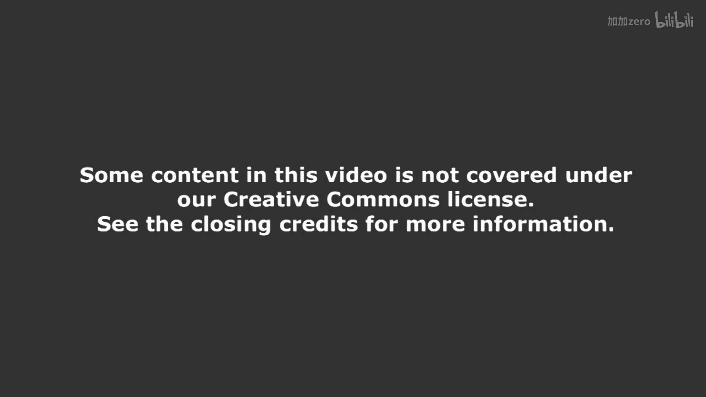
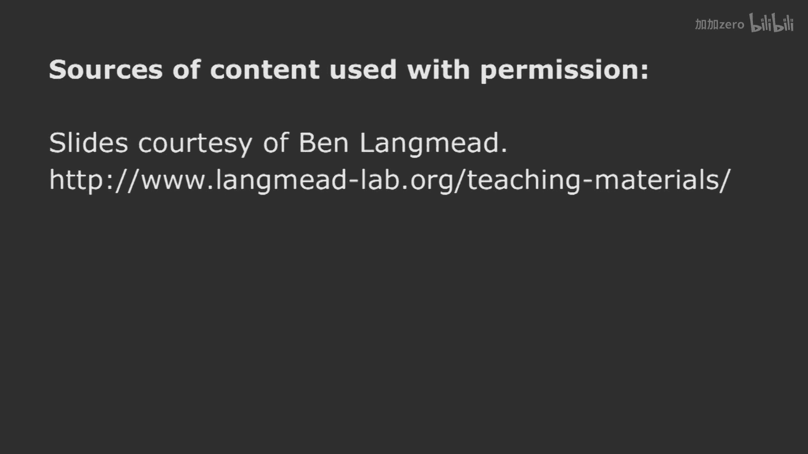

# 【计算与系统生物学基础 7.91J 2014】麻省理工—中英字幕 p05 p4 5. Library Complexity and Short Read Alignment (Mapping) -BV1HdzaYAE2a_p5-

The following content is provided under a creative Commons license。

 Your support will help M I T Open Coware continue to offer high quality educational resources for free。

To make a donation or view additional materials from hundreds of MIT courses。

 visit M T OpenCourseware at OCw。 MT。 Eduu。

Okay， so。Welcome back to computationalutal systems of Biology， I'm David Gifford。

 I'm delighted to be with you here today。And today we're going to be talking about a topic that hass central to modern high throughput biology。

 which is understanding how to do short read alignment， sometimes called read mapping。

Now it's very important to me that you understand what I'm about the site today。

 and so I'm hopeful that you'll be uninhibited to raise your hand and ask questions about the fine points in today's lecture if you do have any because I'd be totally delighted to answer any questions and we have enough time today that we can spend time looking at one aspect of this problem and understand it thoroughly and associated topic is the question of library complexity。

 how many people have heard to sequencing libraries before， let's see a show of hands。O。

100 people have heard of read alignment before read mapping。Okay， great， all right， fantastic。

Let's start with what we're going to be talking about today。

 We're going to first begin talking about what a sequencing library is and what we mean by library complexity。

Well then turn to what has been called a full text minute size index。

 sometimes called a burrows Weer transform index， a B， W T index， and F M index。

But this is at the center of most modern computational biology algorithms for processing high throughput sequencing data。

And then we'll turn how to use that type of index for read alignment。

So let's start now with what a sequencing library is。 Let's just say that you have a DNA sample。

 We'll be talking about various ways of producing said samples throughout the term。

 But we're going to assume that we have a bunch of different DNA molecules。And I'll。

Illustrate the different molecules here in different colors。

 And we have three different types of molecules here。 Some molecules are duplicated because。

 as you know， typically， we're preparing DNA from an experiment where there are many cells and we can get copies of DNA from those cells or the DNA could be amplified using PCR or some other technique。

So we have this。Of collection of molecules。 And to make a library， we're going to process it。

 And one of the things that we'll do when we process the library is we'll put sequencing adapters on。

 These are short DNA。Sequences that we put on to the end of the molecules to enable them to have defined sequences at the ends。

 which permit sequencing。Now， if somebody hands you a tube of DNA like this。

 or are a couple of questions you could ask， you could check the DNA concentration to find out how much DNA is there。

 you could run a gel to look at the size of the fragments that you're sequencing。

We'll be returning to that later， but these are typically called the insert sizes of the library that you're sequencing。

 the total length of the DNA， excluding the adapters。

But we could also ask questions about how complex this library is。

 because it's possible to run experiments where you produce libraries that are not very complex。

 where they don't have very many different types of molecules。

 And that typically is a failure of the experiment。

So an important part of quality control is characterizing the library complexity。Were。

We want to figure out here complexity is equal to 3。 There are three different types of molecules。

And we sample these molecules。And when we sample them， we get a bunch of DNA sequence reads。

Its typically the number of reads that we get。Is larger than the complexity of the library here we have。

A total of 12 different reads。And when we。Sequence a library。 We're sampling from it。

 And so the probability that we get any one particular molecule is going to be roughly speaking equal to one over C。

 right， which is the complexity。And thus， we could use the binomial distribution to figure out the likelihood that we had exactly four of these type1 molecules。

However， as n， this number of sequencing reads grows to be very large。

 typical numbers are 100 million different reads， the binomial becomes cumbersome to work with。

 and so we typically are going to characterize this cognitive selection process with a different kind of distribution。

So one idea is to use a Poisson where we say that the rate of sequencing is going to be an overea。

And we can。C。That here shown on the slide above is the same process where we have theligation of the adapters。

We have a library， and we have reads coming from the library。

We have a characterized library complexity here。 There are four different types of molecules。

And the modeling approach is that assuming that we have three different unique molecules。

 the probability that we'll get any one of them when we're doing the sequencing is one over C。

And if we do n sequencing reads， we could find out the probability that willll get a certain number of each type of molecule。

 Let's just stick with the first one to start， okay。Now。

 part of the challenge in analyzing sequencing data is that you don't see what you don't sequence。

So things that actually occur zero times in your sequencing data still may be present in the library。

And what we would like to do is from the observed sequencing data， estimate the library complexity。

So we have all the sequencing data。 We just don't know how many different molecules there are over here。

So one way to deal with this is to say that。Let us suppose that we make a histogram of the number of times we see distinct molecules。

And we're going to say that we can observe molecules that are sequenced。

Or appear L times up through R times。 So we actually can。

Create a version of the distribution that characterizes just a part of what we're seeing。

So if we do this。We can build a Poisson model。And we can estimate Lada from what we can observe。

We don't get to observe things。 We don't see。 So for sure。

 we know we can't observe the things that are sequenced zero times。

But for the things that are sequenced at least one time。We can build an estimate of Lada。

And from that estimate of lambmbda， we can build an estimate of C。So one way to look at this。Is that。

If we look at the total number of unique molecules that we sequence， which is equal to M。

Then the probability that we observe between L and R。Occurrences of a given individual sequence。

 time C is going to be equal to the total number of uniqueuic molecules that we observe。

Another way to look at this is the very bottom equation where we note that if we look at the total complexity of the library。

And we multiply it by1 minus the probability that we don't observe certain molecules。

That will give an estimate of the total number of unique molecules that we do see。And thus。

 we can manipulate that to come up with an estimate of the complexity。

Are there any questions about the details of this so far。Okay。

 so this is a very simple model for estimating the complexity of a library based upon looking at the distribution of reads that we actually observe for quality control purposes。

And let us suppose that we apply this。2000 genomes data。Which is public data on human。

And we so supposed we want to test whether this model works or not。

 So what we're going to do is we're going to estimate the library complexity from 10% of the sequencing reads。

 So we'll pick 10% of the reads of an individual at random。

We'll estimate the complexity of the library。And then we'll also take all of the reads from the individual and estimate the complexity。

And if our estimator is pretty good， we should get about the same number from 10% of the reads and from all the reads。

 But people go along with that。I think that seems reasonable。Okay， so we do that。

And this is what we get。And it's hard to see the diagonal line here， but there's a big oops here。

And the big oops is that。If we estimate the library complexity from just 10% of the reads。

 it's grossly underestimating the number of unique molecules we actually have。In fact。

 it's off by typically a factor of two or more。So for some reason。

 even though we're examining millions of reads in this subsample。

 we're not getting a good estimate of the complexity of the library。

Does anybody have any idea what could be going wrong here。

Why is it that this very simple model that is。Attempting to estimate how many different molecules we have here based upon what we observe。

Is。Broken。Any ideas at all？ And please say your name first。Chris， hi， Chris。

Is it because of repeated sequences， So there can be like a short sequence。

 like at the end of one molecule that's the beginning of another one middle。Chris。

 you're on the right track， okay， because what we assumed at the outset was that all of these molecules occur with equal probability。

Right， what would happen if， in fact。There are four copies of this purple one。

 and only two copies of the other molecules。Then the probability of sampling this one is going to be twice as high as the probability of sampling one of these。

And that。If there's non uniformity in the original population， that's going to。

Mess up our model big time。Right， and that could happen from repeated sequences or other kinds of duplicated things。

 or it could be that there's unequal amplification。

 It might be that PCR really loves a particular molecule， right and amplifies that one a lot。

 and doesn't amplify another one that's difficult to amplifying。

 So somewhere in our experimental protocol pipeline。 It could be that there's non-uniformity。

 And thus we're getting a skewness to our distribution here in our library。So。

The other thing that's true is that a Poisson Lada， which is equal to the mean。

 is also equal to the variance。And so our proton there's only one knob we could turn to fit the distribution。

So coming back to this， we talked about the idea that the library complexity still may be four。

 but but there may be different numbers of molecules of each type。And here's an idea for you。 right。

 The idea is this。Imagine that the top distributions are the number of each type of molecule that are present。

 right， And it might be that our original assumption was it was like the very top that。Typically。

 there are two copies of each molecule in the original sequencing library。

And it's a fairly tight distribution。But it could be， in fact。

 that the number of molecules of each type is very。Dispersed。

And so if we look at each one of those plots at the top， the first four， those are going to be。

Our guesses about the distribution of the。Number of copies of a molecule in the original library。

Okay。And we don't know what that is， right， That's something that we can't directly observe。

But imagine that we took that distribution and used it for Lambda。

In our Poisson distribution down below for sampling。

So we have one distribution over the number of each type of molecule we have。

We have the poisson for sampling from that。And we put those two together。And when we do that。

 we have the poisson distribution at the top。 The gamma distribution is what we'll use for representing the number of different species over here and their relative copy number。

And when we。Actually。Put those together。As shown， we wind up with what's called the negative binomial distribution。

Which is a more flexible distribution， has two parameters。

And that negative binomial distribution can be used once again， to estimate。Our library complexity。

And when we do so， we have lambda be the same。 But K is a new parameter。

 It measures sort of the variance or dispersion of this original sequencing library。

And then when we fit this negative binomial distribution to that thousand genomes data。

It's going to be hopefully better。Let's start with a smaller example。

If we have a library that's artificial with a known million unique molecules and we sub samplele give you 100000 reads。

 you can see that。With different dispersions here on the left。

 the K with different values from  point。1 to 20， the Poisson begins to grossly underestimate the complexity of the library as the dispersion gets larger。

 whereas the negative binomial， otherwise known as the G or gammo Poisson does a much better job。

 And furthermore， when we look at this。And。The context of the 0 genomes data。

 you can see when we fit this， how much better we are doing。

 Almost all those points are almost exactly on the line。

 which means you can take a small sampling run。And figure out from that sampling run how complex your library is。

And that allows us to， to tell something very important。

 which is what is the marginal value of extra sequencing。So， for example。

 somebody comes to you and they said， well， you know， I。

 I ran my experiment and all I could afford was 50 million reads。

 Do you think I should sequence more， Is there more information in my experimental。DNA preparation。

It's easy to tell now， right， because you can actually analyze the distribution of the reads that they got。

 and you can go back and you can estimate the marginal value of additional sequencing。

And the way that you do that。As you go back to the。Distribution that you fit。

This negative binomial and ask if you have R more reads。

 how many more unique molecules are you going to get？And。The answer is。

That you can see that if you imagine that this is an artificial data。

 But if you imagine it a complexity of 10 to the six molecules。

The number of sequencing reads is on the X axis。 The number of observedd。

 distinct molecules is on the y axis。And as you increase the sequencing depth。

 you get more and more back from the library。However。

 the important thing to note is that the more skewed the library is。The less benefit you get， right。

 so if you look at the various values of K， as K gets larger。

 the sort of the skewness of the library increases。

 and you can see that you get fewer unique molecules as you increase the sequencing depth。Now。

 I mention this to you because it's important to think in a principled way about analyzing sequencing data。

 is somebody drops 200 million reads on your desk and says， can you help me with these。It's。

 it's good to start with some fundamental questions， like just how complex is the original library。

 And do you think that these data are really good or not， okay。Furthermore。

 this is an introduction to the idea that certain kinds of very simplistic models。

 like Poisson models of sequencing data can be wrong because they're not adequately taking into account the over dispersion of the original sequencing count data。

Okay， so that's all there is about library complexity。Let's move on now， to。Questions of。

How to deal with these reads once we have them。So the， the fundamental challenge is this。

I hand you a genome， like human。Three times 10 to the ninth bases。This will be in。FastA format。

 let's say。I hand you reads。And this will be， well have say，200 base pairs times。嗯。

Two times 10 to the。8th。Different reads。And this will be in fast Q format。The Q means that there。

 its like fast， except there are quality scores associated with each particular base position。

And the Fred score。Which is typically used for these sorts of qualities is minus P。-10。Times。

Wg based 10 of the probability of an error。Alright。

 so a Fred score of 10 means that there's a one in 10 chance that the basis is an error of Freds score of 20 means it's a one in 100 and so forth。

Okay。And then the goal is， today。If I give you these data on a hard drive。

Your job would be to produce a Sam file。A sequence alignment and mapping file。

 which tells us where all these reads map in the genome。Okay。And more pictorially， the idea is that。

There are many different reasons why we want to do this mapping。 So one might be to do genotyping。

 You and I differ in our genomes by about one base in 1000。

So if I sequence your genome and I map it back or align it to the human reference genome。

 I'm going to find differences between your genome and the human reference genome。

 And you can see how this is done at the very top where we have the aligned reads and there's a G。

 let's say， and the sample DNA。 And there's a C in the reference。

But in order to figure out where the differences are， we have to take those short reads。

 It'll align them to the， to the genome。Another kind of experimental protocol uses DNA fragments that are representative of some kind of biological process。

So here， the DNA being produced are mapped back to the genome to look for areas of enrichment or what are sometimes called peaks。

And there we want to actually do exactly the same process。 But the post processing。

 once the alignment is complete， is different。So both of these。Share the goal of taking。

Hundreds of millions of short reads。And aligning them to the。To a very large genome。

And you heard about Smith Waterman from Professor Burge， and as you can tell。

 that really isn't going to work because it is its time complexity is not going to be admissible for hundreds of millions of reads。

So we need to come up with a different way of approaching this problem。So。

Finding this alignment is really a performance bottleneck for many computational biology problems today。

And。We have to talk a little bit about。What we mean by a good alignment。

Because we're going to assume， of course， fewer mispatches are better。

And we're going to try and align a high quality basiss as opposed to low quality bases。

And note that all we have in our input data are quality scores for the reads。

So we begin with an assumption that the genome is the truth。And when we are aligning。

 we are going to be more permissive of mismatches in read locations that have higher likelihood of being wrong。

Okay。So。Is everybody okay with the setup so far。 You understand what the problem is。Yes。

 all the way in the back row， my back row consultants， you're good on that。See。

 the back is always the people I call them for， for consulting advice， right， so。Yeah。

 you're all good back there。Good， I like that Good。 that's good。 I like that。 Okay， alright。

So now I'm going to talk to you about。One of the most amazing transforms I have seen。

 it's called the Burrows Wheeler transform。😊，And it is a transform that we will do to the original genome that allows us to do this look up very。

 very quickly。And it's worth understanding。So here's the basic idea behind the burrowough's wheelheer transform。

We take the original string that we want to use as our target that we're gonna look things up in。

 Okay， so this is going to be the dictionary we're looking things up in。

 It's going to be the genome sequence。And you can see the sequence on the left hand side， A， A， AC G。

 and the dollar sign represents the industry terminator。Okay。Now， here's what we're going to do。

 We take all possible。Rotations。Of this string。Okay。And we're going to sort them。

And the result of sorting all the rotations is shown in the next block of characters。

And you can see that the end of string character has the shortest sorting order。Followed by A， C。

 and G。And that all the strings are ordered lexically by all of their letters。Okay， so once again。

 we take the original input string。We do all of the possible rotations of it。

And then we sort them and wind up with this burrowsqueer matrix， as it's called the slide。Okay。

And we take the last column of that matrix。And that is the Burorough's wheelheeler transform。Now。

 you might say what on earth is going on here。Why would you want to take a string。

Or even an entire genome。 We actually do this on entire genomes， okay。

Consider all the rotations of it。 sortt them， and then take the last column of that matrix。

What could that be doing，Here' is a bit of intuition for you。 Okay。

 the intuition is that that burrows wheelheeler matrix is representing all of the suffixes of T。Okay。

 so all the red things are suffixes of tea。In the matrix。And when we are going to be matching a read。

 we're going be matching it from its end going towards the beginning of it。

 So we're gonna be matching suffixes of it。 And I'm going to show you a very neat way of using this transform to do matching very efficiently。

😊，But before I do that。I want you to observe that it's not complicated。 Okay。

 all we do is we take all the possible rotations and we sort them。

 and we come up with this transform。Yes。What are you sorting them based on？Okay。

 what was your name again， I'm Simona。 Simona。 What are we sorting them based upon。

 We're just sorting them alphabetically。So you can see that if dollar sign is the lowest alphabetical character that that those are actual。

 if you consider each one a word， that they're sorted alphabetically。Okay。

 so we have seven characters in each row， and we sort them alphabetically。Or lexically， right。

Good question。 Any other questions like that。 This is a great time to ask questions。

 because what's going to happen is that in about the next three minutes。

 if you lose your attention span for about 10 seconds， you're going to look up you can say。

 what just happened， O yes。😊，The suffixes of T。 Sure， let's talk about the suffixes of T R。

 They're all the things at N T。 So a suffix of T would be G。Or C， G or AC G or A A， G or C。

 A A C G or the entire string T。 Those are all of the endings of T。

 And if you look over on the right， you can see all the suffixes in red。

So one way to think about this is that it's sorting all of the suffixes of T in that matrix。

Because the rotations are exposing the suffixes。Right。Is what's going on。Does it make sense to you？

Okay。keep me honest here in a minute。 Okay， you'll help me out。 All right， Yes。

 can you written your name for。Ts， what is dollar size？Dollar sign is the end of string character。

 which has the lowest lexical sorting order。 Okay， so it's marking the end of T。 Okay。

 that's how we know that we're at the end of T。Right， good question， yes。Can you sort。Quest is。

 can you sort them non alphabetically， You can sort them anyway as long as it's consistent， okay。

But let's stick with alphabetical lexical order today。 It's really simple， and it's all you need。

 yes。Me just on the left。到 last。No no's all the of that they on the very far left， okay。

The white last column group， the last column in red。

 that is the burorrow's wheeleler transform red from top to bottom。Okay。

 and I know you're looking at that and saying， how could that possibly be useful。

 We've taken our genome。 We've shifted it all around。 We starteded it。 We take this last thing。

 It looks like junk to me， right， But you're going to find out that all of the information in the genome is contained in that last stringing in a very handy way。

 Hard to believe， but true。Hard to believe but true， yes。Prepare to be amazed， all right？

These are all great questions。 Any other questions of this sort。Okay， so。

I'm going to make a very important observation here that may。

 that is going to be crucial for your understanding。

 So I have reproduced the matrix down on this blackboard。 Okay， what。

That's usually there under that board， you know that。

You guys haven't checked this classroom before have you， No， it's always there。

It such a handy transform。So this is the same matrix as the matrix you see on the right。

And I'm gonna make a very， very important assertion right now。 Okay。

 the very important assertion is that。If you consider。That this is the first A in the last column。

That is the same textual occurrence in the string as the first a in the， the first column。

And if this is the second A and the last column， that's the same as the second A in the first column。

 And you're going to say， what does he mean by that， Okay， do the following thought experiment。

Look at the matrix， okay。And in your mind， shift it left and put all the characters on the right hand side。

Okay， when you do that， what will happen is that。This。

 these things will be used to sort the occurrences of a on the right hand side， right。Once again。

 if you shift this whole thing left and these pop over to the right。

Then the occurrence of these A's will be sorted by these。Rose。From here over。

But these are alphabetical， right。And therefore， they're going to sort an alphabetical order。

And therefore， these A's will sort in the same order here as they are over there。So， that means that。

When we do this rotation， that this textual occurrence of a will have the same rank in the first column and in the last column。

And you can see I've annotated the various。Bas here with their ranks。 This is the first G。

 the first C， the first end of line industry character， first A， second A， third A， second C。

 And correspondingly， I have the same annotations over here。 And thus the third A here。

Is the same lexical occurrence as the third A on the left。In the string， same text occurrence。Now。

 I'm going to let that sink in for a second。 And then when somebody asks a question。

 I'm going to explain it again because it's a little bit counterintuitive。 Okay。

 but the very important thing is if we think about textual occurrences of characters in that string T。

And we put them in this framework。That the。Rannk allows to identify identical textual occurrences of a character。

Okay， would somebody like to ask a question。 Yes， iss your name in the question， please。

 So in your original string， though， this won't correspond to the same order。In the transform stream。

So like the A's in the original string in their order。

 they don't correspond numerically to the transfer string， that's correct。Is that okay。

 the comment was that the order in the BWT， the transform is not the same as the order in the original string。

 And all I'm saying is that in this particular matrix form。

 that the order on the last column is the same as the order in the first column for a particular character。

 And furthermore， that these are actually textual occurrences， right。Now， if I look at a2， okay here。

We know that C comes after it then A then A and C And G， right。Right， okay， so。

Did that answer your question if they're not exactly the same。1% other。

I don' how you don't see how it's useful yet， okay。Okay。Well， maybe we better get to the useful part。

 and then you can。Okay， so let us suppose。That we want to， from this。

 reconstruct the original string。Does anybody have any ideas about how to do that？Okay。

 let me ask a different question。 If we look at this G1， right。

And then this is the same textual occurrence， right？

And we know that this G1 comes right before the end of character， the end of string terminator。

 right。So if we look at the first row， we always know what the last character was in the original string。

The last character。Is。G1， right？Fair enough。Okay， where does G would occur over here。Right over here。

 right？What's the character before G1。C，2。Where is C2 over here？What's the character before C2？A3。

What's the character before A3。A1。Oh。嗯。Let me just。Cheat a little bit here， A1。A3， C2， G1 sign。Okay。

 so we're at A1， right？What's the character for A1？C1， right？What's the character before C1？A 2。And。

What's the character for A2？That's the string。 Is that the original string that we had。Magic。Okay。

 yes。Would it be to look at？交た。Or do you need reconstruct from all？we're only using。This。

 this is all we have。 because I actually didn't use any of these characters。

I was only doing the matching so we could go to the right row。I didn't use any of this。And so。

But do people understand what's going on here， If anybody has any questions。

 now iss a great time to raise your hand and say， I oh， here we go。 We have a customer。

 See your name in the question， please。 My name is Eric。😊，Thank Eric。

 can you illustrate how you would do this without using any of？Elements to the left of the box。

Absolutely I'm so glad to have that question， that's the next thing we're going to talk about。😊，Okay。

 but before I get to there， I want to make sure， are you comfortable doing it with all the stuff on the left hand side。

 You， you're happy about that。Okay， if anyone was unhappy about that， should now be the time to say。

 I'm unhappy。 Help me。What are the details。Everybody's happy， yes。So。

You have your original string in the first place though。

 so why do you want to create another string of the same light？How does this help you match read？

How does help people have to read？And how does help youmetric raise the question， What was your name。

 Dan， That's right， Dan。That's a great question。 I'm so glad you asked it First。

 We'll get the Erics question， and then we'll get to yours。 Okay。

 because I know if I don't give you a good answer you're gonna be very mad， right。😊，Okay？Alright。

 let's talk about the question of how to do this without the other things。 Okay。

 so we're going to create something called the last to first function that maps。

A character in the last row column， I should say， to the first column， right。

 And there is the function right there。 It's called LF。 You give it a row number。

 The rows are0 origin。And you give it a character， and it tells you what the corresponding place is in the first column。

And it has two components。 The first is OCC， which tells you how many characters are smaller than that character lexically。

 So it tells you where， for example， the A start， the C start or the G start， right。So。In this case。

 for example， OCC of C is 4。 That is the C start at 0，1，2，3， the fourth row， okay。And then。

Count tells you the rank of c -1。So it's going to essentially count how many times C occurs before the C at the row you're pointing at。

In this case， the answer is a1 and you add one， and that gets you to 5， which is this row。 Okay。

 so this C 2 maps here to C 2， as we already discussed。

So this LF function is a way to map from the last row to the first row。Okay。

And we need to have two components。 We need to know OCC， which is very trivial to compute。

There are only five elements， one for each base and one for the end of。W termminator。

 which is actually 0。So it only needs to have four integers。And count。

 which is going to tell us the rank and the BWT transform。

 And we'll talk about how to do that presently。Okay， so did that answer your question。

 How to do this without the rest of the matrix here。St by。活。啊。How are you。使って。

How you would reconstruct it？You mean something like this。Is this what you're suggesting？

I get up feeling that the first column。doesnn't help us in understanding how the algorithm works only using the last column。

Okay， your comment， Eric， is that you feel like the last first column doesn't help us understand how the algorithm works only using the last column。

 right？Okay。Going back to the first college。Of data。ok 啊。Well， let's。Let's compute。嗯。

The LF function of。The character and the row for each one of these things， okay。

And that might help you。 Allright， because that's the central part of being able to reverse this transform。

 Okay， so this is to be more clear。I'll make it more explicit。 This is LF of I and B，W T of I。

Okay where I goes from 0 to 6。Alright， so what is that value for this one right here。

Andbody you know？Well， it would be OCC of G， which is。6， right？Plus， count of。啊。Of 6 and G。

Which is going to be zero。Or I could just look right over here and see that， in fact， it's6， right。

 because this occurrence of G1 is right here。So this L value is， it's 6。4。嗯。0， a 1 is in1。

 A 2 is in2， a 3 is in。3， C 2 is in 5。So this is the L function，6，4，0，1，2，3，5。

And I don't need any of this to compute it。Because。It simply is equal to going back one slide。

It's equal to OCC of C plus count， so it's going to be equal to where that particular character starts。

On the left hand side， and it's rank -1。And so these are the values for LF。

This is what I need to be able to take this string and recompute the original string。

If I can compute this， I don't need any of that。And to compute this， I need two things。 I need。OCC。

 and I need count。Allright， now I can tell you you're not quite completely satisfied yet。

So maybe you could ask me another question that would be very helpful to me。G1。那是。Okay。

 let's take that apart。We want to know what LF。Of。6， and where was that G1， The G1 is1 is 0， right。

 sorry， Allf of 1。And G is equal to， right？Is that g in 1 or 0？Ups starts in zero。

So this is what you'd like me to compute， right？Okay， what's OCC of G。

Its how many characters are less than G in the original string。嗯。I'll give you a clue。 1，2，3，4，5，6。

Since it's the first。Noe， how many characters are less than G in the original string。

 How many things are going to sort underneath it。 Where do the G's begin in the sorted version。

You get a road set。Okay。So OCC of G is6。Okay， is it？Are you getting hung up on that point？

know that without。Without ever referencing fact。First five。Because when we build the index。

 we remember。So we have to， I， I haven't told you this， but I need to compute。

 I need to remember ways to compute OCC and count really quickly。

OCC is represented by four values only。Therere where the A start， the C start。

 the T start and the G start。 That's all I need to know，4 integers。Okay。IA you happy with that？So。

 you know， OCC， the A started at1， the C started at4， and the G started at6。Okay。

 that's all I need to remember。But I pre computeute that。Okay， remember it。

Are you happy with that now， Okay， And then this business over here of。Count。Of0 and G， right？

Which is how many Gs， what's the rank of this G on the right hand side？One minus1 is zero。

That's zero。That's how we computed it， okay。These are great questions。

 because I think they're foundational。Yeah。TC and counts are both precomputd as your。考了。

They are precomputed。 And I have not told you， see you're。

 you're sort of ahead of things a little bit in that I'd hoped you suspend disbelief and that I could actually build these very efficiently。

 But， yes， they are built at the same time the index is built。 Okay， but yes。Okay。

 and if I have OCC account and I have the string， then I can get this。

 but I still need to get the dance question。 He's being very patient over there。

 He wants to know how I can use this to find。Sequence region a genome。

 And he's just being so good over there。 I really appreciate that。 Dan。 Thanks so much for that。😊。

you have e？Okay， you're good all right。And this is what we just did。

 The walk left algorithm actually inverts the BWT by using this function to walk left。

 And using that Python code up there， you can actually reconstruct the original string you started with。

 okay。So， it's just very simple。And we went through it on the board。嗯。

Are there any questions about it all？Yes。Actually do this for any column。

ButWhy are you using the last？Instead of like， why can't you just change it like the LCCC？考验。

The equation。Make it work， because the very important thing is that this is actually a very important property right。

 which is all the suffixes are sorted here。And if we didn't do that， though。

 I couldn't answer Dan's question。And he'd be very upset。 So wed be respectful of his， you know。

 interest here。 And the thing is that， you know， if I。

 the beauty of this is is that I have all these suffix asserted。

 And what you're about to see is the most amazing thing。

 which is that we're gonna snap our fingers and bang we can map 200 million readeds in no time at all。

😊，You like that？You're laughing， oh， that's not a good sign， it's not a good sign。All right， anyway。

 let's press ahead fearlessly okay and talk about how we're going to use this to map reads。

 So we're going to figure out how to use this index and this transform to rapidly align reads to a reference genome。

 And we're not talking about one read or 10 reads or a million reads。

 We're talking about hundreds of millions of reads。 it has to be very efficient indeed okay。

So here is the essential idea。There's the core algorithm on the slide。

Which is that what we do is we take the original。Query that we have。

 the read that we're trying to match。And we're going to process it backwards from the end of the read forwards。

And we begin by considering all possible suffixes from row 0 to， in this case， it would be row 7。

Okay， which is the length of the entire transform。And we iterate。And we。In each iteration。

 we consider suffixes。That match the query。 So in the first step right here。

 I me see if I can get my pointer working。We are。 So in the first step here， we match this C， okay。

And we compute the LF of the top， which is this row and of the bottom。

 which is down here pointing off the end。 And that takes us to the first C here and to this point。

Here are the two Cs that could be possible matches to our query， which ends in a C。We then say。Oh。

 the next character we have to match is an A。And so， we。Look here at the a， we need to match。

And starting from this row， which is row 4 and this row， which is row 6。

We compute the LF of each one of these to figure out what rows and A precedes this these Cs。Okay。

And the way we compute the LF is that we use the character A to be able to figure out which rows have the a proceeding to C。

And you can see when we compute those LF functions， what we wind up with。

Are these rows where we have A followed by C。So we're beginning to match the end of our read as we go from right to left。

We then compute the same thing once again， considering the first a and ask what rows。Okay。

What rows are going to allow us to put this A in front of the A C。To form。Our。Entire read。

 And we compute the LF once again。Of these things， and you can see that here。

 it takes us to this specific row。AAC。So， that suffix is。

That row represents a suffix that is matching our query exactly。Okay。So we iterate。

This loop to be able to match。A read against the index。And we're using the LF function to do it。

And it's a really beautiful algorithm。😊，And remember。We only have the transform。

 We don't have the rest of this matrix。So， but before I press ahead and talk about， you know。

 other details。I think it's important to observe a couple of things that are a little bit counterintuitive about this。

One counter intuitivetuitive aspect of it is that when I'm over here， for example。And for example。

 when I'm computing the LF here。I'm computing the LF of row 2， with respect to a。

But there's a dollar sign there。Right？So I'm using this to the L function to tell me where a。

Suffix would be。That actually follows my constraint of having to heaven an A be the prefix of A C。

 where I am right now。And this code is actually not fake code。

 It's the actual code that's in a matcher。For matching a。Read against the index。Now。

 let me just stop right here for a second and see if there are any other questions。

 Dan is getting now his answer to his question， right about how you actually use this for matching reads。

You do this once for every read， and it is。Linear time。Right， it's the length of the read itself。

 It all the time it takes to match in a huge genome。So once we've built the index of the genome。

 In fact， most of the time， when you're doing this sort of mapping， you don't build the index。

 You download the index off of a website。And so you don't have to pay for the time to build this index。

 You just download the index and you take your reads and the time to match all of your sequencing reads against a certain build of whatever genome you're using is simply linear in the number of bases you have。

Questions。Yes， and see your name in the question。How did Bros and wheelheer come up with intuition and kind of transform things like they just pulled out you know。

 I asked Mike that the other day？I saw him at a meeting。

 and hes sort of surprised at how this has taken off。And。He， he told me some other。

Interesting facts about this， which you probably could deduce， which is that。

If you only want to match reads that are four long。

 you only have to sort this matrix by the first four characters。

But there are little tricks you can play here。Any other questions， yes？Deborah。

 what is the FM index what is the FM index？Well， the guys who thought this up have the last initials of F and M。

 but that's not what it stands for， country of popular opinion。 It stands for full text， minute size。

It's what they claim。 So if you hear people talking about full text minute size indices or F M indices。

 the F M index is actually the part， the part that was being asked about over here。

 the OCC part and the LF part， how you actually compute those quickly。

That was what F And M contributed to this， but。Generically。

 when we're talking about this style of indexing， it's called F M indexing。

 or you might hear I'm using a BWT。 Some people will say that。But that's what FM stands for。Is that。

Answer your question， excellent，All right。And， these are all great questions， yes。えき？For the third。

あて？If you don't remember the rest。でさゃ。Oh， you don't know that A and C are there， except that。

Remember， all， if you look at。The way that this is working is that you're not actually reconstructing。

Strange， you're only trying to find them。Right， and so at the end， top and bottom。

 are' going point to the row that contains the suffix where your original read was。

 And now your next question is going to be， where is that in the genome， This doesn't do me any good？

 I mean， the number one doesn't help me out here。 Okay， it doesn't mean anything， right。Yeah。

 not good， right？So where is it in the genome， is the next question。So。We'll get to that in a second。

 What happens if， if you give me a read that doesn't match。Anywhere in this index。Well。

 if you give me a read that doesn't match anywhere in this index。

 what happens is the top and bottom become the same。So on top and bottom become the same。

 it's a failed lookup。All right。And。That's because the suffix doesn't exist in the index。

And once top and bottom become the same， they remain the same throughout that loop。Yes。

I'm Sally and Sally， my main question is that this doesn't provide any leway for。

have to be 100% sureriish。GreatSally， you're absolutely correct。 I'm so glad you asked that question。

 Your， your your observation is it does not provide any leeway from mismatches。

 And so unlike all the other algorithms we study， which have these very nice matrices and ability to assign weights to mismatches。

 this is only doing exact matching。 And so what you need help understanding is how we can deal with mismatches in the presence of this。

 And I would get to that in less than 10 minutes。 And。😊。

It won't be quite as elegant as what you saw from Professor Burge， But it's what everybody does。

 So that's my only excuse for it， okay。All right。Yes。What is the bottom set of arrows doing？

What's its significance Okay， the significance of top and bottom， That's a great question。

 what's its significance in top and bottom， top and bottom bracket in that original matrix。

 the suffixes that are matching the original query and so between top and bottom minus one are all of the rows that have a suffix that match our original query。

😊，And at top equals bottom， there are no matching suffixes， but assuming there are matching suffixes。

 those ares that contain a matching suffix。 And as we progress along a top and bottom change as the suffixes changes。

 we expand the suffix to contain more and more bases。Okay。ok。Any other questions？Okay， so。Now。

 back to the question over here， which is that， okay， I know that。We've matched。

 and I know that we have this hit。The question is， where is it in the genome？

Because the fact that it matched。Row one of my BWT matrix doesn't mean absolutely no good at all。

All right， anybody have any ideas about how we could figure out where it is in the genome？

Given what I've told you so far， which is that you have the BWT。You have OCC， and you have count。

 and you can compute the LF function。Any ideas。ItDoesn't matter how slow it is。Okay。Well。

 how could I figure out what came before A A C in the genome？ Yes， so like at the beginning。

 we rebuilt this whole string starting at the end。 You could rebuild the whole string starting at。

Like rebuild the whole genome starting at the alignment and see you could rebuild the entire genome that prepens or occurs before AAC。

 right exactly， so that's what we can do right we could actually do our walk left algorithm。

 We can walk left from there， find out that we go two steps until we hit dollar sign and therefore the offset is two where it occurs in the genome。

So we can give us give a match position by walking left。

I everybody see that that we can walk left to figure out where it is？It's not fast， but it works。

 yes。Hi Tim， so now our function。First has to take the。そ。And then the same。Wherever the physician is。

Its built into the end。Yeah， the speed of the function is now。Depenent upon position as well。

I that right， because the longer guys， I was， I've been a little bit b right because I said matches are not as linear time。

 Now， you're saying， hey， wait a minute， I want to know where it is in the genome。 That's。

 that's a big bonus， right， And so you like to know where that is。 Yes。

 but I still can do that in linear time。And we'll show you how to do that in a second。

 This is not linear time。 right， This， This actually。

 you needs to walk back order the length of genome for every single query。 That's not good， right。

Allright。Well， what we could do is we could store。What's called a suffix array with each row and say。

 where in the genome that position is。You know， where that row starts。And thered be a simple lookup。

 right， that when you actually have a hit in row 1， O， start to position two of the genome。

That and then， you know， the problem with that is that。嗯。It actually takes a lot of space。

And we want to have compact indices。So the trick is what we do is instead of storing that entire suffix array。

 we store every so many rows， like every 25 rows。 And all we do is we walk left until we hit a row that actually has the value。

 And then we add how many times we walk left plus the value。 And we know where we are in the genome。

 so we can sample the suffix array。And by sampling the suffix array， we cut down our storage。Hugely。

 and it's still pretty efficient because what we can do is we just walk left until we hit a sample suffix array location and then add the two numbers together。

All right。So。That's how it's done， okay。So that's how we actually do the。嗯。

Alignment and fear where things are。 The one thing I haven't told you about is how to compute count efficiently。

Now， remember what count does。Count as a function。But this is putting it all together where we're matching this query。

 We do the steps。 We get the match， then we do walk left once。

 and then we look at the suffix array to figure out where we are， right。Okay。嗯。

The business about count is that what we need to do is to figure out the rank of a particular。

Bace it a position in the transform。And one way to do that is to go backward to the whole transform counting how many Gs occur before this one。

And that's very expensive， right。To compute the rank of this particular G。 remember。

 the rank is simply the number of G's that occurred before this one in the BWT。Very simple metric。

So instead of doing that， what we can do is we can。

Build a data structure that every once in a while counts how many A Cs。

 Gs and T have occurred before now in the B， W T。And so we're going to sample this with these checkpoints。

And then when you want to compute， count at any point， you can go to the nearest checkpoint。

 wherever that is。And make an adjustment by counting the number of characters between you and that checkpoint。

Very straightforward， all right？So this， coming back to the question。It was Tim， right。asked。

 you need to build this checkpointing mechanism。 At the same time， you build the index。

 as well as the sampling of the suffix array。So a full index consists of the transform itself。

 which is the genome transformed into its B， W T。And they literally take the entire genome and do this。

 right， Typically， put dollar signs between the chromosomes。Right， so transform the whole thing。

 It takes a sampling of the suffix array we just saw， and it takes the checkpointing of。

 of the LF function to make a constant time。And that's what is inside of an F M index。Okay。Now。

It's small， which is one of the nice things compared to things like suffolix trees。

 suffix arrays or even other kinds of。Haash structures for looking for seeds。

 It really is not even twice the size of the genome。So it's a very compact index that is very。

 very efficient。And so it's a wonderful data structure for doing what we're doing。

 except we have not dealt with mismatches yet， right。😊，And so。Once again。

 I want to put a plug in for B W A， which is really a marvelous alignr。 And H。

 will'll talk about tomorrow and recitation if you want to know all of the details of what it actually takes to make this work in practice。

😊，Now。Re findes。Exact mismatches quickly， but doesn't really have any allowances for mismatches。

 And the way that bow tie and other aligners deal with this。

 and they're all pretty consistent is in the following way， which is that they do backtracking。

Here's the idea。You try and match something。Or match， a read。

And you get to a particular point in the read， and you can't go any further。 Top is equal to bottom。

So you know that there's no suffix in the genome that matches your query。So what do you do？Well。

 what you can do is you can try all of the different bases at that position。

 beside the one you tried to see whether it matches or not。 I can see this horror coming over people。

 Oh， no， not backtracking， Not that， but。Sometimes it actually works。

And just to give you an order of magnitude idea about how this works in practice。

 when reads don't match， they limit backtracking to about 125 times in these aligners。

So they tried pretty hard to actually match things。 And yes。

It is true that even with this backtracking， it's still a great approach。

And sometimes the first thing you try doesn't work。

And you have to backtrack trying multiple bases at that location until you get one that matches。

 and then you can proceed。Okay。And you eventually wind up with the alignment。

 you showed see in the lower right hand corner where you're substituting a G for an A。An A for a G。

 Ex me， to make it go forward。Do people understand the essential idea of。This idea of backtracking。

Okay。Does anybody have any comments or questions about it， you know， like you or ideas， yes。

What about gaps？嗯。BW A， I believe， processes gaps， but gaps are much。

 much less likely than missed bases。The other thing is that if you're doing a sequencing library。

And you have a read that actually has a gap in it。 It's probably the case。

 You have another read that doesn't。For the same sequence。

So it is less important to process gaps than is to process。Differences。

 the reason is that differences mean that it might be a difference of an allele。 right。

 In other words， it might be that your base is different than the reference genome。

Indlls are also possible。And there are different strategies of dealing with those。

 That would be a great question for hang tomorrow。About gaps。

 because he can tell you in practice what they do。 And we'll get to a little bit of that at the end of today's lecture。

 Yes， question。vy， Hi， Levy， how do you make sure you're backtrackping that you end up with the best possible match。

 you just go down first。How do you guarantee you wind with the best possible match？

The short answer is that you don't。There's a longer answer。

 which we're about to get to about how we try to approximate that and what。

Judgment you would use to get to what we would think is a practically good match。 Okay。

 but in terms of theoretically optimal， the answer is， it doesn't attempt to do that。

It's a good question， yes。Same time as。Comput the yes。

 so what's happening is you remember that loop where we're going around where we are doing where we're moving the top and bottom pointers。

 if you get to a point where they come together， then you would at that point begin backtracking and try different bases。

And if you look， I posted the B W A paper on the stellar website。

 And if you look at one of the figures， the algorithm is there。

 and you'll actually see if you can deconvolute what's going on that in inside the loop。

 it's actually doing exactly that， okay。Yes， question。In practice is the number of errors as small。

 when it makes sense just to use a slower pre course Ireland to find out best。Instead of using the。

We're gonna get to that I think the question was， if the number of errors is small。

 would it be good to actually use a different algorithm， D into a different algorithm。

 So there are algorithms on F M index assisted Smith Waterman， for example。

 where you get to the neighborhood by a fast technique。

 And then you do a full search using a more in depthth principle methodology， right。

 And so there are some papers I have in the slides here that are referenced that do exactly that。

 okay。😊，These are all great questions。Okay， yes。If if you only like decide to backtrack like certain number times at 100 times。

 then wouldn't like line be biased towards like the end of the short reads。

 I'm so glad you asked this question。 The question is， and what was your name again？Kevin。

 Kevin asks， ge， if you're matching from the right to the left and you're doing backtracking。

 isn't this going to be biased towards the right end of the read in some sense， right。

 Because if the right end of the read doesn't match， then you're going to give up right？ In fact。

 what we know is the left end of the read is the better end of the read。

 because sequences are done five prime to three prime。

 And thus typically the highest quality scores are the best quality scores are on the left hand side of the read。

Okay。So how would you， you have any idea about how you would cope with that？

You just reverse one of them， but you reverse the exactly what they do。

 they actually pick the entire genome， and they reverse it， and then they index that。

And so when they create what's called a mirror index， they just reverse the entire genome。

 And now you can match left to right， as opposed to right to left。Pretty cool huh？Yeah， so。Right。

 so backtracking。Just note that there are different alignments that can occur across different backtracking paths。

 and this is not optimal， in any sense。And to your question about how you actually go about picking a backtracking strategy。

With this assuming that we're matching from right to left again for a moment， what you can do is you。

 if you hit a。Mismatch， you backtrack to the lowest quality based position， according to Fred Scre。

 we talked about Fred Scs earlier， which are shown here on this slide。

And you backtrack there and you try a different base。 and then you move forward from there。

So you're assuming that the read， which is the query， which is associated quality scores。

 is most suspect where the quality score is the lowest。

So you backtrack to the right to the leftmost lowest quality score。Now。It's a very simple approach。

 right， And we talked a little bit about the idea that。

You don't necessarily want to match from the right side。

 and thus typically the parameters to algorithms like this include how many mismatches are allowed in the first L bases on the left end。

 some of the mismatched qualities you're going to tolerate and so forth。

 And you'll find that these aligns have a lot of switches that you can set。

And you can consult with your colleagues about how to set switches because it depends upon the particular type of data you're aligning。

 the length of the reads and so forth。But suff to say。When you're doing this。Typically。

 we create these mirror indices that actually reverse the our entire genome and then index it。

So we can match either right to left or left to right。And so， for example。

 if you have a mirror index， then， and you only tolerate up to two errors， right。

 then you know that either you're going to get the first half right in one index or the mirror index。

Right， and so you can use both indices in parallel。

 the forward and the reverse index of the genome and and then get pretty far into the read before you have to start backtracking。

So are all these sorts of techniques， shall we say。

 to actually overcome some of the limitations of backtracking。

Any questions about backtracking at all？Yes。Trivial knowing that VWT originally took find me。No。

 it's not trivial。すご面。No， and that's my knowledge， I think you start with the original genome。

 you reverse it， and then you compute the BW T of that。 right， That's pretty easy to do。

And Han was explained to me today how you compute his new ways of computing the B W T。

 which don't actually involve sorting the entire thing。

 There there are insertion ways of computing the B W T。 They are very。Deat。

 and you could ask him this question tomorrow if you care to come。All right。

 just to give you an idea how complex things are to build an index like this。

Takes for the entire human genome。 We're talking， you know。

5 hours of compute time to compute an index to give you an order of magnitude time for how to compute the。

 the B W T， the LF checkpoints and the suffix array sampling。 right， something like that。

 So it's really not too bad to compute the index of the entire genome。嗯。And to do searches。You know。

 we're talking about like on a four processor machine。

 We're talking about maybe upwards of 100 million reads per hour to map。

So if you have 200 million reads and you want to map them to a genome or align them as it's sometimes called。

 right。It's going to take you a couple hours to do it。

So this is sort of the order of magnitude of the time required to do these sorts of functions。

And there are a couple of fine points I want to end with today。The first is。

 we haven't talked at all about paired error and read alignment， right。嗯。And。

Inaired red alignmentignment， you get for each molecule， you get two reads。

1 starting at the five prime end on one side and one starting from the five prime end on the other side。

So typical read lengths might be 100 base pairs on the left and 100 base pairs on the right。

What is called the insert size is the total size of the molecule from 5 prime n to5 prime end read。

And the stuff in the middle， we've's not observed。 We actually don't know what it is。

And we also don't know how long it is。Now， when these libraries are prepared， size selection is done。

 So we get a rough idea of what it should be。 We can actually compute by looking at where things align on the genome。

 what it actually is。But we don't know， absolutely。

If we were able to strictly control the length of the unobserved part。

 which is almost impossible to do， then we would get molecular rulers。

And we would know exactly down to the base whether or not there were indlls between the left read and the right read when we did the alignment。

 But we actually don't have that today。The squeency instrument actually identifies the read pairs in its output。

 That's the only way to do this。 So when you get an output file like a fastQ file from a sequencing instrument。

 it will tell you for a given molecule。 Here's the left read and here's the right read。

Although left and right， really are sort of misnomers because there really is no left and right。

 right， It's this is one end， and this is the other end。嗯。

Typical ways of processing these paired reads。 you first， you align the left and right reads。

And they can really only be oriented with respect to a genome sequence where you say that one has a lower coordinate than the other one when you're actually doing the alignment。

And if one read fails to align uniquely， then what you can do is you know what neighborhood you're in。

Because， you know， roughly speaking what the insert size is。

 So you can do Smith Waterman to actually try and locate the other re in that neighborhood。

Or you can tolerate multily map breeds。 One thing that I did not mention to you explicitly is that when you match the entire query and top and bottom are more than one away from each other。

 That means you've got many places in the genome that things map。And thus。

 you may report all of those locations where you might report the first one。Okay。

So that's one bit of insight into how to do with map paired reads。

And these are becoming very important because as sequencing costs go down。

 people are doing more and more par in sequencing。Because they give you much more information about the original library you created。

And for certain protocols can allow you to localize events in the genome far more accurately。Okay。

Final piece of advice on considerations for realignment。

We talked about the idea that some breeds will map or align uniquely to the genome。

 and some will multimap。You know that the genome is roughly 50% repeat sequence。And thus。

 it's likely that if you have a particular read or molecule。

 its is a reasonable chance that it will map to multiple locations。 Is there a question here。 No。

 okay。You have to fear well your desired mismatch tolerance is when you're doing these you're doing alignment and set the parameters your aligner carefully after reading the documentation thoroughly。

 because as you can tell， there's no beautiful matrix formulation like there is with a well establishedlish basis in the literature rather it's more ad hoc。

And you need to figure out what the desired processing is for paired reads。Okay。

 so what we've talked about today is we started off talking about library complexity and the idea that when we get bunch of reads from a sequencer。

 we can use that collection of reads to estimate the complexity of our original library and whether or not something went wrong in the biological processing that we were doing。

 As it's a good set of reads。 We need to figure out where they align to the genome。

So we talked about this idea of creating a full text minute size index。

 which involves a burorrow's wheelheer transform。 And we saw how we can compute that and throw away almost everything else。

 except for the B W T itself。The suffix array checkpoints and the FM index checkpoints to be able to reconstruct this at a relatively modest increase in size over the genome itself and do this very。

 very rapid matching， albeit with more problematic matching of mismatches。

And then we turned to the question of how to deal with those mismatches with backtracking and some fine points on paradigm alignment。

So that is the end of today's lecture。

On Tuesday of next week， we'll talk about。How to actually construct a reference genome。

 which is a really deep thing to be able to do。 Lets take a whole bunch of reads。

Put the puzzle back together， again。I would encourage you to make sure you understand how this indexing strategy works。

 Look， look at the slides。 Feel free to ask any of us。 Thanks so much for your attention。

 Welcome back。 Have a great weekend。 We'll see you next Tuesday。😊。

