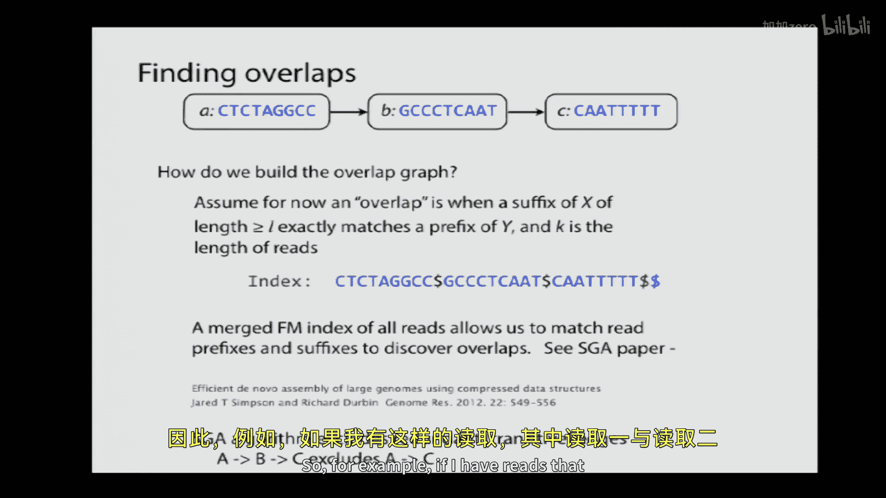
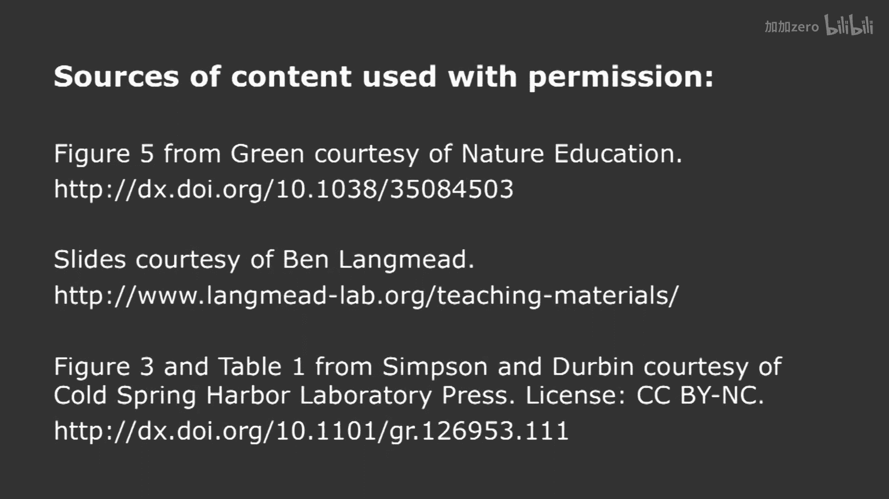

# 【计算与系统生物学基础 7.91J 2014】麻省理工—中英字幕 p06 p5 6. Genome Assembly -BV1HdzaYAE2a_p6-

The following content is provided under a creative Commons license。

 Your support will help M I T Open Coware continue to offer high quality educational resources for free。

To make a donation or view additional materials from hundreds of MIT courses。

 visit M T OpenCourseware at OCw。 MT。 Eduu。

Well， welcome back to。Computational assistance biology。

We're back here today talking about genome assembly。 How many people have。

Ever assembled a genome before。In your spare time， anybody， done any genome as symbol here？

One person。I think genome assembly is a fascinating topic。 And as you know， it's at the bedrock。

Of all modern biology， we rely upon genome references for almost everything in terms of studying evolution。

 looking at the structure of genes。Regulation of genes。Diffences between individuals。

 So it's really a very fundamental。Concept。And we're going to talk today about two different ways of assembling genomes。

 And I think one of the takeaway messages from today's lecture is going to be that。

Genome assembly is more of an art in some sense than a science。

And one has to always be a little bit suspicious of a genome assembly。

 Give them what you're about to learn today。And， of course， the genome assembly is becoming。

Even more complex because it used to be that assembling the human genome。Was。

The big tasks scientifically in front of the community。

 But now there are billions of genomes waiting to be sequenced。 all the individuals and。

 in the world。 and to try and interpret them。 And now you can get your genome sequenced for between 5 and $10000。

 How many people here are tempted to get their genome sequenced。Okay， I see about five hands，6 ans。

 Great。 So let's look at。The science beyond genome assembly。The。

 the basic concept is that we're going to collect collection sequence reads from the genome。

And we're going to assemble them to what are called。Contexts for contiguous segments。

And these represent uninterrupted portions of the genome that are completely covered by reads that we believe are contiguous。

These contexts， then， will be。Paired together in scaffolds。 and scaffolds are like cons。

 except that there are missing parts between the contexts in a scaffold。

 If we don't know what those parts are。But we're able to actually glue them together by using read pairs that allow us to jump over the missing parts。

 because we have read both ends of a molecule， but we don't know what's in the middle。

And then oftentimes， we had physical mapping technologies where we actually can go back and assign location scaffolds to physical locations on chromosomes by using。

PCR sequences。Like sequence tag sites that physically locate a particular。

Sequence identity to a physical location on a particular chromosome。

And that provides us with a total genome map。So today。

 we're going to be talking about how to go from a hard drive full of sequence reads all the way down to a set of scaffolds that include assembled contgs。

And。The way to think about this once again is that we start with a conceptually a single copy of the genome。

 We amplify this。And in order to sequence it on contemporary instruments。We have to fragment it。 Now。

 for those of you who were in last Friday's recitation。

 you heard Heng Li talking about the idea that sequence reads are getting longer。 In fact。

 sequence reads up to 10 to 15 kilobs are now possible。

And sequence reads even longer than that are going to be possible。

 which will greatly simplify the assembly process。 But for now。

 we're gonna be talking about the challenge of assembling short reads。

 say 10 base pair reads off of contemporary sequencing instruments。So， we take the。Fragmented reads。

 And the notion is that we know that they're going to align up like a puzzle。

And all we have to do is linening the reeds up to recover。The red sequence at the bottom。

 the original genome sequence。And I should add that many of the illustrations in today's lecture from Ben Lach mean。

 he was kind enough to allow me to use him for today's talk。So， the goal is to。

Come up with that red sequence at the bottom from the original set of reads。 But， of course。

 the read set that we're talking about。Is perhaps 200 million reads or even a billion reads。

 as we'll see。And so it's quite a tough task to pieces together， given that。

We really don't know where they came from。 And we don't know where they align because we don't have the red part to guide us。

Now， today， we're gonna be talking about what's called de novo assembly。

 That means starting from scratch。You hand me your set of readeds for your favorite organism。

 And we're going to assemble it today。That's different than what's called reference guided assembly。

Because， for example， if you're going to re sequence me or you， there is a reference human genome。

 and it would be a simple matter to take the reads from you or I and map them back onto the reference genome as a guide to trying to reassemble our genomes。

However， as you can tell， if there's a large structural variation between the reference genome and our genomes。

 that process can fail。So we're going to be talking today about de Novo assemblyly。And。

In the process of de novo assembly， oftentimes， we talk about coverage， which is， on average。

 how many sequencing bases do we have for every base of the genome Here we have for this little illustrative example。

Coverage of about 7 x。Now， at the origin of the human genome Project。

 some calculations were done about how much coverage were required to cover the human genome。

And we talked last time。About。Library complexity。 This is a slightly different idea。

 which is we want to estimate the probability of the base is uncovered。

So if we have the genome size as G in the number of read is M and L is a length of a read。

 then n times L is the total number of bases that we have。

And that divided by the genome is the average coverage of a base。

And the probability of the base is not covered。Is。The probability we're going to observe zero reads for that base。

Which is E to the minus lambda， roughly speaking， if we use a plusisson approximation。And therefore。

 the number of uncovered bases that we'll have is going to be roughly G times E to the minus lambda。

The next calculation can be thought intuitively as the following way。

 which is that if we have n reads。If there's going to be a gap after a read。

 there has to be an uncovered base after it。And so the number of gaps we're going to have in our assembly is roughly E n times E to the minus lambda。

So this is the back of the envelopealt calculation。And now。

 if we take some of our thousand genomes data， which we've previously used and ask how well this approximation works。

We see。Something like this where the X axis is the total number of reads and the genome coverage and bases is shown on the Y axis。

 and these are all different sequencing experiments。So。You can see the， the roughly green outline。

 which follows。Approximately what we saw before in this lenderer Waterman rule。

Could somebody tell me that they thing is going on with the red line that actually don't match up with that green line。

Any have any ideas about why。We need more reads out of those libraries to get。Better coverage。Yes。

 Yeah， there's probably skew in the original libraries we talked about last time that， in fact。

We talked about last time why the Poisson was not a great approximation for looking at libraries。

 and， in fact， we might want to fit something like a negative binomial in this particular case。Okay。

So we've got our readet。And we can also talk about coverage at a particular base。

 which is different than average coverage， just to be clear that there are two different kinds of coverage that one can think about。

Here we see coverage it。And that T。Of the level 6。And。

The other thing that we need to be cognizant of is that。There are two reasons that we might。

 two common reasons why we might actually see reads that overlap， but though agree at all positions。

The obvious reason is that there's an error in one of the reads。 We get quality scores and so forth。

 and that can help us decide which is the truth。 But the other possibility is that， as you know。

 you have one。Of each of your chromosomes from your mom and one from your dad。

And there could be allelic differences between this chromosomes。 So we're doing assembly。Oftentimes。

 we'll find that these allleic differences are going to pop up in terms of9 concordance of our reads。

And we'll have to ultimately decide if we want to make a single diploid approximation of a human genome。

Or we want to attempt to assemble。A diploid genome。And if we're going to。

Do a diploid genome that we have to be quite careful and use somewhat different assembly techniques。

But the common reference genome is happloid。 It's only considering one。Chroosomal sequence。

Is that clear to everybody？Okay， great。So。We're going talk about two general approaches to assembly today。

 We're gonna talk about overlap layout consensus assembblers as exemplified by a string graph assembler。

And we're also going to talk about de Bru graph assembbllerers today。Now， overlap consensus。嗯。

Assembbls were the first ones that were used in the human Genome Project。

 because reads were longer back then。However， as the number of reads has increased。

 those assmblies are are more difficult to utilize。

 in part because of the need to find overlaps between the read， as we'll see in a moment。

Whereas the brain graph assembers are somewhat more efficient。

But they lose certain kinds of information。So let's begin with these overlap。

Layout consensus assembblaries。And。We're going talk about three steps to build contgs。

 and the scaffolding step can be thought of a similar between either the overlap play consensus assembblers or a deb graph based assembblers。

So when first build an overlap graph。 What's an overlap graph。

The essential idea is that when we take our collection of reads。

 we look for overlaps between the suffix of one read and the prefix of another read。

And if we think of all of our reads， we want to build a graph that describes all of such overlaps。

And just to be clear， I'm not going to be talking today about the reverse complement of these reads。

Actual assmblies have to represent that。But it just duplicates all the nodes and edges。

 So we're gonna try and keep things uncluttered by， oh， that's okay。 Thank you。 We're going to。

Try and keep things uncluttered by that， considering those today。Okay。没有。

One of the challenges is how to construct those overlaps。

 And we're going to be talking about graphs a lot。 So I thought it was worthwhile just to review terminology。

 We're going represent overlap graphs as directed graphs， which consists of a set of vertices。

 which are the objects represented by the circles and the edges， which are the lines。

 and a directed edge goes from one vertex to another。

And there is also an equivalent representation in notational form on the on the lower part of the right of the slide。

 as well as a graphical representation。 We're gonna be using graphical representations of these directed graph today。

Okay。So the overlap graph is simply a representation of the overlap between reads。

And we pick a minimum length of overlap at times。But， for our。For the next few slides。

 I'm simply going to represent each node。As an individual read and the edges will be annotated with the amount of overlap between the reads。

So if I hand you a set of reads， all you need to do is compute this overlap graph。

 We'll talk about how to do that in a moment。And you'll see graphically then what comes out of the process of computing the overlap graph。

Now。It's possible that overlap graphs are cyclic。Because there are circular chromosomes。

And as we'll see， it's also possible to get a cyclic graph out of a linear chromosome。 If， in fact。

 there are repetitive structures in the chromosome that cause a graft to cycle back on itself。So。

How to find overlaps in efficient time is a key problem。

 And that's one of the reasons that people have shied away from using these types of assemmbblers is because the cost of computing overlaps has been thought to be n squared。

 where N is the number of reads， because you have to compare all the reads to one another。However。

 a really clever algorithm。Was devised。That used the technology we talked about last time。

You recall the idea of the F M index and burough's wheelheeler transforms allowed us to index。

A genome。 And then do。Look up of reads in turn proportional to the length of the read。

So here's the essential idea。 What we're going to do is we're going to take all of the reads。

That we collect。And we're going to index them。Okay。And we can do that roughly at end log N time。

And after we had indexed all of the reads。Then we can use that same index to find overlaps very。

 very efficiently。And you can conceptualize this as simply looking at a read that you have in your hand and looking it up in the index。

 And you'll find all the places that the suffix or prefix of that read matcheses。

And you can trace back to， youll find all the places it matches where they hit an end of a read。

And those all correspond to edges in the graph。And it turns out that this is so clever that it eliminates redundant edges。

So， for example， if I have。

Reads it look like this， where I have。I have read 1 overlaps with read 2， which overlaps with read 3。

And read 1 and read 3， also overlap。A。Unreduced graph would have a representation like this。

But it turns out that。We don't have to do that because we can simply reduce。Our graph to this。

Because we know that read 1 and read 3。 Actually， this is the。

 this is the graph that we would have to be unreuced。

We can reduce the graph to eliminate this transitive edge。And。Simply represented in this fashion。

So when we use these indices， we eliminate these transitive edges， as we'll see momentarily。

So here is an example graph。The sequence is shown on the bottom。The readlinks are of。

Length seven bases。And we're going to consider all overlaps of minimum size 3。

And the edge label is the actual length of the overlap between the reads。And you can see that。

At the outset that these overlap graphs are not necessarily simple。

That tracing a path of the graph that represents the original string。

Is not completely and totally straightforward。 So we need to come up with a way to articulate our metrics for how to trace a path through the graph to reconstruct a genome。

And that comes to the question of layout。Which is， how do we formulate the problem of tracing a path through。

A overlap graph。So we'll first start with the idea of shortest common super string。

The shortest shortest common super string of a string S is the shortest string that contains all the strings in S as substrs。

For a particular length of substream。So。For example。If we didn't have the constraint of shortest。

Then just finding a string that contains all the upstreams is easy。 Just put them all together。

But if we want the shortest。Then， we need to。B。啊。More thoughtful in terms of the way that we compute this shortest common substr。

 And here is an example of the shortest common substr for the substrs that I have shown you up there。

Okay。So one way to think about the assembly problem is that we're trying to compute the shortest common substring of all of the reads that we have。

And that will be the most efficient representation of those reads in a linear sequence。Now。

We can describe this problem in terms of an overlap graph。

And if you think about the way that we would solve this in overlap graph， I the shortest strings。

 we want the maximum amount of overlap。So we want to trace a path。Through the overlap graph。

 that gives us the largest amount of overlap， which gives us the shortest string， right。

 So if we simply negate the overlaps。We want to minimize。Total cost to the graph。 Now。

 it turns out that this problem is known to be a very hard computational problem。

 It's in the class of something called N hard because it's known as the traveling salesman problem。

And when you think about the fact that we're going to have hundreds of millions of reves。

This is we're not really going to be tractable。If we got rid of the weights and we simply wanted to find a path through the graph。

 that's called the Hamiltonian Pa problem。 That's also MP complete。

So the shortest common substr is a way to think about。Asmbly。

 but we can't really necessarily optimize metrics because it's going to be intractable。So。Well。

 think about ways of doing this that are greedier。 So here's an example of how we would compute the shortest common sub string。

 starting with the first ring。 And each step along the way is a concatenation of strings or a collapsing of strings that。

Works towards building the shortest common substratestream。And。

We get the input string and the output string。 So we could articulate our assembly problem as。

A greedy S S algorithm to try and put all the reads together to come up with a super string。And。

Let me just describe to you。嗯。The， this will give us an intuition into what goes wrong with assembly in a moment。

But we do know that there are some bounds on this， that if we actually did the greedy algorithm。

 then the assembly that we got would be only two and a half times longer than the true shortest common sub string。

That isn't really very much comfort to us。So we're going to have to come up with different more heuristic ways of approaching the assembly problem。

A。Here is another example。 This is the one that I want to show you。Where we start with。

A string at the top where we're gonna to be looking for minimum overlaps of， of 3。

And these are reads of six long。And when we do this greedy algorithm。

We come up with a string which is shorter than the original beginning string we started with。

Can somebody see what happened here？ Why are we missing part of the original string。Yes， the reads。

Or short enough。Reed。That we never found out that it was of the link that it actually was。

 and so we just kind of。Right so the point was that the reads were too short。

Be able to unambiguously identify the number of repeats of long that we had in the original sequence。

That's absolutely correct。 So we were not able to disambiguate what was going on。

And perhaps if we went back to our graph formalism， we could solve this problem， right。

 because here we have our graph and the overlaps are written in on the edges of the number of bases that each one of these reads overlaps。

 And all we need to do is to trace through this graph to find the original string。So。

Here is one tracing。Which gives a total overlap of 39。

 which actually faithfully reproduces the original string。Right。However， that's not the best tracing。

A better tracing view this graph or a path through the graph。Would be this。

Which gives us more overlap and gives us a shorter string。 But as we know。

 even though it's better according to this metric， it isn't really optimum because it gives us the wrong answer。

It's better but wrong。So we're going to have to take into account other things when we do our assembly and our tracing of this graph。

To be able to come up with the best possible assembly。So。If we increase the。The read length。

 as was pointed out， to span appropriately， we will be able to reconstruct the original sequence。

And the， the point of this example is that we need to consider this when we're thinking about recovery repeat structures in genomes。

So， if we。Don't have long enough reads。In this case。Reads of， of length 8。

We're not going to be able to recover the original repeat structure。And。If we look at this。

Repeats are really the bane of assemblers in some sense。 And as you know。

 roughly 50% of the human genome is repetative content。So we need to be very。

 very careful in terms of the way that we utilize reads to be able to recover。

The best approximation of our genome sequence。So here is another example。Where we look at。

L is a minimum overlap length， and K is the length of the reads。

And you can see the sequence that we're trying to recover。 It was the best of times。

 It was the worst of times。And the output from our greedy S E， S asmbler。 And as you can see。

 we need to get up to a read length of 13。Characters for us to be able to properly assemble that original sentence。

Okay。So the essential message here is that unless you have reads that are long enough to span repeats。

You're not going to be able to recover the original sequence。Exactly。And。

This can be also thought of in the following example。

Imagine that you have repeats that are tandem repeats out at the end of a sequence。

 And we're using English language here， because。It's easier to see than if I put up a bunch of genomic sequence。

 But of course， the principles are the same。嗯。You can see that unless we have reads that actually are anchored in unique sequence and span out towards a repetto sequence。

 we can't really tell how many times those。The word bells is repeated。

The other possibility is that we can actually come in from both sides。

And if we anchor our reads in unique sequence on both on the left and the right side of ouretitive element。

Then we can， then we can figure out how many copies of something like Belllls as present。

But in the absence of that， we really can't do it。 In fact。

 we wind up with a structure that looks like this。 We wind up with。嗯。

There it is a structure where we have。 Let's just say that there are。

4 different stretches of genome in disparate parts of chromosomes。

 And we will repeat sequence in the middle。The blue。Parts of the chromosomes are a unique sequence。

 and the rib parts are repeto sequences。What will happen is that if the reads aren't long enough。

We'll be able to find out in each one of the four locations that we've gone from unique sequence to repeat sequence。

😊，And then we will get lost in the middle of this identical， repeated sequence。

And then on the right hand side， we'll once again transition back from repeated sequence to unique sequence。

 But we won't know how to put things together in the middle。Right。

We won't be able to figure out what the path is through these repetative elements。Okay。

 so that's the essential。Point I'd like to make about rubber repeats。

And we can now turn to the question of layout and how to to process an overlap graph towards making context。

 This is the actual layout graph。When we think about that。

 that sentence up there and we say the minimum overlap length is four characters。

 and we have seven character reads out of the sequence。You can see it's a。It's a pretty messy graph。

If we clean up the graph by removing the redundant edges， right， the edges like this that span。

Overreads and are implied by other reads。We can remove。

Edges that are transitive over one read or two reads now。This。

My presentation is going talk about how to remove these edges。 However， as I said at the outset。

 if you use the algorithm by Simpson at all， you actually don't generate these transitive edges in the first place。

But assuming that you didn't use an algorithm and you did generate them。

 you want to get rid of these transitive edges like so。And。

It starts getting somewhat simpler as you begin simplifying the graph。

 removing these transitive edges。And then we can remove edges that skip two nodes。

So here's what happens after you remove the single transit of edges in this graph， yes。

It's seems that the transitive infer evidence give us a little bit more information about the genome。

 do we lose some like useful ordering principles by？They provide redundant information。

 they don't really provide any additional information。

 it's the same linear sequence that's implied by those edges。Any other questions？Okay。

So we can then remove edges that span two nodes， and we get an even simpler graph like this。Now。

 this is beginning to look more tractable， right， because we can。Look at this。

 and we can output contgs that correspond to linear portions of the graph。

 which should be linear sequence。 And when we do that。But we wind up with。Are two contgs。

And there's just a bit of problem in the middle， which is that we're unable to resolve the bit in the middle。

 and as a consequence， we know that that is the number of turns that are in that original sentence。

Because we didn't have a read long enough to be able to resolve that。

The other problem that we can have in doing this kind of layout is that when there are portions of the genome that occur or sequences in the genome occur multiple times。

When we actually do this layout。We may find that the portions of the genome that occur in two disparate locations line up with one another。

And it may be that as you exit the portion that chair， you get a mismatch base。

So that mispatch could be because you have disparate parts of the genome that actually have a very similar sequence。

Or it could be that you had to read error。At the end of your read。

And it's difficult to tell the two apart， except by the amount of coverage that you have。

We'll talk about how to prune graphs like this in a few moments。But in any event。

 assuming that we have pruned the graph。 we've done our overlap。 We've done our layout。

 We' found our past to the graph for our contgs。 And then what we find is that for each con。

 we have many reads。And we're going to take those reads， and we're going to look at them。

 And as you recall， we could either have errors causing a disagreement among the reads。

 We could have allluic differences between mom and dad causing those errors。

 not really errors differences。 and then we can take a consensus to come up with what the haploid genome is。

Okay， so that's the essential idea。Of a overlap layout consensus assembler。

 We compute the overlap graph。We， during the layout phase， we actually simplify the graph。

 and we find pass through it。 And during the consensus phase， we take our reads， and we。

Build a consensus sequence of the genome。And。As I said， this graph building can be slow。

 although we'll talk about how slow it is here in just a moment and。

The challenge is that modern sequencing dataset sets are hundreds of millions of reads。

So let's talk about a contemporary overlap based asler。 something called the string graph asmbler。

Which is done over at the sanger in the UK。 And there are three separate steps that goes through。

 The first step is it tries to correct reads。And the way it does this is it actually looks at。

All the cames that occur in Reeds。 It tries to find sequences that are very。

 very rare and find sequences that are nearby in sequence space that aren't as rare。

And it can correct bases that it believes are sequencing errors。The next step is assembly。

 once it has taken all these read and corrected them， it indexes all the regions I suggested earlier。

 using an FM index。And then it can find the overlap from that FM index directly。

And part of the assembly process is throwing away duplicate reads and throwing away reads that have low quality scores。

So that's the filtering step。It then， has the。Set of contextgs that it has generated。

And it does something quite interesting to find the scaffolds is that it takes the contexts it's assembled。

In terms of linear sequence， and it completely reines them once again， using an F M index。

And then it takes all of the reads that you started with。 It maps them back onto the context。

And by mapping the paired reads back onto the contgs。

 it can actually figure out what contgs should be formed into scaffolds where there are holes that are breached by these longer reads。

So it's using the F M index both for correction to find out nearby cameras。

For assembly to find overlaps and for scaffolding to put things together。

 And it does this indexing three different times。And just to give you an idea how long it takes for a human sized genome。

It's actually。You know， quite expensive， I would say， in terms of CPU time。

 it takes many days of e lapse time to assemble an entire human genome contemporary right now。

 and it's。You know， thousands of CPU hours to actually put a genome together， starting from scratch。

Okay， so that's the essential idea of an overlap based assember。

 Are there any questions at all about overlap based asseblers。Yeah， in the case of an error。

Is obvious how you would call that， but in allleic different。

Hypothetically there would be 50% of the leadss would have one and 50% of the reads would have another。

 so in that case does it assemble， do you just bias towards whichever one is more easily amplified or do you assemble two sequences？

Most assembls produce a single sequence， and I don't know how SGA decides between the different alleles because I don't recall what the papers said they did。

 but they have to essentially flip a coin to come up with a haploid sequence。Yes。

You said there were many different times that you would think。おしす。Yeah， there the question was。

 I said there are three different times the indexed， the indexed。At the outset， to find。Errors。

They indexed the second time to。Do the overlap computation。

 and they index the third time to realign all of the original reads to the context they have to figure out which context to put together into scaffolds。

Right， but they have this essential。Foundational platform， which is。The F F index。

 And so they use that over and over again to be able to do the assembly。

These are all great questions。All right， any other questions about overlap based assembblers？Okay。

And you can see that if you think about how much coverage they get out of an asmbble like this。

 it's actually， will， will'll compare all the assemmblies at the very end。

 But if you look at the number of。Bass of autosomes and the X chromosome covered。By an assembly。

You can consider that as a function of the minimum alignment length to a reference genome。嗯。

As the minimum alignment length goes up， that means you have to match longer and longer portions of the。

Reference genome for your assembly。Cont account。 You can see that the number of bases drop somewhat。

 And here， they're showing that they do better than another as called soap de novo。

But they do get fairly good coverage。 on the other hand。

They don't get coverage anywhere near as good as Lander waterman might suggest， right。

 because the coverage which suggests that the probability of uncovered based using Lander waterman would be roughly。

E to the-40th， something like that。 And E to minus- 40th is like。Four times 10 minus 18th。

 so they're not anywhere near what we would think the landed waterman bound would be for assembly。

Okay， so we've talked about these overlap based asssemblers。

Now I'm going to turn to De Bruine graph asselies。 How many people have heard of De Bruine Grs before。

 anybody。One person， okay。so。Before we talk about the brain grass themselves。

 let's just talk terminology。 So when I'm using。Terms were all on the same page where we be talking about cames。

 where the word me is。From the Greek part。And we talk about formerers of an original sequence as a sequence that's four bases long。

And we can think about all of the threebergs of an original sequence。

So we're talking a lot about tars。And a。K-1 mer is a substr of length K -1， obviously， from a kmer。

So if we think about a collection of reads， here， these are。

Our super simple economy sequencer is producing reads of only length 3， which is pretty desperate。

 But any rate， we'll go with that for the time being。

And we think about each one of these reads as having a left K minus-1 me and a right K -1 mer。嗯。

We split them into two halves， that way。And。We're going to build a graph。嗯。That is as follows。

We're going to take all of the K minus1 mes。 in this case， the tumors。And for each read。

 we're going to draw an edge between its left tumor and its right tumor。Okay， once again。

 for each read， these sort of annemic three base pair reads。

 we're gonna draw an edge between its left tumor and its right tumor。 and they overlap in one base。

So。All of the graphs that are deploy graphs， the edges represent an overlap of one base。Okay。

So if you look at the graph at the bottom。That represents the overlaps present in the original sequence。

You note that we have A A as one of the tumors。And it's left half in right laugh， obviously。

 overlap by one base。 sorry， The A A read has A， A as its left read and A A as a right read。

 the overlap in one base。 And that's why we have that circular edge from A A to itself。And。

The next edge from A A to A B comes from the next read， the A A B read。And so forth。

So each edge then represents an overlap of one base。And therefore。

 each edge represents a unique camera sequence。So the way to think about this graph is that all of the edges represent the original reads。

And we have represented the K -1 words， as the nodes。Okay。

So we can take this graph then and generalize this idea。And。

If we look at how the graph changes as we add more structure here you see that we've added an extra B。

 and we get another edge in the graph back to the same node。So when we're building these graphs。

 if possible， we reuse a node that already exists。Now， the。

Way to think about coming back to the original sequence is finding a path through this graph and emitting sequence as we trace the path。

And we would like to have a path that traverses all of the nodes。

And so we have some definitions here， which is that。A node is balanced， if it's。

In degree equals its out degree。And you can see that not all of the nodes are balanced down the graph in the lower right hand corner。

And it's connected if all the components or nodes can be reached。

And an o'arian walk visits each edge exactly once。Which is what we would like to， actually。Take a。

To brain graph and emit a genome sequence。Now， not all graphs have these walks。嗯。

And graphs do our earian。 and we won't distinguish different types of these graphs。And。

If a graph has two semi balance nodes and all the rest of the nodes are balanced。

 then it will have a walk through it。So， if we。Think about our original graph。

 There are two arguments for。It having such a walk， the first argument is that we show the walk。

And the second is that。We have two semi balancedance nodes， and the rest of the nodes are balanced。

Okay。So the reason that we care about this is that we want to study cases where this。Goes wrong。

So to build it ab graph of a genome。We're going to take our original sequence reads。

And we're going to。Take all the cames occur in those reads。

And we're going to add edges to a de graph based upon those cameras。So， you know， if we have a。

If we have a read like this。And we consider a kr in the read。

 We we're gonna add an edge in the graph between the left K -1 mer and the right K -1 mer。

And we'll do that for every single camer in the read。Now。

 note what this does is it it destroys some information。 It destroys information about。

The ordering of of certain of the krs in this read。

 So it destroying the read contiguity in order to make some simplifying assumptions to represent the sequence ordering of these k minus1mer in the graph。

So。We build the graph in this way。And。If I were to build the graph like this。

What is the minimum sequence overlap for two reads to actually share an edge in the resulting graph？

Can anybody see how long。The sequence must be in this second read for it to actually overlap at edge with the first read。

Well， if this second read also has a camera， right？

It's going to produce another structure just like this one of these two do overlap。And thus。

The edge produced by this read and the edge produced by this read will。Overlaap like this。 And thus。

All of the nodes。The came from。This part of read1 will feed into this graph。

 and then all the nodes that come out of this chamber from the purple read。

Will come out of it like cell， right。And that's when we're tracing the graph。

The idea is that the graph will be connected and will be able to come between these reads and reconstruct a sequence that was suggested by the overlap。

The other thing， however， you should note in this。Yes， question。You're going a pick one up two。

K -1 reads there。 Are those from different reads or not from the non white read。 Now。

 that's from the white read。 These are the two K -1 readers that came out of this read。So。

 they actually overlap。Then you were talking about how。Right， well， this is the same sequence。

 let's say this is the same exact sequence down here。So。If it's the same exact sequence。

 it will have the same K minus1 mers。And when we build the graph， if a node already exists。

 we reuse it。Okay。And thus， if we reuse the nodes that were created when we。Dt the graph。

 nodes and edges for the white reed。Then when we use， when we， when the purple re comes along。

 we're gonna put another edge here between these two K minus-1 words because they are contained here as well。

So these are identical sequences to this because these two read overlap。

And this part is the same sequence as that part。so why do you。

Thats wonder if you already have overlap。Because the way we're finding these overlaps is through the graph。

And we're not indexing things of size K。 right， We're indexing things of size K minus-1。And each。

Edge， in a sense。And each edge represents a sequence of length K。

Because we know this sequence and this sequence are overlap by one base。

So when we find an edge that's the same between the white and the purple reed。

 we know that they're overlapping by K bases。Is that making sense to you？No， okay。

So let's try it again。No， that's okay。If we。Let's just start without the purple read to start for a moment。

 because I think if you have a question， other people may have a question。So， we have。This。Sequence。

 which is this sequence right here， right， And then we have this sequence。

Which is this sequence right here。They overlap by one base。

And so we put an edge between them like this in the graph。Okay。And。One base from each's sorry。

 that's what I said， right yeah。嗯。And。Then。The same thing is true down here。Right。And so， we will。

Find this K minus-1 more， and this K minus-1 more。 and then they overlap。Okay。ok。Okay， so。嗯。

For genome assembly。We record the forward and reverse and reverse comp reads in twin nodes。

 and we're not going to show those because it just complicates our graphs without really adding any illtraative power。

 And we also choose K to be odd so that a node can't be its own reverse complement。Okay。And here is。

Graph growing， if we think about。K equals 5。 So we have reads of length 5， and we are。Add。

Sequences to the graph。 And you note that the graph is ascyclic until we get to the repeated sequence。

 And we， we get to the second long， the sequence comes back around and begins looping back on itself。

And if we consider the last part of this de graph construction。

Then we wind up with the finish graph on the right hand side。 And you can see the。

Cultopicity of the edges correspond to the number of times long is repeated in this graph。

So once again， repeats are causing the circular structure。

 which only could be resolved if we had sufficiently long reads。

 which we don't have in this particular case。And。嗯。However， if we consider perfect sequencing。

 we always have a path to the graph。 And the reason is that the leftmost。Part of the。Genome。

 so to speak。Is going to be semi balanced。 and the right most part is going to be semi balanced。

 and all the parts in between are going to be balanced。

So the K minus1 were on the very left end is semi balanced and at the K minus when we on the right end is semi balanced。

 and all the node in between are balanced。Now， this does not allow for errors， of course。And。

We talk about。Following this eian walk to find the original sequence。

 But the question we can ask ourselves is whether or not this walk always really corresponds to the original genome sequence。

 It turns out I can show you this example， which is we have this graph for this sequence。

And there are two different walks through this graph。And the two different walks。

Produce two different sequences， and they depend upon which way you start walking。From the node A B。

So， once again。Here we have seen that even when we have a path through the graph。

The path may not be unique and may not be able to generate the original sequence that we started with。

Okay， so。The other problem we can have when we are building a graph like this is that gaps in coverage can create holes in the graph。

 So if we omit a certain of our reads。We'll come up with a graph that is broken into two parts。

And this corresponds to the idea that we're gonna create two different contgs。

That are contiguous sequence， but will be unable to fill in the middle part。Okay。So。呃。

We also can have differences in coverage of a graph。 when we have reads that。

Xres at particular locations in the genome。 And that causes the degrees on the individual nodes to vary and。

Causes us to not be able to rely upon the in degree and out degree as a absolute metric for how to trace a path through the graph。

Okay。And。😔，Other thing is that if you have differences between the chromosomes。

 which we talked about last time in our。Overlap layout consensus asler。 it also can cause。

Gras to split apart and to have subgraphs that correspond to one allele versus the other allele。

 which is present perhaps in the main graph。All right， so。It's actually。

The case that these graphs are attractive for。A very important reason。

 which is they're extraordinarily efficient to build。 That is， in order to build a graph like this。

You need to take each one of these k minus1 wordss and actually find the node。

 which you can do by hashing and then put the edges into the graph。 And so you。

 you find that you need to put in an edge and two nodes for each camer。

 And if you have a hash map that encode these nodes and edges， it's almost it's constant time work。

 So you wind up with a graph， which costs order of the number of reads to build。

So it's a linear time graph construction problem。 recall that our last overlap construction。

 we thought we could get down to end log N。And here is an example of subsetting part of the lambdaphaage genome using a de graph assmbler。

 And you can see that roughly the time required to assemble。

Parts of the genome is linear in the amount of genome sequence that you give it。Okay。So。

These asssembblers。而。Were favored early on in the days of short reassely。

 in part because they were so efficient。And in typically， typical assembly project。

 you have very high coverage。 And so you wind up with graphs that actually have huge number of edges between nodes。

 And this can be。Smarized in terms of a graph that simply annotates the edges with the number。

Of instances。And so you have a weighting graph on the right hand side， which is。嗯。

Easier in some sense， to trace because we can now begin to eliminate low coverage edges as potential anomalies。

Okay。But the essential idea is to trace these graphs to produce the ultimate genome sequence。

 And in order to do so， we may need to do some error correction。 So we talked earlier about。

The idea that。If we have an error， we're gonna to actually produce a portionche of the graph that hangs off into outer space。

And we can cut these dead end tips of the graph off。If they are low coverage， because he。

Presumably correspond to errors。If we get an error in the middle of a read。

We can wind up with a so called bubble in the graph， which once again， is low coverage。And we can。

Get rid of these bubbles in a similar fashion。And it's also possible to get chimeric edges in the graph。

And those can be caused by errors as well， and we can clip those edges。

So there are different kinds of error correction that we can do in the graph。

 These are all quite heuristic。 Each assembler has its own set of heuristics for how to deal with graph anomalies and how to eliminate edges in the graft permit assembly。

But these are that。Getting rid of dead in tips and popping bubbles and getting rid of chimeric edges are important things to consider for any asler。

Okay， so the limitations of these graphs are the idea that we're immediately splitting these reads into this camera representation。

 which is destroying information。And in order to overcome this。

One of the things that people have done in these de Bru graph assembblers is to。Take。

The original reads。 and to map them back onto the graph。

 So when you're attempting to trace a path of the graph， what you do is you take the original reads。

 you thread them through the graph。And you know that the original read represents contiguous genome sequence。

So it provides you with a path of the graph that you know is good。嗯。

People would have been doing this， in part， because they didn't want to go to the full overlap graph implementation because of the cost。

But I think that these overlap graph implementations now are。

Are sufficiently sophisticated that I personally would， would use them instead of a de graph asler。

And so the， the trade off really。Centters around。Speed and space versus accuracy。So we can look at。

Some example assembblers and look at their performance。But before I do that。And we leave de graphs。

 Are there any other questions about de graph asseemblers。Yeah， question。

We're going to talk about that， but K typically is somewhere around 60。Something like that。

Somewhere in that neighborhood， it's actually has to be odd， right， Sos 61，57， something like that。

Good question。 Any other questions about。Toor graph asss。Okay。So。AndOnce again。

 returning to our overall architecture， we have these reads。 We need to。

Produce contgs in the case of overlap graphs。 we're going to trace the overlap graph in the case of deine graphs。

 We're going to trace the de graph for scaffolding。

 We can use the read pairs to put scaffolds back together again。And。

Here is some comparison of the performance of these various assseembllerers， so。The first December。

 SGA is a。Overlap layout consensus style assembler。Velvet。

 Abyss and soap de novo are all deboin graft based asssembblers。

 so these are all contemporary asssemblerers that people use for assembling genomes。

An important metric for asssembblers is something called N 50。

Which is the size of a contig or scaffold。Where at that length or larger。

50% of the bases are present in scaffold of that length。 So， for example， for SGA。

They say that scaffold and 50 size is 26。3 kilobas， which means that。And scaffolds of length，26。

3 kilobas are larger。 half of the bases of the assembly lie。So the larger the N 50 is。

The larger the scaffolds are that cover things， and you want larger and larger scaffolds or conts so that you have fewer gaps in your assembly。

Okay， so the N 50 number is。A principal comparison metric when one is thinking about asssembblers。

So in this particular case， for SGA。The overlap metric was that the reads had to overlap by at least 75 bases or more。

And these were 100 base pair reads。 You can see the details on the read data on the bottom line there。

So。As long as the read overlap by 75 bases， they were put together in the graph。

And the brain graphic otherss each had their own optimum number for K。

And the way that you tune these parameters is you run the asemler on a range of K values。

 and you see。Which K value produced。The assembly with the highest N 50。And you pick that K。

Can anybody think of a reason why it is that。Although these are all roughly in the same ballpark。

 different assembblers might have different。嗯。Kay values。

 given that the underlying technology is quite similar。Any guesses about what is going on here？Well。

 we know that the differences in the asmbers really are rooted in the way that they're processing the graphs and the way that they're simplifying them。

 And therefore， one has to imagine that the differences are lie in the post processing of the graph once it's built。

And that。Certain assseemblers， like larger K values。

 whereas other ones can tolerate smaller K values。And you can see if we look at the running statistics for these that the performance of SGA。

If you look at the number of reference bases covered by context greater than1 kilob is roughly comparable to all the other asemmbers。

 but its mismatch performance is much better。 That is， the other asmbblers are producing。Well。

 take it back except for soap de novo， but it， it does quite a good job at correcting reads and coming up with the correct sequence。

The last lines， however， tell the story about running time。

 which is that the overlap consensus asler is taking 41 hours of CPU time for this C Egans genome assembly。

 whereas。

The other assemmbler， the Bo assmbler， are running much faster。So。

The thing that I wanted to emphasize today was that。Once you have the final graph。

 whether it be an overlap graph or a de graph， which represents。

Possible ways of putting back together again， the jigsaw puzzle。

It still is an art to be able to build an assember that uses appropriate heuristics to trace the graph to come up with a genome sequence。

And I think another lesson is that repeats are very problematic。With short reads。

 we really cannot resolve repeats exactly。As a consequence。

When we think about any reference genome that we're dealing with。If we。

Consider the size of the reads that were used to assemble that genome。

 and we need to be mindful what that tells us about whether or not the repeat structure that we're observing in the genome is really an accurate rendition of what's going on in the genome itself。

And finally， I think that we've talked today about the problem of assembling。Genomes from。

A set of reads it represent a uniform。Single individual。Albeit with possibilities of differences of。

 ofeleeles between mom and dad in a diploid organism。However， environmental sequencing。

 where one takes up seawater or other samples and sequences all the organisms in it and then attempts to assemble those organisms de novo admits the possibility that there are many different genomes that you're considering。

And that， of course， creates a whole new set of research problems， which I think are。

 are unsolved in part because of the。Read links that we're currently dealing with。Are there any。

Final questions about assembly。Okay， great。 Well， we will see you then on Thursday。

 where we will talk about Chipsse and I DR analysis Until then have a great Wednesday。

 Thank you very much。😊。

