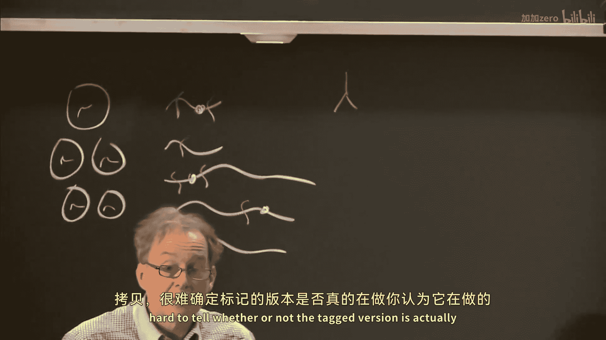
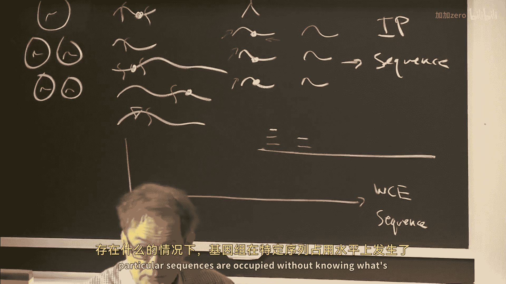

# 【计算与系统生物学基础 7.91J 2014】麻省理工—中英字幕 p07 p6 7. ChIP-seq Analysis; DNA-protein Interactions -BV1HdzaYAE2a_p7-

The following content is provided under a creative Commons license。

 Your support will help M I T Open Coseware continue to offer high quality educational resources for free。

To make a donation or view additional materials from hundreds of MI T courses。

 visit M T OpenCourseware at OCw。 MT。 Eduu。

原在。So good afternoon once again and welcome back to Computal Asistance Biology Lec number seven。

And today we're going to put to good use。Two things that we have learned。

 we've learned how to align high throughput reads to genomes。

And we learned how to take a collection of high throughput reads， and assemble a genome。And today。

 we're going to delve into the mysteries of transcriptional regulation。

 And so what I'd like to discuss with you today。Is a very important set of techniques that allows us to elucidate exactly how genes are regulated。

Its probably the most important technique for allowing us to get at that question。

And I'm sure many of you are familiar with the idea of transcriptional regulators。

 which are proteins that bind in a sequence specific way to the genome and act as molecular switches。

And we'll return to some aspects of these when we talk about proteomics later in the term。

 but suffice to say these proteins have domains that interact in a sequence specific way with the DNA bases in one of the grooves of DNA。

They also typically contain a domain， which is a。An activation domain or a repression domain that that interacts with other proteins can cause the genome to fold up。

And can also help recruit the RNA polymerase holoen to actually turn on a gene transcription。

So here we have a figure of a collection of pit1 molecules interacting with the genome。

 and of course， there are many flavors of genomic regulators。

It's estimated that humans have about 2000 different proteins that act as these molecular switches。

Some as activators， some as repressors。 And we're gonna be talking about fundamentally today。

 the idea of。How these molecules interact with the genome and control。Gene expression。

Through the analysis of where they actually interact with specific genome loci。

So if we were to draw a。Picture。Of。How we understand gene regulation in cartoon form if we have。

A gene here with the transcription start site。And we can imagine RNA molecules。

Being produced off of this genomic template。We know that there are。Nonco regions of a gene that。

Permit for the binding of these regulators。 And my definition of a gene is all of the DNA that's required to make a specific transcript of protein。

 So that includes not only the coding parts of the gene， but the noncod regulatory parts as well。

So we can imagine out here that there are a collection of regulators， perhaps just one。

That bind to a sequence that in turn， activate this gene producing the RNA transcript。Which then。

 in turn。It's turned into another protein。This protein may undergo some sort of post translational modification by signaling pathway。

Or other mechanism that activates it。Some regulars need to be activated before they combine find。

 and some do not。And this activated regular combined to get another gene。

And cause another RNA to be expressed。And it may be in the second context that we need two different。

Proteins to bind to activate the gene。 And so during the course of the term。

 be talking about many aspects of these regulatory networks。

Including things like what the regulatory code of a genome is。

 that is where these binding sites are and how they're occupied。

And we'll return to that and later on in today's lecture。

 We'll talk about the dynamics of binding of proteins。

 including how concentration they dependent are。And we'll talk about。Combinatorial control。

Whether or not， for example， both of these have to be present or just one of them needs to be present for a gene to be transcribed and how you can use these regulatory sequences to implement very complex computational functions。

But suffice to say， the most important thing that we have to identify is。

The programming that underlies the genome， which includes these regulatory sequences and exactly how they're occupied by regulatory proteins。

Ideally， what we would like to be able to do is to do a single experiment that elucidated。

All of the regulatory sites in the genome and which ones were occupied by which proteins。

 But presently， that's technically not possible。So we'll begin today with a technique that allows us to consider one protein at a time identifying where it occupies the genome。

Now， there are other kinds of proteins that we can identify in terms of where they are associated with the genome that are not transcriptional regulars per se。

For example， we all know that。Chrometon is organized。嗯。On spools called nucleosomes。

These nucleosomes are composed of8 different histones They have tails on them， and there can be。

Covalent marks put on these tails。 We'll return to this later。 and we talk about epigenetics。

But I did want to mention today that's possible to identify where there are histones with specific marks that are present in the genome and what genome sequences they are associated with。

Okay， so we can look at sequence specific regulators。 We can look at more general epigenetic marks。

 all using the same technology。And。This slide simply recapitulates what we just talked about over here on the left hand side of the board。

But we want to know basically what and where in terms of these genomic regulators。

 what they are and where they are in the genome。And today。

 we're going to assume a fairly simple model， which is that。Regulars that are proximal to a gene。

 most probably regulated it。Although we know in practice， actually。

 it appears that roughly one third of the regulators that are proximal to a gene actually skip it and regulate a gene further down the genome。

It's not really understood very well how the genome folds in three space to allow these transit regulatory interactions to occur。

 But I'll just point out to you that。The simplistic model that。

Proximal binding regulates proximal genes。Doesn't always hold。

 especially when we get into mammals and other higher higher organisms。And as I mentioned。

 another aspect of this is that certain proteins may need to be modified to become active。And thus。

 there are。Signaling pathways。You can imagine signaling pathways responding to environmental stimuli outside of cells。

These signaling pathways can interact with transcriptional activators。

And modify what targets they seek in the genome。So these sorts of regulatory networks will be talked about specifically in a separate lecture later in the term。

 but they're extraordinarily important。 and a foundational aspect of them is。

Putting together the wiring diagram。In the wiring diagram。Has to do with where the regulators。

Occuppy the genome in what genes those regulators regulate。And in order to do that。

 we're going to utilize a technique today called Chiipse。

 which stands for chromatin immuno precipitation， followed by sequencing。

And we can now reliably identify where regulars bind into the genome within roughly 10 base pairs。

So the spatial resolution has gotten exceptionally good。With high throughput sequencing。

 as we'll see。Which really is a fantastic era to be in now。

 because this really wasn't possible 5 or even 10 years ago。😊。

And so we now have the tools to be able to， to take apart。The regulatory occupancy of the genome。

And discern exactly where these proteins are binding。

The way that this is done is I'll describe the protocol to you。In general。

 and then I'm going to pause for a second and see have if anybody has any questions about the specifics。

 But the essential idea is that you have a collection of cells。Typically， you need a lot of cells。

 We're talking 10 million cells。So for certain kinds of marks。

 you can get down below a million or even to 100000 cells。 but to get robust signals。

 you need a lot of cells at present。And all these cells， obviously， have。

Chroosomes inside of them with proteins that are occupying them。

And the essential idea is that you take a flash photography picture of the cell while it's alive。

You had a crosslinking agent， and that cross links proteins creates bonds between the proteins and the genome。

 the DNA where those proteins are sitting。And so you then isolate the chromat material。

And you wind up with pieces of DNA。With proteins occupying them。All the proteins。

 So not just some of the proteins， but all the proteins are。Non selectively crosslink to the genome。

You then can take this。Extract and fragment it。 Typically， you fragment it by using sonication。

 which is mechanical energy， which causes the DNA to break。

At random locations。There are more modern techniques that we'll touch on at the end of today's lecture where you can enzymatically digest。

These fragments right down to where the protein is。But suffice to say， you get small fragments。

Which you then can immunopurify with an antibody to a protein of interest。

So one c of using this technology is either a。You have a good antibody to a protein that you care about is regulatory。

Or B， you have tagged this protein。Such that it has a flag tag。

mic tag or some other epitope tag on it， which allows you to use an antibody or other purification methodology for that specific tag。

So either you have a good antibody or you have a tag on the protein。

One problem with tags on proteins is that they can render the proteins nonfunctional。

And if they're nonfunctional， then， of course， they're not going to bind where they should bind。

 And one has to be careful about this， because if you introduce a tag and you have a couple good copies of the protein that are untagged and one copy that is tagged。

 it's hard to tell whether or not the tag version is actually doing what you think it does。

 one has to be careful。

But suffice to say， assuming that you have some way of immunopurifying this protein。You can then use。

The antibodies to simply purify those fragments。That have the protein of interest。

After you've purified the protein of interest， you can reverse the cross linking。

Have a collection of fragments。But you then sequence。Using a high throughput sequencing instrument。

Now， recall that the， in the。Usually applied protocol。 The fragmentation is random。

 So you're gonna be sequencing both ends of these molecules， not。Actually。

 for each point probably sequence one end， you're going to sequence an end of these molecules。

Which gives you a sequence tag that is near where the event occurred， but not exactly at it。

And we're going to take those tags。 and if we have our genome here represented as this short horizontal chalk line。

We'll take our reads and we will align them to the genome。

And try and discern from those aligned reads where the original proteins were binding。Okay。

Now。Our job is to do the best possible alignment。Of discovery of where the proteins are binding。

 given this evidence。So we have a collection of evidence exhibited by the read sequences。

The other thing that we will do is we will take the original population of reeds sorry of molecules。

 and we will sequence them as well。Sometimes called the whole cell extract sequence。As a control。

 and we'll see why we need this control。A little bit later on。 But this is going to be a purified。

I P so called I P for immunoprecipitate fraction， which will sequence。

 And this will be the whole cell extract， which should not be enriched for any particular protein。

Now， before I go on， I'd be happy to entertain any questions about the details of this protocol。

 because it's really important that you feel comfortable with it before we talk about the computational analysis of the output。

😊，So if anybody has any questions， that't be a great time to ask。Yes。Scientific question。

 this assumes that we know a transcription actor。 are there ways of methods to。

Figure out transcription factors so that you can design antibodies。Okay， so the question is。

 this assumes that we know the regulators that we're interested in ahead of time。And。

Is there a de noval way of discovering heretofore unknown regulators that are binding to the genome。

The answer to that question is sometimes as is usually the case。 Later in the term。

 we'll talk about other methodologies for looking at the regulatory occupancy of the genome that don't depend upon immuno purification。

 in which case we'll get an understanding of what's going with the genome。

At the at the level of knowing what particular sequences are occupied without knowing what's there。

From the sequence， sometimes we can infer the family of protein that is sitting there。But in general。

The sort holy grail of this， which has not really fully materialized， would be as follows。

 which is instead of purifying with an antibody。And then sequencing。

Why it not purify with a nucleic acid sequence， and then do mass spec。

To actually take the proteins off of the DNA， run them through mass spec and figure out what's there。

And we and others have attempted this。And at times， you get good results。

 But mass spec is improving greatly， but it's still a fraught process with noise。

And there's a paper just published in nature methods late last year on something called the crap Oh。

 Have you heard of this paper before， it is all of the junk you get when you run masss spec experiments and so when you run a masss spec experiment。

 you can just take all this stuff in the crap homem out of it and it actually helps you quite a bit that gives you an idea what the state of the art of Mas spec is it's a little bit noisy okay。

Okay， so， but I think your question is great。 I think we need to get there。

 We need to get to the place where we can take portions of the genome。

And run them through Ma spec and figure out what is populating at de novo without having to know ahead of time。

Any other questions？Okay， great。 So the figure on the slide up there also described the best。

 the chipse protocol。And I'll also say that some people believe this would never work。Right。

 they actually thought that when you did the purification。

 you would just get so much background sequence that when you map it to the genome。

 you could never discern any signal whatsoever。 And so there were lively debates about this until somebody actually made it work。

 And then the argument was over because it made everything else completely and totally obsolete。So。

It wasn't good to be on the wrong side of that argument。 I'll tell you that。I wasn't， but all right。

I was on the right side， but suffice to say， heres a close up picture of Mr。 protein or Ms protein。

 and what happens when there is breakage around that site and followed by sequencing。

 And as you can see， the little black lines connecting between the protein and the DNA supposed to indicate contact sites。

And you can see the little yellow arrows are supposed to indicate breakage sites of the DNA that is are being caused by。

 in this case， mechanical breakage through sonication。And you get reads from both strands of the DNA。

 remember that a sequencing instrument always sequences from 5 prime to 3 prime， right。

 So you're going to get。The reads。On the red strand and on the blue strand shown here。

And when we do the mapping， we know which strand they're mapped on。

And the profile is shown in the lower plot。Showing the density of map reads versus distance from where we believe the protein is sitting。

The tag density refers to tags or sequence tags or reads that are aligned using the methodology we discussed two lectures ago to the genome that we assembled last lecture。

So the。Characteristic shape shown in this picture。Is something that。Is not the same for all proteins。

It is something that varies from protein to protein。

And that's one of the things that we'll want to do during our discovery of where these proteins are binding is always learn the shape of the redistribution that will come out of a particular binding event。

So the， just to show you some actual data。 So you get a feel for what we're talking about， this is。

Actual data from the Ot 4 protein， which is an embryonic regulator forpotency factor binding to the mouse genome around the Sox2 gene。

And you can see the two distinct peaks on the upper track。Both the。

 the plus drain reads and the minus drain read showed in blue and red respectively。

Each one of the black and white bars at the top probably can't be read from the back of the room。

 but each one of those is 1000 bases to give you some idea about sort of the scale of the genome that we're looking at here。

You can see the Sox 2 gene below。The exxons are the solid bars。

 And then you see the whole cell extract channel。Which we talked about earlier in the wholesale extract channel is simply giving us a background set of reads that are nonspec。

And so you might have a set of， say， 10 or 20 million reads。

 something like that for one of these experiments， that you map to the genome and get a picture that looks like this。

So now our job is to take the read sets that we see here。Genome Y。

 and figure out every place that the oct4 protein is binding to the genome。

Now there are several ways that we could approach this question。

 One way to approach the question would we simply say， where are the peaks。

 And so you'll hear this kind of exploration often described as peak finding。

Where can you find the peaks and where is the middle of the peak？Now。

 the problem with this approach is that it works just fine when a peak represents a single binding event。

So imagine that these two fingers here are binding events。

 and they're fairly far apart in the genome。 Now， as they come closer and closer and closer together。

 what will happen is that instead of having two peaks。We're going to wind up having one broad peak。

And thus。There is a lot of biology present in this kind of。

Bding of the same protein and two different in proximal to itself。

So we need to be able to take these sorts of events that occur underneath a single enrichment or a single peak into separate binding events。

And this is shown in the next couple of slides， where we look at what we would expect from a single event in terms of a read enrichment profile once it's align to the genome。

 and we think about。A possibility that there are two events。

Here shown in indiscernible gray and blue and red。 And we note that。

Each one of these will have its own specific profile。

 and then you can consider them to be added together to get the peak that we observe。Okay。Now。

One of the reasons this add of property works is that remember。

 we're working with a large population of cells。And regulators don't always occupy。site。And thus。

 what we're looking at in terms of the reads are the sum of all of the evidence from all of the cells。

And so， even though the。Proteins are。Close to one another。

We often can find an additive effect between that proximal binding。So how can we handle this？Well。

What we're going to do。Is we're going to do two key algorithmic things。

 We're going to model the spatial distribution of the reads that come out of a specific event。

As I suggested earlier， and we're going to keep that model up to date。 that is。

We can learn that model。By first。Running our method， using a common distribution of reads。

Identify a bunch of events that we think are。Binings of a single protein。

Take those events and use them to build a better model of what the redistribution looks like。

 and then run the algorithm again。And with the better distribution。

 we can do a much better job at resolving events。Out of multiple events out of single peaks。

And the next thing we're going to do is we're going to model。The genome at a single base pair level。

So we're going to consider every single base as being the center point of a protein binding event。

And using that model， try and。Sot through how we could have observed。

The reads that we are presented with。And the first。

 the spatial distribution that we build is going to look something like this。

And we consider a 400 base pair window。And we learn the distribution of reads。

And we build an actual empirical distribution。 We don't fit。The distribution to it。

 But rather we can keep an exact distribution or histogram of what we observe averaged over many。

 many events。 So when we're fitting things， we have the best possible estimate。Yes。

I was trying to understand the origin of the station clearly。

 so within the protocol are you sequencing with the proteins bound to these fragments no no。

 so you can't do that to reverse the cross thinking。From the DNA。 And then there's a step here。

 which we。Amitted for simplicity， which is we amplified the DNA sake。 So was wondering。

If there's not protein， why doesn't the polymerase you know just read through the whole thing from one side。

 why is there a peak on the you know there seems to be a loss of signal right where the protein is found well that depends upon how long the we are。

And how hard you fragment？And in fact， that can occur。Right， but typically。

 we're using fairly short reads， like 35 base pair reads。And we're fragmenting the DNA to be， say。

 perhaps 200 to 300 base pairs along。So we're reading the first 35 base pairs of the DNA fragment。

 but we're not reading all the way through。 We could read all the way through if we wanted。

But there really wouldn't be a point to that。Thing that we're observing here is where the。

 the five prime end of the read is， where the leftmost edge of the read is。

So even though it might be a reading all the way through， we're just seeing the left edge of it。Okay。

Does that answer your question， Okay， great， Any other questions？Yes， it back。

Distribution that's being shown up here。negativeYes。

 this is the position of where the read started will not account of the number of times that particular base was shown up in the sequencing result。

 I that correct Let me repeat the question。What we're observing in the distribution is where the read starts and not the number of times that base shows up in the sequencing data。

It is the number of number of reads whose five prime positions start at that base。Okay。

 so each read only gets one count。Okay， does that help。Okay。

The other thing that we're going to do for simplicity is we're going to assume that the。Plus。

 and the minus terrain distributions are symmetric。So we only learn one distribution。

 and then we flip it。Think consider the minus strand。And that's shown here。

Where we can articulate this as this empirical distribution or the probability or we given a base position。

Is described in terms of the distance between where。啊。We are considering the， the。

Binny of it may have occurred and where the read is。So it's important for us to， to look at this in。

And some details you're comfortable with it。So。If we think about。Here's our genome， again。

Let let's assume that。We have a binding event at base M along the genome。And we have a read here。

 R sub n at some position。The probability。That this read。Was caused by this binding event。

Can be described as the probably of read and， given。The fact that we're。Considering an event。

 a location M。Okay。Now， of course， it could be that there are。

Other possible locations that have caused this read。And let us suppose that we model。

All of those positions along the genome as a vector pi。And each。

Element of pie describes the probability or the strength of a binding event having occurred at a particular location。

So we can now describe the probability of reads of n。Given pi。Is equal to。

The summation for I equals1 to big M， assuming that there is one to M basis in this genome。Of。OfP。

 R N， given M。Pi am like this。So we are mixing together here all of the positions along the genome to try and explain this read。

So the probability of the read， given this。Vectctor pi。

 which describes all the possible events that could have described， could have created this read。

 is this formulation。Which considers the probability of each position times the probability that an event occurred at that position。

Subject to ext。That。All of the pi summed to one。So we're just assigning probability mass along the genome as to from whence all of the reads originally came。

So， this is considering。A single read， R sub Ben。And where that might have originated from， Yes。

 basic that only one event occurred in the entire fragment。The constraint， the question is。

 does this constraint imp to only one event occurred。No。

 the constraint is implying that we're going to only have。

Sort of one unit a probability mass to assign along the genome， which will generate all the reads。

And thus。This vector describes the contribution of each base to the reads that we observe。

So let us say simplistically that it might be that there are only two events in the genome。

 and we had a perfect solution。Two points in the genome， like M1 and M2。

 would have 05 as their values for pi， and all the other values in the genome would be 0。

We're going to try and make this as sparse as possible， as many zeros as possible。

 So only at the places in the genome where protein is actually binding， will pi I be non zero。

It makes sense。These are great questions。 Yes， and by the， people could say their names first。

 that would be great。 Yes， just to clarify。The five vector。This distribution is completely imppirful。

 Yes， that's right， Sarah。Completely empirical。I'll also say just so you know that there are。

Many ways of。Doing this kind of discovery， as you might imagine。

 the way we're going to ascribe today was a way that was selected as part of the on code 3 pipeline for the government's On code project。

 And so what I'm going to talk about today is the methodology that's being used for the next set of data for on code 3 followed by IDR analysis。

 which is also part of on code 3。 So what you're hearing about today is a pipeline that's being used that will be published next year as part of the on code project。

 these papers， this methods been published， but the analysis of all the encyclopedia of DNA elements。

 which is what on code stands for the third phase of that is utilizing this。Okay。Any other questions？

Yes。This binding event tell you anything about the topology of the actual protein it does actually。

 and you know we'll return to that， but。The shape of these。

The shape of this binding can tell you something about the class of protein。

 which is still an area of active research。 but also note that。

That is a little bit confounded by the fact that when you have homotypic binding。

 which means you have these closely spaced binding events， right， you get these broader peaks。

 And so there's a lot of research into what the shapes and the genome mean and what biological function of mechanism they might imply。

Yes。Explain pie more time Yeah， explain pi one more time short。

 So pi is describing where there are binding events along the genome。 So， for example。

 if we just had two binding events。M1 and M2， then pi of M1 would be equal to 05。

 The pi of M2 would be equal to 05。 and all the other values of pi would be 0。

So we're just describing with pie where the events are occurring。

 That sort of gives us the location of the events。Okay。And。

You'll see in a moment why we articulated it that way。But。

That that's what Pi is doing Does that answer your question，And question yes。Cases where you have。

It's kind of really close together so point that there's some sort of twist between how do you constrain your pie？

How do you constrain the pie when you have closely spaced peaks？😔，Well， you don't constrain it。

 You actually want。啊哈。Well， I'm going to show you some actual examples of this algorithm running。

 So we're gonna I'm going give you an animation of the algorithm running so you can actually watch what it does。

 And you'll see first， it's going do something that isn't too pleasant and then we'll fix it。 Okay。

 But the key thing here is sparsity。 What we want to do is we want to enforce pi being as sparse as possible to explain the data。

 One of the common problems in any approach to machine learning is that with a suitably complex model。

 you can model anything。 but is not necessarily interpretable。

So what we want to do here is to make pi as simple as possible to be able to explain the data that we see。

However。If a single event。Cannot explain。And observe redistribution at a particular point in the genome will need to bring another event in。

 okay。All right， so that is。How to think about a single read。

And now we can just say the probability of our our entire read set given pi is quite simple， right？

 It's simply the product over all the reads。嗯。Oh sorryrry， this is。Like， so。

So this is the probability of the entire read set。We had this previously。

 which is the probability of a single read。 And we take the product of the probability for each individual read to get the likelihood of all the reads。

So now all we need to do to solve this problem is this。 We need to say that pi is equal to the。

Arg max pi of PR。Hi。Which gives us the maximum likelihood estimate for pi。Now。

 it's easy to write that down， right， Just find the setting for pi that maximizes the likelihood of the observed reads and poof。

 you're done， right， because now you come up with a pi that describes where the binding events are along the genome at single based pair resolution。

Assuming that pi is modeling every single base。Does everybody see that？Any questions about that？Yes。

So here wereた。有关点的。N is the number of reads M is the number of base in genome。

N is the number of reads。Decied off to the number of funding events or。そして number。The length of pi。

 It's the number of bases in the genome。 And hopefully the number of binding is much， much。

 and much smaller than that。 Tyical number of binding eventss。

5 to 30000 across a genome that has 3 billion bases。Something like that。 that's much， much smaller。

Okay。All right， so this is what we would like to solve。And。Another way to look at this model。

 which may be somewhat more confusing。Is as follows。

 which is that we have these events spread along the genome。

And we have the reads shown on the lower line， and the events are generating the reads。

 So this is called a generative model， because。Derrivation of the likelihood。Directly follows from。

If we knew where the events were。We could。Exactly， come up with the best solution for。

The assignment of pi and thus， for the likelihood。Okay。

So this is what we have on the board over here。But we can't solve this directly。Yes。

 question in the back my name is Eric I a little question What is the definition of GPS here Oh sorry GPS is the name of this algorithm。

I， I I told it to an editor they hated it。 But any rate， it's called the genome positioning system。

Yeah， so you don't like me either right， Eric， oh well。But yes， it locates proteins on the genome。

 right。Yeah。Good question。So。This is going to be， I think。

 our first introduction to the EM algorithm as a way of solving complex problems like this。

And here is the insight we're going to use to solve this problem。Which is that。

Imagine I do the function G， Okay， so G is going to be this function that tells us。

Wet reads came from which events？And where those events are in the genome。So， if you knew G。Exactly。

This would be a really trivial problem to solve， right it would。Tell you， for every single read。

Whi particular binding event caused it？And if we knew that。It'd be great， right。

 because then we could say something like this。 We could say。😊，Well。We knew G。Then。

The number of reads。Created by a binding event at locationcation M。Would simply be。We would sum。

It's a very good summation sign here。 We would sum。

Over all the reads and count up the number of them。Where。Read N was caused by an event a location M。

 And we just summed up this number。 We'd have the number of reads。Caused by an location M。

Is everybody。Good that。No。Okay， do you see the definition up there of G。On the。Overhead here。

 projector。So。Every time a read and comes from event M， that functions is gonna be equal to one。

So we just count the number of times。 it's one。For a given location M。

 we find out how many reads came from that event could be 5， could be 10， could be 100。

We don't know exactly how many were generated by that particular event。

 But there's going to be some number。 if we have。10 million reads， and we have 100000 events。

 We're gonna get about 100 reads per event， right， something like that。

You can give that kind of order of magnitude。Is that everybody， okay。

 any questions about the details of this， because if。

The next step is going to be causing leaps of faith。

 So I want to make sure everybody's on firm ground before we take the leap together， yes。

You want to enforce sparsity yet I've not enforced sparsity yet。 you like sparsity。

 You're going to keep me to that right， So later on you'll hold me to it all right， What's your name？

Okay， that's your job， right， Mr。 Sprsity， okay， I like that。 He's being sparse， I like it， okay。

So if， if this is the number of reads assigned to。A particular。Location。

 then we know that price of M will simply be n some M。Over。嗯。

The summation of all of the reades to all of the events， right。And some of these are going to be0。

A lot of them would be zero。So here。I don't know this assignment of reads to events。 It's。

 it's latent， right， It's something I have invented， which I do not know。But if I did know it。

I'd be able to compute pi directly。Like so。Because I built to figure out for each location in the genome。

 how many reads were there。 And that's how much responsibility that location had for generating all the reads。

Is everybody with me so far， any questions at all？Okay， so。Remember。This is latent。

 We don't know what it is， but if we did know， we'd be in great shape。

So our job now is to estimate G。And if we could estimate G， we can estimate pi。

And once we get a better estimate for pi， I'd like to suggest you。

 we can get a better estimate for G。Okay， and we can go between these two steps。

And so that's what the expectation maximization algorithm does in the lower part here。

Which is that the left part。Is estimating gamma， which is our estimate for G。

Whi looks just which is looking at。So the number of reads。

That we think are softly assigned to location M over the total number of softly assigned reads from all locations。

And that gives the。嗯。The fraction of a read。At N， assigned to event M。 So we are。

Computing an estimate of G。But to compute this estimate， we have to have pi。

 It's telling us where we believe that these reads are coming from。And once we have gamma。

 which is an estimate， we can compute。Pi， just in the same way， we computed it here。If we knew G。

So we compute the expectation。Of this latent function， which we don't know。And then， we maximize pi。

To maximize our likelihood。And there is， you can derive this directly by taking the log of that likelihood probability up there。

And maximizing it。But suffice to say。You wind up with。This formulation and the E framework。So， I can。

Go between these two different steps， the E step， the M step， the E step， the M step。

 And each time as I go through it， I get a better and better approximation for pi。

Until I ultimately get it within some preset level of conversionence。And then I'm finished。

 I actually can。Report my pie。But before I leave the E M algorithm and this formulation of it。

 are there any questions at all about。What's going on here？Yes， question in the back。

Howigh you would get like directly maximized。It gives you a solution， right？嗯。

And it is the optimum solution， given the starting conditions that we give it， right。

It does depend on the starting conditions。Any other questions？Yes， it's back。What are you having。

Righting。So。プラゼーションか。Right so the question is this depend upon you having discrete binding events。

 what biological assumptions are we making in this model about whether or not a protein is actually fixed and welded to the genome at a particular location。

 or whether it's drifting around， right， And this might be a particular interest， for example。

 if we're looking at histones， which are known to sort of slide up and down the genome and we're immunorecipitating them。

 What will this give us。We are making the assumption that were dealing with proteins that have puncate binding properties that actually are point binding proteins。

And thus what we're going to get out of this， as you'll see， is going to be a single location。

There are other methodologies， which I won't describe today for， essentially。

Deconvolving the motion of a protein on the genome and coming up with sort of its middle or mean position while allowing it to move。

 right， but。Today's algorithm is designed for point binding proteins。Good question， okay。All right。

So just to be clear， what we're gonna do， we're gonna initialize everything such that we' begin by initializing pi to be one over the size of the genome。

And at the very end of this， the strength of an a event will be。Simply。

 the number of reads assigned to that event。By summing up our estimate of G。

And the nice thing about this is that。Because the number of reads assigned to an event。

 in some sense， is scaled relative to the total number of reads in the experiment。

 we can algorithmically take our genome and chop it up into independent pieces。

And process them all in parallel。Which is what this methodology does。Allright。

 so let's have a look at what happens when we run this algorithm。So here we are。

 This is synthetic data。 I have events planted at 5550 by base pairs。

 The X axis is between 0 and 1400 base pairs， and the y axis is pi from 0 to 1， okay。So。Here we go。

It's running。And this is one base pair resolution。And it is still running。And stop。Well。

We get sort of a fuzzy mess there， don't we？And the reason we're getting sort of a fuzzy mess there is that we have got a lot of reads we've created。

And there are a lot of different genome positions that are claiming some responsibility for this。

Which my friend， Mr。 Sprsity doesn't like， right， We need， we need to clean this up somehow。

And let's see what happens when we actually look at actual data。

 So here is that original data I showed you。For the two Ot4 binding events next to the Sox 2 gene。

 And I run the algorithm on these。Data。And you can see it working away here。And once again。

 it's giving us a spread of。Events， and you can see it even beginning to fill in along where there's noise in the genome。

And stopped here。And it， it's assigning the probability mass pie all over the place， right。

It is not sparse at all。So。Does anybody have any suggestions for how to fix this。You know。

 we've worked all night。 We've got our algorithm running。

 And we thought it was going to be totally great when we run it。 and it gives us this sort of。😊。

Unfortunate， smri kind of result。What could we do？Any ideas at all。Yes，取ります。Add a prior。

 Do you like the words You saw the word no prior。 that a little ti。 Yeah， absolutely， a good point。

 Add a prior。 So what we're gonna do is we're gonna try and add a prior。

 is's going prejudice pi to be 0。To create sparsity。 So we like pi being zero， right？

So we'll add what's called a negative deerchlet prior， which looks like this。

 which is the probability of pi there is proportional to one over pi to M raised to the alpha power。

 and as pi gets smaller， that gets much， much bigger。And thus， if we add this prior。

Which happens to be a very convenient prior to use。 We can force pi to be 0， in many cases。

And when we take that part into account。And we compute the maximum a posteri。Values for pi。

The update rules are very similar， except that what's interesting is that the rule on the left for computing our estimate of G is identical。

But on the right， what we do is we take the number of reads that we observe at a particular location。

 and we subtract alpha from it。Which was that exponent in our。Prior。

 and what that simply means is that if you don't have alpha reads， your history。

You're going to get eliminated。So this is going to do something called component elimination。

 If you don't have enough strength， you're going to get zap to 0。Now。

 you don't want to do this too aggressively early on。

You want to let things sort of percolate for a while。

 So what this algorithm does is it doesn't eliminate all of the components that don't have alpha reads at the outset。

 It lets it run for a little while。But it provides you with the way of。

Ensuring that components get eliminated and set to 0 when they actually don't have enough support in the resetet。

啊。So once again， all we're going to do is we're going to add this prior on pi。

 which we will wind up multiplying times that top equation。

We'll get the joint probability of R and P in this case。

 And then we're gonna maximize it using this E M adaptation。And when we do so。

 let me show you what happens。To our first example that we had。嗯。Okay， that's much cleaner， right。

 We actually only have two events popping out of this at the right locations。All right。

So that's looking good。 And the probability sum to one。Which we like。And then we'll run this on the。

Oct 4 data。And you can see now， instead of getting the mushing around those locations。

 what's going to happen is that most of the probability mass is going to be absorbed into just a couple components around those binding events。

Okay。Now， another way to test this is to ask whether or not。

If we looked at what we believe are closely spaced homotypic events， in this case， for C TCF。

With that。Prior， we still can recover those two events being next to each other in the genome。

And so if we run this。You can see it running along here。Attempting to each one of these iterations。

 by the way， is an EM step。And there you go。And you can see that even from the sparse data you see about。

 that's the actual data being used。 all those little bars up there， the read counts。

For the five prime ends of the reeds， we can recover the position of those binding events。Okay。

 question， yes。It depends upon the number of reads， but it's somewhere around three or four， I mean。

 if you look at the GPS paper which I posted。It tells you how alpha is set。Yes， wholesale data。

Im trying to compute how questions do we use wholesale extract data。 I told you how important it was。

 and I hadn't mentioned it again， right we're about to get to that because that's very important。

 And glad you asked that question。 Yes， it looks like along the genome coordinates。

 each event is only one base pair， but binding is usually more than one base pair。

 So is that like the center of the Yes that's the well it's the center of the the read。

F distribution function， whether or not it's the center of the binding of the protein。

 I really can't tell， right。Okay， great。And I'll just point out that the power of this method is its ability to take apart piles of reeds like this into these so called homomotypic binding events。

Where you see where the motif is， and you can see this method will take apart that Pir reads into two independent events。

 whereas other popular methods of which there are many。For analyzing these type of chippsse data。

 don't take apart the event into multiple events。Because most of them make the assumption that one pile of reads equals one binding event。

Okay。Now， back to our question about wholesale extract， right？

What happens if you get to a part of the genome that looks like this？

 We're going go back to our O4 data。And we have。Our O4 I P track， which is above。

 and then our wholesale extract track track is down there in the bottom。What would you say。

 would you say those are really O for a binding events。

 or do you think something else is going on there And if so， what might it be？

Any ideas about what's going on here。Yes， region with a lot of repeats in the genome regions with repeats of the genome。

Yes， in fact， you can see he repeats annotated in green right there。嗯。

And as you recall from last time， when we talked about assembly， it's very difficult。

To actually get the number of repeat elements correct。

And a consequence of that is if you underestimate the number of repeat elements in the genome and you collapse them。

When you do sequencing of the genome and you remap it。

 you're regions of the genome where a lot of reads pile up。Right。

Because they're actually coming from many different places in the genome。

 but they only have one place to align。And these sort of towers of reeds， as they're called。

 can create all sorts of artifacts。So in order to judge the significance of events。

 what we'll do is a two step process first。We will run our discovery pipeline and discover where the events are in the I P channel without regard to the wholesale E channel in this particular case。

And then we will filter the events and say， which of the events are real in view of the data from the wholesale extract channel。

And so the way to represent this is what is the likelihood？

We would have seen those IP reads at random。Given the wholesale extract channel。

So how can we formulate this problem？ Well， imagine that we take all of the reads we see in both channels。

And we add them together。 And so we get a total number of reads at a particular location。

 and the genome。If， in fact， that we're going to occur at random， we'd be doing a coin flip。

Some reads would go on the I channel。 Some reads would go on the wholesale extract channel。

So now we can ask， what's the probability we observed greater than a certain number of regions in the IP channel。

 a chance。Assuming a coin flipping model where we've added the reads together。

Another way to view that is that what's the chance that we have observed。

Less than a certain number of reads in the wholesale extract channel， assuming a coin flipping model。

And that will give us a P value。Under the null hypothesis that， in fact， there is no binding event。

 And simply what's going on is that we have reads being flipped between the two channels out of a pool of the total number of reads。

Okay。And if we take that approach。We can formulate it as the binomial in the following way。

And we can compute a P value for a given binding event。

Using the data from both the I P channel and from the。Control channel。

And the way that we do this is that we。Look at the number of reads assigned to an event because we already know that number。

 right， We've computed that number。And we take a similar window。Around the control channel。

 we count the number of reads in it。And ask whether or not the reads in the I channel is significantly larger enough。

Then the reads in the control channel to reject the null hypothesis that， in fact。

 they occurred at random。Okay。So this is the way that we compute the P values for events。

So once we've computed the P values for events。We still have our multiple hypothesis correction problem。

Which is that if we have。100，000 events。We need to set our。P values cut off and appropriate。Value。

 And I think that you've。May have heard about this before in recitation。But。

The way that this is done in this system。Is to use a Benjamani Hochburg correction。

And the essential idea is that we take all of the P values。And we organize them from。Smallest。Tolars。

And we're going to take a set of the top events， say one through four and call them significant。

And we call them significant。Under。The constraint that。P values sub I is less than or equal to。

I over n， or n is a total derivative。 Time is alpha。Which is our desired。False discovery， rate。

So this allows us in a principled way to select。The events that we believe are significant up to a false discovery rate。

 which might be， for example，05， something its typically used for a false discovery rate。Okay。So。

We talked about how Disc events。How to judge the significance？Individually。

 how to take a ranked list of events from a given experiment。

And determine which ones are significant up to a desired false discovery rate。

The false discovery rate means that let's say that we have 1000 events that come about。

If this false discovery rate was 0。1， we'd expect 100 of them to be false positives。

So it's the fraction of positives that we detect that we think are going to be false。

And we can set that to be whatever we want。Okay。We have now。Now。

 let's talk about the analysis of these sort of data。 Oh there's a question up here yes。是不是？

Does that correct for the fact that in your previous slide， the P， the coin isn't necessarily fair？

Oh， the null hypothesis assumed that the coin was fair， that readeds could either occur that。

That in this case， for example。That the reads are either occurring in the control channel or in the I P channel with equal likelihood。

Assuming because they're coming from the same process。Which was not related to the I P itself。

They're coming from some underlying noise process。Typically you'd have some fixed number of reads。

And so in the IP channel， the bulk of your reads was in your peaks so you would have fewer in the question is how do you normalize for the number of reads and how they're being spent because in the IP channel you're spending the reads on IP enriched events in the wholesale extract channel you're not spending the reads on those so you have more reads to go around for bad things right so to speak right？

So what this algorithm does， which is， which I'm glad you brought up。

 is it takes regions of the genome that are event free。

And it matches them up against one another and fits a model against them to be able to scale the control reads so that the number of reads in the IP and extract channel are the same in the regions that are free of events。

And so it matches things。 So it is 05。Okay。F wooden this rank list。Correct for that。No， would not。

 because it would。You still let us， suppose that we。Didn't that we made a horrible mistake and that。

We let these events through。Because our P was wrong。They would have a very large number of reads。

 and they would be very significant。Okay。As a consequence。

 they would float up to the top of this list as being having the lowest P values or the most significant。

 and they would pop through this。So we would report them as binding events。Which is not desirable。

Okay。These are all great questions， okay。Any other questions at all？O。So。um。We've talked about this。

The next question you might have would be。You've done two replicates of the same chip。

 You always want to do two of every experiment， if not three or four。嗯。And。I know it's expensive。

 but you don't know where you are。 If you only to do one of something， Trust me。

So assume you've done two experiments that were identical chip experiments。

And you would like to know whether or not the results between those two experiments are concordant。

How might you go about。Determining this， does anybody have any ideas。Well。

 let me suggest something to you。Imagine that we。Create two lists。

One for experiment X and one for experiment Y。And we're going to put in this list in rank order the strongest events and where they occur in the genome。

 Okay， And let us suppose that we are able to match events across experiments when they're in the same location。

Okay。嗯。So。What we'll do is。We'll say， event。1 occurs here。 Event 13 occurs here and here。

 Event 9 occurs here and here。 Event 10 is matched。 Even Event 11 occurs here。 Event 57 occurs here。

And these are ranked in order of significance。They're not completely concordant。Right， but。

 and they are ranked according to the significance in this particular experiment and this particular experiment。

And we would like to know whether or not we think these two experiments。

Are good replicates of one another。Now。The nice thing about。Converting this into a rank test。

Is that we are。No longer sensitive to the number of reads or any specific numeric values。

Represented by each one of those events。 We're simply ranking them in terms of their importance。

And asking whether or not。They appear to be quite similar。So one way to do this is simply to。

Take a rank correlation。Which is a correlation between the ranks of identical events and the two lists。

And so， for example， imagine in the lower right hand corner of this slide shows you an example of X and Y values。

 And you can see， although there's not really a linear relationship between them。

And the pircid correlation coefficient is 0。88。If we look at the right correlation。

 which is defined by the equation on the left， which is really simply the correlation between their rank values。

 its the spearman correlation for rank is one tore perfectly matched。So， if you want to consider。

Whether or not。Two experiments are very similar。I'd suggest you consider。Rannk based tests。

But we can do even more than this。Imagine that we would like to know at what point。Along this list。

Things are no longer concordant。That we would like to consider all the events。

That are consistent among these two experiments。And we assume that there is a。

Portion of the experimental results that are concordant and part that is discordant。

And we want to learn where the boundary is。So what we'll do is this。

We will look at the number of events。That are concordant up to a particular point。can see here。

 make sure you get the parameterization right。So。If we have listed or n long。Si of n of T is the。

Number of events。That are paired。In the top。N times T events。So T is simply the fraction。

 So we're looking at。You know， if T is 0。25， that would mean in the top 25% of the events。

The number of events that are pair。Okay， what's the xs the fraction of events。Sorry。

So assuming that we had。Perfect replicates。What we would see would be that。si of n of T。

Would look like this， where。嗯。Yes。T is theraction。Of the advance we're considering。

 So this T might be equal to 25。 If this was 10， then this would be， well， sorry。

I think there t equal 05。 If n was equal to 10， this would be the first five events。

 So T is the fraction and the total number of events。So。嗯。This。If this is。T， which is the fraction。

 which goes from  zero to1。And this is sive N of T。

 This would be a perfectly matched set of replicates。Ha。At 05。5， the events are matched。

 which is perfect。 right， can't do any better than that。So， this is simply telling us。

As we get take larger and larger fractions of our events。

 what fraction of them are matched up to that point。Question。Since that。

The grand quarter dictates it is important for the。

I guess the correlation the higher rank there are we expecting them to be better correlated。

 for example， if in the middle， they were the best correlated。

But not the topic bottom in terms of the ranking。 then you might have a weird looking。 Yeah。

 the question is， doesn't this assume that we care most about the events up here as opposed to the events。

 for example， in the middle and the。This analysis is done to consider。

How many of the top events we take that we think are consistent across replicates。

So it starts at the top as a consequence of that assumption。Now。If we look at。

This is the definition of cen， which is the fraction the of the top events that are paired in the top events。

Okay， it's， it's roughly linear to the point where events are no longer reproducible。Andsi。

Prime event is the derivative of that function。And graphically， if we look at these。

We can see that there's perfect correspondence on the left point， up to some point。And then。

The hypothesis of this irreproducible discovery rate is that at that point， things stop being。

In correspondence， because you've hit the noise part of the event population。And we get to junk。

As as soon as you get to junk， things fall apart。And what this methodology does is it attempts to fit a distribution to both the correspondence and the non- correspondreence parts of the population。

 and you get you get to set a parameter。Which is the probability that you're willing to accept something that's part of the junk population or the non correspondence population。

And the way this is used， for example， in the On code project。

 is that all chippsse experiments are done in parallel。Event discovery is done independently on them。

All of the events from each independent experiment are ranked from one to N。

And then IDR is done on the results。To figure out which of the events are consistent across replicates。

And actually， you've had a very bad replicate， you get a very small number of events， if any at all。

But if you have good replicates， then you get a large number of events。A secondary question is。

 imagine you had。Processing algorithm A and processing algorithm B。

It might be that processing algorithm A typically gave you more reproducible events than processing algorithm B。

That whenever you ran A， you could get much further down this curve before things fell apart。

Does that mean that A is necessarily better。Or not。 What do you think。

Would you always pick algorithm of A if that was the case？Any insight on this？Yes。

No probably because there's experimental considerations to it。 Yeah。

 I don't go there's some experimental considerations。

 but the reason you might not pick it is it might be that if。

Alrithm A always gave you the same wrong answers in the same wrong order， in the same order。

 It would score perfectly on this， right。It doesn't mean that it's right。

It just means it's consistent。Right。So， for example， it could be calling all the towers as。Events。

 and it could always give you for every experiment。The same results。 In fact。

 one interesting thing to do is to run this kind of analysis against your experiment and an outlier。

 you know， shouldn't match your experiment and it should fail。

It's always good to run negative controls when you're doing data analysis。

So this IDR analysis simply allows you to pick alpha。

 which is the probability the rate of pairs for the irreproducible part of the mixture that you're willing to accept。

And the way this is used， as I said， is that here you see different ways of analyzing。

Chipse data and the little vertical tick mark indicates how many peaks they get before they。

Can't go any further because they hit the IR bound。Alpha。

 and some methodologies can produce far more events consistently than other methods can。

So that's just something for you to keep in mind。And。

I will not have time to present all the rest of this， but I did want to point out one thing to you。

 which is that。The methodology we talked about today。Is able to。

Resolve where things are in the genome， an exceptional spatial resolution。 you know。

 within 20 base pairs， genome wide。 and it's always run genome wide at single base pair resolution。

And it can do things like compute。

For pairs of transcription factors。That have been profiled using chippsse。

 the spacing between them for spacings that are significant。

 And so you can see that we're beginning to understand the regulatory grammar of the genome in terms of the way factors organize together and they interact to implement the combin interval switches that we talked about。

Okay， that's it for today。 You guys have been totally great。

 We'll see you on Tuesday for RNA seek and have a great weekend until then。😊。

