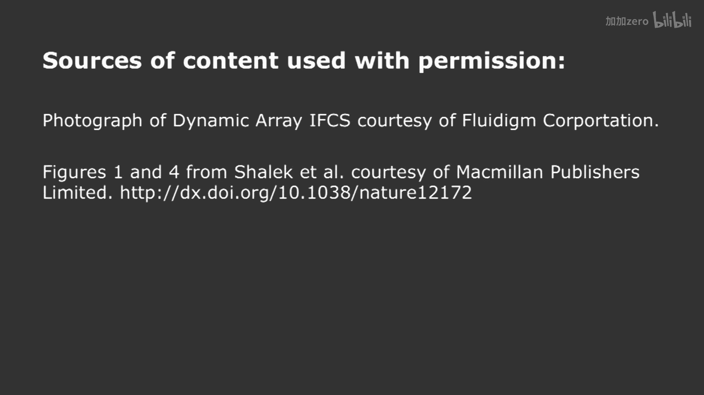

# 【计算与系统生物学基础 7.91J 2014】麻省理工—中英字幕 p08 p7 8. RNA-sequence Analysis： Expression, Isoforms -BV1HdzaYAE2a_p8-

The following content is provided under a creative Commons license。

 Your support will help M I T Open Coware continue to offer high quality educational resources for free。

To make a donation or view additional materials from hundreds of MIT courses。

 visit M T OpenCourseware at OCw。 MT。 Eduu。

Okay， well。Hello everyone and welcome back to computationalut As biology。

 I'm David Gifford and I'm delighted to be back with you today。

We're going to talk today about understanding transcription。

 specifically how we're going to understand transcription is a technique called RNA seek。And。

RNA seekq is a methodology for characterizing RNA molecules through。Nextex generation sequencing。

 And we'll talk first about RNA principles。We'll then talk about how to take the data we learn from RNA C。

 can analyze it using。Tools for characterizing differential gene expression and principal component analysis。

And finally， we'll talk about single cell RNA seekq。

 which is a very important and growing area of scientific inquiry。So first， let's talk about RNA。

 how many people have heard of RNA seek before。How fantastic， how many people have done it before？

Some great。RNA seek is fairly simple in concept。 What we're going to do is we're going to isolate。

RNA species from a cell or a collection of cells in a desired condition。

 and note that we can choose which kind of RNA molecules to isolate。

We can isolate molecules before any selection， which would include molecules that are precursor。

RNARNAAs that have not been spliced yet。Including non coding RNAs， as you probably know。

 the study of non coding RNAs is extraordinarily important。3300 so called long。

 non codinging RNAs have been。Characterized so far， those are non codinging RNAs over 200 bases long。

We'll be talking about those later on。 We talk about chromatin function in the genome。And， of course。

 there are the precursor messenger RNA that are displays turned into messenger RNA that are then translated into protein。

And the specifics of the RNA protocol will give you various of these species。

 depending upon what kinds of purification methodologies you use。But。As you're aware。There are。

Many isoforms that are possible in most of a million genes。

 this is a short summary produced by the Burge laboratory of different kinds of splicing events can occur。

And thepllicing events are often regulated by cis regulatory sequences that live in the introns。

And these introns contain recognition sequences for splicing factors。

AndWhere thispl vector can be conditionally expressed。

 And so you get different combinations of these exons being glued together to produce variant forms of proteins。

So we have to be mindful of the idea that the RNA molecules that we're going to be observing。

 typically are going to be reversed， transcribed。 So we'll see entire transcripts。That。

Came perhaps from distinct exonic locations in the genome。

And the essential idea of RNA seek is that we take the RNA molecules that we care about。

 In this case， we're going to。Purify they wanted have poly tails。We will take those molecules。

 We'll reverse， transcribe them。We'll sequence fragments of them and then map them to the genome。Now。

 if you don't purify for polytails， you get a lot of things mapping into the genome that are inronnic。

 And so you get a lot of data that is very difficult to analyze。 So typically people。呃。

When they're looking for gene expression data， we'll do poly purification。And when you do this。

 when you sequence the result of doing the reverse transcription of these RNA molecules。

 and you map the results to the genome。What you find is data that looks like this。

This is the Sox2 gene。 This is typical expression data。

 You can see all of the individual reads mapping to the genome， the blue and the plus strand。

 the pink on the minus strand。And our job is to take data like this and to analyze it。

Now we can take these data and we can summarize them in various formats。

One way is to simply count the number of times that we see here read at a particular base。

Like like here for this smug1 gene。 And here you see something else going on。

 which is that we have reads。From sequencing experiments， haveve been polyelly purified。

 So we're only seeing the reads occur over the exonic sequences more or less。

 There are a few inronnic reads they' are scattered about。The other thing that we see。

 which is very important， is we see reads。That are split across exons。

Because the splicing event has occurred， the RNA molecule is a contiguous sequence of a collection of exons。

 and sometimes you'll get a read that spans an exon exon boundary。And when we get this。

 you can see in the bottom part of the。Slide that I'm showing you。

 these reads can map across the exons。Typically， in order to get good performance out of something like this。

 we want to use reads that are about 100 bases long， and willll。

Use a mapper that is capable of mapping both ends of a read to account for split reads for these Exxon crossing events。

So that gives you an idea of the kinds of data that we have。And part of the challenge now is。

Looking at how we can。Determine which particular isoforms of a gene are being expressed by evaluating these data。

So。There are two principal ways of going about this。

 One way is we simply take our read data and we use the ideas that we talked about in genome assembly。

 and we assemble the reads into transcripts。That's typically done de Novo。

 There are reference guide assembblers。It has the benefit that you don't need to reference genomes。

 So sometimes when you're working with an organism that does not have a well characterized reference genome。

 you will de novo assemble the transcripts from an RNA seek experiment。

But it also has problems with correctness， as we saw when we talked about assembly。

The other approach， which is more typically used， is to map reads or align the reads to a reference genome and identify the different isoform that are being expressed using constraints。

And ultimately， the goal is to identify the isoforms that quantitate them so we can do further downstream analysis。

And you'll hear about two different metrics sometimes in literature in terms of for expression。

One is the number of reads per kilob of transcript per million reads。Right， so you might have。

 for example， an RPKM metric of 1000。Which means that one out of every thousandth read is mapping to a particular gene。

So it gives you a metric that's adjusted for the fact that longer genes will produce more reads。

An alternative metric is fragments per kilob per million。

 And that's sometimes used when we're talking about pair end data。

And you're considering that you're sequencing both end of a fragment。

 So here we're talking about how many fragments we see for a particular gene per thousand basiss of the gene per million fragments。

Okay， so。The essential idea then is to take the reads that we have， the basket of reads。

Align it to the genome， both to exxons and to exon crossings。And to determine。For a given gene。

 what isoforms we have and what how they're being expressed。 So from here on in。

 I'm going to assume that we're talking about a gene and its isoforms。And， you know。

 that's okay because， and typically， we can map。Reads uniquely to a gene。 And there are details。

 of course， when you have genes there paras that have identical sequences across the genome where this becomes more difficult。

So if we consider this。Once again， we're going to take our reads。We're going map them to the genome。

 and we're going to look for all possible pairings of exons。

 What we would like to do is to enumerate all of the possible isoforms。That are possible。

 given the data that we have。And we can use junction crossing res and other methodologies to enumerate all the possible isoforms。

But what we're going to assume is that we have enumerated all the isoforms。

 and we're going to number them one through n。 So we have isoform 1， isoform 2。

 isoform 3 for a given gene， and what we want to compute for each isoform is its relative contribution to the readed population we're seeing that maps to that gene。

So in order to do that。What we can do is use some constraints。 So if I show you this picture， which。

Sugest that we have possible splice events here for the event C in the middle。 If I told you that A。

 C and E were very highly covered by readeds， you might think that A C and E represented one isoform that was highly expressed。

And so if we think about how to use our readed coverage as a guide to determining isoform prevalence will be in good shape。

 In early， that's the best evidence we have。 We have two sources of evidence， right。

 We have our junction crossing reads。Which tells us which exons are being spliced together。

That helps us both。Compute the set of possible isoforms， and estimate their prevalence。

The other thing we have is the readeds that actually simply cover exons。

 and their relative prevalence can also help us compute the relative amounts of different isoforms。

So in order to do this， we can think about what reads tell us。

 and some reads will exclude certain isoforms。So if we consider the reads that we have。

We can think about reads that。croross particular junctions that are inclusion reads， saying that。

 for example， in this case， the top reads are indicating that the middle white exxon is being included in a transcript。

Whereas。The bottom reads are exclusion reads indicating that that white exxon in the middle is being spliced out。

So what we would like to do then is to build a probabilistic model that takes into account what we know about what a read tells us。

 because each read is a piece of evidence。And we're going to use that read like detectives。

 We're going to go in。 We're going to try and analyze all of the different reads we see for a gene and use it to wait what we think is happening with the different isoformic expressions and the pool of reads that we're observing。

And in order to do so。We will have to build a function that describes the probability of seeing a read。

 given the expression of a particular isoform。 So the essential idea is this。

For the next three slides， I want to build a model of the probability of seeing your read conditioned upon a particular isoform being expressed。

All right。So there are three ways to approach this。 One is that。

I can see a read that I know is incompatible with a given isoform。 And therefore。

 the probability of seeing that read given the isoform is 0。And that's perfectly fine。

And this can either happen with a singleend read。Or with a paired end read。

And it's a conditional probability。 So the probability of seeing read eye， given。Ioform J can be0。

Another possibility。Is that。If I have a transcript， I recall that the transcript has been spliced。

So what we're looking at is the entire sequence of the spliced isoform。And we see a read。

 and the read can land anywhere within that transcript。 It's， let's assume for the time being。

 we're looking at a single ended read。Then the probability of seeing that read land in that transcript is one over the length of the transcript。

Right。At a particular base。So。This。Read is compatible with that transcript。

And we can describe the probability in this fashion。

It's also possible for us to consider paradigm reads。And if we have paradigm reads。

 we can describe a probability function that has two essential components。

 The denominator is still the same。 That is the likelihood of the read aligning at a particular position。

It's going to be one over the length of the entire transcript。The numerator is different， though。

We're going to compute the length of the read that we have or the implied length of the paradigm read and ask。

 what's the likelihood of seeing that？So。We don't know the exact length recall of the insert。

 When we're looking at paradigm reads， we can only estimate how long the fragment is that we're sequencing。

And so we are going to have a probabilistic interpretation of how long the piece of RNA is that we actually wound up sequencing the ends of。

And that is。Placed in the numerator， which scales the1 over else of J。

So this gives us a probability for seeing a read in a particular transcript that accounts for the fact that we have to map both ends to that transcript。

Okay， so we have three possibilities that we've described。

 one where a particular breed is incompatible with a isipor。2， where we had a single end。

Read mapping to an isoform， which is simply one over the length of the isoform。

 And three where we're mapping paradigm reads to an isoform。

 which includes uncertainty about where it will map， which is the one over else sub J。

 and also uncertainty about the length of the fragment itself。Which is encoded in the F function。

 which is a distribution over fragment lines。Okay， so once we have this structure。

 we can then estimate isoor expression。And we talked before when we talked about gypsy class time。

 the idea of estimating。Proports and the essential idea here is that。

If we want to compute the probability of a read， given。In this case。The mixture of isoforms。

That's simply going to be。See what variable did I use？Yeah。Li。

Estimated concentration of that isoform。In terms of Paul building of the Reed。Is。Xin。In that isoform。

So for an individual read， we can estimate its likelihood。Given this mixture。

And then the product around the outside describes how to estimate the probability of the entire basket of readeds that we see with that gene。

What we would like to do is to picksi in this case。To maximize the likelihood of the observed reads。

So what psi is going to do is it's going to give us the fraction of each isoform that we see。

Are there any questions about？The idea of isoform。Quantitation。Yes。诶。

And the last of slide you're describing these three cases for excluded， single， and par。Right so。

We're culating the different probabilities。For。Or both un suited to happen in the transcript over just one。

It depends the second and third cases depending on whether we're analyzing signal into reads or paradigm reads。

OhAnd so we wouldn't use both of them at the same time。 In other words。

 if you only have single end data， you would use。The， the second case that we showed。

 if you had paradigmin data， you use the third case that we showed。Okay， question， yes。

Single then reads case， could you explain the intention？Sure。

The intuition behind that probability is that。We're asking， so here is a transcript。

And we're assuming what is the probability of a read？Given。That it came from this transcript。 Okay。

 what's the probability of observing a particular read and the probability of using at a particular aligning it at a particular position。

He has one over the length of this transcript。And so。The probability actually includes。

The idea of alignment at a particular position in the transcript。Okay。So， yeah， obviously。

 the probability is one， if we assume it comes from here， we don't consider this fact。

 But if we want to ask where it lines up， then transcript is's gonna be one over L sub J。Okay。

Itorgan possible， which gets us to a good point， I you ask that question。Sometimes we would have。

More reads at the three prime end of a transcript than the Phi prime end。Can anybody imagine why。

Yeah， because you're pulling on the poly Yeah， so this is， this actually。Pified by the poly tail。

 And we're pulling on this。 We're purifying by it。 And if there's if there's breakage of these transcripts as it goes through the biochemical processing。

 we can get shorter and shorter molecules。 So we all contain this bit。

And probably contain the whole thing actually decreases。So oftentimes。

 there is three prime bias and RNA seek experiments。 one needs to be mindful of。

But we're assuming today that there isn't such a bias and that probably is equal that map someplace in this transcript。

Okay， does that answer your question， Yes， so I do have one more。

 Can you show us how it extend them the parent。や。reads， right？Like this。嗯。This。

This component is going to be where where it aligns， right。

And then the probability of the length of this entire molecule。啊 is。What I had up there before。

 which is。um。Exactly， how did I do that。嗯。So this is going to be。This is this bit。

 which is the implied length of this。Okay， so if I map。嗯。The left and the right。

 this component is where the left end maps。 Okay， I take the left and the right ends of the read that I have from that。

 from that transcript， and it has a particular length on this transcript。Okay。

Call that length L sub J of r sub I， so its。Now remember。

 that is not the same as the length in the genome。That's the length in this transcript as it is placedd。

Okay， F is going to be the probability distribution of the length of the fragment。

 So let's just say that they're centered around 200 bases。Okay。So。If this is exactly 200 bases。

 it's going to be quite likely。 Okay， But imagine that when I mapped this fragment。

 this wound up being 400 bases apart。Then this distribution mortality， it's very unlikely。

That I would see a fragment。That mapped here and map 400 bases up here because my fragment distribution defined by F is 200 bases。

So it's going to discount that。 the probability of that。So， this term。It's a probability。

Of the read given the transcript。Is。The component of where it's aligning times。

The likelihood that the implied fragment length agrees with what we think we have。Empirically。Okay。

 does that make sense？Okay， those are good questions。Okay， so。Given this framework。

 we can either use E M or other。Machine learning like frameworks to maximize psi and to learn the fraction。

Of expression of each different isoform from the observed data。Given the functions that we have。

And just to give you an idea when this was done for myogenesis。A program called Cuff length。

 which does this kind of process of identifying isoform prevalences。

Was able to identify a large number of transcripts。

70% of the reads were in previously annotated transcripts。But it also found 643 new isop worms。Of。

 of genes in this single time series。And I posted one of the papers。

To describe some of this technology on this stellar site。

But note that certain of the genes have light coverage。

And what we're seeing here is that for genes that are expressed in low copy numbers。

 it's obviously more difficult to get reads out of them。

And I'm presuming in this particular experiment， although I can't recollect that the reason they don't see that many intronic reads is they did polyate purification。

Okay。So。We've talked about how to take our reads。Build a probabilistic model。

 estimate isoform prevalences， and we know how many reads are mapping to a given gene。

The question now is whether or not we see differential expression of a gene in different conditions。

So I'd like to turn to the analysis of differential expression。

 unless there are any final questions about the details of RNA Siq and isoform estimation。

This is your chance to ask those hard questions， yes。I have a really silly question。

 but can you explain really quickly what our eyes form？What nice a form is。Sure。

 an isoform is a particular sp variant of a gene。So a gene that has a particular splicing pattern is called an isopform。

 So imagine we have three exons，1，2， and 3。And。A transcript that has all three would be one isoform。

And another variant that emits two would be a second isoform。

 So just one in three would be an isoform。And each gene has a set of isoforms It exhibits。

 And that depends upon。How it's regulated and whether not any splicing is constitutive。

 it always happens or whether it's regulated。And so in theory， a gene with。

N exon says how many potential isoforms？There's 2 to the M。

Because you can consider each exon being included or emitmitted。Right。

 but that isn't typically the case。 that there are much， many fewer isoforms than that。

But in general， isoform refers to a particular splicive variant of a gene。Yes。嗯。

When you're using single egg or pair end greens， you can get excluded ends， right？

So you can get that in book。Well， it depends once again。

 it's somewhat proboosistic but where the reeds actually hit。Because if all the reads。Only hit exons。

And you didn't hit any junctions。 And none of your paradigm reads crossed junctions。

Then you wouldn't actually have exclusion。Right， but it's possible for using both types of sequences。

Yes， it's possible with both types of sequencing。 In fact， oftentimes。

 what people do is that they will count junction crossing reads if you。

If you have a large enough number of reads in your sequencing， say it 100 base pairs。

 at least then a large number of your reads are going to be a large。

 but a significant fraction will be exxon crossing。

 and you'll be able to count the number of exon exxon junctions you have of different types。

And that will give you an estimate of。How much splicing is going on and will help validate the kinds of conclusions that come out of programs like Cuff links or misso。

 which is another program from the Burge laboratory that is used to estimate isoform prevalence。Yes。

Even given this information， you can't say which exs go with which X？

Necessarily except parawise right， like because the reads in general aren't long enough to span an exxon and therefore we wouldn't know。

 for example， that a given transcript is。Exxons1， five and six。

 you could only know that exons 5 and six went together。

Because that is not strictly true if you have paradigm region your fragments are long enough to span exons。

But in general， you're correct。 And that's why modern sequencing technologies that are coming down the pike that can do 25 kb reads。

Are so important for doing things just like that。Yes。

 is that in your diagram of the read up there are the boxes the actual genome or RNA sequence and the line in between like the artificial linker that you add when you pre That's a good question。

 The questions are these， is this the linker and these are the actual sequences。 No。

 what I'm drawing here is that these are the bits that we actually get to see the sequence of。

 We sequence from the both ends of a molecule。 This is the part of the fragment that we haven't sequenced because our reads aren't long enough。

And so the entire fragment might be 300 bases long。If this is 100 and this is 100。

 then the unobserved part to 100 in middle。Okay， and that's called the insert length。

 the entire length of the molecule。And we get to choose how long these fragments are up to a maximum size。

 Contemporary sequencers don't really like fragments over 1000 bases。

 and the performance starts falling off when you get close to that number， so。

People typically are operating in a more optimalable range of fragments that are few hundred bases long。

Any other questions？Okay。So I wanted to briefly talk about。Hypothesis testing。

 because we're gonna to be needing it。Or determining when things are really differentially expressed。

So I'm just going to show you some data and ask you a few questions about it。 So here are。

Two different。Scatters of data。 which's actually， that's exactly the same data。

 But we have two different fits to it。 We have。2 independent Gaussians that are fit to the data from gene 1 and gene 2。

And another fit uses two Gaussians that have a correlation structure between them。

And the question is whether or not the null hypothesis， or the alternative hypothesis is。

More reasonable。And typically， when we say reasonable。

 we want to judge whether or not it's significant。Significance to talks about what's the chance that the data we saw。

Occurred at random， given the no hypothesis。So what's the chance it was generated by the null hypothesis versus the chance that it was generated by the alternative hypothesis？

Now， the problem is that。Alternative hypotheses typically are more complex。

And a more complex model will always explain data better。

So we need to have a principled way of asking the question。

Given that the alternative hypothesis is always going to do a better job， does do such a better job。

That it can exclude the moral hypothesis at a per particular probability level。Okay。So。

Here are two different models for these data。The null model H0 is they came from two independent Gaussians。

The alternative model， H1 is that they came from two correlated Gaussians。And then we can ask。

Whether or not H1。Is sufficiently more likely to warrant our rejecting H0 and accepting H1。Now。

 as I said， H1 is always going to fit the data better。

So the probability of that collection of points evaluated with the H1 model fit to the data is always going to be superior。

So we need to have a way to compare the probability of the data given H1 versus the data given H 0 in a way that allows us to。

Judge the probability that the data。V H0 occurred at random。In this particular case。

 the data supports H1 and let's see Y。So this is a key idea here。

 How many people have heard of likelihood ratio statistics before。Okay， about half the class， okay。

So here's the idea。The idea is that what we're going to do。I we're going to compute a test statistic。

And the test statistic。It's going be a function of the observed data。It's two times the log。

A probability of the observed data given H1 over the probability of observed data， given H 0。Okay。

Now， we know that this is always going to be。Have a higher value at probability in a denominator。

 So this is always going to be greater than one。So the test statistic will always be greater than zero since we're operating into a log domain。

Okay。The question is。We know that this is always going to be better。

Even when the data was generated from H 0。But when is this sufficiently better for us to believe that H0 is not true。

 and we should accept H1。What we need is a distribution for this test statistic。

That occurred if H 0 was true。And that distribution allows us to compute the probability that an observed value for the test statistics occurred。

 even in the presence of assuming that H 0 was true。Okay， so。

This depends upon the number of degrees of freedom difference between H1 and H0。

 How many degrees of freedom are there in H1。In this model up here。

How many parameters do we get this pick？嗯，6。six。Two means and four covariances。And。4，8，0。So many。

 what's the difference in the number of degrees of freedom between E20， it's  two？

So the test statistic is parameterized by the difference。And number。Of degrees。For freedomom。

And so what we see then is something that looks like this。We see a test statistic。

Where this is the probability of it on the y axis and the testistic on the x axis。

That as the test gets larger or larger， the probability that occurred with age 0 being true gets smaller and smaller。

So let us just suppose that we took our data from our model that we observed。

And we computed the test statistic at a particular value called T observed。

So this is the actual value that we computed out of our likelihood ratio test。

What we would like to ask is what's the probability？That。嗯。Our test statistic。

Is greater than or equal to T observed。Given that H0 is true。Which means that we're going to。

Consider all the tail of this distribution。Because we want to also consider the case where T observe was even greater than what we saw。

And this gives us a way of。Computing the probability that H0 is true， given the test statistic。

And this gives us our P value。Okay。So this is a way of， in general。

 comparing two probabilistic models。And analyzing。The significance of adding extra degrees of freedom to the model。

Typically， what we'll be doing in today's lecture is asking whether or not we。

 if we let the means change， for example， between two conditions。

We get a sufficient improvement in our。Ability to predict the data that our test statistic will allow us to reject the null hypothesis that the means are the same。

I'm going to stop here and see if there are any questions at all about this。Yes。てくさ。就。

Where did the degrees of treatment enter into this great question。

The chi squared tables that you look up are indexed by the number of degrees of freedom of difference。

 Okay， And so whenever you compute a chi squared。You will compute it with a number of degrees of freedom。

Difference。Any other questions。Okay， so。Let's now turn to。Evaluating。RNA seek data once again。

And I'm going to describe a method called DEC。For determining differential expressions。And。

In our analysis。What we're going to do is we're going to let I。Range over。A gene or an isoform。

J is an experiment。And there may be multiple experiments。In the same condition that our replicates。

And。K， I J。I's a number of counts。Observed。For I and。Je。

So that's sort of the expression of gene or isoform I in experiment J。Now what we need to do。

 however， is to normalize experiments against one another。And the normalization factor。

 S sub J is computed for a particular experiment。 It's used to normalize all of the values in that experiment。

And if all the experiments were completely identical。

The redepth was identical and everything was the same， then all of the S ofJs would be one。

If you had an experiment that had exactly twice as many reads。As the other experiments。

 its S sub J would be 2。So this scale factor is used to normalize things in our next slide。

 as we'll see。And the essential idea is that we're going to take the median value。Of this ratio。

And the reason that the denominator is a geometric mean is so that no one experiment dominates the average。

They all have equal weight for the average。 But the geometric mean simply the product of all of the。

Expressions for a particular median gene。Take taken to the。

The root empower power to get them back to the value for a single experiment。

And that is the normalizing factor for the numerator。

 which is the number of counts for a particular gene。Okay。

 so we're just doing median style normalization where S sub J is a scale factor。 Once again。

 if all the experiments were the same， S sub J would be one。

If have one particular experiment had twice as many。

Counts as another experiment uniformly S of J O B2， just for that experiment。

Any questions about this scale factor， yes。Sorry， what is the term on the bottom in this nominator？

That's a normalizing term across。That's the geometric mean of all of the other of all the experiments put together。

Right。So because it's the product of all the experiments， M experiments， then rooted M。

 it's equal to the geometric mean of a single experiment。Any other questions？Yes，izing。

In this particular the case， each one of these is a different replicate。Okay。

 so J is ranging over different replicates。Not over conditions right now。 So each replicate。

 each experiment， gets its own normalizing factor。 We'll see in a moment how to put those replicates together to build statistical strength。

 But we need， since each replic or each has its own red depth。

 we have to normalize each one independently。Okay。So。What we then do。Is we compute。

An expression for a condition。 Now， a condition we're going to call P and Qs of I P。

Is the normalized expression。For。Gene slash isoform。I in condition P。

So a condition may have multiple replicates in it。 So we're going to average over all the replicates。

The average expression， as you can see here。 So we're summing over all the replicates for a given condition。

We're going to take each replicate， normalize it by a scale factor we just computed。And then。

 compute the。Normalize expression。For a gen an isoform。In that particular condition。

Is that clear to everybody what's going on here？Now I'm describing this to you because the key fact is the next line。

 which is that。We compute the mean for a particular replicate。By taking the。

Normallyize expression for a gene， and then reverse correcting it back to scaling it back up again for that particular。

Relicate by multiplying by S sub J。But the most important thing is what's on the right hand side。

 which is that the variance。It's equal to the mean。Plus， this function of。Expression。

And the reason this is important is that most other models for modeling expression data use Poisson models。

And we already seen when we talked about library complexity that Poisson models don't work that well all the time。

So this is using a negative binomial function。 Once again。 we saw negative binomials before。

 We're modeling both the mean and the variance。And the variance is a function。A linear。

 a linear function and a nonlinear function of the mean。

So what was what's going to happen then is we're going to use the negative binomial to compute the probability of observing the data in a given condition。

And we can either combine conditions。And ask what's probably seeing the conditions combined with a single mean invari。

Or we can separate them。Into a more complex H1 hypothesis and ask what's the probability seeing them with separate means and variances and then do a test to see how significant the difference is。

To determine whether or not we can exclude the fact that the genes are expressed at the same level。

And to give you an intuitive idea of what's going on。This is a plot from the paper， showing。

The relationship between mean expression and variance。

Recall for Poisson that variance is equal to mean。 We only have one parameter to tune for Poisson。

 which is lambda。 The purple line is Poisson。And you can check and see that the means equal to the variance in that case。

But D EC does。Is it fits the orange line to the observed data。Yes。

Don't know where the V sub P comes from。That's the function。

 that VP in that equation up there is the function that we're fitting。

 that's the solid orange line to the observed relationship between mean and variance in the data。

Okay， so DEC fits that function。嗯。Edge jar is another technique。

That does not fit and instead uses the estimate that's the dotted line， which isn't as good。

So a lot of people use D E C these days for doing differential expression analysis because it。

Allows the variance to change， as the mean increases。And this is the case for。

These types of count data。Before I go on， though I'll pause into there any questions at all about what's going on here。

Yes。then it is depends fix the data。I'm confused how to exactly that function or where they come from。

You mean the nu， that function is fit， and the paper describes exactly how it's fit。

 which I posted on the stellar site。But it's a nonlinear function of Q in this case。Great question。

 Any other questions。Okay， so once again， we have two hypotheses， the no hypoes that A And B。

Are expressing identically H1， A and B differentially express。

 We can compute the number of degrees of freedom， and we can do a likelihood ratio test if wed like to compute the probability of age 0。

And our model， in this case， is the negative binomial model of the data， which fits the data better。

 And that's why DEC C does a better job than other methodologies， because it provides a。Better。

Approxiation to the underlying noise。And the next slide shows what you get out of this kind of analysis。

 where the little red dots are the dots are the genes that have been called significant using Benjamani Hochberg correction。

 which we talked about previously。And you can see how， as the mean increases。

Required log full log to full change comes down to be significant。

So oftentimes you see plots like this in papers that describe how they actually computed what genes were differentially expressed。

Any questions at all， yes。Significance。That the mean。Why the。Significance is lower。Oh。

 because its as you increase the number of observations， right， you're going to。

 the mean value of theorem is going to cause things to actually get closer and closer to zero。

 And so you need less of a fold change difference to be significant as you get more and more observations。

Any other questions？Okay。So。Now we're going to。Delve in into。One other area。

100 people have done hypergemetric tests before。Okay。

 so we're going to talk about hypergemetric tests。So。Imagine that we have a universe for simplicity。

Of 1000 genes。 Okay， So we have this universe。And we have。B is a set of genes。

That there are 30 of them， and there's another set A。Of which there are 20。

 and the overlap between these two is a total of three genes。So it might be that。

A is the set of genes that are differentially expressed between two conditions。

B is the set of genes that you happen to know have a particular annotation。 For example。

 they are involved in stress response in the cell。 And you'd like to know whether or not the genes are differentially expressed。

Have a significant component of stress or response related genes or whether or not this occurred at random。

Okay。So we need to compute that。So what how many ways could we choose being。Well。If we。

I're going to use， this is N1。And2， this is big N， and this is K， right。

So the number of ways I can choose B is big n， choose n2。That's the number of ways I can choose B。

So you're already with me on that。有。O。How many ways can I choose three elements out of a。

These three that are going to overlap。Well， that's going to be N1， chooses K。

So that's how many ways I can choose these three elements。

And then how many ways could I choose the other elements of B？ So once again。

 I'm figuring out how I can choose B。Well， how can I choose the rest of B， Well。

 how many elements do I have to choose a B here。Well， B is n too big。I've already chosen K of them。

 right？Right。Sorry， it's the other way around。 I the universe I could pick from is。1000。

Whi is all the elements minus the elements of a。But have' already chosen from to get those three。

And then， I need to pick。嗯。The 27 things that don't overlap with a。

So the 27 things that don't overlap with A would be n to minus k。O。

So this is the number of ways to choose B。Given this set of constraints。

This is a number of ways to choose B， given no constraints。So the probability that I have。

Over lap of exactly K is equal to this， which is。How many ways are there with no constraints and how many ways are there。

 given that I have an overlap。All right。And typically， what I want to ask is， what is the。

Probability。That my observed overlap is greater than equal to K。 So in this case。

 the overlap would be 3。But I also would need to consider the fact that I might have 4 or5 or 6。

 which even be more more unlikely， but still significant。 So if you look at the exact computation。

 the probability 3 here， it's 。017， and the probability I have more 3 or more is 0。02。

So that's still pretty significant。 Unlike that would occur by chance。Right？

That I have three or more genes overlapping in this situation is。Could only happen。

Two out of 100 times。Does everybody understand what's going on here？Any questions at all。

 So you're all now hyper geometric whizzes， alright。Fantastic。Okay。Now。

 we're going to turn to a final kind of analysis。 How many people have heard of principal component analysis before。

How people know how to do principal component analysis。A few， okay， great。Yes。未该区。

Where exactly do you use the hypergemetric test？Under what kind of questions are we asking？Typically。

 they overlap questions。 So you're asking。You have a universe of objects， right， like in this case。

 genes， and you have a subset of 20 and a subset of 30。

 Let's say these are the differentially expressed genes。

 These are genes in the stress response pathway。 The overlap by three genes。Does that actually。

 that occur at random or not？Right。If I told you。That。You know。

 there are a much smaller number of genes， and the。

 and the stress response genes were very much larger could be much easier for that overlap to occur at random。

Good question， Any other questions？Okay， so the next part of lecture is entitled。

Multtivariate Gaussians are your friends。 Okay， they are friendly。 They're like a puppy dog。

 They are just wonderful to play with and very friendly。

 And the reason most people get a little turned off by them is because they get this。😊。

The first thing they're shown is this very hairy looking exponential， which describes what they are。

 And so I'm going to shy away from complicated looking exponentials and give you the puppy dog。

 My favorite way of looking at multivariate Gausss， Okay。

 which I think is a great way to look at them， so。😊。

And the reason we need to look at multivariate Gaussians is that they help us understand what is going on with principal component analysis in a very straightforward way。

 And the reason that we want to use principal component analysis is that。

We're going to be able to reveal hidden factors and structures in our data。

 And they're also going to allow us to reduce the dimensionality of the data。And we'll see why。

 in a moment。But， here is the。The friendly version of multivariria Gaussians。And。

Let me describe to you why I think this is so friendly。So。We're all familiar with， right。

 Unidial Gaussians like this。Right， centered 0。They have。A variance one， just very friendly。

Unniate Gaussians。 right， Nobody's familiar with those。Normble distributions。

So let's suppose that we just take a whole collection of those。And we say that。

We have a vector Z that is sampled from a collection of Uniivvaria Gaussians。

It can be as long as we like， okay， but they're all sampled from the same distribution。

And what we're going to say is that our multivariate Gasian X is going to be a matrix times z。Plus。

 a mean。And so what this matrix is going to do is it's going to take all of our single variant。

 all of our unvariate Gaussians and combine them to produce our multivariate Gaussian。Alright。So。

The structure of this matrix will describe how these singlevari Gausss are being mixed together to produce this multivariate distribution。

And you can imagine various structures for this matrix A。Right。And。The covariance matrix， sigma。

Which describes the structure of this multivariate Gaussian。Is shown on this slide。To be equal to a。

A transpose。And thus， if we knew this matrix A。Which we may not know。

 We be able to compute the covariance matrix directly。Okay。Let me take that one more time。

We take a bunch of univariate Gaussians make a vector Z out of them and just for clarity， right。

 or talk about matrices and vectors as rows cross columns， right？So this is n by one。This is N by N。

This is n by one， and this is n by one。 That's the dimensionality of these various objects we're dealing with here。

So we get this vector of univariate Gaussians。 We apply this matrix and to combine them together。

 We get out our multivariate Gaussian， offset by some mean。Is everybody happy with that so far？Yes。

 no。You're suspending disbelief for the next slide。O。Well。Here's。The next thing I'd like to。

 to say is that。The variance。Of a vector。Call it。诶。We'll call it V。Times x。

 which is a random variable。Is going to be equal to x is derived from。This distribution。

V transpose sigma V。And the demonstration of that。Is on。The top of this page。So。

The variance of this vector。嗯。Sorry， the。The projection of this random variable onto this vector is going to give you a variance in this direction。

Is that。Product。So。What we would like to do is this。We would like to find。VI， which are vectors。嗯。

To maximize。Variance。Of。嗯。V I。Transpose x。Such that。V I transpose V I is equal to one。

 In other words， they unit like vectors。So。These are going to be called the eigenvectors。And。

If we think about。The structure that we desire。What we'll find is that。

They satisfy the constraint that the covariance matrix。

Times an eigenvector is equal to the eigenvalue associated with that vector。Times the vector itself。

And with a little manipulation， if we multiply both sides by V I transpose。

The I equals the I transpose。Fund eyes at the square the eye。And we move these guyss around。

VI transpose sigma of V is equal to。These two guys multiplied together， equal one。Lund I squared。

This。We see up above is equal to the variance。When it's projected in the direction of V。

And so lambda I squared is simply the variance associated with that direction。So。

The question then comes， how do we find these things？How do we discover these magic eigenvectors？

Third。Directions in which。This multivariate Gaussian has its variance maximized。And we can do this。

Bye。Singular value decomposition。So we can compute this covariance matrix。So we compute。

Sigma from the data。And then we do a singular value of decomposition。Such that sigma is equal to U。

Hue transpose。And that's what the singular value decomposition does for us。

 is it decomposes the sigma matrix into these components。For S is a diagonal matrix。

That contains the eigenvalues。And。U is a column。 Each column is an eigenvector。

So in doing a singular value decomposition， we get the。Eigenvalues。 and the eigenvectors。

The other thing you recall was that sigma was equal to a A transpose。 when we started off。

 A was the matrix we used to make our multivariate Gaussian out of our univvariate Gaussians。

And thus， what we can observe is that our multivariate Gaussian x is equal to。You。S to the one half。

Time Z plus a mean。So here is what's going on when we make a multivariate Gaussian。

Its we're taking a bunch of Univarian Gaussians。We're scaling them。And we're rotating them。Okay。

And that makes a multivariate Gaussian。 And then we offset this whole thing by a mean。

Because we also have to do rotations around the origin。

So the way I think about multivariate Gaussians is that it is a scaling and a rotation of univariate Gaussians。

And implicit in that scaling rotation is the discovery of the major directions of variances in the underlying data。

Is represented by the eigenvectors。And the eigenvalues tell you how much of the variance is accounted for in each one of those dimensions。

Are there any questions about that？I hope there are， yes。How do you compute Sigma from the data？那这个。

singularing I composition，How do you compute sigma from the data？The first step that。Is shown。

On an equation 7。So it can compute the means。And you know you have x， which are observed values。

 So you compute that expectation。 and that is sigma。Okay。Good question。 Any other questions。Okay， so。

We have these eigenvectors and eigenvalues which represent the， the。

The vectors of maximum variance in underlying data。And， you know。

 we can use these to organize data by projecting。Observations onto these。Eigenvectors。

Or they're sometimes called principal components。Defined dimensions of variability that help us。

Organize our underlying data。We'll come back to that in a moment。Okay。

Any other questions about principal component analysis。Yes，Yes， easy expectations。

I'Not sure what that means， but it's the average。Expected value。O。 so in the case of。Computing sigma。

 you would compute the expected value of that of that。

Inter equation across all the data points that you see。

So you'd sum up all the values and divide by the number of things that you had。Any other questions？

Okay。So just for calibration for next year。How many people think they got a general idea of what。

Princip component analysis is general idea。啊。How many people， you know。

 thought it was really interesting it were sort of completely baffled about halfway through。Okay。

All right。 Well， I think that recit can help with some of those questions。

 but if anybody has a question you'd like to ask now， no， it's that far gone。It's。I mean。

 the thing with with this sort of analysis is that if your matrix algebra is a little rusty。

 then when you start looking at equations like that， you sort of can get。A little loss sometimes。

Alright， well， let's turn then。If there aren't any brave soul who wish to ask a question。

Will'll turn to。Single cell RNA C analysis。So I'm a firm believer that single cell analysis of biological samples is the next big frontier。

And。It's being made possible through devices like this。 This is a flu I C 1。Chip。

 which has 96 different reaction wells， which allows you in each well to process a single cell independently。

And the little lines are ways to get reagents into those cells to do things like。Produce RNA seekQ。

Ready materials。And when you do single cell analysis。

You can take apart what's happening in a population。So an early paper asked some fairly。Fundamental。

 but。Simple questions。For example。If you take。2，10000 cell aloqus of the same culture。

And you profile them independently。And you ask， how well to the expression values for each gene agree。

Between sample A and sample B， you expect there to be a。

Very good agreement between sample A and sample B and these 10000 cell cultures。A second question is。

 now， if you take。Say， 14 cells from those cultures。 and you profile them independently。And you ask。

 how well do they correlate with what you saw in the 10000 cell experiment。

That will tell you something about the population heterogeneity that you're observing。

Because if they correlate perfectly。With the 10000 cell experiment。

Then you really know that there's no point in looking at individual cells in some sense。

 because they're all the same。 See one， seen them all， right。

But if you find that each cell has its own particular expression fingerprint。

And what you're seeing in the 10000 cell average experiment。Wips out those fingerprints。Then。

 you know， it's very important to analyze each cell individually。So。

The analysis that was that was done exact asked exactly that question。

 So here's what I'll show you in these plots， so。Here is。On the upper left。

The 10000 cell experiment versus the 10000 cell experiment。 And as you can see。

The correlation coefficient is quite  high。98 and。Looks very， very good。Of。

Experiment 1 versus experiment2， or rep1， rep 2。Here is。A separate experiment。

 which is looking at two individual cells。And asking。Andm plotting for each gene。

 the expression in one cell versus the gene in the other cell。

And you can see that the correlation coefficients 。54， and there's actually fairly widespread。

 In fact， there are genes that are。Expressed in one cell that are not expressed in the other cell and vice versa。

So the expression of these individual cells is quite divergent。And the final panel shows how。

Down here。How a single cell average。On the Y axis relates to the 10000 cell experiment。

But given the middle panel， the panel B there that is showing the fact that two single cells don't really relate that well to another。

 It begs other questions。 For example， are the isoforms of the genes that are being expressed are the same in those。

Distinct selves。And so， panel D。Shows is forms that are the same across each one of the single cells being profiled。

 which is the solid bar at the top。And the bottom。Couple of rows in figure D are the 10000 cell experiment average。

My panel E is the most interesting， perhaps， which is that the isoforms for those four genes。

Are being differentially expressed in different individual cells。

And that's further supported by taking two of those genes and doing fluorescent inciu。

Hissttochemistry and microscopy。 And looking at the number of RNA molecules for each one of those。

And noting that it corresponds to what's seen in the upper right hand panel。So， we see that。

In individual cells， different isoforms are being。Expressed。Now。

 these cells were derived from bone marrow， and they're exposed to a lipop polylysaccharide to activate an immune response。

So they are clearly not all behaving exactly the same。And to further elucidate this。

Authors of this paper took。Li。Gene expressions that they saw for a given cell as a large vector and compute the principal components。

And then projected the cells into the first and second principal component or eigenvector space。

And as you can see， there is a distinct separation of three of the cells from the rest of the cells。

Where three of the cells， which correlate well with principle component 1。

 are thought to be mature cells。That express certain cell surface proteins。

 whereas the ones on the left， the maturing cells， the triangle depicted cells。

Express certain cytokines under the maturing legend there on the clusterogram on the right hand side。

And。Thus， the first principle component was able to separate。

Those two different broad classes of cells。So it looks like there are at least two different kinds of cells in this population。

And then the authors asked another question， which is。Can they take individual cell data。

And look at the relationship between pairs of genes to see which genes are coexed。

And the hypothesis is that genes that are co expressed in individual cells make up individual regulatory circuits。

And so they hypothesize that the genes LR F 7 and I Fi 1 and Stat 2 and LRF 7 are all in antiviral regulatory circuit。

They then asked the question， if they knocked out L RF 7。

 which is the second panel on the right hand side， would they alate downstream gene expression。

 and they partially did。And they thought that。Since Stat 2 and L R R 7 are both thought to be the regulators of the circuit。

 and they're both downstream of the interferorum receptor。

 They thought if they knocked out the interferorum receptor。

 they would abbllate most of the antiviral cluster， which， in fact， they did。

So what this is suggesting is that first。Single cell analysis is extraordinarily important to understand what's going on in individual cells。

 because in a cell culture， the cells can be quite different。And secondarily， it's possible within。

The context of individual single cell analysis to be able to pick out regulatory circuits。

That wouldn't be as evident when you're looking at cells in mass。And， finally。

I'll thank Mike for the next two slides。I wanted to point out that quality metrics for RNA seek data for single cells is very important。

 And we talked about library complexity earlier in the term。 And here， you can see that。

As library complexity increases expression coefficient of variation， which is the。

Sner deviation over the mean comes down as you get sufficient library complexity。 and furthermore。

As library complexity increases， mean expression increases。

And the cells that are in red were classified as bad by microscopy。From。

The fluid I instrument processing step。So I think you can see that single cell analysis are gonna be extraordinarily important。

And can reveal a lot of information that is not present in。These。Large batch experiments。

And it's coming to a lab near you。So on that note， I'll thank you very much for today。

 and we'll see you later in the term， and Professor Burge will return at the next lecture。

 Thanks very much。

