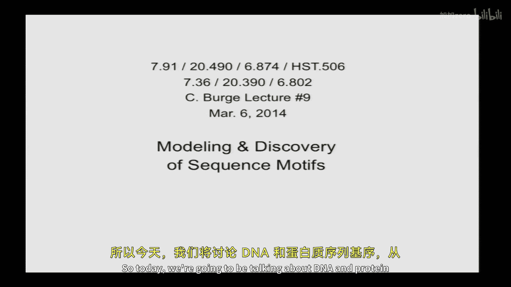

# 【计算与系统生物学基础 7.91J 2014】麻省理工—中英字幕 p09 p8 9. Modeling and Discovery of Sequence Motifs -BV1HdzaYAE2a_p9-

The following content is provided under a creative Commons license。

 Your support will help M I T Open Coseware continue to offer high quality educational resources for free。

To make a donation or view additional materials from hundreds of MIT courses。

 visit M T OpenCourseware at OCw。 MT。 Eduu。

All right。We sit down， we should get started。So it's good to be back。

We'll be discussing DNA sequence motifs。YeahOh yeah， we were。IfYou're wondering， yes。

 the instructors were at the awards on Sunday。 it was great。 The pizza was delicious。So， yeah。

 so today we're gonna be talking about DNA and protein sequence motifs， which are。

Essentially， the building blocks of regulatory information in a sense。Before we get started。

 I wanted to， to see if there are any。Questions about material that Professor Gifford covered from the past couple days。

 no guarantees I'll be able to answer them， but just sort of general things related to transcriptome analysis or。

PCA， anything， hopefully you all got the email that he sent out about。Basically。

 what you're expected to to get。 So at the level of the。嗯。They document that's posted。

 that's sort of what we're expecting。 So if you haven't had linear algebra。

 that should still be accessible， not necessarily all the all the derivations。

Any questions about that？Okay， so as a reminder， team projects， your aims are are due soon。

 we'll post a slightly there's been a request for more detailed information on what we'd like in the aims。

 so we'll post something more detailed on the website this evening and probably extend the deadline a day or two just to give you a little bit more time on the aims。

 so after you submit your aims。This is students who are taking the project component of the course then。

Your team will be assigned to one of the three instructors as sort of a mentor advisor。

 and we will schedule a time to meet with you in the next week or two to discuss your aims just to sort of assess the feasibility of the project and so forth before you sort of launch into it。

Alrighty， so any questions from past lectures。All right。

 so today we're going to talk about modeling and discovery of sequence motifs。

We'll give an example of a particular algorithm that's used in motif finding called the Gib sampling algorithm。

 It's not you know the only algorithm， it's not even necessarily the best algorithm。

 It's pretty good。 It works in many cases。It's an early algorithm。

 but it's interesting to talk about because it sort of illustrates the problem in general。

 and also it's an example of a stochastic algorithm。

 an algorithm where you what it does you is determined sort of at random to some extent and yet still often converges to a particular answer。

 so it's interesting from that point of view and we'll talk about a few other types of motif finding algorithms and we'll do a little bit on statistical entropy and information content。

 which is a handy way of describing motifs and talk a little bit about parameter estimation。As well。

 which is critical when you're。When you have a motif and you want to build a model of it to then discover additional instances of that motif。

 So some reading for today， so I posted some nature biotechnology primers on motifs and motif discovery。

 which are pretty easy reading。The textbook Chapt 6 also has some good information on motifs。

 encourage you to look at that， and I've also posted the original paper by Bailey and Elkin on the Me algorithm which is kind of related to the Gib sampling algorithm but is uses expectation maximization and so it's a really nice paper take a look at that and I'll also post the original Gib sampler paper later today。

AndThen on Tuesday we're going to be talking about Markov and hidden Markov models。

 and so take a look at the primer on HMs as well as there is some information on HMs in the text。

It's not really a distinct section。 It's kind of scattered throughout the text。

 So the best approach is to sort of look in the index for HMMs and。You know。

 read the read the relevant read the relevant parts that you're interested in。

 and if you really want to understand the mechanics of HMs and how to actually implement one in depth。

 then I strongly recommend this rabinar tutorial on HMs， which which is posted。 so everyone please。

 please read that I will use。The same notation。To the extent possible as the Ravear paper when talking about some of the algorithms used in HMs in lecture。

 so it should synergize well。All right， so what is a sequence motif？And sort of in general。

 it's a pattern that's common to a set of DNA， RNA or protein sequences that share a biological property。

 So， for example， all of the binding sites of the M transcription factor you know。

 that there's probably a pattern that they share and that you call that the motif for M。

 can you give some examples of。Where you might get。DNA motifs or protein motifs， anyone。

Have another example of a type of motif that would be interesting。

What about one that's defined on function。 Yeah， go ahead。 What's your name，Yeah。

 so each kinase typically has a certain sequence motif that determines which proteins it will。

 it will phospholate。Other other examples。 Yeah， so in that case。

 you might determine by functionally， you might purify that protein。

 incubate it with a pool of peptides and see what gets phosphoated， for example， Yeah， in the back。

Tages and promoters。What was the first one promoter oh that one that was my name Yeah okay。Yeah。

 and so promoter motifs， sure， some examples。For corporate money。Conservation mining Science。Yeah。

 and so you had identify those how。By looking at sequencestream upstream genes。

Seeing what different sequence have in common。Right， so I think there's at least three ways。Okay。

 four ways I can think of identifying those types of motifs。

 That's probably one of the most common types of motifs encountered in molecular biology。

 So one way you take a bunch of genes。Where you've identified the transcription start site。

 you just look for patterns， short subs sequenceequences that they have in common。

 would that might give you the ta tab box。 for example， Another way would be。

 what about comparative genomics， You take each individual one。

 look to see which parts of that promoter or conserved that could also help you refine your motifs。

Protein binding， could do chippsse， that could give you motifs。And what about a functional readout。

 You clone a bunch of random sequences upstream of a Lucciferase reporter。

 see which ones actually drive expression for， you know， for example。 So that would be another。 Yeah。

 absolutely。 So there's there's a bunch of different ways， to define them。

 So and then in terms when we talk about motifs， there are several different。

Sort of models of increasing resolution that that people that people use。

 So people often talk about a talk about the consensus sequence。 So you say the tata box。

 which of course。Is the actual， you know， describes the actual motif， T A T A A A。

 something like that。 But that's really just the consensus of a bunch of tata box motifs。

 You rarely find the perfect consensus in real promoters。 you know。

 the real naturally occurring ones are usually one or two mismatches away。

 So that doesn't fully capture it。 So sometimes you'll have a regular expression。

 So an example would be， if you were describing。Mammalian five prime splicite。

 you might describe the motif as GT。A or G。A GT， or sometimes abbreviated GT， R， A GT。

 where R is shorthand for either purine nucleide， either A or G， those are you can have an N。

 some motifs， you could have G T， N， N， GT or something like that。

Those can be captured often by regular expressions in， in a language。

 a scripting language like Python， a pearl。 another very common。

De of motifs would be a weight matrix。 So you'll see。

A matrix where the width of the matrix is the number of bases in the motif。

 And then there are four rows， which are the the four bases。 We'll see that in a moment。

 Sometimes these are described as。Position specific probability matrices or position specific score matrices。

 We'll come to that in a moment。 And then they're more complicated models。

 So it's increasingly becoming clear that that the simple weight matrix is is too limited and doesn't capture all the information that that's present in motifs。

So， yeah， we talk about where do motifs come from。 These are just some examples。

 I think I talked about。All of these， except for in vitro binding， right？

In addition to doing alippsse where you're looking at the binding of the endogenous protein。

 you could also make recombinant protein， incubate that with a random pool of DNA molecules。

 pull down and see what binds to it， for example。Okay。So why are they important？

They're important sort of， sort of for obvious reasons that that they can identify proteins that have a specific biological property of interest。

 for example， being phopho related by a particular kinase or promoters that have a particular property。

 that is that they're likely to be regulated by a particular transcription factor， etc ceter。

 And ultimately。If you're very interested in the regulation of a particular gene。You know。

 knowing what motifs are upstream。And how strong the evidence is for each particular transcription factor that might or might not bind there can be very useful in understanding the regulation of that gene。

And they're also going to be important for efforts to model gene expression。

 So a goal of systems biology would be to predict， you know， from a given starting point， if we。An。

Introduce some perturbation， for example， if we knock out or knock down a particular transcription factor or overexpress it。

 how will that， you know， how will the system behave。

 So you'd really want to be able to predict how the occupancy of that transcription factor would change。

 You'd want to know first， where it is at endogenous levels and then how its occupancy at every promoter will change when you perturb its levels and then what。

 what effects that will have on the。On expression of downstream genes。

 So these of know these sorts of models all require really accurate descriptions of of motifs。Okay。

 so these are some examples of protein motifs， Anyone。Recognize this one。What motif。

So this has x's would being to generate positions and C's would be6ines and h's with theine course。

What is this， What is this？The protein has those what can you predict that dysfunction？

So this is the most commonly seen in DNA binding transcription factors。And it coordinates the ininc。

What about。What about this one， And guess is on what this motif is。

 So this this is quite a short motif。Yeah。How do you know that。嗯。Okay。

 so you need even know what that's sort of you。Serine。

3ning and tyceine are the residues that get phosphorylated。

 And so if you see motif with a serine in the middle， it's a good chance。 it's a。

Fosspho relations site。Here are some。You can think of them as DNA sequence motifs because they occur in genes。

 but they of course， function at at the RNA level。 These are the motifs that occur at the boundaries of mammalian。

Introns。 So this first one is the five times pcentl。 So the last these would be the basis that occur。

 The last three basiss of the exon。 The first two of the intron here are almost always G T。

 And then you have this position that I mentioned here that's almost always a or G a position and then some positions that are bias for a。

 bias for G and then slightly biased for T。 And that is what you see when you look at a whole bunch of。

5 prime ends of mammalian introns。 They have， they have this motif。

 So some will have better matches or or worse to this particular pattern。 And that's sort of the。

 the average pattern that you see。 And it turns out that in this case。

The recognition of that site is not by a protein per se， but it's a ribucclear protein complex。

 So there's actually an RNA called U1 S an RNA that base pairs with the five prime splicite。

 and its sequence or part of its sequence is perfectly complementary to the consensus5 prime splicide。

 So we can understand why5 times splic sites have this motif。

 They're evolving to have a certain degree of complementarity to U1 in order to get efficiently recognized by by the splicing machinery。

 Then at the three prime end of introns。 you see this motif here。

 So here's the last base of the intron G and then an A before it。

 almost all introns have end with AG。 Then you have a periiding ahead of it。

 Then you have basically in irrelevant position here at minus。4。

 which is doesn't is not strongly conserved。 And then a stretch of residues that are usually but not always pyids called the primymidine tract。

 And in this case。The recognition is actually by proteins rather than RNA。

 And there are two proteins called one called U2 AF 65 that binds the primiting tract and one U2 AF 35 that binds that last Y A G motif。

 And then there's an upstream motif here。 This is just upstream of the three prime splicide that is quite degenerate and hard to find called the branch point motif。

Okay， so well let's take an example So that the5 frame splic site is。

 a nice example of a motif because it's。You can uniquely align them， right， You can。

 you can sequence Cs， sequence genomes， align the C DNA to the genome。

 That tells you exactly where the splice junctions are。

 And you can take the exons that have a five times splicite and align the sequences， you know。

 aligned to the exxon intron boundary and get get a precise motif。

 And then you can tally up the frequencies of the of the base and make a table like this。

 which we would call。A position specific probability matrix。And what you can then do to。

Pdict additional， say， five times splicite motifs in other genes。 for example。

 genes where you didn't get have good CDN coverage because let's say they're not。

 they're not expressed in the cells that you analyzed。 You could then make。This。

 this odds ratio here。 Okay， so here we have a candidate sequence。

 So the motif is of length It's 9 positions， often numbered like-3 to -1 would be the exic parts of this。

 And then plus1 to plus 6 would be the first six bases of the intron。

 That's just the convention that's used。 I'm sure。It's going to drive that computer science is crazy because we're not starting at zero。

 but that's usually what's used in the literature and so we have a nine based motif and then we're going to calculate the probability of generating that particular sequence S。

😊，Given plus， meaning given our， our foreground or motif model， Okay。

 as the product of the probability of generating the first base of the sequence S 1。

Using the the column probability in the -3 position。 Okay， so if it's， if the first base is you know。

 A C， for example， that would be 04。 and then the probability of generating the second base in the sequence using the next column and so forth。

 Okay， so it's basically just a。If you made a vector for each position that was that had a one for the base that occurred at that position and a 0 for the other bases。

 And then you just did the dot product of that with the matrix。 you would get， You get this。 Okay。

 so that we multiply probabilities。 So that is assuming。Independence between positions。 Okay。

 And so that's a key assumption。 weight matrices assume that each position in the motif contributes independently to the overall strength of that motif。

 And that may or may not be true。 They don't assume that it's homogeneous， that is you have。

Usually in a typical case， different。Probabilities in different columns。 So it's inimgeneous。

 but but assumes independence。 And then you often want to use a background model。For example。

 if your genome composition is 25% of each of the nucles。

 you could just have a background probability that was equally likely for each of the four。

 and then calculate the probability S given minus of that generating that particular nimar under the background model and take the ratio of those two。

 And the advantage of that is that then you can find sequences that are sort of that ratio。

 it could be 10 times more like a 5 he slicea than you know than like background or10 times or you have some sort of scaling on it。

 whereas if you just take the raw probability you know。

 it's gonna be something that's on the order of。One quarter to the 9。 So some very。

 very small number that's a little hard to work with。Okay， so when people talk about motifs。

 they often use language like。Exact or precise versus degenerate， strong versus weak。

 good versus lousy， depending on the context， who's listening。So， you know。

 an example of these would be a restriction enzyme。 You often say。

 you know restriction enzymes have very precise sequence specificity。 they only cut， you know。

 E R 1 only cuts at GA A TTC， whereas you know， to up binding protein is somewhat more degenerate。

 it'll bind to a range of a range of things。 are you degenerate there。

 you could say it has a weaker motif you'll often if you want to try to make this precise。

 then the language of entropy and information offers。Additional terminology。

 like high information content， low entropy， etc cetera。 Okay。

 so let's take a look at at this as perhaps a more natural。Or more precise way of describing。

What we mean here。 So imagine you have a motif。 We're gonna do a motif of length 1。 Okay。

 just keep the math super simple。 Okay， but you'll see it easily generalizes。

 So you have probabilities of the four nucleotides that are P K okay and you have background probabilities。

 Q K。 And we're going to assume that those are all， it's uniform。 They're all a quarter。 Okay。

 So then。😊，The statistical or Shannon entropy of a probability distribution or vector of probabilities。

 if you will， is is defined， is defined here。 So H of。Q， where Q is a distribution。 or in this case。

 vector is defined as minus。The summation of Q， K log。Q K in general。

 And then if you want it to be in units of bits， you'd use a log base 2。 Okay。

 so how many people have seen this equation before。Moote like half I'm going to go with。 Okay。

 good so。Who can tell me why， first of all， is this a positive quantity， negative quantity。

 non negative？啊，对。Love QK is always going to be negative。

 and so therefore you have to take the negative of the sum of all of negative。Right。

 so this in general is a non negative quantity because we have this minus sign here。 right。

 We're taking logs of things that are between 0 and 1。

 So they tend to be negative the logs are negative， right， Okay， and then what would be the entropy。

 if I say that the distribution Q is。This， 01，0，0。Meaning。It's a motif that's 100% C。

What is the entropy of that？嗯。好先。あ不は。So the entrytropy will be0 because the vector is determin。Right。

 and we do the math， you'll get for the C term， So you have minus， you'll have a sum。

 You'll have three terms that are 0， log 0。It might crash your calculator。 Yes。

 and then you'll have one term。 that's one。Log1， right。And so one log1， that's easy。 that's zero。

 right。This， you could say， is undefined， but。But using low pro rule， you know， by continuity。

 you know， X log X， you take the limit as x gets small is 0。 Okay。

 so this is defined to be 0 in information theory。 Okay， and this is always always0。 Okay。

 so that comes out to be to be 0。 So it's deterministic。 So entropy is a measure of uncertainty。

 And so that sort of makes sense。 If you know what the basis， there's no uncertainty， entropy。

 entropy is 0。 So what about。What about this vector。A quarter。A quarter。25% of each of the bases。

What is。H andQ。Anyone。I'm going to make you show me why。嗯。じです。啊未来。

Okay because the log of forces was going to be。啊。We'll point that by fourth。

There are going to be four terms that are one quarter times log of a quarter。This is -2。

 quarter times -2 is  half， Four times - a half is -2。

 And then you change the sign because there's this minus in front here， right， So that equals 2。

 Okay， And what about， what about this one。Anyone see that one？This is a coin flip， basically。

 do have energy。以住佢话。Anyway。Maybe I going to do something， that's one okay。And why。

 because you have two terms of zero log zero， which is zero。Two terms of。我会儿。

There two terms of one hand。拉人房间。你如话。so check like that and then there's two terms that are something that turns out to be00 log 0。

 right， and then there's a minus。In front，Okay， so that will be one。

So a coin flip has1 bit of information。 So that's basically what we mean。 if you're。

 if you have a fair coin and you don't know what the outcome， We're gonna call that one bit。

 And so a。A base that could be any of the four， equally likely， has twice as much uncertainty。嗯。

Allright， so。And this is related to the Bolzman entropy that you may be familiar with from statistical mechanics。

 which is the log of the number of states in that if you have n states and they're all equally likely。

 then it turns out that the Shannon entropy turns out to be log of the number of states。

 Okay we saw that here。 four states equally likely comes out to be log of log of four or two。

And that's true in general。Alright， so you can think of this as a generalization of。

 of Bolzman entropy， if you want to。Okay， so why let's see。Why did he call it entropy？

 So it turns out that that Shannon， who was developing this in the late 40s sort of developing a theory of communication had some。

 you know， scratched his head a little bit。 And he talked to his friend。John Von Neuman， okay。

 than him involved in you know， inventing computers。 And he says， my concern was what to call it。

 I thought of calling it information， but the word was overly used。 Okay， so back in 1949。

 information was already overused and。And so I decided to call it uncertainty。

 and then he discussed it with John Vanon Neumman and he had a better idea。 he said。

 you should call it entropy in the first place， your uncertainty function already has already been used in statistical mechanics under that name。

 so it already has a name in the second place and more important。

 nobody knows what entropy really is。 So in a debate you always have an advantage。

So keep that in mind。 So start， you know， after you taking this class， just start throwing it around。

 Okay， and you will win a lot of debates。Alright， so information。

 So how is information related to entropy so。The way we're going to define it here。

 which is how it's often defined， is information is reduction in uncertainty， okay so。

If I'm dealing with a unknown DNA sequence， the Lada age genome， and it has 25% of each of each base。

 If you tell me， I'm going to send you two bases， I have no idea。 They could be any pair of bases。

 my uncertainty is two bits per base。 Okay or four4 Bs before you tell me anything。

 If you then tell me。It's， you know， it's the T A motif， which is always T， followed by a。

 Then nowly uncertainty is 0。 Okay， so the amount of information that you just gave me。Is is 4 bits。

 You reduce my uncertainty from 4 bits to 0。 Okay， so we define the information at a particular position as the entropy before。

 like before meaning the background， the background is sort of your null hypothesis。

 minus the entropy after。 So after you've told me that this is an instance of that motif。

 And it has a particular model。 Okay， so in this case， we have， you can see the。

Entropy is going to be entropy before。 This is just H of  Q right here。 this term。

 and then minus this term， which is H of of P。 Okay， So if it's uniform。

 we said H of  Q is 2 bit per position。And so then it's just you just take so the information content of a motif is just2 minus the entropy of that motif model。

In general， it turns out if the positions in the motif are are independent。

 then information content of the motif is 2 w minus H of the motif where W is the is the width of the motif。

 Okay， so for example。Entropy of the motif of。We said the entropy of this。Is two Bs， right。

 therefore， the information content。Is what。If this is our， let's say this is our pe。It's张。

It's verygene。What is its information content？0， y is0。Yeahな。The integration content of that zero。

Content of the Melbourne associated， so sorry， wasn in there too。そ minus twoょ。The entropy。

 the backgrounds too and entropy of this is also two so a nice to0。And what about this。

 let's say this was our motif， it's a motif that's either A or G。We said the。

The entropy of this is one B。 So what is the information content of this motif？W one why么。

Someone background is to get entry here background to and one is one and what about if I tell you？

It's the EO R 1 restriction enzyme。 So it's G， A， A T T C， a six base motif precise。

 It has to be those bases。What is the information content of that motif？And it's 12， 12， 12 what。

 12 bits pocket， and why that， because the background is two times6。

So six spaces and two bits for each。你还要啥。All the basics are determined in the specific portion。

 so the information of that is entropy that zero the entropy of that motif is。Is 0。 You imagine 4096。

 you know， possible 6 mers。 one of them has probably one。 all the others have 0。

 You're gonna have that big sum。 You only there' only， you know， they're all gonna be。

 It's gonna come out to be 0。 Okay， so why， like， why is this useful at all， or is it。

One of the reasons why it's useful。嗯。Sorry， that's on a later slide。

Just hang with me and it will be clear why it's useful in a few slides， okay。But for now。

 we have a description of information content。 So the ER one site has 12 bits of information。

 a completely random position has zero and a short like a four cutter restriction enzyme would have two times4 or8 bits of information right and an eight cutter。

 So you can see as the restriction enzyme gets longer， more information content。Alright。

 so let's talk about the motif finding problem。 And then we'll return to the usefulness of information content so。

Can everyone see the motif that's present in all these sequences？Maybe if anyone can， please let out。

 probably can't。 Okay now， what now， these are the same sequences that I've aligned them。

Can anyone see a motif？好清楚。Yeah， I heard some cheeses， right so there's this moique that's。

It's over here。 It's pretty weak and pretty degenerate。 You， there's definitely some exceptions。 But。

 you know， you can definitely see that a lot of the sequences have like at least G GC。

 possibly an A after that。 Okay， right， so this is the， you know。

 this is the problem that we're dealing with， right。

 You have a bunch of promoters and the restrictions the sorry。

 the transcription factor that that binds maybe fairly degenerate。😊。

Maybe because it likes to bind cooperatively with several of its buddies。

 And so it doesn't have to have a very strong instance of， of the motif present。

 And so it can be quite difficult to find。 Okay， so that's why there's a real， you know。

 bioinformatics challenge。 Mot finding is not done by。L， you know。

 lining up sequences by hand and drawing boxes， although that's how the first motif was found the tata box。

 That's why it's called the Tata box because someone just drew a box in a sequence alignment But you know。

 these days， you need a computer to find you know， most。

 most motifs require some sort of algorithm to find。Alright， so， so yeah。 and like I said。

 it it's essentially。A local， multiple alignment problem， right， You want a multiple alignment。

 but it doesn't have to be global， right， It just can be local。 It can be just over a sub subregion。

Alright， so theyre， they're basically。3， at least three different sort of general approaches to the problem of moti finding。

 One approach is the so called enumerative or dictionary approach。 Okay， And so in this approach。

You say well。We're looking for a motif of length 6， because。You know， this is a。

Lucy and zipper transcription factor that we're modeling。

 and they usually have binding sites around 6。 so we're going to get six。

 and we're going to enumerate all the sixmerRS。 there's 4096 DNA SixmerRS。

 We're going to count up their occurrences in a set of promoters that， for example。

 are turned on when you overexpress this factor and look at those frequencies divided by the frequencies of those sixmerRS in some background set。

 either random sequences or promoters that didn't turn on or something like that。

 you have two classes and you look for statistical enrichment。This approach， this is fine。 This is。

 there's nothing wrong with this approach。 People use it all the time。 The one of the downsides。

 though， is that。You're doing a lot of statistical tests， right， You're essentially testing each six。

 like you like you're doing 4096 statistical tests。

 So you have to adjust the statistical significance for， for the number of tests that you do。

 And that can， you know， that can reduce your power。 So that's， that's one sort of main drawback。

 the other。The other reason is that maybe， you know， maybe you don't see。

Maybe this protein binds a rather degenerate motif。 and a precise smer is iss just too precise。

 None of them will occur often enough。 You really have to have sort of a degenerate motif That's。

 you know， C， R， Y， G Y。 That's really， you know， the motif that it binds to。 And so you。

 you don't see it unless you use something more degenerate。 So you you can use， you know。

 you can generalize this to use regular expressions， etc ceter。 And it's a reasonable approach。

Another approach is。That we'll talk about in a moment is probabilistic optimization， where you。

Sort of。Wander around the possible space of possible motifs And until you find one that looks strong。

 Okay， and we'll talk about that。 And then there are sort of deterministic versions of this like like。

 like me。 Okay， So which yeah， we'll， we'll get to we're gonna focus today on this second one。

Most because it's sort of a little bit more mysterious and interesting as as an algorithm。

And it's also and it used。If the motif landscape looked like this， where。Imagine sort of， you know。

 all possible motifs。 You've somehow come up with a 2D lattice of the possible motif sequences。

 And then the strength of that motif or the degree to which that that motif description corresponds to the true motif。

 you know， is represented by a height here。 Then you know， there's basically there one optimal motif。

 And， you know， the closer you get to that the better the better fit it is。 Then you know。

 our problem is， is going to be relatively easy。 But it's also possible that it looks， you know。

 it looks something like this。 There's， there's a lot of sort of decoy motifs or a weaker motifs that are only slightly enriched in。

In the， in the sequence space。 And so you can easily sort of get tripped up if you're。

 if you're wandering around randomly。 So that's sort of the， the， you know， we don't。

 we don't know our priori。 And it's probably not as simple as the first as the first example。

 And so that's one of the。Sort of。Issues that motivates these， these stochastic algorithms。 So。

 so just to sort of put this in context。 So the， the Gibbs motif sample that we're going be talking about is a Monte Carlo algorithm。

 So that just means it's an algorithm that。That basically does some random sampling somewhere in it so that the outcome that you get isn't necessarily deterministic。

 Often， you know， you run it different times and you actually get different outputs。

 which can be a little bit disconcerting and annoying at times。

 but turns out to be useful in some cases。There's also sort of something， a special case of a。

Of a Las Vegas algorithm where。It， you know， it knows when it got the optimal answer。 but in general。

 not。 Okay， in general， you don't。 you don't know for sure。 So the Gibbs motif sampler。嗯。

Is basically a model where。You have a likelihood for generating a set of sequences。S。

 so imagine you have 40 sequences that are bacterial promoters， each of length。40 bases long。

 let's say。That's your， that's that's your s Okay And so what you want to do then is consider a model that there is a particular instance of of the motif。

 you're trying to discover at a particular position in each one of those sequences。

 not necessarily the same position。 just some position in each sequence。

 and we're going to describe the composition of that motif by a weight matrix。 Okay。

 one of these matrixes that of width W and then has the four rows specifying the frequencies of the four nucleotides at that at that position。

 Okay， and so the setup here is that。You want to calculate or think about the probability of。

S comma A， S is the actual sequences， and a is basically a vector that specifies the location of the motif instance in each of those 40 sequences。

 Okay and that is given by You want to anyway， you want to calculate that conditional on capital theta。

 Okay， which is our our weight matrix。 So that's going to be in this case。

 I think I made a motif of length8 that's shown there in red。

 there's going to be a weight matrix of length 8。 And then there's going to be some sort of background frequency vector that might be the background composition in the genome know。

 of E coli DNA for example。 and so then the probability of generating those sequences together with that particular。

😊，嗯。Los is going to be proportion proportional to this basically use the theta。

 the little theta background vector for all the positions， except the specific positions。

That are inside the motif starting at position。 you know， it sort of a K here。 Okay。

 and then you use the， the particular column of the weight matrix for those8 positions。

 And then you go back to using the。The background background probabilities， question。

Is this iss this for。Finding motifs based on other known mot。 Yeah， we'， I'm sorry。

 We're doing de novo motion finding。 We're going to tell the algorithm。

 We're going to give the algorithm some sequences。Of a given length or it can even be variable length。

 And we're going to give it a guess of what the length of the motif is。

 So we're gonna say we think it's 8 for， you know， that could come from structural reasons。

 or often you really don' have no idea。 So you， you just guess that， you know。

 a lot of times it's kind of short。 So we're gonna go with know，6 or 8 or you try different。

 try different lengths。 Okay， totally de novo motif finding。 Okay， so how does this algorithm work。

 So you。You have N sequences of length L。 You guess that the motif has with W。

You choose starting positions at random。 Okay， so this a vector of of the position starting position in each sequence。

 We're gonna choose completely random positions within the end sequences。 They have to be。

At least W before the end， right， So we will have a whole motif。

 that's just sort of sort of an accounting thing to make it simpler。

 And then you choose one of those sequences at random。 Okay， say the first sequence。

 you make a weight matrix model of with W from the instances。In the other sequences。Okay。

 so for example。Yeah， actually， I have slides on this。 So we'， we'll do it with the slides。

 You'll see what this looks like in a moment。 And so you have instances here in this sequence here in this one here。

 you take all those， line them up， make a weight matrix out of those。

 And then you score the positions in sequence 1 for how well they match， okay。😊。

So let me just do this more。 So you have these， these are your motif instances。 Again。

 totally random at the beginning。 Then you take。You build a weight matrix okay from those by lining them up and just counting frequencies。

Then you pick， you pick a sequence at random。 Yeah， you， your weight matrix doesn't include that。

 that sequence， typically。 and then you。You take your theta matrix and you slide it。

Along the sequence。 Okay， you consider every sub sequenceequence of length W。You know。

 the one that goes from1 to W， the one that goes from 2 to W plus 1， etc cetera。

 all the way along the sequence until you get to the until you get to the end。

 And you calculate the probability of that sequence using that likelihood that I gave you。Before。

 okay， so it's basically the probability of generating the sequence where you use the background vector for all the positions。

 except for the particular motif instance that you're considering And you use the motif model for that。

 So does that makes sense。 Okay， so if you happen to have a good looking occurrence of the motif at this position here。

In the in the sequence， then you would get， you know， you get a higher， a higher likelihood。

So for example， if the motif was。Let's see。Let's say it's three long。And it happened to favor the。

 you know， it happens to favor。嗯。A。C G。Then if you have a sequence here that has AA。

Let's say it's got T T T。 Okay， that's gonna have a low probability in this moif。

 It's gonna be 01 cubed， right， And then if you have an occurrence of， say， A T。

 that's gonna have a higher occurrence。 Okay， it's gonna be 。7 times 。7 times 。1。

 So quite a bit higher， right， So you start， It'll be low。For this triplet here。

 we'll put a low value here。 T T A is also going to be low， right， T A C also low， but AC T。

 that matches 2 out of three to the motif。 You know， it's gonna be，'s gonna be a lot， a lot better。

 And then C T is going to be low again， etc cetera。

 So you you just slide this along and calculate capabilitiesbil。And okay。

 and then what you do is you sample from this distribution。 Okay， so these probabilities。

Don't necessarily sum to one， but you， you renormalize them so that they do sum to one。

 You just add them up divide by the sum。 Now they sum to one。

 And now you sample those sites in that sequence， according to that probability distribution。So yeah。

 so like， like I said， in this case， you might end up sampling。 that's the highest probability site。

 So you might sample that。 but you also might sample， you know， one of these other ones。

 It's unlikely you would sample this one because thats you， very low。 But you， you know， you。

 you actually sometimes sample one that's not so great okay。

 so you sample a starting position in that sequence， and you basically。

 wherever the you had originally assigned in sequence1， now you move it to that new location， okay。

We've just changed the assignment of where we think the motif might be in that sequence。 Okay。

 and then you choose another sequence at random from your list。

 Often you go through the sequences sequentially。 and then you make a new weight matrix model， okay。

 So how will that make weight matrix model differ from the last one。 Well， it'll differ because。

The instance of the motif in sequence1 is now at， at a new location in general。 I mean。

 you might have sampled the exact same location you started， but in general， you you know， itll。

 it'll move。 And so now you'll get a slightly different weight matrix。 you know。

 most of the data going into it and -1， you know。It's going to be the same。

 but one of them is going to be different， so it'll change a little bit。Okay。

 and then you make a new weight matrix。 and then you。Pick a new sequence。

 You slide that weight matrix along that sequence。 You get this distribution。

 you sample from that distribution， and you keep and keep going okay。Yeah。

 this was described by Lawrence in 1993， and I'll post that paper。Okay。

 so you sample a proportion of that and you update the location。

 so now we sampled that really high probability one。

 so we moved the motif over to that new orange location there。

I don't know if these animations are helping at all， but okay。

 and then you update your weight matrix。All right， and then you iterate。Untiltel convergence。 So you。

 you typically have， you have a set of and sequences。 you go through them you know， once。

 you have a weight matrix， and then you go through them again， you go through a few times。

 And maybe at a certain point， you end up resampling the same sites as you did in the last iteration。

 same exact sites。 know you've converged。 or you keep track of the theta matrices that you get after going through the whole set of sequences。

 And from one iteration to the next， the theta matrix hasn't really changed much。

You've you've converged。嗯。Alright， so let's， let's do an example of this here。 I made up a motif。

 And this is a sort of representation where the the four bases have these。

 these colors assigned to them。 And you can see that this motif is quite strong， right。

 It's really strongly prefers a at this position here。 and etc。

 And I put it at the same position in all the sequences just to make life， life simple， Okay。

 and then a。😊，Former student in the lab。Next， he。Implemented the Gib sampler in Matlab， actually。

 and made a little video of what's going on。 Okay， so the。

The upper part shows the current weight matrix。 Okay。

 so notice it's pretty random looking at the beginning and the。

The the right parts show where the motif is。 Okay， or you know。

 the position that we're currently considering。 So this shows the position that was last sampled in the last round。

 okay。And this shows the probability density along each sequence of， you know。

 what's the probability that the motif occurs at each particular place in the。In the sequence。 Okay。

 and that's what happens over time。 Okay， so it's obviously very fast。

 So it's all run it again and maybe pause it part way。 Okay。

 so we're starting from a very random looking motif， oops。Sorry。Okay。

 this is what you get after not too many iterations， probably like 100 or so。 Okay。

 now you can see your， your motif。 Your weight matrix is now quite biased。 Okay， It now favors a。

 this position and so forth。 And your the locations of your motif。

 Most of them are around this position， you know， around 6 or 7 in the sequence where that's where we put put the motif in。

 Okay， but not not all some of them。 And then you can see the probabilities， white is high。

 black is low are， you know， in some sequences， It's very。

 very confident the motif is exactly that position， like this first sequence here。 in others。

 you know， it's got some uncertainty about where the motif might be。 Okay。

 and then we let it run a little bit more。😊，And， and it eventually converges to being very confident that the motif has this sequence。

 A C G T， A GC，A， and that。It occurs at that particular position in the sequence。

So who can tell me why this actually works？We're choosing positions at random。

 updating a weight matrix。Why does that actually help you find the real motif that's in these sequences？

Any ideas？Or who can make an argument that it shouldn't work？Yeah，我 you so。あ。

Is there a concern situation。Have different。系 some。不认识。Because you're sampling random。

 you might be stuck inside of those sort of。So down。好。Yeah， yeah， that's true。

 So so Dan's point is that you could get stuck in like suboptimal， you know， smaller or weaker。

 weaker motifs。 So that that's certainly， that's certainly true。

 So you're saying maybe this example is artificial because I had started with totally random sequences。

 and I put a pretty strong motif， you know， in a particular place。 So there were no， it's a simple。

 It's more like that。That mountain， that structure， right， where there's just one motif defined。

 So it's。Perhaps an easy case。 but， but still， what I want to know is。How does this algorithm。

 How do it actually find that motif。He implemented exactly that algorithm that I described it。

Why did it actually， what does it tend to go toward M？After a long time， it's a long time。

 it's hundreds of iterations， so I mean you're coveringing a lot。这是。这是。

There are many iterations here。 you're considering many possible locations within the sequences。

 that's trigger， but why does it。Eventually， get。Why does it converge to something？

You're seeing your。个 more。Brandon。就嗰度。Itも。Yeah， that's true。

 Can someone give more like maybe more intuition behind the set。 Yeah， I just had a question。

 is each iteration an independent test， for example？

If you iterate over the same sequence space 100 times。

And you're updating your weight matrix each time。Does that mean it is the updating weight matrix also taken into account that the previous。

That you're like， this is the same sample space。Yeah， the weight matrix。

 after you go through one iteration of all the sequences， you have a weight matrix。 Okay。

 you carry that over。 start， yeah， you don't start from scratch。

 you bring that weight matrix back up and use that， you know， to score。

 let's say that that first sequence。 Yeah， so you you just it keeps the weight matrix just keeps。

 you know， moving around。It moves a little bit with every time you sample a sequence。As well as it。

 well， I guess。Would it constantly gets wrong？What's to keep it。

 What's to make it get stronger or weaker。 I mean， this is sort of the you're sort of on on the track random。

Then。There's some probability that you're going to find this motif again at which point it will get stronger。

 but if it's。So I guess given enough iterations。gets stronger if the sampling as long as you hit different spots。

Randdom，Yeah， yeah， yeah。s， I think there was a comic gig of I mean you can think about us like a random wall to the landscape。

 eventually it has high probability of hitting that with piece and updating the way。

Just from the probability of the。O。And getting in enough directions。Let's say。

Let's say I had 100 sequences。Of length， I don't know，30。And the width of a motif is。6， okay。And。So。

So here's our sequences。We choose random positions for the start position。

And let's say it was this example where the real motif， I put it like right here。

And all the sequences， that's where it starts。So。Does this help？So it's 30 and6。

 so there's 25 possible star positions。 I just did that to make it a little easier。

So what would happen， like in that first iteration。

 what can you say about what the weight matrix would look like？It's going to be a width W。You know。

 columns。1，2，3， you， up to6。We're going to give it 100 positions at random。The motif is here。It's。

 let's say it's a very strong motif。 That's a 12 bit motif。 So it's it's 100%。嗯。It's echo R1， okay。

 it's that。What would that weight matrix look like after the first in this first iteration。

 when you first just sample the sites at random。What kind of probabilities would it have？你光。O。佢都个结光。

Rough。Any。Are we likely to hit the actual motif？Ever in that person。因为佢。没有问。啊现。辩论方。

Each one of the 25 positions right now， you're not sampling。That系 like。

So the chance of hitting the motif in any given sequence is what over1 over 25。

 we have 100 sequences。So on average， I'll hit the mot four times。

The other 96 positionss will be essentially random。Right。

So you initially said this is going the youth form， like on average 25% of each base。

 plus or minus a little bit of sampling error， it could be 23 and four6。But now。

Whenever there was going to be four， you're going to hit the motif four times on aggregate。So。

So if you're warned， you maybe have a slightly bias towards G on the first。Okay。

 slightlyly biased towards work。Second。即你把做 team on。我。It's slightly by sort6。

So it be slightly than to remind。Eric， okay， so Eric says that。

Because four of the sequences will have a G at the first position。

 because those are the ones where you sample the motif。 and the other 96 will have， you know。

 each of the four bases equally likely。 On average， you'll have like 24% plus 4 for G， right。

 something like 28%。 This will be 28% plus or minus you know， a little bit。

 and these other ones will be。Whatever， you know， whatever that works out to be， like 20。

 what is that like 23 or something likeve that。23 ish。On average， again， it， you know。

 may not come out exactly like you may。 G may not be number one。

 but it's more often gonna be number one than any other base， right， And on average。

 it'll be more like 28% rather than 25%， right， And similarly for position 2， A will be 28%， right。

 and 3， and etc cetera。 And then the 6 will be。You know， C will have a little bit of bias。 Okay， so。

 so even in that first round。When you're sampling that first sequence。The， the。

 the matrix is going to be slightly biased toward the motif， depending how the sampling went。

 you might not have hit any instances of motif， right， but。Often it'll be a little bit right。

Is that enough of a bias to。Give you a good chance of selecting the motif in that first sequence。

You mean in the first iteration and let's just say the first rent sequence I example。良识嘅系。

Not enough of the bias because。It's 0。28 over 0。5 it's to the power， right？So， it's like。使か。

That's not so it's something like 1。1 to the6 thats where I' so it might be close to two。

 it might be twice as likely， but still there's 25 positions so does that any sense？So。

It's quite likely that you won't sample the motif in that first。 you'll sample something else。

 which will take it。Ohway， right， in some random direction。Right。So who can tell me like。

 how this actually ends up working。 Why does it actually converge eventually if you give it long enough。

です。多。对。So the information content， what will happen to that？So the information content。

 if it was completely random， we said that would be。Uniform， that would be0 information content。

 right， This matrix， which has like around 28% at  six different positions。

 will have an information content that's that's low but non zero， right。

 It might end up being like 1 B or something。Right。And if you then sample motifs that are。

Not the motif。 They will tend to reduce the information content。

 They'll tend to bring it back toward random， right， If you sample motifs that。

Have the sample locations that have the motif。What will that do to the information content booster。

 right？ So what would you expect if we were to plot the information content over time。

 What would that look like。Trend upwards。来一。算是。Yeah， over the number of。I think I。

 I think I blocked it here。 let me see if I can。 Yeah， let's try this。I think I provided it。Okay。

 never mind， anyway。I think I wanted to keep it very mysterious。 So you guys have to figure it out。

 So， yeah， the answer is。Right， that。That it will。Basically， what happens is。

You start with a weight matrix like this。A lot of times。

Through because the the bias for the motif is quite weak。

 A lot of times you'll sample even for a sequence。 what matters is like if you had a sequence where the location initially was not the motif and then you sample another location that's not the motif。

 that's not really going change。 I mean， it'll change things a little bit。

 but not in particular direction。What really matters is when you get to a sequence where you already had the motif。

 If you now sample one that's not the motif， your information content will get weaker。

 It'll become more uniform， okay。But if you have a sequence where it wasn't the motif。

 But now you happen to sample the motif， then it'll get stronger， right， And when it gets stronger。

 it'll then be more likely to pick the motif in the next sequence， right and more and so on。 right。

 So basically， what happens to the information content is over many iterations。 know。

 it starts in year 0。And kind， it can occasionally go up a little bit。

 And then once it exceeds the threshold， it goes like that。 Okay， it basically it's sort of。

 so what happens is it。It stumbles on a few instances of the motif that bias the weight matrix。

 And if they don't bias it enough， it'll just sort of fall off that。 You know。

 it's like trying to climb the mountain， But it's， it's walking kind of in random direction。

 So sometimes it'll turn around and go back down。 But then when it gets high enough， it'll sort of。

Be obvious。 It'll be。 Then you have， like once you have a。

Say a 20 times greater likelihood of picking that motif than any other sequence。 You know。

 most of the time， you will pick it。 And very soon itll get strong。 you know。

 it'll it'll be stronger And the next round， when it's stronger。

 you have a greater bias for picking motif and so forth， question， yeah。😊，For this specific example。

 N is like much greater than hell Min is W。How true is that for practical example？Yeah。

 that's a very good question。 So know it varies。 sometimes it depends on how commonly your motif occurs in the genome and how good your data is really what the source of your what the source of your data is So sometimes it could be very limited sometimes it sometimes if you do chippsse。

 you might have 1000 you know 10000 peaks that you're analyzing or something。

 So you could have a huge number。 But on the other hand。

If you did some functional assay that' that's quite laborious for， you know。

 a motif that drives Lucciferase or something。 and you， you could only test a few。

 you might only have 10， you know， so it's really it's's it varies all over a map。

 So it's good it's a good question。 we'll come back to that in a little bit。 Simona。Fort motif。

 does it make sense then to reduce the number of sequences you have because maybe it won't converge？

Reduce the number of sequences。 What do people think about that， Is that a good idea or a bad idea。

It's true that it it may it might。 yeah， it might converge faster with a smaller number of sequences。

 but you also might not find it at all。 So generally， you， you're losing information。

 So you you want to have， you want to have more sequences up up to a certain， up to a certain point。

 So let's just do a couple more examples。 And I'll come back。 Those are both good questions。 Okay。

 so here's this weak motifs。 So this was the one where you guys couldn't see it when I just put put the sequences up。

 you can only see it when， when it's aligned， right， It's this like。This thing with GGC here。

And here's again， the give sampler。And。What happened。Who can summarize。What happened here。诶一样嘅。Yeah。

 it didn't。 It didn't quite converge， right， You can see it， you know。

 the motif is usually on sort of in the right side， and its。It found something that's like the motif。

 right， but it's not quite， it's not quite right， right， It's got that A。 Its G， A， GC。

 It to be like G GC。 And so it it sampled some other things。

 And it got sort of off track a little bit because probably by chance。

 there were some things that looked a little bit like the motif。

 And it sort of was finding some instances of that and some instances of the real motif。

 And and yeah， it didn't quite converge。 You can see this。This probability， you know， vectors here。

 they are， they have multiple white dots in many of the rows， right， So it doesn't。

 It doesn't know it's uncertain。 So it keeps bouncing around， right， So it didn't really convert。

 It was too weak。 It was sort of too challenging for the for the algorithm。Okay。

 so this is just a sort of a summary of a game sampler， how it how it works。

 It's not guaranteed to converge to the same motif every time。

 So what you generally will want to do is run it several times。

 And if you know if nine out to 10 times you get the same motif。You should trust that。Go ahead。

Over here， are we optimizing for？Convergence of the value of the information。No， no。

 the information content is just describing。 It's just， it's just a handy， you know。

 single number description of how bias the weight matrix is。 So you're not。

 it's not actually directly being optimized， right， but its。 it turns out that this。

 this way of sampling。Tends to increase information content。Because it's sort of a self。

Reinforcing kind of thing。Okay。Yeah， but it's not directly doing it。 However。

 mean more or less directly does that。 But so the problem with that is that。Where do you start。

 right？See， imagine an algorithm like this。 But where you deterministically。

 instead of sampling from the positions in the sequence where it might have a motif in proportion to probabilities。

 you just chose the one that had the highest probability。 That's more or less what what meme does。

 okay， and so。What are the pros and cons of that approach versus this one？Anyます。

one of the big disadvantages is that。The initial choice of， you know。

 what how you're initially seeding your， your matrix matters a lot， right， That slight bias。

 Like it might be that you， you know， you had a slight bias。You know。

 it didn't come out being G was number one。 You know。

 it was actually T was number one just because of the。You know， the quirks of the。Sampling。

 so what would this be like？31 or something like that。 Now， I don't know。 anyway， something。

 you know， it's， it's higher than than these other guys。 And so。

Then you're always picking the highest。 You'll tend to。

 you'll tend to it'll be become a self fulfillfilling prophecy。 Okay。

 so that's the problem with meme。 And so the way that meme gets around that is it uses multiple different sceneing。

 multiple different starting points and goes to the end with all of them。

 And then it evaluates how good a model did we get at the end。 And whichever was the best one， know。

 it takes that。 So it actually takes takes longer。 But then you only need to run at once because it's sort of it's deterministic。

 each。You use a deterministic set of starting points。 You run a deterministic algorithm。

 and then use。Evaluate， okay， yeah， the Gibbs。 It can， it can go off on a tangent。

 But then it's because it's sampling so randomly， it often will。

 will fall off that and it come back to something that's more uniform。

 And when it's a uniform matrix， it's really sampling completely randomly。

 exploring this space in an unbiased way， Tim。For genomes that have inherent biases that you know going in。

Do you likeculate， Do you just like set rec calculateculate the weight matrix to。

Kind of put it before to effective privacy， for example， if you had like 80% A content。

Then you're not looking for， you know immediately that you're going to hit an ART at first iteration。

So how do that Yeah， good question。All right， so let me。

So these are some features that affect mot finding。 Okay， and actually several。

 I think that we've now hit like。3 of。At least a few of these， So number of sequences。

 length of sequences， information content and motif。

And whether the basically whether the background is is bias or not。 So in general。

 higher information content motifs or lower information content are easier to find。

 Who thinks higher。Who thinks about it？Okay。Someone， can you explain？系啊。Just a guess， okay。

 it was in back can you explain lower information？페이스피브습니다。Low information means nearly uniform。

 right， Those are very hard defined。 That's like that G G1。 The high information content motifs。

 Those are the very strong ones like that first one。 we look。 Those are much easier to find。

 because when you stumble onto them， it biases the matrix more and you rapidly converge to that。

 Okay， so high information is easier to find， so。If I have one motif per sequence。

What about the length of the sequence？Is longer or shorter better？W is one better。

We think shorter time。Short， can you explain my shoulder。

It be a smaller search space with with problem。 Ex short the search space and your your motif。

 there's less place for it to hide。 You're more likely to sample it， right， So yeah， shorter。

 shorter is better。 if you think about like if you have a motif like Tata， which is typically。

30 basiss from the T， S， S。 If you give it from， if you happen to know that and you give it like。

Plus1 to -50。 You give me a small region。 You can easily find the tata box。 if you give it。Plus 1 to。

 you know，-2000 or something， right， you， you may not find it。 It's diluted， essentially， okay。And。

Number of sequences， the more the better。 This is， this is a little more subtle。

 as Simona was saying， it affects convergence time and so forth。 But in general， the more the better。

 And if you guess the wrong length of your matrix。That makes it worse than if you guess the right length in either direction。

 Okay， for example， it's a six space motif。 you guess 3。Okay， the information content。

 even if it's a 12 bit motif， there's only 6 Bs that you could hope to find， right。

 because you can only find three of those positions， right， So clearly， effectively， you know。

 it's a smaller information content much harder to find。 Okay， and vice and vice versa。

Another thing that occurs in practice。Is what's called shifted motifs。 Okay。

 your motif is G A A T T C。 Imagine in your first iteration。

You happen to hit several of these sequences starting here， like you hit the motif， but off by two。

Okay， at several different places。That'll bias the first position to be a。Right。

 and the second position to be T and so forth。 And then you'll tend to find other。

Shifted versions of that motif。 You may well converge to this ACC NN or something like that， right。

Which is not quite right。 It's close， right， You're just， you're very close， but not quite。

 but not quite right。 And it's not as information rich as the real motif， right。

 because it's got those two ends of the end instead of G A， so。

So one thing that's done in practice is a lot of times， like every so often。The algorithm will say。

 what would happen if we shifted all of our positions over to the left by one or two or to the right by one or two。

 would we get， would the information content go up， If so， let's do that， You know。

 So that's sort of another。 So basically， shifted versions of the motif become effectively。

 they're like local， you know， near optimal solution。 So you have to avoid them， okay。

And bias background composition is very difficult to， to deal with。 So I will。

I just give you one more one or two more examples of that in a moment and continue。 So in practice。

You know， I would say the Gib sampler is sometimes used， but or a liase。

 which is sort of a version of Gib sampler。 But probably more often people use an algorithm called meme。

 which is this E M algorithm， which， like I said， is deterministic。

 So you always get the same answer， which makes you feel good。 may always be， be right。

 But you can try it out here at this website。 And actually。

 the Franco lab has a very nice website called Web motifs that runs several different motif finders。

 including like I said， a meme and a liase， which is similar to Gibbs。

 as well as some others And it kind of integrates the output。 So that's often a handy。😊，Thing to use。

You can read about them there。 And then I just want to say。嗯。Couple words。

 This is related to Tim's comment about the biased background。 Okay， How do you。

 how do you actually deal with that， okay。And this is kind of related to this notion of。

A mean bit score of a motif。So if I were to give you a motif model， P and a background model Q。

Then the natural scoring system。 if you wanted additive scores instead of multiplicative。

 you would just take the log。 Okay， so log P over Q， I would argue is natural additive scores。

 And that's often what you'll see in a weight matrix。

 you'll see log probabilities or logs of ratios or probabilities。 And so then you just add them up。

 But it makes life a bit simpler。 And so then if you were to calculate what's the mean bit score。

 if I had a bunch of instances of motif。 It will be given by this formula that's here in in the upper right。

 So that's your score And this is the mean where you're sampling over the probability in using the motif model probabilities。

 okay。😊，Okay， so it turns out then that if。Q K， your background is uniform。Motiffa with W。

 So it's probability of any W Mer is one over four to the W。

 Then it's true that the mean bit score is 2 W minus the entropy of the motif。

 which is the same as the information content of the motif using our previous definition。 Okay。

 so that's some sort of a handy relationship。 And you can do a little algebra to to show that if you want。

 So basically。Its Ma P K。Log。PK over QK。You， this log， you turn that into a difference， right。

 So that's summatian P K。Lolog。P K minus P K log。Qk。Okay， and then you can。

Do some do some rearrangement and sum them up and you'll get this formula。 Okay。

 I'll leave that as an exercise if any questions on it。Can do it do it next time。 Okay。

 So what I wanted to get to is sort of this， you know， this big question that I posed earlier。

 you know， what's the use of knowing the information content of a motif。 And the answer is。That。

 or anyway， one use is that it's true sort of in general。

 that a motif with M bits of information will occur about once every two to the M basis of random sequence。

 Okay， So we said a six cutter restriction enzyme。Echo R 1 has a information content of 12 B。

 So by this rule， it should occur about once every two to the 12 basiss of sequence。

 And if you know your powers of two， which you should all commit to memory， that's about 4000。 Okay。

 that's2 the 12 is4 to the 6 is 4096。 So it'll occur about once every4 K B， which you've ever。

If you've ever cut the co DNA， you know is about right。

 your fragments has come out to be about about 4 K B。

 So this turns out to be strictly true for any motif that you can represent by a regular expression like a precise motif or something where you just have like a degenerate like an R or Y or N in it still still true。

 And if you have a sort of more general motif that's described by a weight matrix， then it's。

You have to define a threshold and it's sort of roughly true， but not exactly。Alright。

 so what do you do when the background composition is biased， like Tim was saying。

 what if it's 80% are a plus T。 So then。It turns out that this mean bit score is a good way to to go。

 Okay so like I said， the mean bit score equals the information content in this special case where the background is uniform。

 but if the background is not uniform。Then you can still calculate this mean bit score。

 and it'll still be meaningful。 but now it's called something else。 it's called relative entropy。

Actually has several names。 relative entropy， callback labeller distance is another and information for discrimination。

 depending whether you're reading like the， you know。

 double E literature or statistics or or whatever。 And so it turns out that if you have a very biased composition。

 So here's one that's 75%， A T， Okay， probability of A And T or 3，8， C and G or 1，8。The。

 if your motif is just， it's， it's a C 10% of the time。

 your information content by the original formula that I gave you would be。2 bits， right？However。

 the res of entropy。Will be3 bits。 Okay， if you just plug in these numbers are into this formula。

 it'll turn out to be3 bits。 And my question is。Which one better describes the frequency of C in the background sequence。

Frequency of this this motif。 The motif is is just a C。

 You can see that the relative entropy says that actually that's。

 that's stronger than it appears because it's a C。 and that's a rare nuclei。

 It's actually stronger than it appears。 And so two to the third is a better estimate of its frequency than than 2。

2 squared So relative entropy is So what you can do when you run a motif finder in a bias sequence of bias composition。

 you can say， like， what's the relative entropy of this motif at the end。

 And look at the ones that are that have that are strong。😊。

We'll come back to this a little more next time。 So next time we'll talk about hidden markup models and please take a look at the at the readings and please。

Those award projects look for more detailed instructions to be posted tonight。

