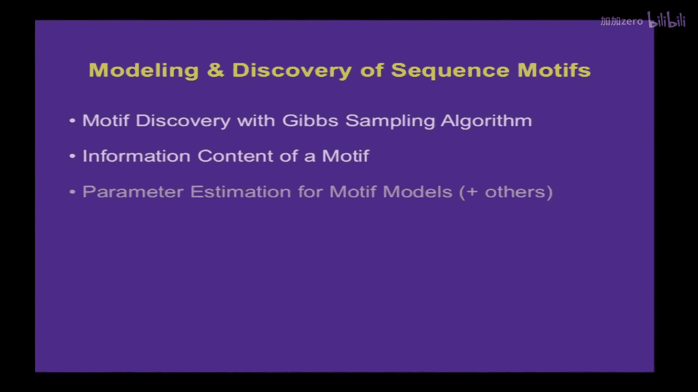
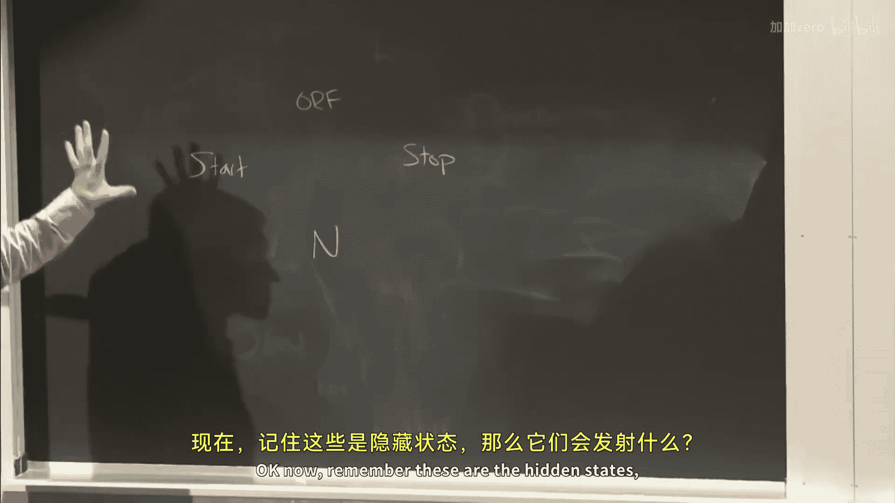
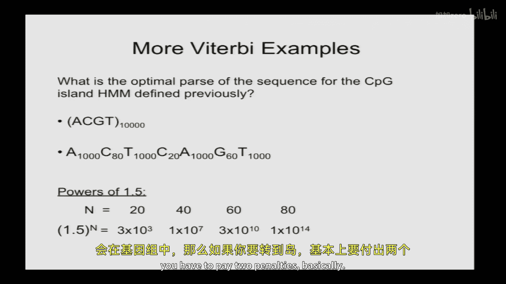
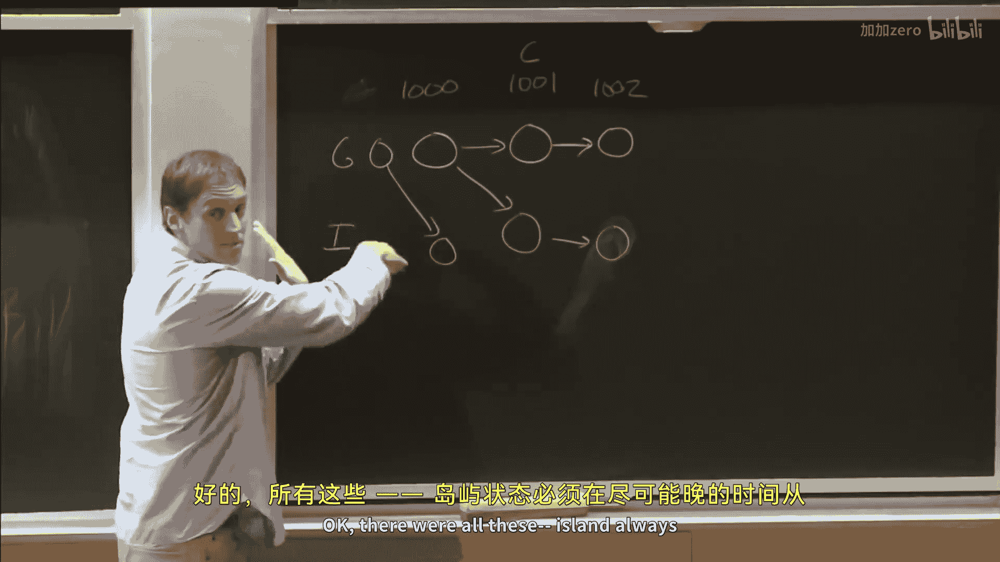
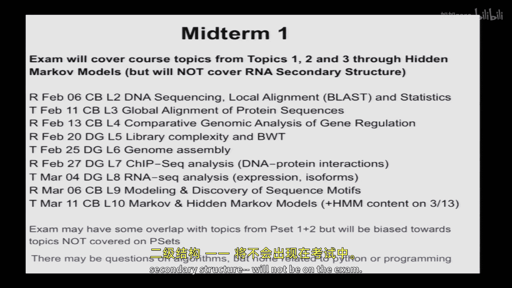
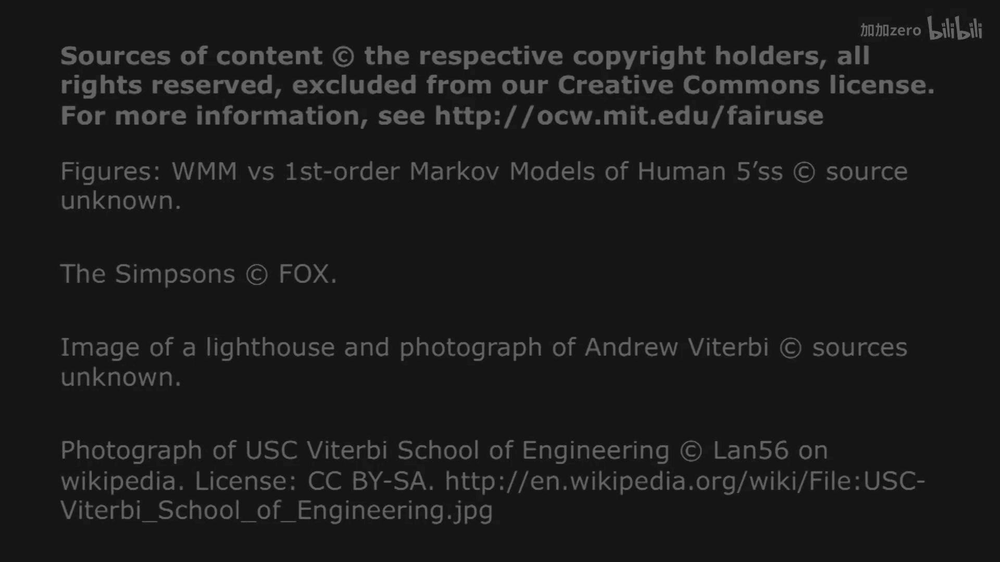

# 【计算与系统生物学基础 7.91J 2014】麻省理工—中英字幕 p10 p9 10. Markov and Hidden Markov Models of Genomic and Protein Features -BV1HdzaYAE2a_p10-

The following content is provided under a creative Commons license。

 Your support will help M I T Open Coseware continue to offer high quality educational resources for free。

To make a donation or view additional materials from hundreds of MIT courses。

 visit M T OpenCourseware at OCw。 MT。 Eduu。

Any questions from last time about Gib sampling？

So at the end， we talked， we introduced this concept of relative entropy。

 So I just wanted to sort of briefly review this and make sure it's clear to everyone。

 So the relative entropy is a measure of distance between probability distributions can be written different ways。

 often with this DPQ notation。 And as you'll see， it's the。Mean bit score。

 if you're scoring a motif with a foreground model， P K and a background model。 Q K。

 it's the average log odds score under the under the motif model。

 And I asked you to show that under the special case where Q K is one over four to the W that is uniform background that the relative entropy of the motif ends up being simply2 W-8。

 Does anyone。To have a chance to do this， It's a pretty simple。 has anyone， has anyone done this。

 Can anyone show this， like if I ask this on the。I want me to do it briefly。

 How many would like to actually see this derivation very， very quick。A few people。 Okay。

 so I'll just do that really quick。 So summation。PK log。PK over Qk。Equals。

 so you rewrite it as a difference。The log of a。Quotient is the difference of the log。

 so summian log PK plus summmatation PK log。QK， okay。

 and then the special case that we're dealing with here is that Qk is equal a quarter。

 If we're dealing with the simplest case of a one base motif。

 And so you recognize that that's minus H of P。Right。HOP is defined as minus that， so it's minus H。

 and this here， that's just a quarter。Log2 of a quarter is -2。

 You can take the -2 outside of the sum。 So youre end up ending up with -2。U。I'm sorry， this was。

Ive come a sal didn't correct me。 Usually， she catches these things。 Okay， so that's a minus there。

 right， because we're taking the difference。 And so you take the。

 then we have a -2 that we're pulling out。 Okay， from this。

 And you're left with summmaian P K and summaian P K。It sums to one， right， So that's just one。

 And so this equals minus minus-2 or 2 minus H of P。Okay， and there are many other。

Reult of this type that can be shown using this in information theory。 Often。

 there are sort of some simple results you can get simply by using this by splitting it into different terms and。

 and summing。 So another result that I mentioned earlier without showing。

 is that if you have a motif， say of length， too， okay。

 that the information content of that motif model。Can be broken into the information content of each position。

 If your model is such that the positions are independent。 So you would have， in that case the。

let's just take the entropy of a model on diuccleotides。 ifs if that would be minus summation。PI， PJ。

哇。P on PJ， if you have a model thats that's where the two are independent。

 and this sum would be taken over， over both I and J。

 And so if you want to show that this is equal to， I claim that this is equal to。PI on。Yes。Anyway。

 you'd have to have， yeah， if you have different positions at the， Yeah， in general。

 this would be the more general term， or you have two different compositions at the two positions of the motif。

 And then you， you can show that it's equal to the。Basically the sum。Of the。The sum of the entroies。

At the two。At the two positions。 Okay， and you do the same thing。 You。

 you separate out the log of the sum in terms of the sum of the logs。 and then you just sort of。

Do properties of summations until you get the answer。 Okay。

 so this is your homework and obviously won't be graded。

 but we'll check in next on Thursday and see if anyone has questions with that。

 so what is the use of relative entropy。 So the main use in bioinformatics。

 is that it's a measure that takes into account nonuniform backgrounds。

 Okay so the standard definition of information basically works when the background is uniform。

 but falls apart when it's nonunform。 So if you have a very biased genome like this one shown here。

 which 75% A， then the information content using the standard method would be 2 bits of this motif。

 which is PC equals1。 but then that would predict using the formula that the。

That a motif occurs two to the information content， you know。

 once every two to the information content basis， thatll be two to the two。

 which would be one of be four bases。 And that's clearly incorrect in this case。

 But the relative entropy， if you do it， there will be four terms。

 But three of them are just have a0。 right， And then one of them has a one。 So it's one times。嗯。

One times log。嗯。1 over18 in this case， and that will be equal to。3。

 and so the relative entropy clearly gives you a more sensible version。 Okay， so it'，'s good。

 it's a good measure for for non uniform， non uniform backgrounds。

 questionsions about relative entropy。Good， alright。

 So then we said you can use a weight matrix or position specific probability matrix for a motif like this five prime splicite motif assuming independence between positions。

 But if that's not true， then a natural generalization would be。A an inhomogeneous Markov model。

 So now we're going to say that the base at position K depends on the base at position K -1。

 but not on anything。Before that， Okay， and so the probability of generating a particular sequence。

 S1 to S 9 is now given by by this expression here， where you have。

Use for every base after the first， you have a conditional probability。

 This is the conditional probability of seeing the base S2 at -2。

 given that you saw S1 a -3 and so forth。 Okay and again， you can take the log for convenience。

 if you like。 So I actually implemented these both of these models。

 So just for thinking about it if you want to implement this， you have parameters。

 these conditional probability parameters and you estimate them。As shown， as shown here。 So remember。

 conditional probability of。Of A， given B。Is the joint probability。Divided by the probability of B。

 And so in this case， that would be the joint probability of seeing C A at -3 -2 divided by the probability of seeing C at -3。

 You could have the ratio of the frequencies or in this case。

 the counts because the normalization constant will will cancel is that exactly。

So I actually implemented both the weight matrix model and a first order Markov model of five bocytes and scored some genomic sequences。

 And what you can see here， the units are in one10 bit units is that they they both。You know。

 are partially successful in separating real five times glyide shown in black from the background shown in in light bars。

 But there's， in both cases， it's not a perfect separation。 There's some， there's some overlap here。

 And if you zoom in there that you can see that the Markov model is a little bit better。

 it sort of has a tighter tail on the left。 So it's generally assigning you know。

 separating the true from the decoys a little bit better， not dramatically better。

 but slightly better。 Yes， question。😊，QuionOn the previous slide。

Could you clarify what the the letter are？Yes， I'm sorry about that so R will be the odd ratio。

 so it's the ratio of the probability of generating that sequence。Under the foreground model。

 the plus model， we're calling it divided by the probability under the background or minus model and then。

You I pointed out last time that when you get products of probabilities， they tend to get very small。

 this can cause sort of computational problems。 And so if you just take the log。

 you convert it into a sum。 and so we we'll often use score or S for the log of the odds ratio。Yeah。

 sorry， that should have marked that more clearly。Alright， so yeah， so Markov models can。

 can improve performance when there is dependence and when you have enough data to estimate the increased number of parameters。

 Okay， and it doesn't just have to be dependence on the previous base。 You can have a model where。

The probability of the next space depends on the two previous spaces。

 That would be called a second order Markov model， or in general， you know， a K order Markov model。

And so， and sometimes these dependencies actually occur in practice。 So with five times splic size。

 it's a nice example because there there's probably a couple hundred thousand of them in the human genome。

 And we know them very well。 So you can make you can make quite。

 quite complex models and have enough data to train them。 But in general。

 if you're thinking about modeling a transcription factor binding something。 you know。

 often you might have dozens or at best hundreds of of examples typically And so you might not have enough to train some of the some of the larger models。

 So how many parameters do you need to fit a K order Markov model。 So question first， Yeah。

 the first models with Yeah，Weight matrix or。Yeah， yeah。

 weight matrix or position specific probability matrix， just a model of independence between the。

 between the two， yeah。Okay， so coming back to this case。

 So let's suppose you're thinking about making a K order markov model because you do some statistical tests and you find theres some dependence between。

 you know， sets of positions in your motif。 How many parameters would there be。 So if you have a。

An independence model or weight matrix or position specific probability matrix。

 there are four parameters at each position， right， the probabilities of the four bases。Okay。

It's really only three free parameters because the fourth one， you know。

 But let's just think about it as for four parameters times the width of the motif。

 So if I now have go to a first order Markov model。Now， there's more parameters， right。

 because I have these conditional probabilities at each position， right。

 So how many parameters are there。Of course， first order Markco。I'm going to join your test。Yeah。

 think there would be 16 at each position。 Yeah，16 at each position， except the first position。

 which has four， right， Okay， and what about a second order， Markov Monll。

We you commissioned on the two previous commissions？64， right？Do you have two possible。

Baases your conditioning on that's 16 possibilities times 4。 Okay， So in general， the formula is。

For to the4 to the K plus1。 Okay， so this， this is really， this is really the issue。

 If you have only 100 sequences and you need to estimate 64 parameters in each position。

 you basically， you don't have enough data to estimate those。 So you shouldn't use such。

 such a high order。呃 modelel。Alright， so let's think about this like what could happen if you don't have enough data to estimate parameters and how can you get around that。

 So let's just take a very simple example。 So suppose you were setting a new transcription factor you had done。

Some sort of。Pull down assay followed by， say， conventional sequencing and identified 10 sequences that that bind to that transcription factor。

 Okay， and these are， these are the 10 sequences。 And you align them。 You see there's。

 there's sort of a pattern there。 You know， there's usually an a。

 the first position and usually a C at the second and so forth。 And so you。

 you consider making a weight matrix model。Okay， you tally up there's 8 A's，1 C。

1 G and no T's at the first position。 Okay， So how confident can you be that T is not compatible with binding of this transcription factor。

Who thinks you can be very confident？Most of you are shaking your head。 So if you're not confident。

Why， why are you not confident。I think were you shaking your head？What's the problem here？

It's just too small a sample， right， You dont， you know， maybe T occurs rarely。

 And so suppose that T occurs at a frequency of 10%。 What's the probability of that in。

 in natural sequences， And we just have， you know， a random sample of those。 What's the probability。

 We wouldn't see any T's in a sample of size 10。Anyone have an idea。

Anyone have a ballpark number on this？yeah诶 si point nine into the ten。Po。9 to the 10 Okay。

 and what is that。9 is the probability that you。You don't see of T。 Yeah。

 and then you do that 10 times。 Yeah， Yeah， exactly。 So， you know， in general， it's a binomial thing。

 but it works out to be 。9 to the 10。 And that's roughly， you know。

 this is like a plusson with there's a mean of one right， So it's roughly e to1。

 right So about 35% chance that you don't see any T's。 Okay。

 so you know we really shouldn't be confident I mean T is probably doesn't have a frequency of 05。

 but it you， it could easily have a frequency of 10% or even or 5% or even 15% perhaps And you might you might have just not seen it。

 So you don't want to assign probability 0 to T。 But what value should you assign。

Right for something you haven't seen。Sally， you have Okay， Okay， so there。

 it turns out there is a principled way to do this called called pseudo counts。 So basically。

 if you use maximum likelihood estimation。You get just， you know， maximum likelihood is。

 it turns out is equal to the just the observed frequency。

 Okay But if you assume that the true frequency is is sort of unknown。

 but was sampled from sort of all possible， reasonable frequencies。 So that's a delay distribution。

 then you can calculate what the posterior distribution is in a Bayesian framework given that you observed。

 for example，0 Ts， What's the probability， you know， what's the distribution of that。

Of that parameter frequency of T。 And it turns out it's equivalent to adding。

A single count to each of your bins。 Okay so I'm not going go through the derivation because it it takes time。

 but it is well described in the appendix of a book called biological sequence analysis published about 1015 years ago by a number of leaders in the field。

 Durban Eddie Krog and Min。 And there's also a derivation of this in the probability and statistics primer。

 So basically you just do this posterior calculation。

 And it turns out to be equivalent to adding one count。 So when you add one count。 And then。

 of course， you， you renmalize then you get a frequency of what effectively it does is it will reduce the frequency of things that you observe。

 And that you observe most commonly and boost up the things that that you don't see so that you actually end up assigning a probability of 0。

07 to T。

Now， if you had a larger sample。 So let's imagine instead of 8，1，1，0， it was 8010100。

 that you still add a single count。 Okay so you can see in that case。

 you're only gonna be adding know a very small， close to 1% for for T So as you get more data。

 it converges to the maximum likelihood estimate， but it does something more reasonable。

 more sort of openminded in a case where you really limited in terms of data。 So that limitation。

 you always want to be aware when you're considering going to a more complex model to get better predictability。

 you want to be aware of how much data you have and whether you have enough to accurately estimate parameters and if you don't。

 you either simplify the model or if you can't simplify it anymore。 know。

 consider using pseudo counts。 Sometimes you'll see smaller pseudo counts added like instead of 11。

11 you might see point a quarter like one pseudo count distributed across the four bins。 theres。

Arguments pro and con， which I won't go into。Okay， allright， so for the remainder today。

 I want to introduce hidden Markov models。 We'll talk about。Some of of the terminology。

 some applications and the vitubi algorithm， which is a core algorithm when using HMMs to predict things。

 and then we'll give a couple examples。 So we'll talk about the CPG island HMM。

 which is about the simplest HMM， I could think of。

 which is good for sort of illustrating the mechanics of an HMM and then a couple later。

 probably coming into next lecture， some examples of real worldor HMs like one that predicts transm helices。

So some background reading for today's lecture that's posted on the course website。

 there's a nature biotechnology primer on HMMs， there's a little bit in the textbook。

 but really if you want to understand the guts of HMMs， you should read the Ravener tutorial。

 which is really well， pretty well done。For Thursday's lecture。

 I will post a another of these nature biotechnology prims on RNA folding。

 This one is actually a little bit more。Has a little bit more content。

 a little bit takes a little bit longer to absorb probably than some of the others。

 but still a good introduction to the topic。 And then it turns out the text has a pretty good section on。

On RNA folding， so take a look at chapter 11。

All right。So hidden markup models。Can be thought of as sort of a general approach for modeling sort of sequence labeling problems。

 So you have sequences， There might be genomic sequences， protein sequences， RNA sequences。

 And these sequences have features， promoters， They may have domains， etctera， linear motifs。

 And you want to label。Those features， okay， in， in an unknown sequence。

 So a classical example would be。Gene finding， you have a genomic sequence。Some parts are。

 say exxons， some are introns。 You want to be able to label them。 It's not， it's not known。

 but you might have a training set of known exons and introns。

 And you might learn what the sequence composition of each of those labels looks like and then make a model that builds things together。

 And what they allow you to do with HMMs is to have transition probabilities between the different states。

 So you can model states。 You can model the length of different types of states to some extent。

 as we'll see， and you can model which states need to follow。Other states。

They're relatively easy to design。 You can just simply draw draw a graph。 It can be。

 you can even have cycles in it。's okay。And yeah， they've been described as the Legos of computational sequence analysis。

 They were developed originally in electrical engineering 4 or five decades ago for applications in voice recognition。

 And there're still used in voice recognition。 So when you are calling up some large corporation and instead of a person answering the phone some computer answering the phone and attempting to recognize your voice。

 It could well be an HMM on the other end， which is either correctly recognizing what you're saying or not so。

You can thank them or blame them as you wish。Allright， so。Marcoon example。 So we， we did this before。

 Imagine the。The genotype at a particular locus in successive generations is thought of as as a Markov chain。

 Bart's genotype depends on homers， but is conditionally independent of grandpa Simpsons given given homes。

 Okay， So now what's a hidden Markov model。 So imagine that we don't you know。

 our DNA sequencer is not working that week。 We can't actually go in and measure the genotype。

 But instead， we're going observe some phenotype that's dependent on genotype。 Okay， but it's not。

dependentent in a deterministic way， it's dependent in a more complex way because there's an impact of of environment as well。

 What's it。 So so we're imagining that this your genotype at the apoloopprote。

 locus is correlated with cholesterol， but doesn doesn't completely predicted。 So if your homozygous。

 you tend to have higher LDL cholesterol than than if your heterozygous。

 but there's a distribution depending on how many know how many donuts you eat or something like that。

 So imagine that we observe that grandpa had low cholesterol 150 Homer had high cholesterol and Bart's cholesterol is sort of sort of intermediate Now。

 if we had just observed Bart's cholesterol， we would say， well。

 you know it could be it could go either way it could be homozygous or heterozygous。

 you would just look at the population frequency of those too。 And that would use that to guess。

Remember， we know his father's cholesterol， which was 2，50。 Okay。

 makes it much more likely that it was actually， his father was homozygous。 And then that， in turn。

 biases the the distribution of her。 So thatll make it a little bit more likely that Bart himself is。

 is homozygous。 If you didn't， if you didn't know。 So this is the basic idea。

 You have some observable。Phenenotype， if you will。

 that depends in a probabilistic way on something hidden and that hidden thing has some dependent structure to it。

Okay，And you want to then predict those hidden states from the observable data。

 So we'll give some more examples coming up。 And the way to think about these models or at least a handy way to think about them is as。

 as generative models。 And so this is from the Rabinner tutorial。 You imagine an HM M used。

In order to generate observable sequences。 Okay， so there's these hidden states。

 Think of them as genotypes， observable。 Think of them as the cholesterol levels。

 So the way that it works is you choose an initial state from one of your possible hidden states。

 According to some initial distribution， you set the time variable equal to one。 In this case。

 it's T， which will in our case， often be the position in the sequence。 And then you choose a value。

 an observed value according to some probability distribution。

 But it depends on what that hidden state was。 Okay， and then you transition to a new state。

 and then you emit another one。 Okay， so we well we'll do an example。

 So let's say bacterial gene finding is our is our application。

And we're going to model a bacterial gene。 These are protein coding genes。

 Only it's got to have a start code on。 Okay， it's got to have an open reading frame。

 and then it's got to have a stop code on。 Okay， so how many different states do we need in our H HMM。

 What should our states。

B。Anyone。If we want to make that1， maybe you need four states because the start state。

 the fourth state， stop state and the non。Okay， start。Or。Stop。

And then interogenic or non non nongene，Yeah， good。 Okay。 now， remember， these are the hidden states。

 So what are they going to admit， emit。

They emit observable data。 What's that observable data going to be。Sequence。

 and how many bases of sequence should each of them emit make？我就。You have a choice。

 you're a model builder， you can do anything you want。😡，1， five。10， any number of bases you want。

 and they can emit different things if you want。 this is generative。

 you can do anything you want that there'll be consequences later。 but for now。

Yeah I'm going to call this。 Yeah， Okay， go ahead。 Yeah， get。

 You could start with like the start and the stop date maybe being3，3。 Okay。

 so this is what you emit。Three nucleotides， right？O。How about this state， what's your this？

any number？Yeah， okay， if you let it submit one number and then add a self cycle。Okay。Okay。

 so Salally wants to have this state emit one nucleotide。

But she wants to like have a chance of returning to itself so that then we can have strings of ends to represent intergenic。

 Okay， does that make sense。 And so if these I agree，3 is a good choice here。

 if you had this one emit3 as well。Then your genes would have to be， you know。

 a multiple of three apart from each other， which isn't realistic right You would would miss out on。

 on some genes for that。 So， so you want to have this， this has to be able to emit arbitrary numbers。

 So you could either have it emit an arbitrary number。

 but it's going to turn out to make the algorithm The vitubi algorithm easier if it just emits one and recurs。

 as Sally suggested。 Okay， and then we have our orf state。 So how many， how about here。

 What should we do here。be3。 And then you put the circle。 Yeah， So3。

 So I'm gonna change the name to codon。 Okay because it's gonna emit one codon3 nucleots and then。

 and then recur to itself。 Okay， and now what transitions should we allow between these states。

It start to four。Okay。Or just yeah。Spped to。Any others。啊一。As our end could go to stock。それた。Yeah。

 okay， so that's a question。 So we're thinking of a gene on on the fu strand。

 What if you a gene could equallyly well be the opposite strand， right。

 And so we should probably make a model of where you would hit this。

 you would hit the inverse You hit the stop on the other strand。

 which would emit a triple It would be the inverse complement of a stop code on。 that's true。 Yeah。

 good excellent point。 And then you would sort of traverse this whole circle in in the opposite direction。

 But it wouldn't be the same state， It would be stop because it would emit different things。

 So so you'd have like。Minus stop， right， stop minus strand， right。

 And then you'd have some other stake on。 Good， Im， I'm not gonna draw those。

 but that's a good point。 And you， you could， you could have like a。

A teeny one coat on gene if you want。Probably probably not worth it， so all right。

Everyone have an idea about this ATM。So this is a model you have to specify in order for this to actually generate sequence。

 right， this model will actually generate。Annotations and sequence。

 you have to specify where to start。 So you have to have some probability of starting that the first base that you're gonna generate is gonna be intergenicic or start or codon。

 et ceter。 And you might give it a high probability of this。 And then and then you。

 you it'll generate a label。 So， for example， let's say N。 and then it'll generate a base。 Let's say。

 I don't know G。 And then you then look at these probability。

 So the transition probability here versus this， you either generate another n or you generate a start。

 And let's say you go to to start Okay， and then you'll generate three bases。 So A T G。

 and then you go to the codon state。 you would emit。

Think about that terrible G you emit some other triplet and so forth。

This is a model that will generate strings of annotations with associated bases。Okay。

So it doesn't predict gene structure yet， but at least it generates gene structures。All right。

Allright， so we are going to， for the sake of of illustrating the Viterbi algorithm。

 we're going to use a simpler HMM than that。 Okay， and so this one only has two states and its purpose is to predict CPG islands in vertebrate genome Okay so what are CPG islands anyway。

Remember。What is this at end they't heard us？Sure some of you。诶。Well。

 the definition here is going to be regions of high C And G content and relatively high abundance of CPG diuccleotides。

 which are unmethylated。 So what is the P here。 So the P means that the C P。

 the C G we're talking about is C followed by G along a particular DNA strand。

 We're not just to distinguish it from C like base paired with G。

 We're not talking about a base pair here。 We're talking about C And G following each other along。

The strand。 So these， this diuccleotide is rare in vertebrate genomes because CPG is the site of a metthylase that and methylation of the C is mutagegenic。

 It leads to a much higher rate of mutation。 So CPG is often mutated away。

 except for the ones that are that are necessary， but there are certain regions often near promoters that are unmeylated。

And therefore， CPGs can accumulate to higher frequencies。

 And so you can actually look for these regions。And use them to predict where promoters are。

 that's one application。So they have higher CPG diuccleotide content and also higher C And G content。

 The background of the human genome is about 40% C G only。 So it's a bit A T rich。

 And so you see these patches of， say，50% to 60% C G that are often associated with promoters。 Okay。

 with promoters of roughly half of human genes。All so we're going to。

I always dropped that little clicker thing here is We're going to。

Make a model of these and then run it to predict promoters in the genome。So here's our model。

 So we have two states， we have a genome state， a sort of generic position in the genome。

 and then we have an island state。 Okay we have the simplest possible transitions。

 you can go genome to genome， genome to island， island to genome or island to island。

 so that now you can generate islands of arbitrary size。

 interspersed with genomic regions of arbitrary size。😊。

And then each of each of those hidden states is going to emit a single base。 Okay。

 so a CPG island in this model is a stretch of， of I states in a row flanked by G states。

 if you will， okay。Everyone， clear on this setup。Good。Allright。

 so here now in order to fully specify the model， you need to say what all the parameters are。

 And there are really three classes of parameters。 There are initiation probabilities。

 So the green here are the is the notation used in the rabinar tutorial。 So they call them pi Js。

So here I'm going say as a 99% chance you start in the generic genome state and a 1% chance you start in an island state。

Because islands are， you know， not， not that common。

 And then you need to specify transition probabilities。 So there's。

4 possible transitions you can make and you need to assign probabilities to them。

 So if the average length of an island were 1000 bases。

 then a reasonable value for the eye to eye transition would be 。999 you have 99。

9% chance of making another island and and a。1% chance of of leaving that island state。

 if you just run that in this generative mode， it would generate a variety of length of islands。

 But on average， they'd be about about 1 K B1。 because the probability of terminating is one in 1000。

 And then if we imagine that those1 Kb islands are interspersed with genomic regions that are about。

 say，100 kilobas long on average， then you would get this 59s probability for P G G and 10 to the -5 as a probability of going from genome to island。

 so that would generate sort of。Widely spaced islands that are on average 100 K B apart with that are that are about 1 K B in length。

Is that making sense？Okay， and now the third type of probability you need to specify are called emission probabilities。

 which are the BJ K and rater notation。 And this is where the predictive power is going to come in。

 there has to be a difference in the emissions。 If you're gonna have any ability to。

 predict these these features。 And so we're going to imagine that the genome is 40% C G and islands or 60% C G。

 So it's base composition that we're modeling。 We're not doing the diuccleide here that would make it more complicated。

 We're just doing looking for patches of high G C content。Okay。

So now we've fully specified our model。Alright， so the problem here is that。

The model is written from the hidden generating the observable。 And we actually。

 the problem that we're faced with in practice is that we have the observable sequence。

And we want to go back to the hidden。 So we sort of need to reverse。The conditioning thats。

In the model。So when you see this type of problem， how do you reverse conditioning？In general。

 what's a good way to do it？You see P A given B， but the model you have is written in P B， given A。

 What do you do。我猜。Yeah， based here。Right， and so can you just？Well let's do base theorem here。Okay。

 remember。Conditional definition of conditional probability。 If we have P A given B。

 So this might be。The hidden states， given the observables， Okay。

 we want to write that in terms of P B， P B， given A， So what do we do first。

 How do we derive Bayes rule。You first write。Definition of conditional probability。Right。

 that's just definition。 Okay， And now what do I do。Split the top part into what。第一页。你啲见咩。

That's just another way of writing joint probability of PAB using definition of conditional probability again。

 right？嗯。Okay， so now it's written。The other way。Good， so that's basically the idea。So this is the。

 the simple form。 like I said， I don't usually call it a theorem because it's so simple。

 like something you can derive you know， in， in， in， you know。

30 seconds should be called maybe a rule or something。 And there is a more general form。

 So this is where you have two states， basically。Like。

B or not B that you're that you're dealing with。 And there's this more general form that that's shown on the slide。

 which is when you have many， you know， many states。 And it basically is the same idea。

 It's just that we've rewritten。We rewritten this term this PB。

 and we split it up into all the possible states。It's it's the slide， yeah， starts from P B。

 given A and goes together。 Yeah， anyway。 So you rewrite the bottom term as a sum of all the possible。

 of all the possible cases okay。All right。Okay， so how does that apply to HM M， So with H M Ms。

We're interested in。The joint probability of a set of hidden states and a set of observable states。

 So H， capital H is going to be a vector that specifies the particular hidden state。For instance。

 you know island or genome at position1， that's H1 all the way to HN so little H's are specific values of those hidden states and then big O is a vector that describes the different bases in the genome So O1 is the first base in the genome up to up to ON and you know one could imagine comparing two two H vectors。

 one of which H versus the H primes know what's the probability of this hidden state versus that。

 you could compare in terms of their joint probabilities with this model and perhaps favor those that have that have higher probabilities。

Yeah。There for the two capital Hs。Have have any different location， like。

Does second one the H prime up or are they H H in this case。

 these are probability statements about random variable。

 So H is a random variable which could assume any possible sequence of hidden states。 The little。

 the little Hs are specific values。 So， for instance， imagine comparing you know。

 what's the probability。嗯。Of like，Say H equals know， genome， genome， genome versus。

The probability that H equals know， genome， genome， island。 Okay。

 so the the little H's or the little H primes are specific。Instances。

 the H is a random variable unknown。就就合。Okay。嗯。Okay， so how do we apply our Bayes rule。

 So what we're interested in here is the probability that H， this unknown。

 you know variable that represents hidden states， that it equals a particular set of hidden states。

 little H1 to H N， Given the observables， little O1 to little O N。

 which is the actual sequence that that we see。 Okay， and we can write that using。😊。

Definition of conditional probability as the joint probability of H and O over the probability of O。

 Okay， and then Bes rule， we just apply conditional probability again。 It's P H times P O given H。

 okay， over over P O。So it turns out that this PO。 So what is PO， equals O1 to O N in this model。

Well， the model specifies how to generate the hidden states and how the observables are generated from those hidden state from those hidden states。

 So P， O is actually defined as the sum of。P， O comma H equals， you know。

 the first possible hidden states plus， plus the same term for the second。 You know， it's。

 you have to sum over all the possible outcomes of the hidden states。 Every possible thing。

 So if we're， if we have a sequence of length 3， you have to sum over。The。

 the possibility that H might be G G G or G G I or you know， G I， G or G I I or。You know。

 IGG or et cetera， right？You have to sum over。8，8 possibilities here。

 And if the sequence is a million long， you have to sum over two to the1 millionth possibilities。

 Okay， so that that sounds complicated to to calculate。

 So it turns out that it's actually there's a trick and you can calculate it。 But you don't have to。

 That's one of the one of the good things is that we can just treat it as a constant。

 So notice that the denominator here is independent of the H's， right。

 So we'll just treat that as a constant， unknown constant。 And what we're interested in is which。

 you know， which possible value of H has a higher probability。 Okay， so we're just going to。

Try to maximize P， H equals H1 to H N。 find the optimal sequence of hidden states that that optimizes that joint probability。

The joint probability with the observable values，01 to ON。Does that make sense？So basically。

 we want to find the sequence of hidden states。 We'll call it H opt。

 So now H opt here is a particular vector。 Okay， capital H by itself was a random vector。

 This is now a particular vector of hidden states， H1 opt through H N opt。 and it's defined as the。嗯。

Vectctor of hidden states that maximizes the joint probability。With O equals O1 to O N。

 where that's the observable， That's the observed sequence。That we're dealing with， okay？

So now what I'm telling you is we can， we can find， if we can find the。

Vectctor hidden states that maximizes the joint probability。

 Then that will also maximize the conditional probability of H given given O。

And that's often the language of linguistics is used。

 and it's called the optimal parse of the sequence。 you'll see that sometimes I I might say that。

So the solution。嗯。Is to。Define these variables。 R I of H， which。Are the probability of。

Defined as the probability of the optimal parse of the sub sequenceence from one to I， okay。

Not the whole long sequence， but a little piece of it from the beginning to a particular place in the middle that ends in state H。

Okay， and so we first， we calculate R。Like R 1，1， the probability of generating the first base。

 given that it ended in hidden state 1， you know， and then we would do the hidden state 2。 And then。

 and then we basically have to figure out a way a recursion for getting。The optimal。

 the probabilities of the optimal。Pases ending at each this of the states at position 2。

 given the values of position 1。 and then we go work our the way all the way down to the end of the sequence。

And then we'll figure out which is better。 And then we'll backtrack to figure out what that optimal parse was。

 Okay， so well we'll do an example on the board。 So this。

 this may not be this is unlikely to be completely clear at this point， I would say。But don't worry。

 so。Why is this called the Vitubi algorithm。 Well， this is the guy who figured it out。

 He was actually an M I T alum。 He was his bachelor's and master's in W E。 I don't know。

 quite a while ago。In50s or 60s and later went on to found Qualcomm and is now like a big philanthropist who apparently supports USC。

I don't know why he lost his loyalty to MIT either。Maybe he'll come back and give us a seminar。

I actually met him once。So， so let's talk about his algorithm a little more。

 So what I want to do is I want to take。A particular HM M。 So we'll take our， our。CPG Island， HMM。

 And then we'll go through the actual Vetubi algorithm on the board for a particular sequence。

And you'll see that it's actually。Pretty simple。 But then you'll also see that it's not totally obvious why it works。

 So that's the， that's actually the， the harder， the mechanics of it are not that bad， but the。

Understanding really how it is able to come up with the optimal parses， the， that's the。

The more subtle part。So let's suppose we have a sequence。A， C， G。

 can anyone tell me what the optimal parse of this sequence is？Without doing the turbby。

With these particular this particular model， these initiation probabilities。

Transitions and emissions。Do you know what it's going to be in advance？Any guesses？

How about genome Island Island Gen Islandt， because you're saying like that way you the emissions will be optimized。

 right because you'll emit the Cs Gs in the island。 Okay， that's a reasonable guess。

 Sally' is shaking her head though。 The transitional probability。Being in the genome is very。

 very small， and so it's more likely that'll either only be in the genome neural。

see the transition from going from a genome to island or island genome is very small。

 And so she's saying you're going to pay a bigger penalty for making that transition in there that may not be offset by the emissions。

 Is that your pointep question。Check here when we're talking about the optimal par。

We're saying let's maximize the probability of that letter。

The probability the joint probability sorry， joint probability of that letter。

Of that hidden state and that letter。Okay， so that means that set of hidden states and thats a set of places So when we're computing across this three letter thing we have to say。

Probably of the letter。Then let's multiply it by probability of the trends。the next letter。And then。

で最初ね。Yeah so let's do this。AC is our sequence。 I'm just going to space it out a little bit。 Well。

 here， here's our a， position1。Here's our C oppositionposition 2。NRG， opposition 3。And okay。

 then we have our hidden states。 Okay， so we have， we'll write genome first。

And then we have island here。And so what is the optimal parse of the sequence from base1 to base one？

That ends in genome。It's just the one that starts in genome because it doesn't go right。

 so it's just genome， and what is its probability？That's， that's how this thing is defined here。

 This is this R I。Each thing I was talking about。This is age。And this is I here。Okay， so。

The probability of the optimal parse。Of the sequence up to position one that ends in genome is just the one that starts in genome and then emits that base。

 So what's the probability of starting a genome。It's point。 it's 5，9s， right， Okay。

 so that's the initial probability，9，9，9，9，9。 And then what's the probability of emitting an A。

 given that we're in the genome state。0。3。So I claim that this is the value of R1 of。

Genome of the genome state。Okay，That's the optimal par。 there's only one par。 So there's nothing。

 you know， it's， it is。 it is what it is。 It's you start here。 There's no transitions， right。

 We just started here， and then you emit an A。 Okay， what about， what's the probability。

 the optimal parse ending an island at position one of the sequence。Someone else。

 yeah question yeah are we using the transition the Oh， I'm sorry。Correct， thank you， thank you。

 what' what was your name？Deborah， okay， thanks， Deorbra。 Yeah， it's to be the initial probability。

 which was 0。99。Yeah， initial probability， good， what about island， Deborah。

 you want to take this one？0。01 to be in the island and what about the emission probability？

We admit have to start an island and then emit an A， which is probability what？2 yeah， it's that。

Yeah， point。Okay， so who's winning so far if the sequence ended up one。Genome genome 20。

 right this is a lot bigger than that， it's about 150 times today。Okay， now。

 what do we do when we go， We said we have to， we have to do a recursion， right。

 We have to figure out。The probability of the optimal power is ending at position 2。

In each of these states， given。The optimal partsse ending in position 1， Okay， and how we。

 how do we figure that out。What are we going to write here or what do we have to compare？

To figure out what to put here。There's two possible parts ending in genome at position 2。

 there's the one that started in genome， one， and there's the one that started island。

 right So you have to compare this。To this。 Okay， so you compare。

What the probability of this parse was times the transition probability and then the emission in that state。

 okay。So what would that be？what would this be if we stay in genome？

What's a transition Now we've got our five9s， so5 nines， and then the emission is what。

It genomeome at point。t2， right？And。TimeTimes this， and what about this one。

 what are we going to multiply when we consider this island to genome transition？😔，欢迎。じゃあ。吃得玩。

And still pointing。So who's going Now， we take the maximum of these， right。

 We're doing optimal parts， highest probability。 So which one of these two terms is bigger。

Clearly the top one is bigger。 I mean， this was already bigger than this and remote flying doesn bigger。

 right， So clearly， the answer here is。0。99。Times。Pot3。

Times my nines are going have to get really skinny here，05 nines and。Point2。 That's the winner。

 And the other thing we do， besides recording this number is we， we circle this arrow。

Sing a ball This is sort of like， you know， Neman Wech or Smith Waterman， where you， you。

 you remember how， don't just record what's the best score， But you remember how you got there。

 We're gonna need that later。 Okay， and what about here， What's the optimal。Pase。

 what's the probability of the optimal parse ending an island at position two？

Or what do we have to do to calculate it， someone else？请。Right。

 you consider going genome to island here and an island to island。 And who's going to win that race。

 Do you have an idea。Genomed Island had a head start， but it pays a penalty。For the transition。

 the transition is pretty small， that's 10 minus fifth。And what about this one？

This has a much higher transition probability of 0999， right。

 And so even though you're starting from something， this is about 150 times smaller than this。

 But this is being multiplied by 10 to the -5。 And this is being multiplied by something like that's around one。

 right？ So this one will win。 Island Island will win。 Everyone agree on that。Okay。

 and what will that value be？So it's whatever it was before。Times the transition， which is what？

From island to island。999 times the emission， which is。Island is more likely to emit a sea。Everyone。

 clear on that。Okay， so then， and then we circle， we're not done till we circle this arrow here。

 That was the winner。 The winner was coming from Ireland remaining an island。 Okay。

 and then we keep going like this。Okay， do you want me to do one more base。

 How many people want me to do one more base and how many people want me to stop this， okay。

I'll do one more base， but you guys have to help me a little bit。

Who is going to win This is now we want the probability of the optimal parse ending in G。 I'm sorry。

 Yeah， ending at position 3， which is a G。So ending in genome or ending in island。

 So for the ending in genome， where is that one going to come from。Wch is going to win this one？

Or this one。St， stage genome is going to win， this one is already bigger than this。

And the transition probability here， this is a 10 or -3 transition probability。

 And this is a probability that's near one。 right， So the the transitions are going to dominate here。

 And so you're going to have this term。I'm going to call that。R of G。 that's this notation here。

Right， and times the transition probability genome to genome， which is。There's all these nines here。

And then the emission probability of a G in the genome state is 0。

2 and who's going to win here for the optimal parse ending of position3 in the island state。

Is it going to be this guy to island or this one changing from genome to island？Island to island。

 right， because， again， the transition probability is， is prohibitive。

 That's a 10 of the minus fifth penalty there。 Okay， so you're gonna stay in island。 So this one's。

 yeah， so this one one here and this one， one here。 And so this term here。Is R。Two of island。

Times the transition probability island to island， which is 0999 times the emission probability。

 which is 0。3 of a G in the island state。 Okay， everyone， everyone could on that。Okay， so。Now。

 if we went out another。20 bases。What's going to happen。Probably not a lot。

 Probably the same kind of stuff is happening right， So that seems kind of boring。

 But was when would it actually， when would we actually get a cross。What would it take？

Push you over and cause you to transition from one to the other。Okay。

 what' slow this spec against do more long enough。 Yeah，'s it's a good way to put it。

 So let me give you an example。 This is the Turby algorithm。Wri sort of written out mathematically。

We can go over this in a moment， but I just want to try to stay with the intuition here。We did that。

Now I want to do this， okay？Suppose your sequence is ACGT repeating 10，000 times。

Can anyone sort of just？Figure out what the optimal partsse of that sequence would be without doing the turby in their head。

Start and stay in genome， can you explain why？Because it's。呢个系。What it's been。Cause it's。

Hgeneous is a distributor as opposed to enrich enrich for C and G。

 and it just repeats without a pattern。 So it repeats without concentrating the Cs。

 right So the unit of the repeat， this A G T unit is not biased for either one。

 So itll have therell be 2。3 emissions and 2。2 emissions。

 whether you go through those in G G G G or in I I I I right Does it makes sense the emissions will be the same if you're all in genome or if you're all in island and the initial probabilities favor genome right and the transitions also favor staying in genome。

 right so。All genome。Can everyone see that？Okay， so you want to take a stab at this next one？Okay。

 this one's harder， let me ask you。In the optimal parse， do you think。

 what state is it going to end in？Genome， right， you got run 100 Ts and genome favor the emissions favor emitting Ts。

 So clearly， it's going to end in genome， good。And then what about those runs of C's and G's in the middle there。

 Are any of those long enough to。Trier a transition to Ireland。 What was your name again。Diel。

 so Daniel， you're shaking your head， you think they're not long enough。

 so you think the winner is going to be genome all the way。Who thinks they？

longer or maybe新闻问啊诶 go ahead好似啊 michael michael。The ones of like 80 and 60 are among that。O。

 and why you say that。But'll just look at the powers of。やぱ。Three times1。

Difference in transition problems between Anna that genomeau。That one。Three times that time。like。

I kind like the difference in probability of making。Okay， did everyone get what Michael is saying。

 so Michael， can you explain why powers of 1。5 are relevant here？Oh， because that。Difference。

That's the ratio。没是。C states。みテージ？So。没意见嗯。Right so when you're going through a run of Cs。

If you're in the island state， you get a power of 1。5 in terms of emissions at each position。Right。

 what about the transitions You're sort of。Glossing over those， Why is that to happen。

Once the beginning， so a great show of。The ratio between the。全是发的。いは。But as long as。Compounded ratio。

你这个是。差点。Sequences。嗯。As long as that compound ratio。我当。いげる。来。Yeah。

 so if you think about the transitions I to I or G to G as being like close to， they're close to one。

 right， So let's just， if you think of them as one， then you can sort of just ignore them。

 right and only focus on the cases where it transitions from G to I and I to G。

 So so you say that 60 and 80 are long enough。 So your your prediction is that the optimal parse。Is。

嗯。Zi。1000。I 80。Zhi。But another thousand another。2020， right， You said that one wasn't going to。

And then I 60 G1000。Michael， that's what you're saying。Can you read this。意见。Okay。

 so why do you say that？Like 10 to the 10th is enough to sort of flip the switch。

 and 10 to the third is not。The number。There are a couple of slide back now。So if you look at啲。

Rratio of the probability of staying， that you know。あでね。Tanceor fair chance。So。Whatever happens。

Other sequences。Difference in ratio for that switch to become。Right， so if。

 if everyone agrees that we're going to start an island， we're gonna I'm sorry。

 we're gonna start a genome。 We've got to run of 1000 A's and genome is favored anyway， right。

 So it seems that's clear we're gonna be in genome at the beginning for the first thousand00 and be in genome at the end。

 Then if you're going to go to island。 you have to pay two penalties。 Basically。

 you pay the penalty of starting an island， which is 10 to the -5。

This is maybe a slightly different way than you were thinking about it。 But I think it's equivalent。

 Okay，1 to -5 to switch to island。 And then you pay a penalty coming back of 10 to -3。And。

 and all the other transitions are near one， right。

 So it's like a 10 to the -8 penalty first going from genome to island and back。And so。

 if the emissions。Are greater than 10 to the 8th favor island by greater than the 10 to 8th。

 It'll be worth。Doing that， right， Does that make sense？Yeah。It's yeah。

 it's so true everyone see that。 you have to pay a penalty of 10 to8 to go from genome to island and back but the emissions can make up for that。

 even though it seems small， it seems like， you know， 60 bases is not enough at one point。

 you know it's multiplicative and it adds up sally。See like。Going to return a like lagging。

Answer because we're not going to actually switch to genome in our。Until we hit the point we bi。

Which will be about 60 Gs into the run of 80 so you're saying where's it's not actually going to be predicts the right thing。

This。There。这发。也得加1。What do people think about this？Yeah， comment。Quite the case because。

You calculated each of that。Both the genome and island possibilities and your transition is the penalty。

It is the highest impact。So when you have island to island to island in that strain of8。

 the transition will。I be valid。Starting in the first one。Okay， we're a position 1000。Okay， yeah。

 I mean， I think you're on my track here。 So I'm going to claim that the vierbi will transition at the right place。

 Okay， because it's actually proven to generate the optimal parts。 So， so I'm right， okay， but。

 but I。But I totally get your intuition。 This， This is the key thing。 Most people's intuition。

My intuition， everyone'stuition， when they first hear about this is that its。

 it seems like you don't， you don't transition soon enough。

 It seems like you have to look into the future to know to transition at at that place， right。

 And obviously， you can't look into the future， right it' it's a recursion。 So so how does it。

 how does it work。 Well， so clearly this is gonna be the winner。 right， So let's go to position 1001。

 That's the first C， right， And。An。This guy。Is going to come from here。 right。

 This guy is the winner overall， G1000 is clearly the winner， right， But what about this guy。

Where is it coming from？G1000， it's coming from there。Right。And， in fact。

The previous guy came from G1000。Right，I 1000 came from G9，9，9， right， and so forth。 Now。

 here's the interesting question。 What happens at 1002。Sally。

 I want you to tell me what happens at 1002。Who wins here Gen？I who wait here。Iron。

It had been transitioning。 Genomes got a head start。

 So the best way to be an island is to have been genome as long as possible， up until position 1000。

Okay， and it was still true at 2001。 It's no longer true After that。

 It was actually better to have transition back here to get that one extra emission。

 that one power of 1。5 from emitting that sea in the island state。

 If you're gonna be an island anyway， this is， this is much lower than this at this point。

 It's about 10 to the fifth lower。 But that's okay。 We still keep it。

 It's the best that ends an island， right， You see what I'm saying。Okay， so there were all these。

 you know， island always had to come from genome at the latest possible time up until this point。

 And now it's actually better to have made that transition there and then stay in island。 Okay。

 so you can see island is gonna win for a while。 and then itll， and then it'll flip back。

Right， and the question。Is going to be down here。At 1060， going to 1061。Who's bigger here。

 This guy was。Perhaps。Well， we don't even know exactly how we got here。 but you can see that this。嗯。

This par here。That stays in island is going to be optimal。 And the question is。

 would it beat just staying a genome， And the answer is yes。

 because it gained 10 to the 10th and emissions overcomes the 10 to the 8 penalty that it paid okay。

Now， what do you do at the end， How do you actually find the optimal partsse overall？

I go out to position。Whatever it is。4000。160。I've got a probability here， probability here。

 what do I do with those？Right what do I do first？You picked the bigger one， everyone's bigger。

 we decided。This one is going be bigger， right， And then remember all those arrows that I circled。

 you just backtrack through and figure out what it was。Does that make sense。That's the vi algorithm。

 Well， we'll do。嗯。A little bit more。On this next time， or definitely field questions。 It's。

 it's a little bit tricky to get your head around。 It has a， you know， it's sort of， its， it's'。

 it's a dynamic programming algorithm like Netoman Win Smith Waterman by。

 but a little bit little bit different。Oh yeah， the runtime。What is the runtime for those who were。

Sleeping and didn't notice that little thing I flashed up there。 Or if you read it。

 can you explain where it comes from。 How does it， How does the runtime depend on the number of hidden states and the length of the sequence。

I've got K states， sequence of like L。What is the runtime？So I'm going to put this up here。

This might help。So when you look at a recursion like this。What can you。

 when you want to think about the runtime。Forget about initialization and termination。 That's。

 that's， you know， not gonna be significant。 It's what you do on the the， you know。

 the typical intermediate state that that that determines a runtime。

 That's what grows with sequence length。 So what do you have to do。At each。

'd like to go from position I to position I plus1。 How many calculations。

You have to do end calculationlations。Yeah， so 33。 Yeah。 so， yeah， the notation is， yeah。

 is a little bit different。 but how many。Let me ask you this。

 how many transitions you have to consider。If I have a case， if I have an HM with K hidden states。

K squared， right so you're going to have to compute k squared。To go from position I to I plus1。

 So what is the overall dependence on K and L， the length of the sequence。Okay， it's k squared L。

 it's linear， linear in。So is this good or bad， yeah， Sally？Assume that the practice can do。

You don't actually have。Yeah， it's a good good point。 So this is sort of the worst case。

 or this is in the case where you can transition from any state to any other state。

 So if you remember。Gene finding HMM， I might have erased it， I think I erasse it。Yeah。

 if you can see this subtle I remember Tim designed an HMM for gene finding here。

 which only had some of the arrows were allowed， right， So if that's true。

 if there's a bunch of zero probabilities for transitions。

 then you can ignore those and it actually speeds it up。 that's true。😊，It's a good point。Okay。

 everyone got this。 So this is sort of the worst case。K squared2。 is this good or bad。

Faasster or slower。So。I mean。It depends on the structure of HMM for a simple HMM。

 like the CP Island HMM。This is like， this is like blindingly fast。

 It takess right the K squared is 4 right， So it takes the same order of magnitude as just reading the sequence。

 right， So it'll， itll be super super fast。 If you make a really complicated HMM， you know。

 it can be， it can be slower。 But the point is that for genomic sequence analysis， L is big。

 So as long as you keep K small， it'll run fast。 Okay。

 It's much better than like sequence comparison where you end up with these L squared types of。😊。

So it's faster than sequence comparison。 So that's really one of the reasons why the Turby is so popular is。

 is it super fast。 So in the last couple minutes， I just want to say a few things about the midterm。

 You guys did remember there is a midterm， right， So the midterm is a week from today， Tuesday。

 March 18。For everybody， it's gonna be here except for those who are in 6，8，7，4。

 And those people should go to 68，1，80。 And because they're gonna be given extra time。

 you should go there early。 Go there at 1240 Everyone else who's not in 6，8，7。

4 should come here the regular class by 1 PM just so you have a chance to to get set up and everything。

 And then the exam will start promptly at 10，5 and will end it at 2，25。 hour hour and 20 minutes。

 It is closed book open notes。 Okay， So don't bring your textbook， but you can bring up to two pages。

 they can be doublesided if you want of notes So why do we do this。 Well， we think that the act of。

Sor of going through the lectures and textbook or whatever other notes you have and deciding sort of what's most important。

 maybe。You know， may helpful。 And so this， this hopefully will will be a useful studying exercise to figure out what's most important and write it down in a piece of paper if you are likely to forget it。

 you know， maybe complicated equations， things like that。 might want write down。

No calculators or other electronic aids， but you won't need them。 If you get an answer， that's。

E squared over 17 factorial。 you know， we won't， you're not asked to convert that into a decimal。

 Okay， just leave it， leave it like that。 Okay， so what should you study So you should study your lecture notes。

 readings and tutorials and past exams。 past exam has been posted to the course website Pets as well。

The midterm exams from past years are posted， and there is some variation in topics from year to year。

 So if you're reading through。A midterm from the past year， and you run across an unfamiliar。

Phrase or concept。 You have to ask yourself。Was I just dozing off when that was discussed or was that not discussed this year and act appropriately。

 Okay， the content of the midterm will be all the lectures， all the topics up through today。

 hidden Markov models。 And I'll do a little bit more on hidden Markov models on Thursday。

 That part will also， you know， could be on the exam。 But the next major topic。

 RNA secondary structure will not be on the exam。Okay。

It'll be like on a Pet in the future， Any questions about the midterm。

And the TAs will be doing some review stuff in sections this week。Great， okay， thank you。

See you on Thursday。

