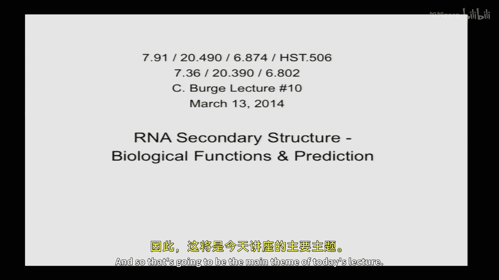
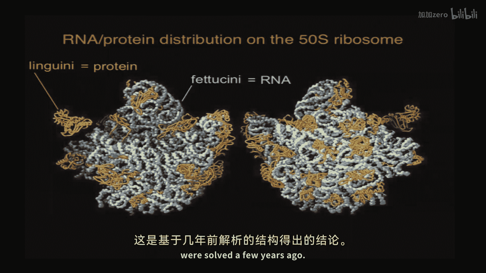
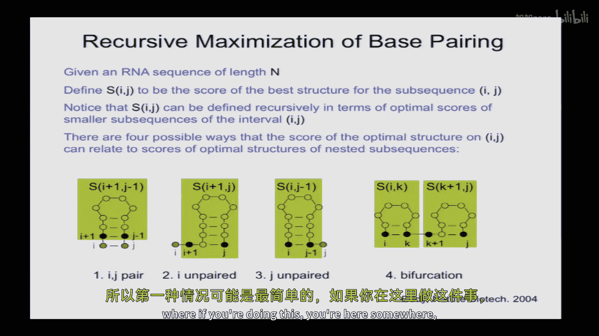
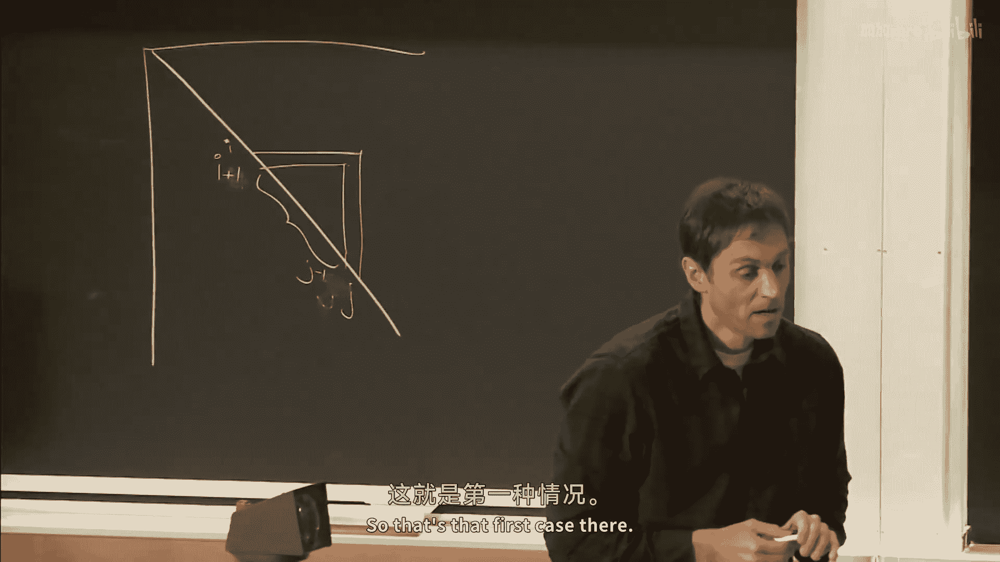
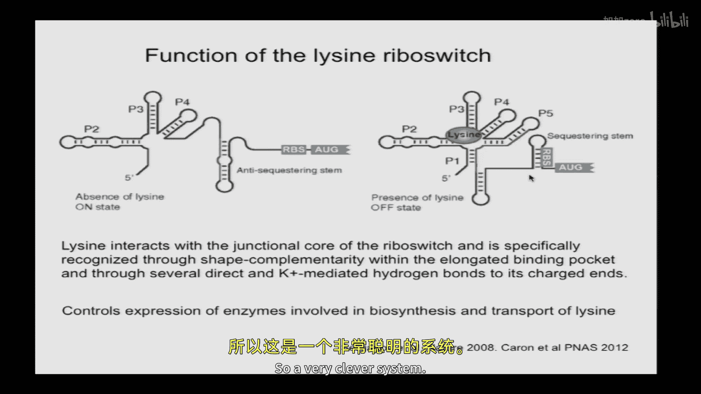
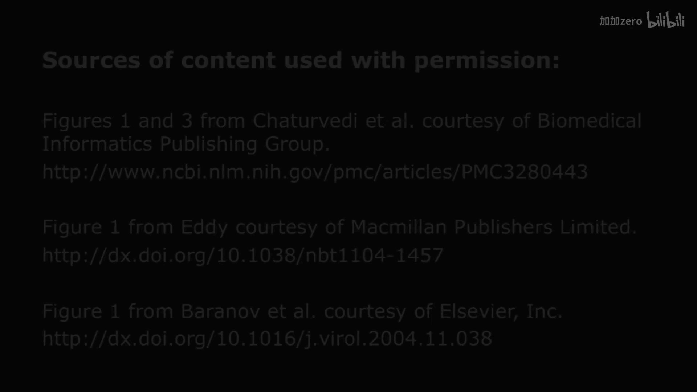

# 【计算与系统生物学基础 7.91J 2014】麻省理工—中英字幕 p11 p10 11. RNA Secondary Structure; Biological Functions and Predictions -BV1HdzaYAE2a_p11-

The following content is provided under a creative Commons license。

 Your support will help M I T Open Coware continue to offer high quality educational resources for free。

To make a donation or view additional materials from hundreds of MI T courses。

 visit M T OpenCourseware at OCw。 MT。 Eduu。

All right。We should probably get started。So RNA plays important regulatory and catalytic roles in biology and so it's important to understand its function and so we're going to that's going to be the main theme of today's lecture。

 but before we get to that I wanted to。

Briefly review some what we went over last time， so we talked about Hi markov models。

Some of the terminology， thinking of them as generative models。

 terminology of the different types of。Parameterters。

 the initiation probabilities and transition probabilities and so forth。And the Turbi algorithm。

hi is sort of the core algorithm used。嗯。Whenever you apply HMs。

 essentially you always use the theterbi algorithm and then we gave as an example the CPG Island HMM。

 which is admittedly a bit of a toy example， it's probably know not really used in practice but illustrates the principles and then today we're going to talk about a couple of real worldor HMMs but before we get to that I just wanted to sort of toward the end we talked about the computational complexity。

Of the algorithm and concluded that if you have a K state HMM run on a sequence of length L。

 it's order K squared L。 Okay， and this diagram。Is helpful to many people in sort of thinking about that so you can have transitions。

From any， from any state， for example， from this state to any of the other five states in this five state HMM。

 And when you're doing the vitubi， you have to maximize over the five possible input transitions into each state。

 And so the full set of computations that you have to do from going from position I to I plus1 is is k squared。

 So does that makes sense。 And then there's L different transitions you have to do。

 So it's K squared do。Any questions， questions about that。All right。

 and so the example that we gave is shown here and what we did was to take an example sort of where you could sort of see the answer。

 not immediately see it， but you know if we were thinking about it a little bit figure out the answer。

 and then we talked about how the Vitubi algorithm actually works。

 and why it makes the transitions at the right place。嗯。

It seems to intuitively like it would would make a transition later。

 but actually it transitions at the right place。 And one way to think about that is that。It。

It's not making these are not hard and fast decisions when it's making because you're optimizing two different paths at at every state。

 you're considering two possibilities。 And so you explore the possibility of， you know。

 the first time you hit a C， you explore the possibility of of transitioning from genome to island。

 but you're not confirming whether you're gonna do that yet until you。

 until you get to the end and see whether that path ends up having a higher probability at the end of the sequence than than the alternative。

 Okay， so。That's sort of one way of thinking about that。 Any questions about this。This sort of thing。

 how to。Sort of understand when a transition will be made。

 And I want to emphasize you can for this simple HMM， we talked about。

 you can kind of see what the answer is going to be。 But if you have， you know， any H M M。

Any sort of interesting real world HMM with multiple states， you know。

 there's no way you're going be able to see it。 I mean。

 maybe you could guess what the answer might be that you're not going to be able to be be confident of what that is。

 which is why you have to have to actually implement it。Allright， good。All right。

 let's talk about a couple real world HMMs， So I mentioned gene finding that's been a popular application of HMM as both in prokaryotes and eukaryotes。

 there's some examples discussed in the text。 Another very popular application。

 or so-called profile HMM。 And so this is a hidden markov model that's made based on a multiple alignment of proteins which have a related function or share a common domain。

 For example， there's a database called PFAM。Which includes profile HMs for hundreds of different types of protein domains。

 And so once you have。Many dozens or hundreds or thousands of examples of a protein domain。

 you can learn lots of things about it， not just what the frequencies of each residue are at each position。

 but how likely you are to have an insertion at each position。 And if you do have an insertion。

 what types of amino acid residues are likely to be inserted at that position and how often you are likely to have a deletion at each position in the multiple alignment。

 And so the challenge then is to take a query protein and to thread it through all of these profile HMs and ask does it have a significant match to any of them。

 And so that's know that's basically how PfaM works。

 And the nice thing about HMs is that they allow you to if you want to have the same probability of insertion at each position in your multiple alignment。

 you can do that。 But if you observe if have enough data to observe that there's a fivefold higher likelihood of having an insertion at position3 in the multiple alignment。

 then there is。Position2， you can put that in。 you just change those probabilities。

 Okay so in this HMM， each of the hidden states is either an M state， which is a match state。

or an eye state or an insert state， and so those will emit actual amino acid residues or it can be a delete state。

 which is thought of as admitting a dash， a placeholder in the multiple alignment。Okay。

 so these are also， also widely used and then。One of my favorite examples， it's fairly simple。

 but turns out to be quite useful is the so called TM HMM for prediction of transmembrane helices and protein。

 so we know that。Many， especially eukaryotic proteins are embedded in membranes。

Often there' one famous family of seven transmemne helix proteins。

 and there are others that have one or a few transmemne helices and knowing。

That a protein has at least one transmemne helix is is very useful in terms of predicting its function。

 You predict it its localization and knowing that it's a seven transmem helix protein is also useful。

 And so you want to predict whether the protein has。Transferm helices and what their orientation is。

 that proteins can have their inter termminus either inside the cell or or outside the cell。

 And then， of course， where exactly those helices are。 And this program has about a 97% accuracy。

 according to the。 So it works it works very well。 So what properties do you think we said before that you have to have strongly different emission probabilities in the different hidden states to have。

 you know， to have a chance of being able to predict things accurately。

 So So what properties do you think are captured in a model of transferm helices。

What types of emission probabilities would you have for the different states？Mi， anyway？

So taking you for this protein， like what kinds of residues would you have in here， oops sorry。

T memory me trouble this thing right here in the middle of the membrane。😊。

What kind of residues are you going to see there？It was going to be hydrobic， exactly。

 And what about right where the helix emerges from the memory？

Often you see charge residues there that kind of anchor it to prevent it from like sliding back into the membrane。

 And then in general， both on the exterior and interior。

 youll have you'll tend to have more hydrophilic residues。 So that's sort of the basis of T MHMM。

 And it also so this is this is the structure。 And you'll notice that these。These。

 these are not exactly the hidden states that correspond to individual amino acid residues。

 This is sort of these are like meta states， just to illustrate the the overall structure。

 I'll show you the actual states on on the next slide。

 But these were the types of states that the author Andrew Crorow decided to， to model。

 So he has sort of a。Fouses here on the helix core， okay。

 there's also a cytoplasmic cap and a non cytoplasmic cap oops。

't mean that and then there's sort of a globular domain on each side both on the cytoplasmic side or you can have on the non cytoplasmic side。

 so there's going to be different compositions in each of these。In each of these regions。 Now。

 one of the things we talked about with H M Ms is that if you were now。

 let's think about the Helix core， the simplest model you might think of would be to have sort of a。

A helix state。 And then to allow that state to recur to itself。 Okay。

 so this type of thing where you then had some transition to， you know。

 some sort of cap state after this would allow you to。Model helices of any length， right？But now。

 how long are transm helices， What does that distribution look like， Does anyone have an idea。

There's a certain physical dimension by fossilslipid。

It takes a certain number of residues to get across here， right， And that number is about 20 it。

 Okay so transmem helices tend to be sort of on the order of 20 plus or minus a few。

 And so it's totally unrealistic to have a transmemne helix。 that's like 5 residues long。 right。

 So if you run this。Algorithm in generative mode。 What distribution of helix lengths will you produce。

We're ingenrative mode where we're going to let it， remember。

 generate a series of hidden states and then associated。Imunno acid sequences。It's coming from some。

 you know， let's say， I don't know。What kind of seats are there here？1八0。Let's say。Ites into Helix。

Hangs out here， I'm sorry， dude is there an answer to this question？I to know how long if I let it。

 let it run， It'll generate a random number。 It depends on what this probability is here。

 Let's call this probability P。 And then this would be 1 minus P。Okay， so obviously。

 if 1 minus P is bigger， it'll tend to produce longer helices， But in general。

 what is the shape of the distribution that of consecutive helicical states that this model will generate。

玩咗冇。Bomial， okay， can you explain why？The helix would。Have to。Have the pro helix a avoid and would。

1 minus P to the n power。Okay， so a helix at length end for the probability that say let's call it L。

 the length of a helix。Equals n is。1 minus P。To the N， right？Is that binommial。审判长。Yes。

Is it negative by？N给ative板年了。The a number of times it stays in a good state。Yeah。

 so the distribution is going to be like that。 right， You have to stay in here for N and then。Leaf。

So this is， I mean， the simplest。You know， you can have special cases of binomial and negative binomial But in general。

 this distribution is called the geometric distribution or the continuous version would be the exponential distribution。

 right， So what is that， what is the shape of this distribution， if I were to plot。An。You know。

 N down here on this axis and the probability that L equals n。On this axis。

 what kind of shape can someone draw in the air？So you had like up and and down。Okay。

 so actually it's going to be just。Down， right。Like that， right， because。As as n increases。

 this goes down， right， because 1 minus p is less than1， So it just steadily goes down。

 And what is the mean of this distribution。Remember this。Yeah， so there's。

 there's sort of two versions of this that you'll see。 One of them is the one minus P。N-1 P。

 and one of them is this。 And so this is the number of。Failures before success， if， if you will。

 if success is leaving the helix。 And this is the number of trials till the first success。 right， So。

 so one of them has a mean that's one over P and the other has a mean that's1 minus P。Overpe。Okay。

 so usually。P is small， and so those are about the same。Okay， so one over P。

 you can think that one over P is roughly right。 And so if we were to model transmem helices and if transmem helices are about。

 I said， about 20 residues long。You would set P to what value。To get that， to get the right knee。けし。

Yeah。0。05120th， so that one over that will be about 20， right？SoAnd then 1 minus p would， of course。

 be 0。95。So if I were to do that， I would get a distribution that looks about like this with a mean of 20。

 Okay， but if I were to then look at real transmem helices and look at their distribution。

 I would see something。Totally different。 It would probably look like that， right， It would be。

Would have a mean around 20， but the probability of anything So less than 15 would be 0。 right。

 That's too short。 It can't go across， the membrane， right， so。And then again。

 you don't have ones that are 40。 They don't kind of wiggle around in there and then come out。

 They tend to just go straight across。Yeah， so there's a problem here。

 You can see that if you want to， you know， make a more accurate model， you want to capture not only。

 you know， not only get the right emission probabilities with the right probabilities of hydrophobics and hydroophilics in the different states。

 but you also want to get the length right。 Okay， And so the trick that。Well， actually， yeah。

 can anyone think of tricks to get the right length distribution here？How do we do better than this？

Hidden markov models where you have a state that recur to itself。

 it will always be a geometric distribution。 The only choice you have is what is that you know what is that probability and that will give you so you can get any mean you want。

 but you always get this shape right So if you want a more general shape。

What are some tricks that you could do？How can you change the model？

Any of and your microphone and as well。Multiple helix states， okay， how many？啊。関的来。那。

Like one for each。20多万。暂啲达成。For less summer， right， so you could have something like。I mean。

 let's say you have like this。Heel looks begin or I don't know， heix1， heelix two。

You allow each of these to recur。To themselves，What does that catch you？

This actually gets you something a little bit better， it gives you a little bit of it。

Its more like more like that。 Okay So that's better。

 But if I want to get the an exact distribution then actually one， you know。

 so this is the solution that the authors actually actually used。

 they made essentially 25 different helix。States， and then they allowed various different transitions here。

 So by setting， you know it'， it's a little arbitrary here。 but by they have this special。

State 3 that can kind of take a， take a jump。 so it can， it can just continue on to 4。

 and that'll make your maximum length Helix core， right， or it can skip 1， go to 5。

 and that'll make a helix core。 That's， that's one residue shorter than that。

 or it can skip 2 and so forth。 And you can set any probabilities you want on these transitions。

 And so you can fit basically an arbitrary distribution。Within a fixed range of legs。

 that's determined by how many states you have。Okay。

 so they really wanted to get the length distribution right。 And that's what they。

 that's what they did。 What's the cost of this， What's the downside， Simona。

I was just going to ask it looks like from this that your minimum helix length could be four。

That's a good question。Yeah， we don't know what the probabilities。 know， you know。

 they they said on that， whether they really mean that or， or And also， that's only the core。

 maybe these cap things can be able。 Yeah， that seems a little short to me， so。Yeah， I agree。

I'm it could just be for the sake of illustration， but they don't actually use those。

YeahBut but anyway， the point， yeah， that's， I mean， probably have to read the paper。

 I haven't read this paper for many years。 So I don't remember exactly the answer to that， but。

 but it's I have a citation。 You you can look it up if。

 if you're curious or but the main point I wanted to make with this is just that by setting an arbitrary number of states and putting in you know。

 possible transition between， you can actually construct any length distribution you want。

 But there is a downside and that what is that downside。 computational cost。

 instead of having one helix state。 now， we've got， you know，25 or something。 So， you know。

 and the time goes up by the square of the number of states。 So it's， it's going to run slower。

And you also have to estimate all the parameters。Okay。So here's an example of the output of。

The TMHMM program for a mouse chloride channel gene， CLC6。

 so the program predicts that there are seven transmebrane helices shown by these little red blocks here。

 you can see they're all about the same about 20 or so。

 and that the program starts outside and ends inside。Okay， so。

Let's say you were going to do some experiments on this protein to test。To test this prediction。

 So one of the types of experiments people do is they put some sort of。

Modfiable or modified residue into one of the。Spaces between the transparent helices。

 And then you can test， you know， can we modify by modifying the cells with with something that's a non permeable。

 know chemical， can you modify that protein， So if only if that stretches on the outside of the protein。

 will you be able to I'm sorry， in the outside of the cell， will you be able to predict it。

 So that's a way of testing the topology。So if you were doing those types of experiments。

 you might actually， like maybe you're not sure if， you know， every transmemne helix is correct。

 right， that could be some where the boundaries were a little off or even even a wrong helix。

 And so one of the things that you often want with a prediction is not。

 not only to know what is the optimal or most likely prediction。

 but also how confident is the algorithm in each of the parts of its prediction。 How confident is。

 is it in the， you know， the location of transmemne helix 3 or the you know。

 the probability that actually there is a transmemne helix 3。

 Okay And so the way that this program does that。Is using something called the forward backward algorithm。

 Okay， so those of you who read the Rabinar tutorial is described pretty well there。

 The basic idea is that I mentioned that this。PO， the probability of the observable sequence。

Summing over all possible HMM structures or know all possible sequences of hidden states。

 that is possible to calculate。 And the way that you do it is you run an algorithm that's similar to the vitubi。

 But instead of taking the maximum entering each hidden state at intermediate positions。

 you sum those inputs。 Okay， so you just do the sum at every point。

 And it turns out that will calculate the sum of the two values at the end or the K values at the end will be equal to the sum of the probabilities of generating the observable sequence。

 over all possible sequences of hidden states。 Okay， so that's that's useful。

 And then you can also run it backwards。 There's no reason has to be only going in one direction。

 And so what you do is you， you run the sort of summing versions of the vitubi。😊，嗯。

And in both the forward direction and also run one in the backward direction。

And then you take a particular position here。 Like， let's say this is your helix state， for example。

 So， and we're interested in this position， you know， somewhere in the middle of the protein。

 we want to know， is that a helix or not。 And so basically。

 you take the value that you get here from the forward in your forward algorithm and the value you get here in the backward algorithm and multiply those two together and divide by this P O And that gives you the probability。

 Okay so it's。😊，That ends up being equivalent a way of calculating the sum of all the parses that go through this particular hidden。

 this particular position I in the sequence in that particular hidden state。So， I mean。

 I realize that that may not have been totally clear and I don't want to take more time to totally go into it。

 but it is pretty well described in Rabinar， and I'll just give you an example。

 So if you're motivated please take a look at that。 And if you have further questions。

 I'd be happy to discuss like during office hours next week。

 And this is what it looks like for this particular protein。

 you get something called the posterior probability。

 which is the sum of the probabilities of all the pars。

And they've plotted it for the particular state that is in the vitubi path that is in the optimal parts。

 So for example， in blue here。 So the blue is the well， actually。

 they've done it for all the different states here。 So。

 so blue is the probability that you're outside。 Okay， so it's very。

 very confident that the n terminus of the protein is outside the cell。 It's very。

 very confident in the locations of transmem helices 1 and 2。It actually。

More often than not thinks there's actually a third helix right here。 Okay。

 but that didn't make it in the optimal parse。 That actually occurs in a majority of parses。

 but not not in the optimal one。 and it's probably because it would then cause other things to be flipped later on if you had transfermate helix there。

 It's not sure whethers a helix there or not， but then it's confident in this one。 Okay。

 so this gives you an idea now， if you were going to。

 you know if you wanted to do some sort of test of the prediction。

 you want to test probably first the higher confidence predictions。

 So you might you know do something do something right here。 or if you maybe you from experience。

 you know that when it has， probably that's that high， it's always right。

 So there's no point test it。 So you should test one of these kind of less confident regions。

 So this is actually makes the prediction much more useful to have know some degree of confidence assigned to to each each part of the prediction。

All right， so for the remainder of today， I want to turn to the topic of RNA secondary structure。

So at the beginning， we'll sort of give through some nomenclature。

 and then to motivate the topic gives some。Biological examples of RNA structure gives me an excuse to show some pretty pictures of structure。

 and then we'll talk about two approaches， which are two of the most widely used approaches toward predicting structure。

 so using evolution to predict structure by method of covariation。

And then which works well when you have many homologous sequencers and then using sort of first principles。

 thermodynamics。To predict secondary structure by energy minimization。

 where obviously you don't need to have a homologous sequence present。And the。

Nature Bitechnology primer on RNA folding that I recommended is a good intro to the energy minimization approach。

So what is RNA secondary structure？You all know that。That RNAs like proteins have。

A three dimensional tertiary fold structure that in many cases determines their function。

 but there's also sort of a simpler representation of the structure where you just describe。

Which pairs of bases are hydrogen bonded to one another， Okay， And so per RNA， So it's a famous。

Example of an RNA structure， this sort of clover leaf structure that all TRNAs have。

 the secondary structure of the TRNA is the set of base pairs。

 So it's this base pair here between the first base and this one toward the end and then this base pair here and so forth。

 And so if you specify all those base pairs， then you can then draw a picture like this。

 which gives you a good idea of what。Parts of the RNA molecule are accessible。 So， for example。

 it won't tell you where the anticondon loop is。Which is sort of the business end of the TRNA。

 But you know， it narrows it down to like three possibilities。

 You might consider that or that or down here。 You know， it's unlikely to be， you know。

 something in here because these bases already pair。 They can't pair to the message。

 So it gives you sort of a first approximation toward the 3D structure。 And so it's quite useful。

 So how do we represent secondary structure。It a few different common representations that you'll see。

 So one is， and this is sort of a computer friendly， but not terribly human friendly representation。

 I would say， is this so sort of dot in parenthses notation here。 So the dot is an unpaired base。

 And the parenthesis is a。Is a paired base， and how do you know？Chalk is sort of。

Non uniformly distributed here， so if you。If you have a structure like this and you have these three parentheses。

 you know， what are they paired to， Well， you don't know yet， Okay， until you get further down。

 And then each left parenthesis has to have a right parenthesis somewhere。 Okay。

 so now if we see this then we know that there are two unpaired basis here。

 And then there's going to be three in a row。That are paired， okay， these guys。

You don't know what they're paired to yet。 Okay， Then there's going to be a five base pair loop。

Maybe a little Pentagon type thing。Two， three， four，ops。4 five。 Okay， and this one would be this。

 then the the right parentheses that pair with the。With the left parentheses。Over here， okay。

And should probably draw this coming out So to make make it clearer that that it's not paired。 Okay。

 so that this， this notation， you can convert to this。 So after a while， you know。

 it gets relatively easy， to do this， except when they're when they're super long。So。

 so that's what the left part of that would look like。 So what about the right part。

 So the right part we have。Something like。One， two， three， four。A bunch of dots。

 And then we have two， and then a dot， and then  two。What is that， What does that thing look like。

 So that's going to look like。4 bases here in a stem。Big loop。

And then there's going to be two bases that are paired and then a bulge and then two more that are paired。

These things happen in real structures。Okay， and then the arc nottation is a little more human friendly。

 It actually draws an arc between each pair of bases that are that are hydrogen bonded。 Okay。

 so I'm sure you can imagine what those structures。What would look like。

And it turns out that the arcs。Are very important， like whether those arcs cross each other or not is sort of a fundamental classification of RNA secondary structures into the ones that are tractable and the ones that are really difficult。

Alright， so pretty pictures of RNA。 So this is a you know。

 lower resolution cry structure of a bacterial ribosomes。 So remember ribosomes have two subunits。

 a large subunit，50 S and a small subunit，30 S。 And if you crack it open。 Okay。

 so you basically split， you sort of break the ribosome like like that。 And you look inside。😊。

They're full of TRNAs， so there are three sort of pockets that are normally distinguished within ribosomes。

 the a site。 This is the site where the TRNA enters。

 that's going to add a new amino acid to the growing peptide chain， the P site。

 which is TRNA will have attached to the actual growing peptide and then then the exit tunnel where this TRNA will eventually the exit the E site where which is the one that used to be that was added a couple of residues go。

Okay。So one thing people， you know， people often think of RNA structure just in terms of these secondary structures because they're so。

 you know， they're much easier to generate than venteriary structures。 And you know。

 they give you like for T RNA， you know， it gives you a pretty good you know some pretty good information about how it works。

 But for so a large and complex structure like the ribosome。 it's actually。

 it turns out that that RNA is actually not bad at building complex structures。

 I would say it's not as good as protein but its can it is capable of constructing like something like a long tube。

 And in fact， in the ribosome， you find such a long tube right here that。😊。

Is where the peptide that's been synthesized exists the the ribosome。

 And you'll notice it's not like a large cavity in which the protein might start folding。

 It's a skinny tube that is thin enough that the peptide polypeptide has to remain linear cannot start folding back on the cell。

 Okay so you sort of extrude the protein in a linear unfolded confirmation and let it fold outside of the ribosome。

If it could fold inside that that， that might clog it up。 I think that would be a big。

 That's probably one reason why you don't why it's not designed that way。

Sure that was tried by evolution and rejected。 Okay， so if you look at the ribosome。 now， remember。

 the ribosome is composed of both RNA and protein， you'll see that it's much more。

Of one than the other， right？ And so the， it's really much more of the fetcii。

 which is the RNA part than the thelinguni of the protein。

 And if you also look at the distribution of the proteins on the ribosome。

 you'll see that they're not。In the core， they're kind of decorated around the edges。

 It really looks like something that was originally made out of RNA。 And then you sort of added。

 you know， proteins as accessories later。 And that's that's probably what happened。Okay。

 so if you then， this is based on the structures that were solved a few years ago。

 if you then look at。

Where？The nearest proteins are to the active site。 the actual catalytic site。 Remember。

 the ribosome catalyzes peptide， addition of amino acid to a growing peptide。

 So peptide bond formation。 you'll find that the nearest proteins are around 18 to 20 angstroms away and this is too far to do any chemistry。

 So this structure you know， the active site residues need to be or molecules need to be。

 know within a few angstroms to do any useful chemistry。

 And so this basically proves that the ribosome is a ribosome。

 that is it's an RNA enzyme RNAs is doing the catalysis。All right。Okay， so here is the structure。Of。

A ribosome， you know， it's very kind of beautiful and it's impressive that， you know。

 somebody can actually solve the structure of something this big。 But what。

 what is actually the the practical use of this structure。 It turns out there's。😊。

There's quite an important practice。Application of narrow。見えです。先才大。Anbis。

 so many antibiotics work by taking advantages of differences between the prokaryotic ribosome structure and the eukaryotic ribosome structure。

 So if you could make a small molecule。On。These are some examples that will。

Inhi prokaryotic ribosomes， but hopefully not inhibit eukaryotic ribosomes。

 then you can kill bacteria that might be infecting you。Okay。So。Nonco RNA。

 So there's many different families of nonco RNA。 And I'm I'm going to list some in a moment。

 but I'm going actually challenge you see if you can come up with any。

 any more families of nonco RNA， but theyre。They're receiving increasing interest， I would say。

 ever since microRNAs were discovered sort of a boom in looking at different types of non-coding RNAs。

 link RNAs also important and interesting as well as many of the classical RNAs like TRNAs and R RNAs and snow RNAs。

 you know they may have there may be new aspects of their regulation and function that will be interesting and so when you're studying a noncoding RNA。

 you it's very， very helpful to know its structure if it's going to base pair in trans with some other RNA as TRNAs do as microRNAs do。

 for example， or and SNRNAs and snow RNAs， then you want to know which parts of the molecule are free and which are internally base paired。

And if you want to predict noncod RNA genes in a genome。

You may want to look for regions that are under selection for conservation of RNA structure。

 for conservation of the potential to base pair at some distance。 If you see that。

 it's much more likely that that region of the genome encodes a noncoding RNA than that encodes。

 for example， a you know， that's a coding exxon or that it's a transcription factor binding site or something like that that functions at the DNA level。

 And so so having some this notion of of structure even just secondary structure is is helpful for。

For for that application as well， I'm predicting functions as I mentioned。Co variation。

 So let's take a look。At these sequences。 So imagine your。

 you've discovered a new class of mini microRNAs。 Okay， theyre only eight bases long。

 and you've sequenced5 homologues from your five。😊，Favorite mammals， okay？

And these are the sequences。That you get。And you know that they're homologous by synchphony。

 they're in the same place in the genome and they seem to have the same function。

 What could you say about their secondary structure based on this multiple alignment？

I to stare it a little bit。See the there's pattern here。Any ideas， anyone？

Howd a guess was the structure。Ks。Yeah， there's a two base pair stem and then four base。嗯哼。

Two base pair stem， four base loop， and then you have other a half of the stem。

 so you how do you know that So if you look at the。First two and last two。Basis of each sequence。

 the first and the eighth nucleotide can pair with each other and the so in the second and the seventh。

Yes， I might say that so in the first home you have。AAC G， and that's complementary to U， A， U， G， C。

 Each basis is complementary， the second。Position CA A G GU， complementary to GUC UA。

It's one slight exception there。Yeah， so it， it turns out that at RNA。

 although the Watson crrick pairs， G C and A U are the most stable。

 G U pairs are only a little bit less stable than than A U pairs。

 And you will they they occur in natural natural natural RNA molecules。 So G U is is allowed in RNA。

 even though you would never see that in in DNA。 Okay， yeah， so everyone， everyone see that。

 So structure is， well， I think。Have it here。 you see sort of co this would be covariation。

re preserving you're changing the bases， but preserving the ability to pair。

 So when one base change when the first base changes from A to U。

 the last base changes from U to A in order to preserve that pairing。

 you wouldn't know that if you just had two sequences。 But once you get several sequences， you know。

 it can be pretty compelling and allow you to make a pretty strong inference that that is the structure of that molecule。

So how would you do this， So imagine you had a more realistic example where you've got a noncod RNA that's1 hundred or a few hundred bases long。

 and you might have a multiple alignment of 50 homologous sequences。You want something， you know。

 you're not going to be able to see it by eye， right， You need sort of a more objective criterion。

So one method that's commonly used is this statistic called mutual information so if you look in your multiple alignment。

I'll just draw this here。You have any sequences。You consider。Every pair of columns。

 this is the multiple alignment to this column。And this column， and you calculate。

What we're going to call。What are we going to call it FX？

That would be the frequency of the nucleotide X and column I。 So you just count how many A's， Cs。

 Gs and Ts there are， and similarile。F J Y for all the possible values of x and all the possible values of y。

 So these are the base frequencies in each column。 And then you calculate the dinucleotide frequencies。

 X， Y。At each pair of columns。 Okay， so in this column， you say if there's an A here and a C here。

 and then there's another A C down here。 and there's a total of，1，2，3，4，5，6，7 sequences， then F。AC。

Ij。Gs。2 over over 7。 Okay， so you just， you calculate the frequency of each diuccleotide。

 But these are not no longer consecutive diucotides in the sequence necessarily there。

 They can be at arbitrary spacing。 Okay， so you calculate those， and then you。

Throw them into this formula。Okay。And outcomes comes a number。

 So what does this formula remind you of， Have you seen a similar formula before。

Someone said me with， okay yeah， I' go ahead。the chair面。Yeah， it looks like shannon entropy。

There's a log of a ratio in there， so it's not exactly Shan and entropy。

 So what other formula has a log ratio in it。Rele so it actually looks exactly like relative entropy。

 so relative entropy of what versus what。Who can sort of say？

More precisely if it's we'll say it's relevant to be of something versus a P versus Q and what is P and what is Q。

 Yeah， is that relative and for P of。Coll occurrence versus。Good， good， yeah， co occurrencecurrence。

I're going to get that cocurs of pair of nucleotides X， Y at positions I J versus Q。

Is independent current。 So if X and Y occurred independently， they would have。On。

They would have this frequency。Okay， so if you think about it。

You calculate the frequency of each base at each column in the multiple alignment。

 And this is like your null hypothesis。 You're going to assume what if they're they're。

 they're evolving independently， Right， So， so any， you know。

If it's not a folded RNA or if it's a folded RNA， but those two columns don't happen to interact。

 there's no reason to suspect that those bases would have any relationship to each other。

 So this is like your expected value of。The frequency of X， Y a position I J。

 And then this P is your observed value。 So you're taking relative entropy of basically of observed over expected。

 Okay And so relative entropy。Has， I haven't proved this， but it's it it's non negative。 It can be 0。

 and then it goes up to some maximum positive value， but， but it's never negative。

 And what would it be if， in fact， P were equal to Q。What would this formula give？

This is we're saying， suppose。Suppose this in general， this won't be true。

 but suppose it was equal to that。We've got M on。Ija。Equal summation of what？That log of。This。

 which is equal to this， right， So it's Fx。I FY。Ze。Over。The same thing。Lolog of。

Hope you can see that log of。Log of 1 is0， right？So it's just 0。 Okay， So if the。

Nucotides that the two columns occur completely independently。 and mutual information is 0。

 and that's that's why it's's one reason it's called mutual information。 There's no information。

 you know， knowing what's at column I gives you no information about about column J。 Okay。

 so remember， relative entroies are measures of information not not entropy， okay。

And what is the maximum value that the mutual information could have？Any ideas on that？Any guesses？

That's not Joe。F sub x F sub y。Of one， okay， so you're saying if one of the particular diucanides has a frequency of one。

Yeah， yeah， so they're like always the same。Right， whatever there's like in， there's always。Yeah。

 so whenever there's an A， there's always a G or a T， it's like， yeah， okay。

 so then you'd get overflow one in the new rightator and the all shift。Probabilities in the bottom。

Which would be maximized if they were all。If they're all un。Yeah， so don't want get that。

 So the maximum occurs if。If X， F X， I。And。And J， if they're both uniforms。

 So they're they're a quarter for every base at both positions。 Okay， sort of that's。

 that's the maximum entropy right in the background distribution。 But then if。If F， X， Y。I J。

Equals one quarter。For。For example， x equals y。 or in our case， we're not interested in that。

 We're interested in x equals complement of y。C Y is's gonna be the compliment of Y and。Yeah。

And zero， otherwise。4。X。Not equal complement。Of wine。 Okay， so for example。If。

 if we have only the duccleots， A T。CG， GC， and TA occur。

 and each of them occurs with a frequency of a quarter。

Then you'll have four terms in the sum because remember， the0，0 log 0 is 0。

 so you'll have four terms in the sum， and each of them will look like one quarter。Log。

One quarter over a quarter times a quarter。 right。 And so this will be。4， so log 24 is 2。

 And so you have four terms。That are each one quarter times two。 and so you'll get。2。

But this is not a P sum， I mean these are the four terms。

 these are the individual nonzero terms in that sum。That makes sense， everyone。I get this。Yeah， so。

 so that's why this is a useful measure of covariation。 Okay， if they really， you know， if。

 if what's in one column really strongly influences what's in the other column。

 and there's a lot of variation in the two columns。 And so you can really see that co variation well。

 then mutual information is maximized okay。😊，And that's basically what we just said is。

Written down here。So， yeah， it's actually， it's maximal。 It doesn'。

 They don't have to be complementary， right， It would be achieve this maximum of  two if they are complementary。

 but it would be also if they had some other， you know， very specific。

 know relationship between between the nucleotide。 So it doesn't。

 So you might want to if you're gonna to use this the way you would use it is take your multiple alignments。

 calculate the mutual information of each pair of columns。 Okay。

 so you actually have to make a table， you know， I versus J， all possible pairs of columns。

 And then you're gonna look for like the really high values。

 And then when you find those high values。You want to see。

That when you look at what actual bases are tending to occur together。

 you want to see that they're actually， you know， the bases that that are complementary to one another。

 And another thing that you'd want to see is you'd want to see that。

Conseative positions in one part of the alignment are covariing with consecutive positions in another part of the alignment in the right way。

 in the sort of inverse complementaryary way that that RNA likes to pair。 that makes sense。

 So in in a sort of。In a sort of nested。A nested way in your multiple alignment。

 if you saw that this one covariried with that and then you also saw that the next base covariried with the base right before this one。

 okay and this one covariaries with that one， you know， that starts to look like a stem。

 right It's much more likely that you have a three base stem than that you just have some you know isolated base pair out in the middle of nowhere。

 right， It turns out it takes it takes a few bases to make a good thermodynamically stable stem。

 And So you want to look for blocks of these things。 Okay and so this works pretty well。Yeah。

 actually， one point I want to make first is that。Mutual information is nice because it's。

 it's kind of it's kind of a useful concept。 And it also relates to some of the entropy and relative entropy we've been talking about in the course before。

 But it's not the only statistic that would work in practice。 You can use it。

 you can use any measure of basically nonindependence between distributions like a chi square statistic would。

 would probably work equally well。😊，Okay， and so here is a multiple alignment。

I have a bunch of sequences。And what I've done is put boxes around columns that have。

Significant mutual information with other sets of columns。 Okay， so for example， this。

 this set of columns here。At the left， the far left has significant mutual information with the ones at the far right and these ones。

 these four positions， covari with these four and so forth。

 So can you tell based on looking at this pattern of covariation what the structure is going to be。

Okay， the first， let's say we start up here。 The first is going pair with the last， right。Okay。

 with something at the end， then we're gonna have something here in the middle。

That pairs with something else nearby， right， Then we have something here that pairs with something else nearby。

 Then we have another like that。Right。Does that make sense。

 so there's these three pairs of columns in the middle， these two and these two。

 and then they're surrounded by this thing， the first pairing with the last。

 and so it's a clover leaf， so that's TRNARNA。Okay。Yeah。How would be。So。With that。Previous slide。

This table here， you could create a covariance。嗯，好对。Or it could be how does that covari matrix。

 how you convert it to this representation or I'm just wondering how this would show up like let's say you took the covariation matrix or what would it capitalizeize it as a heat map in the covariation matrix。

 what would it look like？In this particular again。Yeah， that's good question。

 okay let's just do that。I haven't thought about that before， so we'll have to go。

You have to help me on this。There would be， here's the beginning。 Okay。

 We're going to write the sequence from one to n in both dimensions。 Okay。

 and so here's the beginning。 and it covariries with the with the end， right。

 So this first would have a covariation with the last right。

 And then the second would covari with the second to last and so forth。 So you get a little diagonal。

Down here， right， that's the。Thiss this top stem here， right。 And then what about the second stem？

 So then you'd have something down here。That's gonna to covari with something kind in you're buying it。

 right， So that's going to be。An。So block 2 is going to covarirate with block 3， and again。

 it's going to be this inverse complementaryary kind kind of thing like that，I mean。

 it it's symmetrical， right， so you get。This bring with that。But you only have to do know one。

 one half， right， so you can just。Do like this upper half here。 Yeah， so you get that。 So you get。

 you get， I believe you get。We look something like that。It would be diagonal life。第一个问。Yeah。

 that's because they're inverse complementaryary， right？看没看。这块是。we'll see an example like that later。

 actually， as it turns out。All right， so here's my question for you。And。

You're setting this noncoding RNA。You have it has some length， you have some number of sequences。

 they might have some structure， is this method going to work for you or is it not what is required for it to work。

 for example。Would I want to？Isolate this gene， this non coding RNA gene from just from primates。

 from like you know human gorilla chimp。Aangang，'s say and do that alignment。

 or would I want to go further， would I want to go back to you know the rodents and。Dog horse。

How far do you want to go， Yeah， question。We be very strong。cannot not go very hard。

Because we don't have a like high percentage。あ人研究。falsebsol right if you go too far。

 your alignment will suffer and you need an alignment in order to identify the corresponding column。

 So that puts an upper limit on how far you can go right But good excellent point。

 I there a lower limit， I mean， do you want to go as close as possible。

 Like this example I gave with human。ChampChmpangang， or is that too close。Why is too close bad Tim？

めで。Then the sequence is having diversion up。Reformation。Yeah。

 exactly if they're all in the same actually you get。1。Times1 over1。

In that mutual information statistic， which log of that is going to be zero。

 you get there's zero mutual information if they're all the same。Okay。

 so there has to be some variation， but。And the structure has to be conserved。 That's key， right。

 You have to assume that the structure is well conserved and you have to have a good alignment。

And there has to be some variation， a certain amount of variation。 Those are basically the。

The three keys， secondary structure has more highly conserved in sequence。

 sufficient divergence so that you have these variations and sufficient number of homologues。

 to get good statistics and not so far you get that your alignment is bad， sorry about that， Sally。

Well it seems like another thing that we assume here is that you can project it onto a plane and it'll lie flat。

So if you have like some very important weird cooling that allows you to like say crisscross the rainbow yeah crisscross the rainbow yeah very very reflection yeah that is it has to be able to。

So in the example of TRNA， if you were to do that arc diagram for TRNA。

 it would look like youd have the big arc。 that's the first and the last。

 And then you'd have these three nested arcs， nothing crisscrossing， right。What about， What if I saw。

Really that again。Two blocks of sequence that have a relationship like that。Is that okay。

With this method of collaborationation， that's okay。What does this structure look like？Okay， yeah。

 so。So if you have a stem， okay then you have a loop。Okay， and then a stem。 So this is one。

Pairs with three。 That's one。 That's 3。 Then you've got two up here， but two pairs with four。

 So two pairs， here's 4 over here。 So I'm gonna have4 is going have to come back up here。

And pair with two。Okay。This is two liium， so that is called a pseudoan。Okay。

It's not really a knot because this thing doesn't go through the loop， you know。

 but it kind of behaves like a knot in some， in some ways。

 And so do these actually occur in natural RNAs。Yes， Tim is nodding。Are they important。

 Can you give an example where they are important biologically？Res switches。Okay。

 we're going to come to what pres are in a moment for those not familiar。And yeah。

 and I think I have an example later of a pseudo or not that's important。

 So that's's a good question。Yeah， I think I should have added to this list the point that you made in the back about not being。

 you know， they have to be close enough that you can get a good alignment。 That would be， yeah。

 I should add that to this， to this list。 That's a good point。All right。

 so classes of non codingd RNAs， as promised， my favorites listed here。Everyone knows T RNAs， R RNAs。

 You can think of U T Rs as being noncoding RNA。 They they often have structure that that can be involved in regulating the message。

 SN RNAs involved in splicing snow RNAs， small nucleola RNA are involved in directing modification of other RNA。

 such as ribosomoma RNA and SN RNA， for example。Terminators of transcription and prokaryotes are like little stem loop structures。

 RNAP is important enzyme， SRP。Is involved in targeting proteins with signal peptides so that。

To the export machinery。We won't go into T mRNA， microRNAs and link RNAs， you probably know。

 and ribo switches。 Okay， so Tim， can you tell us what a ribo switch is。Which is any RNA structure。

Changes， confirmation。According to some stimulus that can be。ma毛 additionition or。

Something in the cell like could be an iron。Ctical change in structure。Yeah。

 great so just for those who may not have heard， I'll just say it again。

 so a ribos switch is any RNA that can have multiple confirmations and changes confirmation in response to some stimulus。

Temperature binding of some ligand small molecule， something like that。

 etc ceter and often the structure， one of those structures will block a particular regulatory element I'll show an example in a moment and so when it's in one confirmation the gene will be repressed and when it's in the other it'll be on so you can use it's a way of using RNA secondary structure to sense what's going on in the cell and to appropriately regulate gene expression。

All right， all right， so now we're going to talk about a second approach。

 so this would be the approach you've got some RNA。It may not do something。

 and maybe you can't find any homolos。 It might be some newly evolved species specific RNA。

 or you're studying some obscure species where you don't have a lot of genomic sequence around。

 So you want to use the first principles approach， their energy minimization approach。

Or maybe you have the homologs。 but the alignment， you don't trust your alignment。 You want。

 you want a second opinion on what the structure is going to be。

 So just in the way that protein folding is you can think of you can think of it an equilibrium model where it's determined by folding free energy and enthalpy will favor base pairing get you gain some enthalpy when you form a hydrogen bond and entropy will tend to favor unfolding。

 So an RNA molecule that's linear has all this conformational flexibility and you lose some of that when you form a stem It forms a helix。

 Those things can't don't have as much flexibility。 And even the。

Nucleotides in the loop are not are a little bit conformationally。

 They're not as flexible as they were when it was linear。 Okay， so， so that means that。

At high temperatures favor unfolding。 Okay， so the the earliest approaches were approaches that sought to maximize the number of base pairs。

 right， So you， you gain some so they basically ignore entropy and focus on the enthalpy that you gain from forming base pairs。

 And so Ruth Nusov described the first algorithm to figure out what is the maximum number of base pairs that you can form in an RNA。

 Okay， And so a way to think about this。Is。Imagine you've got this sequence。

What is the largest number of base pairs I can form with a sequence？

I you just draw for all the possible base pair that a compared with that T。

 This a compared with that T， they can't both pair simultaneously， right。

 And this C compare with that G。So。If we don't allow crossing， which now。

 we're now we're gonna like coming back to Sally point， we're this would cross this。

 right So we're not we're not going to allow that。 So the best you could do would be to have this A pair with this C and this C pair with this G and form this little structure。

This is not realistic because RNA loops are not one。 They can't be one base。

 the minimum is about three。 But， you know， just for the sake of argument。 Okay， you can。

 you can list all these out。 But imagine now you've got 100 bases here。Right。Every。

Every base will on average， potentially be able to pair with 24 or 25，25 other bases， right。

 So you're just gonna have a just an incredible。Mishmash of possible lines， all crisscrossing。

So how do you figure out how to maximize those？ThatThat pairing。Any ideas。港调。

You look for sections of homomlogy。we're not using， we'， we're much。

 but like sections where there so blocks of。He could blast the sequence against the inverse complement of itself and look for a little blocks。

行く時だよ。That's not what people generally do， mostly because the blocks of complementarity in real RNA structures are really short。

They can be two， three， four bases sally。Could you use some kind of dynamic programming approach where you just like start with a very small case and we build up？

Yeah， so we've seen that at work or。Protein sequence alignment we've seen it work for。

The Turbi algorithm。 So that is sort of the go to approach in bioinformatics is to use some sort of dynamic programming。

 Now this one。For RNA secondary structure that Nusenov came up with is a little bit different than the others。

 Okay， so you'll see it has a kind of different flavor。 It turns out to be， actually。

It's a little harder to get your head around at the beginning， but it's actually easier to。

 to like do by hand。 Okay， so let's， let's take a look at that。Okay。

 so recursive maximization of base pairing。Now， the thing about base pairing that's different from these other problems is that。

The first base in the sequence can base pair with the last， right， There's nothing。

How do you chop up the sequence， You know， Remember with， with Nadaman Wench and with Vituby， we go。

 we go from the beginning to the end。 and that's a logical order。 But with base pairing。

That's actually not a logical order。You can't really do it that way。Okay。

 so instead you go from the inside out。You start in the middle of the sequence， okay。

 and work your way outwards in both directions。Okay。

 or another way I thing about it is you start with。You write the sequence from 1 to n on both axes。

And then。We actually will see that we initiate the diagonal all to zeros。

 and then we think about these positions here next。So。1 versus 2。 we consider， you know。

 could one pair with two and could two pair with three。 Those are like little。

 little bits of possible RNA secondary structure。 Again。

 we're ignoring this fact that loops have to be a certain minimum。

 Like this is sort of a simplified case。 And then you build outward。 So you conclude that。Okay。

 base 4 here could pay pair with base 5。 Okay， so we're gonna put， gonna put the one there and。

Then we're going to build outward from that toward the beginning of the sequence and toward the end。

Adding additional base pairs when we can。That's basically the way the algorithm works。The key idea。

That's one key idea that we go from sort of close sequences。Work outward to far away sequences。

 And the second key idea is that the relationship that like as you add more bases on the outside of what you've already got。

 that the optimal structure in that larger portion of sequence space is related to the optimal structures of smaller portions of it in one of four different ways。

 And these are these are the four ways。 Okay so。😊，Yeah， let's look at these。Yeah。

 so the first one is probably the。The simplest。Where。

If you got't。Now you're doing this。You're here somewhere， meaning you've compared。

Sequences from position， let's say， you know， I -1 to to J， J -1 here。

 And then we're going to consider adding like。Actually， it depends how you number your sequence。

Let me see how is this done。 I Yeah， sorry， I plus1， yeah。I plus one。To J -1。 Okay。

 we figured out what the optimal structure is in here。 Let's suppose， Okay。

 and now we're gonna consider adding one more base on either end。 We're gonna add。J down here， okay。

And we're going to ask if it pairs with I。Okay，And if so。

 we're gonna take whatever the optimal structure was in here， and we're gonna add one base pair。

 and we're gonna add plus one because now it's got know one additional counting base pairs。 Okay。

 so that's that first， that first case there。 And then the second case is you could also consider just adding one unpaired base onto whatever structure you had。

 And then you don' you don't add one。 And that could be on you can go in either direction。

 you can go sort of toward the beginning of the sequence or toward the end of the sequence。

 And then the third one is is the tricky one is this what's called a bifurcation。 You could consider。

That actually I and J。Are both pair， but not with each other。

That eye pairs with something that was inside here。Okay。

 and J pairs are something that was inside here。 So your optimal。Parse from I to J， if you will。

 is not going to come from the optimal parse from I plus 1 to J -1。

 It's going to come from like re rethinking this and doing the optimal parse from here to here and from here to here and combining those two。

Okay， so。Probably confused by now， so let me try to do an example。

And then I have an analogy that will confuse you further。 So ask me for that one， okay。

This was the simplest one I could come up with that had this property。

We said before that if you were doing the optimal from one to five。That it would be the AC。

Pairing with the G T， right， We did that one。 Okay。

 And now if you notice this guy is kind of a similar sequence。 right。

 I just added a T at the beginning of A at the end and。

So you can probably imagine that the best structure of this is here。Those three。

 you get got three pairs of this sub sequenceequence here。I mean。

 that's as good as you can do with 7 bases。 You can only get  three pairs。 So。

 and this is as good as you can do with  five。 So these are clearly optimal。 Okay。

 so the issue comes that if you're starting from。Somewhere in the middle here。Let's say you are。

So how would you be doing this？I don't know。 You start here。

 Let's suppose the first two you consider are these two。 you consider pairing that T with that A。

 You can see this is not gonna this is not gonna go well。 right。

 You might end up with that as your optimal substructure of， of this region。 Remember。

 you're working from the inside out。 So you're going from here。To hear。And youve got。

 you end up with that。 Okay， now， and then you add， what do you do here， You know。

 you don't have a G to pair the C2。 So you go， you add another unpaired base。 Now。

 you've got this optimal substructure of the sequence。That's almost the whole sequence。

 It's just missing the first and last basiss， but it only has three base pairs。Right。

 so when you go to add this， you can say， oh， I can't add any more base pairs。

 So I've only got three， but you should consider that we already solved the optimal structure of that。

 And we had two。Nice pairs here。 But we had that pair and that pair。 And we also。

 and we already solved the opt the substructure of， the optimal structure of this portion here。

 And we had those three pairs。 And so you can， you can combine those two。 And all of a sudden。

 you can do， you can do much better。😊，Okay， so that's what that bifurcation thing is about。嗯。Alright。

 so this is the， this is the recursion working out。 And you can see that's the。The base pairing one。

 you， you add one， or you can just add an unpaired base and you don't add anything。

 Or you consider all the possible locations of bifurcations in between the two positions that you're adding I and J。

 and you consider all the possible possible pairs。 and you just sum up each pair and go I'm sorry。

 you don't sum them up。 You consider them all， and then you take the maximum。All right。

The algorithm is to take an n by N matrix。Iitialize the diagonal to 0 and initialize the subdiaagonal to 0 Also。

 Just don't think too much about that。 Just do it and then fill in this matrix recursively from the diagonal up and to the right。

 And it actually doesn't matter what order you fill it in。

 as long as you're kind of working your way up and to the right。

 you have to have the thing to the left and the thing below already fill in。

 if you're gonna fill in a box。 Okay And then you keep track of the optimal score。

 which is gonna be the sum of base pairs。 And then you also keep track of how you got there， what。

 you know， what base pair did you add so that you can trace back。

 And then when you get up to the upper right corner of this matrix， you then trace back。Okay。

 so here is a partially filled in matrix。 This is from the Nature Bitechnology review and。

The zeros are filled in。 So here's what I want you to do at home is。

Print out or photocopy or whatever。 Make this matrix or make a bigger version of it， perhaps。

Look at the sequence and fill in this matrix and fill in the。

 you know the little arrows every time you add a base pair。 It's actually not that hard。

 There are no bifurcations in this。 you can ignore。 that's the tricky one。 ignore that one。

 you'll just be adding base pairs。 it'll be pretty easy。 And then you can reconstruct the sequence。

 So here it is filled in。 And the answer is given。 So you can check yourself。 But do it， you。

 do it without looking at the answer。 And then you go to the upper right corner。

 That means it's the optimal structure from the beginning of the sequence to the end， which。

 of course， was our goal all along。 And then you trace back and you can see whenever you're moving。

Diaagonally here， you're adding， you're adding a base pair。 Okay， diagonal。

 you remember you add one on each one on each end。 And so you're you're moving diagonally and adding a base pair。

 and you get this little structure here。All right。So computational complexity of the algorithm。

 You can think about this， but I'll just tell you， it's memory n squared because you got to fill in this matrix。

 So square of the length of the sequence time n cubed。 Okay， is， this is bad now。

 Okay and why is it N cubed。 It's n cubed because you have to fill in a matrix is n by N。

 And then when you do that maximization step， that check for bifurcations。

 that's sort of of order n as well。 Okay， so N cubed， so this means that RNA folding is slow。😊，And。

 in fact， some of the servers won't allow you to fold anything more than like 1000 bases because they'll take forever or something like that。

 So， and it cannot handle pseudonotts。 if you think through the recursion。

Tudannats will be a problem。Okay。I'm'm。Going to just show you。

 I want to show you'll get to this that these are from viruses。Real viruses have some。

 some of them have pseudonotts like like these ones shown here。

 And some even have these kissing loops， which is another type where the loops， the two2。

 two stem loops， the loops interact and the the pseudonotts in particular are important in the viral life cycle。

 they can actually cause programmed ribosomal frame shifting。 Okay， they cause。

When the ribosome hits one of these things， normally just， you know， Ds RNA secondary structure。

 when it hits a pseudo or not， it'll actually get like knocked back by one and will start translating in a different frame。

 And that's actually useful to the virus to do that under certain circumstances。

 That's how HIV makes the replicated polymerase is by doing a frame shift on。On the ribosome。

 using a suit or not， so these things are important。And I just had， yeah， there's fancier methods。

That use more sophisticated thermodynamic models where you GC counts more than AU and won't go into the details。

 but I just want to show you some pretty pictures here that the zer algorithm。

 sort of this is a realworld RNA folding algorithm calculates not only the minimum energy fold but also suboptimal folds and the probabilities of particular base pairs summing over all the possible structures that that RNA could form weighted by their free energy so it's the full partition function it's not perfectly accurate。

 It gets about 70% of base pairs correct， which means it usually gets things right that occasionally totally wrong and there's a website for the Mfold server。

 which is actually one of the most beautiful websites in bioinformatics。

 I would say and there's also if you want to run it locally you should download via a RNA fold package which has a very similar algorithm。

And I just want to show you one or two example。 So this is the U 5 SN RNA。

 This is the output of Mfold。 It predicts this structure。

 And then this is the what's called the energy dot line。

 which shows the basis in the optimal structure down below here。

 And then in sort of the suboptimal structures here。 And you can see it's there's no ambiguity。

 It's totally confident in this structure。 Then I ran。The  Lyceine ribo switch through this program。

 and I got this。I got the minimum for energy structure down the lower left。

 And then you see there's a lot of other colored dots。 Okay， those are from the subopmal structures。

 So it looks like this thing has multiple structures。 Okay， which， of course， it does。

 So the way that this one works。Is it can form in the absence of lysine。

 it forms this structure where the ribosome binding sequence。 This is prokaryotic is exposed。

 and so the ribosome can enter and translate these lysine biosynthetic enzymes。

 but then when lysine accumulates to a certain level。

 it can interact with the RNA and shift its structure so that you now form this stem which sequesters the ribosome binding sequence and blocks lyine biosynthesis。

 So a very clever system。 and it turns out that quite there's like dozens of these things in bacterial genomes and they control a lot of metabolism。

 so they're very important and there may be some in eukaryotes too。

 and that would be good anyone's looking for a project， not happy with that current project。

 you might think about looking for more for more ribos switches so。

I'm going to have to end there and thank you guys for attention and good luck on midterm。

