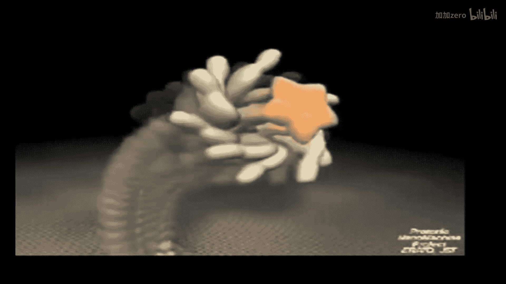
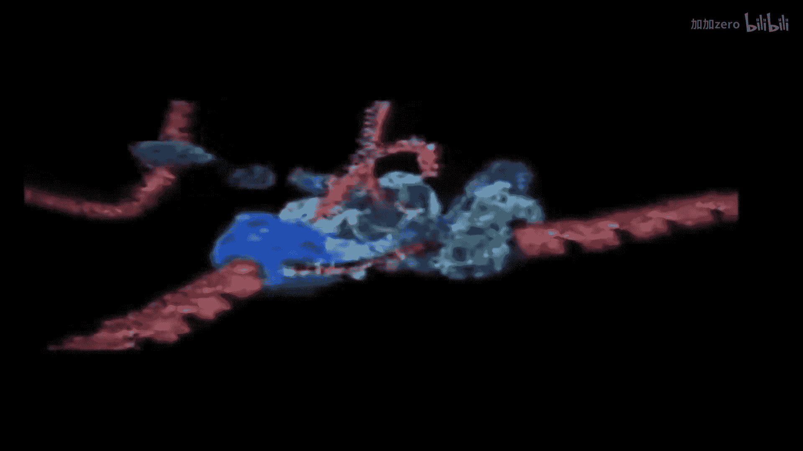

# 【计算与系统生物学基础 7.91J 2014】麻省理工—中英字幕 p12 p11 12. Introduction to Protein Structure; Structure Comparison and Classificati -BV1HdzaYAE2a_p12-

The following content is provided under a creative Commons license。

 Your support will help M I T Open Coseware continue to offer high quality educational resources for free。

To make a donation or view additional materials from hundreds of MIT courses。

 visit M T OpenCourseware at OCw。 MT。 Eduu。

I'm Ernest Frankel， I'll be teaching the next few lectures。

 I'd like to encourage you to contact me outside of class if you have any questions if you want to meet and also please during class ask questions it's a somewhat impersonal setting with the video cameras and the amphitheater。

 but hopefully we can overcome that。This unit is going to focus on moving across scales in computational biology。

 looking from computational issues that deal with the fundamentals of protein structure at the atomic level to the level of protein。

 protein interactions between pairs and molecules， protein DNA interactions and small molecules and then ultimately into protein networks。

 So we've got a lot of ground to cover。 but I think we'll be able to do it。

 as you've seen in the syllabus， the first couple of lectures。

 that really a tailed look at protein structure molecular level analysis。

 and then we'll move into some of these other levels of higher order。

 including protein DNA interactions and gene regulatory networks。😊。

I think many of you are probably familiar with this quote that nothing in biology makes sense except in light of evolution。

 And I'd like to offer a modified version of that， which is little in biology makes sense except in light of structure。

 protein structure DNA structure。 We've， of course。

 seen this very early on in molecular biology when the structure of DNA was solved and immediately became clear why it was the basis for heredity。

But protein structures have even of more lasting impact time and time again， many， many more events。

 which have really revolutionized understanding a particular biological problems。

 So one example that was stunning at the time had to do with the most frequently mutated protein in cancer。

 This is the P 53 gene。 It's mutated in about half of all cancers。

 And what was observed early on in these were the days before genomic sequencing when it was actually very expensive and hard to identify mutations in tumors。

 So they focused on this particular gene。 And they observed that the mutations clustered。

 So this is the structure of the gene from the end termminus the protein from then termminus of the C terminus and the bars indicate the frequency of mutations。

 And you can see that they're all clustered pretty much in the center of this molecule。😊，Now。

 why is that it was enigmatic until the structure was solved here at MI T by Carl Pavo and his postdocctor to Nilo Pavloitch。

 And they showed actually that these correspond to critical domains。 And in a second paper。

 they actually showed why the mutations occur in those particular locations。

So if you look at the plot in the upper left， here's the protein sequence above it。

 the frequency of mutations below the secondary structure elements。

And you'll see the mutations occur in regions that don't have any regular secondary structure and can be can occur frequently in regions with secondary structure or not at all in regions with secondary structure。

 So the near fact that there's a secondary structure element does not define why their mutations。

 But when the three dimensional structure was solved in the complex with DNA over here on the right。

 this is the protein structure on the left， the DNA structure on the right。

 and in yellow are some of these highly mutated residues。

 it turns out that all of the frequently mutated residues are ones that occur at the protein DNA interface。

 So in a single picture， we now understand， well it was an enigma for years and years and years。

 why are the mutations so particularly clustered in this protein in non-obvious ways。

 Since that is the interface between the protein in the DNA。

 these mutations upset the genetic regulation the transcriptional regulation through the action of P53。

So if we want to understand protein structure in order to understand protein function。

 where are we going to get these structures from。 So the statistics on where proteins have。

 how proteins have been solved， I show here this is from I'll call it the PDDB。 the protein database。

 It full name is the RCSB protein database。 but it's usually just call the PDDB。

 And here it shows that at the time of this slide， around 80000 structures have been term by X- ray crystallography。

The next most frequent method was NMR nuclear magnetic resonance。

 which identified about 10000 structures and all the other techniques produced very。

 very few structures， hundreds of structures rather than thousands。So how did these techniques work？

 Well， they don't magically give you a structure， right。

 They give you information that you have to use computationally to derive the structure。

Here's a schematic of how structures are solved by x- ray crystallography。

 One has to actually grow a crystal of the protein or the protein and other molecules that you're interested in studying。

 These are not giant crystals like quartz。 They're even small than table salt。

 They're usually barely visible with the naked eye。 And they're very unstable。

 They have to be kept in solution or often frozen。 And you shoot a very high powered x- ray beam through them。

 Now， Most of the x- rays are what are they going to do。😊，They're going pass right through。

 right because X rays interact very weak with matter。 But a few of the x rays will be diffracted。

 And from that weak diffraction pattern， you can actually deduce where the electrons were that scattered the X rays as they hit them all。

 as they hit the crystal。Okay，And so this is a picture。

 the lower right of electron density cloud in light blue with the protein structure snaing through it。

😊，And what you can calculate after a lot of work from these crystallographic diffraction patterns is the location of the electron density。

 And then there's a computational challenge to try to figure out the location of the atoms that would have given rise to that electron density that then when hit with Xrays would have given rise to the X ray diffraction pattern。

 So it's actually in iterative process where one arrives immune initial structure。😊。

And then calculates from that structure where the electrons would be。

 from the position of electrons where the diffraction pattern would be when the x rays hit it。

And determines how well that predicted diffraction pattern agrees with the actual diffraction pattern and then continuously iterates。

 And so this is obviously a highly computational problem because you not only have to find positions that are maximally consistent with the observed diffraction pattern。

 but also positions that are maximally consistent with physics， right。

 So if we have a piece of a molecule here。We can't just put our atoms anywhere。

 They need to be positioned with well definedfin distances for the bonds， with bond angles and so on。

 So it's a highly coupled problem that we have to solve。

 And we'll look at some of the techniques that underlie these approaches。

 although we won't look specifically it has solve extra crystal structures。And you mentioned。

 the second most common technique is nuclear magnetic resonance。

And this is a technology that does not require the crystals。

 but requires a very high concentration of soluble protein， which presents its own problems。

And the information that you get out of a nuclear magnetic resonance structure is not the electron density locations。

 but it's actually a set of distances that tell you the relative distance between two atoms。

 usually protons in this structure。 And that's what's represented by these yellow lines here。

 And once again， we've got a hard computational problem where we need to figure out a structure of the protein that's consistent with all the physical forces。

 and also puts particular protons at particular distances from each other。

So we talk about solving crystal structures， solving NR structures。

 because it is the solution to a very， very complicated， computationalal challenge。

 So these techniques that we're going to look at well not specifically for this solution of crystal and and NMR structures underlie those technologies。

 What we're gonna focus on is actually perhaps an even more complicated problem。

 the de novo discovery of protein structure。 So if I start off with a sequence。

 can I actually tell you something important and accurate about the structure。Now。

 there's a nice summary in a book called structuraluc bioinformatics that really deals with a lot of the issues around computational biology as it relates to structure that highlights many of the differences between the kinds of algorithms we've been looking up up until now in this course and the kinds of approaches that we need to take in our understanding of protein structure。

😊，So the first， the most fundamental， obvious thing is that we're dealing with three dimensional structures。

 So we're moving away from simple linear representations of the data and dealing with more complicated three dimensional problems。

And therefore， we encounter all sorts of new problems。 We don't No。

 We no longer have a discrete search space。 We have a continuous search base。

 And we' look at algorithms that try to reduce that continuous search base back down to a discrete run to make it a simpler problem。

But perhaps most fundamentally， the difference is that now we have to bring into a lot of physical knowledge to underlie our algorithms。

 It's not enough to solve this as a complete abstraction from the physics。

 But we actually have to deal with the physics in the heart of the algorithms。

And we'll look at the issues highlighted in red in the rest of this talk。

Another issue that's gonna emerge is that it would be nice if there was a simple mapping of protein sequence to structure。

 And if that were the case， you'd imagine that two proteins that are very different in sequence would have different structures。

 But in fact， that's not the case。 You can have two proteins that have almost no sequence similarity at all that adopt the same three dimensional structure。

 So clearly， it's extremely complicated problem。 made more complicated by the fact that we don't know all the structures。

 It's not like we're selecting from a discrete set of known structures to figure out what our new molecule is。

 We have in potential infinite number of confirmations of protein chains we need to deal with。😊，Okay。

 so I hope that you've had a chance to look at the material that I posted online for review of protein structure。

 If you haven't， please do so it'll be very helpful in understanding the next few lectures。

 and I'll assume that you're familiar with the basic elements of protein structure。

 what alpha helices are， what data sheets are， primary structure， secondary structure and so on。

 And I also encourage you to become familiar with amino acids。

 It's very hard to understand anything in protein structure without having some knowledge of what amino acids are。

 The textbook has has a nice figure that summarizes the many overlapping ways to describe the features in amino acids。

 So please familiarize yourself with that。😊，So these are resources that we posted online。

 Also the protein Data， the RCSB， has fantastic resources online for beginning to understand protein structure。

😊，So I encourage you to look at their website。 In particular in their website。

 they have tools that you can download to visualize protein structures。

 And that's gonna be a critical component of understanding these algorithms to actually understand what these structures look like。

 I've highlighted， too that I find particularly easy to use P mall and Swiss PD B fewer。

 You can not only look at structures with these techniques。 you can actually modify them。

 You can do homology modeling。😊，ok。So before we get into algorithms for understanding protein structure。

 we need to understand how protein structures are represented。

 I've already mentioned that there are these repeating units that I'd like you to already know about alpha helices。

 beta sheets won't go into those in any detail。 But the two more quantitative ways of describing protein structure have to do with the three dimensional coordinates。

 X， Y， Z coordinates of every atom and internal coordinates。

 And we'll go through those in a little bit of detail。So again。

 this PDDB website has a lot of great resources for understanding what these coordinates look like。

 They have a good description of what's called a PDDB file and those PD files look like this at the outset they have what is now called metadata。

 but the time was just information about how the protein structure was solved。

 So it'll tell you what organism， the protein comes from where it was actually synthesized if it wasn't purified from that organism。

 but it was made recombinantly De like that， Detail about how the crystal structure was determined。😊。

The sequence， most of this won't concern us， but what will concern us is this bottom section shown here in more detail。

 So let's just look at what each of these lines represents。

 the lines that contain information about the atomic coordinates I'll begin with the word atom。

 and then there's a index number that just is reference for each line of the file tells you what kind of atom it is。

What chain in the protein it is and the residue number。 So here it's starting with residue 100。

 the sequence here can be arbitrary and may not relate to the sequence of the protein as appears in Swissprod or Genbank。

And then the next three columns of ones that are most important to us。 So these are the X， Y。

 Z coordinates of the atom。 right， So to identify the position of any molecule in three dimensional space。

 I at least need three coordinates。 And so those are what those three coordinates are。

And they're followed by these two other numbers， which actually are very interesting numbers because they tell us something about how certain we are that the molecule is really。

 the atom is really at that position in the crystal structure。

 So the first of these is the occupancy。😊，In a crystal structure。

 we're actually getting the information about thousands and thousands of molecules that are in the repeating units of the crystal。

And it's possible that there could be some variation in the structure between one unit of the crystal and the next。

 So you could have a side chain Then one crystal is over here。

 And the next crystal is repeatheating unit of the crystal is over there。

 If there are discrete confirmationations， then you'll imagine that the signal will be reduced。

 right， And you'll actually get some superposition of all the possible confirmations。

So number one here means that it seems to be one predominant con confirmation。

But if theyre more than one and they're discrete， if they're continuous， and'll just look like noise。

 and it'll be hard to determine the coordinates。 But if there are discrete coordinate positions。

 then you might find， for example， an occupancy of 05 and then another line with the other position with an occupancy of 05。

So that's when there's discrete locations where these atoms are located。

The B factor is called a thermal factor， and it tells you how much thermal motion there was in the crystal do。

Now what does that mean if we think about a crystal structure。

 there'll be some parts of it that are rock solid in the center。

 it's highly constrained the dense core of the protein， not too much is going to be changing。

 but on the surface of the protein， there can be residue that are highly flexible。

And so as those are being knocked around in the crystal。

Theyre scattering the X right is in slightly different ways， right。

 but they're not in discrete confirmations。 So we're not going to see multiple independent positions。

 We'll just see some average position。 And that kind of noise can be accounted for with these B factors where high numbers represent highly mobile parts of the structure and low numbers represent very stable ones。

A very low number here with D say a 20。 These numbers of 80。

 typicallyy things like that occur at the ends of molecules where there is a lot of structural flexibility。

So we have this one way of describing the structure of a protein where we specify the X， Y。

 Z coordinates of every one of these atoms， right， And we'd have these other two parameters to represent thermal motion and static disorder。

 Now， are those coordinates uniquely defined If I have this structure。

 Is there exactly one way to write down the X， Y， Z coordinates。Hence， how many people say yes。

Some YouTube say no。Why not？You can rotate it， you can set the origin， right。

 so there's no unique way of defining it and that will come up again later。Okay， now。

 this is a very precise way of describing the three dimensional coordinates of a protein。

 but it's not a very concise way of representing it。 Now， why is that？ Well。

 as the static model represents， there are certain parts of protein structures that are really not going to change very much。

 The lengths of bonds change very little in protein structures。The angles。

 a tetrahedally coordinate carbon doesn't suddenly become flat planar。

 right These things happen very。 There may be very small deformations。 So if I specify the X， Y。

 Z coordinates of this carbon， I really don't have too many degrees of freedom for the other carbon can be。

 It has to lie in a sphere at a certain distance。 So instead of representing the X， Y。

 Z coordinates of every atom， I can use internal coordinates。So here in this slide， we have。

Imuno acids， the amino nitrogen， the carbonyl carbon， right， So this is a single amino acid。

 Here's the peptide bond that goes to the next one。 And as this diagram indicates。

 the bond between the carbonyl carbon of one amino acid and the amide nitrogen of the next one is planar。

 So that angle isn't even rotating。 right So that's one degree of freedom that we've completely removed。

 the angles that rotate in the backbone are called phi and Psi phi over here。😊，And psi over here。

So those are two degrees of freedom that determine。

How this amino acid is the confirmation of this amino acid。

So instead of specifying all the coordinates， I can specify the backbone s by giving two numbers of amino acid。

 the phi the psi angles with the assumption that the omega angle。

 this peptide backbone remains constant。And similarly for the side chains。

 and we'll go into this more detailed letter， we can then give the coordinates the rotation of rotable bonds in the side chain and not specify every atom as we go out。

 Okay， so we've got these two different ways of representing protein structure。

 We'll see that they're both used。Any questions on this？Great。Okay。

 so if we're looking at protein structures， one question we want to ask is。

 how do we compare two protein structures to each other。

So we've already mentioned that proteins can have similar structure。

 whether or not they are highly similar in sequence。

 So if I have two proteins that are highly homologous。

 that do have a high level of sequence similarity。 For example， these two orthos。

 This one from cow and this one from rat。 you can see at a distance。

 they both have very similar structures。 they also have 74% sequence similarity。

 So that's not surprising。 But you can get proteins that have very low sequence similarity。

 they are still evolutionary related， like these orthologs。

 two different species that have the same protein or pairs， single species that have two copies。

 similar copies， but nonident copies of the same protein that maintain the same structure。

 when they only have about 20 to 30% sequence similarity。

And you can get even more distant relationships。 So here are two proteins， both in human。

 evolutionarily related， but only 4% sequence identity。 And yet， at a distance。

 they look almost identical， right。And those are evolutionary related proteins。

 But we can also have things that are called analogs， which have no evolutionary relationship。

 No obvious sequence similarity and yet adopt almost identical protein structures。

So this adds to the complexity of the biological problems that we're going try to solve。Okay。

 so how do I quantitatively compare two protein structures。

So the common measurement is something called RD root mean squared deviation。

 And here I have a set of structures that were solved by NMR。

 And you can see that there's a core of the structure that's wellde。

 And then there are pieces of the structure that are poorly determined。

 there weren't enough constraints to define them。 And these proteins have all been aligned。

 So the X Y Z coordinates have been rotated and translated to give maximal agreement and what's the agreement measure。

 It's this root mean square deviation。 So I need to define pairs of atoms in my two structures。

 If it's in this case the same structure that's really easy every atom has a match in this structure that were solved with the same molecule。

 But if we're dealing with two homologous proteins， and that becomes a little bit more tricky。

 we need to define which amino acids are gonna to match up。

 we can also define whether we care about changes in the side chains or whether only care about changes in the backbone。

 whether we're going to worry about whether the protons in the right places or not。

 And you'll see that these alignments can be done with either only heavy chain heavy atoms。

 meaning excluding the hydrogens。😊，Or only main chain atoms。

 meaning excluding the the side chains completely。 But once we've defined the pairs of corresponding atoms。

 then we're gonna take the difference in the the square some of the squares of the distances between the corresponding atoms and their x coordinate or y coordinate。

 there's Z coordinate。 Take the square root of that sum。

 And that's gonna give us the root mean and squared deviation。And， of course。

 we have to minimize that means cor deviationation with these rigid body rotations to account for the fact that I could have my PB file with the origin of this atom or I could have my PDB file with the origin at that atom and so on。

 right O。Any questions so far？Yes。do we consider a single。So we have a choice。 The question is。

 do we consider every single atom in the molecule， We don't have to。

 And it depends really on the problem that we're trying to solve。

 So if we're looking for whether two proteins have the same fold。

 we might not care about the side chains。 So might restrict ourselves to main chain atoms。

But if we're trying to decide whether two crystal structures are in good agreement with each other or say。

 as Bill'll see in a few minutes， we're gonna to try to predict the structure of protein。

 and we have the experimentally determined structure of the same protein。

 And we want to decide whether those two agree。 In that case。

 we might actually want to make sure that every single atom is in the right position。

 So itll depend on the question that we're trying to answer。 Good question。 Any other questions。Okay。

All right， so so far I've shown a lot of static pictures of molecules。

 I do want to stress that molecules actually move around a lot。

 so I'll just show a little movie here。

Okay， so that was part an excuse to play a little， new age music in class。More fundamentally。

 it was to remind you， despite the fact that we're going show you a lot of static pictures of proteins。

 they're actually extremely dynamic， right， and they have well definedfined structures。

 but they may have more than one well defineded structure。

 especially those molecules that are doing work， right， They're actually moving things along。

 They have multiple structures。 And so when we consider the protein structure。 It's an approximation。

 and we're always gonna to mean the protein structures， not not singular one。😊，Okay。

So what determines the protein structure。 Well， I've told you， it's physics， right， Fundmently。

 it's a physical problem。 So the optimal protein structure has to be an energetic minimum。

 There has to be no net force acting on the protein。

 The force is negative derivative of the potential energy， right， So that derivative has to be 0。

 So we have to have a minimum of protein structure。 Now。

 that doesn't mean that there's exactly one minimum。

 those proteins that are had multiple confirmations in that movie。

 obviously had multiple minimum that they could adopt， depending on other circumstances。

 but there has to be at least a local minimum。 So if we knew this U， this potential energy function。

And we could take the derivative of it。 We could identify the protein structure or the protein structures by simply identifying the minima in that potential energy function。

 Now， would that life were so simple， right， But we will see that there are ways of parameterizing the U and using it to optimize the structure。

 So it finds us at least local minimum。O， and we're gonna look primarily at two different ways of describing the potential energy function。

 One of them， we're gonna look at the problem like a physicist would。 And the other way。

 we're gonna look at it as a statistician would。So the physicist wants to describe。

 as you might imagine， the physical forces that underlie the protein structure。

 And so as much as possible， we're gonna try to write down equations that represent those forces。

 Now， we're not always going be able to do that because a lot of the forces involved are quantum mechanical。

 right， The mere fact that two solid objects don't pass through each other。

Is because of exclusion principles that deal with quantum mechanics。

 We're not going to write down quantum mechanical equations for every atom in our protein structure。

 but we will write down equations that approximate those。 And wherever possible。

 we're going to try to tie the terms in our equations then to something identifiable in physics。

 And a very good example of this approach the charm program。 And these approaches。

 actually were the ones who won the Nobel Prize in chemistry this past year。😊。

At the other end of the spectrum are the statistical approaches。 Here。

 we don't really care what the underlying physical properties are。

 We want equations that capture what we see in nature。 Now， often。

 these two approaches will align very well， There'll be some approximations that the physicist makes to capture a fundamental physical force。

 That's simply the best way to describe what you see nature。

 And so those two terms may look indistinguishable in the charm version or my favorite statistical approach。

 which is Rosetta。 so we'll see that some terms and these functions agree between charm and Rosetta。

 Well， there'll be places where they fundamentally disagree in how to describe the molecular potential energy function because one is trying to describe the physical forces and the other one is trying to describe the statistical ones。

 Do you have any native speakers of German in the audience。😊，You want to read the joke for us。

physics。That says you can find yourself here or here。RightSo for the， for the video。

 it's the Institute for Qua Quaum mechanicchanics。 and you go to a map at the MI T。

 and it'll say you find you are here， right， But in the Institute for Quantum mechanicics。

 it says you're either here or here。😊，So that's the physicist approach。

 We really do have to think about these quantum mechanical fun features。

 whereas on the right hand side is the statisticianianss approach。 It says data don't make any sense。

 We'll have to resort to statistics。 Okay， so the statistician can get pretty far without understanding the underlying physical forces。

😊，Alright， so let's look at this physicist approach first。

 So we're gonna break down the potential energy function into bonded terms and non bonded terms。

 So the bonded terms， as they sound， are going to be atoms that are close to each other in the bonded structure。

 So certainly， these two atoms because they're connected by a single bond are gonna be bonded terms。

 But we'll see groups of three or four atoms near each other will also be bonded terms。

 And the non bonded terms will be when I have another molecule that comes close。

 but isn't directly connected。 What are the physical forces between these two。😊。

 so these bonded terms then first break down to a lot of subterms。

 I' show you the functional forms here。 We'll just look at a few of them in detail and then give you a sense for what the other ones are。

 So this first one is the bonded term that describes actually the distance between two bonded atoms。

 Now， again， this is fundamentally quantum mechanical property。

 But it would be too computationally expensive to describe the quantum mechanics and not really necessary。

 because you can do pretty well by just describing this as a stiff spring。😊。

So that's what this quadratic form in the equation represents。 So we simply define be not here。

Is the equilibrium position between these two atoms of particular types here would be two tetraary coordinated carbons。

 And that would be determined by looking at a lot of very very high resolution structures of small molecule crystals。

 So we know what the typical distance for this bond is， we get that as a parameter。

 there would be a big file in the charm program that lists all those parameters for every one of these bonded terms。

 And then if there's a small deviation from that， because the molecule is stretched a bit in your refined process。

 there would be a penalty to pull it back in just like a spring pulls it back in。😊，Now。

 turns out when you go this， you have to actually come up with a lot of equations to maintain the geometry。

 right， because again， we're gonna have to not only worry about these distance bonds。

 but we need to worry about angles。 So we've got the angle between this bond and this bond。 What。

 what keeps that in place。 So we need to add another term。

 That's the second term here to make the angle between these fixed。

 And then we have to deal with what are called dihedral angles to make sure that these four atoms lie in allowed geometry。

嗯。And so each one of these terms accounts for something like that。 This last term over here。

 makes sure that the finesi angles are consistent with what we see in quantum mechanics as corrected for any deviations that we see in these small molecules。

 So a lot of terms with a lot of parameters that are trying to capture the best description of what we observe。

 But each one of is motivated by the fact that there is some quantum mechanical principle underlying in。

 So， yes。😊，还是怎问题。But there's a reference there that I'm sure will give you the answer。Okay。

 now what about these non bonded terms， So non bonded terms they said are molecules that are distant from each other in the structure of the protein。

 but close to each other in threedial space。 And there are two fundamental forces here。

 The first one is called the Leonard Jones potential。

 And the second one would be the electrostatic one。

 And the leonard Jones potential itself is these two terms。 One is an R6 term。

 and negative R R to the sixth dependency and the other one is positive and R to the 12。

 The negative R to the6 is an attractive potential。 That's why it's negative。

 And it's because of the small induced dipoleles that occur in the electron clouds of each of these atoms that pull the molecules together。

😊，Paying the one over R of the six dependency has to do with the physics of two dipoleles interacting。

The R over 12 term is an approximation to a quantum mechanical force。

 So the reason that two molecules don't pass through each other， as we said already。

 is because quantum mechanical forces that would be very expensive to compute。

 So we come up with the term that's easy to compute。 And， of course。

 an R 12 term is simply the square of R to the sixth term。

 So if you are computed one of R to the sixth between two atoms。 You just square that。

 you get one of R 12。 It's very computationally efficient。

 And you adjust the parameters these R mins。😊，So that it works out so that these things agree reasonably well with the crystal structures。

 And these are crystal structures of small molecules that we know in great detail。

 And then the electrostatics is what you might expect for electrostatics。

 It's got a potential that varies one over the distance。 And as the product of its charges。

 these can be full charges。 they can be partial charges。😊，And there's a term here， this epsilon。

Which is the dielectric constant。 And that represents the fact that in vacuum。

 there'd be much greater force pulling two oppositely charged molecules together than water， right。

 because the water is gonna shield。And so these electrostatic terms。

 this dihedral dielectric potential term can vary from one， which is vacuum to say， A D for water。

And setting that is a bit of an art。Okay， so what do these potentials look like。

 Those are shown here。 This is the in dark lines， the sum of the Van deol's potential。

 It consists of that attractive term， which has the R over 6 dependency and the repulsive term with the R over 12。

 And why does it go up so high at at short distances。Right。

 because you can't have molecules that overlap。You'll see that there's a minimum， right。

 So there's an optimal distance barring any other forces between two atoms。

 So that's roughly what these hard sphere distances represent in the scaled models。

And then the electrostatic potential also obviously has， has an is attractive term。

 but it's gonna to blow up as you get to small values， increasingly favorable。

 And so the net some of those two is shown here。 the combination of van walls and electrostatics。

 It again， has a strong minimum， but becomes highly positive as you get to close distances。😊，Okay。

 any questions on these forces？Yes， does the vendor equal the energy Jones potential or is。Yeah。

 typically those terms， two， two terms are used interchangeably。Other questions？Okay。Alright。

 so that's how the physicist would describe the potential energy function。 Rosetta， as I told you。

 is an example of the statistical approach。 It rejects all this sharpest definition of trying to compute exactly the right distance between two atoms by having a stiff spring between them。

 and says， let's just fix a lot of these angles。 So we're gonna fix the distance between two atoms。

 There's no point in having it vary by tiny， tiny fractions of the bond length。

 We're going fix the tetrareal coordination of our tetrareal carbons。

 I're not going to let them deform because it never would happen in reality。

 And so we're going focus our search over the space entirely over the rotable bonds。 Remember。

 what were the how many rotable bonds that we have in the backbone。😊，We had two， right。

 We have the thigh and the angles。 And in the side chains。

 then we'll have rotable bonds over the side chains。 So in this example， this is a cystine。

 Here's the backbone。 Here's the sulfur。And we have exactly one rotable bond of interest because we don't really care where the hydrogen is located。

 So if've got this chi1 angle， if there were more atoms out here。

 this would be called chi 2 and chi 3。And these can rotate， but they don't rotate freely。

We don't observe in crystal structures every possible rotation of these angles。

 And that's what this plot on the left represents。 for this side chain， there's a chi 1。

 a chi 2 and a chi 3， and dark regions represent the observed conforms over many。

 many crystal structures。 And you can see it's highly nonun。 Now， why is that。

I see these people with their hands starting to figure out in the back， So why is that。

Figure that's what you guys are doing。If not， it's very interesting sign language。

So if we look down one of these tetrareadal carbon carbon bonds， right。

 we have apparently a free rotation。 But in fact， some of these conformations。

 we're going to have a lot of sterile clashes between the atoms on one carbon and the atoms on the other。

 And so this is not a favorable confirmation。 The favorable confirmation is offset and that propagates throughout all the chains of the protein。

 So therell be certain angles that are highly preferred in other ones that are not。

 These highly preferred angles are called rotamomers。

 And so we'll use that term alone that stands for rotational isomers。

 And so now we've turned our continuous problem of fig out what the optimal angle is for this chi1 rotation into a discrete problem where maybe there are only two or three possible options for that rotation。

 And so now we can decide， is this better than this one or this one。😊。

Questions on rotamomers or any of this？Excellent。Okay。

 so how do we determine we've decided then we're going to describe the protein entirely by these internal coordinates。

 the five s of the backbone， the tri angles of the side chain。

We still need a potential energy function， right。That hasn't told us how to find the optimal settings。

 And we can try to avoid the approach of charm where we actually look at quantum mechanics to decide what the。

 what the the terms are。 So how do they actually go about doing this， Well。

 they take a high number of high resolution crystal structures。

And they characterize certain properties in those crystal structures。 For example。

 they might characterize how often a certain aphaatic carbon。

 how often aphatic carbons are near amide nitrogens。

 and they might measure the distance that they do measure the distance between these amide nitrogens and aphaatic carbons across all the crystal structures and determine how often those distances occur。

 And you can actually turn those observations then into a potential energy function by simply using boltoltzman's equation。

😊，So we can figure out how frequently we get certain distances on the x axis is distance on the y axises frequency。

 number of entries in the crystal structure。😊，And then by by Bolzman's law。

 we can compute the the density of states over some reference， which is actually very hard to define。

 And you can look at some of the references referred to in the slides to figure out how currently that's defined。

 But we have to find some arbitrary reference state to figure out that the probability of being any one of these states is going to be a function。

 A logarithmic function of the frequency of those states。

So we've got an energy term that's determined solely by the observations of distances that doesn't say。

 I know that this one's charged in this one isn't It just says here's an oxygen attached to a carbon with double bonds。

 Here's a carbon that's not How often are they at any particular distance。

 And we go through lots and lots of other properties。

 And we'll go into detail now to what those other terms are to look through high resolution crystal structures see what certain properties are。

 turn those into potential energy functions that we can then use to identify the optimal rotations for the side chain and the backbone。

😊，And I should also point out that when we do this， we'll have different terms or different things。

 We'll have a term for distances between different kinds of atoms。

 We'll have terms for vendor for some of these other pieces of potential that well describe in subsequent slides。

 And we're gonna need to decide how to weight all of those。

 All those independent terms to get them to give us reasonable protein structures when we're done。

 And that once again is a curve fittingtting exercise。

 finding the numbers that best fit the data without any guiding physical principle underneath it。

So you'll be using pi Rosetta。 and in P Rosetta， you'll see the terms on the board for the potential energy functions。

The different features of the potential energy function。

 And I'll step you through a few of these just so you know what you're using。

There'll also be files in the Ps Z installation that will give you the weight relative weights for each of these terms。

Okay， so these first two are the vendorwalls。 And here。

 the shape of the curve looks just like we saw before， right， It has to， in some sense。

 because they're trying to solve the same physical problem， But the motivation is very different。

 right， There's not no attempt to decide and should be a one over our6 because of dipole dipole interactions And simply how do I find a function that accurately represents what I see in the database。

So again， computed， this is the FAA attractive and the FAA repulsive。

 and those are determined based on the statistics of what's observed in the crystal structures。

This one， the H bond。Breaks down into backbone and side chain， long range and short range。

 and the goal of the H bonds。 So hydrogen bonds are one of the principal determinants of protein structure。

 And you'll see that in in the reading materials that are posted line。

 And one of the critical things about a hydrogen bond is that it needs to be nearly planar。So。

 the line between。The law， the angle between this。this atom。

 which has the hydrogen attached and this one， which has the free electron pair。

 has to be as close to linear as possible。 And the more it deviates from linear。

 the weaker the hydrogen bond will be。And so this hydrogen bonding potential has terms that describe the distance between the atoms that are donating and accepting the hydrogen。

 as well as the angle between them。 And it's been parameterized to represent separately things that are far from each other close to each other。

 things that are side chain or main chain。 And here's where it's really the statistician against the physicist。

 Why divide up side chain and main chain。 There's no physical principle that that drives you to do that。

 And simply because that's what gives the best fit to the data。

 So the statistician is not afraid to add terms that make their models better fit reality。

 even if they don't unre any fundamental physical principle。

And we'll see it gets even more dramatic with some of these other terms。

 So this is the Rammaandran plot， which you'll also see in your reading。

 It represents the observed frequencies of phi and psi angles。 And as you know。

 that there are only a couple of positions on this phi plot that are frequently observed。

 representing the different regular secondary structures。

 primarily off the helix and beta sheet is indicated。😊。

And rather than trying to capture the fact that proteins should form out the helices by having really good forces all around。

 they simply prefer angles that are observed the Rammaschanddran plot。Right。

So we're gonna give a potential energy function that's going to penalize you If your fine psi ends up over here and reward you if your phisi ends up in one of these positions。

 So for the physic， this is cheating。 for the statistician makes perfect sense。😊。

You should laugh at that。Okay， and the same will be true for the row numbers。 right。

 So we said that for the side chains， there are certain angles that we prefer over others because that's what we observe in the database。

 Again， we're not going to try to get them by making sure that theres repulsion between these two atoms when they're eclipsed。

 We're going to get there simply by saying the potential energy is lower when you're one of these staggered conformations。

 than when you're one of the eclipsse confirmationations。Okay， now。

 the place where the difference between the statistician the physicist is most dramatic comes when we look at the salvation terms。

 So a lot of what goes on protein structure determines protein structure， I should say。

 is the interaction of the protein with water， right。

 It's bathed in in a bath of 55 mole or water molecules highly polar。

 they normally are hydrogen bonding with each other。 when the protein sits in there。

 the protein has to start hydrogen bonding with them。

 And where do we find hydrogenphobic residues in a protein structure with your hands outside or inside inside。

 right， So the hydrophobic residue is all gonna be buried inside。 Why is that。😊，It's actually really。

 really hard to describe in terms of fundamental physical principles。 In fact。

 it's really hard to describe the structure of water by fundamental physical principles。

 Ss that try to get water to freeze were only successful a few years ago。

 So ifve try to simulate water using basic physical principles。

 It's very hard to get to form ice when you lower the temperature。

 So it's gonna to be even harder than to represent how a complicated protein structure immersed in the water actually interacts with those water molecules。

So you've got all these water molecules interacting with polar residues or nonpolar residues。

 The physicist really struggles to represent those。 And just to show you why that is。

 let me show you again， a little movie， unfortunately， no new age music with this one。 I apologize。

So what's shown here is a sphere immersed in a bunch of water molecules。 The bread is is the oxygen。

 The little white parts are the hydrogens。 You can see them wiggling around。

 And what's the fundamental feature that you observe。

They they're forming almost a cage around this hydrophobic molecule。 Why is that。

It's hard for them to interact。Right， so they want it's hard for them to interact with the nonpolar residue。

 So the water molecules want to minimize their potential energy。

 They're going to do that by forming hydrogen bonds with something in bulk solvent。

 They form it with other water molecules。 right here， they can't form it。

 form any hydrogen bonds with the sphere。 so they have to dance through complicated dance。😊。

To try to form hydrogen bonds with each other with this thing stuck in the middle of them。 Okay。

 and this is， at its heart， the fundamental driving force between the hydrophobic effect that which causes the hydrophobic residue to be buried inside of the protein。

Very， very hard， as I said， to simulate using fundamental physical forces。

 So what does the statistician do。The statistician has a mixture of experimental observation and statistics that they their benefit。

 So we can measure how hydrophobic any molecule is。

 We can take carbons and drop them to non-polar solvent and a polar solvents and determine what the what fraction of time a molecule will spend in a polar environment versus nonpolar environment。

 And from that， get a free energy for the transfer of any atom from a hydrophobic environment to a hydroophilic environment。

 right。😊，That can give us this Delta G ref。Shown over here。 O， now in a protein。

That molecule is not fully solvent exposed， even when it's on the surface， right。

 Because water molecules trying to come at it from this direction， can't get to it。

 from this direction can't get to it。 So the transfer energy for this carbon to go from fully solve and exposed to buried is different from the isolated carbon。

And so the statistician says， okay， I'll come up with a function to describe that。

 I will describe what else is near this atom in the rest of the protein structure。

 That's what the term on the right does。 to some over all other neighboring atoms。

And describes the volume of the neighboring group as the thing next to it really big or really small。

 usually not described necessarily at the level of atoms。 It might be side chains。

 depending on which program is doing it， but I have some measure of the volume of the neighbors。

 If that volume is really large， and this thing is already in a hydrophobic environment。

 even when it's sticking water， because it's surrounded by bulky things。 If the neighbors are small。

 then it's a more hydrophilic environment when sticking water。

And that's going to modulate this free energy。Is this function clear。Okay。

 so by combining this observation from small molecule transfer experiments and these observations based on the structure of the protein。

 we can get approximation for the hydrophobic effect。

 How expensive is it to have this piece of the protein in solvent versus in the hydrophobic core。

 And again， we never had to do any quantum mechanical calculations。

 We never had to actually explicitly compute the interaction of this molecule will solvent。

 We don't need any water in this structure。😊，Right。

 it's simply the geometry of the protein that's going give us a good approximation to the energy function。

All right， so。You can look through all the details of these online in the Rosetta documentation that we' provided to get a better sense of what all these functions are。

 But you can see there are a lot of terms。It's increasingly incremental。

 You find something wrong with your models。 You add a term to try to account for that。 Again。

 not driven necessarily by the physical forces。 Okay， so what have we seen so far。

 we've seen the motivation for this unit to begin with protein structures that the protein structure really helps us understand the biological molecules that we're looking at。

These structures are going to influence our understanding of old biology。

 So we need to be good at predicting these protein structures or solving them when we have experimental data。

呃。The computational methods that we're gonna use， we're gonna focus on solving protein structures。

 the novo， predicting them。 But those same techniques are gonna unlie the methods that are used to solve X ray crystallography in M。

 And fundamentally， then we have these two approaches to describing the potential energy that's the statistician and the physicist's approach。

 And remember， the key simplifications of the statistician。A that we use a fixed geometry， right。

 We're not trying to figure out the X， Y， Z coordinates of every atom。

 We're simply trying to figure out the bond angles。We're going to use rotams。

 so we're going to turn our continuous choices often into discrete ones。

 and we're going to drive statistical potentials to represent the potential energy。

 which may or may not have a clear physical basis。Alright。

 so let's start with a little thought experiment as we try to get into some of these prediction algorithms。

 So I have a sequence。 It's about， I don know，100 amino acidcent long。

And here are two protein structures。 One is predominantly alphahiical。

 one is predominantly beta sheet。 How could I tell this is not a rhetorical question。

 And want you think for a second， How could I tell whether this sequence prefers the structure on the top or the structure on the bottom。

So we have actually a lot of the tools in place。 Yes， in the back。They start。

IPreviously no sequences， well which sequences are。Okay。

 so the answer was we could look at previously known sequences， right， We could look for homology。

 And that's actually gonna be a very powerful tool。

 So if there is a homologue in the database that has。

 that is closely related to this protein and has a known structure then problem solved， right。😊。

What if there isn't？That's my next step。Yes。What if you started with。

A description of the secondary structure。Sa the heels and the sheep。

And youre counting how often are you？acidastic showed up。In each of those。

Could you then compute maybe a likelihood。I stretch。Great， so that answer was。

 what if I looked at these alpha helices and beta sheets and computed how often certain amino acids occur in alpha helices versus beta sheets。

 And then I looked at my protein structure and see and checked whether I have the right amino acids that are more favorable in alpha helics or beta sheets。

 And we'll see that's an approach that's been used successfully。

 that's secondary structure prediction。 Okay， Other ideas， yeah。😊，So we have the position of。

structure。でた。方式。那个。Excellent， so another thing I could do is if I have these two structures。

 I have their precise three dimensional structures。

 I could try to put my sequence onto that structure。

 actually put the right side chains for my sequence into that backbone confirmation。

And then what would I do， I would actually measure the potential energy of the protein in top structure and the potential energy of the protein in the bottom structure。

 If the potential energy is higher， is that the favorable structure of the unfavorable structure。

Favorable。av， it's the unfavorable， so I want the lower free energy structure。Okay。

 so let's think about that's correct。 And that's where we're headed。

 But what are going to be some of the complexities of that approach。So first of all。

 what about these side chains， I have to now take a backbone structure that had some other amino acid sequence on it。

 And I have to put these new side chains on， right。If I put those on in the wrong way。Let's say。

 instead of this is the true， let's say one of these is the true structure。

 Let's begin with a simplification。 right， So let's say your fiendish lab bait has actually solved the structure of your protein。

 but refuses to tell you what the answer is。And she actually has solved two structures。

 either one of which she's gonna to give you the sequence to。

 But she's giving you the coordinates for both of them。 They're the same length。 And so she asks you。

 you took 7，91 and you can figure this out。 Tell me whether that your sequence is actually in this structure that structure。

 So one them is exactly right。 You just don't know which one。

 So she gives you the backbone coordinates。 So you go。

 you put your amino acid sequence A with Swiss PDB。

 you change the back you add to the backbone all the right side chains。

 But now you have to make a bunch of decisions for these side chain confirmations， right。

 If you make the wrong decision， what happens。😊，Well。

 you stick this atom close to where some other atom is。 Now you've got an optimization problem。

 right？ You believe that one of these backbone coordinates is correct。

 but you've got a very highly coupled optimization problem。

 You need to figure out the right rotations。 every single side chain on this protein and you can't do it one by one。

 you can't take a greedy approach because if I put this side chain here and I put this side chain here。

 they collide。 But if this was wrong and it's supposed to be over there。

 then maybe this is the right confirmation。 So I have a coupled problem。

 So it turns out to be a computationally expensive thing to compute。😊。

So we're gonna look at whats to do if we know the backbone confirmation。

 when we don't know the size chain confirmation， we can try to solve that optimization problem。

 And you'll actually do that in your problem set。Now。

 what if the backbone confirmation isn't exactly right。

 So let's say you do what was first suggested and you search the sequence database。

 you take this sequence， and you find out it actually has two homologues。

 two things with similar sequence similarity。 There are two proteins with 20% sequence identity that have completely different structures。

This one is 20% sequence identity， and this one is 20%% sequence of identity。

 So you have no way of deciding which ones which， right。

And neither one is going to be the right protein structure。

So you know that by putting the side chains on these protein structures。

 you do have to solve this problem of the side chain optimization。 But obviously。

 is the other thing that you're gonna to have to solve。

You're gonna need solve the backbone optimization problem。 And this becomes even more coupled， right。

 Because when I move this backbone。Then the side chains move with it。 So now I've got a very。

 very complicated optimization problem to deal with。 The search base is enormous。

RightAnd even if I discretize it， it's still very， very large。 In fact。

 there's something famous called the the Levinthhal paradox， where S Leventthhal。

 who was once upon a time a professor here and then moved to Columbia。

 He did a back of the envelope calculation for extremely simple models of protein structure。

 If you imagine the proteins were to randomly search over all possible confirmations with very rapid switching between possible confirmationations。

 It would take basically the lifetime of the universe or protein to ever fold。😊，Right。

 so proteins don't do random searches of raw possible confirmations。

 and they can check out confirmations incredibly rapidly。 So we certainly can't do that。

 So we'll have to look at the optimization techniques。😊，All right。

 so we discussed how to use energy optimization functions to try to decide which ones correct。😊。

And that even if the structure is the correct  one， we have the side chain optimization problem。

 If the structure is the incorrect  one， we've got two problems。

 We've got the backbone confirmation of the side chain。

 This is frequently called fold recognition or threading。 This choice。

 if you've got a protein structure， you wanted to saw。 if your sequence matches this one or that one。

There are a couple of other problems that we're going to look at。

 So this was already this raised by one of the students。

 the idea that we try to predict the secondary structure of this protein。

 So we'll look at secondary structure prediction algorithms。 This was a very early area of。

 of computational effort in structural biology。 And we'll see that the early methods are remarkably good。

😊，We can look for domain structures。 And this is really a sequence problem。

 So we can look through our sequences。 And rather than looking for sequence identity or similarity with known structures。

 we can see whether there are certain patterns like the hidden markov models that you looked at in a previous lecture。

 it can allow us to recognize the domain structure of a protein。

 even without an identical sequence in the database。

 So we won't go over that kind of analysis anymore。

 And then we'll spend a good amount of time looking at ways of solving novel structures。

 So if you don't have a fiendish friend who solved your structure for you。

 And there is no hum in the database。 Youre not all is not lost。

 you actually can now predict novel structures of proteins simply from the sequence。😊，Allright。

 so a little history as to the prediction of protein structure。

 It really starts with Lionnus Pauling， who went on to win the Nobel Prize for this work。

 And this is in the era。 This paper was published in 1951。

 This was what computers looked like in 1951。Hei。And that thing requires a lot less computing power than your iPhone or your Android。

So Lions polling did not solve the structure of the alpha helix。

 predict that alpha helices existed using computers。 He actually did it entirely with paper models。

 And， in fact， he solved this。 He got the key insights for the alpha helix when he's lying sick in bed。

That's a very productive sick leave， if you might imagine。 He was using paper models。

 but it wasn't all done while lying in bed。 So he and others。

 the field as a whole and spent a lot of time observing small molecule distances。

 So they had some idea what to expect in protein structures。

 They didn't know the three dimensional structures。

 But they knew a lot of the parameters about how far apart things were。

 And they also knew that hydrogen bonds were going to be extremely favorable in protein structures。

 And so he looked for a repeating structure that would maximize the number of hydrogen bonds that occur within the protein backbone chain。

😊，Alright。And he knew also the backbone that the amide bonds would be plainar and so on。

 So there was a lot of principle that lay this， but it was really tour the force of。

 of just thinking rather than computing。Another really important contribution early on was made by Rammasndran was at Madras University。

 And his insight had to do with the fact that not all backbone confirmations were equally favorable。

 Remember， we have these two rotable bonds in the backbone。

 We have the thigh angle and the psi angle。And。This plot shows that there will be certain confirmations of fine sangles that are observed within these dashed lines。

 and then the other confirmationations， which are almost never observed。Now。

 how did he figure that out。 Once again， it wasn't with computation。

 It was simply with paper models and fig out what the distances would be。

And carefully reasoning over those possible structures。

 So you can get very far in this field initially back then by simple， hard thought。 Okay。

 so with these two observations， we knew that there were gonna be certain kinds of regular secondary structure and then not all backbone confirmationations were equally favorable。

 Okay， but now we want to advance actually predicting structures of particular proteins and not just saying that proteins in general will contain alpha helices。

 So how do we go about doing that。 So the first advances here。

 we're trying to predict the structure of alpha helices。😊，And they。

 this paper in the 1960s introduced the concept of a helico wheel。Now。

 the idea here will imagine that this。Eraser is an alpha helix。

 I'm going to look down the backbone of the alpha helix。

And I'll see that the side chains emerge at regular positions。

 There's going to be 100 degree rotation between each sequential residue in in the backbone as it goes around the helix。

 Its going to be displaced and rotated by 100 degrees。

And I could plot on a piece of paper of the helicical projection。Which is shown here。

 So here's the first amino acid，100 degrees later， the second，100 later， the third。

 And I can ask whether the residues on that backbone。

Have a sequence that puts all the hydrophoics and hydroophilics on the same side。As in this case。

 or on different sides。Now， what differences make， Well。

 if I have an alpha helix that's lying on the surface of a protein。Right。

It's gonna have one side that's solvent exposed and one side that's protected。Right。

 so we would expect that some of these alpha hess lying on the surface would be empathic。

Half of them would be hydrophobic。Hdphobic and half of them would be hydrophilic。 And purely。

 as someone suggested from the pattern of amino acids and here。

 the hydrophoicity of the pattern of the amino acids。

 we can make reasonable predictions of whether this protein forms a particular kind of alpha helis and amphipathic hex。

 Now， is that going help us for all alpha helices。😊，Obviously not， right。

 because I can have alpha helics that are totally solve and exposed。

 and I can have alpha helices that are totally protected。

 So this pattern will occur in some alpha helices， but not all。

 It's another idea that was raised here and was used early on with great success。

 was actually figure out whether certain amino acids have a particular alpha heical propensity。

 Do they occur more frequently in alpha helices。 The time was also and maybe you could find propensities for beta sheets and other structures。

 So compute the statistics over for every amino acid。😊，Shown as a row here。

 how often does it observed in the database， how often does this occur in alpha helix and how often does occur beta sheet or a coil。

 And from these then we would compute probabilities and compute used perhaps baesian statistics to compute the posterior expected expectation for having a certain sequence in alpha helix。

 They didn't quite use baesian statistics here， they came up with a rather ad hoc approach。

 And when you read in hindsight， it seems kind of crazy。 But actually。

 you have to remember when this was being done right this was being done before。

 a big influence of mathematicians into structural biology。 This is 1974。

 And they use more physical reasoning。 They knew something about how alpha helilics form from chemistry。

 they knew that typically there's a nucleation event or a small piece of helix forms initially。

 and then that extends。😊，They knew that there were these propensities for certain amino acids to form alpha helices and other amino acids。

 which tended to break the helix。 And they came up with an ad hoc algorithm that counted how often you had strong helix Formers。

 how often you had breakers， You could see all the details in the references。 The amazing thing is。

 with this very ad hoc thing。 And a very， very small database of protein structures。

 you can look at the total number of residues that they're looking at over all the structures is 2473 residues。

 not structures。 right， now we have many， many more times in that of structures of proteins。😊。

Even with that， in 1974， they were able to achieve 60% accuracy in predicting this the。

 the secondary structure of proteins。 So it's really an astounding accomplishment。

 And to put that in perspective。😊，There was an evaluation of a whole bunch of secondary structure prediction algorithms done about a decade ago。

 and things haven't changed that much since then， where between 1974 and 2003， almost 30 years。

 they went from 60% accuracy to 76% accuracy。Okay， well， it's not bad。

 but it's not a lot for you'd expect maybe over 30 years， you could do a lot better。

 So the simple approach really captured the fundamentals。Of predicting secondary structure。

There's a lot of work that's been done since。 And I encourage you to look in the textbook。

 if you're interested to look at all the newer algorithms that have've tried to solve the secondary structure prediction problem。

😊，Okay。Alright， so secondary structure prediction， then you can look in the textbook for the modern methods。

 But the fundamental ideas were laid down by chew and fastman in the 1974 paper。

 We've already said that looking at the kinds of approaches that we discussed early in the course can help you solve domain structures。

 We would like to focus on the end of this lecture the beginning and the next lecture had to actually solve novel structures from purely amino acid sequence。

😊，And we're gonna go back to the idea that there is a potential energy function。

 We now have both the charm approach and， and the rosetta approach to protein structure。

 And so there is some protein folding landscape。 There's an energy function。

 If you have different confirmations。 You'll be at different positions in the landscape。

 And we'd like to figure out how to go from some starting confirmation that may be arbitrary and find our way to the minimum energy structure。

😊，No。So there are gonna be three fundamental things that we'll talk about in the next lecture。

 We're gonna to talk about energy minimization， how to use these potential energy functions that we started off with to go from approximate structures to the refined structure。

 That's the thought problem I gave you， right， You have the structure but you have the wrong side chains。

 Could you minimize them So that's making small changes We'll discuss molecular dynamics。

 which actually tries to simulate all the all the forces on a protein。😊。

And to actually carry out a physical simulation of the process。 That's the charm approach。

 And we'll see some some interesting variances of that。 And then we'll look at simulated kneeling。

 which is an optimization technique that's actually quite broad。

 but can be applied here to search over large， large conformational spaces much further than a protein would actually evolve in a molecular dynamic simulation that's simulating protein function。

 You allow the protein now to jump between confirmationations that have no real potential to transfer between in at normal room temperature in water。

 but can be done obviously easily in the computer。 So stop here。 Any questions before we close。😊。

