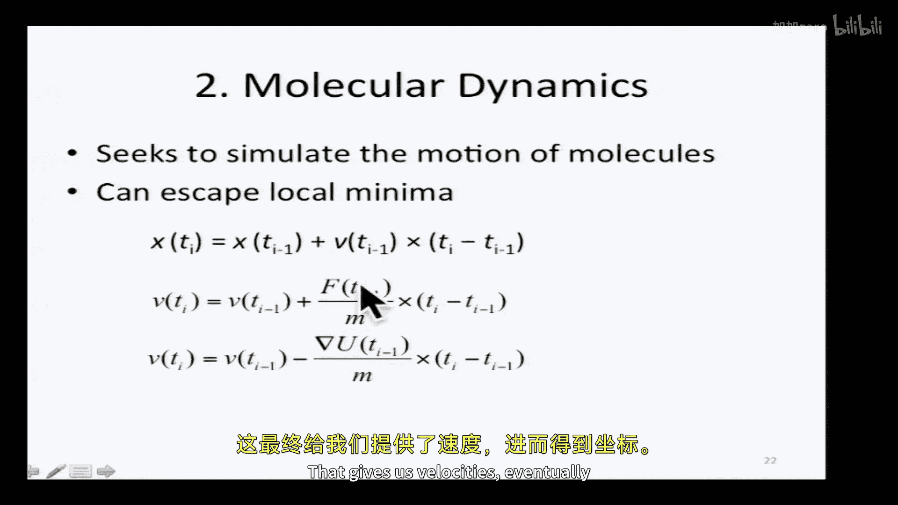
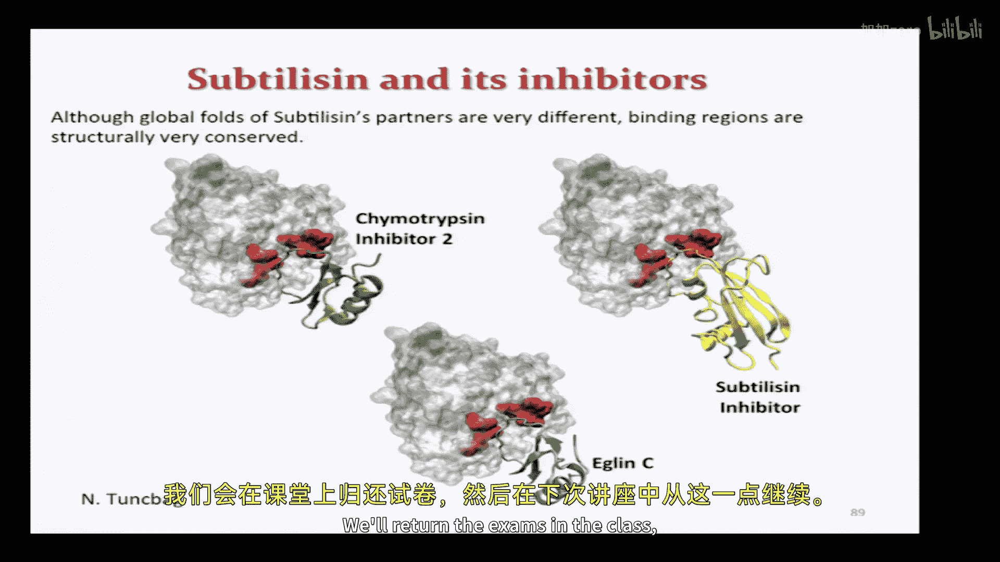
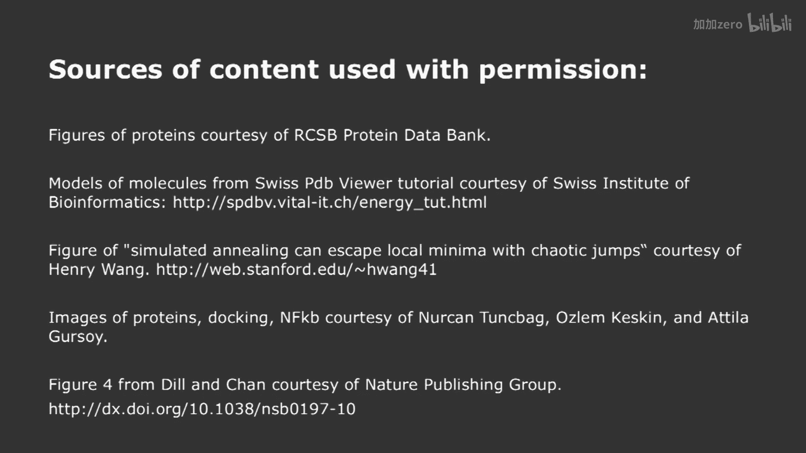

# 【计算与系统生物学基础 7.91J 2014】麻省理工—中英字幕 p13 p12 13. Predicting Protein Structure -BV1HdzaYAE2a_p13-

The following content is provided under a creative Commons license。

 Your support will help M I T Open Coseware continue to offer high quality educational resources for free。

To make a donation or view additional materials from hundreds of MIT courses。

 visit M T OpenCourseware at OCw。 MT。 Eduu。

Welcome back， everyone。I hope you had a good break。

 hopefully you also remember a little bit about what we did last time。

 So if you'll recall last time we did an introduction to protein structure and we talked a little bit about some of the issues in predicting protein structure now we're going to go into that in more detail and last time we'd broken down the structure prediction problem into a couple of subproble so there was a problem of secondary structure prediction which we discussed a little bit last time and remember that the early algorithms developed in the 70s get about 60% accuracy in decades of research has only marginally improve that but we're going to see that some of the work on domain structure recognition and predicting novel three dimensional structures has really advanced very dramatically in the last few years。

Now， the other thing I hope you'll recall is that we had this dichotomy between two approaches to the energetics of protein structure。

 We had the physicians， the physicists' approach， and we had the statisticians's approach。

 right Now what were some of the key differences between these two approaches。

Anyone want to volunteer a difference between the statistical approach to parameterizing the energy of a structure。

 So we're trying to come up with an equation that'll convert coordinates into energy。

 right And what were some of the differences between the physics approach and the statistical approach。

Yes， I think the statistical approach didn't change the fine side angles， right。

 it just changed like the。Like other。So you' you called right。 So the the statistical。

 maybe you said the right thing。 Actually， Yeah， so the statistical approach keeps a lot of the pieces of the protein rigid。

 whereas the physics approach allows all atoms to move independently So one of the key differences then is that in the physics approach。

 two atoms that are bonded to each other still move apart based on a string， spring function。

 it's a very stiff spring， But the atoms move independently in the statistical approach。

 we just fix the distance between them。 Similarlyly for a tetrahedally coordinated atom。😊。

In the physics approach， those atoms can， those angles can deform in the statistical approach。

 they're fixed， right， So in the statistical approach， we have more or less fixed geometry。

In the physics approach， every atom moves independently。 Any one else， remember。

 another key difference。 Where do the energy functions come from。Well here， sorry。

 So in the physics approach， they're all derived as much as possible from。

 from physical principles as you might imagine， whereas in the statistical statistical approach。

 we're trying to recreate what we see in nature， even if we don't have a good physical grounding for it。

 So this is most dramatic in trying to predict the salvation free energies。

 How much does it cost you if you put a hydrophobic atom into a polar environment So in the physics approach。

 you actually have to have water molecules， they have to interact with matter。

 That turns out to be really， really hard to do。 And the statistical approach。

 we come up with an approximation， how much solve an accessible surface area is there on the polar atom when it's free when it's in the protein structure and then we scale the transfer energies by that amount。

😊，Okay， so these are then the main differences。Can be careful here。

So we've got fixed geometry in the statistical approach。 We often use discrete rhomers。

 Remember that the the psi chain angles in principle can rotate freely。

 but there are only a few confirmations that are typically observed。

 So we often restrict ourselves the most commonly observed combinations of the chi angles。

 And then we have the statistical potential that depends on the frequency at which we observe things in the database。

 And that could be the frequency of which we observe particular atoms at precise distances。

 It could be the fraction of time that something to solve and accessible versus not。Okay。

 and the other thing that we talked about a little bit last time was this thought problem。

 If I have a protein sequence and I have two potential structures。

 how could I use these potential energies， whether they're derived from the physics approach or from the statistical approach。

 How could I use these potential energies to decide which of the two structures is correct。

So one possibility is that I have two structures。 One of them is truly the structure。

 and the other was not， right， Your fiendish lab mate knows the structure， but refuses to tell you。

 So in that case， what would I do。I know that one of these structures is correct。

 I don't know which one。 How could I use the potential energy function to decide which one's correct。

What's going to be true of the correct structure。It's going to have lower energy。

 So is that sufficient。 No， right， There's a subtlety we have to face here。

 So if I just plug my protein sequence onto one of these two structures and compute the free energy。

 there's no guarantee that the correct one will have the lower free energy， why。

What decision do I have to make。When I put on a protein sequence onto a backbone structure。Yes。

 the side chain exactly。 I need to decide how to orient the side chains。

 if I orient the side chains wrong， then I'll have side chains literally overlapping with each other that have incredibly high energy So there's no guarantee that simply having the right structure will give you the minimal free energy until you correctly place all the side chains。

 Okay， but that's the simple case。 Now， that's in the case where you've got thisendish friend who knows the correct structure。

 But， of course， in the general domain recognition problem。 We don't know the correct structure。

 We have homologues。 So we have some sequence。 And we believe that it's either homologous to protein A or to protein B。

 And I want to decide which one's correct。 So in both cases， the structure is wrong。

 It's this question of how wrong it is So now the problem actually becomes harder because not only do I need to get the right side chain confirmations but I need to get the right back on confirmation。

 It's going be close to one of these structures， perhaps but it's never going be identical。😊，Alright。

 so in both of these situations or examples where we have to do some kind of refinement of an initial starting structure。

 And what we're going to talk about for the next part of the lecture are alternative strategies for refining a partially correct structure。

 And we're going to look at three strategies。 The simplest one is called energy minimization。

 Then we're going to look at molecular dynamics and simulated kneeling。😊，right。

 so energy minimization starts with this principle that we talked about last time that already came up here that a stable structure has to be a minimum of free energy。

 because if it's not， then there are forces acting on the atoms。

And then we're going drive it away from that structure to some other structure。 Now。

 the fact that it is a minimum of the free energy does not guarantee that is the minimum of free energy。

 So it's possible that there are other energy energetic mini， right， The protein structure。

 if it's stable is at the very least， a local energetic minimum。

 It may also be the global free energy minimum。 We just don't know the answer to that。Now。

 this was a big area of debate in the early days of the protein structure field。

 whether proteins could fold spontaneously if they did。

 then it meant that they were at least they apparently global free energy minima。

 Chris Anfinen actually won the Nobel Prize for demonstrating that some proteins could fold independently outside of the cell。

 So at least some proteins had all the structural information implicit in their sequence。

 right And that seems to imply that their global free energy minima。

 But there are other proteins we now know that where the most commonly observedd structure is only a local free energy minimum。

😊，And it's got very high energetic barriers that prevent it from actually getting to the global free energy minimum。

But regardless of the case， if we find， if we have an initial starting structure。

 we could try to find the nearest local free energy minimum。

 And perhaps that is the stable structure。 So in our context。

 we were talking about packing the side chains on the surface of the protein that we believe might be the right structure。

So imagine that this is the true structure and we've got this side chain and it's making the dashed green lines represent hydrogen bonds。

 It's making a series of hydrogen bonds from this nitrogen and this oxygen to pieces of the rest of the protein。

Now， we get the crude backbone structure。 We pop in our side chains。 We don't necessarily。 In fact。

 we almost never will choose randomly to have the right confirmation to pick up all these hydrogen bonds。

 So we'll start off with some structure that looks like this where it's rotated so that instead of seeing both the nitrogen and the oxygen。

 you can only see the profile。And so the question is whether we can get from one to the other by some by following the energetic minima。

SoThat's the question。 How would we go about doing this。 Well。

 we have this function that tells us the potential energy for every X， Y， Z coordinate of the atom。

 right That's what we talked about last time。 And you can go back and look your notes for those two approaches。

 So how could we minimize this free energy minimum。 Well。

 it's no different from other functions that we want to minimize， We take the first derivative。

 we look for places where the first derivative is 0。

 The one difference is that we can't write out analytically what this function looks like and choose directions in space analytically that are locations in space that are the mini。

 So we're gonna have to take an approach that of perturbations to a structure that try to improve the free energy systemally。

 And so the approach that as simplest understand is this gradient descent approach。

 which says that I have some initial coordinates that I choose。

 And I take a step and the direction of the derivative。 the first derivative of the function。😊。

So what does that look like？ So here are two possibilities。 I've got this function。

 If I start off at x equals 2。This minus some epsilon， some small value times。

 the first derivative is going to point me to the left。

And I'm gonna take steps in the left until this function。 F F prime。 the first derivative is 0。

 And then I'm gonna stop moving， So I'll move from my initial coordinate a little bit each time to the left until I get to the minimum。

 And similarly， if I start off on the right。 I'll move a little bit further to the right each time until the first derivative is 0。

 So that looks pretty good。 It can take a lot of steps， though。

 And it's not actually guaranteed to have great convergence properties because of the number of steps you might have to take。

 It might take quite a long time。 So that's a first derivative in simple one dimensionsional case。

 we're dealing with a multidimensional vectors instead of doing the first derivative。

 we use the gradient， which is a set of partial first derivatives。😊。

And I think one thing that's useful to point out here is that， of course。

 the force is negative of the gradient of the potential energy。 So when we do gradient descent。

 you can think of it from a physical perspective as always moving in the direction of the force。

Right。So I have some structure， it's not the true native structure。

 but I take incremental steps in the direction of the force， and I move towards some local minima。

Okay， and we've done this in the case of a continuous energy。

 but you can actually also do this for discrete ones。 Now， the critical point， though。

 is that you're not guaranteed to get to the correct energetic structure。

 So in the case that I showed you before where we the side chain side on。

 If you actually do the minimization there， you actually end up with the side chain rotate 180 degrees where it's supposed to be。

 So it eliminates all the st clashes， but doesn't actually pick up all the hydrogen bonds。

 So that is this is an example of a local energetic minima， that's not the global a minimum。

Any questions on that？Yes。ですかけ。Where do you work come from？

So these are the equations for the energy in terms of every single atom in the protein。

 if you're allowing the atoms to move or in terms of every rotable bond。

 if you're allowing only bonds to rotate。 So the question was。

 where do the multidimensional equations come from。Other questions？Okay。Alright。

 so that's the simplest approach， literally minimized the energy。

 But we said it has this problem that it's not guaranteed to find the global free energy minimum。

 Another approach is molecular dynamics。 So this actually attempts to simulate what's going on in a protein structure in vitro by simulating the force on every atom and the velocity。

  previously， there was no measure of velocity， right， All the atoms were static。

 We looked at what the gradient of the energy was。 We move some arbitrary step function in the direction of the force。

 Now， we're actually gonna have veloc associated with all the atoms。

 They're gonna be moving around in space。😊，And。We'll have the coordinate at any time T is gonna to be determined by the coordinates at the previous time T of I -1 plus a velocity times the time step and the velocityloc is are gonna to be determined by the forces。

 which are determined by the gradient of the potential energy。

 So we start off always with that potential energy function。

 which is either from the physics approach of the statistical approach。

 that gives us velocities eventually giving us the coordinates。 So we start off with the protein。

 There are some serious questions of how you equilibrate the atoms。

 So you're starting with the completely static structure。 You want to apply forces to it。

 There are some subtle Ts as to how you go about doing that。

 But then you actually end up simulating the emotion of all the atoms。

 And just to give you a sense of what that looks like。😊。

Show you a quick movie。

So this is the simulation of the folding of a protein structure。

And the backbone is mostly highlighted。 Most of the side chains are not being shown actually in bold。

 But you can see the thumb and stick figures。 and you can slowly。

 it's accumulating its three dimensional structure。

Okay， I think you get the idea here。won let me give up。 we go。 Okay， so。

 so these are the equations that are that are governing the the motion in an example like that now。嗯。

The advantage of this is we're actually simulating the protein folding。 So if we do it correctly。

 we should always get the right answer。 Of course， that's not what happens in reality。

 Probably the biggest problem is just computational speed。 So these simulations， even very。

 very short ones， like the 1 I showed you。 So how long does it take a protein to fold in vitro。

 a long folding it might take a millisecond。 And for a very small protein like that。

 it might be orders of magnitude faster。 But to actually compute that could take many， many。

 many days。😊，So a lot of computing resources going into this。 Also。

 if we want to accurately represent salvation， the interaction of the protein with water。

 which is what causes the hydrophobic collapse， as we saw。

 then you actually would have to have water in those simulations and each water molecule adds a lot of degrees of freedoms that increases the computational cost as well。

 So all of these things determine the radius of convergence。

 How far away can you be from the true structure and still get there for very small proteins like this with a lot of computational resources。

 you can get from an unfolded protein to the folded state in most cases。

 except we'll see some important advances that allow us to get around this。 But in most cases。

 we only can do relatively local changes。😊，Okay， so that brings us to our third approach for。

 for refining protein structures， which is called simulated and kneeling。

 And the inspiration for this name comes from metallurgy and how to get the best atomic structure in a metal。

 I don't know if any of you have ever done any metalwork， anyone。Oh， okay， well， one person。

 that's better than most years。 I have not。 But I understand that in metal allurgy，s。

 and you can correct me if I'm wrong that by repeatedly raising and lowering the temperature。

 you can get better metal structures。 Is that reasonably accurate， okay。

 you can talk to one of your fellow students for more details if you're interested。

 So the similar idea is gonna be used in this computational approach。

 where we're gonna try to find the most probable confirmation of atoms。

 by trying to get out of some local minimum by raising the energy of the system and then changing the temperature。

 So raising and lowering it according to some heating and cooling schedule to get the atoms into their most probable confirmation。

 the most stable confirmation。😊，And this goes back to this idea that we started with the local minima。

 If we're just doing energy minimization， we're not going to be able to get from this minimum to this minimum because these energetic barriers in the way。

 So we need to raise the energy of the system to jump over these energetic barriers before we can get to the global free energy minimum。

Okay， but if we just move at very high temperature all the time。

 we will sample the entire energetic space， but it's going to take a long time。

 We're going to be samplinging a lot of confirmations that are a low probability as well。

 So this approach allows us to balance the need for speed and the need to be at high temperature where we can overcome some of these barriers。

😊，So one thing that I want to stress here is that we've made a physical analogy to this metallurgy process。

 We're talking about raising the temperature of the system and let the atoms evolve under forces。

 but it's no way meant to simulate what's going on in protein folding。

 So while molecular dynamicss would try to say this is what's actually happening to this protein as it folds in water。

 simulate simulated anneing is using high temperature to search over spaces。

 And then low temperature。 But these temperatures much。

 much higher than the protein would ever encounter。 So it's not a simulate。 It's a a search strategy。

Okay， so the key to this is that and I'll tell you the full algorithm just a second。

 But at various steps in the algorithm， we're gonna try to make decisions about how to move from our current set of coordinates to some alternative set of coordinates。

 Now， that new set of coordinates， we're going to call test state。

 and we're going to decide whether the new state is more or less probable than the current one。

 if it's lower in energy than what's going to be， it's going to be more probable right And so in this algorithm。

 we're always going accept those states that are lower in free energy than our current state。

 What happens when the state is higher in free energy than our current states。

 So it turns out we're going to accept it probabilistically。

 Sometimes we're going to move up in energy and sometimes not。

 And that is going allow us to go over some of those energetic barriers and try to get to new energetic states that would not be accessible to purely minimization。

😊，So the form of this is the Boltzman equation， right。

 the probability of some test state compared to the probability of a reference state is going to be the ratio of these two Boltzman equations。

 the energy of the test state over the energy of the current state。

 So it's the E to the minus difference in energy over K T。

 And we'll come back to where this temperature term comes from in a second。Okay。

 so here's the full algorithm。We will either iterate for a fixed number of steps or until convergence。

 we'll see that we don't always converge。We have some initial confirmation。

 Our current confirmation will be state N， and that we can compute its energy from those potential energy functions that we discussed in the last meeting。

We're going to choose a neighboring state at random。 So what does neighboring mean。

So if I'm defining this in terms of X， Y， Z coordinates for every atom， I've got a set of X， Y。

 Z coordinates， I'm going to change them a few of them by a small amount。 right。

 If I change them all by large amounts， I have a completely different structure。

 So I'm gonna make small perturbations。 And if I'm doing this with fixed backbone angle backbone angles and just rotating the side chains。

 And what would a neighboring state be。Re thoughtss。What would a neighbor have safety？

Change a few of the side chain angles。 right， So we don't want to globally change the structure。

 We want some continuity between the current state and the next state。

So we're going to choose an adjacent state in that sense of the state space。

 and then here are the rules， if the new state has an energy that's lower than the current state。

 we simply accept a new state。If not， this is where gets interesting。

 then we accept that higher energy with a probability that's associated with a difference in the energy。

 So if the difference is very， very large， there's a low probability that accept。

 if the difference is is slightly higher， then there's a higher probability that we accept。

If we reject it， we just drop back to our current state and we look for a new test state。

 Okay any questions on how we do this？Question， yes， how far away do we search for neighbors？

How far away to research so that's the art of this process so I can't give you a straight answer so different approaches will use different thresholds。

Any other questions？Okay， so the key thing I want you to realize then is there's this distinction between the minimization approach and the simulated kneeling approach。

 minimization can only go from state one to the local free energy minimum。

 whereas the simulateim kneeling has the potential to go much further afield and potentially to get to the global free energy minimum。

 but it's not guaranteed to find it。Okay， so let's say we started in state one and our neighbor state was state  two。

 So we'd accept that with 100% per billion， right， because it's lower in energy。

Then let's say the neighboring state turns out to be state 3。 So that's higher in energy。

 So there's a probability that will accept it based on the difference between the energy of state 2 and state 3。

 Similarlyly from state 3 to state 4。 So we might drop back to state 2。 We might go up。

 and then we can eventually get over the hump this way with some probability。

 It's a sum of each of those steps。Okay， so if this is our function for deciding whether to accept a new state。

 how does temperature affect our decisions？What happens when the temperature is very， very high？

If you look at that equation。 So it's minus E to the delta the difference in the energy over K T。

 So if T is very， very large， then what happens to that exponent。The approach is zero。

 so e to the minus zero is going to be approximately。1， right， So at very high temperatures。

 we almost always take the high energy state。 So that's what allows us to climb those energetic hills。

 If I have a very high temperature in my simulateimd kneeling。

 then I'm always going over those barriers。 right So conversely what happens And when I set the energy。

 I'm sorry， the temperature very low。😊，Then there's a very。

 very low probability accepting those changes， right， So if I have a very low temperature。

 temperature approximately 0， then I'll never go uphill。Almost never got a pill。

So we have a lot of control over how much of the space this algorithm explores by how we set the temperature。

So this is again， a little bit of the art of simulated kneeling。

 deciding exactly what a kneeling schedule use。 What temperature program use。

 Do you start off high and go literally down to use some other more complicated function to decide the temperature。

 we won't go into exactly how to choose these detailss。

 although you could track some of these things down the references there in the notes。

 So we have this choice。 But the basic idea is we're gonna to start at higher temperatures。

 were gonna explore most of the space。 And then as we lower the temperature。

 we freeze ourselves into the most probable confirmations。😊，Now。

 there's nothing that restricts stimulating neling to protein structure。

 This approach is actually quite general。 It's called the metropolis Hasings algorithm。

 It's often used in cases where there's no energy whatsoever。

 and it's thought of purely in probabilistic terms。 So if I have some probabilistic function。

 some probability of being in some state S。 I can choose a neighboring state random。

 then I can compute an acceptance ratio， which is the probability of being state S test over the probability of being in the current state。

 This is what we did in terms of the Btzman equation。

 But if I have some other formulation for the probabilities。 I'll just use that。

And then just like in our protein folding example， if if this acceptance ratio is greater than one。

 we accept a new state。 If it's less than one， then we accept it with a probabilistic statement。

And so this is a very general approach I think you might see in your problem sets we certainly have done this on past exams。

 asked you to apply this algorithm to other probabilistic settings， so it's a very。

 very general way search to sample across a probabilistic landscape。Okay。

 so you've seen these three separate approaches for starting with an approximate structure and trying to get to the correct structure。

 We have energy minimization， which will move towards the local confirmation。

 So it's very fast compared to the other two， but it's restricted to local changes。

 We have molecular dynamics， which actually tries to simulate the biological process。

Computationally very intensive。 And then we have simulated new language the shortcut the route to some of these global free energy minima by raising the temperature。

 pretending that with at this very high temperature。

 to example out of the space and then cooling down so we trap a high probability confirmation。😊。

Any questions on any of these three approaches？Okay。Alright。

 so I'm gonna go through now some of the problem approaches that have already been used to try to solve protein structures。

 We start with the sequence。 We'd like to figure out what the structure is。

And this field has had a tremendous advance because in 1995。

 a group got together and came up with an objective way of evaluating whether these methods were working。

 So lots of people have proposed methods for predicting protein structure。

 And what the CAP group did in 95 was they said we will collect structures from from crystallographers and MR spectroscopists that they have not yet published。

 but they know they're likely to be able to get within the timescale of this project。😊。

We'll send out those sequences to the modelers。 The modelers will attempt to predict the structure。

 And then at the end of the competition， we'll go back to the crystallographers。

 the spectroscops and say， okay， give us the structure。

 and now we'll compare the predicted answers to the real one。

 So no one knows what the answer is until all the submissions are are there。

 And then you can see objectively which of the approaches did the best。

And one of the approaches that consistently has done very well。

 which we'll look at in some detail is this approach called Rosetta。

So you can look at the details online。 They split this modeling problem in two types。

 There are ones for which you can come up with a reasonable homology model。 This could be very。

 very low sequence homology， but there's something in the database of known structure that is sequence similarity to the query。

And then ones where it's completely de novo。So how do they go about predicting these structures？

So if there's homoology， you can imagine， the first thing you want to do is align your sequence to the sequence of the protein that has a known structure。

Now， if it's high heology， this is not a hard problem， right， we just need to do a few tweaks。

 but we can get to places sort of what's called the twilight zone， in fact。

 where there's high probability that you're wrong， that your sequence alignments could be to entirely the wrong structure。

 and that's where things get interesting。So they've got high sequence similarity greater than 50% sequence similarity that are considered relatively easy problems。

 These medium problems that are 20 to 50% sequence similarity and then very low sequence similarity problems。

 less than 20% sequence similarity。😊，Okay， so you've already seen this course methods for doing sequence alignment。

 So we don't have to go into that in any detail。 but there are a lot of different specific approaches for how to do those alignments。

 you could do anything from blast to very high， highly sophisticated Markov models to try to decide what's most similar to your protein structure。

 And one of the important things that Rosetta found was not to rely on any single method。

 but to try a bunch of different alignment approaches and then follow through with many of the different alignments。

And then we get into this problem of how do you refine the models。

 which is what we've already started to talk about。So in the general refinement procedure。

 when you have a protein that's relatively in good shape。

 they apply random perturbations to the backbone torsion angle。

 So this is the given of the statistical approach， They're not allowing every atom to move。

 They're just rotating a certain number of the rotable side chains。

 So we've got the fine side angles in the backbone and some of the side chain angles。

They do what's called rotorer optimization of the side chain。 So what does that mean。

 Remember that we could allow the side chains to rotate freely， But very。

 very few of those rotations are frequently observed。

 So we're gonna choose as the street choices among the best possible rotderers， rotational isomers。

And then once we found a nearly optimal side chain confirmation from those highly highly probable ones。

 then we allow more continuous optimization of the side chains。😊，So when you have a very。

 very high sequence toology template， you don't need to do a lot of work on most of the structure。

 right， Most of it's gonna to be correct。 So you're gonna focus in those places where the alignment is poor。

 That seems pretty intuitive。 things get a little bit more interesting when you've got these medium sequence similar templates。

 So here even your basic alignment might not be right。

 So they actually proceed with multiple alignments and carry them through the refinement process。

And then how do you decide which one's the best？Use the potential energy function。 right。

 So you've already taken a whole bunch of starting confirmations。

You've taken them through this refine minute procedure。

 you now believe that those energies represent the probability that the structure is correct。

 So you're going to choose which of those confirmations to use based on the energy。Okay。

 in these medium sequence similarity templates， their refinement doesn't do the entire protein structure。

 but it focuses on particular regions。 So places where there are gaps。

 insertions and deletions in the alignment， right， So your alignment is uncertain。

 So that's where you need to refine the structure。Places that were loops in the starting model。

 So they weren't highly constrained。 So it's plausible that they're gonna be different in the starting structure。

 which from some homoous protein and in the final structure。

 And then regions where the sequence conservation is low。

 So even if there is a high reasonably good allment。

 there's some probability that things have changed during evolution。Now， when they do refinement。

 how do they do that in these places that we've just outlined。

 they don't simply randomly perturb all of the angles。 But actually。

 they take a segment of the protein and exactly how long those segments are has changed And of course。

 that their rosetta algorithm is refinement， But say something on the order of three to6 amino acids。

 And you look in the database for proteins that have known structures that contain the same amino acid sequence。

 So could be completely unrelated protein structure But you develop a peptide library for all of those short sequences for all the different possible structures that they've adopted。

 So You know that those are at least structures that are consistent with that local sequence。

 although they might be completely wrong for this individual protein。

 So you pop in all of those alternative possible structures。So okay。

 we replace the tors angles with those from peptides of known structure。

 And then we do a local optimization using the kinds of minim algorithms we just talked about to see whether there is a structure that's roughly compatible with that little peptide that you took from the database that's also consistent with the rest of the structure。

And after you've done that， then you do a global refinement。Questions on that approach。Okay。

 so does this work。 Well， theyre one of the best competitors in this casp competition。

 So here are examples where the native structures in blue。

 The best model they they produced was in red。 And the best template。

 That's the homologous protein is in green。 And you can see that they agree remarkably well， okay。😊。

So this is， this is very impressive， especially to compared to some of the other algorithms。

 But again， it's focusing on proteins where there is at least some decent homology to start with。

If you look here at the center of these proteins， you can see the original structure， I believe。

 is blue and their model is in red。 you can see they also get the side chain confirmations more or less correct。

 which is quite remarkable。Now， what gets really interesting is when they work on these proteins that have very low sequence homoologies。

 So we're talking about 20% sequence similarity or less。 So quite often。

 you'll have actually have globally the wrong fold， the 20% sequence similarity。

 So what do they do here， They They start by saying， okay。

 we have no guarantee that our templates are even remotely correct。

 So they're gonna to start with a lot of templates。

 And they're going refine all of these in parallel in the hopes that some of them come out right at the other end。

And they use what they call a more aggressive refinement strategy。 So before。

 where did we focus our refinement energies。😊，Focused on places that were poorly constrained either by evolution or regions of the structure that weren't wellconstrained to places where the alignment was good。

 Here they actually go after the relatively welldefined secondary structure elements as well。

 And so they will now something that was a clear alpha helix in all of the templates to change some other structure by taking peptides out of the database that have other structures。

 so you take a very， very aggressive approach to the refinement you rebuild the secondary structure elements as well as these gaps。

 insertions， loops and regions with low sequence conservation。

 And I think the really remarkable thing is this approach also works。 doesn't work quite as well。

 But here's a side side comparison of a native structure and the best model。

 So this is the hidden structure that was only known to the crystallographer or the spectroscopists to agree to participate in this ca competition。

 And here is the model they submitted blind without knowing what it was。

 And you can see again and again， that there is a pretty good global similarity between the structures that they propose。

😊，And the actual ones。 Not always。 I mean， here's an example where the good parts are highlighted and the not good parts are shown in white。

 so you can fairly see them。But even so， giving their credit， it's remarkably good agreements。😊，O。

Now， we've looked at cases where there's very high sequence similarity。

 where there's medium sequence similarity， where there's low sequence similarity。

 But the hardest category are ones where there's actually nothing in the structural database。

 that's a homologue to the detectable homolo to the protein of interest。

 So how do you go about doing that。 That's the de novo case。So in that case。

 they take the following strategy， they do a Monte Carlo search for backbone angles。So specifically。

 they take short regions。 And again， this is the exact length changes in different versions of the algorithm。

 But here are3 to9 amino acids of the backbone。 They find similar peptides in the database and known structure。

 They take the backbone confirmations from the database， they set the angles to match those。

 And then they use those metropolis criteria that we looked at and simulated kneeling。

 right the relative probability of the states determined by the Bolzman energy to decide whether it accept or not。

 So some if it's lower energy， what happens。You accept， do you not accept。

Except and if it's higher energyng， how do you decide？Stay is probably， here go。Okay。

 so they do a fixed number of Monte Carlo steps， 36，000。

 and then they repeat this entire process to get 2000 final structures because they really have very。

 very low confidence in any individual one of these structures。Okay， now you've got 2000 structures。

 but you'll all just submit one。 So what do you do。

So they cluster them to try to see whether theyre common patterns that emerge。

 and then they refine the clusters and they submit each cluster as a potential solution to this problem。

Okay， questions on the Rosetta approach。Yes。Mention again why the short region of freedom9 amino acid。

And whether。あ就す。So the question is， what's the motivation for taking these short regions from the structural database？

Ultimately， this is a modeling choice that they made that seems to work well。

 So it's an empirical choice。 But what possibly motivated them， you might ask， right。

 So the thought has been in this field for a long time。 And it's still， I think。

 unproven that certain sequences will have a certain propensity to certain structures。

 We saw this in the secondary structure prediction algorithms that there were certain amino acids that occurred much more frequently in alpha helices。

 So it could be that therell be certain property。 There are certain structures that are very。

 very likely to occur for short peptides and other ones that almost never occur。

And so if you had a large enough database of protein structures。

 then that would be a sensible sampling approach。 Now， in practice。

 could you've gotten to good answer to some other approach， we don't know。

 This is what actually worked well。 So there's no real theoretical justification for it other than that crude observation that there is some information content that's local and then a lot of information content that's global。

Yes。😊，事業を。Is it general。他完全。As your。So the question was， if you're doing a de novo approach。

 is it generally the case that you have lots of individual or clusters of structures。

 whereas in homology， you tend not to。 And yes， that's correct。 So in the de novo。

 there are frequently going to be multiple solutions that look equally plausible to you。

 whereas the homology tends to drive you to certain classes。Good questions。 Any other questions。

Alright， so that was CAP1 was in 1995， which seasons like an eon ago。

 So how have things improved over the course of the last decade or two？

 So there was an interesting paper that came out recently that just looked at the differences between CAP 10。

 one of the most recent ones in CAP5 every two years。 that's a decade。

 So how have things improved or not over the last decade in this challenge。So in this chart。

 the Y axis is the percent of the residues。That were modeled。And they were not in the template。 Okay。

 so I got some template， Some fraction of the amino acids have no match in the template。

How many of those do I get correct？As a function of target difficulty。

 they have their own definition for target difficulty。

 You can look in the actual paper to find out what it is in the cast competition。

 but it's a combination of structural and sequence data。

So let's just take them that they made some reasonable choices here。

 They actually put a lot of effortcro into coming up with the criteria for evaluation。

 Every point in this diagram represents some submitted structure。The CAsp 5。

 a decade ago were the triangles， Casp 9， two years ago were the squares and the Ca 10 or the circles。

 And then they have trend lines for。Casp 9 and Casp 10 are shown here。 These two lines。

 And you can see that they do better for the easier structures and worse for the hardest structures。

 which is what you'd expect。 Where Casp 5， was pretty much flat across across all of them and did about as well。

 even on the easy structures as these ones are doing in the hard structures。

 So in terms of the fraction of the protein that they don't have a template 4 that they're able to get correct。

 they're doing much， much better in the later caps than the data decade earlier。

 So that's kind of encouraging。 Unfortunately， the story isn't always that straightforward。

 So this chart is， again， target difficulty on the X axis。

The Y axis is what they call the global distance test。And it's a model of accuracy。

 It's the percent of the carbon alpha atoms in the predictions that are close。

 And they have a precise definition of close。 And you can look up。

 but that are close to the true structure。 So for a perfect model， it would be。

Up here in the 90 to 00% range， and random models would be down here。

 You can see a lot of them are close to random。But more important here are the trend line。

 so the trend line for CASP 10， the most recent one in this report is black。😊，And forecasts。5。

I's this yellow one， which is not that different from the black。

So what this shows is that over the course of a decade。

 the actual prediction accuracy overall has not improved that much。It's a little bit shocking。

So they're trying to， they tried in this paper to try to figure out well， why， why is that。 I mean。

 percentage of the amino acids that you're getting correct is going up， But overall accuracy has not。

 And so they make some claims that it could be that target difficulty is not really a fair measure。

 because a lot of the。A lot of the the proteins that are being submitted are now actually much harder in a different sense and that they come out of they're not single domain proteins initially。

 on Ca 5。 a lot of them were proteins that had independent structures by the time of Ca 10。

 a lot of the proteins that are being submitted are more interesting structural problems and that they're folding is contingent on interactions and lots of other things。

 So maybe all the information you need is not composed entirely in the sequence of the peptide that you' given to test。

 but depends more on the interactions of it with its partners。😊， and then they looked。

 so those were for homology models， these are the free modeling results。So in free modeling。

 there's no homology to look at， so they don't have a measure of difficulty except for length。Okay。

They're using， again， that global distance test。 So up here are perfect models down here are nearly random models。

 Casp 10 is in red。 Casp 5 a decade earlier is in green。 And you can see the trend lines are very。

 very similar。And cast 9， which is the dash line here， looks almost identical to cast 5。So again。

 this is not very encouraging。 It says that the accuracy of the models has not improved very much over the last decade。

 Then they do point out that if you focus on the short， on the short structures。

 then things it's kind of interesting。 So in CaP 5， which are the triangles。

 only one of these was above 60%。Casp 9， they had5 out of 11 were pretty good。

 but then you get to Ca 10 and now only three were greater in than the60。

 So it's been fluctuating quite a lot。 So modeling de novo is still a very， very hard problem。

And they have a whole bunch of theories as to why that could be， they proposed， as I already said。

 that maybe the models that they're trying to solve have gotten harder in ways that are not easy to assess a lot of the proteins that previously wouldn't have had a homologue now already do because it's in a decade of structural work trying to fill in missing domain structures。

And that these targets tend to have more irregularity tend to be part of larger proteins。 So again。

 there's not enough information in the sequence of what you're given to make the full prediction。

Questions。So what we've seen so far has been the Rosetta approach to solving protein structures。

 And it really is throw everything at it。 Any trick that you've got。 Let's look in the debated basis。

 Let's take homologous proteins， right？ So we have these。😊，High medium low levels homolos。

 And even when we're doing a homolo， we don't restrict ourselves that protein structure。

 But for certain parts， we'll go into the database and find the structures of peptides of length 3 to 9 poles out of the day plug goes in。

 are potential energy functions are grab bag information。

 some of which has strong physical principles， some of which is just curve fitting to make sure that we keep the hydrophobics inside and the hydroophils outside。

 So we throw any information that we have at the problem。

Whereas our physicist has disdain for that approach and says， no， no。

 we're going to do this purely by the book。 All of our equations are going to have some physical grounding to them。

 We're not going start with homoology models。 We're going to try to do the simulation that I show you a little movie of for every single protein we want to know the structure of。

Now， why is that problem hard。It's because these foldings these potential energy landscapes are incredibly complex。

 right， They're very rugged。 Try to get from any current position to any other position requires to go over many。

 many minimum。So the reason it's hard to do then is， it's primarily a computing power issue。

 There's just not enough compute power to solve all these problems。

 So what one group D Shaw did was they said， well， we can solve that by just spending a lot of money。

Which fortunately they had。 So they designed hardware that actually solves individual components of the potential energy function in hardware rather than in software。

 So they have a chip that they call Anton that actually has parts of it that solve the electrostatic function in the van dewalls function。

 And so in these chips rather than software。 you are doing as fast as you conceivably can to solve the energy terms。

 And that allows you to sample much， much more space run your simulations for much。

 much longer in terms of real time。 And they do remarkably well。

 So here are some pictures from a paper of theirs a couple of years ago now。

 with the predicted and the actual structures。 I don't even remember which colors which but you can see it doesn't much matter。

 that get them down to very， very high resolution。😊，Now。

 what do you notice about all these structures。They're small， right？So obviously。

 there's a reason for that。 That's what you can do in reasonable compute time。

 even with high end computing。 that special purpose。

 So we're still not in a state where they can fold any arbitrary structure。

 What else do you notice about them。Yeah， in the back。

They have very well definedfined secondary structures。

 And they're specifically what mostly alpha helices right And turns out that a lot more information is encoded locally in alpha helix than in a beta sheet。

 which is going to be contingent on what that protein piece of protein comes up against whereas the alpha helix we saw that you can get 60% accuracy with very crude algorithms right So we're going to do best with these physics approaches。

 when we have small proteins that are largely alpha helicical。 But in later papers。

 that've actually some can well here's even an example。

 Here's one that has a certain amount of beta sheet。 and this structures is going get larger ba time。

 So this is not an inherent problem。 It's just a question of know how fast the hardware is today versus tomorrow。

 Okay a third approach。 So we had the statistical approach。 we have the physics approach。

 The third approach that I won't go into tail， but you can play around with this literally yourselves is a game where we have humans who try to identify the right structure just。

😊，As you know， pattern humans do very well in other kinds of patent recognition problems。

 So you can try this video game where you're given structures to try to solve and you say， oh。

 should I make that he call， Should I rotate that side chain。

 So give it a try just Google fold it and you can find out whether you can beat the best gamers and beat the hardware。

😊，All right。Okay， so so far we've been talking about solving the structures of individual proteins。

 We've seen there is some success in this field。 it's improved a lot in some ways between CaSP1 and CaS 5。

 I think has been huge improvements between Ca5 and CaSP 10。

 Maybe the problems has gone harder maybe there have been no improvements。

 We that for others to decide。 We'd like to look at in the end of this lecture at the beginning of the next lecture。

 our problems of proteins interacting with each other。 And can we predict those interactions。

 And that'll then lead us towards even larger systems and network problems。😊。

So we're going break this down to three separate prediction problems。

 The first of these is predicting the effect of a point mutation on the stability of a known complex。

 So in some ways you might think this is an easy problem。 I've got two proteins。

 I know they're structure。 I know how they interact。

 and I want to predict whether our mutation stabilizes that interaction or makes it fall apart。

That's the first of the problems。 we can try to predict the structure of particular complexes。

 and we can then try to generalize that and try to predict every protein that interacts with every other protein。

So we'll see how we do in all of those。Okay， so we'll go again to one of these competition papers。

 which are very good at evaluating the field。 This competition paper looked at what I call the simple problem。

 So you've got two proteins in known structure。😊，The authors of the paper who issued the challenge knew the answer for the effect of every possible mutation at a whole bunch of positions along these proteins on the well an approximation to the free energy of binding。

 So they challenge the competitors to try to figure out。 we give you the structure。

 We tell you all the positions we mutated。 And you tell us whether those mutations made the complex more stable or made the complex less stable。

Now specifically， they had two separate protein structures， they mutated 53 positions in one。

 45 positions in another， they didn't directly measure the free energy of binding for every possible complex。

 but they use the high throughput assay， we won't go into the details。

 but it should track more or less with the free energy So things that seem to be more stable directorors here probably are lower free energy complexes。

Okay， so how would you， how would you go about trying to solve this？

 So using these potential energy functions that we've already seen， right。

 you could try to plug in the mutation into the structure。 And what would you have to do then。

Did order to evaluate the energy。Before you evaluate the energy。So I've got known structure。

 I say position 23， I'm mutating from pheneno alanine to alanine。Fhenen。

 say Alany to pheny make it a little more interesting。 Okay， so I'm now stuck on this big side chain。

 So what do I need to do before I can evaluate the structure energy。😊，Make sure no fast。

 Is have to do one of those methods that we already described。

 for optimizing the side chain confirmation。 And then I can decide based on the free energy whether it's an improvement or makes things worse。

 Okay， so let's see how they do。So here's an example of a solution。 The author， sorry， the submitter。

 the person who has the algorithm for making the prediction。

 decides on some cutoff in their energy function， whether they think this is or improving things or making things worse。

 So they decide in the color， each one of these dots represents a different mutation。Good。

On the y axis is the actual change in binding， the observed change in binding。

 So things above zero improved binding below zero are worse binding。

 And here are the predictions on the submitters scale。

 And here the submitters is that that everything in red should be worse and everything in green should be better。

 And you can see that there's some trend。 They're doing reasonably well in predicting all of these red guys as being bad。

 but they're not doing so well in the neutral ones clearly。

 and certainly not doing that well in the improved ones。Now。

 is this one of the better submitters than one of the worst。 Do you hope this is one of the worst。

 But in fact， this is one of the top submitters， in fact， not just the top submitter。

 but top submitter looking at mutations that are right at the interface where you'd think they do the best right So if there's some mutation on the backside of the protein。

 there's less structural information about what that's going to be doing in the complex。

 There could be some surprising results。 But here these are amino acid mutations right at the interface。

So here's an example of the top performer。 This is the graph I just showed you focusing only at the resonance at the interface and all the sites。

 And here's an average group。 And you can see the average groups are really doing rather abysally。

Right so these， this blue cluster that's all almost entirely below 0， we supposed to be neutral。

And these green ones were supposed to be improved。 and they're almost entirely below 0。

 So they're really， this is not an encouraging stories。 So how do we evaluate objectively。

 whether they're really doing well， So we should have some sort of baseline measure。

 What is that the sort of baseline algorithm you could use to predict whether mutation is improving or hurting this interface。

 So all of their algorithms and use some kind of energy function。

 What have we already seen in earlier parts of this course that we could use。😊，Well。

 we could use the substitution matrices， right， We have the bsome substitution matrix that tells us how much we surprised we should be when we see an evolution that amino acid A turns into amino acid B。

 So we could use those。 in this case， the bom matrix that gives us for each mutation。

 a score ranges from -4 to 11。😊，And we can rank every mutation based on the blow sun matrix for the substitution and say。

 okay， at some value in this range， things should be getting better or getting worse。

So here's an area under the curve plot where weve plotted the false positive and true positive rates as I change my threshold for that blosom matrix。

 So I compute what the mutations blosom matrix is。 And then I say， okay。

 is a value of 11 bad or is it good。 is allowing 10 bad or good。

 That's what this curve represents is I vary that threshold。

 How many do I get right and how many do I get wrong。

 And you can if I'm doing the decisions totally at random。

 then I'll be getting roughly equal true positives and false positives。

 and they do slightly better than random using this matrix。 Now。

 the best algorithm at predicting that uses energies only does marginally better。😊。

So this is the best algorithm they're predicting。 This is this baseline algorithm using just the blossom matrix。

 You can see that the green curve predicting beneficial mutations is really hard。

 They don't do much better than random。 And for the deleterous mutations， they do somewhat better。😊。

So we could make these plots for every single one of the algorithms。

 but a little easier is to just compute the area under the curve。RightSo how much of the area if。

 if I were doing perfectly， I would get 100% true positives and no false positives， right。

 So my line would go straight up and then across and the area end of the curve would be one。

 And if I'm doing terribly， I'll get no true positives and all false positives。

 my end curve Id be flat liing and my area would be 0。 So the area end of the curve。

 which is normalized between 0 and 1， will give me a sense of how well these algorithms are doing。

 So this plot shows you focus first on the black dots。😊，Sos of each one of these algorithms。

 what the area under the curve is for beneficial and deleterious mutations， beneficial on the X axis。

 deleterious mutations and the y axis。The blosom matrix is here。

 So good algorithms should be above that into the right。

 They should be doing having a better error of the curve。

 And you can see the perfect algorithm would have been all the way up here。

 None of the blackouts are any even remotely close。 The G21。

 which we'll talk about in a little bit in a minute， is somewhat better than the bloom matrix。

 but not a lot。😊，Now， I'm gonna ignore the second round in much to tell。

 because this is a case where people were doing so well in the first round。

 So they went out and gave them some of the information about mutations at all the positions。

 And that it really changes the nature of the problem because then you。

 a tremendous amount of information about which positions are important how much those mutations are making。

 So we'll ignore the second round， which I think is an overly generous way of comparing these algorithms。

 Okay， so what are the authors of this paper observed。

 They observed that the best algorithms are only doing marginally better than random choice。

 So three times better。😊，And that。There seem to be a particular problem looking at mutations that affect polar positions。

One of the things I think was particularly interesting and quite relevant when we think about these things in a thermodynamic context is that the algorithms that did better。

 none of them could be really considered to do really well。

 but the algorithms that did better didn't just focus on the energetic change between forming the native complex over here and forming this mutant complex indicated by the star。

 but they also focus on the effect of the mutation on the stability of the mutated protein。

 So there's an equilibrium not just moving between the free proteins and the complex。

 butre also between moving between the free proteins that are folded and the free proteins that are unfolded。

😊，And some of these mutations are affecting the energy of the folded state。

 And so they're driving things to the left to the unfolded。 And if you don't include that。

 then you actually get into trouble。 And I've put a link here to some lecture notes some a different course that I teach where you can look up some details and more sophisticated approaches that actually do take into account a lot of the the unfolded states。

Okay。So the best approaches， best of a bad lot。 Consider the effects of mutations on stability。

They also modeled packing electrotacks and salvation。

 But the actual algorithms that they used were a whole niche mash of approaches。

 So they didn't seem to emerge a common pattern in what they were doing。

 And I thought I would take you through one of these to see what actually they were doing。

 So the best one was this machine learning approach。 G21。 So this is how they solved the problem。

 First of all， they。😊，Dug through the literature and found 930 cases where they could associate a mutation with a change in energy。

 Okay， these had nothing to do with the proteins under consideration。

 They were completely different structures， but theyre cases where they actually had energetic information for each mutation。

 Then they go through and try to predict what the structural change will be in the protein using somebody else's algorithm。

 Fex。And now they describe each mutant not just with a single energy。 We focus， for example。

 on pi Rosetta， which they'll use in problem sets， but they actually have 85 different features from a whole bunch of different programs。

 So they're taking a pretty agnostic view。 They're saying we don't know which of these energy functions is the best。

 So let's let machine learning the。 Okay， so every single mutation that's post as a problem。

 They have 85 different parameters as to whether it's improving things or not。😊。

And then they had their database of 930 mutations for each one of those， they had 85 parameters。

Now what do they do to decide， so those are label training data。

 they know whether things are getting better or worse。

 they actually don't even rely on a single machine learning method。

 they actually used five different approaches willll discuss Bayesian nets later in this course。

 Most of these others we won't cover all， but they use a lot of different computational approaches to try to decide how to go from 85 parameters。

To a prediction of whether the structure is improved or not。Okay。

 so this actually shows the complexity of this of this apparently simple problem。 right。

 Here's a case where I have two proteins in known structure。

 I'm making very specific point mutations。And even so， I do only marginally better than random。

And even throwing at at all the best machine learning techniques。

 So there's clearly a lot in protein structure that we don't yet have parameterized in these energy functions。

So maybe some of these other problems are actually not as hard as we thought。

 Maybe instead of trying to be very precise in terms of the energetic change for single mutation and interface。

 we do better trying to predict rather crude parameters of which two proteins interact with each other。

 So that's what we're gonna look at in the next part of the course。

 We're gonna look at whether we can use structural data to predict which two proteins will interact。

😊，So here we've got a problem， which is a docking problem。 I've got two proteins。

 say they're of known structure， but I've never seen them interact with each other。

So how do they come together， Which faces of the proteins are interacting with each other。

 That's called a docking problem。And if I wanted to try to systematically figure out whether protein A and protein B interact with each other。

 I would have to do a search over all possible confirmations， right？

Then I could use the energy functions to try to predict which one is the lowest energy。

 but it actually would be a computationally very inefficient way to do things。

So we could imagine want to solve this problem for each potential partner。

 we could evaluate all relative positions and orientations。 Then when they come together。

 we can't just rely that。 But as we've seen there several times now。

 we're gonna have to do local conformal changes to see how they fit together for each possible docking。

 And then once we've done that， we can say， okay， which of these has the lowest energy of interaction。

 So that obviously is gonna be too computationally intensive to do on a large scale。

 it could work very well。 if you've got a particular pair of proteins that you need to study。

 But on a big scale， if we want to predict all possible interactions。

 we wouldn't really be able to get very far。😊，So what people typically do is use other kinds of information to reduce the search space。

 And what we'll see in the next lecture， then are different ways to approach this problem。 Now。

 one question we should ask is， what role is structural homology going to play。

 Should I expect that any two proteins that interact with each other。If I have a。

 let's say I've got protein name and I know it's interactors。

So they've got a known to interact with B， right？So I know this interface。And now I have protein C。

And I'm not sure if it interacts or not。Should I expect the interface of C that touches A to match the interface of B。

 Should these be homologous。And if not precisely homologous。

 then are there properties that we can expect that should be similar between them？

So different approaches have been taken。 There are certainly cases where you have proteins that interact with a common target that have no overall structure similarity to each other。

 but do have local structural similarities。 So here's an example of subtle isin。

 which is shown in like gray。 And pieces of it that interact with the target are shown in red。

 So here are two proteins that are relatively structurally homologous interact with the same region。

 That's not too surprising。But here's a satellite inhibitor that has no global structural similarity to these two proteins。

 And yet， its interactions with satellite are quite similar。 So we might expect。

 even if C and B don't look globally anything like each other， they might have this local similarity。

Okay， actually， I think we'd like to turn back your exam， so maybe I'll stop here。

 we'll return the exams in the class， and then we'll pick up at this point in the next lecture。

