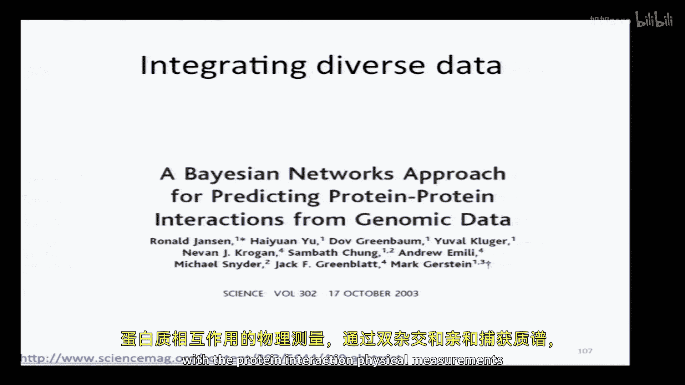
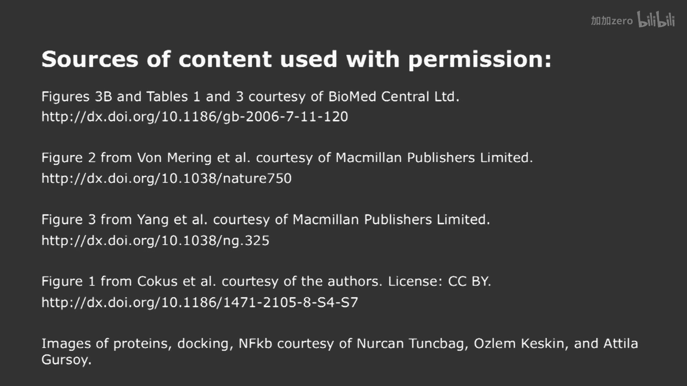

# 【计算与系统生物学基础 7.91J 2014】麻省理工—中英字幕 p14 p13 14. Predicting Protein Interactions -BV1HdzaYAE2a_p14-

The following content is provided under a creative Commons license。

 Your support will help M I T Open Coware continue to offer high quality educational resources for free。

To make a donation or view additional materials from hundreds of MIT courses。

 visit M T OpenCourseware at OCw。 MT。 Eduu。

Okay， so。We've been talking about predicting the structure of proteins。

 at the end of the last lecture。 We started talking a little bit about predicting interactions。

 And that's gonna to be the focus of today's lecture。

And we identified a couple of different possible prediction challenges。

 One was quantitative predictions of what happens when you make specific mutations in a known protein complex。

 We talked about trying to predict the structure of， say。

 just a pair of proteins and then trying to do that on the global scale for all known proteins。

And so last time， if you recall recall， we thought that initially maybe this would be a simple problem。

 We have proteins of known structure with a complex。 structure of the complex is also known。

 and we want to make predictions as to the change in affinity when there's a specific mutation made in principle。

 this should be easy because we have all those different formulations for the potential energy function。

 And so if we figure out what the local structural changes are that are due to the insertion or deletion of some side chain。

 then we should be able to predict the change in the potential energy。 And therefore。

 the change in the structure in the energy of the complex。 But in fact。

 it turned out that it was very， very hard to do that。 And so this plot compared。

The black circles were the prediction algorithms for for this problem compared to just simply a substitution matrix。

 the blossom substitution matrix defined in terms of the area under the curve for beneficial mutations and deleterious mutations。

 And you can see that very， very few of the black dots get far away from what is a really simple default model and lot of them do worse。

So I said， okay， well， maybe that's not such a simple problem because it requires a highly quantitative prediction。

 Maybe we'll do better just trying to predict which proteins interact at all。

 And so that's gonna be the focus of today's lecture。 Now， that also had a problem， right。

 Because even if I know the structure of two proteins。

 I don't know necessarily what surfaces of those proteins interact。

 And so I have to figure out this docking problem， of which part of protein A interacts with which part of protein B。

That's the beginning of my problem。 And then I have to make a series of subsequent decisions。

 So I'm going to have to figure out for any potential part of my protein。

 I need to figure out the docking problem。 the relative position orientation。

 Now in this little cartoon is's shown as a completely static protein that approaches another static protein。

 the only thing that's changing is the relative coordinates。 But， of course。

 there will be local changes in confirmation， perhaps even global ones。

 And so we need to be able to make some estimates as to what those structural rearrangements will be when the two proteins interact。

😊，And then after we've come up with our best estimate of the structural rearrangements。

 only then can we come up with an estimate of the energy interaction and decide whether it's exceeding。

 it's better than some threshold。 Okay， so one of the problems that's pretty obvious from this is that this kind of our approach in principle。

 if we do it rigorously through all the steps would be extremely slow。😊，Now。

 another part that's perhaps a little bit less obvious is that's gonna to be very prone to false positives。

 And why do you think that might be。What am I not taking to account here。Y。

You're not taking into account the desalation。So one answer is I'm not taking down the deelvation。

 but， in fact， I can do that， right， So some of the potential energy functions we looked at。

 the statistician's version， rather than the physicists。

 makes it pretty easy to incorporate the de salvationvation。

Any other thoughts as to what I'm not taking into account。

What other proteins should I be considering when I'm considering an interaction problem。

RightSo I've isolated in this case， two proteins。 I'm saying in a universe where these are the only two proteins that exist。

 Will they have a favorable energy of interaction。 But I really need to notice whether that energy of interaction is more favorable than all the competing interaction that they could have。

 So even if I find something that's potentially a good interaction。

 it may not be the best possible interaction。 And if I consider then the concentration of this protein and the concentration of all the other molecules out there that have a higher affinity Then it could turn out that this is actually a rather poor substrate for my protein。

 a rather poor interaction partner。 So we have that false positive problem。😊，Okay。

But let's focus on the computational efficiency problem。

 because that's at least one that we can come up with some nice algorithms to try to solve。

 So what we want to do is try to limit our search space。

 If I want to figure out I have a query protein。 I want to ask， what does it interact with。

 Instead of trying to do the pairwise comparison of this protein with every other protein in the database and doing very precise structural calculations and all of those。

 maybe there's some way that I can pre filterter the set of proteins that it might interact with。

 And that's what we're gonna look at。 So we're gonna try to efficiently choose potential partners before we doing any structural comparison。

 And then once we have those partners， we're gonna try to avoid having to do detailed calculations until we have a relatively high degree of confidence that these proteins could interact by other criteria。

 And we're gonna look at two papers that describe algorithms of solving this problem。

 they're both upload it to the website。 The first thing that will look at is called prism that actually uses structural calculations。

 And then we'll look at。😊，Pre P， PI， which deals with everything purely without actually explicitly calculating the structures。

Okay， so what does prism do， Well， it's based on the notion that there are limited number of architectures that we could look at for which proteins can interact。

And so if we can identify those architectures， then we can try to figure out whether protein is a potential partner of another one before we do the detailed costly calculations。

In addition， in those architectures， not all amino acids are going to be equal。

 but there are going to be some that contribute more to the energy than others。

 And so by identifying those critical residues， we can once again focus our computational energy on those complexes that are most likely to be important。

Okay， so it has these two components， a rigid body structural comparisons。

 That's the two proteins are not changing their own coordinates。

 They just being brought together in different conforms。

And then once the proteins have passed a series of checks。

 then we allow for flexible refinement using the kinds of energies we looked at in the previous lectures to decide how high affinity this complex could be。

And the critical thing is that we're going to make some of these early decisions after the rigid body comparison using structural similarity。

 evolutionary conservation。 and particularly looking at these regions that are called hotspots。

 These are sites where most of the free energy of interaction occurs during an interface。

 It's not as I said， uniformly distributed。 So I showed you this slide last time。

 it shows kyottripsin in a light gray and it interaction with some protein partners。

 these two share some global similarity to each other。

 whereas this partner is quite different from either of these two globally。

 But you can see that at the interface， it's actually quite similar。

 And so this gives you hope that even if you can't find a direct homologue。

 So if you were trying to figure out what is this protein in yellow interact with and you search the database and you couldn't find anything that was its structural homologue But if you could figure out to look for homologues of the little regions that interact。

 you might be able to figure out that interacts with the same protein as this one in this one。😊，Okay。

 then what about this idea of hotpots。 So this was an idea that was first developed in 1995 by this paper clocks and wells。

 where they were looking at the interaction of a cell surface receptoror with its ligand protein。

And they did systematic mutn across the surface of the interface to see when I mutate any single amino acid to alanine。

 how much it affects the energy of interaction。 What they found was things were highly highly nonunform。

 So this lower curve shows the change in free energy when you mutate particular individual amino acids to alanine。

 And you can see there are big losses of free energy at some places。 In other places。

 there's almost no change in the free energy and binding。 And a few places。

 you actually get a benefit from mutating aside chain to alanine。😊，So in this particular case。

 and it's held up over many， many cases。 then， the free energy of binding is not uniform across the surface。

 but it's distributed in what has been called hotspots。

 So here is a structure of the human growth hormone and its receptor。

 And in red are the few amino acids that contribute very。

 very large amounts more than one and half kcals per mole to the energy of interaction。

And it doesn't correspond with any simple structural parameters。

 So it's not the amino acids that have the biggest surface area， for example， or anything like that。

 So it's not trivial to figure out what these regions are。

 although there are some prediction algorithms。So their studies and subsequent ones have indicated that roughly 10% of the amino acids at the interface are the ones that are the biggest contribution。

 There are some trends， but none of these are hard rules。

 These tend to be rich in these three amino acids， trytophan Argen and tyrosine。

If you might imagine these are regions of the protein that are highly complementary。

 So there'll be a patch on one side。 That's a hot spot matching up with another patch and the other protein。

 that's also a hotpot。And it's kind of an interesting note that around these regions where the hotpots occur。

 there are other amino acids that exclude solvent from the interface。 And they call that an O ring。

 So these are some of the features that tend occur protein interfaces。 So in this prsism algorithm。

 what they do is the following。 They store for the template， two proteins that are known to interact。

 And they define the interface simply by close approach of amino acids in one chain to amino acids in the other。

😊，So in this case， shown in these balls are regions of the proteins that interact。

And then they isolate the interfaciial residues， ignore the rest of the protein because we said that the parts that interact in in different proteins could be homologous。

 even if the global structures， the proteins are not right。

 So we're gonna do our structural similarity calculations purely on the interface residues and not on the entire structure。

So then with that template， you can then look at lots of proteins and see whether they have any structural match to pieces that interact。

 So here they've identified this protein， A S， P P2。

 which has structural homology to Icapappa B at the interface。 although globally。

 it's quite different。And now， once they have this potential partner for N F Ka P， this A S P， P 2。

 they're gonna to test whether theres a good structural match。

 whether specifically the regions that are hotpots， They have an algorithm for predicting hotpots。

 whether the match is good， whether there's sequence conservation of those hot spots。

 And only then do they do the refinement to do the flexible refinement of the type that we looked at in previous lecture energy minimization and other approaches to figure out what。

The best possible structure for this complex would be。 and then what its free energy would be。

So here's their a description of the problem。 They have template proteins and targets。

 They do structural alignment。 They ask whether it passes some thresholds。 These are very。

 very fast calculations to do。 And only if they pass these fast calculations。

 do do more detailed calculations。 And finally， only if it passes this。

 do you do the very computationally expensive refinement。

And then one critical thing to remember from this algorithm is that it doesn't require the template and its query to be perfectly matched in structure。

 In fact， the elements of the structure at the interface could come from different parts of the chain。

 So they don't take into account the， the chain order。

So if I had a beta sheet structure in one protein that looks like this。In my query。

These two proteins。Could be very indirectly connected。

 I don't care that there's a huge gap in the insertion。 I just care that locally at the interface。

 one protein looks a lot like the other。There was a question in the back。How are you。A database。

Strtures。She was looking at all week。That's right。 So the question was。

 how do you search a database with 3D structure， You do structural similarity comparisons that are based on the 3D coordinates。

 The simplest way to do it， but not the most efficient is to find the rigid body superpositions that minimize the root mean square deviation。

 which was a metric we gave in one of the previous lectures。

 There are faster things you can do as well。 You can imagine that you could look at certain global features of elements of secondary structure and so on。

 And there's been a lot of work making those algorithms very fast。Other questions。 Good question。No。

Like， so they give an example in their papers starting off with this known structural complex。

Cycling dependent kinase， the cyclin and P 27， the inhibitor。

 and then looking for structural matches。 So this was the so you can identify this potential structure match。

 you refine it， get an energy of interaction。 Try another one that has no global structural similarity。

 again， once it passes all the checks。 you compute the the refinement and the energy and similarly at this side。

And so from this initial complex， where we had these two proteins。

 which were known to interact into the PDD B， they can make predictions that these other proteins are likely to interact。

 even though again， at the global level， there's very little sequence similarity。Is that clear。Okay。

 so the advantage of this is that it， it eventually does do these structural refinements that allows to figure out the best match between two potential interacting proteins。

 But that's also its weakness because that takes a lot of computational time。

 So thiss other approach called pre PP， P I Never actually does the structural refinements of the type that we talked about in the previous lecture。

So if so， how does it figure out whether two proteins are likely to interact。

So this is there schematic， and we'll go through the steps。

So you start off with two query proteins that you want to know if they interact and you do sequence similarity to a database of known structures。

 So you find sequence homologues of those proteins。And so they call those homology models。MA and M B。

And now they look through the database for all the structural homologues。Not sequence homolos。

 but structural homologues of M A and M B。 So they get a series of neighbors that they call N A 1 through N and A B。

 N B1 to N。 So these are the neighbors of these homologues。

 And they ask whether any of these neighbors， anything in this row。

 or anything in this row are known to interact。And that potential interaction then could be an it a model for the interaction of the query。

 right。So far， so good。Then they do a sequence alignment。 They sequence alignment of。M A and M B。

 which are the known structural homologues of the queries。

And the two proteins that are known to interact。 And so now they've got this potential model for the interaction of the queries made up of two proteins and known structure that have holos that are known to interact。

 so it's two steps removed from the actual interaction。 Now。

 while their figure says that they do a structural superposition。 That's not， in fact， what they do。

 if you look at it carefully， it's a sequence analysis。

 And they'll take you through the steps in a second。 So they mean structure in a rather loose way。

 So they're only doing sequence comparisons here。 They're never actually building alogy model for the queries。

Okay， so this figure comes from the supplement where for some mysterious region。

 they've changed all the nomenclature。 So things that previously were called N A and N B have now been called T。

 A and T B。Take what you get。So this is a protein， a pair of interacting proteins。

Where the structure of the interaction is known and there are structural neighbors of M A and M B。

 which you don't know whether they interact or not。

They identify interacting residues in this structure。

 That's what's represented by these black lines connecting blue dots。

 So these are interacting residues from the two template proteins and neighbors and A N and B。

 And they ask whether the amino acids in M A and M B also are good matches for this interface。

 And they have a number of criteria for doing that。So they can come up with five measures。

The first of those measures is a structural similarity between these M A proteins and the M A and M B and N A and N B。

Then similarity， O， similar is a structural similarity。

 Then they ask how many of the amino acids at this interface。

And what fraction of the amino acids at the interface can be aligned。

 So this is a sequence based alignment of M A。 And but's here called T A。

 but it was previously called M A。Just make the light complicated。

 So this is the sequence based alignment。 These are the interacting residues， right。

 all the blue ones in the structure of T A and T B interacting。

 And they ask what fraction and what number of these amino acids are aligned in the sequence alignment。

 So here they come up with a number。 In this case， I guess it's four amino acids in this four pairs。

 I should say， of amino acids，1，2，3 and 4 indicated by these four lines are both interacting in the structure of the complex。

😊，And can be aligned to sequences in M A and N B。And then they use these other algorithms that are based primarily on machine learning。

 looking at protein interfaces to decide whether the sequence of the amino acids that are gonna to sit at those places in the interface are likely to be residues that typically occurred interfaces。

 So this is the kind of statistics that I showed you before from those old papers that said， you。

10% of amino acids are these hotspots， certain kinds of amino acids are predominant there。

 So there've been a number of algorithms that list a bunch that they use to come up with a score to decide whether these residues。

 in fact， are statistically likely to be good matches。

 So they have these these criteria and they decide then that some fraction of amino acids at this interface in M and M B are likely to be reasonable ones to be at the interface。

 So with all that then。They then use all of these different scores with a baesian classifier。

 And we'll talk a little bit later in this lecture and probably the next lecture as well as to what a baesian classifier is。

 But they plug all those scores in that they derived from these proteins to decide whether these two proteins are likely to interact。

So the advantage of this approach is it's extremely fast。 Everything we've talked about are are very。

 very quick calculations。 Even the structural alignments are fast。 The sequence alignments。

 of course， are。 So we get through the whole database very quickly。 So they've actually computed。😊。

They've actually computed the potential interaction partners of every pair of proteins in various genomes based solely on these alignments。

 The disadvantage。 What's the disadvantage of this method。YouCan't get it to novo。

You can't get any den interactions。 So there'll be no。

 if there's no neighboring structures that interact， they'll never come up with it。

 So that's an important point。 And then the other problem is because it doesn't have the structural refinement。

 it's given up on that slow calculation。 It also loses a lot of potential specificity。

 all the conformal changes that can occur will be lost to an algorithm like this。

 so if these two competing approaches。 Yes， questions in back this method actually be used。

What to say。反院。Stte example。So the question was， could you use this kind of approach as an input or refineance that and absolutely one could？

😔，Yes。Is there another question back then？Other questions。Alright。

 so we're gonna take a slight turn here in the course of the lecture and move away from a purely computational approach and actually look at how interaction measurements are made。

 One of the big changes of the last decade or so， is that we've gone from an era when interactions were measured pairwise to interactions being measured in bulk。

 So through high throughput measurements。 And we'll see that that leads us to some statistical problems。

 which eventually bring us back to some computational issues as well。😊。

So if you want to measure all the proteins that interact in an organism。

 turns out to be obviously very difficult。 One big advance that's helped with this is the idea of tagging proteins and using mass spectrometry to figure out what they interact with。

So in this these two sets of papers， which were some of the early ones being done in yeast。

 they took one protein at a time。And attached a tag to it。

 And I'll talk about exactly what those tags are。 But those are labels that allow you to attach it to a solid support。

And then by attaching to solidd support， then you could then purify any proteins that stuck to protein 1 here。

And then after you've purified them， you can run them out on a gel。

 cut them out and figure out what the identity of those interacting proteins were by mass spec。

 So this sounds very labor intensive， but still a lot faster than anything that came before it。

 And with this approach， they were able to go through entire genomes， proteomes， I should say。

 and figure out all the interacting partners for very。

 very large fractions of all the proteins there。😊，So with this approach。Right。

 what kinds of proteins do you think are likely to be false positives， Any thoughts。Yes。with me。

Exactly， so one thing that can be quite problematic are proteins that stick to the column。

 regardless of which protein you put there。 And we'll see an approach to getting rid of that。

 other kinds of problems， the variant of that。Thoughts。

What about proteins that tend to stick to other proteins non specifically， right。

 Those are gonna to be quite problematic， too。And what are the likely false negatives in an approach like this。

So proteins that really do interact with the blue one， but aren't picked up， yes。

Weak interaction partners， things， particularly with short half lives。

 because you do a lot of washing。 So it's going to be dependent in half life。 Very good。 What else。

 Yeah I something that interacts in the tag region。Something interacts in the tag region， right。

 So something interacts right around here would be lost because this wouldsterically interfere。

 Very good。Anything else。What about the concentration of proteins。

 How does it influence whether they show up here。Right so if a very high concentration protein。

 it may interact， even though naturally doesn't。 they never see each other。

 they're in different compartments。 But when I like to sell and do this。

 But low low abundance proteins are gonna be quite problematic because there'll be very little of them these complexes compared to the high abundance proteins。

 They won't be detected by this method。 They will never get to the mass spec and so on。

 So we've got both false positives and false negatives in these approaches。 Now。

 one of the things that came up was proteins that stick nonspecific to the column。

 And there was a clever approach in one of these early papers that got picked up。😊。

That got picked up to avoid that。 And it is called tandem affinity purification or tap tags。

 And the idea is the following。We have some gene。And we use homologous for combination This was done in yeast。

 where this is easy to insert this sequence， which codes for the following。

A piece of protein of no particular function。 as far as you knows， a spacer followed by this calcium。

 camalgen binding protein。Followed by a prote recognition site and then by protein A。

So once this protein gets expressed and it gets expressed at its native levels。

 because youre inserting this into the genome。 So it's not on an exogen its promoter。

 It's in its normal position。 Whatever that protein was， then has that its C terminus。

 all these pieces。 So how does that help。 In the purification。

 we start with something IG G that binds the protein A。

 So now that's what attaches us to the cell support。

And attach the solid support will be all those things that are nonspec binders。

And so if I have some nonspec binder that just likes my solid support， it'll be here。Right。Nonspec。

And if I just。Acid washed everything off the column and did ran my gels with that or boiled it off in S S。

 I would get the nonspecific protein too。 But what they do instead is they instead cleave here with a very specific protease that recognizes this site。

 It's called a tobacco etch virus protease as a very long recognition sequence。

 you can make sure doesn't cut anywhere any other protein。 And so now。

 instead of eluting non specifically with acid or detergent， you loo specifically with T EV。

 And then this protein， this part of the protein will fall off。😊。

And then you do a second purification that relies on this。Piece of the protein。

So you you pull out only the things that you want that have the CB。

 the camodin binding protein by having different kind of solid support that interacts with that has camodline attached to it。

 And so through this process， you can get rid of a lot of the nonspecific binders。

 It doesn't help you with the false negatives， right， you've made the wash conditions even harsh。

 So you're gonna lose more proteins， but you'll pick up fewer false positives。And then finally， the。

 the last purification procedure actually uses E GTA， which is a chulating agent。

 So this interaction between CBP and camalulin depends on calcium。

 E GTA sucks the calcium out of that interaction。 And so it to get a very specific way of eluting rather than a nonspec go like heat。

 salt， acid or detergent。😊，So this has been one technology。

 affinity purarification followed by mass spec。 that's given us a lot of information on protein protein interactions and a competing technology that's also contributed quite a lot is called yeast to hybrid。

So， in this approach。You have a reporter gene that normally is not going to be transcribed。

 It has a design DNA binding site， a DNA binding protein and your bait protein。

 And you want to figure out every protein that can interact with this prey。

 So the prey now is attached in activation domain。If these two proteins don't interact。

 the activation domain never gets recruited to this reporter。 There's no transcription。

But if the green protein and the blue protein interact。

 then the activation domain is gonna be recruited to this promoter。 It's going turn on transcription。

 and then you'll get a signal。So what are some of the advantages of this approach。

So it doesn't require you to purify anything， right。

So it should be much more sensitive to low abundance proteins。 So that's definitely an advantage。

 It'll pick up a lot of those transient interactions。 You may not get continuous activation。

 but you'll get transient activation。 And if you set the conditions up properly。

 you can pick up the transient activation。But it has its own bias。

 So none of these techniques are gonna to be perfect。

 It's gonna be biased against proteins that don't express well。 This is， as the name applies。

's typically done in yeast。 So if you have human proteins and express them in yeast or plant proteins that you express in yeast。

 there could be some proteins that just will not express well in that organism。

What else can be a problem？Some proteins don't do all nucleus。 right。

 So if you're interested in interactions with membrane proteins。

 it's gonna be very hard to get them to express in the nucleus。 And therefore。

 you'll never pick up those interactions。Okay， so we've got these two different technologies。

 the affinity capture mass spec and the two hybrid questions on those technologies。Yes。

Could another control be further the mass？Pification just to。Subtract out everything going do。

The question was， could you subtract everything that's nonspecific。 And， yes。

 if you've got what you might call frequent flyers， Pro that show up in every single purification。

 then you can simply ignore those， And that is often done。

 So that'll help you with things that are very nonspec for the surface。

 What's more of a problem are proteins that have some affinity for your protein X。

 but are not really highly specific for it。 right， So they tend to bind to certain kinds of patches。

 Those will be harder to figure out because they won't stick to everything。Good question。

 Other questions。Okay。Alright， so we've got these different technologies。

 What we'd really like to be able to do is we know that there are problems in each approach。

 We'd like to be able to compute the probability that two proteins interact based on the data。 Okay。

 so now we're turning back to the more mathematical computational approaches。😊。

So if we just consider one experiment。And we're gonna talk about gold standard。

 So what's a gold standard。 It's a set of proteins that were we have extremely high confidence interact because it was analyzed by some other technology。

 not too hybrid non affinity capture mass spec， but much。

 much more direct interactions by physical measurements， maybe structural work。

 So the number of criteria they go into it。 So we have this gold standard data set where we know the proteins definitely interact。

 And we have our experiment。 So clearly anything in the overlap， we can count as true positives。

 right。😊，We detected it。 It's in the the database of gold standards and things that are in the gold standard that we missed are obviously false negatives。

Right， we report them as not interacting， but in fact， they do。The question is。

 how much of this is true positive， Everything that's detecting the experiment。

 but we have no information for it in the database。 So that could be for one of two reasons。

 it could be that they really don't interact or it could be that no ones measured it。

 The whole point of this experiment is to find new things。 So is there any way to estimate。

 What fraction of old things that are unique to this experiment are true positives And what fraction are false positives。

 Those wed like to try to figure out。😊，Now， if we just had one experiment。

 that would be very challenging。 But what happens when we've got two experiments。

So we have these two affinity capture mass spec experiments。

 or maybe an affinity capture mass spec and a two hybrid。

 So now let's think about the overlap of those two experiments with a gold standard。

So I've got this region of overlap between experiment 1 and experiment 2。

 And then this region that's overlapping between all three things。 experiment 1。

 experiment 2 in the gold standard。 So these clearly are two positives， right， They're in。

 they're high confidence because I picked them up in both experiments and they're in the gold standard。

😊，What about all these things in what I've labeled here， region 2。Well。

 if we believe that these two experiments are independent of each other in a rigorous way。Right。

 so let's say one's a too hybrid and one's a f capture aspect spec。

 There's no particular reason that the false positive surround would be false positives in the other。

In that case， I can call this region 2 my consensus true positives。

 I have a very high confidence that it was， that these are true interactors。 Everyone by that。

Seeme reasonable。Okay， so here's where the trick comes in。

What fraction of all these consensus true positives are picked up in the gold standard， This ratio。

 right，1， region 1 over region 2。Okay， so now I've got this region of things that were picked up。

 The two positives from this experiment that in the gold standard。

And then I've got this region that's unique to experiment， to。

 And it's gonna to be some mix of true positives and false positives。

 And the authors of this paper that that I are cited here make the following argument。

 We're gonna assume that the ratio of。😊，Of one to 2。Is the same as the ratio of 3 to 4。

So the fraction of， of true of consensus， true positives that are picked。

 These are independent experiments。 So the fraction of。

 of true positives that are picked up in the gold standard is gonna be constant。

 whether then the consensus or not。 So the fraction of ratio of 1 to 2 is gonna be same as the ratio of 3 to 4。

 So by that， then I can figure out how much of this region is consists of true positives and how much consists of false positives。

 If were want by that。😊，Yeah。Can I check， are we not saying？That。The gold standard。Represents all。

Correct， well， we are saying that the gold stamp consists of things that we know to interact。

But there may be more， but there may be more。 And the goal of our experiment is to find those other ones。

That's right。Alright， so if you accept that premise， which seems plausible。

 then you can compute what fraction of all the things that are picked up in each of these experiments are likely to be true positives。

So drum roll please， it turns out that the number is not that high。

So the fraction of things in the consensus。Well， it' 347 out of almost 2000。 And if you do the math。

 then what you end up with is that the true fraction in this region for which we have no data。

Is 1123 out of。 And the false piece of this is gonna be almost 15000。

And they went ahead and did this for a number of different experiments and computed the fraction of。

False derived false positives for these data might be a little bit hard to see on this screen。

 but the numbers range from 50% false positives to， in some cases， over 90% false positives。

It's a little disturbing， right。So these technologies are good at picking up interactions。

 but there's reason to be very skeptical。Okay， so now we've got a serious problem。

 because how are we gonna figure out which of these interactions to trust when we know that a very。

 very large fraction of fraction of them are false positives。 So what could you do， Well。

 you could take only the， the little bit of overlap， right， you could say。GoI had that Venn diagram。

Method 1， methodod 2， they did agree in a bunch of things。 so I could take only those。

That obviously throws away a lot。 Someoneone else suggested we could throw away the sticky proteins。

 right， So maybe there are non-specific proteins that don't show up in every experiment。

 but the they show up in a very， very large fraction of all experiments。 Maybe I toss those out。

 That's another possibility。 But what we really want to do is actually come up with a probability estimate。

 So not have to make a hard decision， but come up with an estimate of the probability things in interact based on all the data。

 So how do we go about doing that。So first of all， what happens if you just require consensus？

 So this plot shows accuracy and coverage of the gold standard。

For individual experiments with different thresholds， for deciding what's what's interacting。

 different cutoffs and things。 So the individual experiments are shown here。

And then if you acquire two methods to pick something up or three methods to pick something up。

 you can get better and better in your accuracy。 This is a log log plot。

 So if you acquire three methods to agree before you call something a true positive。

 you can get up to， I'm not sure exactly what this is。 but 8090% possibly， right。

 But look at where you are or the Y axis。 you't only get about less than 1% coverage of the gold standard。

 So that's not a great approach。 So what we really want to do， as I said。

 is to try to estimate the probability that proteins interact， given all of our available data。😊。

And the data could be specific experiments。 say the two different mass spec experiments I just referred to。

 or as we'll see a little bit later in this lecture。 possiblys the next one。

 other kinds of extraneous data that are not direct physical measurements of interaction。

 but might give us confidence that things interact based on similarity and annotation or similarity in gene expression and so on。

 And we'll get into the details of that。Okay， so to do this。

 we need to have a little bit of a refresher on Bayesian statistics。

So I want to measure the probability that an interaction is true。Given the available data， right。

And I can estimate that based on the probability of observing the data for things that I know to be true。

And these prior estimates of what's the prior probability that an interaction is true And the prior probability of observing a particular data set。

 Now， this by itself isn't really that helpful。 I haven't told you yet how to calculate any of the terms on the right。

 but bear with me。If I want to decide the likelihood that a protein tracks。

RightHow likely is is more likely that interacts or not。 I could compute this ratio。

 The probability that the interaction is true， given the data over the probability of the interaction is false。

 given the data。 That's the likelihood ratio， right。So by this formula。

 I then I cancel out this probability of the data， the probability of the data。

 And if I had a way of calculating this， and we'll get to it in a second。

 then if it's more likely than not to be a true interaction， I can call an interaction， right。

 if it's less likely。 So if this ratio is greater than one， I accept it as a true interaction。

 this ratio is less than one than I reject it。Okay。

 so now our challenge is to figure out how to compute these terms。One more thing to note is。

 if all I want to do is be able to rank。Every interaction by this likelihood ratio。

 rather than coming up with a hard threshold。 Then I actually don't need all these terms。

So this is the likelihood ratio。 I can convert it to a log space。

 So it's gonna to be the sum of these two terms。 And if I'm simply ranking everything by this like log likelihood ratio。

 this term is the same for every interaction。 right， It's just composed of prior probabilities。

 So it's not going to affect the ranking at all。Any questions on that， is that clear？Good。

So if I just want to come up with a f function， all I need to do all I need to do is to be able to estimate the probability of observing data for true interactions and the probability of observing that set of data for false interactions。

 Everyone buy that。😊，Yes， please that probability is the same problem interactions。

We're assuming the same product。That's's a definition。

 We mean what is the prior probability that proteins interact versus the prior probability。

 So it's independent of the proteins that we're looking at。Other questions。Alright。

 so we need a way of computing this piece of all the things we've looked at before。

 So how do we get an estimate of the probability of observing a particular configuration of the data。

 meaning I detected an experiment 1 and not an experiment 2 and an experiment， but an experiment 3。

 What's the probability of that， given it， it's a true interaction。

So that's what we're gonna dive into right now。 Okay， so one thing we could do to make life simpler。

 and then we'll remove this simplification later。 But let's for the time being assume that all of my data are independent。

 okay。So the two hybrid is gonna have completely different mistakes than the infffinity capture mass spec。

 right， So those two data sets are gonna be completely independent of each other。

 So I can write this as a product of a particular observation。

A particular mass spec experiment and a particular two hybrid experiment for true interactions and false interactions。

 So what's the， it's a product of the probability that a particular experiment would detect an interaction if the interaction is's true over the probability that that particular experiment would detect it if there was no interaction。

 right， And I'm just gonna multiply all of those probabilities。Yes。So this is one。Interaction。

That's going to be some we take the product over all into。We'll then run one runner。Is that correct。

 Let me。If I want to determine whether a particular interaction pair。I want to compute the log。

 this log likelihood ratio or this actually ranking ratio because I've thrown away the prior。

 I want to compute this ranking ratio for a particular pair。 I've got protein A and protein B。

 And I don want to determine whether I believe it to be more likely to interact or not and rank it with all the others。

 right， So I'm going doing this for a pair of proteins now。So first are good。Now。

 for that pair of proteins， I have a series of observations or lack of observations， right。

 I have a whole bunch of experiments。This experiment detected it。 That experiment didn't detect it。

 This one did。 right， So what's the probability， these proteins， these A and B really interact。

 given that yes， no， yes in my experiments。 And then for new protein， it might be no， no， yes。

 And I want to figure out the probability for this pair。Big letter M。

Is it on the order of like 10 experiments？So what the question is， what's the scale of this。

 So obviously， that's going depend on what kind of data I bring in。

 But in these cases it's very small。 So we have a handful of these high throughput experiments over over entire genomes and proteomes。

 So they're not going be a lot。 So in some of these early papers。

 there were four interaction experiments that they were looking at。 Now。

 the numbers might be a little bit bigger， but not significantly greater。😊，Alright。

 so now to compute this， we need a set of gold standards。

 But now we don't just need gold standard positive interactions。

 Protes that we know really do interact。 We also need proteins that we know really don't interact。

Right， because I want to compute the probability of an observation。

 given that some interaction is definitely wrong。So precisely how I compute these termss are gonna depend on the kinds of data。

 The experiments I've just been talking about these high throughput mass spec。

 which were the ones which they we looked at the ratio of the consensus true positives and estimated that 96% of all the data were possibly in error。

 The details of how to do those calculations are here。 I leave you to look that up。

 if you're interested。But now what we're gonna do is we're gonna see how if we were to rank interactions based on。

Based on this term。We can avoid having to throw out most of our data， right。

 So we said if we require all the experiments to agree， we're gonna have very， very low coverage。

 Now， we're going rank everything based on this likelihood ratio or something derived from likelihood ratio。

 So in this paper where they were simply looking at the protein protein interaction data sets to compute these interactions They rank everything based on that on that ranking function we just described。

 And then as you very your threshold， you can figure out how many true positives you have and how many false positives you have in the gold standard。

True interactors and false interactors。 And you can compute this curve， right。

 for any particular value of that ranking ratio， how。

 What's my sensitivity and what's my specificity。Clear what this plot means。Okay。And here。

 they've plotted the values for individual experiments。

 And this is the value for the an independent database of gold standard interactions。And so now。

 where do they come up with their true positives and their false positives。

 A lot of this is going depend on how representative those are。

 And all these numbers are subject to revision。 If you decide that the true positives and false positives that people are using are not accurate enough。

 So they use two well annotated databases of interactions。

 One from mips and one from S GD and you can play those off against each other as the database of true positives。

 Some ways， that's the easier thing because people like to report that proteins interact。

 they tend not to like to report that proteins don't interact， right。

 You don't see a lot of nature papers saying protein X doesn't interact with protein Y。😊，Okay。

 so how are you gonna figure out then what are your true negatives， So the strategies that they used。

Well， one possibility is they're annotated to be in complexes。

 and those complexes are different from each other。 That's not bad， right， but it's not a guarantee。

 either。Or this is a little bit better。 They on their annotate be in different parts of the cell。

Of course， if those annotations aren't perfect。 low concentrations， you could still be wrong。

Or that they have anti correlatedrelated gene expression。 I kind of like this one， right。 So。

 you know， it's one thing to be not correlated。 But if you're anti correlated。

 It seems pretty suggestive these two proteins are are never in a complex together。 Again。

 it's no guarantee because this will talk about in some detail later。

 RNA levels are not very good predictors of protein levels。

 But if you apply number of these criteria。 you can come up with the set of proteins that you have fairly high confidence really don't interact。

 you can that with the databases of proteins with very high confidence that they do interact。

 And you can get the true positives and the false positives that you need for this analysis。😊，Okay。

Alright， so that， that's a way of combining some information。

 We're gonna to see a generalization of that called Bayesian networks。

 We've mentioned this already in at least two different contexts。

 and it'll come up again later in the course as well。

So these are very general methods for reasoning probabilistically。

We will see them in the context here of predicting interactions。

 We'll see them later in the context of gene regulation and signaling， as well。

What we fundamentally need to do a baesing network is a graphical structure that represents our understanding what the relationship is between causes and effects and a set of probabilities allow us to compute things on this network。

Well show you examples where those networks are derived from our prior understanding of the problem。

 but also ones where the structure of the network is learned from the data， okay。

And we're gonna see two primary contexts。 First， we have this question of whether proteins interact。

That's what we've just been talking about。 So here are four experiments。

 the in vitro pull down experiments and yeast2 hybrid experiments that give us relatively independent information about whether proteins interact。

😊，And we're gonna look at a paper that used those data to。

 with a Bayesian network to compute the probability that two proteins really do interact based on the combination of all the data。

Rather than throwing out anything that doesn't fall in the overlap， which could be a very。

 very small number。And then later on， we'll see examples of using Bayesian networks to understand biological networks。

 So this might be a set of transcription factors that are regulating a set of differentially expressed genes and the structure of the graphical network for a Bayesian network has a lot of similarities to the way we normally think about transcriptional regulatory networks。

 So there's sort of a natural way of transferring our regulatory problem into graphical network problem。

 but we're going to focus on these prediction problems of protein protein interactions first。 Now。

 if I just want to compute the probability of detecting the probability of detecting an interaction in various experiments。

 given that it's true or false， I could explicitly compute that probability。

 And we saw examples of that just now。 But some of these Bayesian network problems become much。

 much too large to do that。😊，This is a little tiny piece of a Bayesian network that is supposed to represent I believe it's a transcriptional regulatory network。

 You could never possibly write down all of the terms in this probability where every node could。

 in principle depend on every other node in the network。

 It would just be a ridiculously large problem。 In fact， how large would it be。

 if I've got n binary variables。 my gene is on or off interaction is true or false。

 I have  two to the n possible states， right， And the only constraint I have in principle is that all the probabilities have to add up to one and I have  two to the n minus-1。

2 the n-1 possible variables variables that I need to set。

 So that's a ridiculously large number in most contexts。

 So how do Bayesian networks help us solve this problem。 Well。

 we represent our understanding of the problem in a graphical structure。

Where have causes and effects， and there'll be a directed  error from a cause to in。

 I don't always know the cause。 So in our context， were trying to figure out whether two proteins interact。

 What do we measure。We actually don't measure interactions。

 We measure the result of a particular experiment， right。

 which is a combination of whether interacted and all sorts of noise that we just discussed。

 So the effects that we observe are detecting experiment 1 or detecting experiment 2。 The cause is。

 did it interact or not。 So the causes hidden。 The effects are observed。😊，Now。

 in the cases we were looking at before， we treated all these probabilities as being independent。

 but we might know something about the structure of our experiments。

 the kinds of experiments we're doing that might lead us to have a different structure， so。

We could have interaction that gives rise to all different kinds of data。

 But depending on whether the proteins a membrane protein are highly expressed。

 it might influence the results of certain experiments and not influence the results of others。

 right。So like the two hybrid would be very biased by which one of these。The membrane， right？

And then the inffinicaps aspect could be very influenced by proteins that are stress at very high levels or very low levels。

Exect。If we assume that all the interactions are independent。

 then we multiply probabilities and we'll go into more detail。

 But this is what we are looking up up until now in cases where we believe that all the observations are not independent。

 Then we're not going to simply multiply things。 We'll see there's a more precise way of computing the probabilities。

Now， in this case， I've drawn the graphical structure because I believe that I know what's going on。

 But in more general case that we'll look at， will'll actually derive the structure from the data。

One of the nice things about Bayesian networks is that it removes the need to have all two to the n -1 possible parameters。

 because it tells us there are certain independence conditions。😊。

So node is independent of its ancestors， given its parents。 What does that mean。

If I'm trying to reason about the expression of one of the genes down here。

 and I know that this transcription factor is on。I don't really care what the probability is that a particular parent of that transcription factor is on。

 right， So I don't need to know anything of transcription factor B1。 If I know the state of B2。

 If this is on， then that's the only thing that's going affect whether it's turning on these genes。

 regardless of what the activation state of its parent was。That clear。Yes。Does not say TFB1。

 once I know TFB do。It saysAnd this yeah， sorry， that should say TFP1。Thank you。Okay。

 so we'll do a little example。 It's admission season both for graduate school and undergraduates。

 So let's do a a little toy example where we're gonna get rid of admissions committees and just do automated admissions。

😊，So we're gonna collect various data about students， and then we're gonna build a Bayesian network。

 and that network is going to decide whether to admit students。 And this simplified version。

 the only information that will go into our decision will be the grades on the transcript and the Gs。

Hopefully， that's not the case。 And we believe that certain things will influenced your your grades and your Gs。

 you know whether or not the student is smart， certainly should have some influence。

 but also the grade inflation at their school will have some influence， right。😊。

So a prediction problem in a basing network is going from the causes to the effects。

So if I want to predict whether students admitted， I only need to look upstream。

 So we want to predict we observe the things on the top。 say grades and juries。

 and we want to predict whether the student should be admitted or not。

 There's another problem called an inference problem， which is when we observe the effect。

 and we want to make inferences about about the causes。 So an example of that would be。

 you apply for an internship。 They say， oh， she's a student at M T。 I bet she's smart。

 right They're doing an inference problem。😊，Right。We'll leave it for you to decide whether you and your colleagues are as smart as anyone one think。

 But hopefully you are。 Okay， so we've got these two different kinds of problems。

 We've got prediction problems from top to bottom and inference problems from bottom to top。😊。

Alright， and we're gonna talk about conditional probability。

 So if I've got some very small piece of this network with just two nodes， right。

 I could write out all the possible probabilities for any pair of those nodes。

 So the probability of the student is not smart， given that that student has low grades。

 the probability that the student is not smart， given that the student has good grades and so on for all possible pairwise comparisons。

 or I could write this as a conditional probability。

 which tends to be an easier way to think about the problem。

 What's the conditional probability of a student being smart， given that they've got good grades。

 sorry， given that they've got good grades or given that they have bad grades。😊。

They have the same information。 for this 1。 I need additional information about the the total probability of students being smart or not。

 and the total number of variables， I said in either case are the same。

 So these are completely interchangeable， but it's a lot easier to reason with conditional probabilities than with the joint probability tables。

 as we'll see in a second。Okay， so as I've said， you don't need a full probability table for a Bayese network。

 You don't need two ends in the -1 variables。 And the fundamental reason for that is that the joint probability is only gonna to depend on the parents。

 So in this toy example， the G R E scores over here are not dependent on grade inflation。Right。No。

Now， that all hopefully makes sense， questions。Basing networks get a little murky next。

 So I'm gonna try to give you an into， oh， yes， question， please。やってしょう。

So can you say the question again？I guess I'm just confused by。直接波。What do you mean by this joint？

Dejo probability。So。If I want to figure out the probability of some particular configuration of all the nodes in my network。

I don't necessarily need to consider all possibilities， because， for example。

 if I want to consider all the the joint probability tables with settings for the G R Es。

 whether you had good student good G E scores or not。

 that's not going to be influenced by their by the student schools and great inflation policies。

Right。But the grades would be， that's right。So some of the variables I can remove and others some of the joint probability statements I don't need to worry about in others。

 I do。 And which ones I need to consider is determined by the graph structure。Yes，Okay， so the graph。

 how is the graph starts determined， So it's determined in one of two ways。 I can draw it in advance。

Because I believe that I know something about my setting。 I believe that these data are independent。

 Then， you know， it has that。Structure like this cause and a bunch of independent effects。Right。

 or perhaps I claim to know that actually， two of these things。Have a common parent。As well。

 right so in some cases， I know we'll also talk about how to learn the structure from the data。

 which is the more common setting in regulatory networks。

 So in these kinds of problems when I'm trying to decide how to integrate different proteomic data sets。

Typically， people make arbitrary decisions about what the structure is based on their knowledge of the system。

 But if you're trying to figure out de novo， which proteins interact with， which。

 which proteins regulate which genes， then you have to learn from the data。

 And we'll talk about how to do that in a second。Great questions。 Any other questions。

 Anything in the quiet half of the room。Okay， so as I said， this part of it。

 I think you can usually come up with cases that give you fairly good intuition。

 One of the things that is true in these Bayesian networks。

 which most people find a little bit surprising at first is something called explaining away。

So let's look at this Bayesing network。 I go outside and I detect that things are slippery on the grass。

So that could be for a lot of reasons。 But one possible reason is that the grass is wet。 Okay。

 what are the causes of the grass being wet， Well， it could have rained。

 or the sprinklers might have been on。And depending on this is an example。

 So a lot of the Dais networks were developed in Stanford and by Judea Pearl and colleagues。 and。

 of course， in California doesn't rain that often。So there the season is a strong determinant of these things。

 Not so much around here。 So this， in this example that they like to do。

 So does the probability that's raining depend on whether the sprinkler is on or not。😊，Now。

 the answer should be no， right， I mean， in reality， when you think about。

There's no causal a relationship between the sprinkler being on and the rain。But， in fact。

 when were reasoning over these networks， we， we actually are influence， so。In a probabilistic model。

 if I know that it's raining and I know the grass is wet。

 then what do I think about the sprinkler being on， Do I think it's just as likely， No。

 I think it's less likely， right， If I go inside。 you see the grass is wet， there are clouds。

 the rain is coming down。Is the sprinkler likely be on or not， It's likely to be off， right。

So there's no causal of relationship。But there's a probabilistic relationship through the graph structure。

 And that's called explaining away。 And you can take a whole course on how to understand which relationships you can detect and which not。

 This is not the place to try to go into that。 But I hope you'll be familiar with this problem。

 And I'll try to give you a toy example that makes it a little bit more obvious in terms of the equations where this comes from。

So imagine this very silly game where we play where you get a point。 We toss coins。

 We toss a coin twice。😊，And if it turns up heads both times to get a point。

 if it turns up tails both times to get a point。 But if one's a ahead and one's a tail。

 you don't get any points。Now， does the probability that I tossed head on the first time depend on whether I tossed a tail on the second time。

So causally， obviously not， right。 And mean， first of all， it happened earlier in time。And secondly。

 the coin tosses are completely independent。Alright， But what happens when I know the outcome。

 What if I know what score you got。So if I know your score。

Then is the probability that I tossed the heads on the first time independent of whether I got tell the second time。

 What do you think， How many people think it is independent then。

Now people think it's not independent。Very good， it's not independent。Obviously， here's。

 here's the math to prove it。 But your intuition does the same thing。

 So what's the probability that I tossed head on the second time， given that I got a1。

 I got I scored and I tossed a tail in the first time。 Obviously， it's 0， right。😊。

So here's the the probability of cost getting ahead in the first time and scoring1 and tails in sec time is exactly 0。

 Alright， so that's called explaining a way。 You can reduce your belief in certain parents based on what you know about the children。

Think of this coinin toss example or the rain in California and the， and the sprinklers。Alright。

 so this come up several times。 How do we obtain the Bayesian network structure。

 There are two problems that we need to be able to solve。 We need to be able to learn the structure。

 and we need to be able to learn these probability tables。If we know the structure。

 how do we get the probabilities， Well， we need to identify some objective function。

 We're gonna try to optimize and then choose values for all the probability distributions that optimize that objective function。

 And that's the kind of thing we've been doing along， just like in the Gibbb sampler。

 We need some objective function or protein structure。

 We need some objective function that we're gonna try optimize。

 So there are two common ones that are used a lot。 There's maximum likelihood。

 and the maximum posterior。 So maximum likelihood is defined as the set of theta is all the parameters。

 all the probability distributions， the probability of getting a score of one。

 given that you had heads and tails or whatever it may be， the probability of getting admitted。

 given they certain Gs and certain grades。So the probability， we want to maximize。

 find the set of parameters， all those probability distributions that maximize this。

 The probability of the data， our training data， given those parameters。That's a pretty obvious one。

And the maximum posterior includes some of our beliefs about the prior probability of the data and the prior probability of the parameters。

 This is a little bit less intuitive because you have to ask， well， where those numbers come from。

 And that， again， is a whole course into itself。Okay， now how do you find these parameters。 Again。

 It's the kinds of search problems that we've looked at before， various kinds of hill climbing。

 So gradient descent， expectation maximization， Gibb sampling， which you've looked at explicitly。

 And again， the full details of how to do that are outside of our scope today。😊，Okay。

 so in our example of this coin toss game， we would use one of these two functions to try to decide what's the probability of getting heads or tails for any given score。

 right。That's what the kinds of parameters are。Now。

 the structure problem actually turns out to be really。

 really hard because there are a very exponentially large number of potential structures to draw from。

 And unless you've got some prior knowledge， it it can be impossible depending on how much data you have to actually build the structure。

So there are many algorithms that have been proposed in a lot of our settings。

 we're going to use some kind of prior knowledge to reduce the search space。

 So if we're trying to talk about transcriptional regulatory networks。

 it's very common to assume that there are only some kinds of nodes that can be causes and other kinds of nodes that can be effects。

 right， So in gene expression would be effect and maybe you would limit your causes to only be transcription factors。

 It to only be signaling molecules， just something like that and not allow all 20000 genes to be causes and all 20000 genes to be effects。

So there are a lot of resources to learn more about basic networks。 As I said。

 that you can have whole courses on this。 I think there are a lot of good tutorials of this website。

 I've also put in notes， a little toy example for you to work through all the the probabilities。

 which I think in the interest of time， we won't go through in detail。Alright。

 so to motivate what we're gonna do in the next lecture。

 I just want to talk about other kinds of data that you can bring to bear on this problem of predicting which proteins interact。

 And we'll see then how that gets fed into an interaction Bayesian network to make the predictions。

So we've talked about affinity capture and two hybrid。

 But what other kinds of data could we used to predict the probability of interaction。Well。

 one thing you could use would be gene expression data。

 And the idea is that if two proteins interact， they should be present in the cell at the same time。

 right。So we talked about this a little bit if they're anticorrelatedlate。

 It seems very unlikely they interact。 What about if theyre correlated， but not perfectly correlated。

 So here's a plot that shows a histogram of proteins that are known to interact。

 Pros that are known not to interact。 So empty circles are known interacting proteins。

 The dark circles or non interacting proteins。 and the other ones are based on experimental data。

And the distance here is the difference between expression profiles。

 And we'll talk in coming lecture about exactly how to compute distance between expression profiles。

But the further to the right， it is， the less similar the expression profiles are across large data sets。

 So what you see is that the interacting proteins tend to be shifted more to the left。

 more similar expression profiles than the non interacting ones。But what do you notice about this。

There's no way to draw a line and say everything to the right of this is in one class。

 and everything to the left is another， right， So by itself， it's not going to get us very far。

 There are plenty of non interactacting proteins that have very highly correlated gene expression and plenty of interacting proteins that have poorly correlated gene expression。

 So it's a trend， not a rule。Sorry。Now， what about evolution， So if I look over many， many organisms。

 I might expect what the proteins that interact with each other are gonna appear in the same species。

 right。So let's look at these two cases。 We've got a bunch of 8 different genomes。

 and I've got gene 1 and gene 2， which I suspect might interact in gene 3 and gene 4。

 which I suspect might interact。 Now， look at these two patterns of evolution。

 Which one do we have more confidence in that interacts， The red1 or the green1。

 So what do we notice about the difference between them。 What's true of the red one。

 compared to the green1。Yeah。The red one is only one branch of the tree。

 and the green one is scattered across。 So let's take a vote。

 Do we believe that the red one is a better evidence of interaction or the green  one is better evidence of interaction。

 red。Green。Can I have a advocate of green。So'm going to explain the rationale。

Anyone on the quiet side of the room？Right。彼とも山。correlated with。There is subset。

So I expect a few words spirits。Okay， so the argument is that red only occurs in one part of the tree。

 And so there could be a very simple explanation for all the reds being in one part of the tree in one knot。

 which would be a single loss and gain event。 right， somewhere early on， perhaps here。

 I gain those two proteins。 And then they're inherited throughout the genome。

 like most of genes kept inherited throughout the genome。 Whereas here。

 we've got independent events of gain and loss。 And at each one of these independent events We're getting them moving jointly either in or out of the genome。

 So there's more evidence for green to be interacting than red。😊，Anyone buy that。

Even some of the advocates have read。Questions。Yes。Object。

One can do the statistics on it with known ones， right， I think that's probably the best way。

 And we'll actually see that in one of these papers that that uses well， actually。

 I now I don't recall whether they use this coevolution。 But yeah， there。

 there are plenty of papers that actually done the statistics on this。 So it is supported。Okay。

And a related kind of question is what's called the Rosetta Stone approach。Unfortunately。

 the term rosetta gets used far too much in computational biology。

 So this has nothing to do with the other Rosetta that we've been talking about。

 And this has to do with how often you find the same pair of genes in the same genome versus split up in different genomes。

 okay。😊， so what we're gonna look at next time then is an approach that combines these kinds of data。

With the protein interaction， physical measurements through the two hybrid and the affinity capture mass spec that actually uses the Bayesian networks we talked about this time to predict whether two proteins are likely to react based on all of the available data。

 these evolutionary arguments， essentiality arguments and then the interaction data。

Any final questions？Okay， see you next time。

