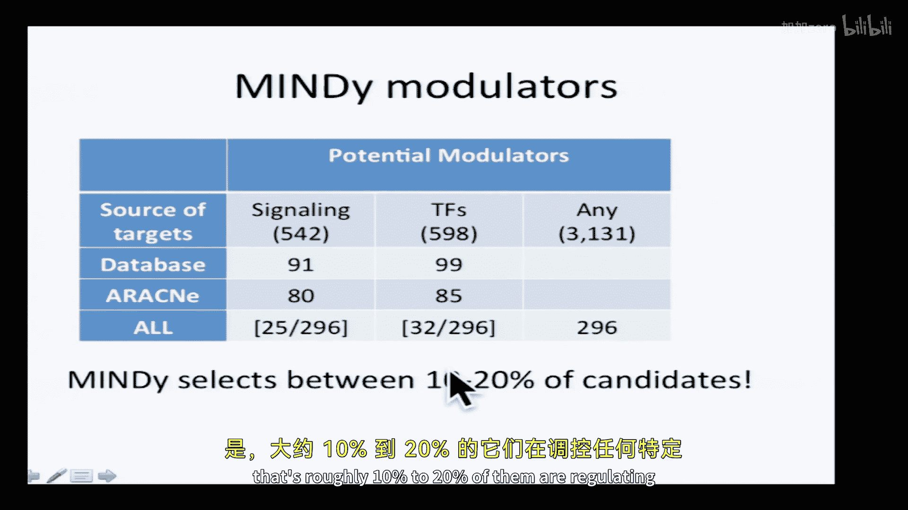

# 【计算与系统生物学基础 7.91J 2014】麻省理工—中英字幕 p15 p14 15. Gene Regulatory Networks -BV1HdzaYAE2a_p15-

The following content is provided under a creative Commons license。

 Your support will help M I T Open Coware continue to offer high quality educational resources for free。

To make a donation or view additional materials from hundreds of MIT courses。

 visit M T OpenCourseware at OCw。 MT。 Eduu。

So you'll recall last time we were working on protein protein interactions。

 We're going to do a little bit to finish that up with a topic that will be a good transition to the study of gene regulatory networks。

And the precise things we're going to discuss today。

 we're going to start off basing networks for protein protein interaction prediction。

 and then we're going get into gene expression data at several different levels。

 we'll talk about some basic questions of how to compare the two expression of vectors for a gene distance metrics。

 we'll talk about how to cluster gene expression data。

 the idea of identifying signatures of sets of genes that might be predictive of some biological property for example。

 a susceptibility to a disease and then we'll talk about a number of different ways that people have developed to try to identify gene regulatory networks that often goes by the name of modules they don't particularly like the name。

 but that's what you'll find in the literature and we're going to focus on a few of these that have recently been compared head to head using both synthetic and real data and we'll see some of the results from that head to head comparison。

So let's just launch into it。 Remember， last time we we had started this unit looking at structural predictions for proteins。

 and we started talking about how to predict protein protein interactions。

 Last time we talked about both computational methods and also experimental data that could give us information about protein protein interactions sensibly measuring direct interactions。

 but we saw that they were possibly very， very high aoids。

 So we needed ways of integrating lots of different kinds of data in a probabilistic framework So we could predict for any pair of proteins。

 what's the probability that they interact， not just the fact that they were detected in one assay or the other。

😊，And we started to talk about Bayesing networks in this context， both useful。

 as we'll see today for predicting protein protein interactions and also for the gene regulatory network problem。

 So the baesing networks are a tool for reason probabilistically， that's their fundamental purpose。

 and we saw that they consisted of a graph， the network。

 and then the probabilitybabilities that represent the probability for each edge。

 the conditional probability tables， and that we can learn these from the data either in a completely objective way where we learn both the structure and the probability or where we impose the structure initially。

 and then we simply learn the probability tables。😊，And we had nodes that represented the variables。

 They could be hidden nodes where we don't know what the true answer is and observe nodes what we do。

 So in our case， we're trying to predict protein protein interactions。

 there's some hidden variable that represents whether protein A and B truly interact。

 We don't know that answer。 But we do know whether that interaction was detected in experiment 1，2。

3 or 4。 Those are the effects。 the observed。 And so we want to reason backwards from the observations to the hidden causes。

All right， so last time we talked about the high throughput experiments that directly were measuring out protein protein interactions。

 We talked about yeast2 hybrid。And affinity capture mass spec here listed as pulldowns。

 and those could be used to predict protein protein interactions by themselves。

 But we want to find out what other kinds of data we could use to amplify these results to give us independent information about whether two proteins interact。

 And one thing you could look at is whether the expression of the two genes that you think might interact are similar。

 So if you look over many， many different conditions。

 you might expect the two proteins that interact with each other would be expressed under similar conditions。

 Certainly， if you saw two proteins that had exactly opposite expression patterns。

 you would be very unlikely to believe that they interacted。

 right So the question is how much is true the other end of the spectrum。

 if things are very highly correlated do they have a high probability of interaction。

 So this graph is a histogram for proteins that are known to interact proteins that were shown in these high through experiments interact and proteins that are known not interact of how similar the expression is and the far right are things that have extremely。

😊，Different expression patterns， a high distance， and we'll talk specifically about what distance is in just a minute。

 but these are very dissimilar expression patterns。 these are very similar ones。

So what do you see from this plot we looked at the last time We saw that the interacting proteins are shifted a bit to the left。

 right， So the interacting ones of a higher probability of。

 of having similar expression patterns than the ones that don't interact。

 But we couldn't draw any cutoff and say everything with this level of expression and similarity is guaranteed to interact。

 right， There's no way to divide these。So this will be useful in a probabilistic setting。

 but by itself， it would not be highly predictive。We also talked about evolutionary patterns。

 and we discussed whether the red or the green patterns here would be more predictive。

 which one was it， Anyone remember how many people thought the red was more predictive。

What do you agree？Right， the greens win。And we talked about the coevolution in other ways。

 So the paper that I think was one of the first to do this really nicely。

 try to predict protein protein instruction patterns using Bayesian networks。

 This is this one from Mark Gerstein's lab。😊，And they start off， as we've talked about previously。

 we need some gold standard interactions where we know two proteins really do interact or don't。

They built they built their gold standard data， the positive trading data they took from a database of called MIps。

 which is a hand curated database that digs into the literature quite deeply to find out whether two proteins interact or not。

 And then the negative data they took were proteins that were identified as being localized to different parts of the cell。

 And this was done in yeast to where there's pretty good data for a lot of proteins to subcellular localization。

So these are the data that went into their prediction。

These were the experiments we've already talked about。

 the affinity capture mass spec and these two hybrid。

 And then the other kinds of data that they used were expression correlation。

 What we just talked about， They also looked at annotations。

 whether proteins had the same annotation for function。And essentiality。 So in yeast。

 it's pretty easy to go through every gene and the genome knock it out and determine whether that kills the cell or not。

 So they can label every gene in yeast as to whether it's essential for survival or not。Okay。

 and you can see here the， the number of interactions that were involved。

 and they decided to break this down to two separate prediction problems。

 So one was an experimental problem。Using the four different large scale data sets and yeast from protein protein interactions to predict expression。

 The other one were these other kinds of data that were less direct。

 And they used slightly different kinds of Bayesian networks。 So for this one。They use a naive be。

 And what's the underlying assumption of the naive bees。

The underlying assumption is that all of data are independent。 And so we looked at this previously。

 We discussed how you can， if you're trying to identify the likelihood ratio and use it to rank things。

 you primarily need to focus on。This term， because this term will be the same for every pair of proteins that you're examining。

 Yes， could you say again whether in a na all data are dependent or in。业子权。Okay。

 so let's actually look at some of their data。 in this table。

 they're looking at the likelihood ratio that two proteins interact based on whether the two proteins are essential。

 One is essential and one is nonesent， or both are non essentialent。

So that's what these two codes here mean。E E， both essential N， N。

 both non essential and any one and the other。 And so they've computed for all those protein pairs。

 How many in their gold standard R E E， How many are Yen， How many are N， N。

So here are the numbers for the EE。 There are just over 1000 out of the 2000。

 roughly 2000 that are EE。 So that comes up with a probability of being essential。

 given that I know that you're positive， you're in the gold standard of roughly 50% right。

 and you can do something similar for the negatives。So these are the ones that definitely don't drag。

 So the probability of both being essential， given thats negative is about 15%，14%。

 And so then the likelihood ratio comes out to。Just under four， right。

 So there's a fourfold increase in probability that something is interacting。

 given that it's essential than the not。And this is the table for all of the terms。

 for all of the different things that they were considering that were not direct experiments。

 And this is essentiality。 This is this expression correlation with various values for the threshold。

 How similar the expression had to be。And these are the terms from the databases for annotation。

And then for each of these， then we get a likelihood ratio of how predictive it is。

 So it's kind of informative to look at some of these numbers。

 So we already saw that essentiality is a pretty weak predict。

 The fact that two genes are essential only gives you a slightly increased chance that they're interacting than not。

 But if two things， two genes have extremely high expression correlation。

 then there are more than 100 fold more likely to interact than not。

And the numbers for the annotations are significantly less than that。Okay。

So this is a naive bay where we're gonna multiply all those probabilities together。 Now。

 for the experimental data， they said， well， these are probably not all independent。

 The probability that you pick something up in one two hybrid experiment is probably how they correlate with the probability that you pick it up in another two hybrid experiment。

 And when hope that there's some correlation between things that are identified in two hybrid and affinity capture mass spec。

 although we'll see whether or not that's the case。

 So they use what they refer to as a fully connected bay。 And what do we mean by that。 Remember。

 this was the naive bay where everything is independent。

 So the probability of some observation is the product of all the individual probabilities。

 But a fully connected base， we don't have that independent assumption。

 So you need to actually explicitly compute what the probability is for an interaction based on all the possible outcomes in those experiments。

😊，So that's not that much harder， we simply have a table now where is these columns represent each of the experimental data types。

 the affinity capture mass spec and the two hybrids ones indicate that it was detected zero is that it's not。

 and then we simply look again in our gold standard and see how often a protein that had been detected in whatever the setting is here in all of them except EO。

 how often was it how many of the gold positives to begin and how many of the gold negatives and then we can compute the probabilities。

Now， it's important to look at some of the numbers in these tables and dig in because you see the numbers here are really。

 really small。 So they have to be interpreted with caution。 So some of the things that， you know。

 might not hold up with much larger data sets。 You might imagine the things that are experimentally detected all of the highid assays would be the most confident。

Right， that doesn't turn out to be the case， right。

 So if these are these are sorted by the log likelihoodly ratio。 and the best one is not 1，1，1。 It's。

 it's up there， but it's not the top of the pack。 And that's probably just statistics of small numbers。

 If the databases were larger， the experiments were larger， it probably would work out that way。Hey。

 so any question about how they formulated this problem as a baesing network or how they implemented it。

Okay。So the results then， so once we have these likelihood ratios。

 we can try to choose a threshold for deciding what we're gonna consider to be a true interaction and not。

 So here they plotted for different likelihood ratio thresholds。On the X axis。

 how many of the true positives you get right versus how many you get wrong。

So the true positive over the false positive。 And you can， you know， arbitrarily decide， okay， well。

 I w to be more get more right than wrong Not of bad weighted side thing。

 So you passing grade here is 50%。 So if I draw a line horizontal line and A want to get more right than wrong。

 you'll see that。😊，Any of the individual signals that they were using， sensity。

Datase annotation and so on。 All of those fall below that。 So individually。

 they predict more wrongs than rights。 But if you combine the data using this a Bayesian network。

 then you can choose a likelihood threshold where you do get more right than wrong。

 And you can set your threshold wherever you want。 Similarlyly for the direct experimental data。

 you do better by combining these are the light pink lines than you would with any of the individual data sets。

So this shows the utility of combining the data and reasoning from the data probabilistically。Okay。

 any questions？So we'll return to Bayesing networks in a bit in the context of designing gene discovering gene regulatory networks。

 So we now want to move to gene expression data。 And the primary reason to be so interesting in gene expression data。

 simply that there's a huge amount of it out there。 So just a short time ago。

 we passed the million mark with a number of expression data sets that have been collected in the databases there's much less of any other kind of high throughput data。

 So if you look at proteomics or high throughput genetic screens。

 there are tiny numbers compared to gene expression data。 So obviously。

 techniques for analyzing gene expression data are going to play in a very important role for a long time to come。

Some of what I'm going to discuss today is covering your textbooks。

 so I encourage you to look at text section 16。2。The fundamental thing that we're interested in doing is seeing how much biological knowledge we can infer from the gene expression data。

 So we might imagine that genes that are coexpressed under particular sets of conditions have functional similarity reflect common regulatory mechanisms and a goal then is to discover those mechanisms。

 So fundamental to this。 Then any time we have a pair of genes。

 And we look at their gene expression data。 We want to decide how similar they are。

 So let's imagine that we had these data for four genes。 And it's time series experiment。

 We're looking at the different expression levels。 And we want some quantitative measure to decide which two genes are most similar。

😊，Well， it turns out this lot more soul than we might think。 right， So at first glance， oh。

 it's pretty obvious that these two are the most similar。

 but it really depends on what kind of similarity you're asking about。So。

We can describe any expression data set for any for any gene as simply a multidisional vector。

Where this is the set of expression values we detected for the first gene across all the different experimental conditions and so on for the second。

 And what would be the most intuitive way of describing the distance between two multidimensional vectors。

 It would simply be Euclidean distance， right， So that's perfectly reasonable。

 So we can decide that the distance between two gene expression data sets is simply the square root of the sum of the squares of the distances。

 So we'll take the sum over all the experimental conditions that we've looked at。

 Maybe it's a time series， maybe it's different perturbations and look at the difference in expression of gene A and gene B in that condition K。

 And then。😊，Valuing this will tell us how similar two genes are in their expression profiles。O， well。

 that's a specific example of a distance metric。 It turns out that there's a formal definition for a distance metric。

Distances have the falling properties。 They're always greater than 0， right。

 We never have negative distances。They're equal to 0 under exactly one condition。

 The two data points are the same。 and they're symmetric， right。

 So the distance from A to B is the same as the distance from B to A。 Now。

 there's also to be a true distance， Then you also have to satisfy the triangle inequality。

 right that the distance from x to Z is less than some of the distance less than or equal to sum of the distances through a third point。

 But it will find out that we don't actually need that for similarity measures。

 So we can have either a true distance metric for comparing gene expression data sets or similarity measures as well。

 so let's go back to the simple example。 So we decided that the red and the blue genes were nearly identical in terms of their distance metrics。

 But that's not always exactly what we care about， right， So in biological settings， frequently。

 the absolute level of gene expression is on some arbitrary scale， certainly with expression rays。

 It was completely arbitrary had to do with fluorsescence properties and how well probes hybridized to each other。

 But even with mRNA， how do we really know that 1000 copies is fundamentally different from 1200 copies of an RNA in the cell。

 We don't， right， So we might be more interested not we might be interested in distance metrics that capture not just the similarity of these two。

 but the fact that these two also quite similar in terms of the the。😊，This。

 the trajectory of the plot to this one， right。So can we come up with measures that capture this as well。

 So a very common one for this is Pearson correlation。So in Pearson correlation。

 we're gonna look at not just the expression of a gene across conditions。

 but we're gonna look at the Z score of that gene。 So we'll take all of the data for particular。

 for all the genes in a particular condition， and we'll compute the Z score by looking at the difference between the expression of a particular gene and the average expression across the whole data set。

 And we're gonna normalize by the standard deviation， yes。😊，Yes， you're right。

 there should be a square there， thank you。So then to compute the Pearson correlation。

 we're going between two genes， A and B， we're going to take the sum overall experiments of the Z score for A and the Z score for B。

 the product of that summed to over the experiments。Okay，And these values， as we'll see in a second。

 we're going range from plus one， which be a perfect correlation to -1。

 which be a perfect anti correlation。And then we're going to define the distance as one minus this value。

 So things that are perfectly correlated then would have。An R of 0， right。

 And things that are anti correlated would have a large one。 Allright。

 so if we take a look at these two， obviously， by Euclidean distance。

 they'd be quite different from each other。 But the Z scores have converted the expression values into disease scores over here。

 you can see that the Z scores， obviously， this one is is the most negative of all the ones and this is the lowest one and all of these。

 This one's the highest and similarly for the red ones， lowest and the highest。

 So the Z scores track very well。 And when I take the product of this， right。

 the signs of the Z score for A and B are always the same。 So when I sum the product of the Z scores。

 I get a large number and the normalization guarantees that it comes out to one。😊。

And so the red and the blue here will have a very high correlation coefficient。 in this case。

 it's going be an R of correlation coefficient of1， whereas compared to this one。

 which is relatively flat， the correlation coefficient will be approximately 0。Any questions on that？

Okay。So what about， say， the blue and the red， Well there Z scores are going to have almost an opposite sign every single time。

 And so that's going to add up to a large negative value。 So for these， they'll be highly anticor。

 So a， which one say a， the blue and the red， have a correlation coefficient of -1。Okay。

 so we have these two different ways of of computing distance measures。

 We can compute the Euclidean distance， which would make the red and the blue the same。

 but treat the the green one as being completely different。 we of the correlation。

 which would group all of these together as being similar。

 What you want to do is going depend on your setting。 If you look at your textbook。

 you'll see a lot of other definitions of distance as well。Now。

 what if if you're missing a particular data point。

 this used to be a lot more of a problem with arrays than it is with with RNA C with arrays。

 you'd often have dirt on the array that it actually would literally cover up spots。

 But you have a bunch of choices。 The most extreme would just be to ignore that row or column of your matrix across all data sets。

 That's usually not what you want to do。 You could put in some arbitrary， small value。

 but frequently we will do what's called imputing。Where we'll try to identify the genes that have most similar expression and replace the value from the missing one with the value from the the ones that we do know。

Allright， distance metrics pretty straightforward。 Now we want to use these distance metrics actually cluster the data And what's the idea here that if we look across enough data sets。

 we might find certain groups of genes that function similarly across all those data sets that might be revealing as to their biological function。

 So this is an example of an unsupervised learning problem。

 We don't know what the classes are before we go in。 We don't even know how many they are。

 We want to learn from the data， This is a very large area of machine learning。

 We're just going scrape the surface。 Some of you may be familiar with the fact that these kinds of machine learning algorithms are used widely outside of biology。

 They're used by Netflix to tell you what movie to choose next or Amazon to try to sell you new products or all the advertisers who send pop up ads on your computer。

😊，OkayBut in our biological setting then we have gene expression data collected possibly over very large numbers of conditions and we want to find groups of genes that have some similarity。

 This is a figure from one of these very early papers that sort of established how people present these data so you'll always see the same kind of presentation typically you'll get a heat map where genes are rows and the different experiments here time。

 but it could be different perturbations are the columns and genes that go up in expression are red and genes that go down in expression are green and apologies to anyone whose colorbling。

 but that's just what the convention has become。😊，Okay， so then y cluster。

 so if we cluster across the rows。That willll get sets of genes that potentially behave that hopefully。

 if we do this properly， behave similarly across different subsets of the experiments。

 and those might represent similar functions。 And if we cluster the columns。

 then we get different experiments that show similar responses。 So that might be in this case。

 different times that are similar。 Hopefully， those are ones that are close to each other。

 But if we had lots of different patients。 as we'll see in a second。

 then might represent patients who have similar version of a disease。And， in fact， you know。

 the calcium genes does work。 So even in this very early paper， they were able to identify a。

A bunch of subsets of genes that showed similar expression of different time points and turned out to be enriched in different categories。

 These ones enriched in cholesterol biosynthesis， whereas these were enriched in wound healing and so on。

Okay，So how do you actually do clustering， This kind of clustering is called hierarchical。

 and it's pretty straightforward。 There are two versions of hierarchical clustering。

There's what's called agglomerative and divisive。In a Gloorative。

 you start off with each data point in its own cluster。

 and then you search for the most similar data point to it。

 and you group those together and you keep doing that iteratively building up larger and larger clusters。

Okay， so we've discussed how to compare individual genes。Right。

 I can you should be able to right now to find， if I give you the vector of expression for a single gene to find the other gene in the data that that's most similar by either say Euclidean or Pearson correlation or what have you。

 But how are gonna once you've group two genes together。

 how do you decide whether third gene is similar to those two。Right。

 so now we have to make some choices。 And so there are a number of different choices that are commonly made。

So let's say these are our data， we've got these two clusters。

Y and Z and each circle represents a data point in those clusters。

 So we've got four genes in each cluster。 Now we wanted to decide in a distance measure to compare cluster Y to cluster Z。

 So what could we do。 So what are some possibilities， What might you do。We take their very。

You take the average  bullet points， right， what else could you do？

Only learned a number of possibilities。Centroid。This so cent， you could take some sort of average。

 right， any other possibilities。They representative from each。

So you could pick a representative right， how would you decide in advance what that would be though。

 so maybe you haveweight， maybe not， and what other possibilities are there？Yeah。

 measure all the distances from the notes and one to all distance to all the notess of the other。

Right， you could do all to all。 What else could you do？You can take the minimum of all those values。

 You can take the maximum of all those values。 And we'll see that all those are things that people do。

 So this clustering， there are already rather。Uninformative terms for some of these kinds of decisions。

 So what's called single linkage is you decide that the distance between two clusters is based on the minimum distance between any member of cluster Y and any member of cluster Z。

Complete linkage takes the maximum distance。And then the extremely unfortunately named unweighted pair group method using centroids。

 U P GM C， I won't try to say that very often， takes the centroid。

 which was an early suggestion from the class and then the U PGM A unweighted pair group method with aromatic mean takes the average of all the distances。

 all suggestions that people have made。 So when would you use one versus the other。 Well， a prior。

 you don't necessarily know， but it's good to know how they'll behave。

 So what do you imagine is going to happen if you use single linkage versus complete linkage。

 remember， single linkage is the minimum distance and complete linkage is the maximum distance。

 So what's gonna happen in this case if I use the minimum distance， which two groups will I combine。

咁。The blue and the red， right， Where if I use the maximum distance。

 then I'll combine the green in the red。 So it's important to recognize them that。

The single linkage has this property of chaining together clusters based on points that are near each other。

 whereas the complete linkage is resistant to grouping things together if they have outliers。

 So they'll behave differently。 Now if your data are compact and you really do know tight clusters。

 it's not going to matter too much what you use， but in most biological settings。

 we're dealing with much noise data， So you actually will get different results based on this。

 And as far as I know， there's no really principled way to figure out if you have no prior knowledge which to use。

You know， all these hierarchical clusterings come with what's called a denogram。

 And you'll see these at the top of all the clustering。

 And this represents the process by which the data were clustered， right。

 So the things that are most similar are most tightly connected in this dengram。

 So these two data points，1 and 2， you have to go up very little in the in the y axis to get from one to 2。

 Whereas if you want to go from one to 16， you have to traverse the entire dengram， right。

 So the distance between two samples is how far vertically you have to go to connect between them。

Now。The good things about this den is you can then understand the clustering of the data so I can cut this dengram at any particular distance and get clearer divisions among my data sets。

 right， So if I cut here at this distance level， Then I have two groups。

 one small one consisting of these data and one large one consisting of these。

 whereas if I cut down here， I have more groups of my data。

 So it doesn't require me in advance to know how many groups I have。

 I can look at the dengram and infer。😊，The one risk is that you always get a dengram that's hierarchical。

 regardless of the data were hierarchical or not。 So it's more reflection of how you did your clustering than any fundamental structure of the data。

 So the fact that you get a hierarchical denogram means really nothing about your data。

 Its simply a tool that you can use is to try to divide it up into different groups。

Any questions on the hierarchical clustering？Yes。But if each data point is its own cluster。

Then haven't you if you want that be consistent across？Like single inches completely。Like。

 why would you cluster？😔，Does that question make sense like if you like。If you cut it down below。

 then how't you minimize？Don't you successively minimize the？でしやすか。すはい。

So if I cut at the lowest level， everybody's their wrong cluster of screw。Right。

 I'm interested in finding out whether they're genes that behave similarly across the data sets or。

Okay， so we'll come to that in a second。 So in hierarch clustering。

 you don't actually have any objective way of doing that。

 We'll see we'll talk about other means right now where it's a little bit clear。 But actually。

 fundamentally， there aren't a lot of good ways of knowing a priority what the right number of clusters is。

 but we'll look at some measures in a second that help。Alright， so hi clustering。

 as your question implies， doesn't really tell you how many clusters there are。

 Another approach is to decide in advance how many clusters you expect and then see whether you can get the data to the group into that number or not。

 And an example of that called K means clustering。 So the nice thing about it is it does give you these sharp divisions。

 But again， if you chose K incorrectly， we'll see in a second。

 you will get you nevertheless still get K clusters。

 So K refers to the number of clusters that you tell the algorithm you expect to get。

 So you specify that in advance。 And then you try to find a set of clusters that minimizes the distance from everybody's assigned to particular cluster and the center of that cluster。

😊，So they're clear。 So that's what these equations represent in the center of the cluster。

 the centroid。 It's just the average coordinates over all the components of that cluster。

 And we're trying to find this set of clusters C that minimizes。

The sum of the square of the distances between each member of that cluster and the centroid。

Any questions on how we're doing this。Okay。All right。

 so what's the actual algorithm that's remarkably simple。

 I choose an initial set of random positions。And then I have a simple loop。

 I repeat until a convergence。For every point， I sign it to the nearest centroid。

 So if my my starting centroids are these circles， I look at every data point and I ask how close it to any one of these。

 That's what the boundaries are， defined by these lines。

 everything above this line belongs to this centroid， everything over here belongs to this centroid。

 I divide the data by which centroid you're closest to。 and I assign you to that centroid。

That's step one。And step 2， I compute new centroids。And that's what these triangles represent。

 So after I did that partitioning， it turns out that most of the things that were assigned to the triangular cluster live over here。

 So the centroid moves and being here to here。And I iterate this process。

That's the entire cameian clustering algorithm。So here's an example where I generated data from three Gaussians。

 I chose initial data points， which are the centoid which are the circles。 I followed that protocol。

 Here's the first step。 It computes new triangles， Second step。And then it converges。

 the distance stops changing。Okay， now， this question has already come up。

 So what happens if you choose the wrong K？ So I believe there are three clusters。 And really。

 that's not the case。 So what's gonna happen。So in this data set。

 there really were- how many there really were five clusters？Here they're clustered correctly。

 What if I told the algorithm to do k means cluster with a K of3。

It would still find a way to come up with three clusters。 So now it's grouped these two things。

 which are clearly generated from different Gaussians together。 It's grouped these two。

 which were generated from different Gaussians together and so on。Allright。

 so there's no K means clustering will do what you tell to do。

 regardless of whether that's the right answer or not。

 And if you tell there are more clusters than you expect then really are there。

 then it'll start chopping up well well defined clusters into sub clusters。

 So here it's split this elongated one into two subcls。

 It split this one arbitarily into two just so it gets the final number that we asked for。

So then how do you know what to do， Well， as I said， you don't， there's no guarantee to know。

 But one thing you can do is make this kind of plot。

 which says for different values of k on the x axis。The sum of the distances within the cluster。

 So the distance to the centroid within each cluster on the y axis。

 And as I increase the number of ks， when I'm correctly purchasing my data。

 when there really are more subgroups than than I've already defined。 then I'll see big drops。

 So I go from saying there are two to three in that case。

 I get a big drop in the distance between members of the cluster right。

 because I'm no longer including a data point over here and in this cluster with a data point in that cluster。

But once I go beyond the correct number， which was 5。

 you see that the benefits really start to trail off。 So there's a inflection point here。

 There's an elbow。 And sometimes it's called an elbow plot。 Theres after I go past the right number。

 I get less and less benefit from each additional clustering。 So this gives us。

The empirical way of choosing an approximately correct value for K。Any questions on Kas？Yes。

K means recapitulate the clusters that you would get if you cut off your dentroogram。

Qu your any answer。Not necessarily。😔，你粒。I don't know。

 it sort of seems to me as if if you pick a level where you have a certain number。

Clus that that's similar， at least you know bycentroid I think because of the way you do。

 you' not even guarantee to have a level where you have exactly the right。Other questions？Yes。

Can just very quickly go over how you initialize where the starting points are and the breakups All right So the question is。

 how do you initialize the starting points， In fact。

 you have to make some arbitrary decisions about how to initialize the starting points。

 So they're usually chosen a random and you will get different results depending on how you do that。

 So that's another。 So when you do this it's nondeterministic in that sense。

 and you often want to initialize multiple times and make sure you get similar results。

 Very good question。 in fact。It was not a setup。 but what happens if you choose pathologically bad initial conditions。

You have the potential to converge to the right answer。

 but you're not guaranteed to converge the right answer。So here's an example where I had。

 I guess there really are three clusters in the data。 I chose ge equal 3。

 but I stuck all my initial coordinates down in the lower right hand corner。

 And then when I do the clustering， if things go well。I get the right answer。

 but we're not guaranteed。But one thing we are is we always get convergence。

So the algorithm will converge because at each step。

 it's either reducing the objective function or it's leaving it the same， right。

 So we're guaranteed convergence， but it may be， as we've seen previously in other settings。

 we may end up with local minimum rather than the global optimum。

 And the way to fix that then would be to initialize again with new。With new starting positions。

Other questions。Okay， what about a setting like this where we've got two well defined clusters in somebody who lives straight in the middle。

 So what's the algorithm going to do。Well， sometimes it'll put it in one side of one cluster。

 and sometimes it'll end up in the other side， right， So an alternative to Kame means clustering。

 which has to make one or the other arbitrary decision。 is something that's called fuzzy Ks。

 which can put something actually literally membership into both clusters。

And it's very similar in its structure of the K means with one important difference。

 which is a membership variable that tells you for every data point how much it belongs to cluster1。

 cluster 2， cluster 3， and so on。So in both algorithms。

 we start off by choosing initial points as the cluster means and looping through each of them。 Now。

 previously， we would make a hard assignment of each data point X sub to a single cluster。And here。

 we're going calculate the probability that each data point belongs to a cluster。

 And that's where you get the fuzziness， because you can have a non unit or non zero probability belonging to any of the clusters。

And now we're going in K means， we recalculated the mean value by just looking at the average of everybody in that cluster。

 right。Now， in fuzz K means we don't have everybody in the cluster because everybody belongs partially to the clusters。

 So we're going take a weighted average。So here are the details of how you do that。

In K means we were minimizing this function， right， we were trying to decide the class structure。

 the class memberships that would minimize the distance of every member of that cluster to the defined centroid of the cluster。

Here it looks almost the same， except we now have this new variable mu， which is the membership。

 It's the membership of point J in cluster I。So I'm trying to minimize a very similar function。

 but now if view is1， if all my mus are 1， then what do I get？😡，K means， right。

 But as soon as the muse are allowed to vary from1， they can be between 0 and1。

 then points can contribute more or less to that point that was stuck in the middle of the two clusters would。

 if it had a mu of 。5 for each， right， would contribute half to each。

 And then both the centroids would move a little bit towards the middle。

So what's the result of k means sorry， fuzzy k means clustering， We still get k clusters。

 but now every gene or every object that we're clustering has a partial membership。

 So here's an example of that where they did k means clustering with these six different clusters。

 but now every profile， every gene has a color associated with it that represents this mu value。

 whether it goes from0 to1 with these rainbow color， So the things that are reddish or pink。

 Those are the high confidence things that are very strongly only in that cluster。

 whereas the things that are more towards the yellow end of the spectrum or partially in this cluster and partially in other clusters。

Questions， any questions？Alright， so K means be defined in terms of Euclidean distance。Right。

 and that has clear advantages in terms of computing things very easily。

 but has some disadvantages as well。 So one of the one of the disadvantages is because we're using the square distance。

 then outliers have a very big effect， right， because I'maring。

 squaring the difference between the vectors。That may not be the worst thing。

 but theyre also restricted to things for which we can compute a centroid。

 We have to have data that are form where you can actually compute the mean value of all the members of the cluster。

 Sometimes we want to cluster things that we only have qualitative data where instead of having a distance measure。

 We have similarity。 This doesn't come off quite as often in certainly doesn't come off in gene expression data or only。

 but you can imagine more qualitative data where you ask people about similarity between different things or behavioral features where you know the similarity between two objects。

 but you have no way of calculating the average object one setting that you might really something have looked at if you're trying to cluster。

 say， sequence motifs that you compute with the E algorithm。 So what's the average sequence motif。

 that doesn't necessarily represent any true object， you might be better you can calculate it。

 but doesn't mean anything。 You might be better off calculating using rather than the average motif。

 The most central of the motif。you actually observe， that would be called a meoid or an exemplar。

 It's a member of your cluster that's closest to the middle。

 even if it's not stack dab in the middle。So instead of kines， we can do thing called kmeoids。

 so in Kines we actually computed a centroid。And meoids will choose the existing data point that's most central。

Okay， so what does that mean？If these are my data， the true mean is somewhere over here。

But this one is the meoid。It's an exemplar that's close to the central point。

 But if there actually isn't anything here。Then there is。

 So we're going to use the thing that's closest。 So these were all sequence motifs。Right。

 rather than using some sequence motif that doesn't exist as the center of your cluster。

 you would use a sequence motif that actually does exist and close to the center。Againu。

 so just a simple variation on the K means。We choose， instead of choosing。

K points in arbitrary space as are starting positions。

 we're going to choose K examples from the data as they're starting meoids。

 and then we're going to place each point in the cluster that has the closest meoid rather than median。

 and then when we do the update step instead of choosing the average position to represent the cluster。

 we'll choose the meoid。The exemplar is closest to the middle。Okay， any questions on this？Yes。这一表。

You lose the guaranteed conversion。They're going to picture a situation where you're so osllating it's now you have discrete staff that's a good question but that's probably right actually I should think about that I'm not sure。

Yeah， that's probably right。Other questions？Okay， there are a lot of other techniques for clustering。

 your textbook talks about self- organizing maps， which were popular at one point quite a lot。

 and there's also a nice technique called affinity propagation which is a little bit outside the scope of this course。

 but has proved quite useful for clustering。Okay， so why bother to do all this clustering， right。

 our goal is to try to find some biological information， not just to find groups of genes。

 So what can you do with these things。 Well， one thing that was identified early on is if I could find sets of genes that behave similarly。

 maybe those could be used in a predictive way to predict outcomes for patients or or some biological function。

 So we're gonna to look at that first， So one of the early papers in this field。

 did clustering a micros for patients who had B cell lymphoma。

 the patients had different kinds of B cell lymphomaas。 And so they did took their data。

 they clustered it again， each row represents a gene and each column represents a patient here。

And with this projector it's a little bit hard to see， but when you look at the node separately。

 you'll be able to see that in the denogram， there's a nice。

 sharp division between two large groups of patients。

 and it turns out that when you look at the pathologist annotations for those patients。

 which was completely independent of the gene expression data。

 all the patients in the left hand group had almost all the patients's left hand group had one kind of lymphoma。

 all the patients in the right hand group had a different kind of lymphoma and this got people very excited because it suggested that pure molecular features might be at least as good as pathological studies。

 So maybe you could completely automate the identification of different tumor types。😊，Now。

 the next thing Ive got people even more excited was the idea that maybe you could actually use these patterns not just to recapitulate what a pathologist would find。

 but go beyond it and actually make predictions for the patients。😊，So in these plots。

 I don't know if we've seen these before yet in the class。

 but on the X axis is survival in the y axis or the fraction of patients in a particular group who survived that long。

And so as the patients die， obviously the curve is dropping down。

 each one of these drops represents the death of a patient or the loss of the patient to the study for other reasons。

 And so in the middle， let's start with this one。 This is what the clinicians would have decided to here patients that they define by clinical standards is being likely to do well versus patients whom they define by clinical standards is likely to do poorly and you can see there is a big difference in the plots for the low clinical risk patients at the top and the high clinical risk patients at the bottom。

 on lefthand side， or what you get when you use purely gene expression data to cluster the patients into groups that you turn out to be high risk or low risk。

 And you can see that you know it's a little bit more statistically significant for the clinical risk。

 but it's pretty good over here too。 Now the really impressive thing is what if you take the patients that the clinicians define as low clinical risk。

And then you look at their gene expression data。 Could you separate out patients in that allegedly low clinical risk who are actually at high risk。

 and maybe then they would be diverted to have more aggressive therapy than patients who really and truly are low risk patients。

 And what theyre able to show with which just barely statistical significance is that even among the clinically defined low risk patients。

 there is based on these gene signatures， the ability to distinguish patients who are going to do better and patients who are going to do worse。

This was over a decade ago and really set of a frenzy of people looking for gene signatures for all sorts of things that might be highly predictive。

Now。The fact that something is correlated doesn't， of course， prove any causality。

 So one of the questions is， if I find a gene signature that is predictive of an outcome in one of these studies。

 can I use then to go backwards and actually define a therapy， right in the ideal setting。

I would have these gene signatures。 I discover that they are clinically associated with outcome。

 I could dig in and discover what makes the patients to do worse， worse and go and treat that。

 So is that the case or not， So let me show you some data from a breast cancer data set。

 Here's a breast cancer data set。 again， the same kind of plot where we've got the survival statistic on the y axis。

 the number of years on the X axis And based on a gene signature。

 this group has defined a group that does better and the group that does worse。

 the P value is significant and the hazard ratio， the fraction the probability of I'm sorry。

 the death rate versus control this is approximately2。Okay。

 so does this lead us to any mechanistic inci to breast cancer？ Well， it turns out in this case。

 the gene signature was defined based on post crial laughter。😊，So。After dinner humor。

Here's a gene set defined that something that has absolutely nothing to do with breast cancer and is predicting the outcome of breast cancer patients。

Which leads to somewhat more of a joke that testing whether laughter really is the best medicine。

Okay， so they went on。 They tried other gene sets。 Here's the data gene set that's not even defined in humans。

 It's the orthologs。Hmelogues of genes that are associated with social defeat and mice。

 And once again。You get really statistically significant P values and good hazard ratios。

So what's going on， Well， these are not from a study that's actually trying to predict outcome in breast cancer。

 It's a study that shows that most gene expression。

 most randomly selected sets of genes in the genome will give an outcome that's correlated a result that's correlated with patient outcome in breast cancer。

Yes。The previous graph， if you just to， what is the black？代。嗯。

So black are people who have the gene set signature who have high levels of the genes that are defined in this gene set and the red are ones who have lower or the other way around。

 but it's defining all patients into two groups based on whether they have a particular level of expression in this gene set。

And then following those patients over time， do they do better or worse。 And similarly。

 for all these plots。Okay。And you had another one， which is a less amusing the location of skin fiberpl。

The the real critical point is this。Here they compared。The probability。

Based on an expectation that all genes are are independent of each other。

 the probability that that that a gene signatures correlated with outcome for genes that were chosen at random or genes that were chosen from a database of gene signatures that people had identified is being associated with pathways。

 And you get a very， very large fraction。 So this is the P value。 So negative log of the P values。

 The negative values are more significant。 A huge fraction of all genes sets that you pull a random from the genome or that you pull from a compendium of known pathways are going be associated with outcome in this breast cancer dataset。

So it's not just well annotated cancer pathways that are associated。

 It's gene sets associated as we've seen with laughter or social defeat in mice and so on。

 All sorts of crazy things that have no mechanistic link to breast cancer。😊。

Let's take a second for that to， to to sink in。 right， I pull genes at random from the genome。

I define patients based on whether they have high levels of expression of the random set of genes or low levels of expression of that random set of genes。

And Im extremely likely to be able to predict the outcome in breast cancer。So。

So that should be rather disturbing， Right， So turns out， before we get to the answer then。

 So this is not unique to breast cancer。 They went through a whole bunch of data sets in the literature。

 Each row is different previously published study where someone。

Claimed were identified as signature for a particular kind of disease or outcome。

And they took their random gene sets and asked how well the random gene sets did in predicting the outcome of these patients。

And so these。These yellow plots represent the probability distribution for the random gene sets。

 again， in this projector。 it's hard to see。 But there is a highlight in the left hand side of where the 5% of the best 5% of the random gene sets are。

 There blue lines， the mere measure of statistical significance。

 It turns out that the few of these studies didn't even reach a normal level of statistical significance。

 let alone comparing to random gene sets。 But for most of these。

 You don't do better than a good fraction of the randomly selected gene sets。So how could this be。

 So it turns out there is an answer to why this happens。 And it's really quite fascinating。

 So here we're using the hazard ratio， which is the death rate for the patients who have the signature over the control group。

 So high hazard ratio means it's very， very associated with outcome。

 And they've plotted that against the correlation of the genes in the gene signature with the expression of a gene called PC and A。

😊，PProliferating cell， nuclear antigen。And it turns out a very， very large fraction of the genome。

It's called expressed。So genes are not expressed like random completely independent random variables。

 There are lots of genes that show very similar expression levels across all the data sets。 Now。

 PC And A is a gene that's been known by pathologists for a long time。

 as having higher levels in the most aggressive tumors。So if a very。

 very large fraction of the genome is co expresseded with PC And A。

 Then high levels of randomly selected genes are gonna be a very good predictor of tumor outcome because high levels of randomly expressed genes also means a very high probability of having a high level of PC A。

 which is。😊，A tumor marker。So we have to proceed with a lot of caution。

 We can find things that are highly correlated with outcome that could have good value in terms of prognostic indicators。

 But there are going to be a lot of possibilities for sets of genes that have that。Property。

 they're good predictors of outcome。 and many of them will have absolutely nothing to do causally。

With the process of the disease。So at the very least。

 it means don't start a drug company over every set of genes if you identify this associated with outcome。

But in the worst case scenario， it also means that those predictions will break down under settings that we haven't yet examined。

And so that's the real fear that you have a gene set signature that you think is highly predictive outcome。

 It's only because you've looked at a particular set of patients。

But you look at a different set of patients and that correlation will break down。

So this is an area of research that's still quite in fluxs in terms of how much utility there will be in identifying gene set signatures in this completely objective way。

 and what we'll see in the course of this lecture and the next one is it's probably going to be much more useful to incorporate other kinds of information thatll constrain us to be more mechanistic。

Any questions？All right， so now we're going to really get into the meat of the identification of gene modules and we're going to try to see how much we can learn about regulatory structure from the gene expression data。

 so we're going to move up from just the pure expression data。

 say these genes at the bottom to try to figure out which set of transcription factors we're driving and maybe what signaling pathways lived upstream of those transcription factors and turn them on and the fundamental difference then between clustering。

 which is what we've been looking at until now， and these modules that people like to call them。

Instead you can have a whole bunch of genes and we've just seen that are correlated with each other without being causally linked to each other。

 So we like to figure out which ones are actually functionally related and not just statistically related。

And the paper that's going to serve as our organizing principle and the rest of this lecture may be bleeding into the next lecture is this paper recently published that's called the Dream5 Challen。

 And this like some of these other challenges that we've seen before is a case where the organizers have data sets where they know the answer to what the regulatory structure is。

 they send out the data， people try to make the best predictions they can and then the unseal the data to let people know how well they did。

 and so you can get a relatively objective view of how well different kinds of approaches work。

So this is the overall structure of this challenge。 They had four different kinds of data。

Three are real data sets from different organisms， E coli， yeast and Staloccal Casauus。

 and then the fourth one the one at the top here is completely synthetic data that they generated and you get a sense of the scale of the data sets to how many genes are involved。

 how many potential regulators in some cases they've given you specific information on knockout its antibiotics。

 toxins that are perturbing and again here the number of conditions that are being looked at the number of rays。

 so then they provide this data in a way that's very hard for the groups that are analyzing the trace it back to particular genes because you don't want people to use external data necessarily to make their predictions。

 So everyone makes their predictions， they also as part of this challenge they actually they made their own meta predictions based on the individual predictions by different groups and we'll take a look at that in a second and then they score how well they did。

Now， we'll get into the details of the scoring a little bit later。

 but what they found at the highest level is that different kinds of methods sort of behaved similarly。

 So the main groups that they found were these regression based techniques。

 we'll talk about that in a second， Bayesian networks。

 which we've already discussed in a different context。A hodgebodge of different kinds of things。

 and then mutual information and correlation。So we're going to look at each of these main categories of prediction methods。

So we're gonna to start with the bas networks， which we just finished talking about in a completely different context here。

 instead of trying to predict whether an interaction is true based on the experimental data。

 we're going to try to predict whether a particular protein is involved in regulating instead of genes based on the expression data。

Allright， so in this context， let's say I I have cancer data sets and I want to decide whether P 53 is activated in those tumors。

 So this is the known pathway for P 53。 So if I told you the pathway。

 how might you figure out if P 53 is active from gene expression data。I tell you this pathway。

 I give you the expression data。What's kind of a simple thing that you could do right away to decide whether you think P3 is active to？

E50th is a transcriptional activator， but should be turning on the genes of its targets when it's on。

 So what's an obvious thing to do？special levels you right， so we could check these special levels。

 the targets compute some simple statistics， right？Okay， well， that could work。 but of course。

 there could be other transcriptional regulators that regulate a similar set of genes。

 So that's not a guarantee that this that P53 is on might be some other transcriptional regulator。

 we could look for the pathways that activate P 53。

 we could ask whether those genes are on right So we've got in this pathway， a bunch of kinases。

 ATM check1 and so on that activate P53。 Now if we had proteomic data。

 we could actually look whether those proteins are phossphorylateulated， but we have much。

 much less proteomic data， and most of these settings will only have gene expression data。

 but you could look at is that gene expressed has the expression of one of these activating proteins going up and you could try to make an inference then from whether if there's more of these activating proteins than maybe P53 is active and therefore it's turning on its targets。

😊，That's one step removed， right， So we just the fact that there's a lot of ATM M around doesn't mean that there's a lot of ATM protein。

 which certainly doesn't mean that the ATM is phosphorylateted and turning on its target。 So， again。

 we don't have a guarantee there。嗯。We could look more specifically whether the genes are differentially expressed。

 right， So the fact that they're on may not be as informative as if they're uniquely on in this tumor and not on in control cells from the same patient。

So that that can be informative。 But again， you know。

 changes in gene expression are not uniquely related to changes in protein levels。

 So we're gonna to have to behave with a bit of caution。 Okay。

 so the first step we're going to take in this direction is to try to build a Bayesian network that's going to give us a way to reason probabilistically over all these kinds of data。

 which by themselves are not great guarantees that we're getting the right answer。

 just like in the protein prediction interaction problem。Right。

 where individually coexpression wasn't all that great。Essentiality wasn't all that great。

 but taken together， they could be quite helpful。 so we want to compute the probability that the P 53 pathway is active。

 given the data。And the only data we're gonna have in this setting is gene expression data。

 So we're gonna assume that for the targets of a transcription factor to be active。

 the transcription factor itself has to be expressed at a higher level。

 that's a restriction of analyzing these kinds of data that's very commonly used。

 So we're gonna try to compute the probability that P 53 is activated given the data。

 So how would I compute the probability that given that some transcription factor is on that I see expression of the target genes。

How would I do this， I could just go into the data and just count in the same way that we did in our previous setting。

 We could just look over all the experiments and tabulate if one of the targets is up in expression。

 how often is the transcription factor that's potentially activating it up and how often are all the possible combination is the case。

And then we could use Bayesian statistics to try to compute the probability that a transcription factor is up activated。

 given that Ive seen the gene expression data。 Is that clear。Good。Alright。

 so we want to try to not include just the downstream factors， because that leads to possibility。

 Maybe there are multiple transcription factors that are equally likely to be driving expression of a set of genes。

 We want to include the upstream regulators as well。

 And so here we're gonna take advantage of one of the properties of basing nets that we looked at explaining away。

You'll remember this example， right， where we decided that if I see that the grass is wet and I know that it's raining。

 then I can consider it less likely that the sprinklers were on。

 even though there's no causal relationship between them。

 So if I see that a set of targets of transcription factor A are on。

 and I have evidence that the pathway upstream of a is on that reduces my inferred probability that transcription factor B is responsible。

 right So that's one of the nice things about Bayesing networks that gives us a way of reasoning automatically over all the data and not just the downstream targets。

😊，And in these Bayesing networks， you can have multiple layers so we can have one transcription factor turning another one。

 turns on another one， we can have as many layers is necessary。

 but the one thing we can't have recycles， so we can't have a transcription factor that's at the bottom of this going back and activating things that are at the top。

 and that's a fundamental limitation of Bayesing networks。Okay。

 we already talked about the fact that in Bay networks with these two problems that we have to solve。

 we have to be able to find the structure。 If we don't know what a priori here。

 we don't know what a prior。 We're gonna have to learn the structure of the network。

 And then with the structure of the network， we have to learn all probabilities。

 So the conditional probability tables that relate each variable to every other one。

And then just two more small points about it， so if I just give you expression data without any interventions。

 just the observations， then I can't decide what is a cause and what is an effect。

So here this was done in the context of proteomics， but the same is true for gene expression data。

 If I have two variables， X and Y that are highly correlated， it could be that x activates Y。

 It could be that Y activates x。But if I pertuurrb the system and I block the activity of one of these two genes or proteins。

 then I can start to tell the difference。 In this case， if you inhibit X。

You don't see any activation of Y that's the yellow wall down here。But if you inhibit Y。

 you see the full range of activity of x。So that implies that X is the activator of y。

 And so in these settings， if you want to learn a Bayesian network from data。

 you need more than just a compendium of gene expression data。

 If you want to get the directions correct， you need perturbations where someone's actually inhibited particular genes or proteins。

Now in a lot of these base networks， we're not going to try and include every possible gene。

 every possible protein， either because we don't have measurements of it or because we need to compact networks。

 so there'll often be cases where the true regulator in some causal chain is missing from our data。

So imagine that this is the true causal chain X activates y， which then activates Z and W。

 But either because we don't have the data on y or because we left it out to make our models more compact。

 it's not in the model。 We can still pick up the relationships between X and Z and X and W。

 but the data will be much noisier because we're missing that information thats right in the conditional probability tables relating X to y and then y to the two targets。

So base networks we've already seen quite a lot。 We now have some idea of how to transfer them from one domain to the domain of gene expression data。

 The next approach I'm going to look at is a regression based approach。

So the regression based approaches are founded on a simple idea。

 which is that the expression of a gene is going to be some function of the expression levels of the regulator。

 and we're going actually try to come up with a formula that relates the activity levels of the transcription factors。

 the activity level of the target。This cartoon， I've got a gene that's all in under one condition。

 It's often some other conditions。 What trans forms it from being off to on is the introduction of more of these transcription factors that are binding to the promoter。

 So in general， I have some predicted level of expression for the gene called the predicted level Y and it's some function unspecified at this point。

 F of G of all the expression levels of the transcription factors that are regulated not gene。

 So just get nomencler straight x subg is gonna to be the expression of gene X。

 I'm sorry Hi expression of gene G。This capital X sub T of G is the set of transcription factors that I believe are regulating that gene。

And then F is an arbitrary function。 And we're gonna have a noise term as well。

 because this is the observed gene expression， not some sort of platonic view of the true gene expression。

 Okay， now， frequently， we'll have a specific function， sort of the simplest one you can imagine。

 which is a linear function。 So the expression of any particular gene is gonna be a linear function。

 A sum of the expression of all of its regulators where each one has associated with it a coefficient beta。

😊，And that beta coefficient tells us how much。Particular regulator influences that gene。 So say。

 you know， P 53 might have a very large value。 Some other transcriptional regulator might have a small value representing their relative influence。

Now， I don't know the beta values in advance。 right。

 So that's one of the things that I need to learn。 So I want to be able to find a setting that tells me what the beta values are for every possible transcription factor。

 If the algorithm sets the beta value to 0， what does that tell me。😊，If the beta value is zero here。

 what does that tell me about that transcriptional regulator？No， no influence， right。

 and the higher the value than the greater the influence。 Okay， so how do we discover these。😊，So the。

 the typical approach then is to come up with some objective function that we're going to try to optimize。

 And an obvious objective function is the difference between the observed expression value for each gene and the expected one based in that linear function。

 And we're going to choose a set of beta parameters that minimize the difference between the observed and the expected。

Minimize the sum of the squares， So the residual sum of the squares error between the predicted and the observed。

So this is a relatively standard regression problem just in a different setting。 Now。

 one of the problems with a standard regression problem is that we'll typically get a lot of very small values of betas。

 So we won't get all zeros and01s， meaning the algorithms 100% certain these or the drivers and these or not。

 We'll get a lot of small values from many， many transcription factors。And okay。

 that could represent the reality。 But the bad thing is that those beta values are going to be unstable。

 So small changes in the training data will give you big changes in which transcription factors have which values。

 So that's not a desirable setting。 So there's a whole field built up around trying to come up with better solutions。

 I've given you some references here。 One of them is to a paper that did well in the dream shows。

 The other one is to a very good textbook elements of statistical learning。

 And there are various techniques that allow you to try to limit the number of betas that are non-zero。

And by doing that， you get more robust predictions at a cost。

 right because there could be a lot of transcription factors that really do have small influences。

But we'll trade that off by getting more accurate predictions than the ones that have the big influences。

K。Are any questions on regression。All right， so the last of the methods that we're examined in this is mutual information。

 we've already seen mutual information in the course。

 so information content is related to the probability of observing some variable in an alphabet right so in most languages。

 the probability of observing letters is quite variable。

 so ease are very common in the English language other letters are less common as anyone who plays Hman or watched game of wheelhe of For knows and we define the entropy as the sum over all possible outcomes of the probability of observing some variable and the information content of that variable we can define the discrete case or in the continuous case。

And the critical thing is the mutual information between two variables。

 So that's the difference between the entropy of those variables independentlyly and then the joint entropy。

So things with the high neutral information means that。

1 variable gives me significant knowledge of what the other variable is doing。

 It reduces my uncertainty。 That's the critical idea。😊，Okay。So we looked at correlation before。

 There can be settings where you have high have very low correlation between two variables。

 but have high mutual information。So consider these two genes， protein A and protein B。

 and the blue dots are a relationship between them。

Can see that there's a lot of information content in these two variables。

 knowing the value of a gives me a high confidence in the value of B。

 but there's no linear relationship that describes these， right。So if I use mutual information。

 I can capture situations like this that I can't capture with correlation。

And these kinds of situations actually occur。 so for example， in a feed forward loop。

So we've got a regulator A。And it directly activates B。It also directly activates C。

 but C inhibits B。So you've got the path on the left hand side。

 sort of pressing the accelerator and the path on the right hand side， pressing the stop p， right。

 that's called an incoherent feed forward loop。 And you can get under different settings。

 different kinds of results where this is one of those examples。

You can get much more complicated behaviors too。 So there are papers that have really mapped out these behaviors across many parameter settings。

 You can get sort of switches in the behavior。 But in a lot of these settings。

 you will have high mutual information between two variables， even if you don't have any correlation。

 linear correlation between them。Okay。So，Well publicized algorithm that uses mutual information to infer gene regulatory networks is called aracne。

They go through and they compute the mutual information between all pairs of genes in their data。

And now one question you have with mutual information is what defines a significant level of neutral information？

So an obvious way to do this to try to figure out what's significant is to do randomizations。

 And so that's what they did。 They shuffled the expression data。

 They compute mutual information among pairs of genes where there isn't actually any。

 There shouldn't be any relationships because the data have been shuffled。

 And then you can decide whether the observed mutual information is significantly greater than what you get from the randomized data。

😊，Now， the other thing that happens with mutual information is that indirect effects still have high degrees of mutual information。

 So let's consider the set of genes that are shown on on this。 So you've got G2。

 which is actually a regulator of G1 and G3。So G2 is going to have high mutual information with G1。

And with G3。RightNow what's it going to mean about G1 and G3？

They're going behave very similarly as well， right。

 So there'll be a high degree of mutual information between。G1 and G3。

So if I just rely on mutual information， I can't tell what's a regulator and what's a fellow at the same level of regulation。

 They're both being affected by something above them。 I can't tell the difference between those two。

 So they use what's called。The data processing inequality where they say， well。

 these regulatory interactions should have higher mutual information than this was just just between two common targets of the same parent。

And so they drop from their network， those things， which are the lower of the three in triangle。

So that was the original rackney algorithm。 and then Aman it a little bit to try to be more specific in terms of the regulators that were being picked up。

 And so they call this this approach Mindy。 And the core idea here is that in addition to the transcription factors。

You might have another protein that turns the transcription factor on or off。

So if I look over different concentrations of the transcription factor。

 different levels of expression of the transcription factor。

I might find that there are some cases where this other protein turns it on other cases where it turns it off。

 So here， if a module considered these two data sets。

Looking at different concentrations of particular transcription factor， different expression levels。

 And in one case， the blue ones， the modulator。Isn't present at all or present at its lowest possible level。

 and in the red case， it's present as a high level。

And you can see that when the modulator is present only at low levels。

 there's no relationship between a target and its transcription factor。

 When the modulator is present a high level， Then there is this linear response of the target to its transcription factor。

 So this modulator seems to be a necessary component。

 So they went through and defined a whole bunch of settings like this。

 and then systematically searched the data for these modulators。

So they start off with the expression data set， genes and rows， experiments and columns。

 they do a set of filtering to remove things that are going to be problematic for the analysis。

They look， for example， for settings where they have start for a list of modulators and transcription factors。

 they move the ones so there isn't enough variation and so on。

And then they examine for every modulator transcription factor pair。

Cases where the modulator is present at its highest level and where it's present at its lowest level。

So when the modulator is present at a high level。Let's say when the modulators present at high level。

 there's high mutual information between the transcription factor and the target。

When the modulator is absent， there's no mutual information。 That's a setting we looked at before。

 right， That would suggest that the modulator is an activator。 It's a positive modulator。

 You could have the opposite situation where when the modulator is present at low levels。

 there's mutual information between a transcription factor and its target。

When the modulator is present at a high level， you don't see anything。

 That would suggest that the modulator is a negative regulator。

 And then there are scenarios where there is either uniformly high information content between a transcription factor target or uniformly low。

 So the modulator doesn't seem to be doing anything。 So they break it down to these categories。

And you can look at all the different categories in their supplemental tables。

 one thing that's kind of interesting is they assume that regardless of how how the transcription factor goes。

 you'll always see an increase in the expression of the target， so there's no saturation。

 which is an unnatural assumption in these data settings。😊，Okay。

 so I think I'll close with this example from their experiment。 And then in the next lecture。

 we'll look at how these different methods far against each other in the dream challenge。

So they specifically want to find regulators of MIC。So here's data for a particular regulator。

 SDK 38， here's the set of expression of tumors where SDK 38 expression is lowest and set of tumors where SDK 38 expression is highest。

And they're sorted by the expression level of M。So the left hand side。

 you see there's no particular relationship between the expression level of M and the targets。

 in the right hand side， there is a relationship between the expression level of M and targets。

 So having apparently， at least at this level of mutual information。

 having higher levels of S T K 38。Cause a relationship to occur。

 That would be an example of an activator。Okay， so this technique has a lot of advantages and allows you to search rapidly over very large data sets to find potential target transcription factor relationships and also potential modulators。

 it has some limitations。One of the key limitations is that the signal has to be present in the expression data set。

 right， So in the case of a protein like P 53， where we know it's activated by ulcers of other processes is phosphorylation or N F Ka B。

 where it's regulated by phosphorylation， you might not get any signal right。

 So there has to be a case where the transcription factor itself is changing the expression。

 It also won't work if the modulator is always highly correlated with its target。

For some other biological reason。 So if the modulator has to be on for other reasons when the target is。

 then you'll never be able to divide the data in this way。嗯。

And one of the other things that I think is problematic with these networks is you get such large networks that they're very hard to interpret。

 So in this case， this is the nearest neighbors of just one node in Iraqney。

 This is the mutual information network of microRNA name modulators that has a quarter of a million interactions。

And in this， in these data sets， often， you end up selecting a very。

 very large fraction of all the potential modulators。

 So of all the candidate transcription factors and modulators。

 it comes up with an answer that roughly 10 to 20% of them are regulating any particular gene。

 which seems awfully high。

Okay， so any questions？On the methods we've seen so far。Okay， so when we come back on Thursday。

 we'll take a look head to head at how these different methods perform on both the synthetic and the real data sets。

