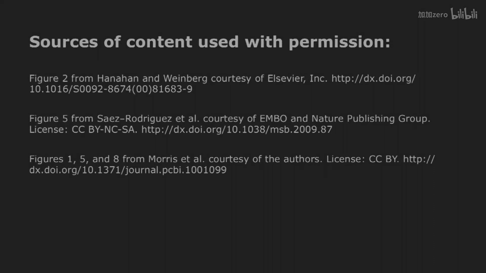

# 【计算与系统生物学基础 7.91J 2014】麻省理工—中英字幕 p17 p16 17. Logic Modeling of Cell Signaling Networks -BV1HdzaYAE2a_p17-

The following content is provided under a creative Commons license。

 Your support will help M I T Open Coware continue to offer high quality educational resources for free。

To make a donation or view additional materials from hundreds of MI T courses。

 visit M T OpenCourseware at OCw。 MT。 Eduu。

So， so we shall start。I haven't had the。Pleasure of meeting most of you。'm Doug Loenberger。

 I'm gratefully invited for a。Gest presentation here。I'll definitely enjoy it。

There should be plenty of time， I'm not racing through a lot of material。

 so feel free to interrupt me with questions and of course I'll try to respond as best I can。Okay。

 who has looked at the background materials that were posted on the Web a long time ago last night。

Whoho's already will admit to having looked at it？Good， all right。

I guess that means I should do this because otherwise if you'd read it already。

 then there would be no point， right？Okay， well， where we are in your semester。

 you're learning a lot of things across the whole spectrum of computational and systems biology。

 I hope I'll add something in here。It's actually a very specific topic。

 We talk about modeling of cell signaling networks。And in particular。

 one approach is worth going through today。 and that's a logic modeling framework。

 So I'll give you a little bit of a conceptual background for the first 10 or 15 minutes。

Then we'll launch into。The particular example。It was in the main paper and a little side light with an application of it to a particular cancer problem。

 and that should take us pretty much to the end okay。Okay， the biological topic here。

Is cell signaling primarily mammalian cells certainly applicable to microbial cells in a simpler sense。

Just to place the。The context。If in mammalian cell biology， I'm a a bioengineer and a cell biologist。

 at the same time， We're very interested in what controls cell behavior， their phenotypic response。

We know that it's， in fact， controlled by what that sees in their environment， growthth factors。

 hormones， Excellular matrix， mechanical forces， cell cell contacts。

A variety of cues in the environment。And。The way these governed phenotype or controlled phenotype is they influence。

 They regulate what I would call the execution processes。

 the crucial execution processes such as gene expression， transcription and translation。R。

Governed by extracellular factors， metabolism， synthesis of new molecules， cytoskeleton。

 motors force generation。 These things all carry out phenotype， governed by the extracellular。

Stimuli or cues， and it happens via these biochemical signaling pathways that are activated primarily by cell surface receptors in the plasma membrane。

 cascades of biochemical reactions， mostly enzymatic， some protein protein docking。

Mostly post translational modifications， kinase phosphate。

Reactions adding and taking off phosphate groups that change protein activities。

 locations and so forth。Could be other types of post translational modifications。

 could be second messengers， calcium， ATP ACces and so forth。So。The extracellular。

I don't know my batterys dead。 That's not good。 Oh there we go。

 Excellular stimuli generate the signals。They regulate gene expression， metabolism， cytoskeleton。

 They carry out phenotype。Okay。So。We want to learn about cell signaling network operations。

There's actually multiple pathways involved。 We really need to study many of them in concert to understand what the cells are doing。

 And a big question is， what kind of information do we need to study this。And then the end。

 we'd be interested in how phenotypic behavior does arise from variations in mutations in the genomic content of cells。

But that genomic content， of course， is modified。 It's not modified， but it。

 but its effects are influenced by what's in the environment to these extracellular cus。

 ligans and so forth。So they influence what message is expressed from that message。

 they influence what's actually translated into protein， from those proteins。

 they influence the post translationlational modifications and what the proteins are actually doing。

And so in the end， the phenotype is carried out by these protein operations。

 And the question is what information level we might want to study。And， of course， you。

 you would love to have the information content at all levels。 genomic information。

 transcriptional information， translational information， post translational information。So。

 so integrating all those different data levels can be extremely valuable in terms of the models I'm going to talk about today。

 they've essentially been living at the level of。Protein activities in these signaling pathways。

 Okay， that will be the kind of data sets you'll see that will be analyzed with respect to the models。

 Obviously， they arise from these underlying mechanisms that as influenced by the environmental context alter the the signaling protein activities。

Okay， and there's what's very interesting。 And there's going to be more and more progress on in the coming years。

Is relating what's in the genomic information， mutations and variations to what's happening at the protein level and some of the other instructors in this class are really some of the world's expert in figuring out how to do this。

 I' like to just show this example as a motivation for this kind of approach。And that is。

 if you do gene sequencing of many patient tumors， in this case。

 I believe this was a paper on pancreatic tumors。 this has been shown for pretty much every other type of tumor since then in any given patient tumor。

 each one of these bars， there's dozens of mutations。In each tumor and a variety of types， deletions。

 amplifications， mutations。 And by and large， they are all different。

There's very few mutations themselves that really carry over to a substantial proportion of one patient's tumor to another。

 There's some special cases that are fairly pervasive。

 but the predominant of these dozens and dozens of mutations and variations are different from one patient tumor one patient to another。

 even in the same patient。So what's emerging as a productive way to think about this。 How do。

 how do all these different。Types of mutations and specific mutations actually lead to classes of similar pathologies。

 And that is， they tend to reside in what can be。Identified as pathways。Circuits， machines。

 things that are actually carrying out function at the protein level。 So， for instance。

And losing this again， for these pancreatic cancers on this wheel are about a dozen different signaling pathways and cell cycle controlled pathways and apoptosis controlled pathways。

And if you look at any individual patient tumors like this green one or this red one。

 two different patients， if you actually look at the mutations at the genomic level。

 theyre entirely different in the green patient tumor versus the red patient tumor。

 so if you're just trying to match gene mutation to pancreatic cancer。

 these two patients would look entirely different。But it turns out that you can line up their mutations into the same pathways and say。

 okay， the red tumor and the green tumor both have mutations that affect the TGF beta pathway。

 They're different mutations， but they've dysregulated that pathway。 And similarly。

 you can do that with pretty much all of the other mutations that these tumor has been dysregulated。

In terms of particular pathways。But patient to patient to patient。

 it's happened by different genomic gene sequence mutations。

So that the ability to look at these protein level pathways is a way of making really good productive sense out of the of the gene sequencing data。

 So there's lots of labs trying to go from。Gene sequence up to pathway modulation。 In our case。

 I'm not going to。We're not going to show you that here。

 We're going to say this is a motivation for starting at the protein level。

And I'd like to show this picture， too。 numberumb one， because it's so such an anachronism。This is a。

 a circuit board from decades and decades and decades ago that none of you would recognize。

But in the molecular biology world， this kind of a picture。

And in this modern form is viewed as a very appealing metaphor for how to think about these signalling pathways and signaling networks that take the extracellular information and turn it into governance of transcription metabolism。

 cytoskeleton and phenotype So just this metaphor of circuitry were in white。

 the extracellular ligans， growth factors are somehow wired to the blue， cell surface receptors。

 herB， for instance， they're wired to kinases and other signaling proteins。

 they're wired to transcription factors， cell cycle control regulators， apoptosis regulators。

And so these very famous folks in cancer biology say what you've got to understand is these signaling networks as circuitry。

And if it's circuitry dysregulated， somehow the wiring is different。

 then that's what's underlying malignant behavior。So this is really beautiful， but it's， it's。

 it's pretty much useless， right， because there's no prediction or calculation or even hypothesis generation one can do from a picture like this。

 yes， it's circuitry。 But， but， but what do I do with it。😊。

So what I want to show you today are efforts to turn them into what I would call an actionable model。

 a computable model， yes， it looks kind of like circuitry。

 but in fact you would know how to do a calculation that would fit it to data and predict new data and then you have。

 in fact a model rather than a metaphor。That's the idea。So one question is。

 if you want to turn that into a formal mathematical。Framework。

For circuitry that you could calculate， what kind of mathematics might you use。 And in this class。

 you're learning a， a whole spectrum of things。And。

One can think of on one hand if we knew all of those components and how they interacted。

And could estimate rate constants and so forth。 We could write differential equations for maybe the dozens and dozens of components and interactions and predict how they would play out dynamically with time。

For most systems with a complexity that's really controlling cell biology， at this point in time。

 this is almost impossible。 There's only rare cases where enough is known about signaling biochemistry to really write down。

Differential equations for what's going on。At the other extreme， of course。

 is the type of mathematics1 gets out of very， very large data sets， sequencing data sets。

 transcriptional and so forth。 more informatics type of analysis where it has to do with multivariate regression and clustering。

Mutual information。And。What we've been working on is someplace up in the middle where you don't have enough mechanistic prior knowledge。

To write this formal of physics and yet takes you someplace beyond statistical associations。

 And this is so one of the areas that might be worth your learning in this class。Okay。

 this is really the same set of computational methods。

 just like it cast in a little bit different form that delineates。

Competation modeling really into two kinds of。Classes。

What's traditionally appreciated in most fields of engineering and physics are differential equations that are very theory driven。

 You have a theory。 You have prior knowledge for what's happening。

 You're writing down the components involved。 You're writing down how they interact。And typically。

 algebraic equations， those differential equations。Describe your theory。

 Describe your prior knowledge。 And now it's formalized and you estimate rate constant and so forth。

Another whole class of information is data driven in which you really don't have a good theory about what components matter and how they interact。

And so you start with data sets， and from it， you do classification or topologies or associations with different types of mathematics。

That at least try to make sense and get hypotheses out of these large data sets where you don't have any theory。

One reason that logic modeling。Appeals to me is that actually can be applied in either the theory driven or the data driven mode。

You can say， I know nothing about my system。 I just generate large data sets of signaling network activities induced by different stimuli。

 but I'm going to try to fit a logic model to it that says how the different components influencing each other in a logic way。

Or you can say， well， I know something， I have some prior knowledge。

 I may have interactomes that say what what molecular components are present in signaling networks。

And so in principle， I kind of know who's involved and who might be influencing whom。

 And I could write a logic model based on that prior knowledge。

And then run calculations and see if it actually makes predictions about experimental data。

 So that's one nice thing。 It's， it's， it's a mathematical formalism that can either be run in data driven mode or in theory driven mode and go back and forth。

 So， so that's one reason。😊，Given one lecture to offer， I've decided to offer it on this topic。

Alright， with me so far。 Any， any questions。Philosophy。Okay， so。What we're gonna do today is。Almost。

Take a hybrid of these two。 We're going to say， what prior knowledge do we have。

And then recognize that it's really not enough。And so how do we know？

Integrate that with empirical data to now come up with logic modeling that， in fact。

 is actionable and and computable。Okay， so what， what kind of prior knowledge do we have。

Let's say we wanted to have a logic model for what's in these signaling networks downstream of growth factor receptors or hormone receptors or things like that that then govern。

Gene expression， metabolism， and so forth。What， what， what prior knowledge do we have And you folks。

Probably I've already seen some of this in the class。It's all kinds of databases of stuff。

 What's in those databases that might be relevant here。tein proteinin interactions。

 just wish proteins interact interact with each other。

 but maybe not necessarily what pathways they're in。Okay， good and have you seen databases like that？

呃三部问。Okay。Are you the only one who's seen them because there was anybody else to kind of notice them in passing too？

Okay， good， second， third， fourth， all right。It's a critical massify were selling。Okay， so I。

 I'm just going to。To allude to those。 So there are。Pathway databases。

 And this is actually an old slide of a few years ago。 So I'm sure the numbers are all different。

 And in fact， there's new ones I just haven't taken updating the slide。But will， based on literature。

 take certain numbers of gene products， a few hundreds of them and organize them into pathways based on biological knowledge。

There's other databases that are more interactomes。

 usually based on other kinds of experimental data， yeast2 hybrid， mass spectrometry。

 literature curation that。Also tries to say who's physically interacting。 So these node。

 these pathway databases don't necessarily say somebody's physically interacting。

 They say somebody might be upstream and downstream and so forth。

And then the Interome databases say component A and component B。

 there's some evidence that they have a physical association someplace along the way。

 so these are two complementary types of databases that in fact can be put together。Okay。

 so an interesting thing about these。There's， there's a number of these databases。

 And so in principle， you could say， well， if I want then to start。

 if I want to generate a logic model for signaling networks。

All I have to do is take what's in the database and say what pathways are there and what's known with their interactions。

 And now I've got a starting point。You， I can actually draw a graph with lots of molecular nodes and lots of molecular interactions。

So， so you can do that。 And so you can choose one of these databases and say。

 I'm going to draw a graph that has the what's believed to be true about nodes and pathways and interactions and signaling networks。

But then you choose a different database and another database。

 and you'll actually get different information。Okay， we actually did a study on this。

 I probably should have given you the citation of that that said if you look at6 or seven of these databases。

 they are not coincident。 They have very small intersections。 Most of their data。

 most of their information is non redundant。And so you could try to put it all together。

 And we did this again in this paper that that I'm not giving you citation for。

And so here's a number of nodes and signaling pathways downstream of， of。

Of receptors and all the colored nodes are those in which they appear in only one of these，1，2，3，4，5。

 six databases。So if something's colored green。It's only in genego。

 and it's not in any of the others。 If somethings colored purple。

 it's in panther and none of the others。Okay。If they're gray， some of these gray ones。

 they're in at least two。But out of these six， there's an exceedingly small number of nodes and interactions at every in all six databases。

 which is， which was a real surprise to us when we did this。😊。

So what this means is if you want to start with some prior knowledge。

Graph that you're now going to fit a logic model to by mapping it against data。

You first even have the choice。 Well， what I'm going to start with， what is my prior knowledge。

 There's not really consensus prior knowledge。So you can start with six different interaction graphs。

Or you can try to put them all together。 You get a consensus graph。 So you have all these choices。

 And right now， it's not as if there's detailed analysis of what the best choice would make would be for your。

 for your starting point。No， but I want to stress that。With respect to our approach。

 this is a starting point because。One of the issues with these， the database information is。

It's typically very diverse with respect to context。 Okay。

 what cell type did this information come from， What treatment conditions did it come from。

If theres different cell types， different species， different mutations。

 So if I see interactions or I don't see interactions。Are they in conflict or they just。

 this one was in an o lymphocyte。 This one was in a hepatocyte。 This one was in a cardiac myosocyte。

 and they're actually different。Okay， so if I had a cell type specific database or pulled that information out。

 that would be good be a smaller number of things。 But then under what treatment conditions because remember I said starting with the genomic content。

 what you actually see in terms of molecular interactions will be very strongly affected by what matrix where the cells growing on or was this in vivo。

 was this in a multicellular culture situation。So that's why this is a starting point and can't really be used to describe any any particular experimental situation with much confidence。

The other thing， and this is what I've been trying to emphasize from the start is there's no calculation you can do on this theres。

A field there's， there's a group of folks in this， in this field。

Who propose some ideas that I think are very intriguing。But which at least to me， personally。

 there's not that much evidence for。 And that is that there's。

Topological characteristics of these graphs。That then tell you what's important。

 So if I have a node that's somehow connected to more other nodes。

 that is going to be a more important node and might be associated with a disease versus a node that's connected to fewer。

O， some of these are very， very appealing ideas conceptually。 If you actually look for the。

Experimental evidence that their， that theirre valid notions， it's very thin。But that's。

 that's where some folks would claim， oh， you can do predictions on the hypotheses based on these graphs because there are these graph theory characteristics that somehow might be biologically meaningful。

Okay， but I'd say jury's out on whether， in fact， any of that is true。So。Our view is， okay。

 this is a good starting point， but， in fact， needs to be mapped to empirical data in order to gain confidence about calculations you can do。

So， that's the。That's the goal of this kind of approach is to say let's。

Let's stipulate that we start with some prior knowledge scaffold。

 This particular one is from the ingenuity database。 You could get one from any other database。

 You could get a consensus one from3 or 4， if you want。And so it has up here， extracellular stimuli。

 growth factors， cytokines， they're connected in their interactome。To receptors。

 they're connected to scaffolding proteins and signaling proteins and kinases and so forth。

They're connected to transcription factors， metabolic enzymes。 So you can draw this graph。

 say this might be what's going on in my cell。And then what we'd like to do is to turn this into a formal logic framework。

That's capable of then fitting experimental data， predicting new experimental data and giving you a chance at biological hypothesis and testing。

Alright， so conceptually， you get it。Two aspects， some kind of starting prior knowledge。

And that's kind of a scaffold graph for your network。

 and now you're going to turn it into a computable logic model by mapping it against empirical data。

So。Merely what it takes is the kind of conceptual diagram you see in any cell biology paper。

 any signaling paper that says， well， A and B both influence E positively and B influences F negatively and C influences F positively。

 and there's a feedback from G to A， that's inhibitory， you can draw those。

But now how do you turn it into a computable algorithm？

So what I'm going to spend most of the on is just conversion of this to， a Boolean logic model。

That any one of these interactions is and A and B being active makes E active， C being active。

 but B not being active allows F to be active and so forth。

 You turn these into formal logic statements that you can compute on at the very end。

 if we have time I'll show you how to relax this from a Boolean framework that's just on off to something that can be a more quantitative。

Allright， so that's the notion。 Now， what I'm going to do for the rest of the time。

Is go through a specific example paper that says， okay， how do we， how do we， in fact， do this。

 What is， what is a way to accomplish this。So now let's go back to a biological problem where there's going to be empirical experimental data that we're now going map against one of these prior knowledge interactome graphs。

This particular study， this was done with Peter Soer， who's now at Harvard Medical School。

Had to do with liver cells， liver cancer。 youll see some application of that at the end。

That's as we have liver cells， hepatocytes。And we want to know how they respond to different growth factors and cytokines in their environment。

 how that'll change their proliferation or death or the inflammatory cytokines that they produce。

And we'd like to take this is just a pictorial diagram that could be in any cell biology paper and make this cctable so we could say what's different from a primary normal hepatocyte liver cell that's not cancerous。

 it might have a signaling logic。But then if we compare the signaling logic to a liver tumor cell type or four different liver tumor cell types。

 what's different if we can find some logic that's different for the tumor cell lines versus the normal primary lines。

 some logic from here to there or there to there， that now tells you biologically where the differences might be that have arisen from the genetic mutations。

And where good drug targets might be or predictions， if I intervened here。

If there's no difference in that logic between normal and tumor， then that won't have any effect。

I want to look for the places where there is a difference in the signaling logic。

 and that would be a better drug target。Okay， so the measurements are made in across 17 of these different signals。

Signing molecules here pretty much all by measurement of a phosphorylation state。

 So if you've done cell biology or biochemistry and these signaling pathways。

 many of the activities in these kinds of pathways that regulate this kind of cell behavior。

A kinases that end up affecting transcription factor activities and so forth。

 And it's the phosphorylation state of any of these proteins that matters。 If。

 If a phosphate is on some particular amino acid。The enzyme might be active if it's not。

 there it might be inactive and so forth。 So just measurement of phosphorylation states of 17 different proteins in these pathways distributed across multiple pathways。

It's going to be've made these measurements on five different cell types for tumor cell types and the primaries in order to try to see what's different between primary and tumor。

And then what might be different patient to patient。

In response to seven different extracellular stimuli， some of them growth factors。

 some of them cytokines， some of them actually bacterial metabolic products。

 we all know about the effects of microbiome these days。

And to further populate a database that might be capable of helping validate a model。

 a number of seven， in fact。Intercellular inhibitors， a small molecule， these things in black。

 one that might inhibit this kase。 One might inhibit that kase。 One might inhibit that kindase。

 So now you add all those inhibitors， too。Then you start to change the network activities and the。

And the downstream behavior。So that's how extensive the data is。

 And this is actually for a few different cell， a few different time points。

So the data looks something like this。 Let me， let's focus on the one on the left。

 This is just the primary normal human cells came from a liver donor。Okay。

 each row is one of the 17 different signals， essentially measurement of the phosphorylation state of A K T or Creb or P 53 or Stat 3。

Okay， so measurements of its phosphorylation state that has something to do with its signaling activity。

Each of the big columns are the seven different treatments。

 the different growth factors and cytokines and so forth。And a control， no stimulation。

And within each one of these treatments， then。Which in each one of these stimuli。

 then there's seven different inhibitors that were used for the different pathways。So，7。

Stimuli by 7 inhibitors， plus controls， and then three different time points， sort of 0。

30 minutes and  three hours。 So the data looks something like this。

If there's really no change due to the stimulation or the inhibitor， you'll see something in gray。

 So these gray bars is there was already phosphorylation of this transcription factor C June。

 and it didn't really change under most treatments。If it was yellow。

What it meant was whatever the treatment was， you got a quick activation of that signal。

 and then it went away。If it's late， purple， then it didn't happen in the first half hour。

 but it started to show up a few hours later， and if it's green。

 it showed up in the first half hour and it stays sustained。 so that's what the color means。

 but this is the real experimental data。And over here on the right is one of the tumor cell lines。

 And you can just see by inspection， it's different， right。

 The colors here are different from the colors there， all the same treatments， stimuli inhibitors。

Colls are very different。 You know， therefore， that the signaling activities are very different。Okay。

 just by visual inspection。Okay， so what we're going try to do is build logic model for this。

 a logic model for this。 compareare them and say， where are the key differences in how the signaling pathways are getting activated downstream of the same stimuli。

So we start with our prior knowledge， this is from the ingenuity database。嗯。

Which actually happened to be missing。Even basic information about insulin signaling。

 So we just added our own information about what the insulin receptor does。

Its kind of hard to believe。 This， This is a database that cost a lot of money。

 and they didn't have really much information about insulin receptor signaling。 Very strange。嗯。

So downstream of our 7 stimuli down to the transcription factors of interest。

 There are about 82 molecular nodes and 100 some edges that you would pull out of the ingenuity database。

 So here's our starting guess at what this looks like。There's no logic in here。

 but this is just potentially the things that the logic might operate on downstream of stimuli and when inhibited and so forth。

All right， so here's the process。 This was the， the actual algorithmic process that I'll walk you through。

On the left hand side is the computer part。 It said， okay， from the ingenuity database。

 we had this prior knowledge about who was upstream， downstream， who affected whom。

We stripped this down some because in terms of the measurements and the perturbations。

 there were some of the nodes that you just would not be able to see any measurable difference。

 there was no stimulus upstream or no perturbation that would， and it was not measured。

 So you wouldn wouldn't be able to tell if it change it or not。 So you just take those out。

Of everything remaining。 now， you don't know the logic。 You know the potential。 And so you say， well。

 of all the node and interactions remaining， I could have an gates。 I could have ore gates。

They could have knots。 And you say， okay， in principle， I could have then many， many， many， many。

 many different。Logic models。That that could work。 So how do I know which one， Well。

 now you skip over to the other side and say， well， but we have all this experimental data。

 We have the data from all the different stimuli and all the different inhibitors for any given cell type。

 And so。We have that data under all these different conditions。

 And what we're going to do is just run。Hundreds or thousands of these， potentially。

Appropriate models。Compare them to the data of whether any given note is activated or not activated under treatment conditions。

 stimuli inhibitors， and we'll calculate the error。

 How good was any of one of those models at actually matching those data。Simple as that。

And then it was a matter of finding what are the best fit ones from the best fit ones。

 could you improve them and make them fit even better， and in the end there。

 how did you go from an initial prior mountain knowledge scaffold to something that in fact fit the data really well from which you can make new predictions。

Okay， so you get the。Get the approach here。All right， good。Now。

 in terms of figuring out how well any given model matches the data and how to go through model selection。

 there's a myriad different。Approaches to this。 And I'm not claiming that what we did was the absolute best approach。

There's alternatives to it that one could consider and perhaps could work even better。

If you read the paper， you'll read the reasons for these choices。so I'll let you do that。

The way the model quality was calculated was to have an objective function。That said。

 we want to minimize some number theta。And how do we calculate theta， Well， first of all。

 for whatever that model is， we're gonna fit。Whether the model says some node should be on or off。

One or zero， and we're going to compare it to the experimental data。Now， the experimental data。

 I need to emphasize， isn't one or 0。 It's normalized to go between  one and 0。

 but the actual measurement might be 0。7 or 0。25。So you're going to have error against the Boolean model。

Even if all the edges are absolutely correct， you're still gonna get some quantitative。

 some quantitative error。So you calculate that。 The Boolean model says 0 or1。

 The experimental data says 0。25，0。7。 And you say， okay， calculate that。But then， you might think。

Alright， Well， somehow I've got to penalize bigger models with more nodes and more edges。

 because surely the more nodes and edges I put in。I could capture more of the data。 and。

 and I don't want to make the model infinitely large just to get the best fit。

 So I need to penalize that。turns out it's not true， but nonetheless， it's worth doing。

 So you take a parameter。 that's the size of the model。 It's basically just the number of nodes。

 the more nodes in it， the more you would be suspicious of the model for just fitting because it has too many components。

And you multiply that size by a penalty。Parameter alpha。So， so you have a bad objective function。

 If there's a lot of air with the data or if your model is too big。

A better model would be better fit to the data and smaller。That''s the calculation。Okay。

 and in the end， and I'm gonna show you how we did this。What。

 and I think the field is now really believing this。

 that what you're not after is a single best fit model。

That what one single model that gives you the very smallest data， because honestly。

 within the uncertainty of the experimental data。Okay， there's。

A substantial number of models that could。啊。Fit the data within that noise。

 So if you demanded the single best one， you say， well。

 but these other 50 actually fit it almost as good And within the uncertainty of the data。

 how can you really reject them， And you can't。 So so in the end。

 what's being striven forward most in most of the field is。A family of models。

 And then you see what the consensus is and the differences in with within that family。

The particular algorithm for generating and running through different potential models。

 because you just can't exhaustively sample all of them。 Okay， that's this this。

These networks are so large that you can't exhaustively test all possibilities of all their logic and and so forth。

 It's really prohibitive。So there's many different ways you can go about it。 This particular method。

 maybe you've already learned this in class for other other applications as a genetic algorithm。

 So you start with some population， you start with your ingenuity scaffold， and then you randomly。

Remove or take edges and things like that so that if you've got a whole family。

 that's slightly different。For each one of them， you evaluate the objective function against the data。

And you get some of those that then are the most attractive， they seem to be the best fit。

But by no means， would you imagine they are yet optimal。

 So now you create a next generation from this population by。You know， the the analog of genetics。

 some of the very best。 you say， okay， they're gonna survive。 I'm just gonna take them as is。

 I'm gonna I'm gonna mutate I'm gonna have a probability of mutating an edge here there kind of cross over actually mating between one model and another model so that the daughter model gets some of the arcs from the mother model and some of the arcs from the father model。

 So you just generate an next population， do it again。 And once you've reached a set of models that。

Fit your data within the criterion that you want。 Then you say， this is now my population。

 And these these are now my best fit models。 So it's not exhaustive。 You can find local。

 You can definitely find local minimum here。 There's no question about that， yeah。えきです。

Best model into the next round Yeah， that's the elite survival。Yeah， if you don't incorporate that。

 you might lose the best ones in any given round。 But this ensures you take the best。Subpsset。

 let them go forward。When I get stuck in like。Yes， yes， absolutely so now you run this with。

A number of different starting populations。 And you see if you get to similar consensus models。 Yeah。

 because absolutely， this will， this does not guarantee any kind of a global minimum。

YouYou will always get local。So， you have to。Conditioned on a different set of initial populations。

Okay， once you do this。I'm gonna show you some results first and then dig into some of the ways to think about it。

 So it's plotted here。 This is one of the tumor cell lines。What's plotted here is again。

 all the rows are all the signals that were measured。

 all the big columns are all this different stimuli and all the little columns are the different inhibitors。

And I should point out， this is only for the 30 minute data。 this isn't for the three hour or both。

 this is just the 30 minute data。And。Basically， where there's green。

 the model and data fit was was considered okay， where it's red， it's not okay where it's pink。

 it's less bad， so by the shade in the yellow， actually the model really couldn't make a prediction。

Now， why that's the case is what's shown up here is just the initial ingenuity scaffold。

 the very best one that didn't add or or remove any arcs or nodes from the ingenuity prior knowledge。

 said all we're gonna to do is just run the best fit Boolean logic model we can on that。

And it wasn't very good。 It was about 45% error， about 45， almost half of the nodes， it got wrong。

So what that tells you is if you just take a scaffold from one of these interactiveum databases。

And without adulterating it， just fit the best logic model of some data。Okay， at least in this case。

 and we've done a number of others， it actually doesn't fit very well。And the reasons being。

 you're trying to fit this now to a very specific biological context。

Hyippatticocyte tumor cells under these growth factor and cytokine treatments。

That network is likely very different from whatever aggregate you got from literature curation and so forth in a database。

 There's going to be a lot of stuff in the database that's。Not applicable。

Because it came from a different cell type， a different condition。

 or there just wasn't enough experiments in the in the literature for hepatocytes。

 Maybe it was never measured under treatment with interferon gamma。

 So there's data here that the database never had access to literature that had explored。

 So lots of reasons。Now， when you go through the process that we just talked about， and in the end。

 the best fit models give you something like less than 10% errors。

 So less than 10% of these squares are red or pink。Okay。

 so that's the kind of improvement that you can take by generating an improved model by adding and subtracting arcs and。

And nodes。So。So this is what the model looks like in the end for this tumor cell line。

 And this is a consensus model from the 20 or so best fit。And so the thickness of a line is。

How strong the consensus was， the strongest would be all 20 had it。And the point here being。

You see some purple。And I wish my pen wasn't fading in and out， if anybody has a point。

 I'll be happy to have it。Where you see purple。Those were arcs that't weren't in the ingenuity database and had to be put in to get the data fit this well。

And it turns out if you actually go back to the literature， you find that those purple arcs can。

Were already described in the literature It's just that they weren't captured in that database。嗯。

Then there's。Well， that's， that's green and and purple。 Then you see some blue and。They are。

 they were in some of the other tumor cell types， but not in this particular hep G2s。 But。

 but so you can， you can generate a model that works very well and see that it's consistent with much of literature。

 It's more stripped down than what's in the databases。 And there's some new things in it that。

 in fact， if e baacheal literature， you can find。 because they just weren't captured in the database。

All right， a few insights about the analysis。So I want to show you here is。The objective function。

 How well the model fit， And that's in red。Okay， and in blue is the actual fit to the experimental data。

 And again， the higher it is， the worse it is。 And the green gives you essentially the size。

 And this is plotted against the size penalty。And what's very interesting is even for very small size penalties。

 almost negligible。That the size of the model。That turns out to be best fit is substantially smaller than what was in the database。

Okay， you actually generate a small model immediately， a smaller model immediately。

 even without any size penalty。So your intuition that a bigger model was going to be better。

Actually turns out to be incorrect that even without a size penalty， the model strips down。

 And why is that。Why is that， let me make that question number two， just to see who's still awake。

Why am fitting this sepaticocyte data？Would a model that leaves out a lot of stuff in an ingenuity database。

That's presumably going on， actually fit the data better。A smaller model fits better， why is that？

Yeah。Well， you have。あです是。Maybe on。The strength of the interactions aren't really taken into。And so。

The moving things out。Essentially means that you're not seal，ing。Yeah。

' that's essentially it I think you've。You've cast it in an almost quantitative term。

 but I think it's true， even in qualitative terms。And one way to think about it is， let's say。

 let's say I have an extra arc or extra node。 Okay， I might capture some more true positives。

 I might actually capture more of my data。But I could， actually， now。呃。

Gain more conflicts with my data。 because now I've put in logic。That， yes。

 it captures this measurement， but now maybe it messes up these other two or three measurements。

So you actually make you can make your model worse trying to capture some small piece that， in fact。

 adversely influences the the effects on the other measurements。So get you get false positives。

 false negatives along with anything that's true and it just so happens that in these kind of situations those can outweigh that of course。

 as you increase the size penalty， you can drive your model to be even smaller。

 fewer arcs and now that of course does come at the expense of not fitting in the data better okay。

So we decided that the size penalty best lived was where it was large enough to ensure stripping down of nonesential nodes and arcs。

 but not large enough to start compromising the actual experimental fit。Okay。

 and so that lived someplace around there。Okay， an important thing。

 And this goes back to the consensus model。 If you think about quote， model identification。

 can you uniquely specify。One model， a best fit model。 You really can't。

 What's plotted here is for any of the arcs that would end up in a model or let's say we。

 let's say we numbered them from  one to。 I think it was 1 13 in the first place。One arc。

 another arc， another arc， another arc， you can say。

 how frequently did they end up in the best fit models？Basically。

 only a small proportion of them were in all the best fit models， some of them， were in some of them。

 some models and some not。Of course， the。The， the higher， the tolerance， the more air you allowed。

 Now you started to get models that all fit to within whatever that criteria was that had most of their arcs weren't the same。

 You could have a lot of different network structures that give you that same fit。

If you require a very， very tiny fit compared to air， something like this。

 then more of the arcs in the models had to be in common。Okay， so that makes some sense。 But。

 but you can't really completely identify a unique model that goes to what I said before。Okay。

 I' was talking before about trade offs between false positives， false negatives， you must know。

 I'm sure from previous things in this class， they receiver operating characteristic curves。

 where for your model parameter choices，You say， what are my results in terms of false positives versus true positives？

And you're trying to find the optimal location along this type of path。And so what's shown here is。

That the the best predictive model， in fact， is the one where we have the size penalty to be right on the edge of not making the experimental data fit worse。

 but still strips out the most arcs。 So again， that demonstrates that the smaller model actually is is is。

 in fact， better in terms of finding this type of。And this shows if we actually put in some more arcs that tried to capture some more data。

 Yes， we decrease the false negatives。 But， in fact， we increase the false positives。

 We actually shift ourselves on this curve。😊，And so you decide whether that's desirable or not where you'd like to live。

 So you can analyze。What you like about your best fit class of models in， in this kind of。

 in this kind of way。Okay， so now let's， we we have some confidence in this。

 What are you going to do with it。 And one thing Id like to do is just make a priority predictions。

Say， I now believe that on these hepatocytes or tumor cells。Stimulated with these kind of things。

 I can calculate what the experimental signaling activities should be。All right。

 let's see if we can do that a priority。 so let's now use new inhibitors。

That hadn't been used before。Combination of inhibitors， especially in cancer。

 people always interested in combinatorial drugs。 experimentally。

 it's prohibitive to run through all possible combinations。

 So this is one thing in the pharmaceutical field。 people believe these kind of models are really useful for。

 Let's try all possible drug combinations and see which ones are most promising。😊。

And instead of just one ligan growth factor， cytokkin at a time， do different combinations。

 So this is all an entirely new data set。 So different treatments that are different combinations。

 different inhibitors， different combinations of inhibitors。And now you just run the model。

 It's not trained on this。 It was trained on the previous data。

 Now a priority predicts this data set。 And now， again， you look for the model fit in the bottom。

 And again， you want the smallest number of red and pink boxes。And in fact。

 it predicted to within about 11% error， about 11% of the boxes。Didn't fit well， but 89% did。

 And that's， in fact， pretty close to the 9% that was on the original training model。

So in terms of this。In this realm of studies， these a priority treatment conditions。

 drug combinations， growth factor， cytokine combinations。This is a pretty good validation。

That this model wasn't just kind of trained and fit that， in fact。

 could predict then what was happening in these pathways。And then， of course。

 what it allows you to do where all the red boxes are， It says， okay。

 that's where we need more intensive study。 Now， maybe we go back to the literature and say。

 is there more known about those nodes than was captured in our。

Whatever our interactum databases that we started with。

IfWe need to supplement the scaffold with more information that's out in the literature or more more dedicated experiments are done。

 So it， it narrows down where the next set of investigations need to be。

 whether from the literature or from yourself。Okay。A sort of， well。

So this is just then some biological results。 If you do this for the different four different hepanoscellular lines。

Some of them some of the signaling activities are the same， and some are different。嗯。

I think I'll skip that。W。All right， let me show this， so this says。

Where are the similarities and differences between the normal hepatocytes versus the tumor lines。

 because this is where you would want to get the ideas for where the right drugs would be。

 Where is the logic different。Between a normal liver cell and one of these transformed types。

So this is the same kind of scaffold， again it the consensus models and the thickness of the line is how strong what proportion of the models did that Arc show up in along the best。

If it's black。The arc was in。The primary hepatocytes and all the cell lines。

 So black is just sort of consensus core。 This is just invariably there。啊。

The blue was in the models for the primary hepatocytes， but for some reason。

 didn't exist in the tumor cell lines。 So it was signaling logic that normal hepatocytes use that the tumor cell lines have somehow lost。

Red are arcs that weren't in the primary cells， but showed up in the tumor cell lines。

 So it was logic that the normal liver cells apparently didn't use。

But now showed up in the tumor cell lines。And why would there be these differences while this is where it goes back to then。

 the genetic mutations and variations。Because going from a primary to some tumor cell line。

 there's enough of the。Genetic mutations that， in this case said， okay。

 I've got some genetic mutation that。Interrupts the link between map 3， kinase and I K K。

 There's some docking protein or something that's now missing， not expressed as highly。

 It's got a mutation of amino acids。 no longer your docs right， has a lower enzymatic activity。

 So now you can go back and trace。 Can I find some genetic mutation that has to do with the loss of that arc。

Or if I've got a red arc that shows up， I can say， there was something in my genetic mutations。

That now adds。An activity here that wasn't there。 Maybe something is now consively active。

 Maybe something is just expressed at a higher level。 And all of sudden。

 that pathway comes into play。So that's the cool thing。

 You could trace what's actually in the genetic mutations。 If you have。

 have some methodology for that to what's actually been altered in the network logic， yeah。Yes。Yeah。

 so they're from donors， but they're mainly like。You know， motorcycle accident donors。

That that don't need their liver anymore。 but the liver was fine。So yeah， they。

 they're from healthy donors。Yeah， yeah， those lines at some point came from a tumor and had been propagated in culture。

Okay， why do I want to got a little bit more time？Let me do this。 Okay。

 so here's another interesting thing that can happen。If you take these models seriously。

 it can tell you something about the biochemistry， perhaps what's going on。嗯。So， so see there's。

 there's this dashed line here that I want to emphasize and we'll emphasize it again another slide。

That was one that had to be added。 It just wasn't in the ingenuity pathway， scaffold。

Actually couldn't find it in any literature anywhere。 But nonetheless。

 you needed it to fit some data。So， so we kind of kept our eye on that one。

 What the heck is going on here。 this dashed line from Icapappa kinase up to Stat 3。 No evidence for。

That signaling linkage in the literature anywhere。What could that tell you？All right， well。

 you go back to the data now and you say， well， what of the data set of the experimental measurements that we made？

Cause that arc to have to be there to fit the data well。 Okay， you can now ask that kind of question。

Well， remember， I said there in the data set were inhibitors。

 Some small molecule inhibitors against this kindness or that kindness or that kindness that would perturb the network and then give us relationships that the logic model had to account for。

Well， this one had to be there mainly to account for data that came from an inhibitor of IKK that one of the kinases that we had a small molecule inhibited for inhibited this kinase。

And somehow， there turned out to be an effect on Stat 3 phosphorylation。

And so you needed that arc to be there。So， so either the explanation that either there's in factect some real mechanism going on here might have been transcriptional that somehow the activity of this kinase affects the levels of expression and the responsiveness of Sta 3。

 or you say， a。Maybe it's a problem with the drug。 It's a problem with the inhibitor that， in fact。

 what you thought was an inhibitor that just affected this kinase。

Has an off target effect on that kinase。It's just an artifact。thinkThat's an alternative explanation。

All right， so that's the sort of thing you can test， and we did test it。

And here's the data here at the bottom is the kinase that you wanted the inhibition to。

 and in the blue was the inhibitor that was actually used in the study。Both in Vi and in vitro。

 and it inhibited that kinase。But then we looked at the potential off target effect on that other。

 the jack 2 Stat 3。 And it also did have activity on that。 So it meant that that inhibitor。

Had an effect not just on the IKK， but also on the junk Jacktatt3。

And so that's why that Rca to be there。Is because， in fact。

 that inhibitor inhibited this kinase as well。 So if we took that into account in terms of the algorithm。

 then we wouldn't have to have that arc because it was spurious and came from the artifact of that inhibitor。

But the interesting thing is that by taking the model seriously， we could actually find that。Okay。

 because it was not previously known that this inhibitor had an off target effect on that kinase。And。

 in fact， the interesting thing， pharmacologically。Was that this kinase that was aimed to be。

An inhibitor against this small molecule that was aimed to be an inhibitor against this kinase。

Was the best by far in treating long airway inflammation compared against a whole other set of other types of inhibitors for the same kinase。

So now the reason might be is it's better because it's also hitting this other kinase that this off target effect actually is therapeutic。

 therapeutically efficacious。 and， in fact， a combination of drugs against this kinase and the other kinase is what's required for the the therapeutic benefit。

 So that's something that could be explored。 And， and that's the sort of thickness model leads to。😊。

嗯。Okay， let me。Let me end by。Digging into this difference a little bit， because I said。

You see these differences between primary hepatocytes and the tumor cell lines。

And the model said just from examining the data sets， that the logic is different。Okay。

 is there any validation for that。Well， so let's go back and look at those differences with respect to literature。

 So if you just blow up that part。Of the model， there's8 edges that are strongly disparate between the primary normal cell types and the tumor cells。

 And they're all enumerated here，1，2，3，4，5，6，7，8。And they're essentially in。

 in three different pathways。So what the model is telling you is that there's three different pathways。

That are substantially different between a normal liver cell and a liver tumor cell。开。So is there。

 is there any evidence that this is。Really true。So let's look at one on this pathway that I've got differences。

 and you see blue here and red here。嗯。It says that this particular signaling node in normal cells is activated by this pathway in the tumors。

 that regulation is lost and it actually comes through another pathway。And。

Turns out this is consistent with， with literature that that， in fact， in the tumor cells。

 you get a higher activity of this。Downstream node， and now I've lost my light again， this HSP 27。

Even though even though it's overexpressed， you get less activation because this pathway is less strongly activated in red than than the blue pathway is。

 So if you went by gene expression， you'd think in the tumor cells。

 this is a higher activated pathway。 turns out the logic is different。

 and actually get less activated of it because it's coming from a different pathway。

 So that turns out to be true in the liver tumor literature。Another1。

 I find this one really interesting。That in normal liver cells to activate this IKK pathway。

 that's a very important kinase pathway governing the transcription factor N of Kappa B in a primary cell。

 I need this combined logic。Between a pathway downstream of insulin receptor and a pathway downstream of a cytokine。

 only if both those pathways are on， do I now turn this on。In the tumor cells， that check is lost。

 Only one pathway is required。Okay， if this one is activated。

 I'm gonna get this transcription factor activated。

 I don't have to wait for simultaneous activation of this pathway。 Where a normal says I have to。

Okay， that turns out to be true that in the liver cells。

 the progression is associated with looser regulation of these， of this transcription factor。

And one more， I won't go into into too much detail。 But again。

 you see reds and blues here that in the tumor cell lines。

 you've now got activities a downstream of insulin。

 that's normally just a survival factor that's just not found in the primary cells。 And that。

 in fact， is shown in the literature too， that insulin signaling shifts from metabolism to proliferation。

It's mainly metabolic stimulus in the normal cells。

 It turns into a pliferative stimulus in the tumor cells。Okay。

 so what this says is just by mapping this logic scaffold， the scaffold against empirical data。

 developing a logic model， you in fact， can find loci of differences between the normal cell signaling logic and tumor cell signaling logic for which there's evidence in the literature none of which was in the original databases。

Finally，' just going to say here that。Turns out in another study。

 what you could show is those three pathways。That the model predicts are the differences between the liver tumor cells and the normal that in order to kill these these liver tumor cells。

 you need inhibitors against all three pathways simultaneously。

 You actually need combination drugs of three different pathway inhibitors。To kill these cells。

 And it's exactly the three pathways that the model predicted of the differences between the normals and the tumor cells。

Okay， allright， so I， I will end here and then see if there's any more questions。

Something that comes up a lot is。There's discomfort with Boolean logic because it's 0，1。 It's off on。

 And， of course， we know biology， biochemistry doesn't work that way。

 And so there can be so many artifacts， so many places that you can get things wrong because you trying to fit a model where the。

Where the measurement is supposed to be either 01。 And you measuring comparing against a measurement that might be 0 point。

6， well， 0。6， is that closer to 1， Is it closer to 0。

 Is there some normalization that would shift it from one to the other。

 And instead of being a correct fit， it's now an incorrect fit。

 So you can see the room for artifacts by mapping quantitative data against a qualitative model。

So one thing done more recently is， is to admit that and say， well， let's just relax this a bit。

 And instead of having step functions from off to on。That they're more graded。

 it's like a analog transfer function。So you've essentially done is add one more parameter to every node to every gate because with Boolean logic。

 there's essentially one hidden parameter that's where you shift from off to on， right。

 There's some location of the of the level of the signal。That you decide is zero or1。

So there's some parameter that you shift from saying it's off to on。Well， here now in this formalism。

 there's that。 But there's also then the slope of shifting from off to on。 Is it still fairly steep。

 Is it really mild， Is it someplace in between。Okay， and this can go with and and orig gateates， too。

 Now， instead of just one dimension， one component being off to on or on to off。

 Now youve got and and orig gateates that have these slopes as well。So what this means is。

You require more data to fit this。 We call it a constrained， fuzzy logic model because you've got。

 if I've got 50 nodes in my system。 I've got got 50 more parameters。 I've got to fit。Okay。

 so that requires more data。 What's the benefit of it is now your predictions are。

Your predictions now， in fact， can be quantitative。 So you can go into the model and say。

 here's a transcription factor， crreb。I'm going to predict its phosphorylation state and its transcriptional activity。

 perhaps based on the activities of two upstream kinases。

 And so if I had an inhibitor for one of these kinases or another。

 how much would I shift the phosphorylation of this transcription factor。😊。

And what you actually see is these gradual curves that if I start to inhibit Mac， okay。

 it gradually changes the phosphorylation of crib。 Or if I inhibit the activity of P 38。

 it even more gradually affects the activity of crib。

 So we can turn these into quantitative predictions of strong effects， weak effects。 And again。

 look at drug combinations。 So that's the advantage of going to this more analog transfer function logic model。

 you can deal with quantification much better but at the cost of requiring more data。😊，Okay。

 I think I'll leave it here。 It's about 3，15。 And so if there's more questions we can。

Take about any aspect of this。 Most of you have stayed awake。 I think that's， that's a good thing。

Okay， more questions。For here， when you have the model for like for example， you case story。

Like it seems like it may not be as easy to back out the original data that led to that specific model。

 for example， you showed that one part was from this one treatment。

 but because you trained the model in this data set and it's not you know deterministic and what。

I agree， that's a great question。😊，So， so let's say there's， let's say there's new arcs that you add。

 Okay， that weren't in your original scaffold。 I mean。

 that's what you got the biggest questions from。 If you， if you delete one， you say。

 it's easy to to believe why you would delete one。Any arc that you add to get a better fit。

 I think you've got to ask questions about。So in all those cases。

 where there arcs that were added that LED to a better fit model。

 the first thing we did was go to the literature。 So， okay， is there literature on。

Some effect of this node to that node。And it's just that it wasn't that literature wasn't curated into that database or something like that。

And most of the time， we could find it there。Okay， so then there was the cases。

 and this was the most prominent one。Where from some added inarchrc。

 we just couldn't find it in literature。 In this particular case。

 it was very easy to trace it to this particular effect of this inhibitor。嗯。

I would say there's no reason to believe that that's always going to be the case。

 I don't have another example to show you that where it was hard or everything else we actually found in the literature。

But you can imagine having some new art that you really couldn't find in the literature。

 And there's no artifactual explanation for it。 And now how do you trace it back to what the data was that might give you a more nuanced hintt。

 It's a great question。 I don't really know how we'll do that。

 I think we and other practitioners who use this。 I'm sure we'll run into it at some point。

It's it's a great。Great challenge to be thinking about。Yeah。I have missed this。

I was wondering does this modeling？Does this model actually？Is this model actually able？

Heerogeneity of a tu， for example。the population。Hrogene。That's also a really interesting question。

Let me try to show something here。Yeah。So， so two things。One is。

What's shown here is this is the four different tumor cells that we did。And。What's shown in color is。

The arcs for each one of them。 So yellow， orange， brown， red。 So some places。

 you see all four of those colors there in some places， only two or one。

 It says if I had four different tumor types， there's some slight differences in logic among them。

You could translate to that as， well， I could imagine then having a tumor。

 that's a mixture of subtypes。 And how would I discern that。One possible idea。

That's attractive to me， although we didn't really explore this in any formal way。

 We didn't really have the means to make experimental measurements on the tumor heterogeneity at the time。

Is when you get to a set of consensus models。Right。

 so let's say you get the 50 best fit models and you say some a is in。80% of them。

 But it's not in 20% of them。Is it possible that that represents some of the heterogeneity because you're getting an average of different subtypes。

I don't know。 Sometimes that appeals to me as potentially valid。

 Sometimes I think there's a flaw on that reasoning， because just because you get a。Average。

 that's not then as strong。 Does that necessarily reflect a subpopulation。I don't know。

So what we do know is we can see differences when there are differences。How you actually see them。

 then if all you have is average data。Maybe it's reflected in the heterogeneity of the consensus models。

 maybe not。Itd be an interesting thing to explore。Where else。All right， all set， thanks。

