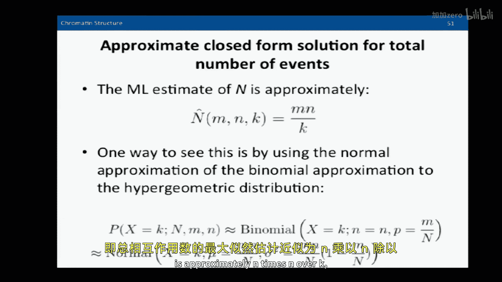

# 【计算与系统生物学基础 7.91J 2014】麻省理工—中英字幕 p18 p17 18. Analysis of Chromatin Structure -BV1HdzaYAE2a_p18-

The following content is provided under a creative Commons license。

 Your support will help M I T Open Coseware continue to offer high quality educational resources for free。

To make a donation or view additional materials from hundreds of MIT courses。

 visit M T OpenCourseware at OCw。 MT。 Eduu。

All right， well， good afternoon and welcome back。We have an exciting fun filled program for you this afternoon。

 I'm David Gifford， I'm delighted to be back with you again。Hear in computational systems biology。

 today we're going to talk about chromat in structure and how we can analyze it。

And to give you the narrative arc for our。Discussion today。

 we're first going to begin with looking at computational methods that we can break the quote unquote。

 code。That describes the epigenome。Now， epigenetic state is extraordinarily important。

 and one way you can visualize this is that the genome is like a hotel filled with lots of different rooms。

 and a lot of the doors are locked。And some of the doors are unlocked and only in the doors that we can go into where the genome is open and accessible。

Can there actually be work done， regulation performed？Transcripts and proteins made。

 So we're going to talk about how to actually analyze epigenetic state。

And then we're going to talk about how to use epigenetic information to understand the entire regulatory occupancy of the genome。

We've already talked about Chipsse。And the idea that we can understand where individual regulators sit on the genome and how they regulate proximal genes。

We're now going to see if we can learn more about the genome， how its state。

 whether it's opened or closed， is itself regulated and answer a puzzle。The puzzle is。

If there are hundreds of thousands of possible binding locations that are equally good for a regulator。

Why are only tens of thousands occupied and how were those sites picked。

Because that level of regulations is extraordinarily important to establish a baseal level of what genes are accessible and operating。

And finally， we're going to talk about how we can。Map which regulatory regions in the genome are。😡。

Affecting which genes。It turns out that。About one third of the regulatory sites in the genome skip over a gene that's closest to them to regulate a gene that's farther away。

And given this is a a million genomes。 And so given that rough approximation。

 how is it that we could make connections between regulatory sites and the genes that they control。

Now， in computational systems of biology， we always talk a lot about biology。

 but we also need to reflect upon the computational methods that we're bringing to bear on these questions。

 And so today， we're going to be talking about three different methods。

 We'll talk about dynamic Bayesian networks as a way to approach understanding the histone code。

We'll talk about how to classify factor binding using log likelihood ratios。And finally。

 we'll turn to our friend， the Hygemetric distribution to analyze which locations in the genome are interacting with one another。

So， let's begin with。Establishing a vocabulary。 I'm sure some of you have seen this before。

 This is the way that chromatin can be thought of being organized at different levels。

 There's the primary DNA sequence。Which can include methylated CGs。That's， you know， cystisteine。

 phosphate guanine。 And the nice thing about that is that。啊。It's symmetrical， so that。

When you have a CPG， a methyl transferase during DNA replication can copy that methyl mark over。

 so it's a mark that's heritable。The next level down are hisone tails on the amino terminus of hisones。

H3 and H4 different chemical modifications can be made， and they serve as signpost， as we'll see。

 to give us clues about what's going on in the genome in that proximal location。嗯。

The next level down is whether or not the chromatin is compacted or not。Whether it's open or closed。

 and that relates to whether or not DNA binding proteins are actually on the genome。 And finally。

 certain domains of the genome can be associated with the nuclear laminina。

And so there are different levels of organization of chromatin。

And we'll be exploring all of these today。So。A way that the cartoon version of the way that。

The genome is organized is that。At the top， we have a transcribed gene。

 And you can see that there's an enhancer that is interacting with the RNA polymerase 2 start site。

And you can see various histone marks that are associated with this activated gene。

There are also marks that are associated with that active enhancer。Down below。

 you see an inactive gene。 and you can see that there's a boundary element that's bound by CT TCF。

 which one of its functions is to serve as a genomic insulator。

 which insulates the effect of the enhancer above from the gene below。

So through careful biochemical analysis over the years， these different marks have。Then。I。

Analyzized and characterized。And a general paradigm for understanding how the marks。

Transition as genes are activated， is shown here。So genes that are fairly active and cycle between active and inactive states。

Typically have high CPG content in their promoters and transition is shown on the left。

 where in the repress date on the bottom， they're marked by H3 K27 trimmyl marks。When they're poised。

 they have both H3K4 trimethyl and H3 K2s of trimethyl。And when they're active。

They only have H3 K4 trimethyl。And on the right hand side are genes that are less active。

So in their completely shut down state， they may have no marks， but the DNA is methylated。

 silencing that region of the genome。And other marks then culminating in H3 K4 trimethyl once again when they become active at the top。

So I'm summarizing for you here。Decades of research in histone marks。And it has been summarized。

And figures like this。Where you can look at。Different classes of genetic elements。

 whether they be promoters in frontal genes， gene bodies themselves， enhancers。

 or the large scale repression of the genome。 And you can look at the associated marks with those characteristic elements。

Okay， so。How could we learn de novo， that is。You can memorize。 And， of course。

 it's important to understand， for example， if you want to look for active enhancers in the genome that looking for things like H 3 K4 monoethyl and H 3 K 7。

27 X marks together would give you a good clue where the enhancers are in the genome that are active。

But if we want to learn all this de novo without having to memorize it or rely upon the literature。

The great thing is that there's a lot of data out there now that characterizes or profiles all of these marks of genome wide in a variety of cellular states。

And there's the Egenome roadmap initiative to look at this in hundreds of different cell types。So。

What is the histone code， That is， how can we unravel the。

Different marks present in the genome and understand what they mean because the genome doesn't come ready made with those little cute labels that we had on it。

 enhance our gene body and so forth。So somehow， if we want to understand the grammar of the genome and its function。

 we're to need to be able to annotate it。Hopefully， with computational help。

So here is a picture of what typical data looks like along the genome。Obviously。

 you can't read any of the legends on the left hand side。

 If you want to look at the slides that are posted on stellarar， you can see the actual marks。

But the reason I post this is because you can see the little pink thing at the top。

 That's where the RNA transcript has been mapped to the genome。The actual annotated genes are above。

And then down below， you can see a whole collection of hisone marks and other kinds of chromomton information that have been mapped to the genome and spatially create patterns that are suggestive of the function of the genomic elements if they're properly interpreted and below。

 you see in blue， the binding of different TFs。As determined by chipse。So。

What we would like to do then， is to。Take this kind of information and automatically learn or automatically annotate the genome as to its functional elements。

Let me stop here and ask， how many people have seen。His stone mark information before。Okay。

And how many people have used it in their research。Not to a couple people。Okay。So it's。

 it's getting quite easy to collect and。There are a couple of ways of analyzing this kind of data。

AGome wide。One way。Is that we could run a hidden Markov model over these data。

And predict states at regular intervals， for example。

 every 200 bases down the genome and see how the HMM transition from state to state and let the states suggest what the underlying genome elements were doing。

Another way is to use a dynamic Bayesian network。So a dynamic Bayesian network is simply a Bayessian network。

 We've talked about those before。And it bottles data sampled along the genome。

 And so it's a directed acyclic graph。There are tools out there that allow us to learn these models directly。

And。It allows us， as we'll see， to analyze the genome at high resolution and to handle missing data。

So we'll be talking about Segway， which is a particular dynamic Bayesian network that takes the kind of data we saw on the slide before and essentially pars it into labels。

That allow us to assign function to different genomic elements。

And it does this in an unsupervised way。 What I mean by that is that it is automatically learning。

The states。And then afterwards， we can look at the states and assign meaning to them。

So here is the dynamic Bsian network that Segway uses。

And let me explain this somewhat scary looking diagram of lots of little boxes and pointers to you。

The genome is described through the variables on the bottom。

 the observation variables going from left to right。

 where each base is a separate observation variable。

 which consists of the level of a particular histote mark at a particular base position。

As described by map reads to that location。The little square box。

 the little box that says x on it with the other small print you can't read is simply an indicator of whether or not the data is present。

If the data is absent， we don't try and model it。 if it's a box contains a0， we don't model the data。

 If the box is one， then we attempt to model the data。

And the most important part of the dynamic Bayesian network is the。Q boxes above。

 where those are the states， and each state describes an ensemble of different histo marks that are output。

And so the key thing is that for each state， we learn what marks its outputting。

And the model learns this automatically through a learning phase。

The boxes above simply are a counter。And the counter allows us to define。

Maximum lengths for particular states。 So states don't run on forever。

So unlike a hidden Markoff model that doesn't have that kind of control。

 we can adjust how long we want the states to last。So this model。

 if you turned it 90 degrees and rotated it clockwise。

Would be more familiar to you because it would be all the arrows would be flowing from the top of the screen down。

 There are no cycles in this directed acyclic graph。And therefore。

 it can be probabilistic viewed and learned in the same framework that we learn a Bayesian network。

 In fact， it is a Bayesian network。The reason it's called dynamic is because we are learning temporal information。

 or in this case， spatial information。With these different observations along the bottom of the model。

Now， before I go on， perhaps somebody could ask me a question about the details of these dynamic bees networks。

 because the ability to automatically assign labels to genome function。

 given the histone marks is really a key thing that's going on the last couple of years， yes。

He reexclaimed that。But to label the second。SureSo the Q label。Is。Right here， these labels。

And each one of these Q labels defines one of a number of states。 For example，24 different states。

In a given state。Describes the expected output in terms of what histo marks are present in that state。

So it's going to describe the means of all those different histto marks，24 different means。

 let's say， of the marks that's going to output。And the job of fitting the model is picking the right states or a set of 24 states。

 each of which is most descriptive of its particular subset of chromatton marks。

And then defining how we transition between states。So we not only need to define。

What a state means in terms of the marks that it outputs。

 But also when we transition from one state to another。Does that make sense to you？Sts。

The information that's held in each of the queue boxes is at a series of probabilities。Or is it。

Something elseIt's actually a discrete number， right， So it actually is a single。

 there's only a single state in each Q box。 So it might be a number for between 1 and 24 that we're going to learn。

And based upon that number， we're going to have a description of the marks that we would expect to see at the observation。

At that particular genomic location。And so our job here is to learn those 24 different states and what they output。

In the trainee phase。And then once we've trained the model。

 we can go back and look at other held out data， and then we can decode the genome because we know what the states are and we know what they're supposed to be producing。

 We can use a tuby decoder and go back。 And as we did with the HMM after we learn the HMM。

 go back and。Read off the histo mark sequence and figure out what their relative states are for each base position of the genome。

Is that helpful？Yes。Any other questions about dynamic Bayesian networks？Yes。

Here's a number of states。That's a very good question， how do you choose the number of states？😔，Well。

 if you choose too many states， they obviously don't really become descriptive and you can become overfit and they can start fitting noise to your model。

If you choose too few states， what will happen is that states can get collapsed together and they won't be adequately descriptive。

The answer is， it's more or less trial and error。 There really isn't a principled way to choose the right number of states。

In this particular context， now you could do。You run it and you get a set of things。

 and what do you do with those labels？What do you do with the labels， how do you evaluate？

You typically in both of these cases， both in the case of Chrome HMM and。This。

 you rely upon the previous literature， and we saw on that slide earlier what marks are associated with what kinds of features。

 So you use the prior literature and you use what the states are telling you they're describing to try and associate those states with what's known about genome function。

All right， yes。information concerning the distance between states again like the counter。

Like how does that control how long the states go on？

What happens is that the counter at the top the C variables。

Influence the J variables you can see there。 When the J variable turns to a1。

 it forces a state transition。So the counters count down and can then force a state transition。

 which will cause the Q variable to change。It's sort of that particular formulation of this model is a bit of a Ru Goldberg kind of hackish kind of thing。

 I think to make it get out of particular states。And but thats it works。

 as we'll see in just a moment。Okay， so。Here's an example of it operating。

 and you can see the different states on the Y axis here。

 You can see the different state transitions as we go down the genome。

 and you can see the annotations that it's outputting corresponding to the histone marks。

And so what this is doing is it's。Decoding for us， what it thinks is going on in the genome solely with reference to the histone marks。

 without reference to primary sequence or anything else。And this kind of decoding is most useful。

 when we want to discover things like regulatory elements。Where when we want to look for H3。

 K4 mono or dimeththyl and H3， K 27， Eetto， for example。

 and identify those regions of the genome that we think are active enhancers。Okay。Okay。So。

Any questions at all about hisstone marks and。Decoding。

You get the general idea that you can assay these histo marks through chipse。

Using antibodies that are specific to a particular mark。Pull down。

The kones that are associated with DNA with that mark map them to the genome。

 So we get one track for each chippsse experiment。We can profile all the marks that we think that are relevant。

And then we can look at what those marks imply about both the static structure of our genome and also。

How it's being。Used from。As cells differentiate or in different environmental conditions。Okay。Okay。

So。Let's go on then to the next step， which is that。If we。Understand。The sort of epigenetic state。

How is that established and how is it。How is the opening of chromatin regulated and how is it factors find particular places in the genome to bind。

So the puzzle I talked to you about earlier。Was that there are hundreds of thousands of particular motifs in the genome。

 but a very small number are actually bound by regulatory factors。And。

You might think that the difference is that the ones that are bound have different DNA sequences。

But in fact， on the right hand side， what we see is that identical DNA sequences are bound differentially in two different conditions shown there are sites that are only bound。

 for example， in endodermal tissues or in E S cells。

And so it isn't the sequence that's controlling the specificity of the binding。 It's something else。

And we'd like to figure out what that something else is。 We'd like to。

Understand the rules that govern where those factors are binding in the genome。So。

A set of factors are known that bind to the genome and open it。 They're called pioneer factors。

 There are some well known pioneer factors like Fox A and some of the IPS reprogramming factors。

And the idea is that they're able to bind to close chromatin and to open it up to provide accessibility to other factors。

So。What we would like to do is to see if there's a way that we could both understand。

How to discover those factors automatically using a computational method。And secondarily。

 understand where factors are binding in a single experiment across the genome。So。

The result I'm going to show you can be summarized here。 I'm going to show you a method called P IQ。

 that can predict where T S bind from DNA seekq data。 I'll describe in a moment。

 Well identify pioneer factors。Will show that certain these pioneer factors are directional and only operate in one way on the genome。

And finally， that the opening of the genome allows settler factors to come in and to bind to the genome。

So， let's begin with。What DNA seek data is and how we can use it to predict where T EFs are binding to the genome。

So DNA seek as a methodology for exploring what parts of the genome are open。So here's the idea。

 You take your cell and you expose it。Once you've isolated the chromatin to DNA is 1。

Which will cut or nick DNA at locations where the DNA is open。You then can collect the DNA， s。

 separate it and sequence it。 And thus you're going to have more reads where the DNA has been open。

And lesser reeds words it's protected by proteins。So the cartoon below gives you an idea that where there are histones。

Each histone has about 147 bases of DNA wrapped around it， or where there are other proteins。

Hiding the DNA， you're going cast shadows on this。So we're going to be looking at the shadows。

And also， the accessible parts。By looking directly at the DNA seek res。

So if we sequence deeply enough。We can understand that each binding protein。

Has its own particular profile of protection。So if you look at these different proteins。

They cast particular shadows on the genome。 I'm showing here a window that's 400 base pairs wide。

This is the。Average of thousands of different binding instances。

So this is not one binding instance on the top row。

 You can see how C TCF and other factors have particular。嗯。Shadows that cast our profiles。Yes。有。

Was at which site？How do we know attractive in which site by the motifs that are under the site？

And what's interesting about CTCF is you can actually see how it phases the nucleosomes。

You can see the sort of periodic pattern in C TCF。And those dips are where the nucleosomes are。

There's a lot you can tell from these patterns about the underlying molecular mechanism of what's going on。

Now， you can see at the very bottom， the aggregate CTCF profile。

 And if all the CT TCF binding sites looked like that， it' would be really easy。But above it。

 is I've shown you what an individual CTCF site looks like。 You can see how sparse it is。

We just don't get enough re density to be able to recover a beautiful protection profile like that。

So we're always working against a lot of noise in this kind of biological environment。

 And so our computational technique will need to come up with an adequate model to overcome that noise。

But if we can， right， the great promise is that with a single experiment。

 we'll be able to identify where all these different factors are binding to the genome。😊。

From one set of data。So。Just reiterating now， if you think about the input to this algorithm。

We're going to have。3 things that we input to the algorithm。 We input the original genome sequence。

We input the motifs of the factors that we care about that we think are interesting。

And we input the DNA seek data。That has been aligned to the genome。So those are the three inputs。

And the output of the algorithm is going to be the predictions of which motifs are occupied by the factors。

 probabilistically。And in order to do that， for each protein。

 we need to learn its protection profile。And we need to score that profile against each instance of the motif to see whether or not we think the protein is actually sitting at that location in the genome。

Any questions at all about that？No， okay。Don't hesitate to stop me。

The design goals for this particular computational algorithm， as I said earlier。

 is resistance to low coverage and lots of noise to be able to handle multiple experiments at once。

 It has to work on the entire mammalian genome。It has to have high spatial accuracy。

 and it has to have good behavior in bad cases。So， in order to。

Model the underlying redistribution of the genome。What we're going to do is something。That is。

In principle， quite straightforward， which is that we're going model all the accounts that we see in the genome by a Poisson distribution。

So in each base of the genome， the counts that we see there in the DNA seek data。

Are modeled by a plaisson。 And this is now assuming that theres no protein bound there。

So what we're trying to do is to model the background distribution of counts。

Without any kind of binding。And。The log rate of that Poisson is going to be taken from a multivariate normal。

And thats particular， the structure of that multivariate normal provides a lot of smoothing so we can learn from that multivariate normal how to fill in missing information。

 It's very important to build strength from neighboring bases。

 So even though we may not have lots of information for this base。

 if we have information for all the bases around us。

We can use that information to build strength to estimate what we should see at this base if it's not occupied。

So the details of how we learn the mean and the sigma matrix you see up there for estimating the multivarit normal are outside the scope of what I'm going to talk about today。

 but suffice to say they can be effectively learned。And。

The second thing we need to learn are these profiles。 And so each protein。

It's going to have a profile here shown 400 base wide。And it describes how that protein。So to speak。

 cast a shadow on the genome。And we judge the significance of these profiles。

 And remember that one of my points was I want this to be robust。So， I will not。

Make calls for proteins。Where I cannot get a robust profile that is significant of a background。

And I also exclude the middle region of the profile。

 because it's been shown that the actual cutting enzymes are sequenced specific to some extent。

 the DNA's one cutting enzyme。And so。We don't simply want to be picking up sequence bias in our profile。

So we learned these profiles that describe。For each particular motif。And typically。

 we can take in hundreds of motifs， over 500 motifs at once。For each motif。

 what its protection looks like。So what we then have is we're going to learn this actually in an iterative process。

 But what we're going to have is now we have a model of what the unoccupied genome looks like。

And we have a model of the reads that a particular。Protein at a motif location is going to produce。

And we can put those two things together。And。啊。The way that we do that is that。

We have a binding variable。Shown there is Delta。And we can either add or not add the。

Bining profile of a particular protein in a location in the genome。

And that will change the expected number of counts that we see。So the key part of this。Is that。

We use a likelihood ratio shown as the second probability。 It's not really a probability。

 or it's a ratio。Which is the probability of accounts。

 given that a protein J is binding at that location。

Versus the probability of accounts weren't not binding。And that quantity is key。

 because it's going to be。Once we log， transform， it will be a key component of our test statistic to figure out whether or not our proteins binding a particular location。

And so， the。Way that we go about that is that we log that ratio。

 and we add it to some other prior information that gives us a overall。Measure。

For whether or not the protein is binding at a particular location。 And then we can rank these。

For all the motifs for that particular protein in the genome。

And then we can make calls using a null set。 So we can look in the genome for locations that we know are not occupied。

 Comp a distribution of that statistic。And then， we can say。

For what values of this statistic that we observe at the actual motif sites。

Is it so unlikely that this would occur at random at some desired P value。

By looking at the area and the tail of the null set。So。Just summarizing。

 we learn a background model of the genome。Which is a poisson that takes log rates from multivariate normal。

We learn。Patterns。Or profiles of protection， or。The production of reeds。For each motif。

And at each motif location， we asked the question whether or not it's likely that the protein was there and actually caused the reeds that we're seeing using a log likelihood ratio。

So what we're integrating together when we take all these things is that we're taking our original DNA seek reads。

We're taking our。T， S specific。Bining profiles， we can build strength across experiments for the background model。

And we can also learn。To what extent the strength of mining is influenced by the match of the。

Position a specific weight matrix to a particular location in the genome。

And then we can produce binding calls。And when we do so。嗯。It works quite well。

 So here you see three different mouse E SL factors。And。The area under this receiver operating curve。

 we've talked about this before。 Remember， a receiver operating cur curve has this false positives increasing on the X axis and true positives increasing on the Y axis。

And if we had a perfect method， the area under that curve would be 1。0。And so， the。For this method。

 the area under the ROC curve， for these three factors using chippsse data is the absolute gold standard。

Is over 0。9。And you might say， well， that's great。 But how well does it work in general。 I mean。

 for example， if you took the on code project has used hundreds and hundreds of chippsse experiments to profile where factors are binding in different cellular states。

If you take the DNA Seq data from those match cell types and you ask。

 can you reproduce the chipseq data？The answer is。A lot of the time we can using this kind of methodology。

 That is the A U C mean is 093 compared to 313 different chippsse experiments。So。

This methodology of looking at open chromatin allows us to identify where lots of different factors bind into the genome。

And we can。嗯。About 75 different factors are strongly detectable， using this methodology。

So it's detectable that it has a strong motif。If it binds in DNA accessible regions and it has strong DNA binding affinity。

So I。Tell you this just so that you know that there are new methods coming that allow us to take a single experiment。

And analyze it， and determine。Where a larger number of factors bind。

From that single experimental data set。Now， a second question we wanted to answer was。

How is it that chromatin opening and closing is controlled？

And since we had a direct readout of what chromrometon is open because reads are being produced there。

We could look in experimental system where we measured chromatin accessibility through developmental time。

And the idea was that as we measured the accessibility。We could look at the places that changed。

And determine。What underlying motifs were present？That perhaps， are causing。

The genome to undergo this opening process。So we developed an underlying theory。

That pioneer factors would bind to close chromatin， as shown in the middle panel and open it up。

And that we could observe those by looking at the differential accessibility of the genome at two different time points。

That were related。And we couldn't observe pioneers that didn't open up chromatin。

And for non pioneers， obviously the left hand panel， they would not in our。

And our design here lead to increased accessibility。So。We。Then， looked at。

Designing computational indices that measured the question， yes。

Pion factors are used looking at what could。Or are you looking at whats。关系。So the question is。

 are we looking at what proteins are factors are we looking at what sequence right？

 What we're doing is we're making an assumption that the underlying sequence denotes one or more proteins。

 and thus we are hypothesizing there's the proteins that are actually binding to the sequence that's causing that。

 and then later on， we'll go back and test that experimentally， I'll see you in a second。Okay。

So here there are three different metrics， which is the dynamic opening of chromatton from one time point to the next。

The static openness of chromatin around a particular factor and a social index showing how many other factors are around where a particular factor binds。

And you can see that these things are。Distributed in a way that certain of the factors have a very high index。

In multiple of these scores。And thus。We were able to classify a certain set of factors as what we classified as computational pioneers that would open up the genome。

😊，Now。In any kind of computational work， we're actually actually looking at correlative analysis。

 which is never causal。 right， So we have to go back and we have to test whether or not our computational predictions are correct。

So in order to do that。We built。A test construct where we could put the pioneers in on the left hand side and ask whether or not the pioneer would open up chromatin and enable the expression of a GFP marker。

And the red bars showed the factors that we thought were pioneers。And as you can see， in this case。

 all but one of the predictive pioneers produces G activity。

And this construct was designed in an interesting way。 We had to design it， so that。

The pioneers themselves were not simply activators。And so it was upstream of another activator。

 which is a retinoic acid receptor site。And so in the absence of retinic acid receptor。

 we had to ensure that when we turned on the pioneer， GFP was not turned on。

It was only with the addition of the pioneer to open the chromatin and the activator that we actually got GFP expression。

Okay， so。Through this methodology， we discovered about 120 different。

Motifs corresponding to proteins that。We found computationally open chromat up， yes。

Concentrations of different pioneer factors are different， wouldn't that show up differentially？You。

The question is， if the concentration of different pioneer factors was different。

 wouldn't that show up differentially？And that's precisely。

 we think how chromatin structure is regulated。That we think that。

The concentration or presence of different pioneer factors。

Is regulating the openness or closeness of different parts of the genome based upon where their motifs are occurring。

Is that in part answering your question？That's good。

Like if a concentration of a particular pioneer factor is low， do they necessarily have？

Lesser binding sites on the genome。So you're asking。

 how is the concentration of a pioneer factor related to its ability to open chromatin and whether or not higher dosage would open more chromatin？

I don't have a good answer to that question。Those experiments haven't been done。However。One thing。

You may have noticed about these profiles， remember these are the same profiles that we talked about earlier。

Of DNA's one reproduct around a particular factor。And what you might notice is that some of these profiles are asymmetric。

And that they appear to be producing more region one direction than the other direction。

And so this was all a computational analysis。 right， But when you see something like that， you say。

 well， ge， why is that going on， Why is it that for N RF1。

 the left hand side has a lot more reads than the right hand side。Now， of course。

 the only reason that we can produce an oriented profile like that is that the N R1 motif is not palindromic。

 right， We can actually orient it in the genome。 And so we know。

That the more reads in this case are coming from the five prime men than from the three prime men。

So what do you think would cause that， Does anybody have a when we first saw us。

 we didn't know what it was。 But anybody have an idea what that could be。Oh， yes。

 the remodelers that these transcription factors are calling in tend to open the chromatin more on one side of the motif than the other。

 right， So the remodelers are working in some sort of directional way， right。

So that's what we thought we didn't know whether they were or not。And so we went back to our。Assay。

And we tested the motifs， both in the forward and the reverse direction。

To see whether or not it mattered which way the motif went into the construct。

Based upon selecting factors based upon a symmetry score that we computed for their read profile。

Right。And。What we found was that， in fact， it was the case。That when the motif was properly oriented。

 it would turn on GFP and was oriented the other direction it would not。

So it appeared for the factors that we tested that。

They did have directional chromatin opening properties。

And so that's an interesting concept that you actually can have chrommatton being opened in one direction。

 but not the other direction。Because it admits the idea of some sort of a genomic parenthees where you could imagine part of the genome being accessible where the other part is not。

And overall。This LED us to classifying protein factors that are operating in genome accessibility into three classes here shown is2。

 where we have pioneers， which are the things that。

Open up the genome and settlers that follow behind actually bind in the regions where the chromatton is open。

That is。It's much more likely that those factors are going to bind where the doors of the rooms are open and the pioneers are the proteins that come along and open the doors。

In particular， chromatin domains。And there were a couple other tests that we wanted to do。

 We wanted to。Test whether or not。We could knock out this pioneering activity by。Taking a pioneer。

 and just。Only including its DNA binding domain and docking out the rest of its domain， which might。

Be operative in doing this chromatton remodeling and then ask whether or not when we express this sort of poison pioneer。

 whether or not it would affect the binding of nearby factors。And in fact。

 when you do express this sort of poison pioneer， it does reduce the binding of nearby factors here。

 you have a dominant negative for NFYA and dominant for N RFF1 reduces the binding of nearby。Factors。

And。Finally。We wanted to know if we included a dominant negative for the directional pioneer。

 if it actually would preferentially affect the binding ofocytes on one side of its。

Bining occurrences are the other side。And so we looked at mix sites that were oriented with respect to NFYA。

 And when we add the NFYA。You can see that it actually。The negative NFYA。

 when the mix site is downstream of where we think NFYA is opening up the chromatin。

 the binding is substantially reduced。Whereas when the mix site is not on the side where we think that NFYA is opening。

 it doesn't really have an effect。So， this is further。Confirmation of the idea that in vivo。

These factors are actually operating in a directional way。Now， I tell you all this because， you know。

 we do a lot of computational analysis， and it's important to follow up and understand what the correlations tell us。

So when you do computational analysis and you see a very interesting pattern。

The thing to keep in mind is what kind of experiment can I design？

To test whether or not my hypothesis is correct or not。

We also did an analysis across human and mouse data sets。And found that。

For a given motif and thus protein family， it appeared that the chromatin opening index was largely preserved evolutionarily。

So， that。There are similar pioneers between human and mouse。

Are there any questions at all about the idea？So I told you， I mean。

 when you go to the cocktail party tonight to think and say， hey， you know。

 do you know the DNAs seek is this really cool technique that not only tells you whether or not chromomton is open or not。

 but you know where factors bind and some of those factors open up the chromatton itself and plus get this。

 some of the factors only do it in one direction。😊，That'd be a good conversation starter， right？

be end the conversation， No， you get the idea， right？

But are there any questions about DNA's onese analysis。Yes， a little unrelated， but I just wondering。

In the literature of that。Where people have identified factors that either directly reprogrammed between different cell types or go through some sort of chlorripot intermediate。

 there are a number of transcription factors that have identified K force talk too the kind of canonical ones。

AtPS， there are others， do you often see or always see？

Some of the pioneers that you've identified in those cases， and then the follow up question would be。

 do you think that if you took some of the pioneers that you generated that were not known before and expressed them？

In cell types that they would open up the chromatins sufficient to the country。Right。

 so the question was， is it the case that known reprogramming factors at times are powerful pioneers。

 the answer is yes。The second question was， now that you have a broader repertoire of pioneer factors and you can identify what they're doing。

 is it possible to， in a principled way， engineer the opening of chromatin by perhaps expressing those factors to see whether or not you could match a particular desired epigenetic state。

 let's say。Our preliminary results are yes on the second count as well that there appear to be pioneer factors that operate sort of at a base level that keeps sort of。

The， the。Sort of usual rooms open in the genome。 And then there are factors that operate in a lineage specific way。

And when we express lineage specific pioneer factors， they don't completely mimic。

 but largely mimic the chromatin state that's present in the corresponding lineage committed cells。

And so we think that for principled reprogramming of cells。

The baseal level of establishing matched open states is going to be an interesting and important avenue to explore。

 Does that answer your question， yeah。Okay。So now we're going to turn to。Another。H。Well。

 let me just first summarize what I just told you about。

 which which is that we can predict where TF bind from DNA seek data。

 We can identify these pioneer factors， certainly them are directional and other factors follow these pioneers and bind sort of in their wake in where they actually open up the chromatin。

And。We're turning to our narrative aery today。We've talked about the idea of histo marks。

 We've talked about the idea of chrom and openness and closeness。

And now I'd like to talk about the important question of how we can understand。

Which regulatory regions are regulating which genes？Now。

 the traditional way to approach this is that。If you have a regulatory region。

The thing that you do is you look for the closest gene and you go， aha。That's it。

 That's the one that that regulatory region is。Controlling。

This applies not only for regulatory regions， but for SNPps， right。

 if you find a SnP or a polymorphism。要。Are likely to assume that it's regulating the closest gene。

ItCould have an effect on the closest gene。But。There are other。

Ways of approaching that question with molecular protocols and drawing you once again a cartoon of genome looping。

 you can see how an enhancer is coming in contact with the Paul2 Holoenzy apparatus and this enhancer will include regulators。

That will cause Paul 2 to begin transcription。And if somehow we could capture these complexes。

So that we could examine them。And figure out what bits of DNA are associated with one another。

We could map directly what enhancers are controlling what genes。When they're active in this form。So。

The essential idea of， a variety of different protocols， whether it be。Protocols like。

High C or chiia pet that we're going to talk about are the same。

 The difference is that in the case of Chiia pet。We're only going to look at interactions that are defined by a particular protein。

So what we're going to do in this in the slides I'm going to show you today is we're going to only look at interactions that are mediated through RNA polymerase 2。

And those are particularly interesting interactions， as you can see。

 because they involve actively transcribed genes。So if we could capture all the RNA polymerase to mediated interactions。

We'd be in great shape。So we have a lot of very。嗯。Talented biologists here。

 So would anybody like to take a。Make a suggestion for a protocol for actually revealing these interactions。

Does anybody have any ideas how you go about that？Or what enzyme might be involved？Any ideas？

Don't be bashful now。Yes。How about fixing everything in place where it is and then getting where of3 DNA？

Okay， fixing everything where it is in place。That's good。 So we might crosslink this whole thing。

 for example， okay。And then any other ideas of what we would do？That's done this critical yes， Well。

 chief you're going to be shipping for。Your RNA pist。Digesting the DNA coming out。

That lingers to the。DNA that are closest together and the sequence。Okay。

 so I think what you're suggesting goes something like this。All right。Which is。But imagine that we。

Crosslink those complexes， and we immuno precipitate them。And then what we do is we at。

In a very dilute solution， we ligate the DNA together。And so we get two kinds ofligation products。

On the left hand side， we get selfligation products where a den molecule liates to itself。

And on the right hand side， we at inter interlaation products where the piece of DNA that。

The enhancer was on ligates to the piece of DNA that。The RNA polymerase was transcribing the gene on。

And those interlaation bits of DNA， the ones that are red and blue， are really interesting， right。

 because they contain both the enhancer sequence and the promoter sequence。

And all we need to do now is to sequence。Those molecules。From the ends。

And figure out where they are in the genome。Yes。Vation。

I guess I'm just wondering if the RNA polymerase is not static。

In terms of his interaction with the enhancer。And just don' know。What would be capturing？

does it just touch at the beginning and？Right， and I think that's a very good question in fact。

PHD thesis was just written on this topic， which is when you have proteins that are moving down the genome。

In some sense， you're looking a blurred picture。So how do you deb the picture？

So that get it brought sharply into focus and so what you compute is something called a point spread function。

 which describes how things are spread out down the genome。

 and then you invert that to get a more focused picture of where the protein is actually primarily located。

But you're right。 things like RNA polymerase 2 are not thought of as point binding proteins。

 Theyre actually proteins in motion most of the time when they're doing their work。

That is glizing does that mean that it's still continually down to the advance of No。

 although I don't think we really understand all the details of that mechanism。嗯。

But suffice to say that what I can do is I can start showing you data。 And from the data。

 we can try and understand underlying mechanism。These are all great questions， right， yes？

When sations then likeation， you're going to get like a lot of random。

A lot of randomligation between like DNA sequences that aren't， I guess。

As close you shouldn't really be Well， this picture is a little bit deceiving， right。

 because there's actually another complex just like the wood at the top right to its left， right？And。

You could imagine those thingslig getting together。

And so now you're going to get liation products that are noise that don't mean anything。Well。

 the problem is， you don't know which ones are noise and which ones aren't， right。Now。

There are some clever tricks you can play。 One clever trick is to change the protocol， to do。

These kinds of reactions， not in solution， but， you know， in some sort of。嗯。

Gel or other thing that keeps the products apart。The other thing you can do is estimate how bad the situation is。

And how might you do that， What you do is you take。One set of， you take your original preparation。

 you split it into two， okay。And you color this one red and this one blue， all right， using linkers。

 right？And then you put them together and you do this reaction。And then you ask。

 how many molecules have the red and the blue linkers on them。And then， you know。

 those are bad ones because they actually came from different complexes， right。And so， by estimating。

The amount of quote unquote， chimeric products you get from that split and then recombined approach。

You can optimize the protocol to reduce the chimeric production rate。

Current current chimeric production rates are about 20%。Something of that order。 Okay。

 used to be 50%。 That's really bad。 Okay， so you can。Hm。You can try and optimize that。 Now。

 if the protocol has these issues， you have， you have a moving protein that was brought up here。

 right， that you're trying to capture。 You've got a lot of noise coming from the background of this。

These reactions， right？Why are we doing this？Well， it's the only game in town right now。

That if you want to have a mechanistic way of understanding what enhancers are communicating with。

 what genes。This and its family， I broadly call us a family of protocols。

 is really the only way to go。Interesting thing is that when you do， you get data like this。

 And so what you're looking at here is exactly the same location in the genome。

 It's about 600000 bases across from left to right， okay。And at the very bottom。

 you see the Sos2 gene。And you have three different cellular states。 The top state here。

 our motor neuronss have been programmed through the ectopic expression of three transcription factors。

The second set of interactions are motor neurons that have been produced by exposure to small molecules over a 70 period。

And the bottom set of interactions are from mouse ES cells that are pluripotent。

And what's interesting is that you can see。How I'm going to point here。You can see here。

 this is the Sox 2 gene down at the bottom。And you can see here。

 this regulatory region is interacting heavily with the Sox2 gene。At the ESL state。And above here。

 I have put SoC2 chippsseq data。So you can actually see that Sox 2 is regulating itself。And up here。

We have the same Sox 2 gene locus。And olig 2 is a key regulator of this motor neuron fate。

 And can see that it appears that Oig 2 is now regulating sox 2。And we don't have as。

Complete dependence upon the stocks too locus as we had before。

And up here in the induced motor neuron state。LH X 3 is one of the reprogramming factors。

 And you can see how it is interacting with suck2 here and over here。

So what this methodology allows us to do is to tie these regulatory regions to。

The genes that they are regulating。Albeit。With some issues。So。

We'll talk about the issues in just a second。Are there any questions at all about？

The idea of capturing。In essence， the folding of the genome with this methodology to link regulatory regions to genes。

Yes in each of those charts。You've got arcs describing regions that are。Yeah， that's correct。Yes。

 the little loops underneath are the actual read pairs that came out of the sequencer。

And the green dotted lines are the interactions I'm suggesting are significant。

So I'm showing you the raw data， and I'm showing you the hypothesized or purported interactions with the green dot lines。

Right。Right。How is your raw sequencing data？Transformed。This set here。

How is the raw sequencing there？😔，Remember that what came out of the protocol or molecules。

On the right hand side。That had。Little bits of DNA from two different places in the genome。

How do you determine， because I'm assuming each of these artrcs has to have a single based dark site and a single- based end。

 wherever your reads are going to span your joint paired reads are going to span a number of bases that you have a number of bases coming from the red part。

A number of bases coming。2 something how do you determine which of these red bases and which of these blue bases are your start？

Well， you were looking at a 600，000 base pair window of the genome。

And we're not quite at the resolution of 28 bases yet。So， you know， this is。

single base pair of resolution， but this is a region pressure。Is that correct？Once again。

 the question of how to improve the spatial resolution of these results。

As a subject of active research。 And once again， you can deconvolve things like the shearing to actually get things down to within。

 say，10 to 100 base pair resolution。Okay。But it's。You can't identify the exact motif that the things land on。

 right， but you can get in the ballpark。 so to speak， right。

 you can figure out where you need to look for motifs。And so。One thing that。

We and others do is look at these regions and we ask what motifs are present。In these regions。

 or if you have matched DNA seekq data， you can go back and you can say aha， I have DNA seek data。

 I have this data， and I know that there's something going on at that region in the genome。

 what proteins do I think are sitting there based upon the protection profiles I see。

So you can take an integrative approach where you use different data types to begin to pick apart their regulatory network。

Where you see the connections directly molecularly。

And you see the regulatory proteins that are binding at those locations。Okay， that helpful。Good。

 good questions。 Any other questions， Yes， consider like high C and5 and all those to be the same family of technique。

 I would。 They're all sort of the same family。And they're improving。

 I'm about to tell you why this doesn't work very well。But that said， you know， there。

 it's the best thing we have going， right， The 5 C is not any to any。 It's one to any。

This protocol allowed when you do one experiment with this。

 it tells you all the interacting regions in the genome。Right。I believe5 C me if I'm wrong。

 you pick one anchor location， and you can tell all the regions of the genome are interacting with that anchor location。

What。Three Cs one to one， four Cs one to any and fives fives and five Cs any any， okay。

I stand corrected， thank you。Yeah。Okay。It didn't cry me my bone type。See， I was trying to get it。

Okay。Any other questions about this？Okay。What could go wrong？What could go wrong， Well。

 I can tell you what will go wrong。 What will go wrong is that it has a low， true positive rate。Okay。

 that is。You。And how can you tell that you do the experiment twice。

And you get thousands of interactions from each experiment in exactly matched conditions。

And there's a very small overlap between the conditions。Oops。So。That's a pretty big oops， right。

 because you'd like it to be the case that when you do an experiment multiple times。

 you get the same answer。So let us just suppose that you get， you know， 10000 interactions in。

Experiment 1，10，000 interactions in experiment 2，Only 2，000 of them are the same。

What could possibly be going wrong？Any ideas。Look at if you're looking at the data。

 what would you think？Well。Yeah。Be really high。 so you're just seeing。

A couple of things that are about the background。It may be that it's just tough to get these interactions out and so you' got a lot of background trash。

And the things that are significant are。arere tough to pick out。Yeah。

No issue rather than the technique actually at any given time。That interactions are so diverse。

 is that when you take this snapshot。I like that explanation because it's very pleasing。

 It makes me feel good。 And I would be hopeful that would be true that there's enough biological noise that that's actually what I'm observing。

😊，It doesn't make you feel too warm and fuzzy， but I'd go with that， right？嗯。

The other thing you might think is， oh gee， if we just sequence that library more we get more interactions out of them。

 right？So you go off and compute the library complexity of your library and you go oops。

 that's not going to work。That。There just isn't enough diversity in the library。

 meaning that the underlying biological protocol did not produce enough of those interesting interlaation events。

To allow you to reveal more information about what's going on， okay。Now。

 if I asked you to judge the significance of an interaction pair here。Let's think about this。

Using what we know already from the subject， okay。So I'm going to draw a picture。So I have my genome。

Now let's just say that I have a location， CA。And a location， C。And I have a pile of。A。

Ends that wind up in those two locations， okay。And what I would like to know。Is。And I have。

 let me just see what。Variable I used for this。And I have a certain number of interactions。

Between A and B， those have a certain number of reads。

That cross between these two locations in the genome。

And I'd like to know whether or not this number of reads is significant。Okay。

How could I estimate that？Any ideas？Oh， I'm also going to tell you that。And。Here's the total。

Number of。Read ends。Observed。Okay。Well。Here's the idea。I've got。N total readends， right？

I've got CA read ends here。I've got CB redents here， and I have IAB that are overlapping。

So now this is just our old friend， the Hygemetric， right， we can ask。

What is the probability that happening at random？This many interactions are fewer。

What happened at random？And if it's very unlikely， we would reject the null hypothesis and accept that there's really an interaction going on here。

Okay。So。Just to be more precise about that， this is what it looks like。 You've seen this before。

That the probability of those interactions happening in a null model。

 given a total number of interactions N and C A and C B， is given by the hypergemetric。Okay。

So that's one way of going about assessing whether or not the interactions we see are significant。

Now， let me ask you a slightly different question。Right。I。That。I have。

And I'm being very generous here。 Imagine that I have two experiments。That's the wrong size bubbles。

Don't want to mislead you。One of your friends comes to you and says， I've done this experiment twice。

Pwice， okay。And each time。I get 10 interactions。So， each one。Hereives you100， let's say。And I have。

900。That are common between the two replicates。And your friend says。

How many interactions do you think there are in total？How could we estimate that？Well。

What's interesting about this problem is that。What we're asking is。What's N。Right。

What's the total number of interactions of which we're observing this set and this set of which 900 is overlapping。

So's a hypergemetric again。So all we need to do is to find the maximum value。

 the best value for n that predicts the observed overlap。Given that we have two experiments。

Of size with M and N different observations。 And we have an overlap of K。Okay。

Does it make sense to everybody？But how to estimate the total number of。Interactions out there。

 making。A set of assumption that they're all equally likely。Any questions about that at all？Okay。

 and just so you know， you can approximate this。This way。Which is that the。

maximumaxum likelihood estimate of the total number of interactions is approximately n times n over K。

 is seen by the approximation on the bottom。

ok。Just so that you can approximate how many things are out there that you haven't seen when you've done a couple replicates。

Okay， you guys have been totally great。 We talked about a lot of different things today in chrommeton architecture and structure。

 sort of the D C to light version of chromatton structure architecture when lecture。😊。

Next time we're going to talk about building genetic models of E Q TLs。 and a time after that。

 we're going to talk about human genetics。Thank you so much， have a great long weekend。

 we'll see you next Thursday。

