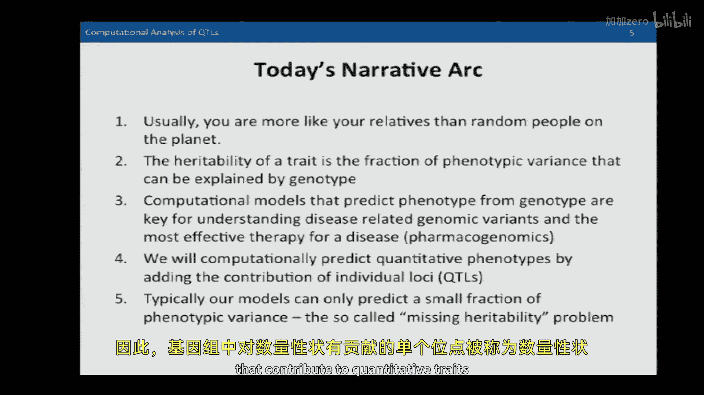
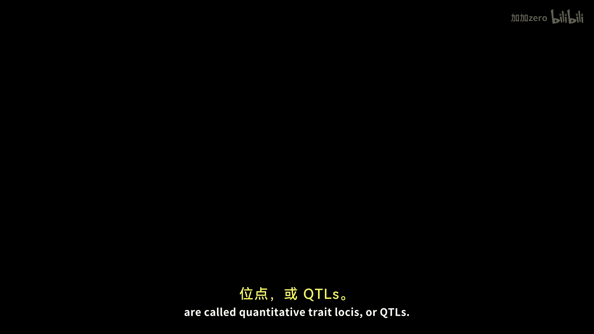
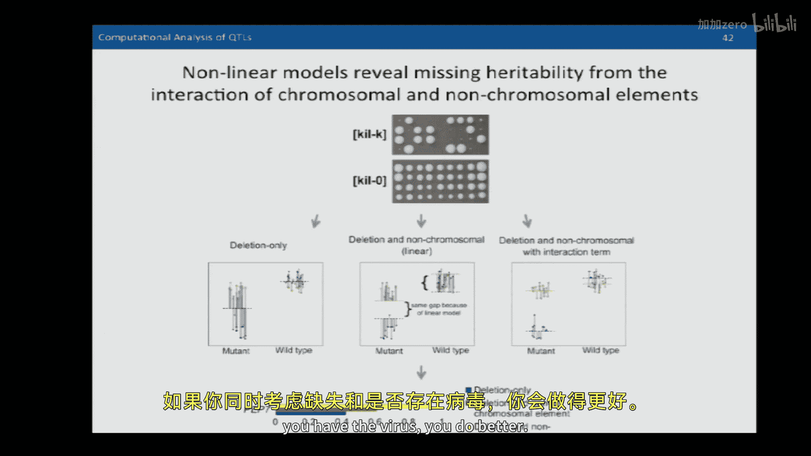

# 【计算与系统生物学基础 7.91J 2014】麻省理工—中英字幕 p19 p18 19. Discovering Quantitative Trait Loci (QTLs) -BV1HdzaYAE2a_p19-

The following content is provided under a creative Commons license。

 Your support will help M I T Open Coseware continue to offer high quality educational resources for free。

To make a donation or view additional materials from hundreds of MIT courses。

 visit M T OpenCourseware at OCw。 MT。 Eduu。

So as you recall last time we talked about chromatton structure and chromatin regulation。

 and now we're going to move on to genetic analysis， but before we did that。

 I wanted to touch on two points that we talked about briefly last time。One was 5 C analysis。

 Who was it that brought up？Who was the 5C expert here， anybody？No。Nobody wants to own privacy C。

 okay， but as you recall， we talked about Chiat as one way of analyzing any to any interactions in the way that the genome folds up and enhancers talk to promoters。

And 5 C is a very similar technique。 I just wanted to show you the flow chart for how the protocol goes。

 There is a crosslinking， a digestion with a restriction enzyme step。

 followed by a proximityligation step， which gives you molecules have been brought together by an enhancer。

 promoter complex or any other kind of。Distal protein， protein interaction。And then。

What happens is that you design specific primers to detect those liation events。

And you sequence the result of what is known as liated，ligation mediated amplification。

 So those prim are only going to ligate if theyre brought together at a particular junction。

 which is defined by the restriction sites lining up。

So5 C is a method of looking at which regions of the genome interact and can produce these sorts of results showing which parts of the genome interact with one another。

The key difference， I think， between Chiiape and 5 C is that you actually have to have these primers designed and pick the particular locations you want to query。

So the primers that you design represent query locations。

 and you can then either apply the results to a micro array or to high throughput sequencing to detect these interactions。

 but the essential idea is the same where you do proximity basedligation to form molecules that contain components of two different pieces of the genome that have been brought together for some functional reason。

The next thing I want to touch upon。Was this idea of the CPG diuccleotides that are connected by a phosphate bond。

 And you recall that I talked about the idea that they were symmetric so you could have methyl groups on the cytoines in such a way that because they could mirror one another。

 They could be transferred from one。Sttrainand of DNA to the other strand of DNA during cell replication by a DNA methyl transferasese。

So it forms a more stable kind of mark。 And as you recall。

 DNA methylation was something that occurred in lowly expressed genes。

 And typically in regions of the genome that are methylated， other hist marks are not present。

 and the genes are turned off。Okay， so those are the points I want to touch upon from last lecture。

Now， we're going embark upon an adventure looking for the answer to where is missing heritability found。

So there's a big open question now in genetics and human genetics。

 which is that we really can't find all the heritability。And as a point of introduction。

 the narrative arc for today's lecture is that generally speaking。

 you're more like your relatives than random people on the planet。 And why is this， right， Well。

 obviously， you contain。componentsonents of your mom and dad's genomes。

 and they are providing you with components of your traits。

 and the heritability of a trait is defined by the fraction of phenotypic variants that can be explained by genetics。

And we're going to talk today about computational models。That can predict phenotype from geno。

 And this is very important， obviously， for understanding the sources of various traits and phenotypes。

 as well as fields such as pharmacogenomics that try and。

Predict the best therapy for a disease based upon your genetic makeup。So。Individual。

Lci in the genome that contribute to quantitative traits are called quantitative trait， loci。

Are Q T Ls。 So we're going to talk about how to discover them and how to build models of quantitative traits using Q T Ls。

And finally， as I said at the outset。Our models。Are insufficient today。

 They really can't find all of the heritability。 So we're going to go searching for this missing heritability and see where it might be found。

Computationally。We're going to apply a variety of techniques to these problems。

A preview is we're going to build linear models of phenotype。

And we're going to use stepwise regression to learn these models。Using forward feature selection。

 And I'll talk about what that is when we get to that point of the lecture。

We're going to derive test statistics for discovering which Q Tls are significant。

And which Q Ts are not to include in our model。And finally。

 we're going to talk about how to measure narrow sense heritability and broad sense heritability and environmental variance。

Okay。So。One great resource。For。Traits that are fairly simple。

 that primarily are the result of a single gene mutation or。

 where a single gene mutation plays a dominant role is something called。

Online menillion inheritance in man。 And it's a resource。 It has about 21000 genes in it right now。

 And it's， it's a great way to explore。😊，What human genes function is in various diseases。

 and you can query by disease。 You can query by gene。

 and it is a very carefully annotated and maintained collection that is worthy of study。

If you're interested in particular disease genes。We're going to be looking at more complex。啊。

Analysis today。The analyses we're going to look at are where there are many genes that influence a particular trait。

 And we'd like to come up with general methods。 We're discovering how we can de novo from experimental data。

 discover all the different genes that participate。Now， just as a quick review of statistics。

 I think that we've talked before about。Means in class and variances。

We're also going to talk a little bit about covariances today。

But these are terms that you should be familiar with， as were。Looking today at some of our。

Metrics for understanding heritability。Are there any questions about any of the statistical metrics that。

Are up here。ok。So a broad overview of genotype to phenotype。

So we're primarily going to be working with complete genome sequences today。

Which will reveal all of the variants that are present in a genome。

And it's also the case that you can sub samplele a genome and only observe certain variances。

 Typically， that's done with microarrays that have probes that are specific to particular markers。

The way those arrays are manufactured is that whole genome sequencing is done at the outset。And then。

 high prevalence variance。These common variants， which typically are at all lu frequency。

 that at least 5% of the population are queried using a micro array。 But today。

 we'll talk about complete genome sequence。An individual's phenotype assay is defined by one or more traits。

And a non quantitative trait is something perhaps as simple as whether or not something is dead or alive or whether or not it can survive in a particular condition or its ability to produce a particular substance。

A quantitative trait， on the other hand， is。A continuous variable。Height， for example。

 of an individual as a quantitative trait， as is growth rate。Expression of a particular gene。

 and so forth。So we'll be focusing today on estimating quantitative traits。And as I said。

 a quantitative trait reloci is a marker that's associated with a quantitative trait and can be used to predict it。

And you can sometimes hear about E Q T Ls， which are expression quantitative to trait loci。

 and their loci that are related to gene expression。So。Let's begin， then。

With a very simple genetic model。It's going to be haploid， which means， of course。

 there's only one copy of each chromosome。 yeastt is the model organism we're going to be talking about today。

 It's a haploid organism。And we have mom and dad up there。 Mom on the left， dad on the right。

In two different colors。And you can see that mom and dad。

 in this particular example of N different genes， they're going contribute to the F1 generation to junior。

And the relative colors， white from mom， black for dad are going to be used to describe the alleles are or the allelic variants are inherited by the child。

 the F1 generation。And I said， a specific phenotype might be a live or dead inness specific environment。

And note that I have drawn the chromosomes to be disconnected。

Which means that each one of those genes is going to be independently inherited。

So the probability in the F1 generation that you're going to get one of those for mom or dad。

 is's going to be a coin flip。We're going to assume that they're far enough away。

 that the probability of crossing over during meosis is 0。5。

And so we get a random assortment of alleles from mom and dad。Okay。

So let us say that you go off and do an experiment。And you have 32 individuals that you。

Producuce out of a cross。And you test them。Okay， and two of them。A resistant。

To a particular substance。How many genes do you think are involved in that resistance。

Let's assume that mom is resistant， and dad is not。Okay。So how many。

 if you had two that were resistant out of 32， how many different genes do you think were involved。

How would you estimate that。Any ideas。Yes。有 need to。インデベートョ。Let's say half of them got it， two。

 let's say one out of 16 is。Resistant。And mom is resistant。

Because last thing you to do is half of them。Then you with maybe guess one team。Very good。そでね。

Only eight ver resist you might get。究金。Or something like that， y。

What you could say is that if mom's resistant， then we're going to assume that you need to get the right number of genes from mom to be resistant。

 right。And so。Let's say that you had to get four genes from mom。

 What's the chance of getting four genes from mom。AndW which is one out of 16， right？ So if you。

 for example， had two that were resistant out of 32， the chances are one in 16， right。

 So you would naively think。And properly so that you had to get four genes from mom to be resistant。

So。The way to think about these sorts of non quantitativeantit traits is that you can estimate the number of genes involved。

 simply as the log base 2 with the number of F1s tested over the number of the F1s with the phenotype。

It tells you roughly how many genes are involved。In。Providing a particular trait。

Assuming that the genes are unlinked。It's a coin flip whether you get them or not。

Does everybody see that？Yes。Any questions at all about that。About the details。Okay。

Let's talk now about。Quantitative traits， then。We'll go back to our model。And。

Imagine that we have the same set or a difference。 Actually。

 these are gonna be a different set of n genes。We're going to have a coin flip。

As to whether or not you're getting a mom gene or dad gene， okay。In each gene。

And dad has an effect size of one over n， yes。Check， we're assuming that the parents are。こざ。

the trade。Remember， these are haplloid。Right， so。They only have one copy of all these genes。Right。

 yes。not resistant。There are four genes involved， I could still mean that。Three of the4。

mean on the previous slide were talking saying all we knew about so really what you mean is that dad does not have any of the genes that are involved with。

That's correct。Well， I'm saying dad has to have all of the gene。

 the the child has to have all of the genes that are operative to create resistance。

 We're going to assume an and model。 You must have all the genes from mom。

 that are involved in the resistance pathway。And since only one out of 16 progeny has all those genes for mom。

 right。It appears that given the chance of inheriting from mamas is one half。That it's four genes。

You have to inherit from mom。 because the chance of inheriting all four is one out of 16。No。

 I'm assuming the da is。Doesn't have any of those。 But here we're asking。

 what is the difference in the number of genes between mom and dad。

So you're right that the number we're computing is the relative number of genes different between mom and dad you require。

And so it might be the dad's a reference terrain。 And we're asking how many additional genes mom brought to the table to provide with that resistance。

 But that's a good point。Okay。Okay， so。Now， let's look at this quantitative model。Let's assume that。

Mom has a bunch of genes that contribute 0 to an effect size， and。Dad。

 each gene that dad has produces an effective one over n。

So the total effect size here for dad is one。So the effect of mom on this particular quantitative trait might be 0 might be the amount of ethanol produced or some other quantitative value。

 And dad， on the other hand， since they have he has n genes produce is going produce one because each gene contributes a little bit to this quantitative phenotype。

Okay。Is everybody clear on that？So， the child is going to inherit。Jeans。

W a coin flip between mom and dad。Right。So the first fundamental question is。

 how many different levels are there in our quantitative。Phenenoite in our trait。

How many different levels can you have。Mm。N plus1， right because you can either inherit zero or up to n genes。

From dad。 And it gives you n plus one different levels。K。So what's the probability then， Well。

 ask a different question。 What's the expected value of the quantitative phenotype of a child。

Just looking at this。If dad's one and moms 0 and you have a collection of genes。

 and you do a coin flip each time。You're going to get half your genes from mom and half your genes from dad。

 right。And so。The expected。Trrate value is。Po5。 Okay， so for these additive traits。

 you're going be the midpoint between mom and dad。Right。And。What is the probability。

That you inherit x copies of dad's genes。Well。It's N choose x times 1 minus。

5 n the minus x times 05 to the X。 It's a simple binomial。Right。So， if you look at this。

The probability distribution for the children。It's going to look something like this。

 where this is the mean。Po5， and the number of distinct values is going to be n plus 1。Right。

So the expected value of x。Is 05。And it turns out that the expected value or the variance of。X minus。

05， which is the mean squared， is going to be 025 over n。

And so I can show you this on the next slide。So， you can see。This could be ethanol production。

 could be growth rate。 What have you。 And you can see that the number of genes that you're going to get from dad follows this binomial distribution。

And gives you a spread of different phenotypes。And the child generation。

 depending upon how many copies of dad's genes that you inherit。Does this make sense to everybody。

 Id now would be a great time to ask any questions about the details of this， yes。😊，Wfi嘛。

The fraction of Junenes inheritance。The number of genes you inherit from dad。The number of genes。

 So it will be。0，1，2， up to n。Shouldn't be。Oh sorry， it is supposed to be N over2。

 but the last two expectations there are the sum of the number of des you've inherited from death。

Thats correctrr。Yeah， the slide's wrong。Any other questions？Okay， so。This is a。A very simple model。

 But it tells us a couple of things， right。Which is that as n gets to be very large。

The effect of each gene gets to be quite small。So something can be completely heritable。

But if it's spread over， say，1000 genes。Then it will be very difficult to detect because the effect of each gene will be quite small。

 And further， the variance that you see in the offspring。Will be quite small as well。Right。

 in terms of the， the phenotype， because it's gonna be 025 over n in terms of the expected value。

 So as n gets larger， the number of genes in that。That contribute to a phenotype increase。

The variance is going to go down linearly。Okay， so well。

 you should just keep this in mind as we're looking at。You know， discovering these sorts of traits。

And the underlying Q T Ls that can use， be used to predict them。And finally， I'd like to point out。

One other detail， which is that if genes are linked。

 that is if they're in close proximity to one another in the genome and it makes it very unlike there's going to be crossing over between them。

Then they're going to act as a unit。If they act as a unit。Then。Well get marker correlation。

 And you can also see effectively that the effect size of those two genes is going to be larger。

And in more complicated models， we obviously wouldn't have the same effect size for each gene。

The effect size might be quite large for some genes， quite small for some genes。

And we'll see the effects of marketer correlation in a little bit。

So the way we're going model this is we're going to， this。

 this is a definition of the variables that we're going to be talking about today。

And the essential idea。Is quite simple。Just that。Right。So a phenotype of an individual。

So piece I is the phenotype of an individual。It's going to be equal to some function of their genotype。

Plus， an environmental component。This function。Is the critical thing that we want to discover。

This function F is mapping from the genotype of an individual to its phenotype。

And the environmental component could be。How well something is fed， How much sunlight it gets。

Things that are actually。Can greatly influence things like growth。

That they're not described by genetics。But this function is going to encapsulate。

What we know about how the genetics of a particular individual influences a trait。And。Thus。

If we consider a population。Of individuals。The phenotypic variance。It's going to be equal to。

The genotypic variance plus the environmental variance， plus the covariance。Two times the covariance。

Between the genotype and the environment。And we're going to assume， as most studies do。

 that there is no correlation between genotype and environment。 So this term disappears。

So what we're left with is that。The observed phenoypic variance is equal to the genotypic variance plus the environmental variance。

And what we would like to do is to come up with a function F。That best predicts。

The genotypic component。Of this equation。There's nothing we can do about environmental variance。

 right。But。We can measure it。 Does anybody have any ideas how we could measure environmental variance。

Yes， study populationss。Controlled environments， say study populations that。Right。

 so what we could do is we could use control。 So typically， what we could do is we could study and。

Environments where we try and control the environment exactly to eliminate this as much as we possibly can。

For example。As we'll see that we also can do things like study clones or individuals have exactly the same genotype。

And then all of the variance that we observe， if this term vanishes。

 because the genotypes are identical。Is due to the environment。

So typically if you're doing things like studying humans。

Since cloning humans isn't really a good idea to actually measure environmental variance。 right。

 what you could do is you can。Look at identical twins。

And identical twins give you a way to get at the question of how much environmental variance there is for a particular phenotype。

So。In some。嗯。This is replicates what I have here on the left hand side of the board。

And note that today， we'll be talking about the idea of discovering this function F and how well we can discover F。

 which is really important。 right， It's fundamental to be able to predict phenotype from genotype。

It's a extraordinarily central question in。Genetics。And when we do this。Prediction。

There are two kinds of heritability。 It's a question。Why the covariance drops out？goes with。Yeah。

 the co drops up because we're going to assume that genotype and environment are independent。Now。

 if they're not independent， it won't drop out。But making that assumption。And， of course。

 for human studies， you can't really make that assumption completely， right。

 And one of the problems in doing these sorts of studies is that it's very。

 very easy to get confounded。Because when you're trying to decompose the observed variance in height。

 for example。You know， there's what mom and dad provided to an individual in terms of their height。

 And there's also how much junior ate。Right， whether he went to McDonald's a lot or， you know。

 was you know， going to Who foods a lot。 You know， who knows， right？ But you know。

 this component and this component， it's easy to get confounded between them。

 And sometimes you could imagine that genotype。Is related to place of origin in the world。

And that has a lot to do with environment。And so this term wouldn't necessarily disappear。Okay。

 so there are two kinds of heritability I'd like to touch upon today。

 And it's important that you remember， there are two kinds。

And one is extraordinarily difficult to recover。 And the other one。Is， in some sense。

 a more constrained problem because we're much better at building models for that kind of heritability estimate。

The first is broad sense。Heritability， which describes the upper bound for phenotypic prediction。

 given an arbitrary model。 So it's the total contribution to phenotypic variants from genetic causes。

And we can estimate that， right， the way， and we'll see how we can estimate it in a moment。

And narrowense heritability is defined as how much of the heritability can we describe when we restrict F to be a linear model。

So when F is simply linear。As a sum of terms。That describes the maximum narrow sense heritability we can recover in terms of the fraction of phenopic variance we can capture in F。

And it's very useful， because。It turns out that we can compute。

Both broad sense and narrow sense heritability from first principles。 I mean from experiment。

And the difference between them is part of our quest today。 Our quest is to answer the question。

 where is the missing heritability， Why can't we build。An oracle F。That perfectly predicts。

Phenenotype from genotype。So， on that line。I just want to give you some caveats。

 One is that we're always talking about populations when we're talking about heritability。

 because how we're gonna estimate it。And when you hear people talk about heritability。Oftentimes。

 they won't qualify in terms of whether it's a broad sense or narrow sense。

 And so you should ask them if you're engaged in a scientific discussion with them。

And as we've already discussed， sometimes estimation is difficult because matching environment and eliminating this term。

 the environmental term， can be a challenge。When you're out of the laboratory。

 like when you're dealing with humans。So。Let's talk about Brightton's heritability。

Imagine that we measure environmental variance。Simply， by。Looking at environmental twins or clones。

Right because if we。For example， take a bunch of yeast。That are genypically identical。

 and we grow them up separately。And we measure a trait。Like。

How well they respond to a particular chemical or their growth rate。

Then the variance we see from each individual to individual is simply environmental。

Because they're genetically identical。So we can， in that particular case。

 exactly quantify the environmental variance， given that every individual is genetically identical。

We simply measure all the growth rates， and we compute the variance。

 And that's the environmental variance。Okay。As I said， for humans。

 the best we can do is identical twins。Right。Mnozygootic twins。

You can go out and you can for pairs of twins that are identical。

You can measure height or any other trait that you like and compute the variance。

And then that is an estimate of the environmental component to that。

Because they should be genetically identical。And big H squared。

 broad sense is always capital H squared and neuros sense is always little H squared。 Big H squared。

 which is broad sense heritability， is very simple， then。

It's the phenotypic variance minus the environmental variance over the phenotypic variance。

 So it's the fraction of phenotypic variance that can be explained from genetic causes。

Is it clear to everybody？Any questions at all。About this。Okay。So， for example。

On the right hand side here， those three purlish squares。Have。3 different populations。

 each which are genotypically identical identical。 They have two genes， a little A， little A， big， A。

 little A and big， A， big， A。And they have each one of this as a variance of 1。0。

 So since they are genetically identical。We know that the environmental variance has to be 1。0。

On the left hand side， you see the genotypic variance。 and that reminds us of where we started today。

It depends on the number of lis you get of big A as to what the value is。

And when you put all that together。You get a total variance of three。

And so big H squared is simply the。Gotypic variance， which is two over the total phenotypic variance。

 which is 3。 So big H squared is two third。And so that is a way of computing。

Broad sense heritability。Now。If we think about。Our models。

We can see that narrow sense heritability has some very nice properties， right。That is。

If we build an additive model of phenotype。To get at narrow sense heritability。

 So we're gonna constrain F here to be。Linear， and simply gonna be a very simple linear model。

For each particular Q T L that we discover。We assign an effect size beta to it。

Or coefficient that describes its deviation from the mean for that particular trait。

And we have an offset beta 0。So our simple linear model is going to take all the discovered Q T Ls that we have。

 Take each Q T L， discover which allellic form it's in。Typically。

 it's considered either in zero or one form。And then， add。A beta J where J is the particular Q TL。

Deviation for mean value。Add them all together to compute the phenotype。Okay。So。

This is a very simple additive model。And a consequence of this model is that if you think about an F1 or a child two parents。

As we said earlier。A child is going to inherit roughly half of the alleles from mom and half of the alleles from dad。

And so for add of models like this， the expected value of the child's。Trade value。

It's going to be the midpoint of mom and dad。And that can be derived directly from the equation above。

Because you're getting half of the Q Ts from mom and half of the Q Ts from dad。

So this was observed a long time ago， right， Because if you。Did studies。 And you looked at。

The deviation。From the midpoint to appearance， for human height。Right。You can see that。The children。

嗯。Fall pretty close to the mid parent line。嗯。Where the y axis here is the height and inches。嗯。And。

That suggests that much of human height is。Can be modeled by。A narrow sense based heritability model。

Now。Once again。Neurosciense heritability is the fracture phenotypic variance explained by an addom model。

And。We've talked before about the model itself。And little H squared is simply going be the amount of variance explained by the additive model over the total phenotypic variance。

And the add of variance is shown on the right hand side。That equation boils down to。

 you take the phenotypic variance and you subtract off。The variance。 that's environmental。

And that cannot be explained by the add of variance and what you're left with is the add of variance。

And the once again， coming back to the question of missing heritability。

If we observe that what we can estimate for little H squared is below what we expect。

 that gap has to be explained somehow。Some typical values。For theoretical H squared。

 So this is not measured H squared in terms of building a model and testing it like this。

But what we can do is we can theoretically estimate what H squared should be by looking at the fraction of identity between individuals。

Morological traits tend to have higher H squared than fitness traits。So， human height has a。

Little8 squared of about 0。8。And for those ranchers out there in the audience。

 you'll be happy to know that cattle yearling weight has hairit ability be about 。35。😊，Now。

Things like life history， which are fitness traits。Are less heritable。Which would suggest。

Looking at how long your parents live and trying to estimate how long you're going to live is not as productive as。

Looking at how tall you are compared to your parents。

And there's a complete table I've included in the slides for you to look at。

 but it's too small to read on the screen。Okay， so now we're going to turn to computational models and how we can discover a model that。

Figures out where the Q T Ls are and then assigns that function F to them so we can predict phenotype from genotype。

And。We're going to be taking our example from this tap paper by Bloom at all。

 which I posted on the stellar site。 and it came out last year。

 and it's a wonderful study in Q T L analysis。😊，And the setup for this study is quite simple。

What they did was they took two different strains of yeast， R， M and B， Y。And they crossed them。

 and produced。Roughly 1000。F1s。And RM and B Y are very similar。There are about 30。

 I think it's about 35000 SnNps between them。About 。5% of their genomes are different。So。

 they're really close。嗯。Just for point of reference， you know。

The distance between me and you is about1，1 base every thousand00， something like that。

And then they assay all those F1s。 They genotyped them all。So to genotype them。

 what you do is you know what the parental genotypes are， because you。They sequence both parents。

 the mom and the dad， so to speak at 50 X coverage。

 So they knew the genome sequences completely for both mom and dad。

And that for each one of the thousand。F1s。They put them on a microarray。 And what。

 what is shown on the very bottom left is a result of genotyping an individual。Where they can see。

Each part in each chromosome and whether it came from mom or from dad。 And you can't see it here。

 but there are 16 different chromosomes。And the alternating purple and yellow colors show whether that particular part of the genome came from mom or from dad。

So they know for each individual。It's source。From the left or the right stream。Okay。

And they have 1000 different genetic makeups。And then they asked for each one of those individuals。

 how well could they grow in 46 different conditions。So， they。Expose them to different sugars。

 to different unfavorable environments and so forth。

 And they measured growth rate as shown on the right hand side or right in the middle。

 a little thing that looks like a bunch of little dots of various sizes。By measuring colony size。

 they could measure how well the yeast were growing。And so， they had。Two different things， right。

 They had the exact genotype of each individual。And they also had how well it was growing。

In a particular condition。And so for each condition。

 they want to associate the genotype of the individual to how well it was growing to its phenotype。

Now， one fair question is。Of these different conditions， how many of them were really independent。

And so to analyze that， they looked at the correlation between growth rates across conditions to try and figure out whether or not they actually had 46 different traits they were measuring。

So this is a correlation matrix。That is too small to read on the screen。

 The colors are somewhat visible， where the blue colors are perfect correlation and the red colors are perfect anti correlation。

And you can see that in certain areas of this grid， things are more correlated。

 like what sugars the yeast like to eat。But suffice to say， they had a。

Large collection of traits they wanted to estimate。So。Now， we want to build a computational model。

 So our next step is figuring out how to find those places in the genome that I was to predict how well given a trait。

The yeast would grow。The actual growth rate。So the key idea is this。You have。Genetic markers。

Which are snips down the genome。And you're going to test a particular marker。And。

If this is a particular trait。One possibility is that。

Lets say that this marker could be either zero or one。Without loss of generality。

It could be that here are all the individuals where the marker is 0。And here are all the markers。

Where。The marker is one。And really， fundamentally。Whether an individual has a zero or a one marker。

 does it really change。Its growth rate， very much。Okay， it's more or less identical。

It's also possible。That。That this is best modeled。By two different means。

For a given trait that when the marker is one， you're growing。Actually。

 this is going to be the growth rate。On the X axis。The y axis is the density。

That you're growing much better when you have a one in that marker position than a 0。

And so we need to distinguish between these two cases when the marker is predictive of growth rate。

And when the marker is not predictive of growth rate。

And we've talked about log likelihood tests before。 And you can see when on the very top。

And you can see there's an additional degree of freedom that we have in the top prediction versus the bottom。

 because we're using two different means that are conditioned upon the。

Geneypic value at a particular marker。So we have a lot of different markers indeed。 So we have。

And see here the exact number， I think it's about 13，000 markers。They had in this study， no。

11623 different unique markers they found。That they could discover that weren't linked together。

 We talked about linkage， earlier on。So you've got over 11000 markers。

You're going to do a log likelihood test to compute this。Log odd score。

Do we have to worry about multiple hypothesis correction here。

Because you're testing over 11000 markers to see whether or not they're significant for one trait。

Right。So。One thing that we could do。Is imagine that what we did was we scrambled。

The association between phenotypes and individuals。So we just randomized it。

 we did that a thousand times。And each time we did it。

 we computed the distribution of these log scores。Because we have broken the association between。

Phenenotype and genotype。The lo scores that we should be seeing if we did this randomization should correspond to essentially noise。

 what we would see at random。So it's a null distribution we can look at。And so。What we'll see。

Is a distribution of lo scores？This is the la。This is the probability。From。A null permutation test。

And since we actually have done the randomization over all 11000 markers。

We can directly draw a line and ask， what are the chances that a la score would be greater than or equal to a particular value at random。

And we can pick an area inside this tail， let's say 0。05。

 because that's what the authors this particular paper used。And ask， what value of a la score。

Would have， would be very unlikely to have by chance。And turns out in their first iteration。

 it was 2。63。That a allowed score over 2。63 had a 。05 chance。Or less。

Of occurring in a in randomly permuted data。And since the randomly permed data contained all of the markers。

We don't have to do any multiple hypothesis correction。

So you can directly compare the statistic that you compute。Against。A threshold。

And accept any marker or Q T L that has a la score greater in this case。Then 2。

63 and put it in your model。And everything else you can reject。

And so you start by building a model out of all of the markers that are significant at this particular level。

You then assemble the model。And you can now predict。Penenotype from genotype。But， of course。

 you're going to make errors， right， for each individual， there's going to be an error。

 You're going to have a residual。For each individual。Is going to be。The phenotype。Minus。

The genotype of that individual。So this is the error that you're making。

So what these folks did was that you first look at。The predicting the phenotype directly。

And you pick all the Q Ts that are significant at that level。And then you compute the residuals。

 and you try and predict the residuals。And you try and find additional。Q T Ls that are significant。

After you have picked the original ones。Okay。So why might this produce more Q T Ls than the original pass。

What do you think。Why is it that trying to predict the residuals。

Is a good idea after you tried to predict the phenotype directly。Any ideas about that。Well。

 what this is telling us is that these Q T Os we're going to predict now were not significant enough in the original past。

But when we're looking at what's left over we subtract off the effect of all the other Q T Ls。

 other things might pop up。That， in some sense， were're obscured by the original Q T Ls。

 Once we subtract off their influence。We can see things that we didn't see before。

And we can start gathering up these additional Q Tls to predict the residual components。

And so they do this three times。So they predict the original set of Q T Ls。

 and then they iterate three times on the residuals。

To find and fit a linear model that predicts a given trait from a collection of Q T Ls that they discover。

 yes。就 the啊。The second round。面来。You find。Done three additional times。再 right这个 the。啊。

Is it done on the remainder here at K T？Original list。

Each time you expand your model to include all the Q T Ls you've discovered up to that point。

 So initially， you discover a set of Q T Ls called that set  one。You then compute a model using set1。

And you discover the residuals。这个 with the。Correct， well。

 residual your say use step one to build a model a phenotype。And。

So set1 is used here to compute this。Right， and so set 1 is used。

 and then you compute what's left over after you've discovered the first set of Q， T Ls。

Now you say we still have this left to go。Let's discover some more Q Tls。

 So now you discover set two of Q TLs。Okay。And that set2 then is used to build a model that has set one and set two in it。

Right， and that residual is used to discover set 3。And so forth。

 So each time you're expanding the set of Q T Ls by what you've discovered in the， in the residual。

 sort of in the trash bin， so to speak。Yes， each time you're doing this randomization to determine an LOD cutoff That's correct。

 Each time you have to redo the randomization you get to the LD cutoff。

 what does that method actually work the way of expected on the second task。Some false positives。

From the first pass， you now subtract。I'm not sure I just say the question。

 so the second time you do this randomization you again come up with a threshold and you say， oh。

About here， there are 5% false positives，But could it be that that estimate is actually significantly wrong？

Based on fact you've subtracted off false positives。Before you do that process。I don't think。 I mean。

 in some sense， what's your definition of a false positive。Right， I mean。

 it gets down to that because。We've discovered there's an association between that Q， T。

 L and predicting phenotype。And in this particular world， it's useful for doing that。

So it's hard to call something a false positive in that sense， right。But you're right。

 You actually have to reset your threshold every time that you go through this iteration。

Good question。 Other questions。Okay。So。Let's see what happens when you do this。

What happens is that if you look down the genome。You discover a collection， for example。嗯。

This is growth in。E 6， Burmamine。And you can see the significant locations in the genome。

 The number 1 through 16 of the chromosomes and the little red asterisks above the peaks。😊。

Indicate that that was a significant log score。 the Y axis is log score。

And you can see the locations in the genome where we have found places。That were。

Associated with growth rate。In that particular chemical。Okay。Now。

Why is it do you think that in many of those places。

 you see sort of a rise and a fall that is somewhat gentle。

 as opposed to having an impulse function right at that particular spot。Nearby ss are linked。 Yeah。

 nearby sns are linked that as you come up to a place that is causal。

You get a lot of other things that are linked to that。And the closer you get。

 the higher the correlation is。Now， so that is for 1000 segregates in the top。And。

What was discovered for that particular trait。Was。15 different los。

That explained 78% of the phenotypic variants。And in the bottom。The same procedure was used。

 but was only used on 100 segregates。And what you can see is that。In this particular case。

 only two losi were discovered。That explain 21% of the variance。

So the bottom study was grossly underpowered。Remember， we talked about the problem of finding。

Q T Ls that had small effect sizes。And if you don't have enough individuals。

 you're going to be underpowered and you can't actually identify all the Q T Ls。So， this is a。

A comparison of this。 And， of course。One of the things that you don't know is the environmental variance that you're fighting against。

Because the number of individuals you need depends both on the number of potential loci that you have。

 the more loci you have， the more individuals you need。

To fight against a multiple hypothesis problem， which is taken care of by this permutation implicitly。

嗯。And the more Q T L that contribute to a particular trait， the smaller they might be。

 And there you need more individuals to provide adequate power for your test。And out of this model。

 however。If you look at for all the different traits。

The predictive phenotype versus the observed phenotype。

 you can see that the model is a reasonably good job。So。

Interesting things that came out of this study were that， first of all。

 it was possible to look at the size。The effect sizes of each Q T L。Now。

 the effect size in terms of fraction of variance explained of a particular marker。

Is the square of its coefficient？ Its the beta squared。

So you can see here the histogram of effect sizes。 And you can see that most Q T Ls have very small effects on phenotype。

Where phenotype is scaled between 0 and  one for this study。So。Most traits as is described here。

 have between 5 or 29 different Q T L loci in the genome that used to describe them。

With a median of 12。Now。The question the authors asked was if they looked at the theoretical H squared。

That they computed for the F1s。 How well did their model do。

And you can see that they're modeled this very well。

 But in terms of looking at narrow sense heritability。

 they can recover almost all of it all the time。However。The problem comes here。We remember。

 we talked about how to compute Broson's heritability by looking at。嗯。

Cls and computing environmental variants directly。And so they were able to compute broadson's heritability and compare that to the narrow in heritability that they're able to actually achieve in this study。

😊，And you can see there are substantial gaps。AndSo what could be making up those gaps。

Why is it that this addom model can't explain。Growth rate in a particular condition。So。

The next thing that we're going to discover。Are some of the sources of this so called missing heritability。

 But before I give you some of the stock answers that people in the field give。

So this is part of our quest today to actually look into missing heritability。I'll put it to you。

 my panel of experts。 What could be causing in heritability to go missing。

 Why can't this add a model。Predict。Growth rate accurately， given it knows the genotype exactly。Yes。

I。So epigenetic factors， are you talking about protein factors。

 are you talking about epigenetic effects？Epigenetic marks， okay。

 so it might be now yeast doesn't have DNA methylation。It does have chromatom modifications。

In the form of histone marks。So it might be that there's some histone marks that are copied from generation to generation that are not counted for in our model。

 right？Okay， it's one possibility。 Great， yes。There more complex effects of like two separate genes being turned out other than just adding like one could the other。

So it one not， I couldn't have。大そでし。Right， so those are called epistatic effects。

 or theyre nonlinear effects。 They're gene gene interaction effects。

That's actually thought to be one of the major issues in。Mising heritability。

What else could there be？Yes。think noise in。Depression， like say， during。Translation。

Now there own molecules gender。Will not be the same。😔，这边这。Right。

 so you're saying that there could be inherent noise that would cause there to be fluctuations in colony size that are unrelated to the genotype。

And in fact， that's a good point。 And that's something that we're going to take care of with the environmental variance。

 So we're going to measure how well individuals grow with exactly the same genotype in a given condition。

 And so that kind of fluctuation would be， would appear in that variance term。

 And we're going to get rid of that， so。But that's a good thought。 And I think it's important。

 and not appreciated that there can be random fluctuations in， in that term。Any other ideas。So。

 we have。Epitasis， we have epigenetics。 We've got two E's so far。Anything else。How about。If。

There are a lot of different loci that are influencing a particular。Trit。

But the effect sizes are very small。That we've captured sort of the cream。

 We've skimmed off the cream。 So we get， you know，70% of the variance explained。

But the rest of the Q T Ls are small， right， And we can't see them。

 We can't see them because we don't have enough individuals。 We're underpowered， right， We just。

More individuals， more sequencing， right。And that would be the only way to break through this and be able to see these very small effects。

Because if the effects are small。In some sense。We're hosed。Right。

You just can't see them through the noise。All of those effects are going to show up down here。

And we're going to reject them。Anything else。People can think about。Yes。You detect。

Maybe the sum of some areas。Sorry good。The addition， some of。Those guys that have。Or is that。那。

Well that's sort of what we're trying to do with the residuals， right？

That this multi round thing is that we take all the things we can detect that have an effect with a conservative cutoff。

 and we get rid of them。And then we say， oh， is there anything left， You know。

 that's hiding sort of behind that forest， right， Can we， we cut through the first line of trees。

 Can we get to another。Collection of informative Q T Ls。Yeah。I this can be an progressreest。Also。

 like for example， if when you throw up the variance。M conditions。

 the environmental conditionss aren't exactly as best。Betweenンていうリス。Se up then maybe you would。

Inappropriately assign a variance to the environmental condition whereas some of that。クピ？はい。Yeah。

 some of the wind。Prob the other way around， which is that the other way around would be that you thought you had the conditions exactly duplicated。

 right， But when you actually did something else， they weren't exactly duplicated。

 So you see bigger variances。In another experiment。 and that appears to be heritable in some sense。

 But in fact， it was just that you misestimated the environmental component。

So there are a variety of things that we can think about， right。Incorrrate chaitability estimates。

 we can think about。Rare variance done this particular study。 We're looking at everything， right。

 Nothing is hiding。 We got 50 x sequencing。 There are no variants hiding behind the bushes。

 They're all there for us to look at。Structural variance。 So in this particular case。

 we know structural variants aren't present。But as you know， many kinds of a million cells exhibit。

Structural variants and other kinds of bizarre behaviors with their chromosomes。

Many common variants of low effect。 We just talked about that。And epistasis was brought up。

 And this does not include epigenetics。 I'll have to add to the list， it's a good point。Okay， so。

 and then we talked about this idea that。Epitasis is the case where。You have nonlinear effects。

 A very simple example of this is that when you have little A and big B and big A and big B together。

 they both had an effect， but。Little A， little B have no effect。 And big。

 A and big B have no effect by themselves。So you have a pair wise interaction between these terms。

Right。So this is sort of the exclusive war of two terms。

 And that non nonlinear effect can never be captured when you're looking at terms one at a time。Okay。

Because looking one at a time。It looks like it has no effect whatsoever。And these effects， of course。

 could be more than pair wise。 if you have a complicated network or pathway。Right。嗯。Now。

 what the authors did。To examine this。As they looked at pairwise effects。

So they considered all pairs of markers and asked whether or not taking two at a time now。

 they could predict。A difference in trait mean。But what's the problem with this？

 How many markers did I say they were。13，000。Something like that。

All pairs of markers is a lot of pairs of markers， right。

And what happens to your statistical power when you get to that many markers。

You have a serious problem goes right through the floor。

So you really are very underpowered to detect these interactions。

The other thing they did was to try to get things a little bit better as they said， how about this。

If we know that。A given Q， T， L is important for a trait because we discovered it in our additive model。

Will consider its pairwise interaction with all the other possible variants。

So instead of now 13000 squared， it's only going be like 22 different Q T Ls for a given rate times 13000。

To reduce the space of search。 Okay， obviously， I got this。Explanation not completely clear。

 So let me try one more time， okay。The naive way to go at looking at pairwise interactions is consider all pairs and ask whether or not all pairs have an influence on a particular trait value。

We got that much，Now， let's suppose we don't want to look at all pairs。

How could we pick one element of the pair to be interesting， but smaller in number。Right。

 so what we'll do is for a given trait， we already know which Q T Ls are important for it。

Because we've built our model already。So let's just say for purpose of discussion。

 there are 20 Q T Ls that are important for this trait。

We'll take each one of those 20 Q T Ls and we'll examine whether or not it has a pairwise interaction with all of the other variants。

And that will reduce our search base。That better。 Okay， good。So。When they did that， they did find。

Some pair interactions。And24 of their 46 traits had pairwise interactions。 And here is an example。嗯。

And。You can see the dot plot or the upper right hand part of this slide。 How when you have B， Y， B。

 Y， you have a lower phenotypic value than when you have。Just。

Any RM component on the right hand side。So。Those were two different SniPps on chromosome 7 and chromosome 11 and showing how they interact with one another。

In a nonlinear way。If they were linear， then as you added either a chromosome 7 or a chromosome 11 contribution。

 it would go up a little bit here， as soon as you add。呃。Either contribution from RM。

 it goes all the way up to have a mean of 0 or higher。In this particular case，71% of the gap。

Between broad sense and narrow sense was explained by this one pair interaction。So it is the case。

That pairwise interactions can explain some of the missing heritability。

Can anybody think of anything else that can explain missing heritability。Okay。What's inherited？

Let's make a list of everything that's inherited from the parental line to the F1s。Okay。Yes。

 mean because there's a lot more things in terms of the protein levels are inherited。Good。

 I like this line of thinking。ButA lot of things that are inherentherited， right？So。What's inherited。

Some proteins are probably inherited， right？What is replicable through generation to generation this genetic material is inherited。

Let's just talk about that for a moment。Proteins are interesting。 Don't get me wrong。

Pons and other things are very interesting。 But what， what else is inherited。Okay， yes。

Some the results in mice or？Later。So there are other genetic molecules。

Let's just take a really simple one， mitochondria。Okay。Mitochondria inherited。

And it turns out that these two strains have。2 streams can have different mitochondria。

What else can be inherited。Well， we were doing these experiments with our colleagues over at the Whitehead。

 And for a long time。We couldn't figure out what was going on because we do the experiments on day  one。

 and they come out a particular way。 on day 2， they come out a different way， right？

 And we're doing this in very controlled conditions。Until we figured out that。Everybody uses S 2D8 C。

 which is the genetic lumenclature for the。Lab trained yeast。Right。

 it's a lab trained because it's very well behaved。 It's a very nice yeast。 It grows very well。

 It's been selected for that， right。And people always do genetic studies by taking S 2 E8 C。

 which is the lab yeast， which has been completely sequenced。

 And so you want to use it because you can download the genome。With a wild string。

And wild strains come from the wild， right。And they come either off of， you know。

 people who have yeast infections。 I mean， human beings or they come off of grape vines or God knows where。

 right， But they are not well behaved。 And why are they not well behaved。

 what makes these yeast particularly rude。 Well， the thing that makes it particularly rude is that they have things like viruses in them。

Oh， no， okay， because what happens is that when you take a yeast that has a virus in it and you cross it with a lab yeast。

 right， all of the kids got the virus。Yick。Okay。It turns out that。

The so called killer virus in yeast。Interacts with various chromosomal changes。

And so now you have interactions， genetic interactions between a viral element and the chromosome。

And so the phenotype you get out of particular deletions in the yeast。

GGenome has to do with whether or not it's infected with a particular virus。

It also has to do with whether or not it has has which mitochondrial content it has。

And people didn't appreciate this until recently， because most of the past yeast studies。For Q T Ls。

 we're busy crossing。Lab strains with wild strains and whether it was ethanol tolerance or growth in heat。

A lot of the strains came up with a gene as a significant Q T， L， which was M， K T 1。

 And people couldn't understand why M， K T 1 was so popular， right， M， K T1。

 maintenance of killer toxin 1。Yeah， that's the viral thing that enables that's the chromosomal thing that enables viral competence。

So。It turns out that。If you look at this。In this particular case。

 we're looking at yeast that don't have the virus in them in the bottom little photograph there。

 You can see they're all sort of。You know， they're growing similarly。

And the yeast with the same genotype above。Those are all Ttras。

 two out of the four are growing the other two are not。

Because the other two have a particular deletion。And if you look at the model。A deletion only model。

 deletion only only look at the chromosomal complement， doesn't predict。The variants are very well。

And if you look at the deletion and whether or not you have the virus， you do better。

But you do even better。If you allow for there to be a non nonlinear interaction between the chromosomal modification and whether or not you have the virus。

And then you recover almost all of the missing heritability。So I'll leave you with this thought。

 which is that。Genetics is complicated。And Q T Ls are great。 but don't forget。

That there are all sorts of genetic elements。 And on that note。

 next time we'll talk about human genetics。 Have a great weekend till then we'll see you。 Take care。

😊。

