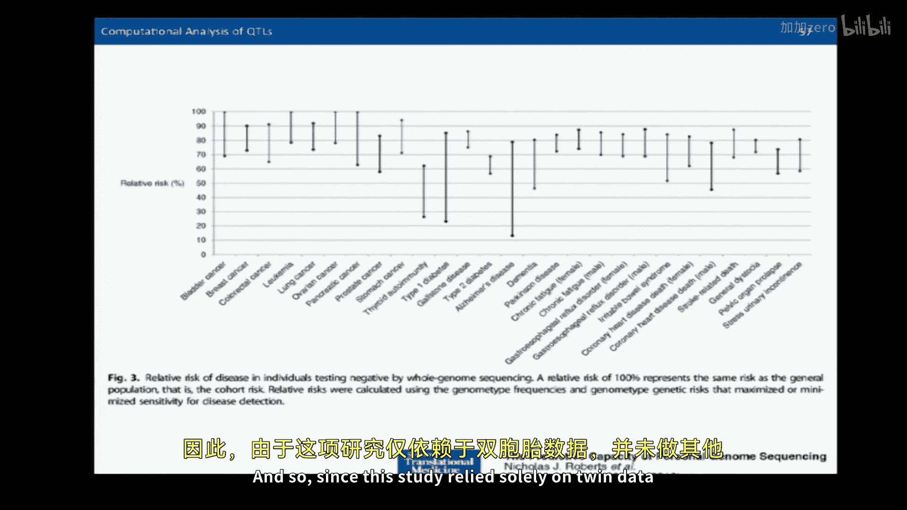
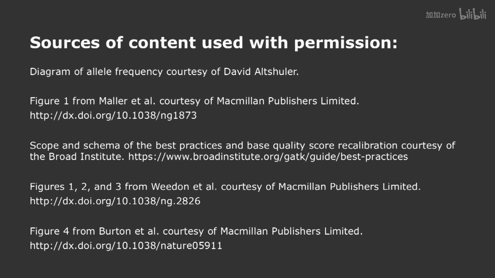

# 【计算与系统生物学基础 7.91J 2014】麻省理工—中英字幕 p20 p19 20. Human Genetics, SNPs, and Genome Wide Associate Studies -BV1HdzaYAE2a_p20-

The following content is provided under a creative Commons license。

 Your support will help M I T Open Coware continue to offer high quality educational resources for free。

To make a donation or view additional materials from hundreds of MIT courses。

 visit M T OpenCourseware at OCw。 MT。 Eduu。

Is everybody ready to rock and roll today？Or at least roll， okay？If not， rock。

 Wee back to lecture 20。 on Thursday， we have a special guest appearance just for you from Professor Ron Weis。

 who's going to be talking about synthetic biology。😊，You know。

 on Richard Feynman's blackboard when he died was a little statement I've always really enjoyed that was actually encased in a little chalk along and said。

 what I cannot create， I do not understand。 And so synthetic biology is one would approach questions in the biological sciences by seeing what we can make。

 you know， whole organisms， new genomes， rewiring circuitry。

 So I think you'll find it to be a very interesting discussion on Thursday。 But first。

 before we talk about synthetic biology， we have the very exciting。😊。

Discussion today on human genetics， which， of course， concerns all of us。

 And so we're going to have an exploration today。 And know， as I prepared today's lecture。

I want to give you the latest and greatest。Research findings。

 so we're going to talk today from fundamental techniques to things that are very controversial that have caused caused fist fights in bars。

 so I'm hopeful that you'll be as engaged the people drinking beer are so we'll be turning to that at the end of the lecture。

 but first I wanted to tell you about the broad narrative arc once again that we're going to be talking about today and we're going to be looking at how to discover human variation we're all different about one based in every thousand0。

And there are two different broad approaches historically。

People have used micro arrays for discovering variants。 and we'll talk about how those were designed。

 and we'll talk about how to actually test for the significance of human variation with respect to a particular disease in a case in control study。

 And then we'll talk about。How to use whole genome read data to detect variation between humans and some of the challenges in that。

 because it does not make as many assumptions as the microarray studies。 and therefore it is much。

 much more complicated process。 And so we're going to take a view into the best practices。

 processing human read data so you can understand what the state of the art is。

 And then we're going to turn to a study showing how we can bring together different threads we've talked about in this subject。

In particular， we've talked about the idea that we can use other genomic signals。

 such as histone marks to identify things like regulatory elements。

 So we're going to talk about how we can take that lens and focus it on the genome。

 discover particular genomic variants that have been revealed to be very important in a particular disease。

And finally， we'll talk about。The idea that what beginning we're going to talk about today is all about correlation。

And。As all of you go forward in your scientific career。

 I'm hopeful that you'll always be careful to not confuse association or correlation with causation。

You're always respected when you clearly articulate the difference when you're giving a talk saying this is correlated。

 but we don't necessarily know it's causative until we do the right set of experiments。Okay。

 on that note， we'll turn to the computational approaches we're going to talk about。

 we'll talk about contingency tables and various ways of thinking about them when we discuss how to identify whether or not a particular SNP is associated with a disease。

Using various kinds of tests。And then we talk about read data。

 and we'll talk about likelihood based tests。How to do things。

 like take a population of individuals and their read data and estimate the genotypic frequencies at a particular locus using that data in To using EM based techniques。

Okay， so let us begin then。Some of the things we're not going to talk about include。

Nonran genottyping failure。Methods to correct for population stratification and structural variance and copy number variations。

Pot3， we'll just briefly touch on， but。Fundamentally。

 theyre just embellishments on the fundamental techniques we're talking about。 And so I。

 I didn't really want to confuse today's discussion。Now。

A Mendelian disorder is a disorder defined by a single gene。And therefore。

 they're relatively easy to map。And they also tend to be in low frequency in the population because they're selected against。

 especially the more severe menilian disorders。And therefore。

 they correspond to very rare mutations in the population。By point of contrast。

 if you thought about the genetics we discussed last time。

 if you think about a trait that actually perhaps is influenced by 200 genes。

It may that one of those genes is not necessary or sufficient for a particular disease。

As a consequence， it could be a fairly common variant。

And it's only if you're unlucky enough to get all the other 199 variants until you actually come down with that syndrome。

And therefore， you can see that the effect of variation in the human genome is inversely related to its frequency that fairly rare variants can have very serious effects。

Whereas fairly common variants tend to have。Of fewer effects。

 And in the first phase of mapping human variation。

 people thought that common variants were things ahead of allliic frequencying in the population of 5% or greater。

And then to， to burrow down deeper， the0 Genomes Project surveyed a collection of different populations。

And therefore， if you thought that。A variant was prevalent in the population at a frequency of 。5%。

 How many people would have it in 000 genomes project roughly。

Just make sure I'm we're phase locked here。Half a percent thousand0 people。Great， okay， good。Now。

 of course， these are three different populations or more。 And so it might be that， in fact。

 that variant only present in one of the populations。

 So it just might be one or two people that actually have that particular variant。

So the idea is that the way that you design。Snip chips to detect single nucleotide polymorphisms。

 Otherwise known as Snps。Is that you do these population based sequencing studies。

And you design the array based upon all the common variants that you find。Okay。And therefore。

 the array gives you a direct readout in terms of the variation。

 in terms of all these common variants。That's where we'll start today。

AndWhere we'll end today is sequencing based approaches， which make no assumptions whatsoever。

 And just， you know， all hell breaks loose。 I means， so you'll see what happens。 Okay。

 but I wanted just to reinforce the idea that there are different allliic frequencies of variance。

And that as we get down to rare and rare alleles， we have larger effects。

But these higher frequency alleles could also have effects， even though they're much smaller。Okay。

So let's talk about how these variants arise and what they mean in terms of a small little cartoon。

So。Long， long ago， in a world far， far away， A mutation occurred where a base G got mutated to a base A。

Okay。And。This was in the context of a population of individuals， all happy。

 smiling individuals because they all actually do not have a disease。And then。And our story goes。

What happens is that we had yet another generation of people who are all happy smiling because they do not have the disease。

Right？Yes， I do tell stories at night too。And then。Another mutation occurred。

And that mutation caused some subset of those people to get the mutation and for them to get the disease。

 So the original mutation was not sufficient。For people to get this genetic disease。

 it required a second mutation for them to get the genetic disease。Okay。

 so it's at at least got two genes involved in it。Okay。

 the other thing that we note is that in this particular case。

So many people have the disease that don't have this mutation。And therefore， this mutation is not。

Necessary， it's neither necessary nor sufficient。Still， it is a marker of a gene that increases risk。

And that's a fundamental idea， right， that you can increase risk without being necessary or sufficient。

To cause a particular genetic disorder。Okay， and so you get this association then between genotype and phenotype。

 And that's what we're gonna go looking for right now。 Okay， we're， we're on the hunt。

 We're gonna go looking for this， for this relationship。So。In certain older individuals。

 hopefully not myself in the future， what happens is that your maculus。

 which is the center of your eye， degenerates as shown here and you get this unfortunate property where you can't actually see this in the center of your field of vision。

It's called age related macular degeneration。So to look for the causes of this。

 which is known to be genetically related。The authors of the study collected a collection of cohort。

 as it's called of these European descent individuals， all who were at least 60 years old。

To study the genetic foundations for this disorder。And。

So they found 934 controls that were unaffected。By age related macular degeneration and 1238 cases。

And they genotype them all， using arrays。Now， the question is。

 are any of the identified SNPps on the array related to。This particular disorder。

So I'll give you the answer first， and then we'll talk about a couple different ways of thinking about this data。

 okay。So。Here's the answer。 Here's a particular SNP， R 10，6，11，7，0。

There are the individuals with AMD and the controls。And what you're looking up here。

 these numbers are the allellic counts。 right， So each person has how many alleles。Two。

 let's double the number of individuals。And the question is is。

Are the C and T alleles associated with？The cases are controls。Significantly。

And so you can compute a chi square metric on this so-cal contingency table。

 And one of the things about contingency table that I think is important to point out is that you hear about marginal probabilities。

 right， and people probably know that originally derived from the idea of these margins along the side of a contingency table。

 right If you think about the marginal probability of somebody having a C allele。

 regardless of whether case or control， it would be 2192 over 4，3，4，4。Right。

So the formula for computing the chiis squared statistic is shown here。

 It's this sort of scary looking polynomial。And the number of degrees of freedom is one。

 It's the number of rows -1 times the number of columns， -1。And the P W we get is indeed quite small。

10 to the -62。Therefore， the chance has happened at random， even with multiple hypothesis correction。

 given that we're testing a million SNPps。Is indeed very， very low。This looks like a winner。

 looks like we've got a sNP that is associated with this particular disease。Now。

 just to remind you about chi square statistics， I'm sure people have seen this before。

 The usual formulation is that you。Compute。This chi squares polynomial on the right hand side。

 which is the observed number of something minus the expected number of something squared over the expected number of something。

 right， And you sum it up over all the different cases。

And you can see the expected number of A's is given by the little formula on the left。Suffice to say。

 if you expand that formula and manipulate it， you get the equation we had on the previous slide。

So it's still that fuzzy friendly Kai square formula you always knew just in a different form。Okay。

Now， is there another way to think about。Computing the likelihood of seeing data in a contingency table at random。

 right， Because we're always asking， could this just be random？ I mean。

 could this occurred by chance that we see the data arranged in this particular form。Well。

We have another convenient way of thinking about this。Which is we could do Fisher's exact test。

 which is very related to the idea of the hypergemetric test that weve talked about before。 right。

 What are the chances we would see。嗯。Exactly this arrangement。 Well。

 we would need to have out of A plus B， Celes。 We need to have A of them， B cases。

 which is the first term there in that。嗯。equation。And of the Teles。

 we need to have C of them out of C plus D B there。

 And then we need to have a plus B plus C plus D choose a plus C。

 That's the total number of chances of things of saying things。

 So this is the probability of the arrangement in the table in this particular form。The people。

I'll let you digest that for one second， before I go on。

So this is the number of ways on the numerator of。Arranging things to get the table the way that we see it over the total number of ways of arranging the table。

 keeping the marginal total is the same。Is that clear？So this is the probability。

 the exact probability of seeing the table in this configuration。

 And then what you do is you take that probability at all of the probabilities for all the more extreme values。

 say， of a。And you sum them all up， and that gives you the probability of the null hypothesis。

So this is another way to approach。嗯。Looking at the chance a particular contingency table set of values would occur at random。

So if people talk about Fisher's exact test， you know， tonight at that cocktail party。

 you're going oh， yeah， I know about that。 It's like the hypergemetric。 It's no big deal， right。

All right。So。Now。Let us suppose that we do an association test and you do the following design。

 You say， well， you know， I've got all my cases， you know， they're all at mass General。

And I want to genotype them all。AndMager is the best place for this particular disease。

 I'm going to get there。 And I need some controls， but you know。

 I'm running out of budgetaryry money。 So I'm going to do all my controls in China。

Because I know it's going to be less expensive there to genotype them。 and furthermore。

I once was meeting with this a side。 I was once meeting with this guy who is like one of the ministers of research in China。

 He came to my office。 I said， so what do you do in China， He said， well。

 I guess the best way to describe it is that I'm in charge of the equivalent of the NSF。

 DARPA and the NIH。I said， oh。And I said， would you like to meet the president。

 because I'd be happy to call MI Ts president。 I'm sure they'd be happy to meet with you。 He said。

 no， he said， I like going direct。 So anyway， And I told him I was working in stem cell research。

 He said， you know， one thing I can say about China in China's stem cells， ethics， no problem。😊，是。So。

Anyway rate， so you go to China to do your controls， Okay， and why is that a bad experimental design。

Gay what he tell me？You do all your cases here， you do your controls attorney， yes。很商人。Yes。

 the Chinese population is can have a different set of SNPps， right。

 because it's been a contained population。 So you're going to pick up all these sNPps that you think are going to be related to the disease。

 There is simply a consequence of population stratification。

 right So what you need to do is to control for that。

 And the way you do that is you pick a bunch of control sNPps that you think are unrelated to a disease。

 and you do a chi square test on those to make sure that they're not significant。Right。

 and methodologies for controlling for population stratification by picking apart your individuals and reluing them is something that is a topic of current research。

And finally， the good news about age related macular degeneration is that there are three genes with five common variants that explaining 50% of the risk。

 and so it has been viewed as sort of a very successful study of a polygenic that is multiple gene genetic disorder that has been dissected using this methodology。

 and with these genes now， people can go after them and see if they can come up with appropriate therapeutics。

😊，Now， using the same idea， right， the same idea， cases， controls。

You look at each SNip individually in the query for significance based upon a null model。

 You can take a wide range of common。Diseases and ask whether or not you can detect。Any。

Genetic elements that might influence risk。And so here are a set of different diseases starting a bipolar disorder at the top。

 We know typepe 2 diabetes at the bottom。 This is a so-called Manhattan plot because you see the buildings along the plot。

 right， And when there are skyscrapers， you go， oh， that could be a problem right？

 And so this is this style， you see this came out in 2007。

Of research that attempts to do genome wide scans for loci that are related to particular diseases。

Okay。没有。I'd like to go on and talk about other ways that。These studies can be influenced， or。

Which is。The idea of linkage。Deceek equilibriumbri。So for example， let us say that I have。

A particular。Individual who is going to produce a gamete。And。The gamete's going to be。Hapoid， right？

And。It's going to。Have one allele from one of these two chromosomes and one allele from one of these two chromosomes。

 We've talked about this before， last time。And there are four possibilities， A B。Little A B。

Big A little B and little A little B。Okay。And if。So as a coin flip， then each of these。

Genotypes for this gamete would be identical。Right。

But let us suppose that I tell you that there are only two。That result， this one， a。

 capital capital B， and the small one， little A， little B。Okay。if you look at this， you say， aha。😊。

These two things are linked。And they're very closely linked。

 And so if they're always inherited together。We might think that。The distance。

Between them on the genome is small。So in the human genome。

 what's the average distance between crossover events during a meotic event。

 Does anybody know roughly speaking， on many basis。Megabit， megabit。怖。

How many cinemaorgans as long as the human genome？Right。Anybody know？3000， 4，000。ちってまいたら。

So maybe 50 to 100 megaacs between crossover events。Okay。So。If these。Markers are very closely。

Organized along the genome， the likelihood of a crossover is very small。And therefore。

 they're going to be in very high LD。Right。嗯。And。A way to measure that。Is with the following formula。

 which is that if you make the two locuss， we have L1 and L2 here。

 And now we're talking about the population as a particular instead of a particular individual。

If the likelihood of the capital， alleleele a is。Pace of a。

 and the probability of the big B allele is P of B。 then all， if they were completely unlinked。

Then the likelihood of inheriting both of them together would be P of A times P of B。

Showing independence。However， if they aren't independent， we can come up with a single value D。

 which allows us to quantify the amount of disequbri between those two alleles。

And the formula for D is given on this slide。And further。

 if it's more convenient for you to think about in terms of R squared correlation。

 we can define the R squared correlation as D squared over P， A， Q， A， P， B， Q， B。

 as shown in the lower left hand part of this slide。Okay。

So this is simply a way of describing how much， how skewed the probabilities are from being independent for inheriting。

These two different loci。In a population。Are there any questions at all about that。

The details of that。Okay， so。Just to give you an example。If you look at chromosome 22。

 the physical distance on the bottom is in kilobas。 So that's from  zero to one。

Megaase on the bottom， and you look at the R squared values。

 you can see things that are quite physically close。As we suggested earlier。

 have a high R squared value。But there are still some things that are pretty far away that have surprisingly high R squared values。

There are recombination hotspots in the genome。 And it's once again。

 a topic of current research trying to figure out how the genome recombines and recombination is targeted。

But suffice to say， as you can see， it's not uniform。Now。

 what happens as a consequence of this is that。You get regions of the genome where things stick together。

 right， They're all drinking buddies， right， They all hang out together， okay。

But here's what I'm going to ask you， how much of your genome came from your dad。Half。

How much came from your dad's dad？And if you were dad's dad's dad and a。 Okay。

 So the amount of your genome going back up the family tree is falling off exponentially up a particular path。

 right。So if you think about groups of things that came together from your great greatat grandfatherfa or his great- greatreat grandfather。

 right， the further back you go， right， the less and less contribution they're going to have to your genome。

 And so the blocks are going to be smaller。That is the amount of information you're getting from way back up the tree。

So if you think about this。The question of what blocks of things are inherited together is not something that you can write an equation for。

 It's something you study in a population。 You go out and you ask。

 what things do we observe coming together and generally。

Larger blocks of things that are inherited together occur in more recent generations。

Because there's less dilution， right， Whereas if you go way back in time。

 not quite to where the dinosaurs roam the land， but you get the idea。 The blocks are， in fact。

 quite small。And so the Hamap project went about looking at blocks and how they were inherited in the genome。

And what sufficice to know is that they found blocks。 Here。 you can see three different blocks。

And these are called haplotype blocks。 And the things that are colored red are high R squared values between different genetic markers。

And we talked earlier about how to compute that R squared value。

 So those blocks typically are inherited together。Yes。反点。No， well。

 remember in this particular example。We're only querying it at specified markers。

Which are not necessarily regular intervals along the genome。So in this case。

 the blocks don't have fuzzy boundaries as we get into sequencing based approaches。

 They could have fuzzier boundaries。 But haplotype blocks are typically thought to be discrete blocks that are inherited。

 okay。Good question。 Any other questions。Okay， so。I want to impress upon the idea that this is empirical。

 right， There's no magic。Here， in terms of fundamental theory about what things should be haplotype blocks。

 It's simply that you look at a population and you look at what markers are drinking buddies。

 And those make haplotype blocks， and you empirically categorize and catalog them。

Which could be very helpful， as you'll see。And thus， when we think about genetic studies。

When we think about。The length of shared segments， if you're thinking about studying a family like a trio。

 A trio is a mom， a dad and a child， right， they're going to share a lot of genetic information。

 And so the haplotype blocks that are shared amongst those three individuals are going to be very large indeed。

Whereas if you go back generations， the blocks， like the second cousins or things like that。

 the blocks get smaller。 So the X axis on this plot is the median length of a shared segment。

And as an association study， which is taking random people out of the population。

 has very small shared blocks indeed。Okay，And so the techniques that we're talking about today are applicable almost in any range。

 but they're particularly useful where you can't depend upon the fact that you're sharing a lot of information along the genome proximal to where the marker is。

 it's associated with a particular disease。Now。The other thing that is true is that we should note that the fact that markers have this LD associated with them means that。

It may be that。A particular marker is bang on。What's called a causative SnP or something that。

 for example， sits in the middle of a gene causing a misense mutation or sits right in the middle of a protein binding site。

 causing the factor not to bind anymore。But also could be something that's related is actually a little bit away。

But is highly correlated to the cause of a SNP。So just keep in mind that when you have an association and you're looking at a SNP。

It may not be the causative SnNP。It might be just linked to the cause of SNP。

And sometimes these things are called proxy snis。Okay。So， we talked about。嗯。You know。

 the idea of snips and discovering them。Let me ask you one more question。

About where these steps reside and see if you could help me out。Okay， so。Okay。嗯。

This is a really important gene， okay。Call it rig for short， okay？Now。

Let us suppose that you know that there are some mutations here。 And my question for you is。

 does it matter。Whether or not the mutations， the two mutations look like this。

Or the mutations look like this。And you're parent name。So that is。

 both mutations occur in one copy or on one chromosome of the gene。 where， whereas in the other case。

 we see two different s SNPps that are different than reference。

 but they're occurring in both mom and dad alleles。Is there a difference between those two cases？

Yeah， in terms of。And you cherish into the phenotype， sorry。It depends， it depends。ok。

So I think causes of assessive mutation。啊。And if it's dominant。It's actually the way around。

 it's recessive， this does matter。Because in this case， with the purple ones。

 you still have one good copy of the gene， right。However， with the green ones。

 it's possible that you have ablated both good copies of the gene of this really important gene。

 And therefore， you're going to get a higher risk of having a genetic disorder。So。

When you're scanning down the genome， then。YouWe've been asking， where are there？

Differences from reference or from a between cases and controls down the genome。

 But we haven't asked whether or not they're on mom or dad。Right， we're just asking， are they there。

But it turns out that for questions like this， we have to know。

Whether or not the mutation occurred only in mom's chromosome or in both chromosomes。

In this particular neighborhood， all right？This is called phasing of the variance。

Phasing means placing the variance on。A particular chromosome。And then by phasing the variance。

 you can figure out some of the possible phenotypic consequences of them。

Because if they're not phased in this case。It's going to be much less clear what's going on。

So then the question comes， how do we phase variances。

So phasing assign alleles to their parental chromosomes。

And so the set of alleles along chromosome is a haplotype。We've talked about the idea of haplotypes。

So imagine one way to phase。Is that if I tell you by magic。In this population， you're looking at。

 here are all the haplotypes。And these are the only ones that exist。

You look in your haplotypes and you go， aha。This haplotype exists， but this one does not。Right。

ThatThis is a haplotype and so this two purples together is a haplotype and this green without one is another haplotype。

So you see which haplotypes exist。That is， what patterns of inheritance of alleles along a chromosome you can detect。

And using the established empirical halotypes， you can phase the variances。Okay。Now。

 the other way to phase the variance is much， much simpler and much better。

RightThe other way to phase variance is you just have a single read that covers the entire thing。

Right， and then the read， it will be manifest， right， The read will cover the entire region。

 And then you see。The two mutations in that single region of the genome。

 The problem we're up against is that most of our regions are quite short。

And we're reassembling our genotypes from a shattered genome。If the genome wasn't shattered。

 then we wouldn't have this problem。So。Everybody's working to fix this。

 Aumina has sort of a cute trick for fixing this。And packed bio。

 which is another sequence instrument manufacturer。

 can produce res that are tens of thousands of bases along。

Which allows you to directly phase the variance from the reads。

But if somebody once again comes up to you at the cocktail party tonight and says， you know。

 I've never understood why you have to phase variance。You know。

 this is a popular question I get all the time。 You can， you know， you can tell them， hey， you know。

 you have to know whether or not mom and dad both have got big problems or just all the problems are with mom。

 okay。Or dad。So， you know， you could put their mind at ease。Ass you're finishing off the orderers。

 Okay， so I want to just tell you about phasing variance because we're about to go on to the next part of our discussion today。

We are leaving the very clean and pristine world of very defined s SNPps defined by micro arrays into the wild and woolly world of sequencing data。

 right， which is。😊，All bets are off。 It's all raw sequencing data。 And you have to make sense of it。

Hundreds of millions of sequencing reads。So。The today's lecture is drawn from a couple different sources。

 I've posted some of them on the Internet。There's a very nice article by Hang Lee on the underlying mathematics of SNP calling and variation。

 which I posted。In addition， some of the material today is taken from the genome analysis toolki。

 which is a set of tools over at the broad。 And we'll be talking about that during today's lecture。

The best possible case when you're looking at sequence data data is you get something like this。

Wch is that you have。A collection of reads for one individual。And you align them to the genome。

And then you see that some of the reads have a C at a particular base position。

 and other the reads have a T at that base position。And so it's a very clean call， right。

 You have a C， T heterozygote at that position。 that is whatever person that is is a heterozygote there。

 You can see the reference genome at the very bottom， right。

 So it's very difficult for you to read in the back， but sees the reference allele。

And the way that the IGV viewer works is that it shows non reference alleles in color。

 So all those are the T alleles you see there in red， okay。And it's very， very。Beautiful， right。

 I mean， you can tell exactly what's going on。 Now， we don't know whether or not the C or the T。

 allele are a mom and dad respectively， right， We don't know which of the chromosomes are on。

 but suffice to say it's very clean。And the way that all this starts of course， is with a BAM file。

 you guys have seen BAM files before， I'm not going to blabor this， there's a definition here。

 and you can add extra annotations on BmM files， but the other thing I wanted to point out is you know that BAM files include quality scores。

So we'll be using those quality scores in our discussion。

The output of all this typically is something called a。A variant coal file， or VCF file。And。

Just so you。Are not completely。Scared by these files。

 I want to describe just a little bit about their structure。

 So there's a header at the top telling you what you actually did。

 And then chromosome 20 at this base location has this SNP。 The reference allele is G。

 The alternative allele is a。 This is some of the statistics。

 as described by this header information like D P is the read depth。

And this tells you the status of a trio that you processed。 So this is。😔，This is the allele number。5。

For。One of the chromosomes， which is 0， which is a G， the other one is a G， and so forth。

 And then this data right here is GT GQ GPP， which are defined up here。 So you have one person。

 second person， third person along with which one of the alleles， zero or one。

 they have on each of their chromosomes。Okay。So this is the output。 You put in raw reads。

 And what you get out is a VCF file that， for base along the genome， calls variance。Okay。

So that's all there is to it， right， you take in your read data， you take your genome through。

 throw through the sequencer， you take the bam file。You call the variance。

 and then you make your medical diagnosis， right。So what we're going to talk about is what goes on in the middle there。

 that little step。 that how do you actually call the variance。And you might say， gee。

 that does not seem too hard。 I mean， I looked at the slide you showed me with the C hitterszygote。

 That looked beautiful， right， I mean， that was just gorgeous。 I mean， these sequences are so great。

 And so many reads。 What could be hard about this After all， Why don， It's down。

 it's quarter 2 Time to go home。 I mean。😊，Not quite。 Okay， not quite。

 The reason is actual data looks like this。So these are all reads align to the genome and as I told you before。

 all the colors are non reference bases。And so you can see that。

The reads that come out of an individual are very messy， indeed。

And so we need to deal with those in a principled way。 We need to make。

Good probabilistic assessments of whether or not there is a variant at a particular base。

And I'm not going to belabor all the steps of the。Gome analysis toolkit suffice to say here is a flow chart of all the steps that go through it。

 You first， you map your reads。You recalibrate the scores， you compress the readet。

 and then you have readets for n different individuals。And then you jointly call the variance。

 and then you improve upon the variance， and then you evaluate。Okay。

 so I'm gonna to touch upon some of the aspects of this pipeline。

 the ones that I think are most relevant so that you can。

Appreciate some of the complexity in dealing with this。Let me begin with the following question。

Let us suppose。That you have。A reference genome。Here。Indicated by this line。

 and you align a read to it。 And then there's some base errors that are non referenceferd。

 or there's a variance called down at this end of the read。 Okay， so this is the5 prime 3 prime。

 And then you align a read from the opposite strand。And you have some variant calls。From the。

On the opposite end of the read like this。And you'll say to yourself， what could be going on here。

 You know what， why is it that。They're not concordant。Right， when they're mapped。

But they're in the same region of the genome。And then， you think yourself。Well， what happens。If。

I mapped this successfully here correctly to the reference genome。

 and this correctly to the reference genome here。But this individual actually had a chromosome that had a deletion right here。

Okay。Then what would happen would be that all these reads down here are going to be misaligned。

All these bases are going to be misaligned with the reference。And you're going get variant calls。

 And these bases will be also misaligned with the reference。 You get variant calls。So。

 deletions in an individual。Can cause things to be mapped。But， you get。Vt calls at the end。

And so that is shown here where you have reads that are being mapped and you have variant calls at the end of the reads。

And it's also a little suspicious， because。In the middle here。There's a seven base pair， homomopo。

 which is all Ts。And as we know， sequencers are notoriously bad at correctly they reading homopolymers。

So if you then correct things。You discover that some fraction of the reads actually have one of the T's missing。

Okay， and all the variants that were present before go away。So this is a process of indle adjustment。

When you are mapping the region， looking for variance。Now。

 this does not occur when we're talking about SNip microarrays。So this is a problem that's unique。

To the fact that we're making many fewer assumptions when we map reads to the genome， the no vote。

The second and another very important step that they're very proud of。Is essentially。

 I guess how to put this politely， finding out that manufacturers are sequencing instruments。

 As you know， for every base that they give you， they give you an estimate。

 the probability of the base is correct。Or it's wrong， actually， so called Fred Scre。

 we've talked about that before。And as you would imagine。

Manufacturers instruments are sometimes optimistic。

 to say the least about the quality of their scores。

 And so they did a survey of a whole bunch of instruments。

 and they plotted the reported score against the actual score。😔，Okay。

 and then they have a whole step in their pipeline to adjust the scores。

 whether you be a selecta G A instrument， a 4，5，4 instrument， a solid instrument。

 a highse instrument， or what have you。And there is a way to adjust the score based upon the raw score and also how far down the read you are as the second line shows。

 that's the second line is。A function of score correction versus how far down the read。

Or a number of cycles you have gone。 And the bottom is adjustments for。Duccleotides。

And it's because some instruments are worse at certain diucleotides than others。And as you can see。

 they're very proud of the upper left hand part。 This is one of the major methodological advances of the Thou Genome Project。

 It's figuring out how to recalibrate quality scores。😊，For instruments。Why is this so important？

The reason it's important is that。The estimate of the veracity of bases。Figures centrally。

In determining whether or not a variant is real or not。

So you need to have as best an estimate as you possibly can。

Of whether or not a base coming out of the sequencer is correct。Okay。嗯。Now。

If you're doing lots of sequencing of either individuals or exomes。

 I should talk about exome sequencing for a moment。Up until recently。

 it has not really been practical to do whole genome sequencing of individuals。

That's why these SNP arrays were originally invented。And instead。

 people sequence the expressed part of the genome。All the genes or。And they can do this by capture。

 right， they。They go fishing。 They create fishing poles。Out would of the genes that they care about。

And they pull out the sequences of those genes， and they sequence them。

 So you're looking at a subset of the genome。 But it's an important part。Nonetheless。

 whether or not you do exome sequencing or you do sequencing of the entire genome。

You have a lot of reads。The reads that you care about are the reads that are different from reference。

And so you can reduce the representation of their bam file simply by throwing all the reeds on the floor that don't matter。

Right，And so here's an example of the original band following all the reads。

 And what you do is you just trim it to only the variable regions。Right。

And so you are stripping information。Around the variant regions。Out of the bam file。

And things greatly compress。 and the downstream processing becomes much more efficient。O。Now。

 let's turn to the methodological approaches。Once we have gotten the data in as good a form as we possibly can get it。

We have the best quality scores that we can possibly come up with。And for every base position。

We have an indication of how many reads say the the base is this and how many reads say the base is that。

 Okay， So we have these raw read counts of the different alllelic forms。And returning to this。

We now can go back and we can attempt to take these reads and determine what the underlying genotypes are for an individual。

Now， I want to be clear about the difference between a genotype or an individual and an allele spectrum for a population。

A genotype for an individual thinks about both of the alleles that that individual has。

 and they can be phased or unphaazed， right， If they're phased， it means。

 you know which allele is belongs to mom and which allele belongs to dad， so to speak， right。

If they're unphaazed， you simply know the number of reference alleles that you have in that individual。

Typically， people think about there being a reference allele and an alternative allele。

 which means that a genotype。Can be expressed as 0，1 or 2。

Which is the number of reference alleles present at a particular base。 It's unphaazed， right。0。

1 or 2，0 meaning there are no reference alleles。 There，1 meaning that's a heterozygote。

2 meaning there are two reference alleles in that individual。Okay。

So there different ways of representing genotype。 But once again， it represents the different。

Elilic forms of the two chromosomes。And。Whatever form you choose。

The probability over those genotypes has to sum to one。

You can think about the genotype ranging overall all the possible。

Bas from mom and from dad or over 0，1 and 2。 doesn't really matter depending upon which way you want to。

 to simplify the problem。And what we would like to do。And for a given population， let's say。

 cases or controls， we'd like to compute the probability over the genotypes with。Vacity。Okay。

So in order to do that。Will'll start。By taking all the reads for each one of the individuals in a population。

Okay， and we're going to compute the genotype likelihoods for each individual。

So let's talk about how to do that。Now， everything I've written on the board is on the next slide。

 The problem is， if I put it on the slide， it will flash in front of you and you go， yes。

 I understand that。 I think。This way， I'll put on the board first。

 and you'll look at it and you'll say， maybe I don't understand that， I think。

 And then you'll ask any questions。 And we can look at the slide in a moment。 Okay。

 but here's the fundamental idea， right。At a given base in the genome。

 the probability of the reads that we see based upon the genotype that we think is there。嗯。

Can be expressed in the following form， which is that we take the product over all the reads that we see。

Okay， and the genotype is going to be。Composition of， you know。

 the base we get from mom and the basis we get from dad， Or it could simply be。0，1， and 2。

 We'll put that aside for a moment。So。What's the chance that we inherited something from a particular base from。

Mom， it's this space over a particular read。What's the chance a particular read came from mom's chromosome。

It's one half times the probability of the data given the base that we see。And once again。

 since it's going to be a coin flip， whether the reed came from mom or dad's chromosome。

It's divided by  two， probability the data。That we see with dad's version of that particular base。

Okay。So once again， for all the reads， we're going to compute the probability of the read set that we see。

Given a particular hypothesized genotype。By looking at what's the likelihood or the probability of all those reads。

And for each read， we don't know if it came from mom or from dad。 but in any event。

 we're going compute the probability on the next blackboard this bit right here。Okay。Yes。

If you assume that all and that have a different base at a different ATT or at a particular base？

W'tCouldn't there possibly be the probability of getting？our desk on？嗯。A different phase。

The composition of base of。What points you get？I think certainly。Certain base publishers。

It be sequence program。Yes， could that bias？Yes， in fact， that's why on， I think the third slide。

 I said non random genotyping error was being excluded。Right， from our discussion today。

 but you're right that there might be that certain sequences are more difficult to see。

But we're going to exclude that for the time being。Okay。

So this is the probability of the reads that we see given a hypothesized genotype。

And I'll just show you。That's very simple that we have a read， let's call a read D sub J。

 and we have the base that we think we should see。And if the base is correct。

 then the probability that that's correct is1 minus the error。Right that the machine reported。

 And if it isn't correct， the probability is just the error at that base。ThatThe machine reported。

So we're using the error statistics from the machine。 And if it matches what we expect。

 it's1 minus the error。And if it doesn't match， it's simply going to be the error that's reported。

Okay。So this is the probability of seeing a particular read。

 given a hypothesized base that should be there。Here's how we use that。

 looking at all the possible bases that could be there。Given a hypothesized genotype， remember。

 this genotype is only going be one pair。 It's only going be A A or T T or what have you， right。

 So it's gonna be one pair。So we're going to be testing for。Either one or two bases being present。

And finally。We want to compute the posterior of the genotype， given the data we have observed。Okay。

 so we want to compute。 what's the probability of the genotype。

 given the reads that we have in our hand。This is really important。

 that is what that genotype likelihood is up there。It's the probability of the reset。

Given the genotype， times the probability of the gen。

 this is a prior over the probability of the data。 This is simply Bays a rule。So。

With this for an individual now， we can compute the posterior of the genotype， given the read。

Very simple concept。So in another form， you can see the same thing here。Which is。The Bayesian model。

 and we've talked about this haploid likelihood function， which was on the blackboard I showed you。

And we're assuming all the reads are independent and that they're going to come equally from mom and dad more or less。

 etca， okay。And。嗯。Hp likelihood function once again， just is using the error statistics。

From the machine。 So I'm asking if the machine says this is an A。 And I think it's an A。

 then the probability that that's correct is  one minus the error of the machine。

If the two are not in agreement， it's simply the error in the machine that I'm using。

So this allows me now to give a posterior probability of a genotype， given a whole bunch of reads。

And the one part that we haven't discussed is this prior。Which is， how do we establish？

What we think is going on the population。 and how do we set that？

So if you look back at the slide again。You can see that we have these individuals。

 and then there's this magic step on the right hand side。

 which is that somehow were and compute a joint estimate across all the samples。

To come up with an estimate of what the genotypes are in a particular。Snip position。And。

The way that we can do that is with an iterative EM procedure， looks like this。So we can estimate。

The probability of the population genotype。Iterly using this equation until convergence。

And there are various tricks， as you'll see， if you want to delve further into this and the paper I posted。

 there are ways to deal with some of the numerical issues and and do allele count frequencies and so forth。

 But fundamentally， in a population， we're going to estimate a probability over the genotypes for a particular position。

And just to keep it simple， you can think about the genotypes being 0，1 or 2， right，0。

 no reference alleles present，1，1 reference allele present to that site，2。

2 reference alleles present to that site。Okay。So we get a probability of each one of those states for that population。

Any questions at all about that？The details or anything at all。

People get the general idea that what we're just doing is we're taking a。

bunchun of reads at a particular position for an individual。

And computing the posterior probability of a genotype seeing all those reads。

And then when we think about the entire population， say either the cases or the controls。

 we acute compute the probability over the genotypes within that population using this kind of error to procedure。

Okay， so。Going on， then。If we go back to our 0，1，2 kind of genotype representation。

 we can marginalize psi， which is the probability of the reference allele being in the population and 1 minus s being the probability of the nonrefer allele。

 where the capital alleles are reference and the little bones are non referencefer。

And then we could also for Epsilon 0， Epsilon 1， Epsilon 2， Those are the probabilities of。

The various allluic forms of various genotypes。And actually， I think epsilon 0 should be little A。

 little A。 I've got the two of them flipped， but it's not really that important。Okay。

So what do we know about a population。Who's heard about Hardy Weinberg before。

 Hardy Weinberg equilibrium？Okay， so Hardy Weinberger equilibrium says that， for example。

 in a population， if the allellic frequency of the reference allele is psi， right。

 what's the chance that an individual should be A， A， big， A， big， A reference reference。

And the population。而。I think I heard it size squared right， we're going to assume dip organisms。

 We're going to assume random mating。 We're going assume no selection。

 We're going to assume no bottlenecks and so forth， right， that over time。

 the population will come to this equilibrium。In the exchange of alleles。 However。

 if their strong selection or a part of the population gets up and moves to a different continent or something of that sort。

 then you can get out of equilibrium。And so one question。

 whenever you're doing a genetic study like this， is your population in equilibrium or not。Right。

And we have a direct way for testing for that because we're actually estimating the genotypes， right。

So。What we can do is this test。 We can do a log likelihood test directly。Right。

 and we can compare the probability of the observed genotypes。E0 E1 E2。

 where the number indicates the number of reference copies。Over the probability of。嗯。

The genotypes being composed directly from the frequency of the reference allele。And。

This will tell us whether or not these are concordant or not。

And if the kis square value is large enough， we're going to say that this。

Divergence couldn't have occurred at random， and therefore， the population is not an equilibrium。

And you might say， well， ge。Why do I really care if it's an equilibrium or not。What。

 what relevance does that have to me when I'm doing my test。Well， here is the issue。

 The issue is this。You're going to be testing whether or not genotypes are different between a。

Case in a controlled population， let's say。Okay。And you have a couple different tests you can do。

The first test is the test on the top。 and the second test is the test on the bottom。

 Let's look at the test on the bottom for a moment。 Okay， the test in the bottom is saying。

You consider the likelihood of the data in group 1 and group 2 multiplied together over the probability of the data with the groups combined。

And you ask whether or not。嗯。The increased likelihood is willing。 you're willing to pay for that。

Given the two degrees of freedom that model implies。Right。Because。嗯。

You have to have two additional degrees of freedom to pay for that in the bottom。On the other hand。

 in the top。You only have one degree of additional freedom。

To pay for the difference in simply the reference alleleele frequency。

And so these are two different metrics you can use to test for associations for a particular SNP。

In two different case and control populations。The problem comes is that if the population is an equilibrium。

 then the bottom has too many degrees of freedom。Right， because the bottom， in some sense。

 can be computed directly from the top that you can compute the epsilons directly from the size if it's an equilibrium。

So you need to know whether or not you're in equilibrium or not to figure out what kind of test to use。

To see whether or not a particular sNP is significant。Okay。

 so just a brief review where we've come to at this point。I've handed you a basket of reads。

 We're focusing on a particular location in the genome。For an individual。

 we can look at that basket of reads and compute a posterior probability of the genotype at that location。

We then asked if we take all of the individuals in a given interesting population， like the cases。

We can compute the posterior or the probability of the genotype over all of those cases。

We then can take the cases and the controls and test for associations using this likelihood ratio。

Okay。So。That is the way to go at the question of SNps。And。

I'll pause here and see if there are any other questions about this。Okay。

 now there are lots of other ways of approaching。Structural variation。 I said I would touch upon it。

There is a another method， which is。We've not been here assigning haplotypes to things or paying attention to which chromosome or。

Mom or dad， a particular allele came from。But suffice to say。

 I'll let you read this slide at your leisure。 The key thing is that imagine you have a bunch of reads。

What you can do in a particular area that's going to be variant is you can do local assembly of the reads。

We want to do local assembly because local assembly handles general cases of structural variation。

And if you then take the most likely cases of the local assembly supported by Reeds。

You have the different possible haplotypes or collections of bases along the genome。

From the assembly。And we've already talked about earlier in class how to take a given sequence of basis and estimate the probability of the divergence from another string。

So you can estimate the divergence of each one of those assemblies from the reference and compute likelihoods like we did before for single bases。

 although it's somewhat more complex。And so another way to approach this is instead of asking about individual bases and looking at the likelihood of individual bases。

 you can look at doing localized assembly of the Res。That handles structural variation。And。

If you do that， what happens is that you can recover indel issues that。Appear to call。

Snip variants that actually are actually induced by insertions and deletions in one of the chromosomes。

So。As you can see。As things get more sophisticated in the analysis of human genome data。

 one use use a variety of techniques， including local assembly to be able to recover what's going on。

 because， of course， the reference genome is only an approximate。

Idea what's there and is being used as a scaffold。So。We've already talked about the idea of phasing。

And we talked about why phasing is important。Especially when we're trying to recover whether or not。

You have a loss of function event， right， And so the phasing part of。

Gomics right now is highly heuristic， relies partly upon empirical data from things like the Hatmap project。

And is outside the scope of what we're going to talk about because we could talk about phasing for an entire lecture。

 but sufficice to say it's important。 And if you look at what actually goes on。Here's a trio， mom。

 dad and the daughter。You can see down at the bottom， you see mom's reads。And you see。

 dad actually has two haplotypes。 He got one haplotype from one of his parents and the other haplotype from both of his parents。

And then the daughter actually has。The haplotype number one from dad and no haplotype number one from mom。

So you can see how these blocks of mutations are inherited through the generation。啊。呃， in。This form。

And finally， if you look at a VCF file。If you see a vertical bar。It， that's telling you that the。

Origin， the parent， the chromosome origin is fixed。 So it tells you， for example， in this case。

 the one where thearrow is pointed to is that variant number one。

 which is the alternate variant T came from mom and a T came from dad。So， VCF。

When it has ses between the two different alleles。Of a genotype， it's unphaazed。

 but you can actually have a phased VCF version。 And so there's a whole phase in the GAT T K GAT T K toolkit that does phasing。

And finally， when you get through all this， the question is。

 how important are the variants you discover。And so there's a variant analysis phase。

And it will go through and annotate all the variances。 For example， this is a。

Splicite acceptor variant， which is in a protein coding gene， and it's thought to be important。

And so at the end of this pipeline， what's going to happen is you're gonna to be spitting out not only variants。

 but for some of them， what their annotated function is。Okay。

 so that ends the part of our lecture where we're talking about how to process raw read data。

And I encourage you to look at the GAT T K and other websites to actually look at the state of the art。

 But as you can see， it's an evolving。嗯。Discipline that has a kernel of。

Princciipple probabilistic analysis in part of its core， surrounded by a whole lot of baing wire。

Right， to hold it all together。 to get the res marsled， organized， compressed， aligned properly。

Phaed and so forth。Okay。Let's talk now about how to prioritize variants。

 And I just wanted to show you a very beautiful result。That is represented by this paper。

 which came out。Very recently。And。Here is a portion of the genome。And we're looking here at。

s see here。Yeah。Pcreatic disorder。And there's an enhancer on the right hand side of the screen where that little red square is。

And recall that we said that certain hisone marks。Were present， typically overactive enhancers。

 And so you can see the H3 K for a monoeththyl mark being present over that little red box。

 as well as the binding of two pancreatic regulators， Fox A 2 and P D X 1。And within that enhancer。

You can see that there are a whole lot of variants being called。 out a whole lot。

 There are actually five different variants being called。

 In addition to those five specific SNP variants， there's also another variation that was observed in the population of a 7。

6 K B deletion right around that enhancer。And if you look at the inheritance of those。

Uutations with disease prevalence。You can see that there's a very marked correlation。

When you inherit these variants， you get this Mendelian disorder。So it's a single gene disorder。

 really。And。In order to confirm this。What the authors of the study did was they took that enhancer。

And they looked at all the different。Snps， and they mutate it。 and the upper left hand corner。

 you can see that when they， the five little asterisks note the decrease in activity of that enhancer when they mutated the bases indicated Sip positions。

The3 Cs panel on the right。With the Y axis being relative interaction shows that that enhancer is interacting with the promoter of that gene。

And they further eluciated the motifs that were being interacted with。

 and the little arrows point to where the mutations in those motifs occur。

So they've gone from an association with that particular。Disease to the actual functional。

 functional character， characterization of what's going on。

I'll leave you with a final thought to think about。 This is the thing that caused the， the， the。

 the brawls and the bars I told you about the beginning of today's lecture。

Let's suppose you look at identical twins， monozygotic twins。

 And you ask the following question and you say， okay。In monozygotic twins。

prevalence of a particular disease is a 30%。Correlative， that is if， if。

 if a one individual and a twin has the disease， there's a 30% chance that the other twin is going to get it。

Now， there are two possibilities here， which is that for all pairs of twins。

That there's a very low risk that you're going to get it or that there is some subset of genotypes where if one twin has it。

 the other one' is always going to get it。So the authors to this study actually looked at a lot of identical twin data and asked two questions。

 The first was。If you look at the percentage of cases。That would test positive。

 making no assumptions about genotype。Using a twin data。

 you can see the percentage of people that actually have a disease that will test positive is actually fairly low for a wide variety of diseases。

 All these diseases were studied。In the context of identical twins。And。This suggested to them that。

 in fact， personal genomic sequencing。Might not be as predictive as one might like。

That if you have a disease。For over half of these， the test will not be positive。And further。

 if you test negative for the disease。Your relative risk as the chance you're gonna get the disease to the chance you get it at random in the population is not really reduced that much。

And so since this study relied solely on twin data。

And didn't make any other assumptions。 It raised the question in the field of to what extent is personal genome sequencing going to be really helpful。

So on that note， we've talked a lot today about analysis， the analysis of human genetic variation。

 I hope you've enjoyed it。 Once again， on Thursday， we have Ron Weis coming。 Thank you very much。

 This concludes lecture 20 of the formal material in the course。 and we'll see you in lecture。

 Thank you very much。😊。

