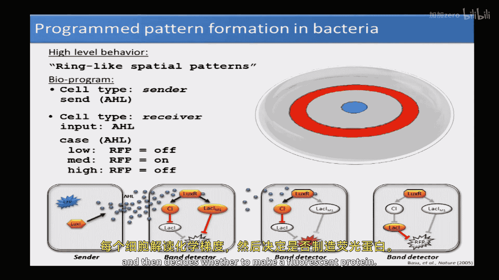
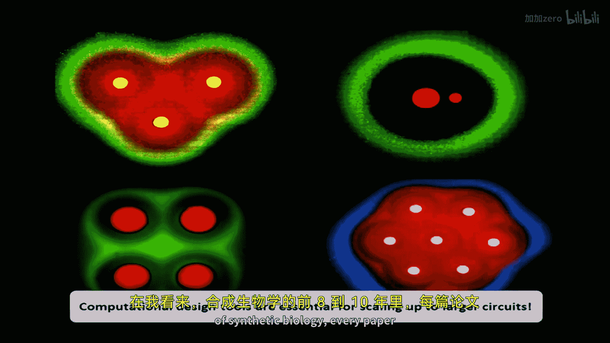
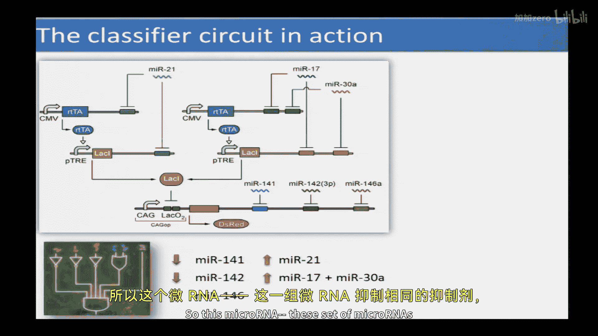

# 【计算与系统生物学基础 7.91J 2014】麻省理工—中英字幕 p21 p20 21. Synthetic Biology： From Parts to Modules to Therapeutic Systems -BV1HdzaYAE2a_p21-

The following content is provided under a creative Commons license。

 Your support will help M I T Open Coware continue to offer high quality educational resources for free。

To make a donation or view additional materials from hundreds of MI T courses。

 visit M T OpenCourseware at OCw。 MT。 Eduu。

と。Okay。Welcome back to computationalal As Bi， we have the honor today of having Professor Brian Weis visit us as I told you on Tuesday。

 he's going to talk about synthetic biology。And Ron is probably from both the Department of Biological Engineering and the Precise department。

Also a founding member of the synthetic biology Center。2。And， thanks for inviting me here。

Did you mention our background， so David actually advised me when I first came to graduate school at MIT。

And at the time， I was working on digital video and information retrieval。

 And they started getting into the business of biology。 This is back in the early 90s。

 And I was like， this is cool stuff， it's really messy。 how can， you know。

 how can you engineer with these molecules。 got the answer。 Yeah， So So we'll see。

 So let's see if the answer is， it does actually work。 So， yeah， so I I， after being， you know。

 a not of non believe， I don't know， nonbeliever。 But I didn't feel， you know。

 it quite had the engineering。😊，Capbilities yet towards around 96 or or so is when I decided to actually。

Kind of make the switch。 And so。I at the time I was working around 96。

 I was working on this notion of how can we use what we know in biology to understand how we program computers and especially situations where you have lots and lots of computing elements。

 I things like smart does。 I don't know people have heard about amorphous computing。

 So back in the mid90s or so， this notion that we would be able to embed computation everywhere was was this kind of exciting notion And I thought to myself where how could I get inspired。

And I thought， well， biology obviously could serve as great inspiration because that's a situation where you have millions or billions of little computing elements that don't have too much power。

 kind of interact locally， but they still perform very robust operations。

 and so I perform a variety of simulations， for example。

 of embryoogenesis in other processes to try to understand what happens in biology and can I again use that to program computers or little tiny computers。

And I remember one day I just decided to flip the arrow。 And basically。

 rather than trying to use biology to understand a program computer， as I decided。

 let me use what I know in computing to actually try to program biology， Okay。

 and so now that field is basically called synthetic biology。 So I've been in that field。

It's hard to count now， but I guess maybe 18 years or so。

 and it's been fun and and has been has not been easy。

 but I think at least we're starting to make some or making some progress。

 I'll try to tell you about some of our efforts there。

 And I certainly encourage you to ask me questions So please interrupt me at any point in time。

 any kind of question is is fair game。 Dave promised me that you guys are a tough crowd。

 So let's see。😊，呃。And you can always stomppy。 Let's， let's， let's try to have that happen。

 So when I look at this。I get excited as an engineer。 Okay， and I think to myself， wow。

 this could be it would be really cool to be able to program something like this again in the same way that we might program computers。

 And so this notion of。😊，Genetic engineering in a direct way。

 in a way where we can create new DNA certainly has been around since the 70s or so。

 And so this notion has allowed us as a community to create various mechanisms that control what the cells do。

 So， for example， transcriptional regulation， translational。

 So being able to regulate things in the cell， being able to create genetically encoded sensors。

 cell cell communication mechanisms， synthesis of various interesting molecules， you know biofuels。

 pharmaceuticals and control physical aspects。 And so that those capabilities have been around before synthetic biology。

 But if you were to ask me how what is different about synthetic biology。

 I would say it's really the emphasis on systems level engineering。 Okay。

 so this notion that we are not just trying to。Engineer overexpression of this gene or that gene a couple of genes。

 but really trying to understand how to create systems of interactions right So in the same way that systems biology has come to the forefront with this notion that you can't understand a cell by understanding what is the exact purpose of this particular gene。

 but you always have to think about it within the context of a pathway within the context of the entire organism。

 in the same way when we want to be able to get cells to do interesting things。

 we have to think about the system as a whole。 And we to get the sophistication that we need we need to understand how to connect these various elements。

 regulatory elements， other kinds of elements in in reliable， predictable ways。

 efficient ways and so on to be able to get the cells to be as programmable as computers so that if you were to ask me what synthetic biology is。

 that would be my。My answer。 And so now you know it。

 and you can tell all your friends that it's a completely defined notion and so on。

 Maybe if you ask other people， they'll give you slightly different answers。 But there you go， so。

How do we develop an engineering discipline out of it。Okay， so that's really。

 how can we get undergrads who come in and take SNbi 101。

 where it's really a well definedfin mechanism and set of methodologies and practices that allows us to do this reliably。

Okay and so we often try to get inspired by how other disciplines approach the engineering of complex systems and so kind of an obvious one would be computing or robotics where there's this notion of for example。

 bottom up assembly and so you start with basic devices and think about how to create modules to have specific behaviors in them and then put those modules and integrate those modules to create these autonomous entities such as robots and we often think about how to create communities of interactions。

 communities of robots in this case and so on And so that's work quite well in a variety of different other engineering disciplines and so we often ask the question。

 can we import these mechanisms into the world of biology So can we take basic mechanisms of regulation it could be transcriptional。

 but could be other modes of regulation and then why these things up to create。

Customizable pathways that we then embed into cells。

 and then we can create programmable communities of bacteria。

 We can create programmable tissues of mammalian cells and so on。 And so the question is。

 you is this， is this a useful and efficient way to approach them。 So， for example。

 how how are these different approach similar。 What can we borrow from here that makes sense to to push on over there。

 And I would say when I started working in syntheticbi。

 most of my efforts were really focused on kind of adapting and implementing these things。

 So adapting them from other disciplines and trying to understand how to implement them into the world of biology。

 But as time has gone by and is we start to understand and appreciate the cell more and more。

 we are also quite interested in how these things are different as well。

 So what makes engineering biological systems， a truly unique。New engineering discipline。 know。

 what would you do in the world of biology that might be different than what you would do with computers or robots or。

 you know， building bridges and cars and plays and so on。

 And so that that's become more more and more of an important focus in my lab。

 And I think in the community as a whole。 although not yet everywhere。

 And you often see situations where people come in from other disciplines and， and just think， oh。

 we'll just program it， you know， engineer just like we do computing and so on。 And it doesn't。

 it doesn't just work like that。So when we approach these task of programming cells。

 we usually divide things up into modules of sensors， processing and actuation。 Okay， so for example。

 we would want to develop sensors that can detect in live cells。

 levels of microRNA name messenger name proteins。And then。

Connect them to synthetic regulatory circuits that we embed in the cells。 Okay。

 so it's important that these sensors， not just， for example， give us fluorescent readouts。

 but it's important that these sensors then connect to the regulatory networks that we have in mind。

 And so that these regulatory networks can then integrate multiple pieces of information and make decisions about actuation。

 So。How do we turn on specific aures specific proteins that will then influence that particular cell or even the environment in a programmable fashion as dictated by the levels of particular sensors as well as by other mechanisms or。

 for example， from looking at historical information that the cell itself has processed as well。

 And so this is I would say represents the paradigm for most of the things that that do take place in synthetic biology And so why do we want to do this。

 it's not to program the next version of the ios or you know iPhone or something like that。

 it's not even though that initially that was one of the things that was discussed。

 it's so not just for the sake of computation， but really for the sake of specific applications。Okay。

 so， for example， if we have really slow logic gates that work on the。

 on the order of hours or even days。That might be fine。If the application， for example。

 is a tissue engineering application。Okay， and so in in synthetic biology。

 initial emphasis has really been on what can we do with microbial。Let's say communities or you know。

 individuals， for example， for synthesis of high value compounds。 I mentioned bioenergy。

 environmental applications as well。 So that that I would say was most of the emphasis there。

 But over the last few years， there's been a growing interest in health related applications。

 And so my lab in particular， looks at mostly health related applications。

 and so I'll give you examples of those today。 Okay。

 and those include things involved with cancer diabetes and and tissues by design。

 And in order to do this， in order to have this programmability， you want to think about scales。

 So you want to think about， you know， how much DNA does it take to do X。Okay， and。

 and to a large extent that controls the sophistication。 it。

 it really is an important defining element。 What we do is the scale of the DNA。

That we can actually engineer reliably， quickly， efficiently。

 predictably in high throughput fashion and in inexpensive ways。 Okay， so we， we would start with。

Things on the order of genes where I would say， you know that's really the basic elements。

 I would say that you know， a single gene that you overexpress or a few genes that you inducibly express。

 I wouldn't count that as synthetic biology but when it gets kind of interesting for synthetic biology when we have the circuitry when we now embed interactions that didn't previously exist in that particular context And so most of synthetic biology it been really at this level right here。

 actually mostly from here to here in terms of the scale of the DNA and now trying to go beyond that more you know。

 along lines， can we create something that's 20000 bases， you know，50000 bases of DNA。

 okay is this something that a graduate student can come into lab and say。

 I want to design something that will take 20000 to 50000 bases。

Is this a reasonable thing to consider Okay， And then the question would be， you know。

 what kind of power does that provide you， what things can you do with thatBeyond that。

 people have explored this notion of minimal life and even full genome rewrites。

 I would say at this point， this is， you know， some people clumped out in with synthetic biology。

 which is fine。 we don't have at the moment really good ways of of being able to engineer minimal life from scratch or even in a really fundamentally different way。

So most of the efforts on minimal life would be， you know。

 take an organism and try to figure out what to knock out， right， as opposed to saying。

 I'm going engineer this this new minimal organism。

 and I'm going to define what reactions to put in from scratch。

 And I'm gonna create a whole bunch of new ones and never didn't exist before。Okay。In the future。

 will we be able to do this， hopefully。Okay， not， you know， not quite yet。

 This is really where the action is right now。 And again， driving force for this is how。

Inexpensive is DNA synthesis。 And then so we're you know following some kind of Moore's law with respect to dropping costs in in terms of DNA synthesis。

 And this is one of the enabling， I don't know if it's the， it's not the only enabling technology。

 but is one of the most important enabling technologies is the fact that it is less and less expensive to be being able to order longer and longer sequences of DNA。

And so this notion that， for example， you'll be able to design something that's， again， this 20。

000 to 50，000 basis of DNA and just go online in order that and have your advisor willingly pay for that。

Not at the level of 20000 to 50000 bases yet， but that's going to change。

 And that's going to get to the point where those， those really become available to everyone。 Okay。

 and I think that's going to fundamentally change how we do business in biological engineering and how we do。

 I would say almost everything in biology as a whole。Right，So if you have。

 even if you don't care about engineering new biological functions。

 but you want to understand biological systems。And your advise told you， well， you know。

 just design a whole bunch of circuits that will allow you to regulate things in arbitrary ways to learn something about the underlying networks that control a natural system。

Again， I think that that fundamentally changes what kinds of questions you will ask。Okay。

 so I'll talk about basic design。 I'll talk about scalability。

 So how do we go from these basic elements to bigger and bigger things。

 And then I'll talk about some， recent things that we're doing where。

You know we're building this foundation， but we think that this foundation then can matter。

 I think we this foundation can change how you approach things that are really don't have the greatest of solutions。

 Now， they really change the paradigm， for example。

 for for cancer for this notion of building tissues by design on chips and。

 and for diabetes and so on。Okay， so we start with parts。Okay， so just about everything that we do。

 we define what are the basic parts that are available in our toolbox。 Okay。

 and so these will be transcriptional regulatory parts。 We do things at the translational level。

 We do things also at the protein， protein level。 One of the things we often do not always。

 is engineer cell cell interactions could be by means of cell cell communication。

We often want to find out what's going on in the cell。

 So just like when we program when we create a new software， new computer program。

 we have debugging outputs that tells us what the program is doing。

 Usually the way we do this is with fluorescent proteins。 It could be with dyes to。 Okay， so they。

 they tell us， you know， here's how your circuit is behaving。 Here's how the cell might be behaving。

 And another set of parts would be ones where we want to be able to create sensors and auators inside the cell。

😊，What are specific biomarker levels， How can we affect what the cell is doing。For example。

 one that gets used a lot is kill the cell。 is one of the favorite actuators that people are using。

 Another one would be， let's say， tell this stem cell to differentiate into a different cell type。

That would be another kind of actuator。 A different one might be make the cell make this， you know。

 high value compound。 Okay， that would be relevant for some application。 And so right now， you know。

 if you're looking for parts。They， they actually used to be stored here in Stata up until or big libraries of synthetic biology parts were stored in Stata up until about two years or so。

 Okay， so I don't know how many people know about I gym。Any folks know about IGM。

 so IGM was started at MIT。Was headquartered， as I mentioned again here in Stata。

 There are these couple of big freezers that were on the I think， fourth floor here。

And they stored 5000 to 10000 parts that were commonly used by synthetic biology folks。 Okay。

 so now they moved over closer to Cambridge brewrewing Company and they're not。

 not affiliated directly with MI T anymore。 and they have you know，15000 parts or so available。

 So if you want to get started in synthetic biology。 This is one quick way to do that。

 You can contact IGm headquarters and say， please send me you know，1000 parts。Okay。

 and as long as you're credible and not from， you know， one of those blacklisted countries。

 then they will typically will send it to you。 So it's a good way to get started。Okay。

 so what are these parts。 So this is actually going back to my PhD here。

 This is one of the parts I characterized。 So this notion of an inverter。

 So a digital logic inverter。 So I assume people here。 everybody's familiar with the logic gates。

 Is that true。Okay， raise your hand if you if you are familiar with it。 So I just w to see， okay。

 so just trying to kind of calibrate。 and again， ask me questions。

 So this notion that you have a single input， single output device that has that works on binary values that has basically inverts a signal。

 You have  zero on the input， you have one on the output， one on the input。

 you have zero on the output。 And so the way one of the ways in which you can implement this in a biological system is just use transcriptional repression。

 Okay， so if you have no repressor present， then you have a high level of the output protein。

 if you have an repressor present represses the production of the output protein。 And so in theory。

 you should be able to use this as a digital logic gate。Okay， and so that was， you know。

 sounds looks pretty simple here。 But for my PhD， it took me about three years to do something like this。

 just to give you an indication。 Now it's a lot faster。

 Now you can do this And you can then do many of those in a day。 So that has been pro。

 Here's another one of those gates that I use for my PhD。 And so this is now not just a repressor。

 but a repressor that can be inactivated by small molecule。Okay。

And so the way it works is you have this repressor that works as before。

 And then if a small molecule comes in， it prevents a repressor from binding the promoter。

 And as a result of that， even if the repressor is present。

 you can have activation of the output protein。 Okay。

 so this is what's called a not a not X or Y or it implements the implies logic function。

 I think people have used the implies logic function to do anything。Okay。

So it's not a commonly used logic function。 but and you won't find it。 You know。

 there's no logic grid that does the implies logic function in a typical computer。

 but this is a useful logic function that we can implement in cells and allows external control of gene expression。

 Okay， And so this， this is a simple way。 And so once you can do that as a user essentially。

 you can interact with a cells and modify what's going on inside the cell。 Okay。

 using a pretty simple looking mechanism that was， you know， predates synthetic biology， if you will。

 But I don't know if that was called the implies logic function before。 So anyway， So then。

Logic gates， Can we build logic circuits， This is where I would say it entire biology starts kicking in。

 And so this is one of the first logic circuits that we built。 And the question was， okay。

 looks nice to have this logic gateit representation in biology。 Does this make any sense at all。😊。

Can you really do digital logic？Inside cells。Can you take noisy biological components。

And actually implement reliable digital computation themselves。 And， and its。

 it wasn't an obvious thing。I would say， you know， is it 100% obvious now， in some situations。

 I think we can claim that we can build digital logic that's reasonably reliable。 Okay。

 so in this particular case， I'm showing you this implies logic function that allows us to have small molecule induction of a cascade of logic。

 not logic gates or transcriptional repressors。And so the nice thing about this in particular is the fact that this is the input output steady state is that as the circuit so goes from blue to black to this yellow color here。

 as as the circuit gets longer。😊，As a cascade gets longer， it actually becomes more digital。

 It actually becomes more steplike。Okay， more on off。

 So we're going from this blue input output function to this yellow。

 So now we have over 1000 fold change in the output in response to 2 to4 fold change the input。Okay。

 and we have good noise margins， good signal restorations， all these thing。

 all these good things that we need to have for the creation of larger and larger reliable digital circuits。

Okay， so the basis of digital computation is that you have and the reason why you can actually create computers is that you can have log gates。

That do signal restoration。That the output。Is a better representation of the digital meaning than the input。

Right，So as the signal propagates this analog signal。Could be voltage。

 but it could be protein concentrations。As it traverses through the logic gates。

It needs to actually become cleaner in order for us to be able to have reliable digital computation。

Okay， so they've people figure out how to do this with electronics a long time ago。

We've figured out how to do it with synthetic biology。 you know， let's say 10 to 15 years ago。

And natures figure out how to do this billions of years ago。 Okay， so things like。Cooperativeivity。

Okay， so I assume you've looked a little bit on cooperativeerivity and let's say， gene regulation。

Okay， so that is a situation where you get a non nonlinear response in a system。

The biology is figured out is a useful mechanism so that signals that come in actually result in some kind of actual digital behavior。

Okay， so you get non nonlinear signal processing in these regulatory elements。And at the end of。

 let's say， a signal transduction。Cascade。The output is either high or low。 There's no， you know。

 for the most part， there's no in between。 the transition between high and low is super fast。Okay。

 so in a sense， that's creating digital or discrete outputs。

And that that's really critical for many situations， certainly in synthetic biology。

 but many situations in biology as well。 So one example would be， let's say。

 stem cell differentiation。You want the cells to be able to make a discrete decision。 You know。

 should I make， Should I become， you know， a kidney cell or， you know， liver cell or you know。

 a muscle cell and so on。 So those are discrete decisions that have to be made by the cells。

And so they， the cells have come up or nature has come up with mechanisms to guarantee that。

And so we've now figure how to do that ourselves in a synthetic fashion as well。

 It's important to note that when we engineer these systems。

 we don't just think about digital behavior。Okay， so we spend。An equal amount of time。

 perhaps thinking about how to implement things that have transient properties or things that have more kind of analog。

Behavior to them。 And that that's absolutely critical to be able to program cells to do whatever we want。

 So this is an example where we have engineered cells cell communication where cells。

 sender cells make the small， diffusible molecule， which then goes to receiver cells。Okay。

 and so now the receiver cell don't just have an on response， but rather they have a pulse。Okay。

 so a signal travels from one from the sender to the receiver cells。And the cells。

 what we engineer them to do is have a pulse response。And the idea is to have GFP go up。

 a green fluorescent protein go up， and then go down。Okay， and so to be to be able to do that。

 we engineered a feed forward motif where we have binding of this small molecule to this activator。

 which activates two things simultaneously simultaneously a green fluorescent protein and a repressor。

 which then represses the green fluorescent protein。😊，Okay， so， and then。

 so the idea is that the green fluorescent protein goes up。 And then eventually。

 the repressor builds up to sufficient levels to repress the green fluorescent protein。Okay。So。Again。

 one of those simple looking。Motifs。This is about three years。

To actually make that happen around the 2004 time frame。 Okay， look simple。

 If you study a naturally occurring system that has this motif， you say， oh， yeah， no problem。

 You know， yeah， we have this， you know， feed forward motif。 And obviously。

 you can do this kind of information processing function。 You know， let's move on to another motif。

You actually try to build this in the lab in the new organism。You know。😔。

I'm not sure if we can drive you insane， but it is， It is not trivial to actually make it work。

 It's much easier now than it was 10 years ago， but you still have to pay attention to a lot of things。

 you know， Ray constant threshold matching and so on。 to actually make it happen。 Okay。

 But eventually after looking at creating， So this is our first attempt that this was this blue line right here。

 So completely flat line。 Okay， input comes in。 Nothing happens。Okay。

 so I would say that pretty much typifies synthetic biology maybe up till today， you build something。

 you think it's gonna work。 It doesn't work。And then， you know， you stop crying after a little while。

 But then then you have to think， think about how， how do I fix this。 Okay。

 And so there's iterative design， debug cycle is， is absolutely critical。

 And so what you normally do is you create computational models that tell you how different rate constants in the system。

Affect the behavior of your circuit。 Okay， for example， you can do sensitivity analysis。

 which rate constants have the most influence on the performance of your system。

 And so we did some sensitivity analysis here and learned that， for example。

 the degradation of this repressor makes one of the things rate constants makes the biggest differences on the performance of the system。

 or its affinity to the binding site on its respective promoter。Okay， yes。

No。I wish it was。Because that would make thing life a lot easier。

 And we are trying to get better at that。 So we're trying to。The so here's， you know。

 maybe two ways of thinking about that。 One of them is1，1 challenge would be somebody comes in。

 gives you a DNA sequence。 and you have to predict the rate constants。Okay。

 so I would term that person an adversary， not your friend。Okay， it's， it's just too hard to do that。

 Just now， an easier task would be give your adversary or friend。Limited choices and say。

 in the freezer， I have these DNA sequences that consists， let's say of specific promoters。

Specific rib and binding sites。Specific proteins with specific degradation tags on the proteins。Okay。

 and that's you're allowing that adversary or friend to only use those elements in the design of a circuit。

 And then they come back to you and they say， now predict what the circuit will do。

You still still doesn't work yet。 But I think， but I would say that's how we would phrase the challenge。

 Okay， stick to things that we know and allow us to even characterize those things ahead of time。

What we have that。 unfortunately， I don't have that here。

 but what we have then people can get it kind of a general characterization So they can say。

 you know， it'll be roughly this input out of behavior。

 And when I say roughly the errors could be on the order of。5 to  ten fold。Okay。

 that's that's approximately what's been published so far。Now，5 to  ten0 fold， you know。

 depending on your perspective， could be great because it's biology or could suck， you know。

 if you're an engineer， right， It just depends on your， you know。

 if you're trying to do something like。Get green fluorescent protein to turn on and off。

 Tenfold is probably great。 If you're doing this in a petri dish。

 If you're trying to create a cancer classifier circuit that you put into humans。😊，To， you know。

 kill cancer cells， but not harm healthy cells。 Tenfold is probably not great。 You know。

 I wouldn't take a circuit like that into me。Right。If that， especially if that circuit controls。

 for example， you know， the production of a killer protein， which I， you know， I'll。

 I'll try to show you a circuit that does that。We recently have been able。

 We're in the process of submitting a paper about this。

 been able to show that if you have really good characterization of。😊，Regulatory elements。

 such as these repressor devices。And you have to do a lot more characterization。 And you do that。

 We can get within。20%。On average， on predicting the behavior。Okay， in mammalian cells， actually。

 and so。As an engineer， I， you know， I'd be happy with 1020% for many， many applications。So。

 so I think we've gotten better at it。 But， you know， it's not， not quite perfect。

 One of the things about that approach is that we don't necessarily know the rate constant for everything。

What we do know， however， is a very detailed。Behavior。

Both steady state and the dynamic behavior of a repressor promoter pair。Okay， so we don't know。

 for example， what， what's the binding you know， affinity or what's a rate constant for that repressor binding the promoter。

 What's the rate constant for RNA polymerase。Bining that promoter。 What's the exact translation rate。

Or transcription rate to。 But we do know what's the input output behavior。And that。

 that's actually been enough to， to get really good predictions。But I， I would say。You know。

 these kinds of predictions。Are one of the most important aspects and challenges in bottlenecks of synthetic biology。

 So those include， again， the challenges include how fast can you build DNA。

 But wouldn't it be nice if you can actually predict what the DNA does。

Right so it's just as important， if not more。And also having， so。

 so those are two of the important challenges I say， I would say another one would be， okay。

 so if you can predict things， how many parts do you have in your freezer。

That you can actually put together and they're well characterized to actually now build the circuits。

Probably three of the most important challenges。And so if you go back to the。

 the what we call the pulse generator， this is a loop tape of bacteria that now respond to the pulse。

So sender cells that then secreted the small molecule that went into receiver cells。

 and they light up。So one of the things to note here is that it works。

The other thing to note here is that it's not perfect。Right，And so the amount of heterogeneity here。

 I think is， is quite astounding。 right， So if you take the average behavior。

It's actually quite predictable。 But if you now start looking at the distribution in the response。

 it's staggering。And we quantified that。 And so we quantified what's the distribution in terms of the fluorescence levels。

 the peak and also the buildup and so on。 And we， we then correlated that。 Also。

 we created the stochastic simulations that then correlate reasonably well with a system so we can get a。

 you know simulations that generally correspond with what we're seeing at the population level。

Now， but I， I do want to bring up this point that when you think about engineering biological systems。

Don't try to figure out how to engineer a single cell to do something。Reliably， okay。

 so you always want to think about kind of statistical engineering。 You want to think about。

 I'm gonna create a circuit。 And when I put this circuit into a population of cells。

 this is the distribution of behaviors that I'm going to get。Okay。

 because if you're trying to depend on any individual cell giving you exactly the behavior that you're looking for。

 it is just， it's gonna fail。Okay， so you have to really think about distributions and， and not。You。

 I think changes things a little bit， right， So that's not normally the way you think about maybe that's the way I Microsoft think about programming。

 So， you know， if 90% of the time the computer doesn't crash， that's pretty good。

So probably Bill Gates agrees with that man。But that's not what we want。 you know。

 that's not what we typically do with software。 So to kind of。

Further think about this in terms of populations。 We programmed something else。

 which was pattern formation。 So now we have the desire to create senders and receivers。

Where the senders send the same message to the receivers， now we have a longer feed forward motif。

Okay， so， so this feed forward teeth has two branches。

And so these two branches actually have the a different impact on the final output。

 One has this two repressors， meaning that input comes in。 It activates a fluorescent protein。

 and another one represses the fluorescent protein。Okay， so it's an incoherent feed forward motif。

Okay， and so what we use that here is not for post generation， but rather to define。

A range of concentrations。That would be， would turn on the final output。Okay。

 so it would be activated。 The， the range of concentrations would be activated starting with this branch right here。

 and then ultimately repressed by this。 So this defines the low threshold。

And this defines the high threshold。 So under the low threshold， nothing gets activated。

 whenever you have just the right amount， it represses this it activates this， which represses this。

 which allows this fluorescent protein to get turned on。Okay。

 so this branch right here is more sensitive。 So it defines when this thing goes up。

 when the response goes up。 And then this is less sensitive。

 So this defines under high concentrations when the output goes down。

 So we basically have a nonmonatonic response to the input， which is low then high than low。Okay。

 so that's， that's the design that we had in mind。And the idea is that whenever you put， let's say。

 receiver cells everywhere in a Peri dish and you put sends in the middle。

 then the communication signal basically builds up。 there's a chemical gradient。

 Each cell interprets the chemical gradient and then decides whether to make a fluorescent protein。

And then only because of there this steady chemical gradient due to diffusion and decay of the signal。

 then you would get some kind of a bosi pattern。 Okay， so that was， that was a hope， at least。

And so to give you， again， a time scale。 So it took me about。

 I think three hours on a plane once to make the slide。

It took us about three weeks to create the computational model。 And again， for whatever reason。

 three years was the magic number to create the actual functional circuit。😊，Okay。

 so that was an older version of PowerPoint。 but I haven't tried it on the new。 But anyways。

 so we created this。 this is a computational model。 We actually use a computational model to predict。

How changes in rate constants。Would affect the this band detect。

The region we're actually responding to the signal， and we use that to engineer different responses。

And so we created eventually three different responses， input versus output。

 And we put different fluorescent proteins on them。

 A red fluorescent protein and a green fluorescent protein。 This is experimental setup over here。

 And after 16 hours of waiting， this is basically what we got。 So we got a lot of bacteria to make。😊。

All kinds of patterns。 And we were very happy about this。

 We danced around in the lab a little bit and really， yeah， you know， so this was fun。😊。

On those rare occasions， where things actually work right， So we said， let's have some more fun。

 And so we put senders in other configurations。 And so we had programmable patterns of bacterial communities。

😊，O。So I'm not sure， you know， is this useful， I'm not sure by itself， besides having， you know。

 having some fun with it。 But one of the things that we're using this for right now in。

 depending on time， I may get to that later， is this notion of embedding these circuits in mammalian stem cells or actually also in human I S cells。

😊，So that we engineer these human I S cells to communicate with one another。To make decisions。

 And then those decisions actually lead to differentiation patterns。RightSo you can imagine。

 in principle， if you can create three dimensional versions of these and use those to cause the cells to make differentiation decisions so so that red would mean you know。

 make neurons， green would mean make muscle， you know， different colors。

 yellow would mean make bone and so on。 So in principle。

 you might be able to create tissues by design。Okay， so that's。

 that's something that we are working on actively in the lab right now。

 So we don't quite have a working heart in a Peri dish yet。We won't for a little while。 but we are。

 you know， taking some baby steps along the way。 And so we have been able to get cell cell communication to work。

 We've been able to get programmed stem cell differentiation to work and hopefully I'll be able to show you some images that we have of some recent examples where we take human I S and actually created created these。

😊，Embryonic liver buds。That have lots and lots of interesting。 And actually。

 all the cell types that are known to exist in the embryonic liver。Okay， so， so there are some bit。

 you know， some， some progress along the way。 Now， we don't anticipate to replace your liver。

 you know。Anytime soon。So don't destroy yet。嗯。But， so what actually。

 one near term application would that we're specifically looking at is if we can take。

 imagine taking your own， you know， fibroblast， de differentiate them。

 de differentiating them into human I S cells。Those are your， you know。

 human I S cells and then differentating them into like this liver， like environment and put that in。

 you know petri dish and then test out the effect of drugs on your mini liver。Okay。

 so maybe it's a good idea to test drugs and things that resemble， you know。

 human tissue as opposed to some random mouse that may or may not be as correlated with what with the drug would actually do to actual human cells。

 And if we actually even do it in the patient' specific manner。 I think that really changes you know。

 the way drug development would actually work。So that。

 and that's something that I think within the next few years could become a reality， right。

 talking about， you know， the next。beginningginning to do that within the next one to three years。

In a laboratory setting。So I think that is， that is near term and realistic。Okay。

So one of the things that we did notice is that。When we engineer these small systems。

Its intuition works quite well。 So I can， I can look at this circuit design and say， you know。

 if I modify this， this is what's gonna happen。 If I modify this， that's what's gonna happen。

 So you can use intuition and it works reasonably well。 And what happened， I would say the first。

 you know，8 to 10 years synthetic biology， every paper would have a computational design。

 but mostly those were we build something。 And in order to publish。

 we also tacked on you know computational model that correlates really well with the experimental results。

 And we are just as guilty of doing that as anyone else。 Okay， so it wasn't。

 it wasn't critical to have a computational model。😊。

To create something successfully in the lab。And I think that that is changing。

So we have examples right now of designs where and that would be I'm not sure if I'll get that to that today。

 but we have published on that designs where it involves about 20 to 25 components。

And it's related to a diabetes system that we're trying to engineer where we can have intuition about it。

 But our intuition doesn't work great anymore。 Okay。

 so we might have some intuition about the system but the computational analysis would all of a sudden shed light and provide insight that is very difficult to get just by drawing this thing on a blackboard。

Okay， and so so I think that computational design tools are becoming absolutely essential。

 they can provide insight into system behavior that you can't get just using intuition alone。

But in another aspect of computational design is one where imagine being able to， to specify what。

 this behavior。And then the computational design tool says here's 1000 different versions of circuits that you should build and test。

Okay， and so it's still difficult for human to generate easily 1000 different versions of a circuit to build and test。

It is becoming easy。To actually build， I wouldn't say。ItMaybe easy as a strong word。

 feasible to generate 1 thousand versions of a particular circuit。

 I'll give you an example very recently in in my lab。

 one of the graduate students has come up with a framework that he's generating 200 versions of a circuit in three hours。

Okay， and they're pretty much gotten to the point where they're all correct。Okay， in three hours。 So。

 so that really， I think， changes。What you do in synthetic better biology， right， And so so again。

 having that。Be connected to a computational design tool that tells you which ones to build would be rather useful。

Okayect。And so specifically recognizing that， this is a collaboration with some folks at B BN。

 And actually， Jake Beaale was one of my former graduate student colleagues。

 So he was in in the same。Lab is me。 And then Doug Densmore is from Boston University。

 And so the notion here is that this is what we want synthetic biology to look like。Okay。

 so if youre try or maybe all of biological engineering， but we'll start with synthetic biology。

 So if you want to program biology。Should you really care what the ribism binding site is for the Lada repressor。

You know， hopefully not， right， what you should do you know， just like when you， you know。

 you program your simulations in Matlab， you don't think about well， you know。

 here's the shift register in this Intel pentium chip。 And this is how it's working to simulate。

 you know， this， this O D E over here。 That's just not the level at which you program。

 So you think really at a high level。 And then you have compilers and lots of infrastructure that takes care of everything in between。

And so maybe some day in the future， you know， the the graduate students。

 maybe 5 to 10 years will look back at synthetic biology graduate students now and would just have a lot of pity for them and。

 oh my God， you actually had to know what elements you're using in circuit and actually build them by hand。

You know， wow。And so here's， here's a notion that we start with a high level description。

 and by the way， this is now there's a website that you can go to right now。

 get a free account and then type in a high level program and it will actually create。

A low level genetic circuit representation。 And also， I give you Matlab simulation files of this。

Okay， and so in this course that I'm teaching to undergrads right now。

That many of them didn't even hold pipettes when before they started the court。

 the one of the first things that we taught them was this tool。 So before telling them， for example。

This is the way the lac repressor works by DNA looping。

We said there are these things called repressors。 and when there's more of them， there's less output。

Okay， now let's design with that。Okay， this is， I think heresy to biology as a whole。 Probably。

 I don't know that this is the first time we've actually tried to do that。 So。

 I think it's actually worked out okay， but you know。

 teach them enough so that they can move forward and then， you know， yes， let's。

 let's simultaneously be teaching them about， you know， the underlying。😊。

Biology and mechanisms as much as they need to know。 But， you know。

 what can they do if they just know that， you know。

 there's this thing called a transcriptionural repressor。

 And then the biocompilr will figure out everything that needs to happen。Okay， and so we're actually。

 so they did a whole bunch of designs。 And starting next week， we're gonna be testing them out。

 So we will find out whether that was， you know， a useful way to teach biological engineering。

 But I think， I think so I think it is。Because they seem to understand what design means。Okay。

 because that's the thing that we focus on design as a kind of a first class object。Okay。

 so what you do is you write code that looks like this。Anybody。

 anybody programming code that looks like this。So it should be。 So Lisp， okay。

 one person only in computation， well。Okay。We usually get one or two people。

 but I was hoping for more here。 So anyways， for the people that should be ashamed of themselves and having programming list。

 this is， this is a simple program。 This is if the input is high。

 produces sign fluorescent protein else produce a yellow fluorescent protein。 Okay。

 and so the biocompilr， then automatically takes that。And first translates that into a data flow。

 So you have a data flow。 And I'll actually go through an example of that。

And then creates an abstract gene circuit and then looks at essentially what you have in the freezer and says。

 well， this is the actual DNA sequence that would implement this。

And then it creates robot instructions to assemble this so that， you know。

God forbid you would have to actually touch a pipette to build this。 And then we have a robot。

 liquid handlingling robot that does most of the assembly。Okay。

 now this pipeline doesn't is not fully end to end yet。 So it's not， you know。

 if you came to my lab right now， this still， you know， I could tell you that this works。 but then I。

 I would be slightly lying。 It mostly works。啊。But it's actually， there are companies right now。

That will go from this level about this， like not this level， But this level。 and actually。

 this is mostly automated。So to the point where the only thing that's not automated is somebody in not necessarily Europe。

 but maybe a technician goes and goes from a robot and takes a plate and puts it in another robot。

And like， everything else is essentially automated in DNA assembly。Okay， so those companies have。

 I guess， more money than us。 But eventually， this is the way DNA assembly will happen。

 So we're collaborating now with some people on doing this with microfllys。

 The problem with this robot is's $150000。 So we can't， you know， put it on everyone's bench yet。

But we are collaborating with Lincoln Labs to have microfluidic devices。

That would cost around $3000 that would do this。 And we've already demonstrated that with the microfluidic devices。

 we can do DNA assembly of large circuits。Okay， so this is not， you know。

 this is not that far away that everyone will have microfluidtics。 They， you know。

 program here and they get the DNA assembled。And then they realize it doesn't work， right。

 but at least there'd be a lot faster to realize that things don't work。Which is good。Okay， so let's。

 let's look at how this compiler biocompilr works。So to see that it's not magic。

 So this is saying green， if not IP T G。 So IP TG is a small molecule that we have a sensor for。

 and then the information gets routed to an inverter which then gets routed to activate a green fluor some protein so you can take a program specified like this and automatically converted into a data flow graph。

And then the data flow。Can be translated again。 This is automated。

 and this is also automated in a rather simple way to an actual portions of the gene circuit。

 So IP T G sensor is simply this motif。 So you have a repressor that responds to IP T G。

 And then it basically inactivates the repressor。 So more IP T G more output。

 And so this is the IP T G sensor box。 And this is how you implement this。Nodgate。

 so I showed you how Nodgate already works。Okay， so repressor represses the output。

 green fluorescent protein。 You just have to have an activator that activates a green fluorescent protein。

 Okay， so every data flow box can automatically be converted into a small motif。

And then what we're missing is the glue。And so the glue is just these transcriptional activators and repressors。

 And so once you put them in there， then this is a circuit。

 So this is an automatic way to go from here to here。Okay， and it can do rather large。

 rather complex。Circuits and logic。 It can't do everything yet。

 but it can do an interesting set of things。Okay， so you know， this is， again。

 it's not completely finished in the sense that I haven't told you what A is。

 I haven't told you what B is。 So there's a whole bunch of things that still are。

 we have either published on or still， you know， need to be designed。 But， but there's， for example。

 a tool called matchmaker， which will decide what's a good protein A， What's a good protein B。

So things like that。 So they， those things already exist。

Anybody look at this and figure out why this is not perfect。So we have an input。

 that represses a repressor。Which means that more input， more activ oh sorry， more input。

 more protein here， which represses B， which activates GFP。

OkaySo the compiler spits that out automatically。But you may not want to build this right away。

Any ideas why。就家。So basically， what happens is A can大。あしで願に。

so this is what the first version would be， but A represses B B activate GP。

 so why not just hook A up to regulate GP directly so this seems like a non-opical solution。

 and so you can get the compiler to figure that out too and so what you do is you say copy propagation。

 so these are actually just tools that are available these are mechanisms that are part of normal compilers。

 normal software compiler。So they do something called coffee propagation means that A。

 if it sees that A， it compilees A regulates B， A represses B and B activate it this。

 you can just say， well， let A just directly regulate this。

And then the compiler realizes well we doesn't do anything， let's get rid of it。

And then the promoter doesn't do， and let's get rid of it， and now the compiler figured this out。

And that's using just basic compiler technology， so it's able to do that。

 so the difference in your life between4 and 30 may not be huge。But the difference in your life。

Between 15。Okay， and。5ve。It could be the difference between getting a PhD or going and saying。

 dropping out and starting a company， becoming a billionaire。

Okay so but this is what the compiler can do， I mean that does make a difference and it may be able to come up with optimizations that you wouldn't be able to really easily come up with for even at all under a reasonable amount of time。

So the compiler can do combatorial logic and can do state。

 there's also some aspects so that they can do spatial things as well。Okay。And again。

 this is available online right now。呃。I'm going to maybe I should skip a few things。

 so very quickly I'll tell you， so in the labs it's nice to have bio compile。

 but if you can't do anything in the lab then，If nobody believes you in the world of biology or synthetic biology。

 so we can build big things。 So here。You canThere's a library of promoters and genes。

that we have available。 and you can decide， I want to build a new circuit that has these promoter gene pairs。

 And within five days， you can create in the lab that circuit。

 And we've been able to demonstrate things that are 61，64 K B。

That you build in five days and you build them efficiently。Okay， and then the folk。

 the undergrads that were teaching also have been able to， again。

 these are people that barely knew what pipepes are in the beginning of the semester can now efficiently build large circuits。

 So that， that's become。You know， an easy to use technology。Okay。

 and then I mentioned this notion that， you know， you can build this one at a time。 But this。

 this very recent development， we you can build。200 of，200 version of the of these at a time。Okay。

 so you can build them。 We can then， again， I'll skip this part。 You can build them。

 You can put them into mammalian cells。 These things work。And we have lots and lots of parts。

 regulatory parts。And so。We have， let me skip this particular example。

 So this is the two sentence explanation is， okay， you build lots of parts。You can build modules。

And then you put modules together and guess what， This is biology。

 So these modules actually affect each other potentially in undesirable ways。

So they can place things like load。 So whenever you have a module that is works really well。

 maybe I will show you one，1 slide， but I want't show how we solved it。 But one slide。

 So this is a circuit。Any idea what the circuit might do。 So this is a regulatory circuit。

They you have an activator activating itself and a requestor that requestes the activator。See。

 have you seen this motif。这这。Some people are whispering to do this so this is a relaxation oscillator。

 When you do it by yourself， it works great。And then， so these are simulations。 But then if you con。

 if you connect it。 So it's nice to have an oscillator in a cell。 again， if you w to have blinking。

 you know， bacteria or mammalian cells。😊，Right， which is， again， fun。

 But then you typically want to connect it to something。 So you spend， you know。

 three years building an oscillator， got it to work。 And now your advise said， okay。

 let's just get a paper on this。 But before we get the paper。

 I want you to connect it to something meaningful because we want to go for a high impact journal。😊。

And then you connect it to something。And you realize that it doesn't work anymore。😔，Okay。

 I see I think you're really pissed off at your a。 You will be pissed off at your advise。😊。

I don't know if your advisor wants to be mean to you。 but but anyways， so that that's。

 that's a real problem in in biology or synthetic biology is that， you know。

 these things have impacts on each other that first of all， were are gonna to be undesirable， but。

 but come because of unique aspects， for example， of the， of the substrate now。

They're not as unique as you might think， because these load issues also come to play in electronic circuits。

 And so in electronic circuits， these things have been solved decades ago with these notions of load drivers。

 So if you have a module that has， for example， high fan out。Then and it controls many things。

 Then guess what， those things that it's trying to control。

 even though the arrows are pointing one direction。They actually have an upstream effect， too。

 So those modules that you think you're just the module。

 the downstream modules that you're just controlling。 they actually have an impact on the upstream。

 So what you do in electronics， So you just build a load driver and that basically takes care of things。

 And so now that there's no kind of parasitic effect。

And so we've demonstrated that we can also build。 So this is a notion of retroactivity。

 And this is work with Damatil Dveio here。And we've demonstrated that we can。

 So I won't go into the details here that we can actually solve this。 So this is a real problem。

 even in simple circuits experimentally。 and then。And it uses this cool notion of time scale separation。

To solve it， but we can take。These things that are highly effective are going from black to red and put a low driver in there and fixes it。

Okay， so this should hopefully lead to the generation of much more predictable circuit construction。

Okay， targeting。One of the real challenges in scaling， going from you know。

 simple toy modules to large scale systems。Okay。嗯。So I' skip that and then move on to another example。

 Oh， sorry， an example of an application。So in this particular case， again。

 besides turning GFP on and off， what can we do。With synthetic biology that we can't necessarily do with without synthetic biology。

 Okay， and so one of the most important challenges。In in cancer therapeutics is specificity。

 perhaps the most important。There are other things that are important。

 such as delivery of a therapeutic agent。 But as you improve specificity。

 that it can actually change how you do delivery of a therapeutic agent。

 So if you have a therapeutic agent that's much more specific， you can and has no side effects。

 you can deliver lots and lots more of that。 right So， so these things are highly related。

 So imagine。A therapeutic agent that recognizes something on the cell surface and then says。

 this is a tumor cell， kill it。Okay， so there are actually a lot of efforts ongoing that have this particular approach。

So whether it's small molecules， whether these vesicles that contain various surface。

 various molecules that bind to cell surface receptors。

A really hot area right now is these engineered killer T cells。

So this notion that you can actually engineer your immune system。

By placing various receptors on these killer T cells， which then go and then bind。

Tumor cells by recognizing something on the cell surface。And then， kill those。Okay， sounds great。

 maybe depending on your perspective or not so great， depending your perspective。

 So what what's happened with those is they're really sometimes great at eliminating the tumors。

 But then the side effects can be horrendous。 And so what happens is that those cell surface markers that exist on the tumor cells。

 guess what， they're also present on healthy cells as well。

 And so the side effects for those killer T cells approaches have been I mean。

 just just terrible in in various patients。😊，Okay， so one， this should not be a shock one。

Marker is typically not enough to distinguish a cancer cell versus a healthy cell。Okay。

Seems pretty obvious。 So what， actually， what they've been doing with these engineered killer T cells is now。

 not just saying， okay， has to be this cell surface receptors， but also cannot be this。 So it's like。

And biomarker1 and biomarker1 and not biomarker2。Okay， so they。

 they're starting to engineer more logic into these more multi input logic into these things。

 And so they haven't done any clinical trials， but they I saw a couple weeks ago where they've actually made progress in in Peri dishes okay so we。

 we recognize this as an issue several years ago。 and this is work with Kobe Bennson。 And so。Really。

 all the information that you want is actually inside the cell。To。

 to make a highly precise decision about whether this particular cell cancers or not。 Okay。

 so the idea is with the therapeutic agent goes in make does the computation by integrating multiple pieces of the sensor information and then decide whether to express a killer protein or not。

Okay， now， you know， even if this is not the cure for cancer， you know。

 can't really guarantee that right， but even if this is not just this notion of being able to create multi- inputput circuits that go into cells and analyze in live cells。

 real time， what's going on in the cell with various molecules that might be interesting that has you know applications I would。

 again， say just about anywhere you can imagine in biology。Okay， so one of the things， for example。

 we're looking at， I mentioned this notion of organs on a chip or programmed organs on a chip。

 So one of the things we're looking at now is placing these types of sensory。Circuits into cells。

Within within this organ on a chip。And so the idea would be exposed cells to these drug candidates。

 And then the cells light up in different colors to tell you how they're responding to it。 So。

 for example， you know， certain color green would mean just fine。 you know。

 green with red and yellow would indicate that， you know。

 some apoptotic pathways being expressed or this drug is affecting this。You know。

 proliferation pathway or this pathway or that pathway。 And so these mechanisms can tell you。

 in real time。In single cells， you know， also spatially， what， what kind of impact there is。To。

 let's say， the drug candidate that you're looking at。OkaySo so again。

 this is something that I think would have an impact， you know today if it was available。

 but realistically you know， making prototypes within the next year to three years。 Okay。

 so we started with looking at hela cancer cells as an example。

 and so we did some bioinformatics and we saw that based on microRNAnate profiles that were available to us。

This would be a biopro。That would distinguish heal cells from all other cell types。Okay， and so。

Some of you are familiar with this way of annotating logic。Maybe okay， it's pretty ugly。

 but if you're not used to it， but it's simple。 this just says these microRNAs have to be low and these microRNAs have to be high。

 and that's a hela cancer cell。 Okay， that's the basic logic in this。Okay， so it's a。

 it's a rather simple logic statement。 What we would argue is that every cell type。

Would have a logic statement。That would be true of that cell type。And not true of other cells。Okay。

It's， it's almost by definition。 There's something different about that cell than than other cell types now。

It gets interesting when you start talking about heterogeneous population。 So， for example。

 and that's， I won't get into details about that。 but there's， there's heterogeneity。

 there's heterogeneity in， you know， tumors。So the cool thing you can do。 This is a6 input end gate。

😊，So if you have heterogeneity， what you can do is you're going have a six input end gate with an ore operation。

So you can identify， you know， this subpopulation of the tumor has this microRNA profile。

 and this subpopulation has a different microRNA profile。

 And all you have to do is create a new logic circuit and just combine them as like a cocktail drug as an orgate。

So this this is a really general approach and I think should be relevant again for any kind of population。

 And you can also set the thresholds and have all these fun things that you can do with it。So。

 so I think the question really is。Is that micronic expression profile？

Sufficiently small so that it can be encoded on a circuit that you can deliver into cells。

And can you do it reliably。That， that really is， is the， is the challenge。Okay。

 so the idea is that you have a therapeutic agent goes into a cell does a computation and then decides whether to make a killer protein or not。

 so how does this actually work？So how do we implement？An end gate with inverted inputs。Okay。

 so that's one portion of the circuit。So it's actually for my RNA， it's actually pretty easy。

So what you do is you put micro target sites on the gene of interest or the apple gene。

And so the idea is that the only way that is。Gene is being expressed。

 This output protein is expressed。 is when this is low and this is low and this is low。Okay。

 so in principle， this is pretty easy to do。Okay， so that's how we have a three input aimed with inverted inputs。

 And now we can add logic to that。 So now if we want to make sure that the output is high。

 also when just this， when this input is high as well。And so what we do is remember the first。

Circuit that I showed you was this cascade。And the cascade was a bunch of repressors。

There were cascade that did the not， not operation。So when you think about the non non operation。

 doesnt seem like a very useful operation。But this here， the not， not operation。Its actually useful。

 So it can convert a microRNA。Censor。Into something that can be integrated with other sensors to create the four input logic function。

 So this micronet has to be high in order to repress this repressor。

 which then represses the final output。Right， so the only time that the final output can be high。

Is when this is high and these three are low。Okay。And then you can continue。

 and you can add another one。This is slightly more complex in the sense that now it's this。

 essentially the sum of these microRNAs。Has to be high。In order for this branch。

To allow expression here。Okay， so it's slightly more complex in the sense that you， it's not， it's。

 it's like a plus， again， like a plus operation。Which we found to be actually the relevant operation here。

Okay， and so the only time the output is high is when this microate is high。

 combination of these two is high， and these are low。And when you see a potential。Problem here。

 potential crossta。So everybody here understand the circuit。

 so maybe raise your hand if you're actually understanding the circuit。Okay， that's。

Not a lot of people。Okay， maybe I should go back for a second。😊。

Everybody raise your hand if you understand this。Okay， so microRNAs。H。

 they repress they result in degradation of the RNA。Right。

 so all of these have to be low in order for this to be high。 Okay， now， if we add this。

This microRNA， let's， let's focus just on this， maybe to simplify。 So this microRNA represses。

 this is a repressor， which represses this。Okay， so if this microRNA is low。

Then this repressor is high。And as a result of that。

 this repressor represses this promoter regardless。So it doesn't matter what these are。

 If this is low， this repressor is high。 And then there's no way that this output can be high。Now。

 if this micron is high， then this becomes low， allowing this to potentially be high。

Doesn't guarantee it， but it has the potential doing it。Okay， so now raise your hand。

 if you understand that。Okay， more。Okay。Cool， that's progress。This not， by the way。

 is not a trivial circuit。Okay， there's a lot of connections here。 and then。

We connect the same we have the same repressor。 So this micro。

 these set of microRNAs repress the same repressor， which is now repressing this。

So why is it the case that you need， Let's just assume this is one microRNA。 This is another micro。

 Why do you need both microRNAs。To allow high output。And then， I will。

Now that anyone you answer the question。And I can sit that anyway。

So why is it and then we'll stop there。And everybody will believe me that this， you know。

 the cure for cancer。 You got to figure it out， way。So。Sa oh， thank you。 Be you'll be the hero Susan。

 So if the microRNAs are not present。 Yeah， then you're going to get expression of lay。

 So get black eyes you get So only if both of the microRNAnas are high and present。

 do you repress both of the black eyes， which then。

Allow for the expression and what happens if one of them is present and the other one is not so this micro is present and this one is not。

The black eye still gets expressed because the other one is still noted exactlyact。

 So the only way that you can actually have no expression of black eye is when this is high and this is high。

So this is essentially like an， a two input end gate。

These two have to be high to allow this promoter to potentially be high。

 And in all in the other three logic cases where one of those is low。

 Laey is expressed and hence does not allow the alpha protein to be expressed。Okay， yes。议2。

That great question what happens？MRNA 21，17 and 38， werere all here。 right。

 So that's a great question。That's that's a question， right。So if you put micro 21 here，17 and 38。

 what is the logic function there yeah。So create the RNA and then you won't get the same group So then it becomes essentially an or。

 this would be an or operation on the microRNAs where what we want is an and operation。

On the microne， right， So the by having two separate paths。

That have the same repressor where they converge them the same repressor。

 We achieved the end operation。 When we have them on the same repressor， they。

 they do the ore operation。Yeah， it's a great question。Okay， so this works。

And maybe I'll say thank you。 I'll stop there。Okay。

