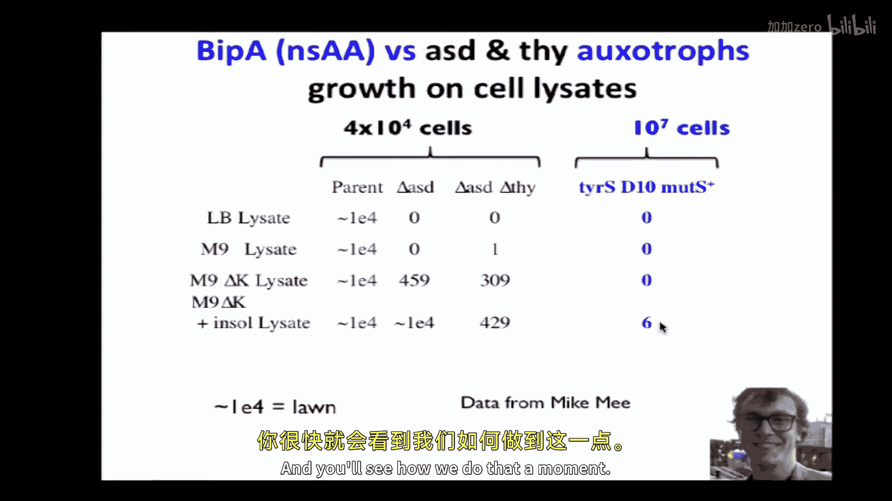
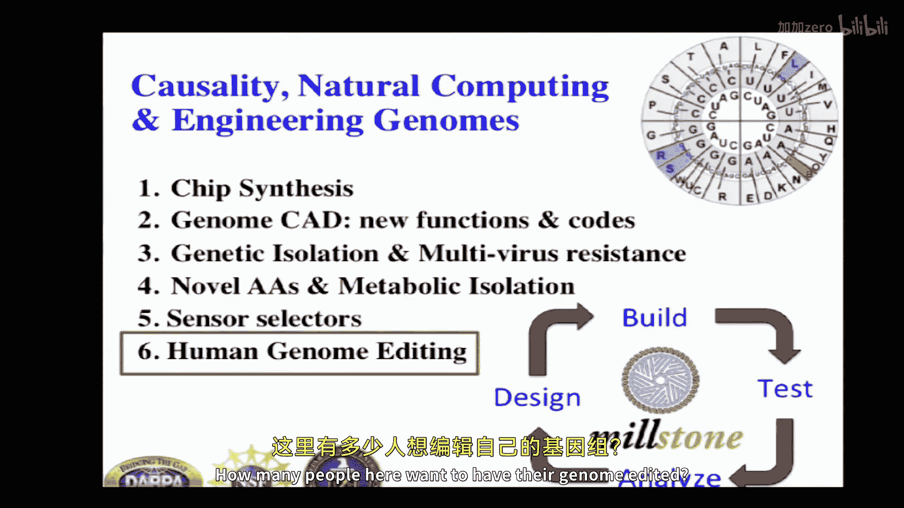
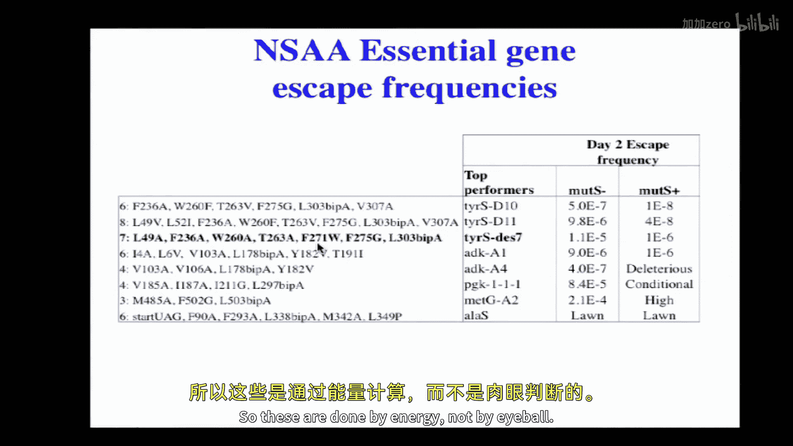

# 【计算与系统生物学基础 7.91J 2014】麻省理工—中英字幕 p22 p21 22. Causality, Natural Computing, and Engineering Genomes -BV1HdzaYAE2a_p22-

The following content is provided under a creative Commons license。

 Your support will help M I T Open Coseware continue to offer high quality educational resources for free。

To make a donation or view additional materials from hundreds of MT courses。

 visit M T OpenCourseware at OCw。 MT。 Eduu。

Thank you。 And please feel free to interrupt。 I just as soon run this as a discussion， if you'd like。

 is that permitted。Okay， so these are conflicts of interest for those of you care。

 or you can get it in more detail here by going to this website。

And I thought I would talk about this topic of。Casality， you've。

 you've learned quite a bit already in this course about。

Tools for analyzing genomes from various aspects。 But what you do after you analyze it is you want to test your hypotheses。

 and this is this is a very richly enabling idea in the sense that you can go to very small cohort sizes as we'll see in of one cohort sizes。

 and you can false positives are less of a concern。 if you have a high threeput way of testing them。

 And so's I think it's very important to know the possibilities for testing causality。

 and that gets us into engineering genomes。 And in particular， about computer rateed design。

 So you've talked about computer analysis Now， let's talk about computer rateed design of genomes。

 both bacterial and human。So I just want to illustrate the idea you might say， well。

 why would we want to design genomes， you can test causality typically by changing one base pair。

 why would you want to change more than one base pair if you have a SNP that's great Well sometimes you have multiple s SNPps interacting in multigenic and we'll get to humans in a moment。

 but here here's a radical example， something that's an extreme edge where you would want to change almost every base pair in the genome。

 not make a copy of a genome but actually design in an intelligent way。

 semi-intellig combinatorial as well。A genome that has new functions， new properties。

 And the four functions I submit for your consideration here is that you might want to be genetically and metabolically isolated for safety reasons or public relations reasons or both you want to have new chemistry。

 new protein chemistry， new amino acids， And finally。

 you want to have multivirus resistance This is probably the most powerful of the of the four。

 where imagine that you have an organism， whether it's industrial agriculture or even human that was resistant to all viruses past and present。

 even ones you haven't analyzed。So how do we do this， How do we get new functionality。

 How do we design a genome in such a way that doesn't break， Because if you change the genome enough。

 you know， you get your comeupps， you learn， you learn， you don't know as much as you think you know。

 you have your beautiful computer simulations from your analysis。 And as soon as you test them。

 they start， you start getting surprises。So anyway， I'm going to focus on this process of。

 of designing and and building and then testing。 And so this sort of design has to have an analytic component。

 So we'll get back to your old friends in analytics。So as I go down this list。

 maybe just show a hands of， of how many have been exposed to these。Computational tools already。

 right。 So both high， anybody， Okay， good。 see， you've covered this。

 I don't need to cover that number 2。Some Snip B F。Pa out SQL， youve heard a SQL， right， Okay， good。

Let's see。 So the point is we go each of these things is integrated into this into this system。

 we call millstone。Which is about all about design and analysis。

 So it's this loop that goes around and around， as you'll see in just a moment。

 I actually may have seen already back here。 so we design it， We build it， We test it。 we analyze it。

 And and thats the analysis。Sometimes when you build it， you build a large number。

 you build a combatorial set。 So this is， this is something that's fairly。

Unique to biological engineering that's or even just certain branches of biological engineering that you don't see every day in in civil engineering or。

 or aeronautics。 You don't build a trillion different， you know，7。

87s and see which one works the best。But you can in biology。 And I'll give you some examples that。

 And part of the reason we can do this is just as there's next generation sequencing。

 which you've heard about in this course。 And we were also involved in next generation synthesis and next generation inserting synthetic DNA into into genomes。

 And you'll see about all about that。 There are four different ways of doing next generation。

Synthesis。And it's not important for this particular class。

 And there are various ways of doing error correction。

 And these are kind of analogous to the kind of error correction that you have in in electronics and computational systems。

 But we won't stress that analogy too much。Here's an example。

 just practically what you get when you build these oliggonuccleotides on chips。

 you might get olig goes up to 300 nucleotides long as they get longer they tend to accumulate errors a little bit more towards the end。

And so you can see that with the length， the number of errors goes up。

From one in 1300 raw error rate to one in 250 raw error rate。 and then we can get back some of that。

 get rid of some of those errors with with a enzymatic system called erase， it doesn't really matter。

 in this case， we can get to sort of one in 6000 without sequencing。 And then with sequencing。

 if you're willing to clone in sequencing， you can get error rates even lower。

 and it's important to know that kind of fundamental limitation。

 youll always need to think about background and error in computing as well as synthesis。

You can then do， you can now do combined synthesis and sequencing very closely by making ci regulatory elements。

 which we did in this paper that's published。Sri Kossi and Dan Goodman in particular。

 where you could basically synthesize ci regulatory elements in the genome or in a plaid。

And then you can read out the RNA simply by RNA sequencing。

 The number of times you see this barcode in the RNA tells you how many times that particular construct。

 which can be heavily engineered。 It isn't like randomers。

 You're making interesting ci regulatory elements。 And you can make tens of thousands of these millions of these constructs。

 We did tens of thousands。嗯。Then you can measure protein levels as a result of cirogies。

 You can have promoter elements， ribosome binding sites and coding region mutations that you think might influence。

RNA and protein。 And and here we do the proteins by having two fluorescent proteins red and a green。

 the red is a control， and it has a very tight distribution， as you can see here。

 a very tight distribution。 And then the green is subject to the ci regulatory mutations is made on chips。

 and then it has a big distribution。 And you divide it up in a fluorescence activated disorder and you can read it out。

 So here， every pixel on these two plots for RNA and protein is a separate experiment。

 And you can drill down and get some more information on each of these。

 But but the basic idea is each of these was individually synthesized on the chip and individually sequenced later to determine。

And and the sequencing can be the barcodes can be read out in proportion to the RNA and protein expression。

And here's an example of some surprises that come out of such， such studies。 and， and theyre with。

We're not just。Doing this for our health。 So， for example， when we went into this。

 it was well known that co on usage effect was correlated with。And could even causally influence。

 So here's an example of causalergy。 The expression of a protein， if you have very。

Commonly used codons which typically have high levels of the corresponding transfer RNA in the cell that the observation and it makes sense is that those proteins would be expressed at higher levels。

Thing that was new was we discovered that at the inter termminus close to the cis regulatory elements。

 it flips。 It's the opposite。 There's almost no correlation with， with abundant codons。 And there's。

 there's essentially a negative correlation here with R squared to 0。

73 right here that that shows that there's a high correlation。呃。

With there's a higher expression with very rare codons。 This was published in science。

 and we can we've separated out。 So， so a lot of them tend to be80 rich。

 but we can separate out that component。 We can separate out things like ribosome binding sites。

 which are A G rich。 And there's just a general trend where rare codons help expression if they're at the beginning of the gene。

 And you can find that out from this kind of experiment。So。We connect now we want。

 if we're gonna build a genome that's radically different。 Let's say radically different here。

 defined as 7 to 13 codons chain Gen wide， freed up and liberated， meaning that they've been。

 we use the synonyms in the genetic。Code。So there's anywhere from one to six codons for each amino acid。

 three codons for stop codons。We can use that that synonymous substitution table to move things around and completely free up。

 get rid of every instance of a U A G and turn it into UA A。 That's the first example。

 And we did that genome wide。 And thereby de riskss that we can now build on top of that because we can get genomes that that that grow well under a variety of conditions They're still genetically engineerable。

 And we and everywhere there's a bar there。 this refers to。You know， a successful。

Mutation and the height of the bars refers to the efficiency of introducing those mutations。Now。

Then we wanted to derisk another special category。 Remember。

 I said A G A and AG G are special in they're the rarest coding。Coodedons。

 not So U A G is a stop codon AGA and A G。G are arggenine encoding codons。

 and they're the rarest and they also are complicated because they tend to represent Shiinelganoocytes。

 which tend to be AG rich regions that are involved in initiation and protein synthesis。Anyway。

 so there the number was a little large to do genome wide。

 so we focused on essential genes and so you can computationally find all the essential genes and design strategies for getting all the AGG and AGAs。

And then when you synthesize those genomes， you can do them one at a time with a process called Mas。

 which we won't go into to experimental， but basically you can essentially just go straight from oliges into the genome and you can do multiple ones simultaneously and you can see which ones are hard to make a which one or each again that's the sort of efficiency number there and you can see which ones if they're selected against and some of them were actually selected against we could not find them。

And so these are discoveries， These are examples where。synonymous is not synonymous。

 It It could mean that there's some other function hidden。

 layered on top of the the the synonyms might be arrive at some binding site。

 And so what we find is that we can， we try other。You know。

 let's say other Argenian codons rather than when we we targeted。

 or you sometimes can try out other codons that are they're not even synonymous。And eventually。

 we found every single one of them。 So， so they were。

 there were about a dozen that were hard at first。 And then we eventually found an engineering workaround。

And that illustrates a number of interesting points。

 But so those were all successful in essential genes。

 And it's our work it's our observation that if you get it to work for essential genes。

 getting to work for the non essentialent genes is even easier。So then we went on。 and then。

 so that's one codon at a time， two more at a time。 So we've derised three codons at this point。

 So we went on to derisk all 13 codons or 13 of the of the 64。

And we did that in even smaller set of genes so there are 290 essential genes in E coli。

 we did 42 and in that case， there were 400 and some examples of those and every one of them worked except for one and just like the Arrggenine codons。

That one， we tried a number of different codons， and they worked。Including non synonymous codons。

 So in almost every case， you can find something that works。

And then we do biological assays that that the four functions that we felt should be changed were actually changed。

 here's two slides on the virus resistance you can do a variety of ways of determining how effective the virus resistance is here you have about a factor of1000 for phage lambda which which has been mutated to be highly virulent in the e is a very pathogenic version of phage lambda。

 this is T7， which is naturally quitelytic and can and you can show that that this resistant to two of the three viruses that we tested and our hypothesis if we changed more codons than just that was just one codon if we change seven or so which is what we're doing now。

 then it will be resistant to all viruses and very heavily resistant。

 so resistant that they can't become。The population of viruses can't mutate enough to become resistant。

So all of you should be questioning that， do I really believe？That。

 and we can talk about that in the discussion。So now the other big functionality is。

 can we genetically isolate these genetically metabolically isolate these？And， and to do this。

 we took advantage of the new genetic code。 we can not only weve moved， we've freed up a code on。

 we can now make that coat on code for new amino acid。By another set of biochemistry。And。

 and here's some examples of amino acids that look kind of like tyrosine or phenyl alanine。

 Here's one that's a biphhenenyl alanine。 It's got two benzene rings instead of one。

 And that's so it's bulkier。 It bulkier than any other amino amino acid any naturally occurring one。

 And we wanted to ask， can we make those， those essential genes that haveve been talking about。

 Can we make them addicted to this amino acid。 And so we did。

By this computational protein design strategy。 And the idea is look， we。

 we look through every crystal structure of every essential protein in E coli。

 It was 129 or something like 120 crystal structures and。And systematically ask。

 werere there any places where we could fit in a larger amino acid by carving away adjacent amino acids？

Such that when we didn't replace that larger one with a smaller one。

Still keeping its surroundings mutated so we can mutate it。2，3，4， eight times， you know。

 however many amino acids nearby， you need to accommodate the big amino acid。

 If it no longer accommodates a small amino acids。 So you basically systematically go through every amino acid for every crystal structure。

And found a short list of you know， half dozen or so that looked promising。

 And so the idea is youd put in these two phal groups。And now， when you shrink it back down again。

 you accommodate it and shrink it down， it won't work。That's the basic idea。And and in context。

 we wanted to really have a really tough test for this。

 We wanted to say not only do we want to be addicted to this。

 but we don't want it to be able to escape either mutagegeneette， either by mutation and evolution。

 we don't want it to escape。 We don't want it to be able to escape by eating its fellow It classmates。

 It other E coli。 And， and so what So we did the test we do is we do did you have a question。

We would lyce the cells。Lfe cells of wild typecoli。

Or certain mutant strains that would that would produce large amounts of these。 And one of the。

More classic ways of making an organism is's metabolicically isolated。

 So it can't survive in the wild， can only survive in an industrial plant or in the laboratory。

And we did this with the classic ones， which people have avoided using  glysates because it gives them bad news。

 which is if you grow them on lysates， you get a lot of survivors of these are classic ones and deletions of these two genes。

Makes them。They will still grow。But this， this is an example of one of our designed non standard amino acid strains。

 and we get much lower escape rates。And you'll say even this flow number here。

 we want to get that down to 0。 and you'll see how we do that in a moment。 This is Mike me。

 as a graduate student。

So here's a close up of this is not the active site。

 This is just can be any place in the protein where putting in a big big amino acid is going to be disruptive。

 So we changed this luucine。Innocent luucine that's packed all around with other amino acids。

 You guys done protein design in this glass。You know， okay， so you know， I'm flying Mount， Rosetta。

OK。So that's what were using here。 We had to modify it to use non standard amino acids because normally。

 people design proteins with 20 amino acids。 So we took this leucine。 We made it into this bitpay。

 And you can see now it's got all kinds of clashes，3 dimension clashes。 That's not good。So we。

 so we identify those clashes and we make them smaller。 No clashes anymore。

 This is all done in the computer。 This is all theoretical。 You know， can you believe that。

 We'll see。 So， so then。This is putting back in a small amino acid。

 these are some of the people that did it， so Mark and Dan or postdocox in the lab。

 and we and Barry did the chlography。I'm a crystal lawgrapher by training。

 but I'm a little out of practice。So here is the design again， and there's the electron intensity。

So now you can believe it， right， because it's not just a computer model。

 but it's still a computer model that's based on data。

And here's a comparison of design with the X rayray structure， not too shabby。Okay。

But the question is， how resistant， how， how。How well does this work in living cells。

 So these are cells where we've gone， change the whole genome so that now they the stop code on U A G is is free。

 It's never used， which means we can delete the the release factor that normally recognize a stop code on。

 which otherwise would have been lethal， and we can replace it with a transfer RNA and a T RNA syntase that brings in this no and standard amino acid。

And now this is the one we were just looking at the crystal structure in bold here。

 and it has an escape frequency which is higher， we can crank up mutagenesis by putting it in a mut s minus background。

 basically one of the mismatch repair proteins， we can knock it out。

 which increases sort of accelerates evolution。And。And it has a noticeable escape frequency。

 So thats other ones are are a more realistic scenario would be this mut S plus。

 And we can get escape frequencies as low as 10 to minus-8。

 These are for other mutations in that same protein。 And here are mutations in another protein。😊。

So then we said， okay， but nothing， none of these are perfect。 You。

 we want something that's this' undetectable levels of escape。So how would we。

 How would you fix this。Anybody。Trying to encourage you to interrupt me。 so I'm interrupting you。

Anybody。You've got these， these things that are not。 I mean， they're。

 they're escaping at very low frequencies。 We should be proud of that。 but we wanted to。

 we want to drive it even more rather than 10 to minus8。

 We want to get down 10 to minus-10th or something like that， suggestions。😊。

This is re version of year。 Well， so we， so this means that you could， yeah。

 you can take the bit A and you mutate the code on。

 So it doesn't encode bit bay anymore and code something else。

 So it doesn't need bit bay from the media。And it puts in another amino acid and it somehow survives。

 So even though it's not a perfect fit in the， it does well enough that it， that the enzyme is made。

Multiple essential genes， wow， couldn't said it better myself。That's what we did。

So this is a profile。 So before we could choose which two we wanted to use or three。

 we want to know what the spectrum was。 So we forced in all 20 standard amino acids to replace the bit A。

 So we said， let's mutate them intentionally synthetically and see what the spectrum is。 Now。

 this is not gonna be the natural spectrum。 the sort of mutgenic spectrum。 This is our intentional。

 So what we do is we put in each of the 20， and then we do a quick selection at 20 doublings。

 It is very fast evolution， not 3 billion years。 My students didn't want to wait。 So in 20 doublings。

 you get a spectrum of which amino acids will substitute for bit A。 in an ideal world。

 none of them would。 But we forced them to。 and these are the survivors。

 And so the ones we've been talking about here。W， tryptophan is what will substitute for bitpay。

 And that kind of makes sense It's the biggest amino acid。

 And that works for the tire S which happens to be the TRNA synase。

And then we picked this other this big red arrow for 80Kosine kinase， A kinase。

 where there's very little tryptophan that will work in that one。 But you get some escapees。

 If you force it to take these hydrophobic alifatics like luine。嗯。So we made the double mutant of。

Of the we don't have it here。 but we made the， we made the double mutant of the 80 K and the T S。

 and it's vanishingly small。We're probably not done。 We'll keep doing this。

 but this is the way that you do a radical recordingcoding and get new functions。嗯。

Any questions that part we're going to move on to human genome engineering。deter。Yeah。

 I skipped over that because it's a little more on the biological。

 little less on the computational side。 so this was a work from Peter Schzslab and other groups that what you do is you take a cent of taste。

That's orthogonal， meaning it's from a completely different organism。 In this case。

 methanococcus Jancii， which is a hyperthermophile。 You take that centitase。

YouIt's about as far as you can get on the evolutionary phylogenetic tree， you bring it into E coli。

 you bring in its cognate TRNA。You change the anticoddon so that we'll recognize UA G。

 which is not what any codon typically any TRNA normally recognizes。

And that only works with certain synases。 So only certain synases are blind to the anticoddon。

 mainly serin and luineases in in E coli。Anyway， so now you can now evolve the the。

Active site that binds to the amino the amino acid and the AP。

 So the amino acid AP cause the amino acid to be isolate the transfer RNA。 anyway。

 you can change that active site so that now recognizes any amino acid you want to first approximation。

 And you can do that So a combination of， of intelligent design and random mutogenesisesis。

And there's selections for that as well。So in general。

 if you're going to be doing random or semi-ran immunoogenesis。

 it's always great to have a selection。 So there are selections for these things and there now are dozens of amino acids that work fairly well in that scenario。

 The problem is the main thing that was limiting was not the I mean you could get syntases。

 it's the TRNA then had to compete with the release factor in the stop code owner had to compete with another TRNA if you use a different anticoddon and so so that freeing up this co on means there's no competition and now it works about as well as a regular amino acid。

While when it has to compete， it's at a great disadvantage。有。啊。I planted that， but thank you anyway。

呃。Imagine that。So there's a genetic code up there in circular form。

 Probably your' mo used to seeing it in rectangular。 But imagine that we， we've now derised。

This U A G stop codon and this A GA and AG G codons here are for Argenine。

And we're in the process of putting all those three codons together with another。

4 for srian and luucine。 And remember I said Syrianrian luucine is interesting because you can change the。

 you can swap out the anticodon the syntase doesn't care。 So that's why we picked those ones。

 the three rarest ones plus four where you can swap out the anticos。

 So we could swap Syrianrian and luucine， for example。

 once we freed up those So Syrianrianucine also there there examples of TRNAs that bind to six different codons。

 So moving moving two of them is not a big deal。 They're still got four left。So anyway。

 imagine that we remove them or swap them and do weird stuff with them。

 every time the phage comes in， it has lots of syrians and leucines that are using these。

And Argens and stops。 And， and every time it， it wants to put in a looseucine the。

 the ribosome puts in a serine。Well， that' you can note looses and serin aren't that similar and that's going to cause a mess for every single protein it makes。

And there might be dozens。Maybe even hundreds for big phage of those codons。

 And so you can do the math that the chance of mutating one of those codons to something that will work is fairly high。

 Two is squared 3， you know，s the in power where n is the number of changes it has to make。

 And so if you make enough changes no population size you know population sizes have to become astronomical in order to contain one number that is has changed all of its codons the right way and hasn't changed a bunch of codons it will be lethal。

So so the first three were the rarest。 And part of that is because we felt we would run into the most trouble there。

 You know， there， there may be rare for a reason。 and we wanted to discover those reasons both for biological curiosity。

 but also to derisk the subsequent engineering。But the Lucuc ands ones are kind of normal。

 They're not， they're not that rare。But we've derisked them。

 and remember that one where we did 13 codons on。On 42 essential genes。

 that's how we show that in general， it's not toxic to individual genes。

 but there are examples of things where you derisk it on individual genes and you start making lots of them。

 and then you get so-called synthetic lethals where。Vious pairs of genes conspire。 But so far。

 most of the deleterous nature of the genomes， where the genomes are a little bit slower growing。

 It's usually due to hitchhiker mutation not due to our design。 I mean。

 except in cases it's where it's completely not working， in which case。

 we have to find an alternative co on。But we have to deal with all these things， design errors。

 biological discovery and hitchhikers。Yeah。第二一份。Multiple simultaneous mutation that is unlikely。

 works if they all have to happen at the same time。If you have this engineered system。

 if you have some way of migrating。Coode other， you could end up with。

Spreading of your non secret code so that you can mutate against one of them at a time。Well。

 so if we're talking first of all， if phage doesn't carry along its own code if it did。

 and we could preempt that by making lethal genes that if you bring in the TRNA that has the old code。

 you activate the lethal gene。But I think you were talking about more a Darwinian perspective where you have incremental changes that allow you to slog along well enough that you can get more mutations。

 The problem is this collection of mutations there is no growth I mean every protein is majorly messed up and so you were not talking about you know antibiotic resistance where there'll be kind of a gradient of antibiotics and somewhere on the edge of the gradient。

 they'll be just enough antibiotic to be selective but not enough to kill it。

 This is something where the instant they get into the cell， there's no gradient。

 have they only have one code choice in that code is something I think the difference between this and regular evolution is regular evolution if the bacteria tried this strategy it would be changing a little bit at a time and the phage would be keeping up with it。

 but we took it offline so to speak， did major code revision and moved it back and the phage was not watching。

And the phage isn't as intelligent as hackers are。Okay。Any other questions？

We could stay on this topic， we don't have to go on the humans。Okay， just， just for fun。

 Let's go on the human genome engine。 How many people here want to have their genome edited。

All right， we'll ask in just a moment what you want to have changed。啊。

So these are some of the tools that my colleagues and I have worked on。

 I've been doing this most of my careers coming up with new tools for engineering genomes and sequencing genomes。

 And the the one I've been talking about so far is down here at the bottom is rec A and red beta。

嗯。And the star for going forward is this cast 9 protein。 But what we color coded them here， so that。

So the recognition， the critical thing about genome editing is finding the needle in the haystack。

 You want to change one base pair。 You don't want to change anything else。

 And so something has to do that recognition。 that recognition can be Watson cr。

 So you can have DNA DNA searching through the entire genome with DNA DNA interactions or RNA DNA interactions or Watson C or protein DNA interactions。

 which I'm sure youve learned about quite a bit。 And so this you have examples each two examples of RNA and blue。

 two examples of DNA down in the box and then all the rest are protein where the protein the amino acid side change are recognizing typically some kind of alpha helix in the in the major groove。

Okay， so Cath9 was something that was an nice case of computational biology， in my opinion。

 it was found in 1987 in E coli， by achino and colleagues。

 and it was a essentially junk DNA It was not conserved。

 it was repetitive which were tied two of the hallmarks of junk DNA。

 which were very popular to talk about in 1987， they were trying to shut down the genome project before it started three years before it started NIH part of it started because they didn't want to sequence anything in the human genome that wasn't coding for proteins this is I'm serious。

呃。So anyway， this languished as junk DNA for many years。

 eventually became clear to the cognitibacteriologists that it might be an interesting adaptive immunity。

 kind of like antibodies， rather than the fixed or native immunity， which were restriction enzyme。

 So this is kind of the adaptive version restriction enzymes。

 But it still didn't really catch on till 2013 when a couple of my postdocs and X postdoc and graduate students in January。

Got it to work in humans。 So moved it from bacteria to humans， kind of a big jump。

 And then then it became surprisingly easy Once it made that jump to。

 to get it to work in every organism that we've tried。 So what we and others have tried。

 So now 20 different organisms， at least this works in fungi plants and even elephant。We。

 we haven't published the elephant yet， but we have our reasons for doing that。

And the most frequently asked question， and this， of course， should appeal to， you know。

 computational biologists trying to do design is， what about off target？

And it turns out now there are many ways of dealing with off target。

 so much so that I would be so bold。 And this is a slight。Vulation。

 but I would say we're currently at the point where it's almost not measurable on the off target。

 And these are the different ways that you can do it。 So we started out in our， you know。

 January 2013 with theoretical where you would basically look for， I mean。

 anybody in this room would know immediately how to do this would look for potential off targets that off by one or two nucleotides and ban those from consideration。

 And then you take a a shorter list and do an empirical search because this is so inexpensive。

 Basically， you have。You have this guide RNA， which is making a triple helix。

 It's binding to one strand of the DNA。 It's so easy to make those guide RNA。

 It's just 20 nucleotides you have to make。 you pop it into a vector where else is taken care of。

 It's so easy to do that that you can make a lot of them and you do an empirical search you find places that are particularly hot for the right sites and very cold for the wrong off targets。

 So those are the first two methods。 imp paired ni cases where you where you require they don't make a double strand break。

 which is what it does out of the box from nature。 It makes a double strand break。

 You have to make a single strand ni， and then you require two of these to be coincide near one。

 It's kind of like the concept of PCR。 You have to have two primers that are near one another。

 So it's a coincidence。 So sort of like a P squared if the probability is one is off。呃。

By one or two or however many it takes， the chances of getting two such sites near each other is roughly p squared。

Trunncated guide RNA is not something that you would necessarily guess that if you make the guide RNA smaller。

 it's gonna be better。 but there's obviously some optimum。 If you make it too long。

 then then it combined by any subset， any kind of mismatched subset。

If you make it too short then in an informatic stand standpoint。

 it it doesn't have enough bits to recognize a unique place in the genome。

 So that it turned out that the optimal length was a little bit different from the natural length。

 It was about two shorter。And then finally， and this just came out and we don't this is from our Keith Young and David Lou's labb。

 where you get rid of the beautiful double strand break capacity。

 You can turn into a niase or you can make it completely nonfunctional as a nuclease and then add nucleus domains back。

 and you say， wow， this seems kind of bizarre that you're doing all that work that you get rid of the nucleus and you it back add in a different one。

 F O K1 bacterial restriction in the nuclease。 But it turns out。

This is the way that other people have taken other DNA binding proteins， the zinc fingers and。

 and the towel proteins。 And so we had to， it had to be tried and it works extremely well。

 And it's like the paired nick casess。 You need two of these sites in order to get cleavage。

And stay tuned， I'm sure there's more。So， so just want to close on this idea of causality again。

 I opened on it， closed on it。Here's an example of a。Double null， mytt and double null， as say。

 both the maternal and the pater copies are missing。 There are a lot of examples of double nulls。

 We can talk about some later。And they're often rare。 So there's at one point。

 there was only one person in the world that was characterized with this。

 And it's hard to do you know， a large cohort study on this。And they weren't really sick。

 The the phenotype was that they had heavy， this little baby had heavy musculature as if he was like working out next to Arnold Schwarzenegger。

 but he came out this way， and he stayed that way。And but it's striking。

 you look at the genome and you say， wow， a double null and a highly conserved protein。

 that's got to mean something。 And then you can have a hypothesis。 What it means， you know。

 based on what was known about that pathway。 And it coincides with the phenotype。

 And so you have a strong hypothesis。 and you can test it in animals。 And so here， you know。

 normally tested in three different animal species。

 But this one that happened to be either all preexisting or easy tests in cows， dogs and mice。嗯。

So that's one thing you can do to get it causality。

 And the other thing is there are cases where the animal models don't work。

 Either you knew in advance， they weren't going to work because they don't have that brain structure。

 You know， like， you know， there's nothing other than humans that have a particular kind of brain structure。

 So it's hard to。To make mutants because they're already mutant。嗯。

And so another option is organs on chips or organoids to， you know。

 because they're not really fully physiologically faithful。 And， and this is at least is human。

 but it has the， but like just like animal models can have artifacts， organoid。

 human organoids can have artifacts as well。 Here's an example of something that will be coming out。

 in a few days that we did together with Keith Parker's lab and Bill Poo's lab where。

 and I think this is a nice。Example of where you can take a hypothesis where one base pair has changed this。

G right here is deleted in the and that's putitively what causes this cardiomyopathy that affects mitochondrial function。

 And you can mutate that using the CRISPR technology I was talking about or use homologous recommendations to go in。

 find that one base， change it。 or you can just make a mess near there。

 So this is kind of one control is to not change it。

 And the other control is to make put a little insertion deletion in there。And of course。

 that messes it up as well。And。So with these three you've now constructed three isogenic strains these are actually my cells in the personal genome Project。

 we take volunteers like myself and establish stem cell lines and then from the stem cell lines we can establish in this case。

 well very well ordered cardiac tissue we'll see in the next slide and and that cardiac tissue you can test for you know lipid biochemistry for other physiological parameters for the morphology and the contractility。

 so diastole and sstole that you get in the cardiac muscle。So。

 so you could basically make something where you've only changed one base pair in my genome。

 And we've made essentially a version of me that's mutant。And unfortunately。

 I don't think I showed had a picture of that。IThought it did。Others。So here's an example。

 how you get this beautiful ribbon like stated pattern that you expect of cardiac muscle。

 This is programmed from my fibroblasts， turned into stem cells into muscle。

 And then if you introduce the two mutations， either the one that corresponds to a patient or one that's just a mess。

 you get a morphological mess。 And then you can restore those by putting in the messenger RNA that will cover for the mutation。

😊，So I'm going to open it up for questions at that point。That's causality。I think。Questions。

While we're waiting， anybody wants to volunteer what they would like to change about themselves。

You can mention a specific base pair or kind of a general general idea of what you'd like to change。

Whether you think there's any safety considerations that we should keep in mind？The promise delivery。

The flavor。别人道。So there are now so there was gene therapy had a crack， people were a little overan。

 a little over ambitiousbitious about over a decade ago。

 and a small number of patients died from cancers。Because there was random integration rather than this precise genome manipulation we're talking about here。

 there's kind of random liivviral integration of extra copies of genes。

 and if you land in the wrong place， then you're liivviral。

Retroviral promoter will go off into oncogene like LMO2。So that that delivery was viral delivery。

 and it was random integration。 We now have delivery mechanisms that are nonintegrative or integrated in a specific place。

 or in this case can make precise base pair changes。 So it's a whole new。

 So there's two levels of de One is to get it to the right tissue and the others is to get it to the right base pair。

 I think both are semiol problems。So you can do X vivovo delivery。

 so you can take T cells out of a body， you can use previous generation the zinc finger nucleus to cleave both copies of the CCR 5 gene and now people that had full blown ADS。

 you put these T cells back in their body， and then now they have their AIDS resistant。

 those T cells that have both copies of the CCR 5 gene missing， which is theIDS。

Co receptorceptor are now。嗯。Resistant。So that that's Xpville。 that's one way to do it。

 delivery to liver is quite easy。 You can do that with nonviral vectors and a den associatedso virus is one that's very popular。

 you can get it to go to almost every cell in the body either selectively or generally。

So you just want to make sure that once it goes there， it doesn't cause any damage unless。

Other than the base pair you want to change。So there are now 2。

000 gene therapy trials in phase one2 and three， it's a big change from a decade ago where I think people have pretty much given up on gene therapy。

 that are now 2000 clinical trials and one has emerged all the way out out of phase three into full approval in Europe。

 ironically they now have genetically engineered humans in a land where don't eat genetically modified foods。

But I think they're better for it。 I mean， so far， that's securing diseases。有。一点。なと案。

Did this open up enmatic reactions？think with。6。こ。So I'll just repeat the question。

Our viewing audience do nonstandard amino acids open up new enzymatic reactions and there's already a couple of examples in the literature。

 this was done prior to this wonderful strain where there's no competition it was done at low efficiency。

 but putting in one amino acid low efficiency you can still get an enzyme。

So even if it's like 10% efficiency， you get。You produce 10 times as much enzyme。 and it works。

 So there， so there were some redox cuin derivatives of amino acids。

 So cu and redox capability is not present in any of the other amino acids。

 And they took a protein that was very well studied。

Where they hi by protein design and by random mutagen and every they threw the book at it。

 and they could not budge the activity beyond the apparently optimal， naturally occurring activity。

 They They put in this amino acid， which was not randomly chosen。

 It was a redox humor and derivative。 They put it in the active site。

I think they tried out a few different things that made a small combinatorial library。

 but the point is they got a tenfold improvement in the catalytic rate constants。

So that's an example。 Another example， which isn't really catalytic， buts， but it's。

 it is very popular is that you can put in polyethylene glycol。Modify amino acids wherever you want。

 rather than kind of randomly， you can put it precisely。 And this will greatly extend the。

 the serum half life。So that normal proteins like human growth hormone。

 which is approved pharmaceutical for certain uses， not all the uses that you find on the internet。

 but other uses。But it turns over very quickly in the serum。

 And so if you put a polyethne gol in the right place on human growth hormone or other human protein pharmaceuticals。

 they last longer。So are two examples， one of them definitely active sight。有。

This is actually a small bill from River Jason。Are you multi with the structure and then you mutated one of the amino acids too？

一群这个。It' compensate for that size， so notice most of the changes were to either allance or li。

 but one of them。做我公时。有可さ。有的是。So the2 send us71。Yeah， okay， So in each of these lines。

 I didn't spend much time on this。 In each of these lines。

 there's one amino amino acid that we've changed to B A。 So these three are all the same protein。

 and it's all the same mutation。 Lucucine 30，3 to B A， and then all the other ones are compensating。

And then here you can see it's aucine。A differentucine and a different protein。They're all looseucs。

 different proteins。 Now what's your， what's your question about。

So common mutations are generally all to smaller amino message oh I see。

 so why athena all tripptop fanss？But those are pretty close。 It's probably。 So these are。

 these are done by energy， not by eyeball。 They're done by all by Rosetta。

 where we combinatorially go through lots of side chains。

So a commentary that went through lots of proteins， lots of。

Positions to substitute amino acid and lots of accommodating mutations。

It is not necessarily a typical way you use this software。 anyway， that probably is some stacking of。

 of the of of one of the two aromatic rings onto the triptan。Yeah。And we tried many combinations。

 and no doubt we tried the phenol ainine。And the tryptophan in various combinations of the other ones in the tryptophan empirically works better。

There no questions。

