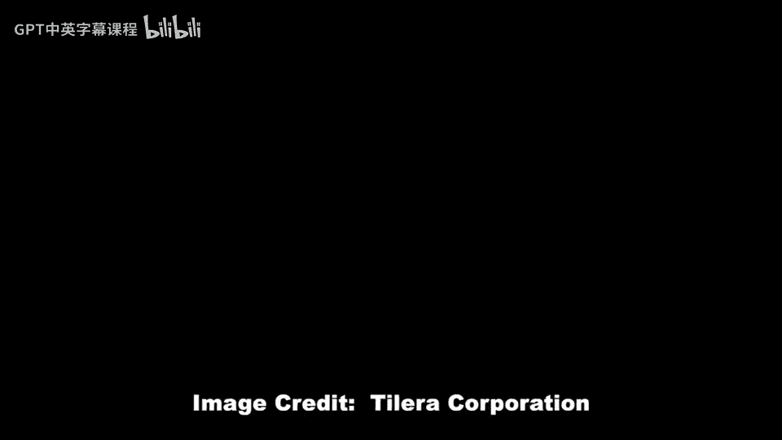

# 【计算机体系结构】普林斯顿—中英字幕 p01 0_01_course-introduction -BV1ii421D7WR_p1-

Welcome to the Encore offering of Comp architectureiture。 I'm David Wesloff。

 I'm a professor at the Princeton Department of Electrical Engineering， and in my background。

 is building many core and multi core micropostors， both in academia and in industry。😊。

And for example， this is one of the microprocessors that I built while I was in industry。

 and this is actually a 64 core multicore microprocessor。

 and that's actually put onto something like this board here。

 and you can see actually that chip is under this heat sink on this board here。And in this course。

 you're going to be learning how to build processors with sort of complexity on the order of this。

 We're not in this course trying to teach you how to build basic processors。

 We will overview basic processors and basic in order pipeline processors。 But instead。

 in this course， we're going into much more detail about how to build out of order。

Sequential processors， How do you build more advanced things like advanced caches。

 How do you go about building vector processors， How do you exploit different types of perism。

 like instruction level perism， thread levelvel parallelism， process level parallelism。

 vector parallelism， etc， will'll also be going into detail about how to build cache coherence systems and at the end of the course。

 we'll be talking about how to build multicore and many core microprocessors。

 And wanted to point out that this course is an advanced computer architecture course。

 So we'll be going into much more detail。 We're going to be learning how to build the inner working components。

 For instance， all the different structures and all the different algorithms you need in order to build these advanced modernday microprocessors。

 And we won't be spending as much time looking at how to build processors let's say from 20 or 30 years ago。

So in this encore offering， we're going to be extending where we were for our first offering。

 And in our first offering， we had over 100000 students registered。 and this was really successful。

 We were very encouraged by this。 And we want this offering to be just as successful。

 So please tell your friends， if youre sitting here at the beginning of this class watching this video and saying。

 I know of a friend who might actually be helped by this course。😊。

Let them know if they're interested in the field， let them know Also。

 if you're taking a computer architecture course at another university and you want to use this supplemental materials。

 please sign up and tell your friends to sign up where try to make this course also useful for people who are currently taking a course at other universities。

So let's stop and take a look at the philosophy of this course。 So in this course。

 we're trying to have a high quality course similar to what we have at Princeton。

And this course is going to be rigorous。 So we're going to use good textbooks， have hard problems。

 have a hard midterm and a hard final。 Now， the trade off here is that because this course is going to be so rigorous。

 you're going to learn a lot。 and it's going to be very rewarding。 But unlike you know。

 other courses where it might just be a survey level course， this is going to go into the details。

 And the trade off there is you're going to learn and be able to apply this information in the future of your life。

I want to while we are talking about rigor and sort of what goes about into a course。

 I want to talk about the two recommended textbooks for this course。

 So the first recommended textbook is this one here。 It's called Patterson Hennessy or excuse me。

 the two authors are Patterson Hennessy and the title of the book is computer architecture。

 a quantitative approach we're going to be using the fifth edition of this book。

 but for those of you who and I highly recommend the fifth edition。

 but for those of you who are not able to either acquire the fifth edition or it's too expensive。

You're going， you can also go about and try to get the fourth edition of the book。

 which has will'll be posting equivalent pages out of the fourth edition if they are available。

 So there's some topics which are covered only in the fifth edition， but not in the fourth edition。

Also， I wanted to say we'll also be posting if there's a particular question that we assign from the textbook。

 we'll be paraphrasing or copying the entire question out there。

 we've had permission from the publisher to do that。

The second book for this course we're going to be using is called Modern processor design fundamentalmentals of Superscalealar processorors。

 and we'll be talking about this as， or we'll be mentioning this and we'll be calling this the Shen and Lapoti book because these are the two authors of this textbook。

I did want to point out that this version here which has a blue cover and is hard cover has recently fallen out of print at McRawhi who is the publisher。

 but it is being reissued by Waleth Press in a cheaper paperback edition The paperback edition is going to have a white cover and will be released very soon and we'll post more details about that on the course website when it becomes available。

For those of you who are joining in the middle of this course。

 we want to encourage you to jump right in the midterm in the final。

 we will have open for long periods to take the exams and also to grade the exams。

 but if you are just coming in the middle and you're like say joining like a week before the midterm or after the midterm we'll be posting the answers to those。

 but we unfortunately can't have like infinite numbers of midterms and finals with full grading turned dot so you're more than welcome to come join the course use it as a selftuy and we'll also be including after the course completes we'll be leaving open for self-study and for instance。

 if you miss the midterm， but you make it to this course for the final feel free to take the final。

So while this is the oncore offering of the course。

 I wanted to talk a little bit about how we've improved this course since the first offering。

 so we'll actually we've retaped several of the lectures and we fixed many differentta in the slides and while speaking about ata I wanted to encourage you if you find an error somewhere in the course material。

 please log in and use the course forums， go to the course material errors form and look through there see make sure that the error has not already been posted。

 but if it hasn't， please let us know we really want to try to make this as best as possible this course。

 so please go in there。And post the problems， and we'll try to get them fixed as soon as possible。

While I'm on the topic of forum， I also want to talk about。

Language and region specific meetup groups or study groups。

We have a location on our forum where people can meet up and try to post in there if they are from a specific region or specific language。

 I unfortunately only speak English so I'm not going to be able to answer your questions in another language。

 but your fellow students might be able to help and it might actually help you if you are able to discuss the different problems in the course in a different language so look on that website and look onto the forum in that specific sub portion of the forum to post and try to form meetup groups in our first offering we actually had several actually physical mediaup groups in different countries and we had language specific discussions that were quite in depth about problems of this course and from what we've heard that really helped different students from around the world。

Also， one of the things I wanted to talk about is surveys and there's a difference from our first time offering this course。

 This time around， we're actually going to be sending you surveys at a regular basis。

 so thatll be one at the beginning of the course we one probably before the midterm one right after the midterm and a couple at the end。

 and these， of course， are optional。 You don't have to go and fill these out。

 But what we're trying to do is we're trying to understand where the students who are taking our course are coming from both in location but also background and preparation。

 and one of the reasons we're doing this is to better tune the course for the future and make the course much better in the future。

 but also we're trying to research and actively figure out how to better teach computer architecture in the future and also just how to teach an a massively open online course environment better in the future。

Finally， I wanted to talk about Princeton electricallectical Engineering Department and all of the very strong computer engineering and computer architecture faculty members at Princeton electricallectical engineering。

 So if you're going and taking this course and you're really enjoying the course and you're learning and you say。

 I want to continue doing this in the future。 And if you're for instance， a senior in undergraduate。

Please apply to print and electrical engineering。Come and learn and figure out how to build better and better microprocessors in the future。

 We currently have five faculty member， both in the electrical engineering department and the computer science department。

 who focus on computer architecture。 So we have tens of graduate students and also， as I said。

 five computer architecture faculty。And computer engineering is located in the electrical engineering department。

 so please come and apply to the electrical engineering department。

 both we also have circuits professors and a bunch of software professors over in the computer science department and we are a top bring school Our submission deadline for application process is December 15th。

Thank you。 and I look forward to having a very successful course with you。

