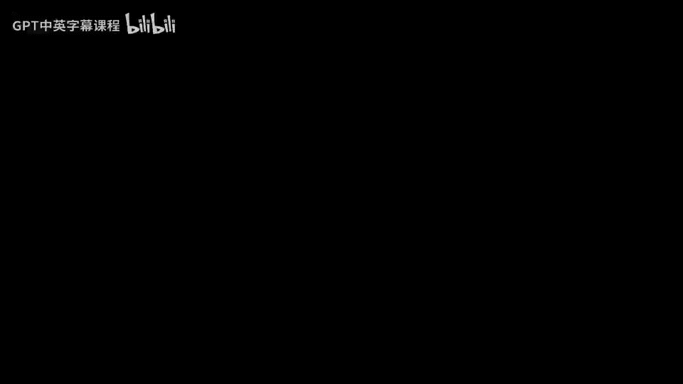
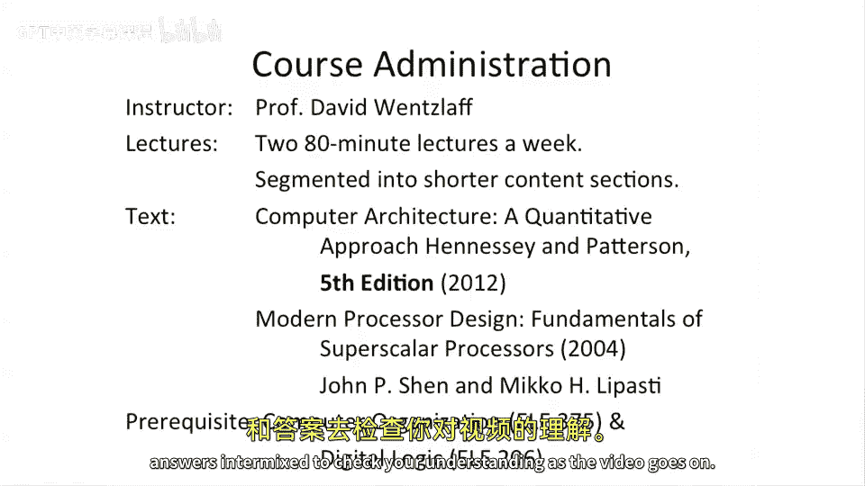

# 【计算机体系结构】普林斯顿—中英字幕 p02 1_02_course-overview -BV1ii421D7WR_p2-

Welcome， so in this course， we're going to be learning about computer architecture。

And this course is an adaptation of a course which I teach at Princeton University called ELE or for electricallectical Engineing 475。

And I'm David Wesoff， I'm a professor here at Princeton and my background is mostly looking at how to build many core and multi corere microprocessors。

 and in the past I've actually built two of the world's fastest many microprocessors in industry and before that I've worked in academia building many core microprocessors。

 so about 15 years of processor design experience。In today's lecture。

 we're going to be talking about an introduction or some opening to what is computer architecture。

 Why do you want to learn computer architecture， how it's different than previous courses that you might have taken。

 So something like a computer organization class or a logic design course。

 And then we'll talk about some content today， which is looking at instruction set architectures and how a instruction set architecture or big a architecture is different than implementation or microarch and why it's a good idea to split out these two ideas。

So let's take a step back and look at the course administration of this class and how this class is going to be organized。

So as I said， I'm David Wesloff。This class is roughly going to be the equivalent of two 80 minute lectures。

A week， so this is the same format that's used at Princeton University for this course。

 and we're going to try to segment into shorter segments to sort of give you bite size nuggets with questions and answers intermixed to check your understanding as the video goes on。

Two books that I wanted to talk about。This is the computer architecture。

 a quantitative approach by John Henessey and David Patterson。 This is a very， very good book。

 If you are going to be doing computer architecture。 I highly recommend it。 or And it's a heavily。

 heavily， heavily suggested book for this course。 I did want to point out that there's a lot of different versions of this book floating around。

 we're gonna be using the fifth edition。 and you should go get the fifth edition。

 The fifth edition is very different than the fourth edition。 It's updated as of 2012。

 So it's very fresh。And then。A auxiliary text， which is useful for a portion of this class。

 I'll mention it as the Shen Lapasti book because the two authors。

 Moern processor design and fundamentals of superscalear processors。

 The reason we're going to use this book or a reason that we're going to I'll recommend some readings out of this book is that it has a lot deeper coverage of superscalear processors than the computer architecture book。

 So this this is a great book to begin with， but it doesn't cover how to build superscalear processors in great depth。

 This book goes on to do that。 And that's something we're going to be talking a lot about in this course。

A lot of the content of computer organization or a traditional computer organization class。

 I'm going to repeat in the first three lectures of this course or the first three and a half lectures of this course and the reason for this is because I teach everything from first principles and want to get everyone on the same page but we're gonna go very。

 very fast through that material so if you've not had a computer organization class。

 it may be possible to take this class， but I highly recommend taking a computer organization class before this class because this is the second class in sort of a computer architecture series where you'd have computer organization and computer architecture and we really do rely on the prerex but if you are watching the first three lectures and you say I know all this yes。

 that is correct， you should know all this， if you don't know all this then you should probably go back and retake computer organization or take a computer organization class but don't drop the class if you take the first three lectures and say oh I know all this and just leave that point。

We're just going to breeze through that content very fast as building from first principles。

