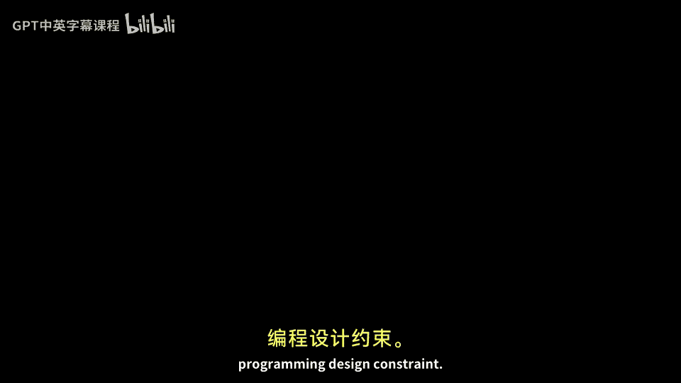

# 【计算机体系结构】普林斯顿—中英字幕 p05 4_05_architecture-and-microarchitecture -BV1ii421D7WR_p5-

Okay， so now we're going to change topics and start talking about our first technical subject of this course。

 and as an introduction to computer architecture， we're going to be talking about what is architecture versus micro architecture。

And I wanted to just briefly say that as you take this class。

 the first three lectures or so should be reviewed。 So if you。Seeing the class， and you're saying。

 oh， I've seen all of this before。 Don't get up。Waits the fourth or fifth lecture。

 And then the content will become new。 And this is because I want to teach everything from first principles and get everyone up to speed。

 But it's those first three lectures are going go very fast。

 So if you're lost in the first three lectures， which should be reviewed。

 then that's probably a bad in indicator。So we'll start off by talking about architecture。

Versus micro architecture。 And I wanted to。Say briefly what I mean by architecture。

 and I have in this slide here， a very large A。For what I'll sometimes call big A architecture。So。

Patterson， Tennessee calls this instruction set architecture。

And when I contrast this with micro architecture， or Patterson Tennessee calls organization。

So Big8 architecture is an abstraction layer provided to software or instruction set architectures。

 are abstraction layer provided to software， which is designed to not change very much。

And it doesn't say it， it says how a theoretical， fundamental sort of machine。Execcutes programs。

It does not say。Exactly the size of different structures， how fast those things will run。

 the exact implementation issues that falls into organization。

And one of the things I wanted to emphasize is that computer architecture is all about trade offs。

So when I say it's all about trade offs， you can make different design decisions up here in the big a architecture or the instruction set architecture。

 and that'll influence the application。 Itll influence the micro architecture。 But also。

 you can make different design decisions down here and make a lot of different trade offs on how to go about implementing a particular instruction set architecture。

And largely， when you go to look at computer architecture and computer architecture implementation。

The design space is relatively flat。 There's sort of an optimum point where you， you want to be。

 but the other points around it are many times not horribly， horribly bad。 Now， there are， you know。

 at the， at the extremes， probably horribly bad design decisions。But， you know。

 a lot of different design points are， are equally good。Or close to optimal。

 And the job of computer architect is to make the very subtle design decisions around how do you move around this point to make it both easier to program。

 lives on for many years low power and sort of other a little bit of aesthetic characteristics mixed together with just making your computer processor go fast。

 We'll say， And these trade offs， I I will will reiterate this over and over again in this class that。

Because there's multiple different metrics。 So， for instance， speed。

 energy cost and they trade off against each other。

 many times and there is no necessarily optimal point。 It depends on， you know。

 if are you more cost driven or energy driven or speed driven And within that point。

 there's sort of sometimes Pareto optimal curves where all the points are。

 are equally good if you're trying to trade off these different things for different cost models。

Okay， so let's， let's talk about what is a instruction set architecture and what is a micro architecture。

So a instruction set architecture or big a architecture is trying to provide the programmer some abstract machine model。

 And many times what what it really boils down to is it's all the programmer visible state。So。

 for instance， how does the machine have memory， Does it have registers。

 So that's the programmer visible state。 It also encompasses the fundamental operations that the computer can run。

 So these are called instructions。And it defines the instructions and how they operate。 So。

 for instance。Add。Ad might be a fundamental instruction or fundamental operation in your instruction set architecture。

 and it says。The exact semantics on how to take one word in a register and add it to another word in register and where it ends。

Ends up。Then there's。More complicated execution semantics。

 So what do I mean by execution semantics well。If you just say ads take two numbers and add them together and put them in another register。

 that many times does not encompass all of the instruction set architecture。

 You'll have other things going on。 For instance， I O interrupts。

 and you have to define in your instruction set architecture or your big a computer architecture。

What is the ex semantics of an interrupt or a instruction or a piece of data coming in on an I O。

 How does that interact with the rest of the processor？

 So many times the instruction execution semantics is only half of it。

 And we have to worry about is the the rest of the machine execution semantics。🤧嗯。

Big gate architecture has to define。How the inputs and the outputs work。And finally。

 we asked to define the data types and the sizes of the fundamental data words that you operate on。

 So， for instance， do you operate on a by at a time，4 bytes at a time， two bytes at a time。

 How big is a by， Do you actually have byte。So this gets into sizes and then data types here。

Might mean that you have other types of fundamental data。 So， for instance。

The most basic one is you have just some bits sitting on， in a register in your processor。

But it could be much more complex。 so you could have， for instance。

 something like floating point numbers。Where it's not just a bunch of bits。

 It's bits formatted in a particular way。And has very specific meaning。

 that's a floating point number that can range over， let's say， most of the real numbers。Okay。

 so in today's lecture， we're going to step through all these different。

Characteristics and requirements of building an instruction set architecture。And I wanted to。

 and we'll talk about how it's different than micro architecture or organization。

 So let's think about some examples of micro architecture and organization。

So what micro architecture and organization is really thinking about here is the trade offs。

As you're going to implement a fixed instruction set architecture。😡，So， for instance。

 something like Intel's X 86 is an instruction set of architecture。

And there's many different micro architectureitects or implementations。

 There is the AMD versions of the chips。 and then there's the Intel versions of the chips。

 and even inside of， let's say the Intel versions of the chips。

 they have their high performance version for their laptop。

 which looks one way or high performance version，'s say， a server or high end laptop。

 which looks one way。 And there's another chip for tablets。

 Intels trying to make chips for tablets these days。 and they have their atom processors。

 and internally， they look very different because they have very different speed energy cost trade offs。

But they will all execute the same code。And they all implement the same instruction set architecture。

So let's look at some examples of things that you might trade off in a micro architecture。

So you might have different pipeline depth。Numbers of pipelines。

 So you might have one processor pipeline， or you might have 6。

 like something like the core I 7s today， Ca sizes， how big the chip is the silicon area。

How what's your peak power？嗯。Execution ordering。 Well。

 does the code run in order or can you execute the code out of order， That's right。

 It is possible to take a sequential program and actually execute later portions of the program before earlier portions of the program。

 that's kind of mind boggling。 But it's a way to go about getting perilism。

 And if you keep your ordering correct， things， things work out。Bus ws， A O U ws， do you。

 if you have a， say， a 64 B machine， you can actually go and implement that as a bunch of 1 B adders。

 for instance， And people have done things like that in the micro architectureit。

 And this allows you to build。More expensive or less expensive versions of the same processor。

So let's talk about the history of why。We came up with these two differentiations between architecture and micro architecture。

And it came about。Because software sort of。Pushed it on us and ended up being a nice abstraction layer。

So， back in the。Early 50s， late 40s。You had software that people mostly programmed either an assembly language or machine code language。

 So you had to write ones and zeros， or you had to write assembly code and。Sometime in the。

 the mid 50s， we started to see libraries show up。 So these are sort of floating point operations were made easier。

 We had transcendentals。 This is the sign cosine libraries。 You had some matrix and equation solvers。

 And he started to see some libraries that people could call。

 But people were not necessarily writing code by themselves ran largeged bodies of code in assembly。

Programming because it's pretty painful。And then at some point。

 there was the invention of higher level languages。 So a good example， this was Forranm。

 came out in 1956。 And a lot of things came along with this。 We had assemblers， loaders， linkers。

 compilers。Bunch of other software to track how your software is being used even。

 And because we started to see these higher level languages。

This started to give some portability to programming。

It wasn't that you had to write your program and have it only mapped to one processor ever。

And back in the， the， the。50s， even 60s timeframe here。

 machinesch required experienced operators who could write the programs and。You know。

 you you got these machines and they had to be sold with a lot of software along with them。

 So you had to basically run all the software that was given because it was you to be a master programmer or someone who worked for the company to even that built the machine to even build a program these machines back in the day。

And。The idea of instruction set architectures and these breaking the micro architecture from the architecture didn't really exist back then。

And。Back in the early 60s。EIBM had four different product lines。And they were all incompatible。

 So you couldn't run code that you ran on one on the other。 So to give you an example here。

 the the IBM 701 was for scientific computing， the the 1401 was mostly for business computation。

 And I think they even had a second one that was sort of for business。

 but different types of business computation。 And people sort of bought into a line。And then as you。

 as the line matured and developed， they had to either rewrite their code or they had to stick into one line。

 But IBM had some， had some crazy insights here is that they didn't want to have to when they went to the next generation of processor。

 They wouldn't want to propagate these four lines。 They wanted to try to unify the four lines。

But one of the problems was。These different lines had very different。

Implementations and different cost points。 So the thing you were building for scientific computing wasn't necessarily the thing you want to build for business computing。

And the one that you built for business computing， let's say。

 didn't you wanted to not have it have very good floating point performance。

So how do they go about solving this？And their solution was they came up with something called the IBM 360。

And the IBM3，60 is。Probably the first true。Instructions set architecture that was implemented to be an instruction set architecture。

 And the idea here was they wanted to unify all of these product lines into one platform。

But then implement different versions that were specialized for the different market niches。

So they could build they could unify a out of their software systems， unify a lot of what they built。

But still build different versions。 So let's， let's take a look at the IBM 360 instruction set architecture and then talk about different micro architectureits that have been built of the IBM 3。

60。So the IBM 3，60 is a general purpose register machine。

 And we'll talk more about that later in this lecture。 But to give you an idea， this is what the。

Programs saw or what the software system saw。 This isn't what was actually built in the hardware。

 because that would be a micro architecture constraint。

But the processor state had 16 general purpose，32bit registers， It had four floating point registers。

嗯。It had control。Flags， if you will， had condition codes and control flags and。

It was a 24 B address machine。 And at the time， that was huge。 So to the 24 was a very large number。

 Nowadays， it's not so large， and they've since expanded that on the IBM 3，60 successors。

 but they thought it was good for many， many years。 and it was good for many， many years。

And they defined a bunch of different data formats。 So there was 8 bit bytes，16 bit， half words。

32 bit words，64 bit， double words。 And these were the fundamental data types that you could work on。

 and you could name these different fundamental data types and it was actually the IBM 360 that came up with this idea that bytes should be 8 bits long。

 and that's lived on for today because。Before that， we had lots of different choices。

 There was binary coded decimal systems where the。You actually would encode a number between 0 and 9。

 and then you had each digits。 And this is sometimes good for sort of spreadsheet calculations or business calculations。

 you want to be very precise on your rounding to the penny。

And sometimes bit based things don't actually round appropriately。

 or you'll lose pennies off the end。And so you had these binary code decimal systems。 And， well。

 in the IBM 3，60， they， they unified it all and said， well， no。

 we're going to throw out certain things and make make choices。Now they， of course。

 because it's the IBM 360 and they did have business applications。

 they still supported binary coded decimal in a certain way。

And let's look at the micro architectureit implementations of this first instruction set architecture。

So。in this is in the same time frame， the same generation here。

 there was the Model 30 and the Model 70。 And this was very， very different performance。

Characteristics。So if we we look at the machine， let's start off if I look at the storage。

The low end model here had between 8 and 64 kilobytes， and the high end model had。

Between 256 and 512 kB。 So very， very different sizes。

And this is what I'm trying to get across here is that micro architecture can actually change quite a bit。

Even though the architecture supports 64 B at ads and additions。

 you can actually implement different sized data paths。 So in the low end machine。

 they had an8 bit data path。 And for one to do a 64 B operation。

 It had to do 88 B operations to make up a 64 B operation。

 and probably it actually even has to do more than that。

To handle all the carries correctly versus the high end implementation。Had a full adder there。

 and it could actually do a 64 but add。By itself， without having to do lots of micro sequenced operations。

 And， oh， yes， with minor modifications， it lives on today。So this was designed in the 60s。

And even today， we still have。System 3，60 derivative machines。

 and a piece of code you ran or you wrote back in 1965 will still run on these machines today。

 which is pretty， pretty amazing Nly。 So how does this survive on today。😊。

So here' is actually the IBM 3，60，47 years later， as in the。Z 11 microprocessor。

 So the IBM 360 has since been renamed to the IBM370。

 and then it has been renamed to the IBM 370 E X， which was in the 80s， there was never a IBM 3，80。

 strangely enough。 And then later on， they just change the name to the Z series。

 So have a cooler modeling model numbers here。 So we had the IBM Z series processors。

 And this lives on today。 So going back to that 8 bit processor。

 which had a one microsecond control store read， which is forever。 We now have。The Z 11。

 which is running at 5。2 gigahHz， has 1。4 billion transistors。 They。

 they have updated the addressing。 So it's no longer 24 B addressing。

 but it still supports the original 360 addressing。

 It has four cores out of order issue out of order memory system。Big caches。On， on chip。

24 MB of your L 3 cache。 And you can even put multiple of these together to build a multi processor system out of lots and lots of multi course。

And what I'm trying to get across here is that if you go forward over time and you build your instructions set architecture correct。

 it can live on。 and you have many different micro architectureit implementations and still leverage the same software。

And a few， few more examples， just， to。Reinforce this a little bit more。

 Let's take a look at an example of something where you have the same architecture。

But different micro architectureitectures。So here we have the AMD Phenome X4。

And here we have the atom Intel atom processor， the first Intel atom processor。

 And what you'll notice， actually， is that they have the exact same instruction set architecture。

 They both run X 86 code。And the design implementations， this is just to point out here。

 These are the same time frames。So this is modern， roughly modern day processors。

This one has four cores。125 watts。Here we have single core 2 W。 So there's design trade offs。

 So you' want to build different processors in the same design technology， we say。

 but with very different cost power。Performance trade offs。This one can decode three instructions。

 This one can decode two instructions。 So it's a different micro architecture difference。

This one is 64 kB cache， L1。 This one is a 32 kB。L1， ICash。Very different cache sizes。

 even though they're employ the same architecture or big A architecture。Strangely enough。

 they have the same L2 size。 You know， things happen。 This one's out of order versus in order。

 and clock speeds are very different。And。I want to contrast this with different architecture or different big A architecture。

 and different micro architecture。So。If we think about some different examples of instruction set architectures。

 there's。X 86， there's power PC， there's IBM 360， there's Al， there's arm。

 you've probably heard all these different names， and these are different instruction set architectures。

 so you can't run the same software on those two different instruction set architectures。

So here we have an example of two different instruction set architectures with two different micro architectures。

 So we have the Phenome X 4 here versus the IBM Power 7。And we already talked about the。

 the X 4 here， But the power 7 has the power instruction set。

 which is different than the X  A 6 instruction set。 So you can't run。

One piece of code that's compiled for this over here， and vice versa。

And the micro architectureits are different。 So here we have  a core，200 W。

Can decode  six instructions per cycle。 Wow， this is a pretty beefy processor。

It's also out of order and has the same clock frequency。Something that I。

 that can also happen is you can end up with architectures where you have。Different。

Instructions set architecture or different big A architecture。But almost the same micro architecture。

 And this， this does， this does happen。 So you end up with。

 let's say two processors that are both three wide issues， same cache sizes。

 But let's say one of them implements power PC and the other one implements X 86。And things。

 things like that do happen。 That's more of a coincidence。

 but I'm trying to get across the idea that many times that the micro architectureit can be the same。

 And those are more tradeoff considerations versus the instruction set architecture。

 which is more of a software programming design constraint。

