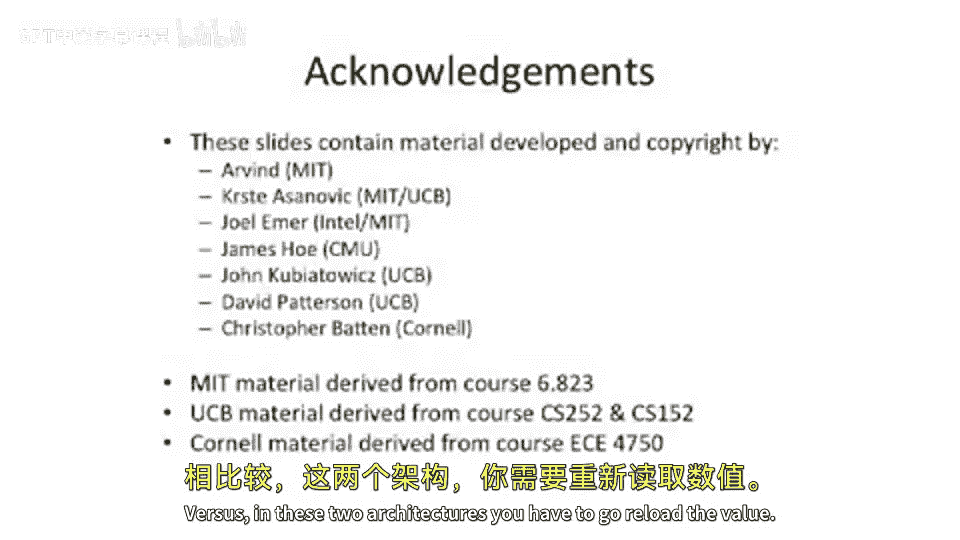
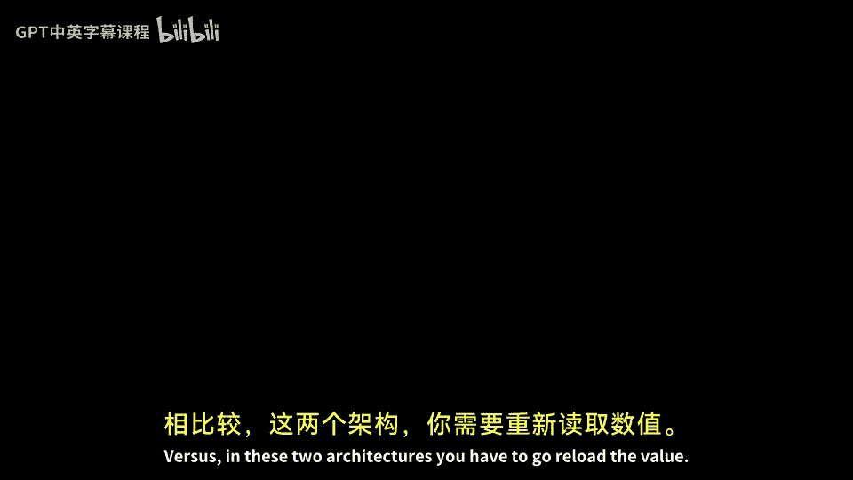

# 【计算机体系结构】普林斯顿—中英字幕 p06 5_06_machine-models -BV1ii421D7WR_p6-

So now we're going to start talking about the fundamental。

Things inside of an instruction set architecture and the things you need to build inside of an instruction set architecture。

 And we're gonna to start off by talking about machine models。So I have a question here。

Where do opera ends come from？😡，And where do opera ends and where do results go to？

So when I say opera ends， these are the data values that you're going to operate on with a single instruction on a processor and the results are where they and the data that gets calculated and where does it go。

And。This is actually an instruction set architecture or a big eight architecture concern。

Fundamentally， you're going to have some form of arithmetic logic unit or some sort of calculation unit。

And you're going to have some type of。Memory storage。And in， in a processor。

 you're probably gonna want to take stuff from the storage， move it to the A L U。

Compute on it and then put it back into storage somehow。And this is。

The processor here that we wrap around the A U and the machine model。Is。What is the。Implementation。

 what is the semantics， or not the implementation， What is the。Organization of the registers。

 How do you go to access memory， What sort of instructions and operations are allowed。

 And we're going to talk a little bit about where do the opera end come from and where the results go and different machine models that people have built。

 So this is different instruction set architectures and and even more than instruction set architectures。

Because instructor that architectures talk about how do you encode instructions even？

This is even a little bit more fundamental of。How do you go about。Reasoning about how to move。

Data from memory to the AU and back。And how do you go and store the data close to the AU？

So let's start off with。A very simplistic。Example here。

 a very simplistic processor that people have actually built。Believe it or not。

 you don't have to have registers in your processor， or you don't have to have。

Named registers in your instruction set architecture instead。You can have a stack。

A stack is just a storage。Element where you put things onto the stack。

 and then they come off in the order that was the last one that was put on there was taken that gets taken off first。

Instead， in a very basic sense， we just take the top two things on the stack。We fetch both of them。

 operate on them and put them on what would be the top of the stack。Building building up from there。

 we can think about something like a accumulator architecture。So typically。

 in accumulator architecture， if you have one accumulator。 So there's only one register。

 One of the operas for every operation to do is always implicit。 It has to come from the accumulator。

The other one， let's say， it can come from， from memory。

So you have to name one of the opera ends in an architecture like that。Building up from there。

 we can start thinking about maybe register to memory operations where you'll name， let's say。

 the opera opera end that is the source。Let's say coming from memory and you'll name。

 Let's say an opera coming from your register file。And optionally， you may even name the destination。

So these are all， these are all options。 And we'll call this a register memory architecture。Finally。

We have something like a。Register， register architecture。So I want to engage your guess here。

 how many named operas do we have here。3， okay， yeah。 And so this picture here。

 we're gonna take something from a register， something from another register。

 And we have to name where to go put it。So， that's， that's。I wanted to point out here， actually。

 the number of explicitly named operas for some of these is a little bit more questionable than others。

 so。As you can see here， we have 0。 We have a little more complicated something where we have one。

2 or3。 Now， how do， why do I say 2 or three here。So there some of these architectures。

Our architectural models don't necessarily name the resultant。Or the result location。

Some of them will implicitly name the result。 So something like X 86， for instance。

 the first source opera is always a destination。So it only has to name two things。

Something like MIps。Or most risk architectures will actually name all three。

And you can think about that happening both both memory and a register register architecture。

 So a good example of a three operaand。Memory memory， which I don't have drawn here。 This is just。

 I just have register memory drawn here。 But memory memory。

 which basically says all of your opera come from memory and all your destinations are in memory。

 is something like the vax architecture， which was popular in the 70s。

 You could actually have all of your opera come from memory do some operation on them and store back into。

😊，Memory。So one interesting trade off here is as you start to have more operas that are explicitly named。

You need more encoding space for that。 And this is one of the important tradeoffs。Okay， so's。

 let's go into a little bit of depth about a stack based architecture。

 So some examples of this are actually the burough's 5000， the symbolics machines were stack based。

And these are sort of machines from the past。There's a few modern or more modern examples of this。

 For instance， the Java virtual machine is actually a stack architecture。

And then also Intel's old floating point。System X87， they've since sort of deprecated this。

But it's still relatively modern。 It was a stack based instruction set architecture。Let's。

Take a stack based instruction set architecture and look at how you can go about。

Evaluating an expression， so here we have an expression。A plus B times C。All in parentheses。

That whole quantity divided by a plus D times C minus E。

 so it's some complex math instruction or math operation that we need to do。

Here we actually break down。This into。A parse tree of this。

 And you can see this is preserving orders of operations。Well。

 we have a plus this sub quantity here of B times C。

 and you take all of this and divide it by this sub expression here。And。

A little bit of a throwback here。This is a way that we're going to take the operations。

And if we do these operations on a stack。Machine model， we're going to get the right result。

 So what this means is。Put a on the stack， put B in the stack， put C in the stack。

 and then multiply B times C， and then add the results times A。

 And you can see that we're gonna to build this expression on， on a stack。

 So's sort of a different way to sort of rethink about problems。

And we'll walk through an example here。 So here we have an evaluation stack。

And the top of the stack is going to be whatever is on the top here in this picture。

So first thing you're going to do is we're going to say push a， so a shows up on the stack。

Then we're going to push B。We're going to push C。And then we're going to do a multiply。

 so we're going to take the two entries there on the top of the stack。

 multiply them and put them into this entry in the stack。And then we're going to say add。

And it's going to add the two top things on the stack here。And put the result here。

 And you can see that if you run something like this。

 you can actually do full computations on a very small stack。

 And what's also nice here is you don't have to explicitly name any of the opera。

 So this machine model allows you to， to run real programs。😊。

And one of the things I wanted to get across here is that the stack is part of the processor state。

And it's usually， so that's a big a instruction or big a architecture or the instruction set architecture。

 You have a stack。 and many times it's unbounded。In the big A architecture， but in real life。

 it needs to be bounded somehow because you can't have infinitely long physical stacks in your machine。

So it's conceptually unbounded。But。You probably want to have it overflow to main memory if you put too many things on the stack。

And this is an important characteristic because otherwise theres certain computations you can't do。

If for instance， the parse tree is too long here or the depth of the tree is too long。

 your stack might grow too long。Okay， so let's say we have a micro architecture implementation of a instruction set architecture。

 which is a stack based architecture。And the top two elements of the stack are kept in registers。

And the rest is in main memory， and it spills and fills。Well。Each push。Has a memory reference。

 So when you put something on the stack， it has a memory reference。

 and each pop has a memory reference because you just put something back into main memory。

But more so than that， you might have extra memory references here as the stack spills over into main memory。

 and you have to pull something back in from main memory。😡。

So that's not very good because you might end up with a push having more than one memory reference。

So one optimization from a microarchitectural perspective is you can think about having n elements of your stack in registers very close to the processor and only have to go access main memory when the register stack overflows and underflows。

 So instead of having to do a memory reference， basically every single time you do an operation or every single time you do a push or a pop。

 you do it only when the stack depth gets too large that you can't fit everything on your stack。

So' let's walk through a brief example here。 We have the same expression calculation that we were doing before。

And you can see， we can do push， push， push， multiply add， push， push， push， multiply add， push， E。

 subtract， and then do all the divides at the end。But if we have a stack size of 2。

What's going to happen here is at the beginning， we're when we do a push。

 we're going to a load from A push， we're going do a load from B。Now we do a push of load of C。

 but our stack already has two things on it。 So when we try to push the third thing。

 we have to overflow the bottom of the stack somewhere。

So we're actually going to do a stack save of a out to main memory。Here we do this multiply。

 and we actually have to do a stack fetch of a and get it back from main。

 So it's a lot of extra memory operations。So you might want to think of a different micro architecture。

 And if you sort of walk through this whole example here， we're going to see that we have。

F stores and four fetches for main memory， which are all implicit。

 plus the explicit ones that we're trying to do with the pushes and the pops。Well。

 that's eight extra memory operations。 Can we think about how to build a micro architecture which has less？

But has the exact same instruction set architecture。Well。

 let's say we have a machine which has a stack size of four。Well， if the stack size of four。

At the worst case here， we only ever have to fit four things on our stack。

 So we never have to spill out to main memory， our stack。Pushes and pops still have to access memory。

 but that's what they're trying to do。 They're actually trying to access memory。

So to sum up here about stack based machine models， they look， They look pretty cool， but。😊。

Not all things are great at all times。One of the interesting things here to see is we actually push a and we push A again。

 So we're doing redundant work。And we push C and we push C again。

C and A had the same value both times we pushed them。So all of a sudden， we're doing extra work。

 and maybe we could have done less work。If we had an architecture or a machine model。

 a big8 architecture， which allows you to store multiple things and name different opera。

 So what we wanted to get across here is。While a stack based architecture is very simple。

 the instructions are very dense。It may not be good for performance because you might end up having to reload values multiple times。

Versus if you had an instruction set architecture， something like Mips。

 or you actually have 32 general purpose registers。

 and you can name any register for any instruction， you could have loaded。A， B， C， D， and E。

 all into the register space。Once。And then done all your operations and never have had to reload。

 And this is actually an instruction setting。Issue and not a fundamental machine model issue and not a micro architecture issue。

Okay， so to summarize different machine models， we have our stack accumulator register and memory and register register。

 sometimes called load store architecture。If we want to take some expression here。

 like C equals A plus B。We can look at the instructions that would have to be generated on abstract architecture。

So here we're going to have。Push a， push B， add pop C。 as we add more naming。

 we actually can potentially have fewer registers or fewer instructions。 Ex me。 So we load a。

Add B note here， we don't have to name what we're adding with because we're adding with the accumulator and then store C。

😡，Start to get a little bit more compact if we have register memory。We can load one of the values。

 Add store。 It's pretty simple。 If we will load store architecture。

 we actually have to do a little bit more work。 We have to load， load， add store。う。But。

Which which seems inefficient。 But if you have to reuse any of these values。

 A B you don't have to go reload them versus in these two architectures。

 you have to go reload the value。

