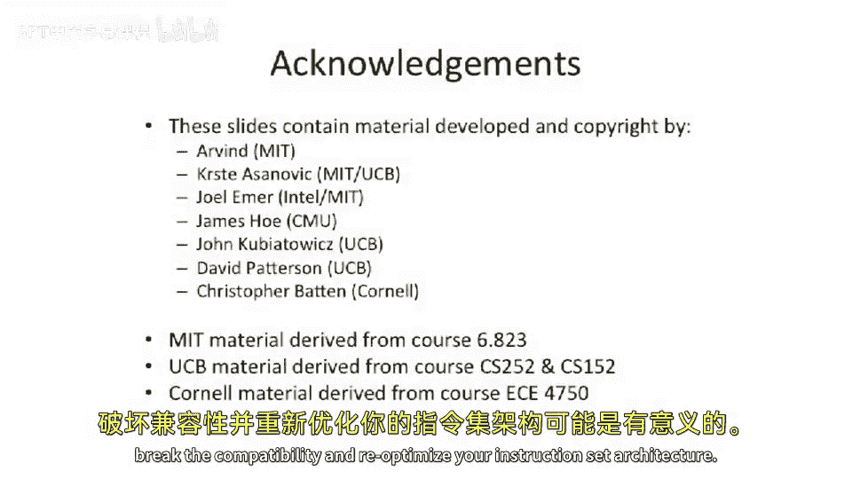

# 【计算机体系结构】普林斯顿—中英字幕 p07 6_07_isa-characteristics -BV1ii421D7WR_p7-

Okay， so now we're going to change off of machine model and talk about other aspects of instruction set architectures。

And to talk about what else is in instruction set architectures， well。

 there's the fundamental machine model， how many registers do you have。

 whether what type of register access you have， Do you have stack based， Do you have a accumulator。

 Do you have a register register or a register memory architecture。Also。

 you need to talk about what the fundamental operations that you have。

 the fundamental instructions you have。 So let's look at classes of instructions。

You start off of things like data transfer instructions。 So loads， stores move to control registers。

 So this is what MIps has。 And in this course， we're gonna be relying a lot on MIps。

 the MIPS instruction set architecture a lot for our example cases。

 But you have load store move to and move from control registers with different control registers。

 You have arithmetic logic unit instructions。 So things like。Adding， subtracting， and。

 multiplication， division。This is an interesting one here。 Se less than。 That's kind of a fun one。

 It's a comparison operator。 So if you want to take two values and compare and see which one's less than the other。

 you can use set less than load upper immediate。 This is moving a value into a different location and register as's kind of like a shift operation。

😊，You can have control flow。Instructions， so do you have branches， jumps， traps。

And one of the points I want to get across here is within and between different instruction set architectures。

 people make different choices about which instructions to have。 Some people have very complex ones。

 Some people have very simple ones， or some of the architectures are very complex ones。

 and some of the architectures are very simple ones。You can have floating point instructions。

 adding floating point numbers， multiplying floating point numbers。

 subtracting floating point numbers。 These are actually compare operations。 Ex。

 this is a compare operation floating point numbers。

 So compare less than for doubles or double precision floating point。

 Here we have conversion operations。 So it's conversion from a single。

Precision floating point number to an integer number or integer word up number。 So this is a convert。

 these is the MIps instructions。You can have multimedia instructions or what's called single instruction。

 multiple data。 And we'll be talking about Sd a bunch in this course。Later。

 when we get to data perism and vector units。And this is actually an example out of X A 6 I wanted to give of stranger operations that sometimes show up as fundamental operations or fundamental instructions in instruction set architectures is this is an example called Re Mo B。

As thought two instructions， that's one instruction。With a prefix and a space in between it， y。

This is actually valid Intel assembly code。 And what is rep moves B， Well， Re moves B is a。

String operation where it'll actually copy one string into another string。

So if you have some text and you want to copy it to another piece of text。

 you can do Res move B and set up a number andll actually copy。

 This is the moral equivalent of something like stir and copy。嗯。

So you can do that all in one instruction。 So in addition to these complex string operations。

 things like reps move Re moves B。 we can see there was sort of all jokes about adding extra and extra instructions and having really complex instructions。

 So， for instance， in the V architecture。 They had instructions that could do very complex things。

 I think there was one that even did a fastforer transform in one instruction。 That's right。

 a whole fastforer transform or across huge data set in one instruction。

 So you can see that theres lot of different choice between。

Your classes of instructions and the ISA architect or the instruction set architecture architect has to sit down and think about what should be in an instruction set versus being left out of an instruction set。

Another characteristic of instruction set architectures that the architect needs to think about is。

How do you go and access memory？And what are the different addressing modes that can be used So。

 or how do you get operas from memory？ So looking at one example here。

 we have a register based addressing mode。 So in a register based addressing mode。

We can only name two registers and put them in another register。And this is。

 a three operaran format here。 X 86 would only have two， but you can name。Register three。

 register two， add them together and put them into register four， for instance。

And one of the interesting things here is。This may not actually access any memory。

We call it a memory mode， but it may not actually access memory。

 If you have enough register space and yourre。Implementation in your micro architectureitecture actually implements all the registers。

 then won't go access memory， but it might access memory。 So for instance。

 there are machines out there where you have a register， register。

 register operation or register register register instruction。But the processor has no register file。

Everything is out in main memory。 So it has to go read the data from main memory。

To go actually do the operation。 and it just sort of cachees or keeps the。

Two operations that are needed， and it's all at the micro architecture level。

So this is all at the big8 architecture level and asking what is the fundamental memory operations that can be done。

 So that's a register based addressing mode。 We can have media based addressing modes。

 So here we have something like a constant a 5 being added to a register putting put into another register。

 So here's our assembly code for that。 You can have displacement based addressing。So in displacement。

 we're going to take a register。Value added to a some constant。

 and then take that and look up in main memory。That location， and then do some operation。

 let's say of another register。 But this is a displacement based and it's called displacement because you can take a register and have some displacement off of it。

You can have register indirect。 And this is pretty common on something like MIps。 Or actually。

 if you go look at the ittanium instruction set， they don't have displacement stuff。

 They only have register indirect。 So this is similar to the displacement。

 but you can't have a displacement， you can only go and read from a particular。

Memory address that's stored in register。You can have absolute addressing。

 This is actually not very common on most modern day architectures， but in the older older machines。

 as well as common。 So you take memory and take a constant。

 not out of a register and go look up in memory and then do some operation with that。

You can have memory indirect。And this is。Kind of interesting way to denote this here。

 MiPS very much does not have this。But you could do a memory operation of a memory operation of a register。

 So what youd have is in a register， you'd have an address。And then you would take that address。

 You look up in main memory， get the data， and that itself is an address。

 And then you look up in main memory again with it。

 So it's sort of double index based off a register sort of a addressing mode。 And that's。

 that gets pretty fancy。 So if you look at something like Vax， they definitely had this。

You can have PC relative or program counter relative or instruction pointer relative addressing so you can take the program counter。

 add some displacement and then index memory， this is very useful for position independent code or code that you don't know where it's going to be loaded。

And if you want to go access some data close to where the code is。

 you don't know exactly where the code is loaded。 but the program counter。

 because you know what instruction you're executing。

 you can basically index off that and find memory around where you are around where you're loaded in main memory。

 So this is for pick code。You can also have scaled。

 This is something that X 86 has where you can actually take a register。

And add it to another register， multiplied by something else。So in X 86。

 this is called S IB scaled index and base mode。 So you can actually take a displacement add to some two registers and multiply it。

 And this is very useful if you're trying to index through an array of some size。

So if you have an array of。Four byte words。You can just keep ticking up this counter here。

 So you start of 0，1，2，3。 And as this ticks up here， instead of going up by a by。

 you'll go up by4 Bs at a time。 And if you're the data you're trying to load is4 bys long。

 you'll actually be able to just pick up the exact elements in the array you want versus having to do this multiplication someplace else。

 Usually these scaled operations or scaled memory dressinging modes have very limited sort of multiplication here。

 you can't multiply by， let's say 7， usually it's sort of multiplication by factors of  two or small set of factors of  two。

 because that's that's easy。 That's a shift operation in base 2。

And then you can think about data types and their sizes。 So what do I mean by data types。

 Well you can have binary。Integer， you could think about having。Different types of injuger data。

 You can think about having。Unaryd， binaryd。 You can think about having things that are。

Sort of role in different ways。 So， for instance， as you probably learned about in your computer organization class。

 theres ones complement versus twos complement arithmetic。 And that's different data types there。

 So you have binary integer data and saying whether it's ones complement versus two twos complement is is pretty important。

 You can have binary coded decimal。 So this is where each digit。

Is encoded with  four bits from each decimal digit， if you will， is encoded in sort of the。Pointter。

 it give me the。Period， if you will， is， is also encoded in there between your fraction and the integer portion or the。

 the， the。The natural number portion。So your binary code of decimal can have different very exact calculations for things like spreadsheets and business calculations。

 You can have floating point types。 And there's actually a lot of different floating point types here。

 You can have。There's a standardization now that's called Irople 754。

 which is what's used in most modern computers。 And this was different than the crray floating point on cr supercomputers。

They had a much wider floating point， and they also had different numbers of bits given to the Mana versus the exponent。

And by doing this， their precision could be different in different ways。 So， for instance。

 you could have a bigger range of numbers with the precision smaller or a smaller range of numbers with bigger precision。

 and there's different trade offs there。Also， Intel， internally， at least in X 87。

 had this thing they called Intel extended precision。Which is 80 bits long。ITE 754。

 the biggest thing defined in that is a 64 bit double。

 But if you want even more precision to your floating point numbers， you might need 80 Bs。

 You can have packed vector data。 This is like M M X data。

 Were trying to pack the data altogether together and operate on it at the same time。

 So typically things like M M X， you need to bring the data into a packed data type and then operate in that whole data type。

 So which has different values in it。And some architectures even have。

A special data type called addresses。Which is different than a binary integer。

So some older computers actually had address registers。

 and the address data type was different than the data data type or the binary integer data。

 And that was different than the floating point data type。

 And there was different registers and different register names for that。

And what was nice about that is they knew that if you loaded something into the address registers。

 it was definitely an address。 So they had type information。😊，And that's separate from the width。

So let's say you have binary integer。 Well， people have built machines， which have 8 bit，16 bit，32 B。

64 B， All these different things is sort of the default word size。And then finally。

 one of the important things you need to do is come up with the encoding of the different instructions。

And there's been a lot of debate on this of should you have fixed with versus variable with instructions。

 So let's look at a couple different I Ss and see where they fall， what camp they fall into。

So most risk architectures are fixed with。 So you have mips， power PC。

 Sp arm falling into this category。 And as an example， mips。

 we're going be talking a lot about in this course is every instruction is exactly 4 B。Wong。And。

What's nice about is easy decode。But it may not be very compact。😡。

On the other side of this question about ISA encoding， you can see。

Variable length instructions where the width of the instruction can vary widely。

 So what's nice about this is you can have things that take up things that are very common。

 take up very small amount of space。 So if you have an instruction， which is like 1 by long。

 and it's always called you could effectively do a manual Huffman encoding on your instruction sets。

 So you take the most common things and you put them in the smallest amount of data。

 But if you have something very uncommon， you can have take a lot， a lot of bys。 So an example here。

 X 86， you can have between one and 17 bys for an instruction。

 I think this is actually been updated now， if you look at X 86，64 and can between 1 and 18 bys。

 So and a couple ideas here， it could be everything in between1，2，3，4 all the way up to 18。

And some cisk architectures， you have IBM 3，60s is a good Si example of a complex instruction set architectures。

 X 86， Motorola，6 K， Vax。 These are all variable length instruction encoding architectures。And now。

We start to get into something which is a little fuzzier。

 There's things that sort of start to cross over。People started to look at。

 started to build mostly fixed or compressed。Instruction set architecture。 So example。

 this is something like MIps 16， which is effectively a MIps instruction set where there is both 32 B or 4 B instructions and 16 B or 2 B instructions。

And thumb。Which is the。Compressed or the mostly fixed instruction set architecture of arm。 Yep。

 got a love the naming there。 also did the similar sort of thing where they had two bys and four bys as a different instructions。

This is a little bit different than compressed。 So this is like a mostly fixed architecture with sort of two different instruction sizes。

If you look at something like power PCC and V some VI Ws。

 they actually have a compressed file compressed format where they will actually store the instructions compressed and decompress them when it ends up in main memory or ends up in the caches at least。

 So you can think of some architectures where the code in main memory is small。

 But then when you get to the cache maybe it gets expanded or gets expanded when it comes out to the main processor。

And then there's long instruction words where you actually can explicitly name multiple instructions happening at the same time or even very long instruction words or what's called V I Ws。

 which willll be studying a bunch in this course。Where you can put multiple fixed with instructions in a multiple instructions in a fixed with bundle。

 So some good examples here are multiflow， the L X architecture from and also from S T micro。

 the L X architecture which is from H P and S T micro， which is shows up in printers today， mostly。

T IDSP are actually V I W architectures and a couple other good examples。So， just a。

Show here something complex of how you end up with 1 to 18 B。 Here we have X 86's instruction set。

 And fundamentally， you need an op code， a byte worth of op code。But you might。

 some instructions might have between one and3 bys here。And then there's。Different addressing modes。

Special information about different address modes， displacements。

 immediates about the different address modes。 And those all take up more space。

 And they can also have prefixes。 So that rep in rep Re moves B is actually a prefix。

 which says repeat this operation multiple times。 You can encode all these things in a。😊。

Variable with instruction format like X 86。 And to give you an example of something like MIps。

Every instruction on MIps exactly4 bytes long， And they have to fit everything into it。

 So a ISA architect or instruction set architecture architect has to decide the layouts of the bits within the instruction set。

 And that's usually something' defined find in the instruction set architecture。

 So to sum up some realwor instruction sets and where they fall with different numbers of operations。

 number of memory operations， data sizes and registers。

 Let's walk through a couple different instruction set architectures。

 And you've probably heard these in past these in passing。

 but you may not have actually used any of these machines。

 But that's because some of them are embedded or some of them don't aren't commonly used anymore。

But they're good to know about。 So let's start off with Alpha。

 Alpha is built by Digital equipmentquipment Corporation。

 and it's a register register architecture with three named operas。

There is no explicit memory operas in the instruction set。It's got 64 Bs is the default data type。

 And when it actually Alpha originally came out， you could only do 64 bit operations with it。

That was sort of later changed as they figured out that might not have been the best idea。

64 but addressing。 And it was mostly designed for workstations。 So big addresses， fast computers。

They can see something like arm。 arm is used in my cell phone。

 It's a architecture that has lot of different implementations of。

 and they've licensed it to lots of different people。 But it's also register， register， register。

Three opera ends。There's a 32， and then now is a 64 bit data size that has just come out。30。

 excuse me，16 registers and the addressing， as I said， 64 B version came out， but is mostly 32。

 And it shows up in cell phones and embedded applications。MPS， which is。

An outgrowth of the Stanford Mips project。 and later it was commercialized。 Reg， Reg register。

 We're going be focusing on this mostly in this class。Sort of similar。Worktation embedded。

Spark is another instruction set， this is what Sun originally used or used to use。嗯。

It was outgrowth of the risk one and risk two sort of architectures。It has。Well， this is。

 this one's interesting between 24 and 32 registers， depending on how you， you look at it。

 They have this interesting idea where。As you load more data in， sort of。

 or as you do function calls， data gets spilled out into main memory and gets pulled back in from main memory。

 kindnd of like a stack。 So it sort of a mixture between a stack and a。

Register architecture mostly used for workstations。 You can see that T I， C 600， more for DSP。

But then we can start to see some more interesting stuff down here。 Let's take a look at Vax。

 So Vax is a memory memory architecture where has three named operarans or could have up to three named operaans。

 and all three of those can come from main memory。😊，It hass relatively small number of registers。

We can see something like the Motorola 6800。 This is not to be confused at the Motorola 68000 or the 68 K。

 This is the 6800。 is it accumulator based register or accumulator based architecture。

Where you can have one named opera end。That comes comes from memory。 It's an 8 bit data path。

 And this is mostly used in a microcontroller。So why the diversity in these instruction set architectures well。

Instructions that architecture is actually influenced by。

Technology or influenced by transistor technology。 So we see that if storage is limited。

 we might want tighten codingding。🤧K。And on the flip side is， if you have。

Very small number of transistors。 You might want to try to fit the entire chip on there。

 And this was the actually fundamental idea behind risk。If you have lots and lots of transistors。

 you might not have to worry about having to shove everything onto a very small amount of area。

 You can think about adding multi core in many cores or putting multiple processors on there and build instructions that architecture specifically designed for multi cores in many cores。

And then also， instruction sets are many times influenced by their applications。

 So a good example of this is if you're building a signal processing architecture or or a digital signal processor。

 with DSP， you might want to add DSP instructions。And then finally。

 I want to talk about how technology from software has influenced instruction set architecture over time。

So if we look at something like the Spk architecture， it has what's called the register window。

So in the register window， what happens is whenever you do a function call。

 it'll actually take eight registers and put them into memory， and then you get eight new registers。

When you do a return。It takes8 registers from memory。

 and puts it back into your register file and sort of swaps out the ones that were there before。

And what this was was at the time that Spar was made。

 compilers didn't know how to do register allocation。It just was like an open problem。

Since that time。Register allocation。Figuring out how to take a fixed number registers and move data in from a stack in main memory。

 And vice versa can be orchestrated very effectively and very efficiently by the compiler。

 But the time compilers were very simple。 So people didn't know how to do that。

 So they needed hardware help to do that。 So the instructions said architecture has that bill baked into it。

But now that we have effective register allocation。

 we've not seen any other register windowed architectures come along after that。

 And if you talk to anyone who's actually went and implemented a spark instruction set architecture。

Micro architectureiture， they basically hate register windows。

 It's like the bane of this architecture。 But at the time， compiler technology was not good enough。

So。Applications influence it。Compilr technology influences your instruction set architecture。

Technology influences your ISA， and I S As have evolved over time， even though。

 as we said originally， you know， a lot of times people want to build I As that don't change so you can keep running software and have binary compatibility。

 But， you know， at some， at some point， it might make sense to actually break that compatibility and re optimizeimize your instruction set architecture。

