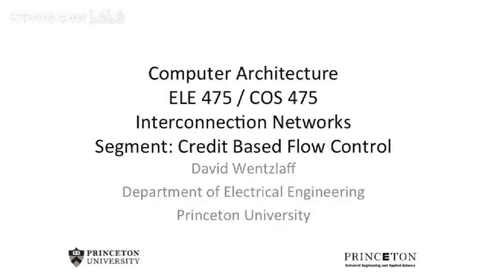
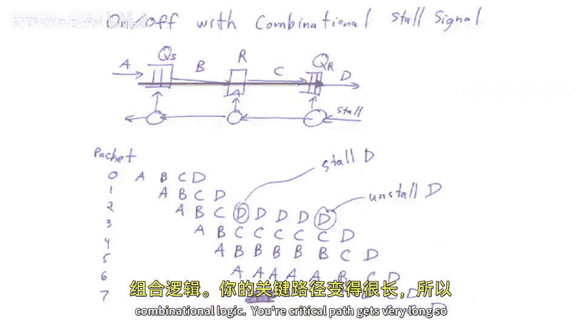
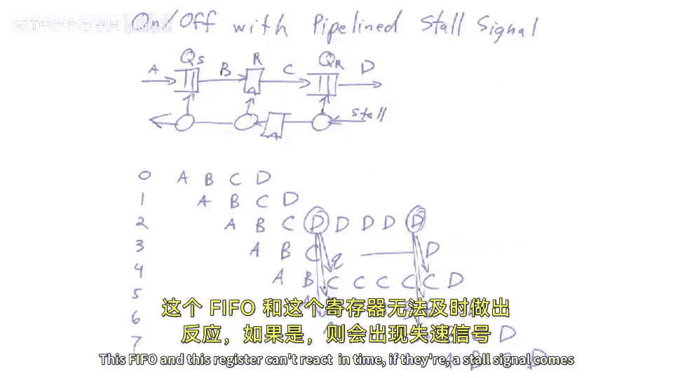
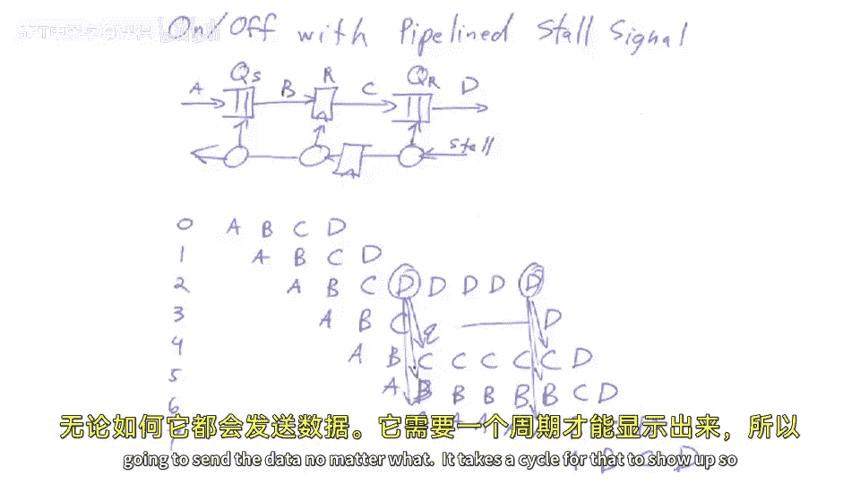
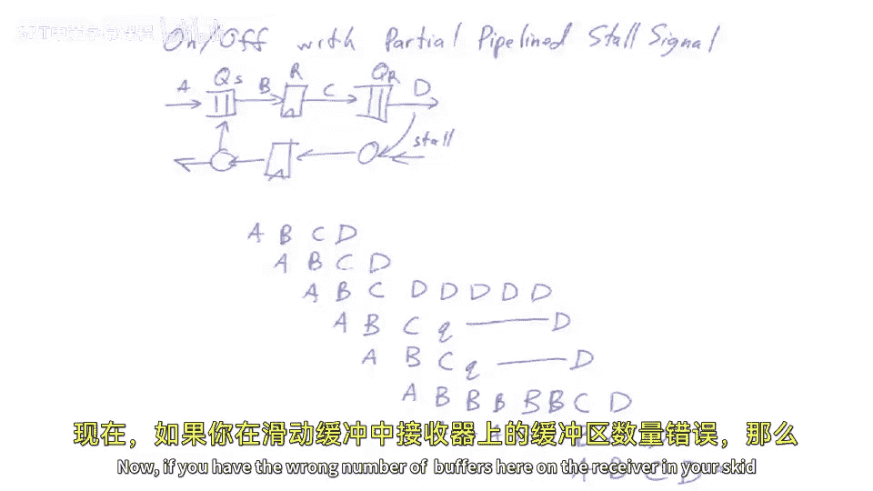
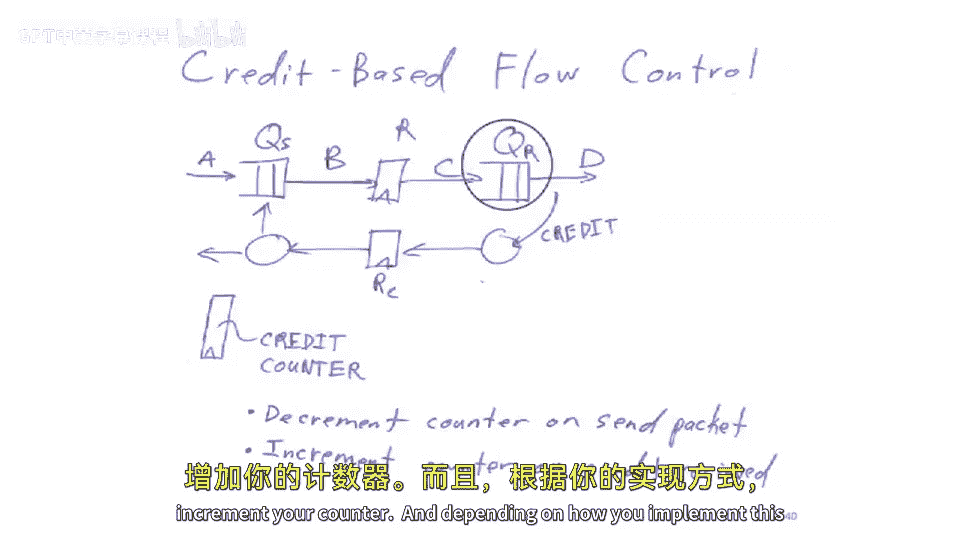
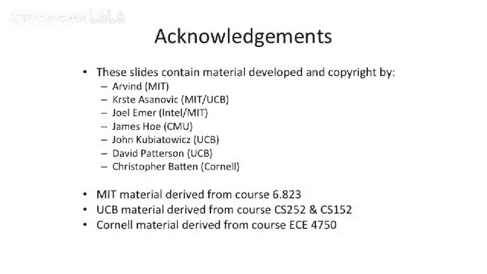

# 【计算机体系结构】普林斯顿—中英字幕 p103 102_02_credit-based-flow-control -BV1ii421D7WR_p103-

So today， we're gonna start off as our final installment of E E 4，75。

We have to cover all of the rest of computer architecture in this one lecture。

So there's a lot to cover。 A lot of things too。Discuss。 But more seriously， today。

 we are going going to be finishing up what were talking about with interconnection networks。

 mainly credit based flow control。A little bit about deadlock。 and that will complete our。

Interconnection networks。 And then we'll go on to。More scalable cache coherent systems。

 So cache coherent systems， which have more than， let's say 8 nodes。

 So we'll look at how to scale up to thousands of nodes。 and we'll。

 we'll touch on one coherence protocol that that works for that。

And that's called directory based Ca clearance。So we left off last time we were talking about flow control。

Between two separate nodes in a interconnection network。And we talked about， sort of。

Local link based or hop based flow control， which is what we spent the end of last class talking about。

 We also mentioned this end to end flow control。 And end to end flow control is important。

 A good example of this is something where you have。

A core which is trying to communicate to a memory controller。

And you don't want to overrun the buffer in the memory controller because if you overrun the buffer in the memory controller。

 your memory transactions just drop on the floor， so。It's possible your interconnection network is。

Lnk level flow controlled or hop based flow controlled。

 But you still need a end to end flow control inside of your。Chip or your。

Set of chips in your system to be able to prevent you from overrun some other buffer that's farther away。

Now， you could， for instance， back up into the network and have the local flow control all the way back up all the way to the core。

You may not want to do that for a variety of reasons， one。

If you look at these memory protocols very carefully。

 you could end up with something that actually starts to look like a deadlock pretty quick as you start to back up into network and can get sort of priorities mixed。

Also more， more insidiously here is that。As you back up， this is probably not good for performance。

 You probably want to stem the flow of traffic as soon as you can。

 because if you start jamming more data in there， you're just going to increase the contention on your network。

And the latency will shoot through the roof on your network。 And all of a sudden， you're。

 you're sort of in a very， very poor operating regime。

 So it's probably better just to preemptively back off and not overrun the buffers that are far away。

 So you have to worry about and end flow control。 And this。

 there's lots of different schemes for this。 Probably one of the better ones is that you send some data and you wait for acknowledgecledments to come back and you count your acknowledgeledments。

 And this is effectively some credit based flow control。

We talked a little bit about different。Ways to。Flow control at link level。 So just to recall here。

 we had it。 one Q， another Q， some link in the middle。 this link may be pipelined。

And we send data this way。 And at some point。The receiver says， oh， I can't take any more data。

 So it sends a stall wire。 But if you do this around your entire ship where it's all combinational。

 these little blobs here are just combinational logic， your critical path gets pretty long。

So you can start to think about trying to put registers on this path。Unfortunately， when you do that。

 all of a sudden。This PO and this register can't react in time if their a stall signal comes back。

So if a stall signal is asserted。

It's gonna to send the data no matter what。 It takes a cycle for that to show up。

 So you end up with something where you need to cu this last piece of data here into a buffer because。

This stall is not seen until cycle later。And this is we call this skid buffering。

And you could have similar sorts of things where if you have， let's say， a flip fl here。

 but you don't feed into this register。 You might need multiple entries of skid buffering。Now。

 if you have the wrong number of buffers here。

On the receiver in your skid buffering， what's going to happen is you actually end up dropping data。

 So if you， your protocol needs， let's say two buffers。 And instead。

 you put one buffer and you assert this stall and those data trying to be transmitted across the link at that time。

 you're gonna lose a piece of data。 And that's， that's not very desirable。

So this brings us to the end of what we were talking about last time。

 which was credit based flow control and in credit based flow control。

 instead of having a stop signal or a on off flow control signal coming back or a stall signal instead。

You keep a counter。At the sender side， which keeps track of how many entries there are over here in the receiver side。

 And this can take into account。 You know， this register here doesn't get counted。 It's。

 it's the endpoint FiIO space that will back up and data can be stored into。So when it starts out。

 you ink， you， you set the counter。 if you want full bandwidth through this to be the same number as entries you have in the receiver。

 and you start to send data whenever you send the word， you decrement your counter。

When the counter reaches 0， you stop sending because， you know that。

All of these all of the round trip latency here of the， the data and the responses coming back。

 or the credits coming back。 if the stall signal to be asserted or if you were not to get back credit in that instantaneous cycle。

 you would need all those entries to skid into。When a word gets read out of this buffer。

Here or this PIO here， you send back a credit， and this will increment your counter。

And depending on how you implement this， you can have multiple flip flops here。

 multiple flip flops there。 And really， all this really ends up doing is it ends up figuring out your credit loop and how big this counter needs to be。

One other nice benefit of this credit based flow control system is you can actually size the credit counter different than the number of actual entries。

Now， why would you want to do this？ Well， one reason is you could actually build a network which has only。

 let's say， half the bandwidth。By reducing the number of entries over here。

And reducing the credit counter。Now， the round trip latency is longer。

 So than the number of credits you can have outstanding。

 So what's gonna to happen is you're gonna send some data and you're going to stall early。

Wait for some credits to come back and then start sending more data so you could effectively get less than ideal bandwidth across the link。

 but you can do it with less。Offer space on the receive side。

And this is a lot better than the other on off base flow control。

 where if you don't have the right number of buffers。You actually end up losing data。

 So it's like an incorrect design。 Here's just a performance concerned。

