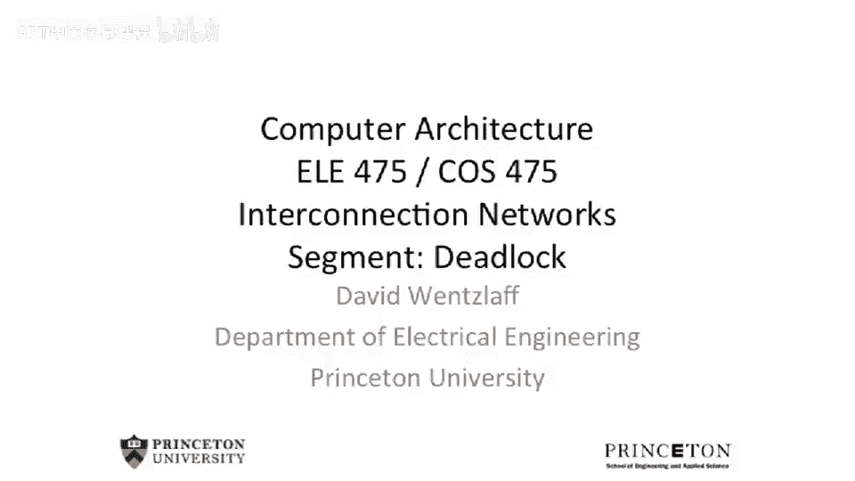
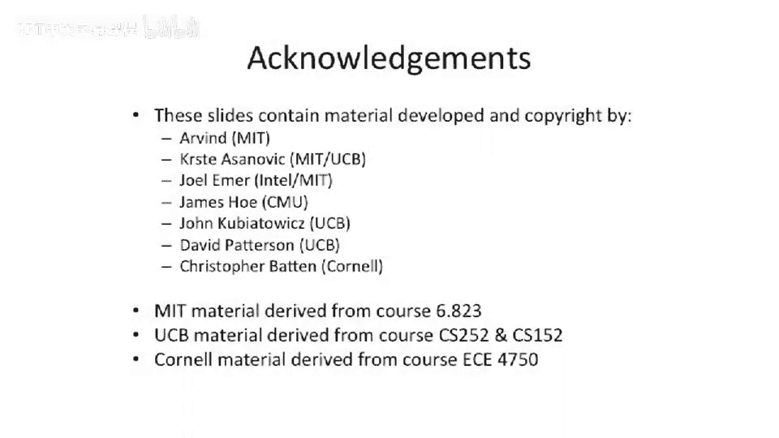

# 【计算机体系结构】普林斯顿—中英字幕 p104 103_03_deadlock -BV1ii421D7WR_p104-

Okay， so this。Brings us to the end of interconnection networks。

 And what I wanted to talk about was deadlock。So let's assume that you have。3 nodes。Labeled one， two。

 and three here。It's on a 1 D， or excuse me Yeah，1 D torus。That is unidirectional。

 So links only flow in the clockwise direction here。Now， all of a sudden。

 you have node 1 wants to send a node 3， node 2， wants to send a node 1。

And node 3 wants to send to 2。And were to look at a wormhole routed network。

 So the wormhole route network， you start to send the header words。

And the tail has not potentially not even been injected into the network at this point。

Let's say they all start exactly at the same time。So one is going to start sending。To 3。

2 is going to start sending to one。The reason going start sending to two。

 And you'll notice is each set of these has one overlapping link。With the previous one。

So there's gonna to be some contention on that link。So very quickly。

 you can see that if we were to all， if we were to launch these three messages exactly at the same time and the message length was long。

None of them would actually get to the receivers。

1 would use this link or one saying to three would use this link 2。

 sending to one would use this link。3， sending to two would use this wraparound link。

 But then all of a sudden， they would try to acquire the next link， but it's already been reserved。

But they can't give up the link because they've already acquired the link。 So all of a sudden。

 you have a deadlock。So these numbers get pretty tricky。

 And one way that we go about trying to see if our routing protocol is deadlock free or actually can deadlock is we start to do something called Waits for analysis or weights4 and holds analysis。

And waits for and waits for and holds analysis。 The basic idea is if so this is。

Looking at our example that we saw before， we have three routers。

 What's happening here is we're injecting into a。And。This a。いいぞ。Acquiring this。

Link or this fiIO here。 And then。It needs to acquire the next one。So let's draw this as a diagram。So。

 a。Holds。T Q2。 So A holds T Q2， this one here， this inbound Q here。

And when we draw weights for and hold analysis diagrams。When we're waiting on something。

 we draw a edge from the thing that is doing the， the actor to the resource that we're waiting on。

 and the holds actually goes the in the opposite direction。 So if a holds T， Q 2 here。

 we actually draw the edge the other direction。Soul sun。A is holding TQ2。😡。

And it's waiting to acquire T Q3。This one here， because it needs to transit that link to deliver it into T into 3。

But at the same time。B。Has acquired TQ3。So it's holding that， and it's waiting for。T Q1。But。C。

Currently is holding TQ1。And is waiting on T Q2。So this is how we do deadlock analysis from a proof perspective。

 We actually will write these dependency graphs or waits for and holds graphs。

 And if you find a cycle in your protocol， your protocol can have a deadlock。

 And you need a couple of some way to cut a link here， cut a cut a edge in this graph。

 or you need to completely redesign your protocol。But this is the sort of canonical way that you can do this。

 And if you start to look at different rounding protocols。

 some of them can possibly deadlock and some of them can you can prove statically to all possible weights for and hold graphs you can come up with。

We'll never have cycles。So as I think I mentioned last time， if you look at dimension order routing。

With wormhole routing。All possible inputs and outputs on that。

 you're never actually going to have a deadlock。 You'll never come up with a cycle in the graph。

 And the reason for this is you only ever acquire X routers。And then Y routers will say。

 if you have the dimension that you acquire X and then inquire Y。But you're never going to have。

 effectively something that is。Holding Y， trying to acquire something on the X axis。

 So you're never gonna have a cycle in that waits for an hold analysis。I just briefly wanted to。

Some up here that。Deedlock is actually not an enemy。You can try to use Dlock。To your benefit or。

 or just live with deadlock。Just because your protocol has deadlock does not mean you can't try to recover from it。

So what I mean by this is。Deadlock avoidance can be very expensive。

 So trying to draw all possible graphs here， you should think about， you know。

 where your deadlocks happen in your systems and plan them out。

And make sure they don't happen often。But some of the things you need to do to try to cut edges here might be too restrictive。

 So， for instance， dimension or routing or only route in the x dimension。

 and then the y dimension could be very expensive relative to an adaptive routing scheme。

Where you try to route around congestion in your network。So。This deadlock avoidance， you know， you。

 you'll design the protocol to never deadlock。 but this could be quite expensive。So alternative。

 And this is something you should not necessarily be afraid of。

 but you have to be careful of this is that you find the deadlock。

And then you try to recover from it。So what I mean by this is on chip network or a multi chip network。

 You can actually have a deadlock occur。Notice that a deadlock occurred。

And either try to roll back the state and somehow jitter the states of a deadlock won't happen a second time。

Or many times， these deadlocks happen because you're dependent on one particular buffer in the system and two people trying to acquire that buffer。

 So you can try to virtualize that buffer。Effectively。

 saving the state of that buffer in a memory and adding more， more states。

 So you a lot of these protocols， if you were to add more。FIO entries into the system。

 it would actually break the deadlock。 So sort of going back into this picture here。

 if all of a sudden， if I added another， let's say， PIO here that the inbound traffic went into。

 and then this other traffic tried to bypass it， it would actually cut one of these edges。

 and all of a sudden you would not be having a deadlock。

So you can think about trying to have a deadlock recovery mechanism。 And that is an example of it。

 So a good example。 This is actually the raw micropocessor from M T， where。We are。

You can actually have deadlocks occur on the on chip network。Is dimension order routed。

But you can still have message dependent deadlocks。 So what I mean by that is。

While the network itself is not in a deadlock， the traffic flows you have on top of that that。

 for instance， your memory coherence protocol on top of that could potentially deadlock。

So how do you recover from that， Well， you can actually have a counter， a timer。

 which goes off when you determine that the network has not moved for 1000 cycles。So all of a sudden。

 you're running along and no traffic moves on your network。 Well。

 it's a pretty good indicator that you have a deadlock condition because something should be flowing。

 There should be some forward progress guarantees。And if you notice that， aninterrupt will go off。

 So this timer will go off saying nothing has moved on my network for 1000 cycles。

 This is probably a deadlock so that you can take it interrupt。

 And then software can go look at all the state in the network。

And introduce more buffering into the network。So effectively， through software。

 try to virtualize a particular fiIO entry。And that can break the deadlock。

So there are ways to recover from deadlocks。 If your network is， for instance。

 used for your message passing network， you can just use memory to go do that。 So actually。

 on the raw processor， our memory coherence protocol。We used deadlock。Avoidance。

 and then our message passing protocol message passing networks to use deadlock recovery。Later on in。

 in Tlerra， actually， we have something depending on which memory network we have mixtures of these two。

 And you might say that sounds scary。 But if you walk through the proofs and you're very careful about it and you're guaranteed that you don't need any more resources to go break the deadlock。

 you may be okay。But yeah， it's， to some， it's playing with fire。

 You gotta be a little careful of these， these sorts of solutions when you're trying to play a deadlock recovery。

But if you're guaranteed that you're not going to need more resources。

 you can just resolve it right then。And， oh， so the reason you would want to。

 to use didlock recovery is it does not restrict your protocol。And by doing that。

 you can have the common case of your protocol be very， very fast。

And you could make it so that the deadlock almost never happens or never in in practical concerns ever happens。

 And then when the deadlock does happen， Oh， you take a little bit of a performance bump performance hit there because you have to virtualize it in software。

 But the probability of it happening is so low。

