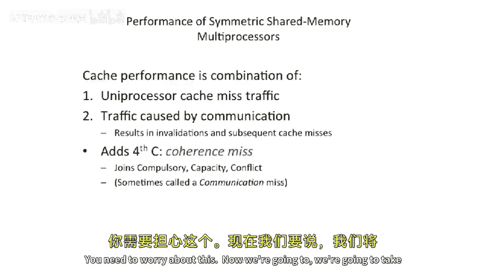
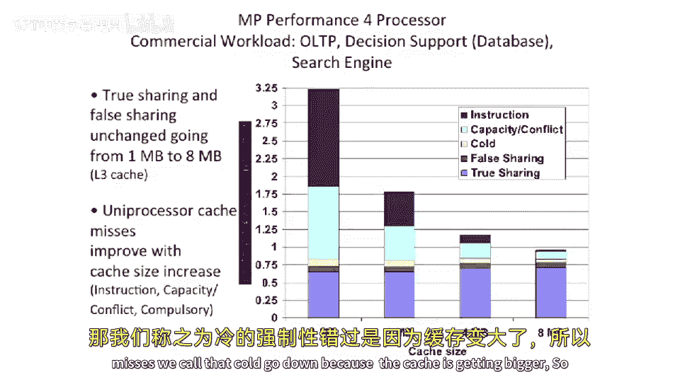
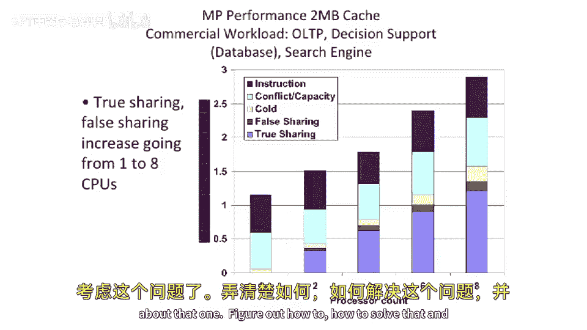

# 【计算机体系结构】普林斯顿—中英字幕 p105 104_04_false-sharing -BV1ii421D7WR_p105-

And move on to our final topic of E E 4，75。Which is。Directory based cash coherence。

It's a little bit of a warm up here。We remember the three Cs of。Cashs， we had。Compulsory misses。

 capacity misses and conflict misses。Well。We're going to think about adding a nuous type here。

A coherence mess。So our coherence myth is some other。

Cash or some other entity reaching down into our cache and invalidating something there。

So this is strictly different than compulsory capacity and conflict。

 If Atia looks the most the closest to a compulsory miss， because you're effectively。

It's it's like a first miss， but someone。Some other entity bumped out of your cache。

But it's it's not any of those either。So it's this communication that's coming from other cores that is even in a snooping protocol or symmetric shared memory multiprocessor that other traffic comes in and will actually bump things out of your cache。

 You need to worry about this。

Now， we'， we're going to take these coherency misses and put them into two different categories。

True sharing。 And we， we talked about this briefly at the end of two lectures ago or three lectures ago。

 Well we're gonna， we're gonna categorize this as two different categories of misses。

True sharing thises。Which we're gonna say is that if you were to have a cash。

Where each block length or cache line size is exactly。

 let's say 1 by or the minimal size that you can have on your machine。

 you would still have that miss。So that's a true miss。 and true miss。

Is if you're actually sharing data。 So if one cache， let's say， write some data。

 another cache wants to go read or another pro wants to go read that data and needs to pull into its cache。

 That's a true sharing this。 You need to do that communication。Now。To contrast that。

We talked about false sharing or false sharing misses。And what a false sharing this is。

 is saying that if you were to reduce the sharing size or the block size down to， let's say。

 one byte or one word。And。You run the same program。And then this occurs。Or the miss。

Occurs when the block size is， let's say one versus or excuse me。

 if the this occurs in the larger block size versus when the block size is one。

Then that is actually a false sharing miss。 The block size was too big。

 and you had two pieces of data in the same cache line that are effectively causing a。Sharing。

 even though there was no true sharing going on of the data。

It just so happened they're packed into the same cache line。Now， it's a little bit more than that。

 We're also gonna say false sharing can happen when。

Data gets moved around， or gets invalidated。But it's not being。

 it may be shared later in the program， but that exact miss was not because of data being communicated。

So it's a little bit broader than what we said last time。It。

 it does still happen because there's two pieces of data packed into the same line。 But effectively。

 what I what I'm trying to get at here is you can have data sort of bounce around between different caches。

And the same instruction sequence or the same load in store sequence would not cause the misses if you had a very small cache line size。

 but does happen with a large cache line size。 So let's。

 let's look at a example here and try to categorize these different misses。So let's。

 let's start off here。 The initial conditions are。X and x 2 or X1 and x 2， which are two pieces。

 two words of data， are packed into the same cache block or the same cache line。P1 and P2。

Have both read the data。And it's， it's， it's readable in both。Cashs at the beginning of time。Okay。

 so all of a sudden， we do a right。To X1。And we have to， what do we have to do， well。

We're gonna have to invalidate。X1 in P2。And this， this is a true miss because the data was in both。

 We need to pull it out of the one。 We need to actually invalid it。Because this is actual。

 actual real data。Okay， so next thing we do is P2 goes and executes。A read of x2。我。

What you may notice here is。At the beginning of time。X 2 was in the cache of P2。

But it got bumped out here。AndP1 never went to go write X2。So this is a false sharing miss。

This got it exclusive in to P1's cache。 And this is going to pull it out of that cache。

 and invalid invalid。So what're going gonna call a false myth， because。

X 1 was irrelevant to P2 for this， for this mess。Okay， so now。We see another right to x1。Well。

P2 didn't actually touch X X1。 So likewise。This is completely false sharing。Now， we see right to X2。

 well。We didn't see any communication going on here。So this is also a false。Sharing this。Now。

 finally， we have something that's real here。 We're going read X 2。 we wrote X 2 there。

 we read X2 here。 We're actually communicating data。😊，So this is true sharingrry。And that's okay。

But we want to try to minimize these， these false sharing patterns。

This is just a warm up and motivate us into directory based coherence a little bit。

Okay， so let's， let's motivate this a little bit more and。Let's look at something。

Like a online transaction processing workload。 So this is a database workload。

 So it's a multi processor database workload。 It's using threads。And。What we're gonna see here is。

 we have。Were going run the same workload。On a four processor system with four different cache sizes。

 This， this data is taken from paper from your book。And。

What you'll notice is as you increase the cache size。

Our false sharing and our true sharing don't really change。 You still need to communicate data。

 And you're still going get false sharing just because you make the cache size bigger。

 It didn't change the block size。 You're still to get the same false sharing patterns。

But as you increase the cache size。The instruction。Misses， the capacity misses， the conflict misses。

 the cold， the， the compulsory misses。 we call that cold， go down。Because the cash is getting bigger。

So， non shared cache lines。Performing the， the， the。Number of memory cycles。

 the amount of time you take memory misses there is going down。 But the rest of this is not changing。

嗯。Well， okay， this is， this is interesting。 So the second question comes up is。

 what happens if we increase the number of cores in our system。

So this is a relatively small system here。Let's let's plot the number of cores here from one to8 with the same workload。

And look what happens。 So if we， we look at this， Something else is invariant here。

 This is for a fixed cache size。 We're going to plot the number of processors down here now。V。

Number of memory cycles per instruction。For。Instruction misses， conflict， capacity misses。

 cold compulsory misses。Doesn't change。Just stays the same because that's basically un processor based。

But as you add more cores， you get both more true sharing。And。More false sharing。H well。

This is a little scary。Because our performance is basically going down as we add more cores。

So this is only up to 8。 What happens if we're you， way out here at 100 quarters。

What do we think is gonna to happen？ Well， we're probably going to be dominated。

Our performance is going to be dominated by the sharing and the false sharing。And these cash misses。

嗯 well。We need to start thinking about that one。Figure out how to。

 how to solve that and think about scalability of coherence systems。

