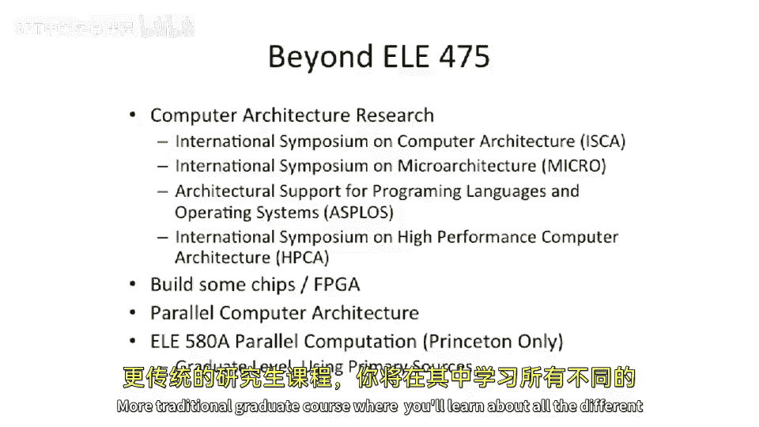

# 【计算机体系结构】普林斯顿—中英字幕 p108 107_07_scalability-of-directory-coherence -BV1ii421D7WR_p108-

Okay， so。Multiple logical communication channels。What we just talked about with all these different message types here。

 plus like the 10 not drawn。Can't all go on the same network at the same time。

 If you have one interconnection network or one logical， excuse me， logical network here。

You can end up with cases where you have。Responses。

They get queued behind requests that will create more traffic。So in these protocols。

 we have multiple phases of of communication。 We send message from point A to point B。

 and then from B to C， and then from C back to B， and then B back to A or something like that。

 So if you try to overlay this onto to an interconnection network and you do head of line processing。

 So you process the message， which is at the the head of the Q first。

It's very common to have something where you have a new response that sneaks in。

Which is dependent on some other transaction that's happening somewhere else in the system。

 And you're waiting for。So me， a new request that comes in that gets queued behind a response。二 me。

You have a new request that comes in， which is in front of a response。And all of a sudden。

 you're going to have a deadlock。So one way people go about solving this is。

You look at all the different types of messages that you have， message types that you have。

 and you figure out which types can coexist on the network at the same time。So good example here is。

 I think， if you look at a relatively basic cash cohernce protocol。

 there's maybe 12 different message types。You can try to shrink that down to me 4。

3 or four different classes of traffic that those classes of traffic when intermixed。

 will never introduce a deadlock。If you want to be really safe。

 you would just have 12 separate networks or 12 different networks。Or 12 logical， different networks。

 But that's expensive to build。 So people try to。Come up with equivalence classes of different traffic and then only have that number of networks。

 But you're gonna have to segregate these flows on different。

Logical or physical channels to make sure you don't have deadlocks happening。

Another thing I wanted to point out here is。We just distributed。Our memory。

So we need to start worrying about the memory ordering point。Or for a given memory address。

Where do you go and。What order did memory operations happen in？So just like in a bus based protocol。

 you'll have some sort of arbiter， which determines who wins the transaction or who wins the bus。

In a directory based system， typically， the directory for given address is the ultimate arbiter。

So if two messages are coming in from two different cores。

 who both want to get right access to a particular address。

One of them is going to get to the directory first and whoever gets to the directory first。Could win。

 or that' typically will win。You can think of sometimes this could be unfair。

 So some of these systems， you try to have something which prevents。The core。

 which is close to the directory， always winning access to that， that contented line， we'll say。

 So you might have some sort of back off protocol playing playing into effect there。

 But this is what effectively guarantees our atimity。

 Is the directory allows guarantees that a particular line can only be transitioning。

From one state to another state at a given time。So we have the directory is the ordering point。

And whichever message gets there gets to the home directory first， let's say wins。

Subsequent requests for that line are going to lose。 So what do you want to lose。Well。You probably。

 the directory is probably going want to send a negative acknowledgement or a knack。It's going say。

 or send a retry。 It's the same thing here。 It's going to say。I can't handle this right now。

 This line is currently being transitioned already。 Someone else won the transitioning of this line。

Go retry that transaction。 memory transaction again in the future。Now。

 this gets pretty complicated back at the cache control because it's going to get a retry or an back。

It could potentially have a message coming in for that exact same cache line。

It needs to give the directory's message priority in this case over the pipeline of the main processor。

So it's gonna to have to order that after it， because the directory won。

 the directory is the ultimate ordering point for the memory location。Finally。

You have to worry about forward progress guarantees。What I mean by this is。

It's pretty easy to build a memory system that you pull the data into your cache。

Your cache controller pulls into your cache。But before you're able to do a load or store to that actual address。

It gets bumped out of your cache。And all of a sudden。

 you have a cache line to sort bouncing between two caches。 And it's a live lock scenario。

So when you're building these directory based coherent systems。

 and this also happens with bus based protocols， but usually a little bit less likely。

 you have to have some sort of forward progress guarantee。

The reason it's less likely is because in a directory based system。

 the communication time is usually longer。 So the window of， of vulnerability is longer。

But your forward progress guarantee means that once you get into your cache。

 you need to at least do one memory operation to it to guarantee you've had one before you relinquish the memory back to the directory controller。

So if you do， if you do doing a load。You actually bring in your cash shared， do the actual one load。

And then you're allowed to cough it up。 So you don't respond back with the reply。To， let's say。

 an invalid request from the directory controller until you've done your one memory transaction。

 or likewise， if you bring in and modified， you do that one store before you。

 you cough the data back up or release the data back to the memory controller。

That's really important to make sure you have。Some forward progress in the system and don't end up with a live lock。

Okay， so we're gonna get into the， the more future for future looking stuff here。Whoops。

We've been talking about what's called a full map directory， Where's a bit per processor core。

If you have 100 cores in the system， that's a very large bitmap。

And it's pretty uncommon that 1000 cores in the system will all be reading。

All of the data or all one particular cache line。So it might be wasteful and your directory in a full map directory grows as order N。

So that's， that's not not particularly good。HSo people have looked into different protocols here。

 I just wanted to touch on this。 This is largely the area of sort of research and future directions of this1。

1。Idea here is to have a limited pointer based directory。

So instead of having a bitm of the sharer list。 So sorry， this is the sharer list。

 So instead of having a bitmask of the sharer list， you have。Base 2 encoded numbers up to some。

 some point。 And this is why it's called a limited directory or a limited pointer directory。

 because you can't have all the nodes in the system on this list。 There's not enough entries here。

But you can name them because you have a base2 encoding of the actual number。And if you。

Get bigger than in this entire list。 So let's say you have 1，2，3，4，5 entriesries。

 and all of a sudden，6 sharers，6 readling copies of the list， one to be taken。

Usually there's an overflow bit here， which says it's more than 6。

And when it's more than 6 and it was shared。 and all of a sudden， that's a transition to modified。

You're going to just send a broadcast message， or send a。

Invalidate to every single other cache in the system。But usually， this can be a good trade off。

 because。It's pretty uncommon to have extremely widely shared lines。

So it's an interesting trade off there of storage space versus sending more messages in the system。

Likewise， there's an interesting protocol here called limititless。Where same idea。

 it's a limited directory and overflow bit。But if it overflows。

 you start to keep the director you start to keep the share list。In software， in a structure。

 in main memory。And this requires you to basically have very fast traps such that when this happens。

 because you're， you're servicing cache line here， you interrupt the main processor and the main processor provides the rest of the share list。

 for instance， if the share list gets overflowed。So there's。

 there's a bunch of stuff in between and some future direct future research that's still being done actively in this space。

Beyond simple directory coherence， we have some pretty cool on chip coherence。

 This is why this is actually being studied a lot right now is people built these massively parallel directory based machines in the past。

They got some use。They're very good for somem applications。

But now we're starting to put more and more cores onto a given chip。

 So we start to see on chip coherence and f out how to leverage。The fast onship communication。

 along with directories， to make more interesting coherence protocols。

There is something called coma systems or cache only memory architectures。

 where instead of having data in main memory， you don't have main memory ever。

 and the directories move around。 It's a little bit beyond scope of this course。

 go read about the KSR1 if you want to learn about that。 Can ofquare research one。

 And then also just furing out how to scale up the share list is active。Briefly。

 wanted to talk about the。Most up to date versions of these things。 We have the。SGI， U V 1000。

 which is a descendant of the origin and the origin 2000 machines from SGI。 Lots of cores here。

2560 cores that are all kept cash coherent。They use a directory based coherence protocol here。

 It's very nonuni。 And it's all connected together by a multi chassis 2D tourist。

 So this is one chassis。 There's actually up to 8 of these。

 Princeton has one of these in the H PCCRC center that I think is for chassis。

 which is sort of half the size of the maximum。An on chip example here is the Tlerra。

Tile 64 pro had 64 cores， and each of the cores itself is a directory home。

And runs a directory based protocol。 And I was talking about dividing。

Communication traffic into different flows。 Well， there were three different memory networks here。

 So we had do。Come up with three different classes of traffic that themselves。We not。

Deadlock themselves， if you will。 And also， those four memory controllers。

 which just connect into our interconnect system。And because of this。

The communication liency is different。 A core here talking to the memory controller is very fast。

 which is a core there。 It takes longer。But maybe this core is close to that memory controller。

So non uniformity here。Okay， so this is a last slide of the term here。Beyond Ely4，75。

 if you want to go on and do more。Well， start reading some papers from different computer architecture。

Conferences。The proceedings of international symposium， my computer architecture。

 Iska is a good place to start。 That's probably the top。Major architecture conference in the field。

 The International sposum on micro architecture is the top micro architecture conference。

 So if you're trying to look inside of a processor in some of the smaller micro architectural details。

As plus architectural support for proing languages and operating systems has a lot of different。

Crossover between software and hardware is a very good conference。 And H PCCA looks at。

 are used to look up at higher performing， high big computers， high performance computer systems。

 But now a lot of normal computer architecture ends up in that conference also。

And what else should you go do well。Go to research。Build some chips。

Build some test out these things in FPJs。 Learn more about parallel computer architecture。And indeed。

 you can come back in the fall and take E E 580 A， which is going to be a graduate level primary sources。

 paper reading course， more traditional graduate course where you'll learn about all the different parallel computing systems So we call parallel computation。

 because it's both parallel computer architecture and some programming models that hook together that in parallel programming together with the architectures。

 because they， they go very hand in hand。😊。

So let's stop here for today and stop here for the course。

