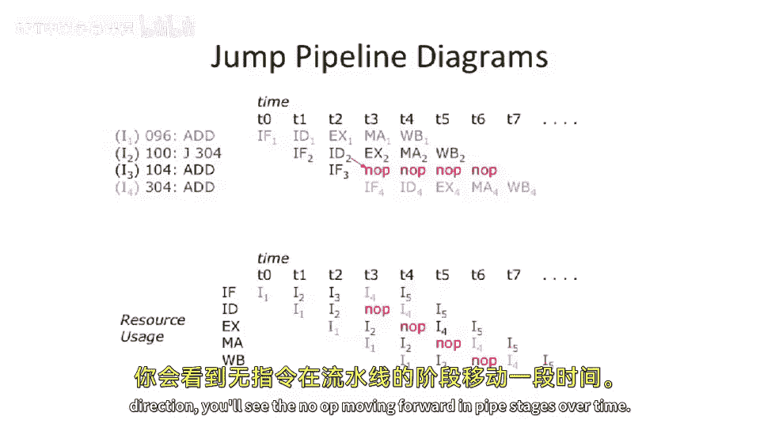

# 【计算机体系结构】普林斯顿—中英字幕 p13 12_02_control-hazards-jumps -BV1ii421D7WR_p13-

Okay， so today we're going to start our third installment of。Ely 475 computer architecture。

 And this is going to be more review。 And we're going to finish up talking about hazards。 And today。

 we're going to be talking about control hazards。And then a little bit later。

 we're going to start talking about caches and why we have caches。

 So let's start off by looking at control hazards and just to recap the four different types of or excuse me。

 the three different types of hazards we've talked about in this class so far，re。

 we're talking about structural hazards， data hazards。

 And now we're gonna to talk about control hazards。Okay， so why， or excuse me。

 what do exact information do we need to calculate the next program counter。HWell。

 is it the same thing for every instruction。When we go to execute arithmeticologic instruction。

 to add instruction。Do we need the same information to calculate the next program counter？

 You might say， well， isn't there some piece of magical hardware which just calculates the next program counter？

 Well， yes， but we need to talk about what that magical piece of hardware is。😊，So。As you might guess。

 it's actually different for branches and jumps than it is for sort of more traditional instructions or。

 or arithme logic instructions or everything else。 So let's start off by looking at jumps。

So if we look at a jump。A jump。 You need to look at the app code to make sure that it's actually a jump。

You also need to look at the offset within the instruction。

And you please look at the current program counter， and you take that all together。 and you're like。

 oh， it's a jump。 The decoder says it's a jump。The decocode pipe stage of your processor says， okay。

 it's a jump。 And then you can take the program encounter， add it to the offset。

 And you probably need to do that either in AL U or you need a special adder to do it。

 And the pipelines we've drawn so far on our five stage pipe， we had a special adder just for that。

And you do that offsite calculation。 and then you want to go and vector your machine。

 So the next instruction you go to execute is at the target of the jump。Now。

 this gets a little more complicated when you start to look at jump register。So jump register。

You don't know where you're going until you go decode the instruction。

 fetch the information from the register file。 Com， At least you don't need to do some conditional。

Calculation， but you will down here。 But we're just gonna to look at the app code to know that it's a jump register。

 We don't need to look at any offset because we are jumping directly to a register value in something like Mips。

In other instruction sets， you might need to look at other sorts of。Information so you might have。

 for instance， a register， indirect jump register type of instruction。

Or even a memory indirect jump sort of instruction。Conditional branches。

 now things start to get a little more complicated。 We need to look at the op code。

 We need to look at the current program counter。We need to go look at the register。

 which is going to give us the condition。 So we're branching based on whether some value is。

 let's say， greater than or less than 0。Okay， so we need to go look at that。

 But we don't really know that until quite bit farther down the pipe。

And we also need to take the offset and add it to the program counter when we do a PC relative conditional branch。

 That's how it's defined in mips。 in other instruction sets， you can have different types of。

Conditional branches， either a absolute addressing scheme or something where it might be register。

 register， indirect or or some， some other thing like that。 But for Mips。

 we're just going to take program counter。Add it to our offset。

And branch that if the register is that we， the register， the condition is what we are looking for。

 If not， you want to just fall through and go to PC plus 4 or the next instruction。 if you。

 if your instruction is for bys long。Okay， everything else。Believe it or not。

 we do need to actually think about this case。 It's not some magical piece of hardware。

 We're gonna discuss this magical piece of hardware today。 You need to take the op code。

And you need to take the PC and you need to add some constant to it to compute that， you know。

 you want to fall through to the next， next instruction。So， you know。Well we're looking at this。 We。

 we might have to look at the program counter。 We also have to look at information。

 which comes at different stages in the pipeline。The op code doesn't get decod probably until something like the decode stage。

Registers don't get fetched， let's say， until the instruction register fetch or decode stage。

And for condition， you may even need to do some comparison of 0 or comparison of another register。

 So you need to do some math or run it through your A U in your execution stage。

Something like jump register is similar there。 You're not gonna know the destination until maybe once you've gone to the either execute stage or possibly way way at the end of the decode stage。

So let's take a look at a basic。Control hazard。And the basic control hazard is we want to execute an instruction。

And we want to fall through to the next instruction。Which sounds。Pretty basic。 But you would say why。

 why is there any structural hazard there。 We're not changing the control flow。

 So let's draw the pipeline diagram。Assuming that we have no branch delay slots in our architecture。

 we'll talk more about branch delay slots in a second。Let's。Draw a pipeline diagram here。

 So we're going to plot time。That we're going to step through。A basic instruction sequence here。

And this basic instructions actually， let's start here。

 We're going have instruction 1 and instruction 2。Instruction 1。Is。

Taking some register and adding it to something else。

 We talked about there being data dependencies or data hazards。 In this case。

 there is no data dependence and no data hazard here。

 You'll see that this is writing to register R 1， And this is reading from register R 2。

 So there's no， there's no data hazards here。 We just want to look at the the control hazard。

The first instruction just goes on the pipe， fetch， decode， execute， memory， write back。

And our five stage MIps pipe。The second instruction starts going down the pipe。

And it first goes into the， the fetch stage。But the problem here is we actually need to stall the fetch stage。

 or we need to be because we don't know that the second instruction is the second instruction yet。

 We don't， for instance， we don't know that this first instruction is not a branch or a junk。

So we don't know the address of the next instruction。That's kind of odd。 Now。

 why do we not know this so。Going back to this example here。

One thing that's common through all of these different cases is that they all need to decode the op code。

Well， where do we do the decoding of the out code？ We don't do that。Until the decode stage the pipe。

So we don't do that until here。And we're not able to use that information。Until the end of the cycle。

 which would be sort of here， and we would need that information to determine what's going on here。

 So if we had a branch for instance， here， it's not able to get around and change the program counter and change what is being indexed into the instruction memory。

On this cycle。So what we're gonna have to do is we're gonna have to insert a decode bubble here for this structural hazard。

Now， we sort of play this forward。For more instructions。

 what you're going to realize is this is not very efficient。

Every instruction that goes down the pipe is going to hit a control hazard。

 and every instruction that goes down the pipe， you're basically going to hit this decocode decoding hazard and。

Every instruction now takes two cycles。 So your clock per instruction for this。

Is not going be very good。 Let's， let's analyze that now so we can。

 we can draw this in the other pipeline diagram。M。Axes and see that what's happening here is where。

Let's take the execute stage。 We're executing instruction I 1。 Then we're nooping instruction I 2。

 No op， I 3， No op and。And you compute this all out。 You end up with a CPI of two。

 So your machine is running as strictly half the performance that you want it to run at。Well。

 that's not very good。So let's start to talk about some techniques to。

Mittigate the effect of control hazards。 And we're going to actually have a whole lecture later in the course about branch prediction。

 which is one of the main techniques in order to mitigate control hazards。But let's。

 let's move forward here and take a look at one of these techniques。

 And this technique is speculation。 So what's the solution to this。

 So the most basic solution is we actually speculate that the next address is going not be a branch or or the the current instruction is not gonna be a branch。

 The next address is going to be the PC plus 4。So what does this look like in a pipe？

There's this nice adder here。 We're gonna take the PC。

 And if nothing else is happening sort of layer down in the pipe。

 we're just gonna be selecting PC plus 4 on this control path here。 So we're just gonna be sort of。

Walking down here， we're gonna be doing executing 96，100，1，0，4。

 And we're not actually going even look at the instruction until let's say something else more interesting happens。

So we can just speculate。That the next， next address is。PC plus 4。So that's great。

 but they add some wriggles。What happens when we have like a jump here。HSo this jump。

 if we speculated PC plus 4， we went and fetched instruction 3 here， which is at address 10，4。

 But the jumps says we're supposed to go to 3，0，4。 So this instruction。

Is not even supposed to execute。 So we need some mechanism to kill instructions in the pipeline。

 kill live instructions in the pipe。So how how do we go about doing this。诶。Let's。

 let's look at a brief example here。So。We need some way to。Kill an instruction。

And what we're gonna do is we're gonna add a multiplexer here。Which will。Mulipx in a no op。

And if we have a jump that gets to the。Decode stage of the pipe。We're going to wire back in and say。

 oh， that instruction that we just executed or the instruction we just fetched。This one here。

It it's not actually supposed to go down the pipe。 We should。 We should kill it。

 So we're going to swing this mus。 And right the end of the cycle。 We're gonna to say， no。

 it's actually a no op。 We're going insert into the pipe。

 And we're gonna redirect this multiplexer here to the actual jump location。

And this is what I was talking about before about the extra adder here。 here's our extra adder。

 which is computing our destination。 and sometimes people try to sort of put these two things together。

 but we're going take part of the instruction and we're going take the current PC and add to that。

 and that's going to compute our new destination of the jump。嗯。Yeah， sorry。

 So here's the control on this mux。 We just have to look to see if it's a jump or jump and link。

 And then we insert a no op。 Otherwise， we actually take the thing coming out of the instruction memory。

So let's look at this serve as things flowing down the pipe。 if we have。Instruction1。Bad。

At the beginning of the execute stage， instruction2 here now in the decode stage。

 and we just fetched 104 out of the PC。As we。Go forward one cycle。

We're gonna actually take what we took out of the instruction memory that was 1，0，4。 and we're gonna。

Kill it and put a noop its place。 The jump is now entering the execute stage。

 The ad is entering the memory stage。 and we've redirected the front of the pipe here。

 and we're actually fetching now the destination of the jump or the instruction F 304。

So important question pops up here on the screen。What happens if we have a stall and a jump in。

The decode stage at the same time。Are there interactions here that we should be worrying about？

HmThat's a tricky one。The first question is what is a jump？

What are reasons that a jump would actually stall in the decode stage？It's not a whole lot。

a basic pipe， probably a jump would not actually stall in the， in the decocode stage。

 in more complex pipes。 you know， there are sometimes just stall signals that say there's some big structural conflict later in the pipe。

 Just stall the whole rest of the pipe。 So it is possible for things to stall。

One important thing is that in a， in a very simple pipe like this， if you have of a stall。

 let's say there actually is some reason this jump is stalling and you have a a jump in that stage。

 What happens sort of do we kill the instruction， Do we let it go forward。

 Both of them are actually possible to do。More complex pipes might even think about， actually。

Allowing the jump to happen and sort of squishing out any no ops to get inserted later on in the pipe。

 And let's， let's look at that from a pipeline diagram perspective， because that might。

Shed a little light on this， and。Instead of drawing this instruction is continuing down the pipe。

 we're just gonna put no ops here or dashes there。So the first instruction goes on the pipe。

 The jump goes on。 the pipe doesn't install on anything because we have the PC plus 4 speculation。

There's no stall here。This ad gets fetched。But doesn't ever make it into the next stage of the pipe because it gets killed。

Then， we have。The next ad， the target of the jump。Showing up and we go and execute that。

And if we look for the resource utilization， we can plot it the other direction。

 you'll see the Noop moving forward in pipe stages over time。

