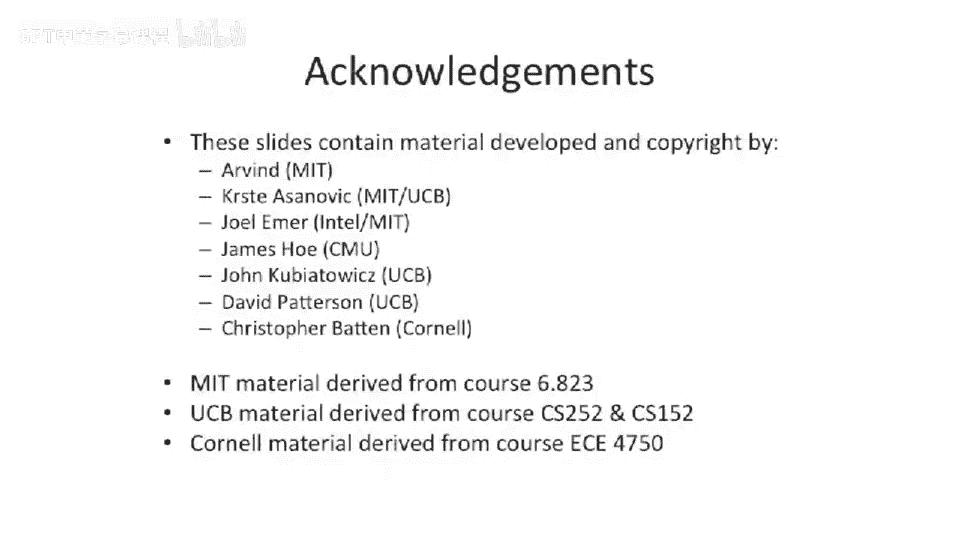

# 【计算机体系结构】普林斯顿—中英字幕 p14 13_03_control-hazards-branch -BV1ii421D7WR_p14-

Let's look at a little more complicated case。 We talked about control hazards due to jumps。

 Let's put the control hazard one cycle later。And an good example of that is something like a conditional branch。

 So here we have a piece of code。Add branch。And it's branching to 200。Bs into the future。

If you take 100 branches on MIPS are relative to the subsequent instruction。

 so it's PC plus 4 plus the offset， so we're going end up at 304。And， let's。

Walk through this case here。 We have。I1 is our。First， add。

We have the branch sitting at the decocode stage。And we have some decode logic， which is saying。

 is this a branch。Okay， the， the next question， though， is。

How do we compute whether this a branch is being taken or not， Can we do this in the decocode stage。

Unfortunately。We need to do a comparison here。And this comparison， the。

 the hardware we want to use to do the comparison is in the A L U。 It's a。

 you know subtract operation or a comparison operation。

 So this fits well within our athmeticologic unit。And we have the zero wire coming out。

So what this is gonna to do is instead of having one cycle of latency or one cycle of。

Kills being inserted。 We might have to insert two cycles。Because now。

We have to wait for the branch to get to here。 And if we are predicting PC plus 4。

 we're speculating PC plus 4。We will actually fetch more data， so let's walk through this。

So the branch moves forward。Wen。Cycle forward here。

And what you'll see here is we're actually fetching 1，0，8。So we're fetching the next。

 next instruction。But these two are both potentially dead。Or we want to kill both of these。

 But we don't know whether to kill them。Until we get this zero wire here。吓。Okay， so at that point。

 we can redirect the front of the pipe and we can insert a no up。

So that's going to change the logic that connects to here。

We're also going to have to insert a no op here， because we fetched。104 at that time。

Into this point of the pipe。So if a branch is taken。We need to kill the next two instructions。And。

The instruction of the decocode age。Is effectively invalid。 So we need to swing this mu here。

 So we're gonna have to add an extra control line onto this multiplex here。And now。Stalling。

And killing makes a lot more difference。The stall signal。Has to effectively be。

Killed or nullified at this point。 And why is this important， Well， let's say。

We are stalling the front of the pipe and where to take priority。

That would stop this register from moving and stop this register from moving as this red lines come in。

So if the stall were to take priority， you could have an instruction here。Which is， let's say。

 dependent on some stall condition or turn on some data hazard or depend on some random hazard。And。

You have a branch， which is branching to someplace else。 So let's take this。Instruction here，1，0，4。

 which is an ad， is dependent on something installing the front of the pipe。But the same time。

 you want to。Kill。Because you took the branch， you want to kill that instruction。

If you were to put the stall at the higher priority。

 you'd actually end up with a deadlock because you'd be stalling。

 but you would have no way of killing the previous instructions to clear the stall。

So this is why it's really important that that the instruction at the decode stage stage is now invalid。

So unlike the， the jump case where well， you might go do either way with the priority of the stall and the killing wires here。

The kill has to take precedence。Or the redirect has to take precedence。

 And that's going to redirect the front of the pipe and basically clear out everything here。

 And if you were to stall it， you would not be clearing it out。 So instead， you need to kill， kill。

 sort of turn these all into no ops and redirect the front of the pipe to go fetch the actual target of your branch。

 of your conditional branch。Yeah， sorry。 This is just drawing now that。This。

Branch information has to go into this multiplexer and go into this multiplexer。

The other thing that's important here for branches is。

We need to figure out the address that we're actually branching to。

 And we'll talk about this more when we get to branch prediction later in the course。But。

What you're gonna have to do is you have to take the PC plus 4 and add it to the branch offset because on something like Mips。

 there's PC relative branching。And the other thing is。

 we can't reuse this A L U necessarily to do that。 You could potentially reuse this A L U if you were microcoding your design。

 But unfortunately， we need this A L U to do the。Branch comparison。

So we need to add another adder here to comp the target of our branch。Now。

 some people get smart on the way they build this。 And you can actually see some things where people will try to reuse the main processor pipeline A L U to do the branch offset calculation。

 And maybe try to do this comparison， because if you have simple enough branches。

 You can do the comparison with less hardware than a full ladderer。 That's another option。

 Let's hold off talking about that until a little bit later。Okay。

 so now we get to talk about the stall signal。And， in， in detail。 So we have， we start off in。

Blue here at the top， the stall signal we had from before。

 So you need to check the data penencies of and check for data hazards between the registers of the source opera ends。

 these are the R S and RRT against in the decocode stage against the other stages in。

 the execute stage and the memory stage and and the right back stage and make sure that you both reading the registers and you check the right enables to make sure that the respective instructions in the different pipeline stages are actually writing to the different locations。

But now we add another term。We had a。Branch term。So， we need to know whether。

There's a branch going on here。Because we need to unstall。The processor。If the branch is taking。

So we're going to add not。This is effectively。It is a branch zero and zero。😡，Likewise， this is。

It's a branch， not zero。And the value is not 0。 So these， these two terms are basically saying。

 a branch is happening。It's in the execute stage。And we'll say that the branch is being taken。

 So if it's。A zero branch， and the result is 0。 It's taken。 Or if it's a not not equal zero branch。

 it's not taken。And。Why。Don't we stall the branches taken。

So it's the same question we had on the previous slide。You have a branch。

It's happening if we stall the front of the pipe。The structure of the decode stage has to be unstalled to get that out and to clear it out。

So the instruction decoage is now invalid， so we don't want to pay attention to any of the stall information。

It's just like a red herring or it'， it's a piece of information you shouldn't be paying attention to。

 So you want to have the instruction of the deco stage be turned into an unval or invalid instruction。

Okay， so now we get to talk about the control equations for the program counter and the instruction register multiplexors。

So let's start off by talking about PC source。And。So I want to remember what that is。

 that's way up here。It's the inputs this multiplexer。

And that's going to select where we're branching to or where。

 excuse not necessarily where we're branching to， But the pro of the next instruction we're gonna fetch on the next cycle。

 And it's on the next cycle because this is a flip flop。 Its a little bit of control equations here。

 Just I wanted to point sort of to， two basic things out in this。The these equations is that。

Older instruction。Or the thing that's farther down the pipe is going to get precedence over younger instructions。

And for the control signals going down the pipe。So if we look at。

This PC muck selected actually has things coming out of different stages of the pipe。

 We have something which is redirecting for a jump。Out of the decode stage。

And then we have these signals here， which are coming out of the execute stage。

Which is strictly farther down the pipe。And。This needs to take precedence over that。

 So if you have a branch， which is directly followed by a jump。

The jumps can be seen They're trying to sort of swing the control on the PC select mus or the next program counterms。

 And you can't let that happen。 You have to let the branch that's actually executing。

 take precedence over that。's， that's really why we wanted to get across from this。

 And you'll see that similarly here， the branch takes precedence over the jump and link for the other control signals。

Let's look at this from a branch pipeline perspective。So， we。

Draw the pipeline diagram for branch executing。For our example。And。

What you' notice real fast here is。If you take a branch。And you actually execute the branch。

 and take the branch。You're going to be adding。2。Extra instructions here。In this case， 104 and 108。

 and they get killed。As they go down the pipe。And this is going to impact。😡，A。CPI in a negative way。

 And what's happening is this execute the， the branch， which is in the execute stage。

 is going to reach back and kill these instructions in the no ops。And we can plot this in the。

 in the other other dimension also。 But you'll see， So now we need to think hard。

 Is this a good thing。Well， we speculated。That the instruction。

Was or the next instruction was going to be PC plus 4。

 the address of the next instruction was going be PC plus4。So we took something where the CPI was。

 let's say，2。Machine with CP is2， and we cut it down a little bit in the common case。But jumps。

 the CPI stills back up to two and here。The CPI is three。Now。

 in our speculation case or our no speculation case， if we had a branch。

 we would probably have to stall for three cycles anyway to know the destination of that branch。

 So this didn't really hurt us in that case。 The CPI， in that case was also 3，4。

 a branch instruction。Okay， well， but this still isn't good。

 I don't want every single branch I take to have a CP of of three。

 So let's talk about some ways to mitigate this cost。And how do we reduce？The branch penalty。Well。

 one way to do it。Is。We can actually add a comparator。

One stage earlier and have it resolved in the same timeline as something like the jump。

So how do we do that？Here we have a register file。😡，This is in the decocode stage of the pipe。

 This is the fetch stage。What do we really need to do for a branch？ Well。

 we need to know that it's a branch。So， we do some decode。

And we need to know whether it's a branch zero or a branch， not zero， for instance。

 if those the in two branches in our architecture。And。We need to know that， let's say register one。

Is zero or not zero。So some people came with this smart idea that we can add a zero detector。

Onto the register file output。And by adding the zero detector into the register file output。

We'll know which way the branch goes。So this， this the zero detector。

 one of the interesting things is this is actually a little bit easier than doing a full comparison with 0。

Because to do a zero detect， you can basically build a optimized。Or tree。

 And then either take the negation of it。 And sometimes people even do this with sort wire doors or more analog circuits。

But this is effectively a big ore gate where you or in all 32 B。

 If you have a 32 B processor and then take the knot or take the the。诶。The bit itself。

 And this is easy for  zero to detect。 This can get harder for different types of branches。

 If you have something like a branch equals。BEQ instruction。You can't use， well。

 you can't use zero detector。 What you have to do instead is somehow actually do a full comparison between two of the source opera。

 And that usually takes more time。So the the nice thing about this is that。It'll take your。

 all your branches and take them from a CPI of three when they mispredict。

Or when you mis speculateulate。2， two cycles are the same timeline that you had with。A jump。

 So you ended up with the exact same pipeline that we had for jumps now。The downside is that。

This is going to long gate。Your cycle time， because you have this wire coming out and the wire needs to go into the logic which computes PC source。

And this can become a critical path。 And it's critical path because you have to go through the decode。

 That's usually done in parallel。 But you have to access the register file。

 then go through a zero detect and then go into the control logic。

 which computes this and then come around and latch the information or or flip off the information。

 So you can really negative， negatively impact your。Clock period。

 And as we talked about the iron law of processor performance。

You can either get performance by lowering your clocks per instruction。

 or you can get it by lowering your clock frequency。

Or increasing your clock frequency you're lower in your clock period。So these two things trade off。

 so you can elongate your cycle time， which will negatively impact your CP negatively impact your performance or time per program in our iron law of processor performance。

 But on the flip side， you will。Have branches resolve faster。

 So your clocks per instruction or your aggregate clocks for instruction， especially for branches。

 will， will go down。So this is only one approach。Another approach is you can expose it to software。😡。

So we can change the instruction set architecture。 And What's really cool here is the instruction set architect can actually have an impact on what's going on here。

 This's not all micro architecture issues。 It's not all fancy branch predictors。

 as we'll be talking about later。😊，In this course。 But instead， you can expose this。

Problem or this challenge of the time it takes to resolve a branch to the software。

So what we're going to do， what well， I'll define a branch delay slot and a branch delay slot is a architectural。

 when I say architectural， mean big a architectural or instruction set architectural change。

 which allows。Or forces。Some number of instructions after a branch。To always execute。So it could be。

 let's say，1，2，3， or4， some number architecturally defined。And in this delay slot。

 that instruction is。Execed irregard of the direction of the branch。

 And what people try to do with this is。They'll try to take work that was above the branch and move it below the branch。

Because if you know the work's gonna to be done anyway， you can just put it below the branch。

 and everything's okay。But the problem with that is the branch has to not depend on that work that you're moving below the branch。

So typically for very short loops， where there's not much work inside the loop。

 this becomes very problematic because it's not enough work that the branch is not dependent on to move below the branch to have the loop run effectively。

And what we're trying to do here is the compiler has a hand in what's going on。

 or the program writer really has a hand in what's going on。

 because that's what's doing the reordering of the information from above here to below here。

 So let's take a look at an example here where we have a branch。And we have one delay slot。

Some architectures have two or more。 But right now， I'll assume one delay slot。

 And let's also assume that we have this reduction of branch penalty optimization。

 So now branches only have one dead cycle when we're， we're going to execute them。

So what we can do is we can say， okay。The branches at address 100。And this an ad here I address 1，0。

4 in the delay slot executes irregardless of whether the branch gets taken or falls through。

So then we don't actually have to kill the next destruction after the branch。

 We don't have to have all this fancy extra hardware there。 We just have this always execute。

The tricky thing is， many times， as I said， it's hard to fill this branch delay slot。

It'd be great if you could have many， many branch lace slots。

 So if you go look at something like a penium 4， they think they have a 20 odd cycle mis predictdict penalty。

 They could have added 20 delay slots to their architecture。 That would have been really。

 really cool。 But at the same time， the compiler would have to go find 20 instructions for every branch to stick after the branch。

😊，And there's usually just not that much work to be put after the branch which the branch is not dependent on。

 So we have a really hard time filling these branch la slots。 And， and roughly。

 if you go look at something like mips across sort of old spec ins to give you some example here of how often the compiler can actually fill branch la slots。

 I think the， the rough rule of thumb is if you have one branch delay slot， you can usually fill it。

 maybe about 70% of the time on something like spec in spec in is a common。

Benchmark suite that's used throughout the computer architecture industry or the computing industry to measure performance。

 And if you have two branch delay slots， that second branch delay slot only gets filled less than like half。

 half the time。So if you're only filling these slots relatively infrequently。

 you might be better served by coming up of other prediction mechanisms。

And we're gonna talk later in class about not this class， but in a different lecture。

 branch prediction， which is a technique to cover branch latency and to make a branch decision early and we can predict whether the branch is being taken or not taken。

And this can be used to dramatically reduce the branch penalty。

So let's draw the pipeline diagram here of a branch delay slot。

 or architecture has has one branch delay slot。So we， we have the ad flowing down the pipe。

 We have a branch flowing down the pipe。 And now we're going to have this。Next add。

 and architecturally， we've defined that that always executes whether the branch is being taken or not taken。

 So this code sequence， or excuse me， this pipeline diagram sequence here is the same for the branch is taken or whether the branch is not taken。

In this case， we're going to say that the branch is taken and we go to execute。This next ad here。

 But you see that there's no bubbles。There's no no ops being inserted。

 So we've actually improved the performance here。 This is assuming， though， that。

This ad is doing useful work。Now。This is really important to say because。

The compiler or the program writer has to put something here。And if they can't put anything useful。

 they're going to have to put no up。And that's not useful work doing a no operation。

 You might as well as have had the hardware insert， insert a。

The no ops for you and save some instruction coding space。So there's tough trade offs here between。

How often you fill the branch delay slot versus having a branch delay slot。But for right now。

 we'll say branch thoughts are our one good technique to put。

Useful instructions after a branch not have branches stall up。

