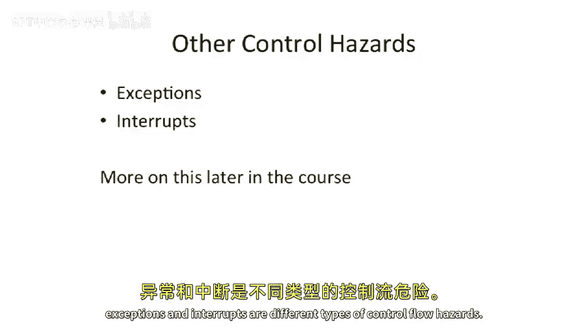

# 【计算机体系结构】普林斯顿—中英字幕 p15 14_04_control-hazards-others -BV1ii421D7WR_p15-

Okay， so let's， we， we're almost the end here of， of control hazards， let's。

Talk about why an instruction may not be dispatched every cycle。Well。Let's， let's think about。

Forwarding。And full bypassing。This is sometimes really expensive to add。

If you're trying to bypass out of every location in your pipe， that may be expensive。

 So we may still want to stall in certain cases。 A good example of this is if you go look at a modern day。

 something like your core I 7 machine。 They actually don't bypass between all the different functional units from all the different locations。

 because they， they can execute about 6 instructions per cycle。

And they have many stages in the depth of their pipe。

 So they'd have to basically be bypassing out 100 different places for every new source opera。

So what you typically will do is you'll figure out what are the common bypasses that are needed。

re the common forwarding paths that are needed， and you'll have those。

And then some of the infrequently used ones， you just won't build。This。

 this will help with your cycle time， but hurt with your CPI。🤧。Loads。

Can have or typically have a two cycle laency。 So we talked about this when we were talking about load to use and the instruction after load。

Cannot necessarily use the result。 Def cannot use the result because the in our five stage mips pipeline。

 the result is not computed until the memory stage。 So if you're in the execute stage。

 you would not have been able to get that， even if you had bypassing out of the， the end of the。

 load， end of end of the load pipe or excuse me end of the memory stage。

And one interesting thing is that the MIPS one architecture。Actually， defined load delay slots。

 very similar to what we have in。what we had discussed with branch delay slot。

So MIps 1 had load delay slots， which were software visible。

Slots that you had to fill and could solve basically this pipelining hazard。

 and the compiler would have to schedule some nondependent instruction。 So it instruction。

 which was not dependent on a load into that that that spot。

 This was ultimately removed out of the ISA and stalling was put back in because as you went to sort of different pipeline lengths and different micro architectureits。

 This， this started to be onerous。 And this is really one of the big problems with both load delay slots and branch delay slots。

 is it's not very micro architecture independent。So as you change the different micro architectureitects。

 if you had， let's say， a pipeline length of five。 and it went to four， all of a sudden。

 maybe you didn't need that branch delay slot or something something like that。And。

I wanted to sort of point out here is this idea here really is encapsulating the name Mips。

 It stands for microprocessor without interlocked pipeline stages。So。

They really did not want to have interlocking here on something like the load to use of that。

And later， in MIps 2。That that was removed and pipeline interlocks were were reintroduced。 So hey。

 you know。We could all find mistakes that we have done have changed it。

 But in the original MIps 1 I S A， they had load。Delay slots。

Another good reason why CPI might be greater than one is we have。Conditional branches。

Which can cause bubbles。 So this was all the control hazards we've been talking about up to this point。

 And you have to kill the instructions if you don't have some sort of delay slots。Now。

I wanted to point out here when we talk about CPI， and this is this note at the bottom of the slide。

 is that。You really want to think about。CPI， from the perspective of a usable CPI， instead of。

How many instructions are executing。 So if you are adding no ops to your program and the no ops are not doing anything useful。

 that does not go into， that should not go into your useful CPI calculation。

Your machine might count that as its valid instructions is going on the pipe because you。

 it is software visible instructions， but that's not a good solution。

 when you should be computing CPI， you should always be thinking about useful CP or CP that's actually towards the end goal of the program。

A couple other control hazards。That we need to talk about in this course are other things that can change your control flow of your program。

And those largely can fall into two different cases here。Exceptions and interrupts。

 And they're both related。 And let's talk about what an exception is。

 So an exception is something where you have an instruction and the instruction does some operation。

 which is invalid or against what the intended。Use of the machine is。 So a good example of this。

 a couple， couple good examples is you divide by 0。You take some value， divided by 0。 Well。

 on most computer architectures， this is ill definedfined or undefined。

 So you'll actually get an exception， which is a divide by zero error error。

 And you could go try this out。 If you go log into your computers and go write little C program。

 take some number， divided by 0， you're gonna get a div by 0 error。

 if you're running a Linux and get something similar。 if you're running on Windows and。

Another good example of exceptions is things like a memory fault。

 you're trying to access memory you're not allowed to go access some underflow and overflow exceptions in certain architectures。

 If like number precision goes out of out of whack。 if you have a floating point number。

 which becomes too large or too small and the floating point arithmetic can handle the precision。

 you'll sometimes get underflow and overflow exceptions。

And then interrupts our external things happening。 And what's So something like a timer tick going off or I O device trying to wake up your processor or do something into your processor。

 And why these are important and why these are control hazards is these are unexpected things sort of coming into the the instruction stream。

 And it's going to change。The subsequent instructions that are executing。

 So there is really a control hazard。 It's changing the program control flow。

And we're going to be talking a lot more about exceptions and interrupts later in this course。

 But I just wanted to get this idea across in this review so far that exceptions and interrupts are different types of control flow hazards。

